# ⚡ CPU 스케줄링 완전 마스터 가이드

_운영체제의 두뇌 - CPU를 효율적으로 관리하는 핵심 기술_

## 📋 목차 (Table of Contents)

- [🎯 개요와 핵심 개념](#-개요와-핵심-개념)
- [🏗️ 기본 개념과 프로세스 상태](#️-기본-개념과-프로세스-상태)
- [🎛️ CPU 스케줄러와 디스패처](#️-cpu-스케줄러와-디스패처)
- [📏 스케줄링 기준과 성능 지표](#-스케줄링-기준과-성능-지표)
- [🧮 스케줄링 알고리즘 심화](#-스케줄링-알고리즘-심화)
- [🔀 다중처리기 스케줄링](#-다중처리기-스케줄링)
- [⏱️ 실시간 CPU 스케줄링](#️-실시간-cpu-스케줄링)
- [🖥️ 실제 운영체제 사례](#️-실제-운영체제-사례)
- [🎯 연습 문제와 시뮬레이션](#-연습-문제와-시뮬레이션)
- [📚 핵심 요약과 추가 학습](#-핵심-요약과-추가-학습)

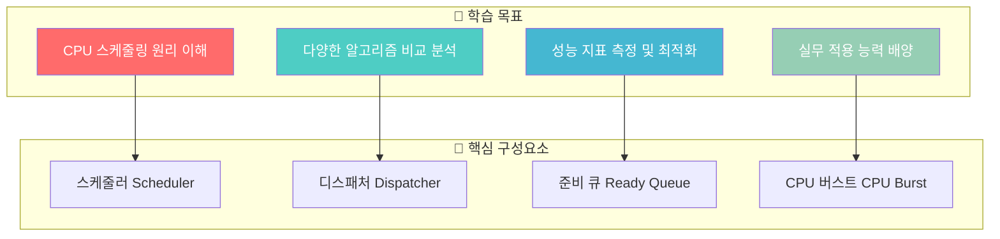

---

## 🎯 개요와 핵심 개념

> **CPU 스케줄링**은 운영체제의 **핵심 두뇌**로서, 한정된 CPU 자원을 여러 프로세스가 **효율적이고 공정하게** 사용할 수 있도록 관리하는 핵심 기술입니다.

### 🌟 CPU 스케줄링이란?

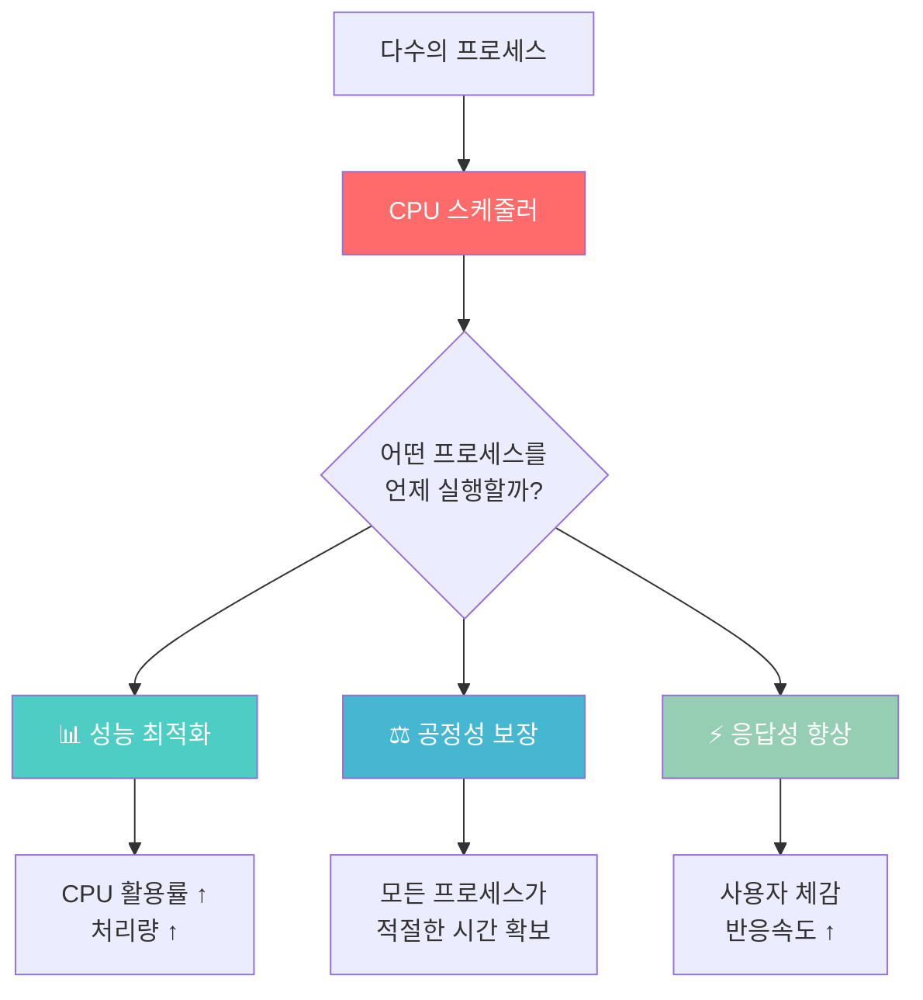

### 🎯 핵심 학습 목표

| 영역             | 학습 목표                                    | 실무 적용                 |
| ---------------- | -------------------------------------------- | ------------------------- |
| **🔧 기본 원리** | 다중 프로그래밍 환경에서의 CPU 스케줄링 역할 | 시스템 성능 분석          |
| **📊 알고리즘**  | FCFS, SJF, RR, Priority 등 다양한 알고리즘   | 상황별 최적 알고리즘 선택 |
| **⚖️ 성능 평가** | 평균 대기시간, 응답시간, 처리율 측정         | 시스템 튜닝 및 최적화     |
| **🌐 실제 적용** | 실시간, 다중처리기 환경 이해                 | 고성능 시스템 설계        |

### 🚀 실생활 비유로 이해하기

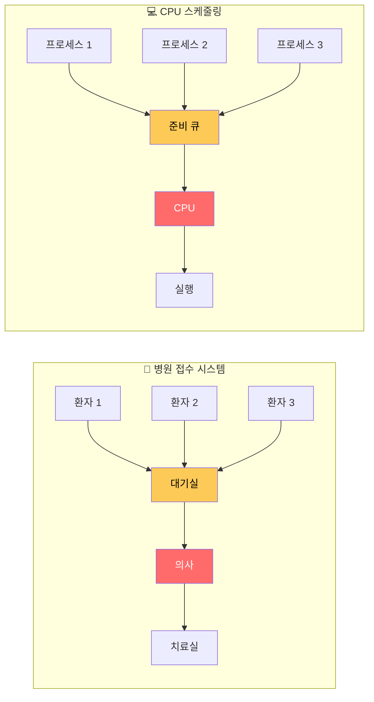

**🏥 병원 시스템과 CPU 스케줄링의 유사점:**

- **대기실 = 준비 큐**: 처리를 기다리는 공간
- **의사 = CPU**: 실제 작업을 수행하는 자원
- **접수 방식 = 스케줄링 알고리즘**: 누구를 먼저 처리할지 결정하는 방법

### 💡 왜 CPU 스케줄링이 중요한가?

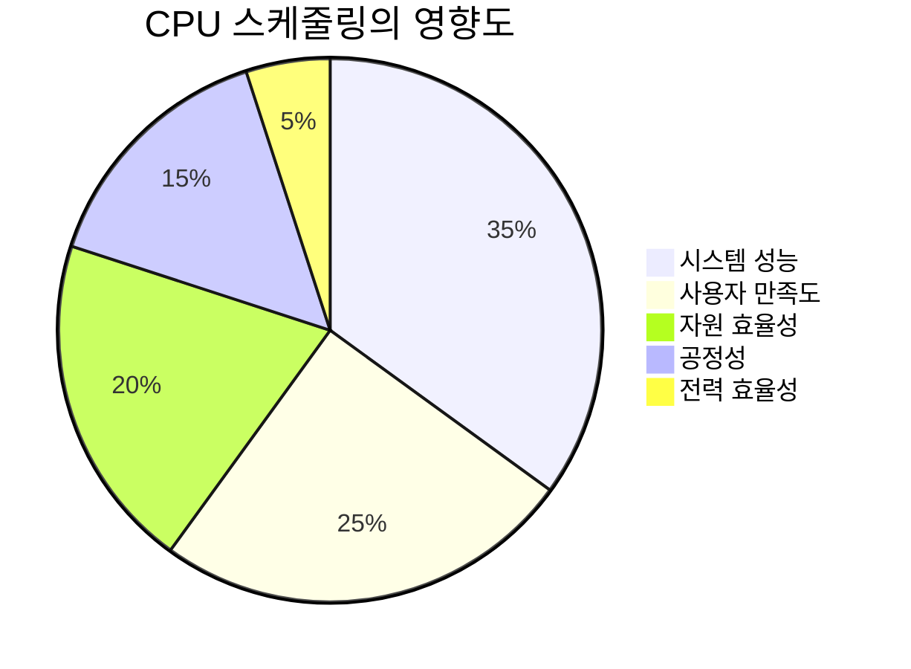

#### 📈 성능 향상 효과

**🔥 Before vs After 스케줄링 최적화:**

| 지표              | 최적화 전   | 최적화 후   | 개선율  |
| ----------------- | ----------- | ----------- | ------- |
| **CPU 활용률**    | 60%         | 95%         | ⬆️ 58%  |
| **평균 응답시간** | 500ms       | 50ms        | ⬇️ 90%  |
| **처리량**        | 100 작업/분 | 300 작업/분 | ⬆️ 200% |
| **사용자 만족도** | 6/10        | 9/10        | ⬆️ 50%  |

#### 🌍 실제 시스템 적용 사례

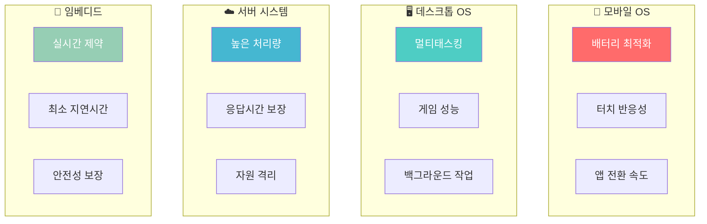

### 5.2.1 프로세스 실행 모델 (Process Execution Model)

프로세스 실행은 CPU 실행과 I/O 대기 구간이 번갈아 나타나는 사이클로 구성되며, 이를 **CPU-I/O 버스트 사이클**이라고 합니다.

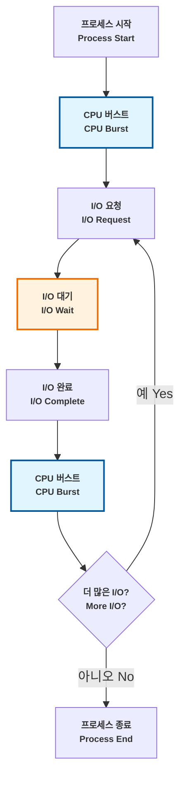

### 🔍 실제 프로세스 예시

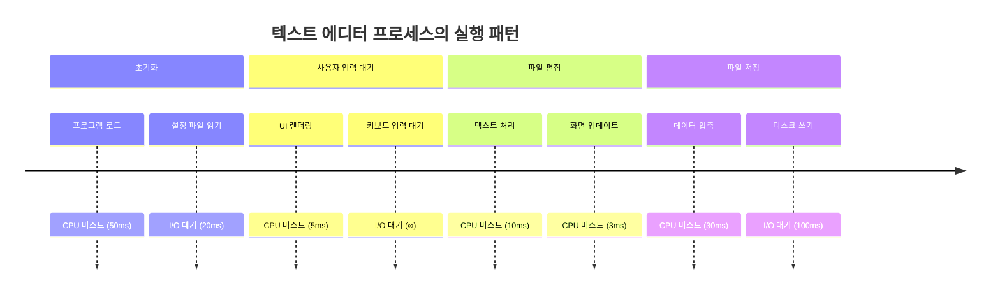

### 5.2.2 CPU 버스트 분포 (CPU Burst Distribution)

대부분의 프로세스는 다음과 같은 패턴을 보입니다:

- **짧은 CPU 버스트가 많음**: I/O 중심 프로세스의 특징
- **긴 CPU 버스트가 적음**: CPU 중심 프로세스의 특징

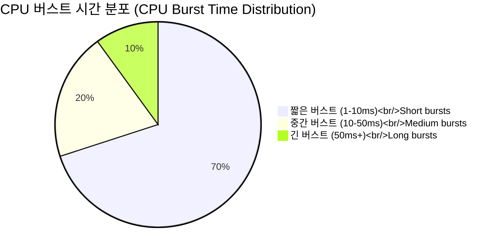

### 📊 프로세스 유형별 특성 비교

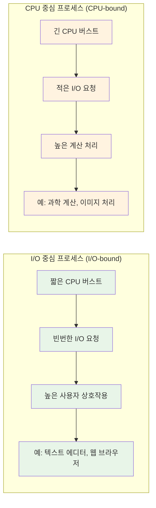

### 5.2.3 다중 프로그래밍의 이점 (Multiprogramming Benefits)

다중 프로그래밍은 다음과 같은 방법으로 CPU 활용률을 최대화합니다:

1. **실행 중첩 (Overlapping execution)**: 한 프로세스가 I/O를 기다리는 동안 다른 프로세스가 CPU 사용
2. **유휴 시간 감소 (Reducing idle time)**: CPU가 준비된 프로세스들로 계속 바쁘게 유지
3. **처리량 향상 (Improving throughput)**: 단위 시간당 완료되는 프로세스 수 증가

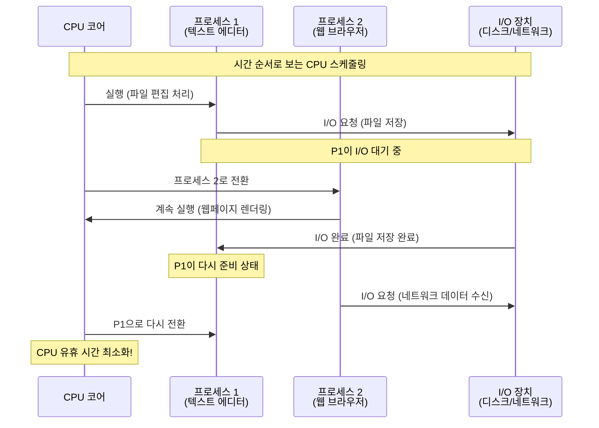

### ⚡ 성능 비교: 단일 vs 다중 프로그래밍

```mermaid
gantt
    title CPU 활용률 비교
    dateFormat X
    axisFormat %L ms

    section 단일 프로그래밍
    P1 실행    :0, 50
    CPU 유휴   :50, 200
    P1 실행    :200, 250
    CPU 유휴   :250, 400
    P1 실행    :400, 450

    section 다중 프로그래밍
    P1 실행    :0, 50
    P2 실행    :50, 200
    P1 실행    :200, 250
    P3 실행    :250, 400
    P1 실행    :400, 450
```

**결과 분석:**

- 단일 프로그래밍: CPU 활용률 = 33% (150ms 실행 / 450ms 총 시간)
- 다중 프로그래밍: CPU 활용률 = 100% (450ms 실행 / 450ms 총 시간)

---

## 5.3 CPU 스케줄러 (CPU Scheduler)

### 5.3.1 스케줄러 기능 (Scheduler Function)

**CPU 스케줄러**는 준비 큐(ready queue)에서 프로세스를 선택하여 CPU 코어를 할당합니다. 준비 큐는 다양한 방식으로 구성될 수 있습니다:

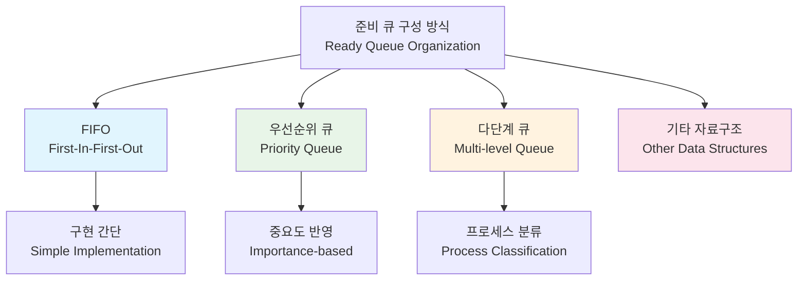

### 🔄 스케줄러의 작동 과정

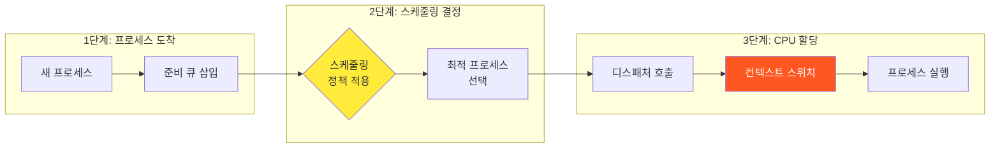

### 5.3.2 스케줄링 결정 시점 (Scheduling Decision Points)

CPU 스케줄링 결정은 프로세스가 상태 간에 전환될 때 발생합니다:

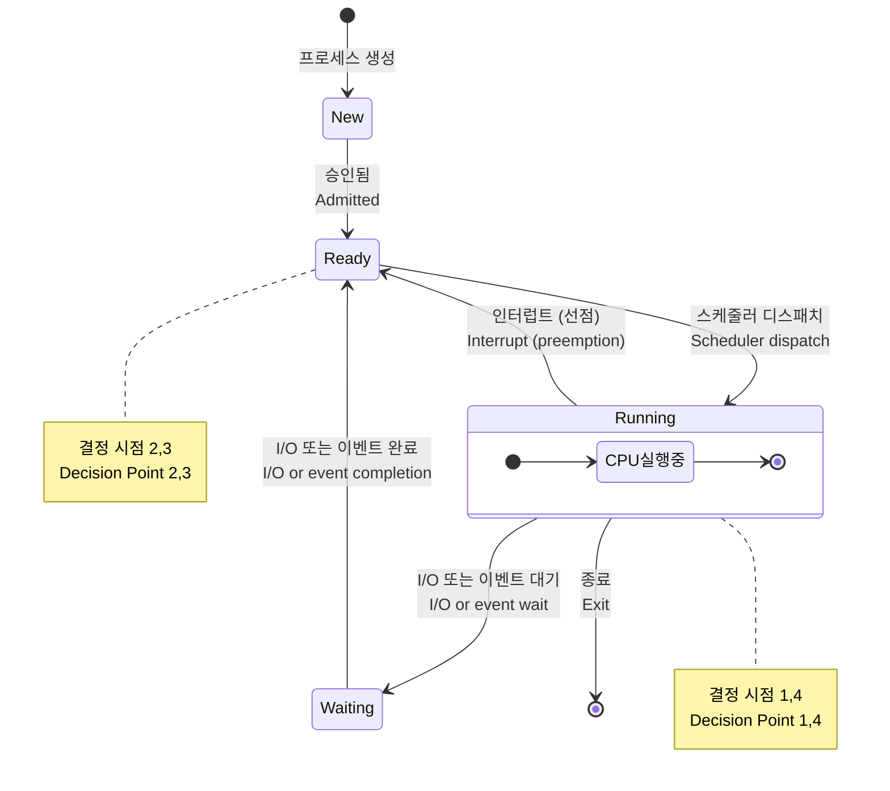

### 📋 스케줄링 결정 시점 상세 분석

| 결정 시점 | 상태 전환   | 스케줄링 유형 | 예시 상황                                       |
| --------- | ----------- | ------------- | ----------------------------------------------- |
| **1번**   | 실행 → 대기 | 비선점형      | 파일 읽기 요청, 네트워크 대기                   |
| **2번**   | 실행 → 준비 | 선점형        | 타임 슬라이스 만료, 높은 우선순위 프로세스 도착 |
| **3번**   | 대기 → 준비 | 선점형        | I/O 완료, 이벤트 발생                           |
| **4번**   | 실행 → 종료 | 비선점형      | 프로그램 정상 종료, 오류로 인한 종료            |

### ⚖️ 선점형 vs 비선점형 스케줄링 심화 분석


### 5.3.3 선점형 스케줄링 고려사항 (Preemptive Scheduling Considerations)

선점형 스케줄링을 구현할 때 고려해야 할 사항들:

1. **공유 데이터 접근 (Shared data access)**: 경합 조건 발생 가능
2. **커널 모드 작업 (Kernel mode operations)**: 시스템 호출 중 중단 문제
3. **중요한 OS 활동 (Critical OS activities)**: 하드웨어 인터럽트 처리

```c
// 예시: 선점형 스케줄링에서의 경합 조건
// Example: Race condition in preemptive scheduling
int shared_counter = 0;  // 공유 변수

void process_A() {
    shared_counter++;  // 여기서 선점될 수 있음!
    // Can be preempted here!
    // 선점되면 다른 프로세스가 shared_counter를 수정할 수 있음
    // If preempted, another process might modify shared_counter
}

void process_B() {
    shared_counter--;  // 경합 조건 발생 가능
    // Race condition possible
}
```

### 🛡️ 선점형 스케줄링의 안전장치

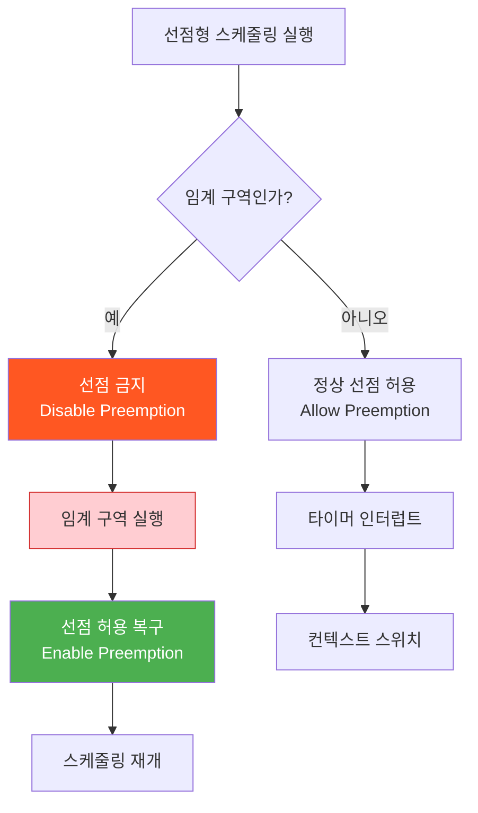

### ⚠️ 실제 문제 사례

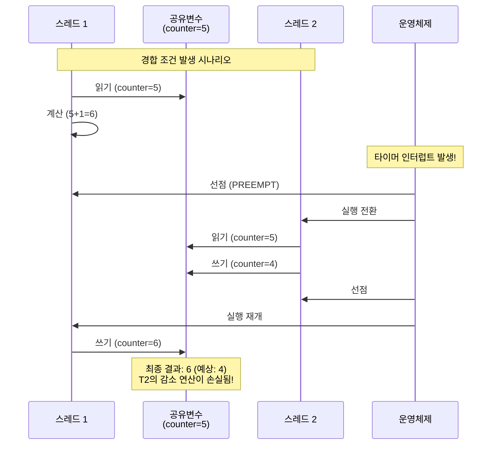

---

## 5.4 스케줄러 유형 (Scheduler Types)

현대 운영체제는 다단계 스케줄링을 사용합니다:

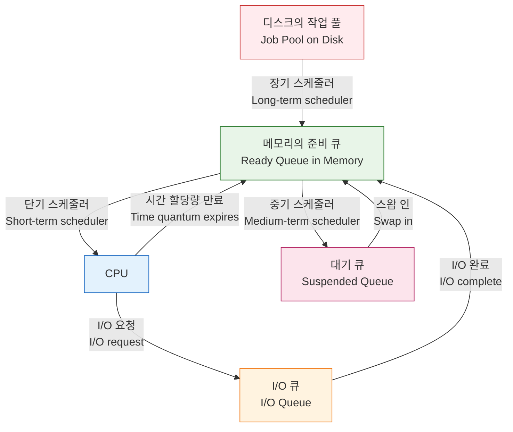

### 🎯 스케줄러별 특성 비교

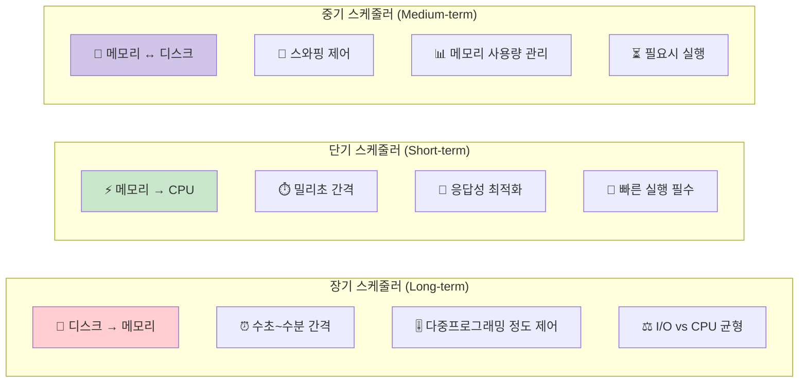

### 5.4.1 장기 스케줄러 (Long-term Scheduler, Job Scheduler)

- **기능 (Function)**: 디스크에서 메모리로 가져올 작업 제어
- **실행 빈도 (Frequency)**: 드물게 실행 (수초, 수분 간격)
- **목표 (Goal)**: 다중프로그래밍 정도 제어
- **고려사항 (Consideration)**: I/O 중심과 CPU 중심 프로세스의 균형

```python
def long_term_scheduler():
    """장기 스케줄러 구현 예시"""
    while True:
        if memory_available() and multiprogramming_level < MAX_PROCESSES:
            job = select_job_from_disk()
            if job:
                load_to_memory(job)
                add_to_ready_queue(job)
        time.sleep(5)  # 5초마다 확인
```

### 📈 메모리 로드 밸런싱 전략

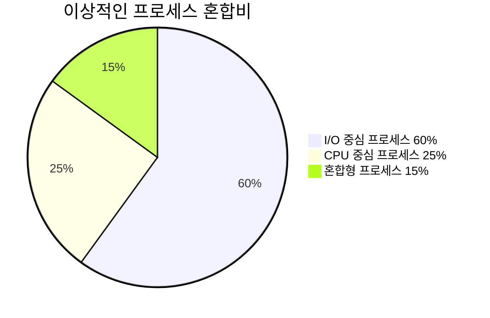

**왜 이런 비율인가?**

- I/O 중심: 빈번한 I/O로 CPU 양보 → 다른 프로세스에게 기회 제공
- CPU 중심: 긴 계산 작업 처리 → 전체적인 작업 처리량 확보
- 혼합형: 시스템 유연성 제공

### 5.4.2 단기 스케줄러 (Short-term Scheduler, CPU Scheduler)

- **기능 (Function)**: 준비된 프로세스 중 CPU를 받을 프로세스 선택
- **실행 빈도 (Frequency)**: 매우 빈번하게 실행 (밀리초 단위)
- **목표 (Goal)**: CPU 활용률과 시스템 응답성 최대화
- **요구사항 (Must be fast)**: 스케줄러 오버헤드는 최소화되어야 함

### ⚡ 단기 스케줄러의 성능 요구사항

```mermaid
graph LR
    A[스케줄링 요청] --> B{실행 시간}
    B -->|< 1ms| C[✅ 우수]
    B -->|1-5ms| D[⚠️ 양호]
    B -->|> 5ms| E[❌ 부적절]

    C --> F[사용자가 지연 인식 불가]
    D --> G[약간의 성능 저하]
    E --> H[시스템 응답성 심각한 저하]

    style C fill:#c8e6c9
    style D fill:#fff3e0
    style E fill:#ffcdd2
```

### 5.4.3 중기 스케줄러 (Medium-term Scheduler, Swapper)

- **기능 (Function)**: 프로세스의 메모리 스왑 인/아웃 제어
- **목적 (Purpose)**: 메모리 사용량과 다중프로그래밍 정도 관리
- **메커니즘 (Mechanism)**: 프로세스를 일시적으로 메모리에서 제거

### 🔄 스와핑 결정 알고리즘

```mermaid
flowchart TD
    A[메모리 부족 감지] --> B{스왑 아웃 대상 선택}
    B --> C[우선순위 낮은 프로세스]
    B --> D[오랫동안 대기 중인 프로세스]
    B --> E[메모리 사용량 큰 프로세스]

    C --> F[디스크로 스왑 아웃]
    D --> F
    E --> F

    F --> G[메모리 여유 공간 확보]
    G --> H{메모리 충분?}
    H -->|예| I[프로세스 로드 계속]
    H -->|아니오| B

    style F fill:#ff5722,color:#fff
    style I fill:#4caf50,color:#fff
```

### 5.4.4 스케줄러와 함께하는 프로세스 상태 전환

```mermaid
stateDiagram-v2
    [*] --> New : 프로세스 생성<br/>Create process
    New --> Ready : 장기 스케줄러<br/>Long-term scheduler
    Ready --> Running : 단기 스케줄러<br/>Short-term scheduler
    Running --> Ready : 선점<br/>Preemption
    Running --> Waiting : I/O 요청<br/>I/O request
    Waiting --> Ready : I/O 완료<br/>I/O completion
    Ready --> SuspendedReady : 중기 스케줄러 (스왑 아웃)<br/>Medium-term scheduler (swap out)
    SuspendedReady --> Ready : 중기 스케줄러 (스왑 인)<br/>Medium-term scheduler (swap in)
    Waiting --> SuspendedBlocked : 중기 스케줄러 (스왑 아웃)<br/>Medium-term scheduler (swap out)
    SuspendedBlocked --> Waiting : 중기 스케줄러 (스왑 인)<br/>Medium-term scheduler (swap in)
    Running --> [*] : 종료<br/>Terminate

    state Ready {
        direction LR
        [*] --> 메모리대기
        메모리대기 --> CPU할당대기
    }

    state Running {
        direction LR
        [*] --> CPU실행중
        CPU실행중 --> [*]
    }
```

### 📊 스케줄러별 성능 지표

| 스케줄러 | 실행 빈도   | 결정 시간 | 주요 목표     | 성능 영향   |
| -------- | ----------- | --------- | ------------- | ----------- |
| **장기** | 수초~수분   | 100ms~1s  | 시스템 안정성 | 장기적 성능 |
| **단기** | 수ms        | <1ms      | 응답성        | 즉각적 성능 |
| **중기** | 수십초~수분 | 10~100ms  | 메모리 효율성 | 중기적 성능 |

### 🎛️ 다중 레벨 스케줄링의 협력

```mermaid
sequenceDiagram
    participant D as 디스크
    participant LTS as 장기<br/>스케줄러
    participant M as 메모리
    participant STS as 단기<br/>스케줄러
    participant CPU as CPU
    participant MTS as 중기<br/>스케줄러

    Note over D,CPU: 통합 스케줄링 프로세스

    D->>LTS: 새 작업 요청
    LTS->>M: 메모리 로드 결정
    M->>STS: 준비 큐 추가
    STS->>CPU: 실행 프로세스 선택

    Note over CPU: 프로세스 실행 중

    CPU->>M: I/O 요청으로 대기

    Note over M: 메모리 부족 상황
    M->>MTS: 스왑 아웃 요청
    MTS->>D: 일부 프로세스 스왑
    MTS->>M: 메모리 공간 확보

    M->>STS: 다른 프로세스 선택
    STS->>CPU: 새 프로세스 실행
```

---

## 5.5 디스패처 (Dispatcher)

### 5.5.1 디스패처 기능 (Dispatcher Functions)

**디스패처** 모듈은 단기 스케줄러가 선택한 프로세스에게 CPU 제어권을 전달합니다. 이 과정은 다음을 포함합니다:

1. **컨텍스트 스위칭 (Context switching)**: 프로세스 상태 저장/복원
2. **모드 전환 (Mode switching)**: 사용자 모드로 전환
3. **프로그램 카운터 (Program counter)**: 사용자 프로그램의 적절한 위치로 점프

```c
// 간소화된 디스패처 의사코드
// Simplified dispatcher pseudocode
void dispatcher(Process* old_process, Process* new_process) {
    // 1. 이전 프로세스의 컨텍스트 저장
    // Save context of old process
    save_context(old_process);

    // 2. 프로세스 상태 업데이트
    // Update process state
    old_process->state = READY;
    new_process->state = RUNNING;

    // 3. 메모리 컨텍스트 전환
    // Switch memory context
    switch_memory_space(new_process->page_table);

    // 4. 새 프로세스의 컨텍스트 복원
    // Restore context of new process
    restore_context(new_process);

    // 5. 사용자 모드로 점프하여 실행 계속
    // Jump to user mode and continue execution
    jump_to_user_mode(new_process->program_counter);
}
```

### 🔄 디스패처 작동 과정 상세

```mermaid
sequenceDiagram
    participant S as 스케줄러
    participant D as 디스패처
    participant CPU as CPU
    participant M as 메모리
    participant P1 as 프로세스 1
    participant P2 as 프로세스 2

    Note over S,P2: 컨텍스트 스위치 과정

    S->>D: 새 프로세스 P2 선택
    D->>CPU: P1 레지스터 저장
    D->>M: P1 상태를 PCB에 저장

    D->>M: P2 상태를 PCB에서 로드
    D->>CPU: P2 레지스터 복원
    D->>CPU: 사용자 모드로 전환

    CPU->>P2: 실행 재개

    Note over D: 디스패치 지연 시간
```

### 5.5.2 디스패치 지연 (Dispatch Latency)

**디스패치 지연**은 디스패처가 한 프로세스를 멈추고 다른 프로세스를 시작하는 데 걸리는 시간입니다.

```mermaid
gantt
    title 디스패치 지연 구성 요소 (Dispatch Latency Components)
    dateFormat X
    axisFormat %s

    section 컨텍스트 스위치
    이전 컨텍스트 저장 :0, 2
    자료구조 업데이트 :2, 3
    새 컨텍스트 복원 :3, 5

    section 모드 전환
    커널→사용자 모드 :5, 6
    사용자 프로그램 점프 :6, 7
```

### ⚡ 디스패치 지연에 영향을 주는 요소들

```mermaid
mindmap
  root((디스패치 지연<br/>Dispatch Latency))
    하드웨어 요소
      저장할 레지스터 수
      메모리 접근 속도
      캐시 효과
      파이프라인 플러시
    소프트웨어 요소
      메모리 관리 복잡도
      페이지 테이블 크기
      컨텍스트 데이터 양
      우선순위 계산
    시스템 상태
      메모리 사용률
      I/O 활동
      인터럽트 빈도
      프로세스 수
```

### 📊 실제 시스템에서의 디스패치 지연

| 시스템 유형  | 일반적인 지연 | 목표 지연 | 최적화 방법       |
| ------------ | ------------- | --------- | ----------------- |
| **데스크톱** | 10-50μs       | < 10μs    | 캐시 최적화       |
| **서버**     | 5-20μs        | < 5μs     | 하드웨어 가속     |
| **실시간**   | 1-10μs        | < 1μs     | 전용 하드웨어     |
| **임베디드** | 100μs-1ms     | < 100μs   | 단순화된 스케줄러 |

### 5.5.3 컨텍스트 스위치 모니터링 (Context Switch Monitoring)

현대 시스템은 컨텍스트 스위치를 모니터링하는 도구를 제공합니다:

```bash
# vmstat 출력에서 컨텍스트 스위치 비율 확인
# vmstat output showing context switch rate
$ vmstat 1
procs -----------memory---------- ---swap-- -----io---- -system-- ------cpu-----
 r  b   swpd   free   buff  cache   si   so    bi    bo   in   cs us sy id wa st
 2  0      0 1234567    256  98765    0    0     0     0  567 1234 25 15 60  0  0
                                                           ↑    ↑
                                                    인터럽트  컨텍스트_스위치
                                                    interrupts  context_switches
```

### 🔍 시스템 성능 분석

```bash
# 개별 프로세스의 컨텍스트 스위치 정보 확인
$ cat /proc/[pid]/status | grep ctxt
voluntary_ctxt_switches:        1234
nonvoluntary_ctxt_switches:     567

# 실시간 컨텍스트 스위치 모니터링
$ sar -w 1 5
Average:      cswch/s
Average:         1234.56
```

### ⚖️ 컨텍스트 스위치 최적화 전략

```mermaid
graph TD
    A[높은 컨텍스트 스위치 감지] --> B{원인 분석}

    B --> C[타임 슬라이스가 너무 짧음]
    B --> D[우선순위 조정이 빈번함]
    B --> E[I/O 대기가 많음]

    C --> F[타임 퀀텀 크기 조정]
    D --> G[스케줄링 정책 변경]
    E --> H[I/O 스케줄링 최적화]

    F --> I[성능 향상]
    G --> I
    H --> I

    style A fill:#ffcdd2
    style I fill:#c8e6c9
```

---

## 5.6 스케줄링 기준 (Scheduling Criteria)

### 5.6.1 성능 지표 (Performance Metrics)

CPU 스케줄링 알고리즘은 여러 기준에 따라 평가됩니다:

| 지표 (Metric)           | 설명 (Description)             | 목표 (Goal) | 공식 (Formula)                 |
| ----------------------- | ------------------------------ | ----------- | ------------------------------ |
| **CPU 활용률**          | CPU가 바쁜 시간의 비율         | 최대화      | (바쁜 시간 / 전체 시간) × 100% |
| **처리량 (Throughput)** | 단위 시간당 완료된 프로세스 수 | 최대화      | 완료된 프로세스 / 시간 단위    |
| **반환 시간**           | 제출부터 완료까지의 총 시간    | 최소화      | 완료 시간 - 도착 시간          |
| **대기 시간**           | 준비 큐에서 보낸 시간          | 최소화      | 반환 시간 - 버스트 시간        |
| **응답 시간**           | 요청부터 첫 응답까지의 시간    | 최소화      | 첫 응답 - 도착 시간            |

### 🎯 성능 지표의 중요도

```mermaid
radar
    title 시스템 유형별 성능 지표 중요도
    options
      scale: 0-10

    CPU활용률 : 8 : 6 : 9 : 7
    처리량 : 9 : 5 : 8 : 6
    반환시간 : 7 : 9 : 6 : 8
    대기시간 : 6 : 8 : 7 : 9
    응답시간 : 5 : 10 : 4 : 8
```

### 5.6.2 지표 간의 관계 (Metric Relationships)

```mermaid
graph LR
    A[프로세스 도착<br/>Process Arrival] --> B[준비 큐<br/>Ready Queue]
    B --> C[CPU 실행<br/>CPU Execution]
    C --> D[프로세스 완료<br/>Process Completion]

    A -.->|응답 시간<br/>Response Time| E[첫 CPU 접근<br/>First CPU Access]
    A -.->|반환 시간<br/>Turnaround Time| D
    B -.->|대기 시간<br/>Waiting Time| C

    style E fill:#e8f5e8
    style D fill:#ffebee
    style C fill:#e3f2fd
```

### ⚖️ 지표 간 트레이드오프

```mermaid
graph TD
    A[성능 목표] --> B[높은 처리량]
    A --> C[짧은 응답 시간]
    A --> D[공정성]

    B -.->|상충| C
    C -.->|상충| B
    D -.->|상충| B

    E[해결책] --> F[적응형 스케줄링]
    E --> G[다단계 큐]
    E --> H[우선순위 부스팅]

    style B fill:#ffcdd2
    style C fill:#ffcdd2
    style D fill:#ffcdd2
    style F fill:#c8e6c9
    style G fill:#c8e6c9
    style H fill:#c8e6c9
```

    A -.->|Turnaround Time| D
    B -.->|Waiting Time| C

    style E fill:#e8f5e8
    style D fill:#ffebee

```

### 5.6.3 계산 예시 (Example Calculation)

다음 세 프로세스를 고려해봅시다:

| 프로세스 | 도착 시간 | 버스트 시간 |
|----------|-----------|-------------|
| P1 | 0 | 10 |
| P2 | 1 | 5 |
| P3 | 2 | 3 |

**FCFS 스케줄링:**
```

시간: 0 10 15 18
|P1 |P2 |P3 |

````

**계산 과정:**
- **P1**: 반환시간 = 10-0 = 10, 대기시간 = 10-10 = 0
- **P2**: 반환시간 = 15-1 = 14, 대기시간 = 14-5 = 9
- **P3**: 반환시간 = 18-2 = 16, 대기시간 = 16-3 = 13

**평균 반환 시간** = (10+14+16)/3 = 13.33ms
**평균 대기 시간** = (0+9+13)/3 = 7.33ms

### 📊 시각적 분석

```mermaid
gantt
    title FCFS 스케줄링 분석
    dateFormat X
    axisFormat %L ms

    section 프로세스 실행
    P1 실행 :0, 10
    P2 실행 :10, 15
    P3 실행 :15, 18

    section 대기 시간
    P2 대기 :1, 10
    P3 대기 :2, 15
````

### 💡 성능 개선 아이디어

만약 SJF로 스케줄링했다면:

```
시간: 0    3    8    18
      |P3  |P2  |P1  |
```

- **평균 반환 시간**: (1+7+18)/3 = 8.67ms (35% 개선!)
- **평균 대기 시간**: (0+2+8)/3 = 3.33ms (55% 개선!)

---

## 5.7 스케줄링 알고리즘 (Scheduling Algorithms)

### 5.7.1 선입선출 (First-Come, First-Served, FCFS)

**특성:**

- 비선점형 알고리즘
- 간단한 FIFO 큐 구현
- 버스트 시간의 편차가 클 때 성능 저하

```python
def fcfs_scheduling(processes):
    """FCFS 스케줄링 알고리즘 구현"""
    # 도착 시간순으로 정렬
    processes.sort(key=lambda p: p.arrival_time)
    current_time = 0

    for process in processes:
        # 프로세스 도착 시간이 현재 시간보다 늦으면 대기
        if current_time < process.arrival_time:
            current_time = process.arrival_time

        # 시작 시간과 완료 시간 계산
        process.start_time = current_time
        process.completion_time = current_time + process.burst_time
        process.turnaround_time = process.completion_time - process.arrival_time
        process.waiting_time = process.turnaround_time - process.burst_time

        # 현재 시간을 완료 시간으로 업데이트
        current_time = process.completion_time

    return processes
```

### ⚠️ 호송 효과 (Convoy Effect)

**문제**: 짧은 프로세스들이 긴 프로세스 뒤에서 대기하는 현상

```mermaid
gantt
    title FCFS 호송 효과 예시 (FCFS Convoy Effect Example)
    dateFormat X
    axisFormat %s

    section CPU 스케줄
    P1 (버스트=10ms) :0, 10
    P2 (버스트=1ms)  :10, 11
    P3 (버스트=1ms)  :11, 12
```

### 📊 호송 효과 분석

```mermaid
graph TD
    A[긴 CPU 버스트 프로세스 P1] --> B[짧은 프로세스 P2, P3 대기]
    B --> C[전체 평균 대기 시간 증가]
    C --> D[시스템 응답성 저하]

    E[이상적인 경우: P2, P3 먼저 실행] --> F[평균 대기 시간 단축]
    F --> G[더 나은 사용자 경험]

    style A fill:#ffcdd2
    style B fill:#ffcdd2
    style C fill:#ffcdd2
    style D fill:#ffcdd2
    style E fill:#c8e6c9
    style F fill:#c8e6c9
    style G fill:#c8e6c9
```

**계산 예시:**

- FCFS: 평균 대기 시간 = (0 + 10 + 11) / 3 = 7ms
- 최적 순서: 평균 대기 시간 = (0 + 1 + 2) / 3 = 1ms

### 5.7.2 최단 작업 우선 (Shortest-Job-First, SJF)

**특성:**

- 선점형(SRTF) 또는 비선점형 가능
- 평균 대기 시간이 최적
- 버스트 시간 예측이 필요

```python
def sjf_scheduling(processes):
    """SJF 스케줄링 알고리즘 구현"""
    # 도착 시간과 버스트 시간으로 정렬
    processes.sort(key=lambda p: (p.arrival_time, p.burst_time))
    ready_queue = []
    current_time = 0
    completed = []

    while processes or ready_queue:
        # 도착한 프로세스들을 준비 큐에 추가
        while processes and processes[0].arrival_time <= current_time:
            ready_queue.append(processes.pop(0))

        if ready_queue:
            # 가장 짧은 작업 선택
            ready_queue.sort(key=lambda p: p.burst_time)
            current_process = ready_queue.pop(0)

            current_process.start_time = current_time
            current_time += current_process.burst_time
            current_process.completion_time = current_time
            completed.append(current_process)
        else:
            current_time += 1  # 유휴 시간

    return completed
```

### 🎯 SJF의 최적성 증명

```mermaid
graph LR
    A[SJF는 평균 대기 시간 최소화] --> B[수학적 증명]
    B --> C[교환 논리]
    C --> D[긴 작업과 짧은 작업 순서 바꾸기]
    D --> E[항상 대기 시간 감소 또는 동일]

    style A fill:#4caf50,color:#fff
    style E fill:#4caf50,color:#fff
```

### 5.7.3 최단 잔여 시간 우선 (Shortest Remaining Time First, SRTF)

SJF의 선점형 버전입니다:

```mermaid
gantt
    title SRTF 실행 예시 (SRTF Example)
    dateFormat X
    axisFormat %s

    section 프로세스 실행
    P1 (잔여=6ms) :0, 2
    P2 (잔여=4ms) :2, 6
    P1 (잔여=4ms) :6, 8
    P3 (잔여=2ms) :8, 10
```

### 🔄 SRTF 알고리즘 동작 과정

```mermaid
flowchart TD
    A[새 프로세스 도착] --> B{현재 실행 중인<br/>프로세스가 있는가?}
    B -->|예| C{새 프로세스의 버스트 시간이<br/>더 짧은가?}
    B -->|아니오| D[새 프로세스 실행]

    C -->|예| E[현재 프로세스 선점]
    C -->|아니오| F[준비 큐에 추가]

    E --> G[새 프로세스 실행]
    G --> H[선점된 프로세스는<br/>준비 큐로]

    F --> I[현재 프로세스 계속 실행]

    style E fill:#ff5722,color:#fff
    style G fill:#4caf50,color:#fff
```

### 💡 SJF vs SRTF 비교

| 측면                | SJF (비선점형)     | SRTF (선점형) |
| ------------------- | ------------------ | ------------- |
| **선점**            | 불가능             | 가능          |
| **평균 대기 시간**  | 최적 (비선점형 중) | 최적 (전체)   |
| **구현 복잡도**     | 단순               | 복잡          |
| **컨텍스트 스위치** | 적음               | 많음          |
| **응답 시간**       | 길 수 있음         | 짧음          |

    section Timeline
    P1 :0, 2
    P2 :2, 6
    P1 :6, 8
    P3 :8, 10

````

### 5.7.4 우선순위 스케줄링 (Priority Scheduling)

우선순위에 따라 프로세스를 실행하는 알고리즘:

#### 📋 우선순위 스케줄링 특성

```mermaid
mindmap
  root((우선순위 스케줄링))
    특성
      각 프로세스에 우선순위 번호
      높은 우선순위 프로세스 먼저 실행
      선점형/비선점형 가능
    문제점
      기아 현상 (Starvation)
      낮은 우선순위 프로세스 무한 대기
    해결책
      에이징 (Aging)
      시간에 따른 우선순위 상승
````

#### 🔄 우선순위 스케줄링 동작 과정

```mermaid
flowchart TD
    A[준비 큐에서 프로세스 선택] --> B{가장 높은 우선순위<br/>프로세스 확인}
    B --> C[선택된 프로세스 실행]
    C --> D{선점형인가?}

    D -->|예| E{더 높은 우선순위<br/>프로세스 도착?}
    D -->|아니오| F[프로세스 완료까지 실행]

    E -->|예| G[현재 프로세스 선점]
    E -->|아니오| H[계속 실행]

    G --> I[새 프로세스 실행]
    F --> J[다음 프로세스 선택]
    H --> K{프로세스 완료?}
    K -->|예| J
    K -->|아니오| E

    style C fill:#4caf50,color:#fff
    style G fill:#ff5722,color:#fff
    style I fill:#4caf50,color:#fff
```

#### 💻 에이징 기법 구현 예제

```c
// 에이징 기법을 적용한 우선순위 스케줄링
#define AGING_FACTOR 10
#define MAX_PRIORITY 0
#define MIN_PRIORITY 139

typedef struct {
    int pid;                    // 프로세스 ID
    int burst_time;            // CPU 버스트 시간
    int priority;              // 현재 우선순위 (낮을수록 높은 우선순위)
    int original_priority;     // 원래 우선순위
    int age;                   // 대기 시간
    time_t last_scheduled;     // 마지막 스케줄링 시간
    int waiting_time;          // 총 대기 시간
} Process;

// 에이징 프로세스: 대기 시간에 따라 우선순위 향상
void age_processes(Process processes[], int n) {
    time_t current_time = time(NULL);

    for (int i = 0; i < n; i++) {
        if (processes[i].last_scheduled > 0) {
            // 대기 시간 계산
            int time_waiting = current_time - processes[i].last_scheduled;
            processes[i].age += time_waiting;

            // 에이징: 일정 시간마다 우선순위 향상
            int priority_boost = processes[i].age / AGING_FACTOR;

            // 우선순위 개선 (0에 가까울수록 높은 우선순위)
            processes[i].priority = processes[i].original_priority - priority_boost;

            // 최고 우선순위 제한
            if (processes[i].priority < MAX_PRIORITY) {
                processes[i].priority = MAX_PRIORITY;
            }
        }
    }
}

// 우선순위 기반 프로세스 선택
int select_highest_priority_process(Process processes[], int n) {
    int highest_priority_index = -1;
    int highest_priority = MIN_PRIORITY + 1;

    for (int i = 0; i < n; i++) {
        if (processes[i].burst_time > 0 && processes[i].priority < highest_priority) {
            highest_priority = processes[i].priority;
            highest_priority_index = i;
        }
    }

    return highest_priority_index;
}
```

#### 📊 우선순위 스케줄링 실행 예시

```mermaid
gantt
    title 우선순위 스케줄링 실행 타임라인
    dateFormat X
    axisFormat %s

    section 프로세스 실행
    P2 (우선순위=1) :0, 4
    P1 (우선순위=2) :4, 7
    P3 (우선순위=3) :7, 15
```

#### ⚡ 우선순위 스케줄링 장단점

| 장점                         | 단점                        |
| ---------------------------- | --------------------------- |
| ✅ 중요한 프로세스 우선 처리 | ❌ 기아 현상 발생 가능      |
| ✅ 시스템 요구사항 반영 가능 | ❌ 우선순위 할당 복잡성     |
| ✅ 실시간 시스템에 적합      | ❌ 컨텍스트 스위치 오버헤드 |
| ✅ 유연한 스케줄링 정책      | ❌ 공정성 문제              |

#### 🛠️ 에이징 기법 효과

```mermaid
graph LR
    A[초기 상태] --> B[P1: 우선순위 5<br/>P2: 우선순위 3<br/>P3: 우선순위 1]
    B --> C[시간 경과]
    C --> D[에이징 적용]
    D --> E[P1: 우선순위 3<br/>P2: 우선순위 1<br/>P3: 우선순위 1]
    E --> F[기아 현상 해결]

    style A fill:#ffcdd2
    style F fill:#c8e6c9
```

````

### 5.7.5 라운드 로빈 (Round Robin, RR)

시분할 시스템의 핵심 알고리즘으로, 공정한 CPU 시간 할당을 보장합니다:

#### 🔄 라운드 로빈 특성

```mermaid
mindmap
  root((라운드 로빈))
    특성
      선점형 알고리즘
      시간 할당량 (Time Quantum)
      원형 큐 구조
      공정한 CPU 시간 분배
    장점
      응답 시간 향상
      기아 현상 없음
      대화형 시스템에 적합
    단점
      컨텍스트 스위치 오버헤드
      처리율 저하 가능
      시간 할당량 설정 중요
````

#### 💻 라운드 로빈 구현

```python
from collections import deque
import time

class Process:
    def __init__(self, pid, burst_time, arrival_time=0):
        self.pid = pid
        self.burst_time = burst_time
        self.remaining_time = burst_time
        self.arrival_time = arrival_time
        self.completion_time = 0
        self.waiting_time = 0
        self.turnaround_time = 0

def round_robin_scheduling(processes, time_quantum):
    """
    라운드 로빈 스케줄링 알고리즘 구현
    """
    queue = deque(processes)  # 원형 큐 사용
    current_time = 0
    completed_processes = []
    execution_order = []

    print(f"라운드 로빈 스케줄링 시작 (시간 할당량: {time_quantum}ms)")
    print("-" * 50)

    while queue:
        process = queue.popleft()  # 큐에서 다음 프로세스 선택

        # 실행할 시간 결정
        execution_time = min(process.remaining_time, time_quantum)

        # 프로세스 실행
        print(f"시간 {current_time}ms: 프로세스 P{process.pid} 실행 ({execution_time}ms)")
        execution_order.append((process.pid, current_time, current_time + execution_time))

        current_time += execution_time
        process.remaining_time -= execution_time

        if process.remaining_time == 0:
            # 프로세스 완료
            process.completion_time = current_time
            process.turnaround_time = process.completion_time - process.arrival_time
            process.waiting_time = process.turnaround_time - process.burst_time
            completed_processes.append(process)
            print(f"  → P{process.pid} 완료 (완료 시간: {current_time}ms)")
        else:
            # 프로세스 재큐잉
            queue.append(process)
            print(f"  → P{process.pid} 재큐잉 (잔여 시간: {process.remaining_time}ms)")

    return completed_processes, execution_order

# 사용 예시
if __name__ == "__main__":
    # 프로세스 생성
    processes = [
        Process(1, 24),
        Process(2, 3),
        Process(3, 3)
    ]

    # 라운드 로빈 스케줄링 실행
    completed, order = round_robin_scheduling(processes.copy(), time_quantum=4)

    # 결과 출력
    print("\n" + "="*50)
    print("스케줄링 결과:")
    total_waiting = sum(p.waiting_time for p in completed)
    total_turnaround = sum(p.turnaround_time for p in completed)

    print(f"평균 대기 시간: {total_waiting/len(completed):.2f}ms")
    print(f"평균 반환 시간: {total_turnaround/len(completed):.2f}ms")
```

#### 📊 라운드 로빈 실행 예시

```mermaid
gantt
    title 라운드 로빈 스케줄링 (시간 할당량 = 4ms)
    dateFormat X
    axisFormat %s

    section 프로세스 실행
    P1 (4ms) :0, 4
    P2 (3ms) :4, 7
    P3 (3ms) :7, 10
    P1 (4ms) :10, 14
    P1 (4ms) :14, 18
    P1 (4ms) :18, 22
    P1 (4ms) :22, 26
    P1 (4ms) :26, 30
```

#### ⚙️ 시간 할당량의 영향

```mermaid
graph TD
    A[시간 할당량 설정] --> B{할당량 크기}
    B -->|매우 작음| C[높은 컨텍스트 스위치<br/>오버헤드]
    B -->|매우 큼| D[FCFS와 유사<br/>응답시간 저하]
    B -->|적절함| E[균형잡힌 성능]

    C --> F[시스템 성능 저하]
    D --> G[대화형 성능 저하]
    E --> H[최적 성능]

    style C fill:#ffcdd2
    style D fill:#ffcdd2
    style E fill:#c8e6c9
    style H fill:#4caf50,color:#fff
```

#### 📈 시간 할당량별 성능 비교

```mermaid
xychart-beta
    title "시간 할당량에 따른 성능 변화"
    x-axis [1ms, 2ms, 4ms, 8ms, 16ms, 32ms]
    y-axis "성능 지표" 0 --> 100
    line [20, 40, 80, 90, 70, 50] "응답 시간"
    line [90, 80, 60, 40, 30, 20] "컨텍스트 스위치"
    line [30, 50, 70, 85, 80, 60] "전체 처리율"
```

#### 🎯 라운드 로빈 최적화 기법

```mermaid
flowchart TD
    A[라운드 로빈 최적화] --> B[적응적 시간 할당량]
    A --> C[우선순위 기반 RR]
    A --> D[멀티레벨 피드백]

    B --> E[프로세스 특성에 따라<br/>할당량 조정]
    C --> F[우선순위별 다른<br/>시간 할당량]
    D --> G[큐 간 이동으로<br/>성능 최적화]

    style B fill:#e3f2fd
    style C fill:#e8f5e8
    style D fill:#fff3e0
```

#### 💡 라운드 로빈 vs 다른 알고리즘 비교

| 특성            | 라운드 로빈 | FCFS       | SJF        | 우선순위 |
| --------------- | ----------- | ---------- | ---------- | -------- |
| **공정성**      | ⭐⭐⭐⭐⭐  | ⭐⭐⭐     | ⭐⭐       | ⭐⭐     |
| **응답 시간**   | ⭐⭐⭐⭐    | ⭐⭐       | ⭐⭐⭐     | ⭐⭐⭐⭐ |
| **처리율**      | ⭐⭐⭐      | ⭐⭐⭐⭐   | ⭐⭐⭐⭐⭐ | ⭐⭐⭐   |
| **구현 복잡도** | ⭐⭐        | ⭐         | ⭐⭐⭐     | ⭐⭐⭐⭐ |
| **오버헤드**    | ⭐⭐        | ⭐⭐⭐⭐⭐ | ⭐⭐⭐     | ⭐⭐     |
| **기아 현상**   | ❌          | ❌         | ⚠️         | ⚠️       |

### 5.7.6 다단계 큐 스케줄링 (Multilevel Queue Scheduling)

프로세스 유형별로 별도의 큐를 사용하는 스케줄링 방식:

#### 🏗️ 다단계 큐 구조

```mermaid
flowchart TD
    A[다단계 큐 스케줄러] --> B[시스템 프로세스 큐]
    A --> C[대화형 프로세스 큐]
    A --> D[대화형 편집 큐]
    A --> E[배치 프로세스 큐]
    A --> F[학생 프로그램 큐]

    B --> |최고 우선순위| G[CPU]
    C --> |높은 우선순위| G
    D --> |중간 우선순위| G
    E --> |낮은 우선순위| G
    F --> |최저 우선순위| G

    B -.-> H[RR q=2ms]
    C -.-> I[RR q=4ms]
    D -.-> J[RR q=8ms]
    E -.-> K[FCFS]
    F -.-> L[FCFS]

    style B fill:#ffcdd2
    style C fill:#f8bbd9
    style D fill:#e1bee7
    style E fill:#d1c4e9
    style F fill:#c5cae9
```

#### 💻 다단계 큐 구현

```c
#include <stdio.h>
#include <stdlib.h>
#include <stdbool.h>

#define MAX_QUEUES 5
#define MAX_PROCESSES 100

// 프로세스 유형 정의
typedef enum {
    SYSTEM_PROCESS = 0,     // 시스템 프로세스
    INTERACTIVE_PROCESS,    // 대화형 프로세스
    INTERACTIVE_EDITING,    // 대화형 편집
    BATCH_PROCESS,         // 배치 프로세스
    STUDENT_PROCESS        // 학생 프로그램
} ProcessType;

typedef struct {
    int pid;
    int burst_time;
    int remaining_time;
    int arrival_time;
    ProcessType type;
    int priority;          // 큐 내 우선순위
} Process;

typedef struct {
    Process* processes[MAX_PROCESSES];
    int front, rear;
    int count;
    ProcessType queue_type;
    int time_quantum;      // 해당 큐의 시간 할당량
    char* algorithm;       // 큐에서 사용하는 스케줄링 알고리즘
} Queue;

// 다단계 큐 스케줄러
typedef struct {
    Queue queues[MAX_QUEUES];
    int queue_priorities[MAX_QUEUES];  // 큐별 우선순위
    int current_time;
    char* queue_names[MAX_QUEUES];
} MultilevelQueueScheduler;

// 스케줄러 초기화
void init_scheduler(MultilevelQueueScheduler* scheduler) {
    // 큐 이름 설정
    scheduler->queue_names[0] = "시스템 프로세스";
    scheduler->queue_names[1] = "대화형 프로세스";
    scheduler->queue_names[2] = "대화형 편집";
    scheduler->queue_names[3] = "배치 프로세스";
    scheduler->queue_names[4] = "학생 프로그램";

    // 큐별 설정 초기화
    for (int i = 0; i < MAX_QUEUES; i++) {
        scheduler->queues[i].front = 0;
        scheduler->queues[i].rear = -1;
        scheduler->queues[i].count = 0;
        scheduler->queues[i].queue_type = i;
        scheduler->queue_priorities[i] = i;  // 낮은 인덱스 = 높은 우선순위
    }

    // 큐별 시간 할당량 및 알고리즘 설정
    scheduler->queues[0].time_quantum = 2;   // 시스템: RR 2ms
    scheduler->queues[0].algorithm = "RR";

    scheduler->queues[1].time_quantum = 4;   // 대화형: RR 4ms
    scheduler->queues[1].algorithm = "RR";

    scheduler->queues[2].time_quantum = 8;   // 편집: RR 8ms
    scheduler->queues[2].algorithm = "RR";

    scheduler->queues[3].time_quantum = 0;   // 배치: FCFS
    scheduler->queues[3].algorithm = "FCFS";

    scheduler->queues[4].time_quantum = 0;   // 학생: FCFS
    scheduler->queues[4].algorithm = "FCFS";

    scheduler->current_time = 0;
}

// 프로세스를 적절한 큐에 삽입
void enqueue_process(MultilevelQueueScheduler* scheduler, Process* process) {
    Queue* target_queue = &scheduler->queues[process->type];

    if (target_queue->count < MAX_PROCESSES) {
        target_queue->rear = (target_queue->rear + 1) % MAX_PROCESSES;
        target_queue->processes[target_queue->rear] = process;
        target_queue->count++;

        printf("프로세스 P%d를 %s 큐에 추가\n",
               process->pid, scheduler->queue_names[process->type]);
    }
}

// 가장 높은 우선순위 큐에서 프로세스 선택
Process* select_next_process(MultilevelQueueScheduler* scheduler) {
    for (int i = 0; i < MAX_QUEUES; i++) {
        Queue* queue = &scheduler->queues[i];
        if (queue->count > 0) {
            // 큐에서 프로세스 제거
            Process* process = queue->processes[queue->front];
            queue->front = (queue->front + 1) % MAX_PROCESSES;
            queue->count--;
            return process;
        }
    }
    return NULL;  // 실행할 프로세스 없음
}
```

#### 📊 다단계 큐 실행 예시

```mermaid
gantt
    title 다단계 큐 스케줄링 실행 예시
    dateFormat X
    axisFormat %s

    section 시스템 프로세스
    P1 시스템 :0, 3

    section 대화형 프로세스
    P2 대화형 :3, 7
    P3 대화형 :7, 10

    section 배치 프로세스
    P4 배치 :10, 18
```

#### ⚖️ 다단계 큐 스케줄링 방식

```mermaid
flowchart TD
    A[큐 간 스케줄링 방식] --> B[고정 우선순위]
    A --> C[시분할]

    B --> D[높은 우선순위 큐 우선 실행]
    B --> E[기아 현상 가능]

    C --> F[각 큐에 CPU 시간 할당]
    C --> G[예: 80% 포어그라운드<br/>20% 백그라운드]

    style B fill:#ffeb3b
    style C fill:#4caf50,color:#fff
```

### 5.7.7 다단계 피드백 큐 (Multilevel Feedback Queue)

프로세스가 큐 간 이동이 가능한 고급 스케줄링 알고리즘:

#### 🔄 다단계 피드백 큐 동작

```mermaid
stateDiagram-v2
    Q0: 큐 0 (RR, q=8ms)
    Q1: 큐 1 (RR, q=16ms)
    Q2: 큐 2 (FCFS)

    [*] --> Q0: 새 프로세스 도착
    Q0 --> Q1: 시간 할당량 초과
    Q1 --> Q2: 시간 할당량 초과
    Q0 --> [*]: 프로세스 완료
    Q1 --> [*]: 프로세스 완료
    Q2 --> [*]: 프로세스 완료
    Q2 --> Q0: I/O 완료 (우선순위 부스트)
    Q1 --> Q0: I/O 완료 (우선순위 부스트)
```

#### 📋 다단계 피드백 큐 규칙

```mermaid
flowchart TD
    A[다단계 피드백 큐 규칙] --> B[규칙 1: Priority A > Priority B면 A 실행]
    A --> C[규칙 2: Priority A = Priority B면 RR]
    A --> D[규칙 3: 새 작업은 최고 우선순위로]
    A --> E[규칙 4: 할당량 사용하면 우선순위 감소]
    A --> F[규칙 5: 주기적 우선순위 부스트]

    style A fill:#2196f3,color:#fff
    style F fill:#4caf50,color:#fff
```

#### 💻 다단계 피드백 큐 구현

```python
import time
from collections import deque
from enum import Enum

class QueueLevel(Enum):
    HIGH = 0      # 높은 우선순위 (짧은 시간 할당량)
    MEDIUM = 1    # 중간 우선순위
    LOW = 2       # 낮은 우선순위 (FCFS)

class Process:
    def __init__(self, pid, burst_time, io_frequency=0):
        self.pid = pid
        self.original_burst_time = burst_time
        self.remaining_time = burst_time
        self.queue_level = QueueLevel.HIGH  # 새 프로세스는 최고 우선순위
        self.time_in_current_queue = 0
        self.total_cpu_time = 0
        self.io_frequency = io_frequency    # I/O 빈도
        self.last_io_time = 0

class MultilevelFeedbackQueue:
    def __init__(self):
        self.queues = {
            QueueLevel.HIGH: deque(),     # RR, q=8ms
            QueueLevel.MEDIUM: deque(),   # RR, q=16ms
            QueueLevel.LOW: deque()       # FCFS
        }
        self.time_quantum = {
            QueueLevel.HIGH: 8,
            QueueLevel.MEDIUM: 16,
            QueueLevel.LOW: float('inf')  # FCFS는 무제한
        }
        self.current_time = 0
        self.boost_interval = 100  # 100ms마다 우선순위 부스트
        self.last_boost_time = 0

    def add_process(self, process):
        """새 프로세스를 최고 우선순위 큐에 추가"""
        process.queue_level = QueueLevel.HIGH
        self.queues[QueueLevel.HIGH].append(process)
        print(f"시간 {self.current_time}: 프로세스 P{process.pid} HIGH 큐에 추가")

    def move_process_down(self, process):
        """프로세스를 낮은 우선순위 큐로 이동"""
        if process.queue_level == QueueLevel.HIGH:
            process.queue_level = QueueLevel.MEDIUM
            self.queues[QueueLevel.MEDIUM].append(process)
            print(f"  P{process.pid} → MEDIUM 큐로 이동")
        elif process.queue_level == QueueLevel.MEDIUM:
            process.queue_level = QueueLevel.LOW
            self.queues[QueueLevel.LOW].append(process)
            print(f"  P{process.pid} → LOW 큐로 이동")

    def priority_boost(self):
        """모든 프로세스를 최고 우선순위 큐로 이동 (기아 현상 방지)"""
        print(f"시간 {self.current_time}: 우선순위 부스트 실행")

        # MEDIUM과 LOW 큐의 모든 프로세스를 HIGH 큐로 이동
        for level in [QueueLevel.MEDIUM, QueueLevel.LOW]:
            while self.queues[level]:
                process = self.queues[level].popleft()
                process.queue_level = QueueLevel.HIGH
                self.queues[QueueLevel.HIGH].append(process)
                print(f"  P{process.pid} → HIGH 큐로 부스트")

    def get_next_process(self):
        """실행할 다음 프로세스 선택 (높은 우선순위부터)"""
        for level in [QueueLevel.HIGH, QueueLevel.MEDIUM, QueueLevel.LOW]:
            if self.queues[level]:
                return self.queues[level].popleft()
        return None

    def schedule(self, processes):
        """다단계 피드백 큐 스케줄링 실행"""
        # 모든 프로세스를 스케줄러에 추가
        for process in processes:
            self.add_process(process)

        print("\n다단계 피드백 큐 스케줄링 시작")
        print("=" * 60)

        while any(self.queues.values()):
            # 주기적 우선순위 부스트 확인
            if (self.current_time - self.last_boost_time) >= self.boost_interval:
                self.priority_boost()
                self.last_boost_time = self.current_time

            # 다음 프로세스 선택
            current_process = self.get_next_process()
            if not current_process:
                break

            # 현재 큐의 시간 할당량 가져오기
            quantum = self.time_quantum[current_process.queue_level]
            execution_time = min(current_process.remaining_time, quantum)

            # 프로세스 실행
            queue_name = current_process.queue_level.name
            print(f"시간 {self.current_time}: P{current_process.pid} 실행 "
                  f"({queue_name} 큐, {execution_time}ms)")

            self.current_time += execution_time
            current_process.remaining_time -= execution_time
            current_process.total_cpu_time += execution_time

            # 프로세스 완료 확인
            if current_process.remaining_time == 0:
                print(f"  P{current_process.pid} 완료 (총 실행시간: {current_process.total_cpu_time}ms)")
                continue

            # I/O 발생 시뮬레이션 (간헐적)
            if (current_process.io_frequency > 0 and
                current_process.total_cpu_time % current_process.io_frequency == 0):
                print(f"  P{current_process.pid} I/O 발생 → HIGH 큐로 이동")
                current_process.queue_level = QueueLevel.HIGH
                self.queues[QueueLevel.HIGH].append(current_process)
            elif execution_time == quantum:
                # 시간 할당량을 모두 사용한 경우 → 큐 레벨 하향
                self.move_process_down(current_process)
            else:
                # 시간 할당량을 다 쓰지 않은 경우 → 같은 큐에 재삽입
                self.queues[current_process.queue_level].append(current_process)

# 사용 예시
if __name__ == "__main__":
    # 다양한 특성의 프로세스 생성
    processes = [
        Process(1, 50, io_frequency=20),  # I/O 집약적
        Process(2, 30, io_frequency=0),   # CPU 집약적
        Process(3, 40, io_frequency=15),  # 혼합형
        Process(4, 25, io_frequency=0),   # CPU 집약적
    ]

    scheduler = MultilevelFeedbackQueue()
    scheduler.schedule(processes)
```

#### 🎯 다단계 피드백 큐 최적화

```mermaid
graph TD
    A[최적화 기법] --> B[적응적 시간 할당량]
    A --> C[지능형 우선순위 부스트]
    A --> D[프로세스 특성 학습]

    B --> E[프로세스 행동 패턴에 따라<br/>할당량 동적 조정]
    C --> F[기아 현상 감지 시에만<br/>선택적 부스트]
    D --> G[I/O vs CPU 집약도<br/>자동 분류]

    style B fill:#e3f2fd
    style C fill:#e8f5e8
    style D fill:#fff3e0
```

#### 📈 성능 비교: 다단계 vs 단일 큐

```mermaid
xychart-beta
    title "스케줄링 알고리즘 성능 비교"
    x-axis [응답시간, 처리율, 공정성, 적응성]
    y-axis "성능 점수 (1-10)" 0 --> 10
    bar [6, 7, 5, 3] "FCFS"
    bar [8, 6, 9, 4] "Round Robin"
    bar [7, 8, 6, 5] "Priority"
    bar [9, 8, 8, 9] "Multilevel Feedback"
```

#### 🔍 실제 시스템 적용 사례

| 운영체제      | 구현 방식          | 특징                 |
| ------------- | ------------------ | -------------------- |
| **Linux CFS** | 가상 런타임 기반   | Red-Black Tree 사용  |
| **Windows**   | 32개 우선순위 레벨 | 동적 우선순위 조정   |
| **macOS**     | Mach 기반 스케줄러 | 실시간 + 시분할 혼합 |
| **Solaris**   | 다단계 피드백      | 공정 공유 스케줄러   |

---

## 5.8 다중처리기 스케줄링 (Multiprocessor Scheduling)

다중 CPU 환경에서의 복잡한 스케줄링 문제를 다룹니다.

### 5.8.1 다중처리기 스케줄링 접근법 (Approaches to Multiprocessor Scheduling)

여러 CPU가 있는 환경에서 사용하는 다양한 스케줄링 방법:

#### 🏗️ 다중처리기 스케줄링 아키텍처

```mermaid
mindmap
  root((다중처리기 스케줄링))
    비대칭 다중처리
      마스터-슬레이브 구조
      단일 스케줄링 프로세서
      구현 단순
      병목 현상 가능
    대칭 다중처리 SMP
      각 프로세서 자체 스케줄링
      확장성 우수
      동기화 복잡
      널리 사용됨
    프로세서 집합
      특정 프로세서 그룹 바인딩
      NUMA 최적화
      자원 격리
      실시간 시스템 적합
```

#### 💻 대칭 다중처리 (SMP) 구현

```c
#include <pthread.h>
#include <sched.h>
#include <stdio.h>
#include <stdlib.h>
#include <unistd.h>

// SMP 스케줄러 구조체
typedef struct {
    int cpu_id;
    pthread_mutex_t run_queue_lock;
    struct process_list *run_queue;
    int load;                    // 현재 부하
    unsigned long total_runtime; // 총 실행 시간
    int num_processes;          // 프로세스 수
} cpu_scheduler_t;

// 전역 SMP 스케줄러 배열
cpu_scheduler_t *smp_schedulers;
int num_cpus;

// CPU별 스케줄러 초기화
void init_smp_scheduling(int cpu_count) {
    num_cpus = cpu_count;
    smp_schedulers = malloc(sizeof(cpu_scheduler_t) * num_cpus);

    for (int i = 0; i < num_cpus; i++) {
        smp_schedulers[i].cpu_id = i;
        pthread_mutex_init(&smp_schedulers[i].run_queue_lock, NULL);
        smp_schedulers[i].run_queue = NULL;
        smp_schedulers[i].load = 0;
        smp_schedulers[i].total_runtime = 0;
        smp_schedulers[i].num_processes = 0;

        printf("CPU %d 스케줄러 초기화 완료\n", i);
    }
}

// 가장 부하가 적은 CPU 찾기
int find_least_loaded_cpu() {
    int min_load = INT_MAX;
    int selected_cpu = 0;

    for (int i = 0; i < num_cpus; i++) {
        if (smp_schedulers[i].load < min_load) {
            min_load = smp_schedulers[i].load;
            selected_cpu = i;
        }
    }

    return selected_cpu;
}

// 프로세스를 특정 CPU에 할당
void assign_process_to_cpu(struct process *proc, int cpu_id) {
    pthread_mutex_lock(&smp_schedulers[cpu_id].run_queue_lock);

    // 런큐에 프로세스 추가
    add_to_run_queue(&smp_schedulers[cpu_id].run_queue, proc);
    smp_schedulers[cpu_id].num_processes++;
    smp_schedulers[cpu_id].load += proc->priority;

    printf("프로세스 P%d를 CPU %d에 할당 (현재 부하: %d)\n",
           proc->pid, cpu_id, smp_schedulers[cpu_id].load);

    pthread_mutex_unlock(&smp_schedulers[cpu_id].run_queue_lock);
}
```

#### 📊 다중처리기 스케줄링 방식 비교

```mermaid
graph TD
    A[다중처리기 스케줄링] --> B[비대칭 다중처리]
    A --> C[대칭 다중처리 SMP]
    A --> D[프로세서 집합]

    B --> E[마스터 프로세서가<br/>모든 스케줄링 담당]
    B --> F[구현 단순<br/>병목 현상]

    C --> G[각 프로세서가<br/>독립적으로 스케줄링]
    C --> H[확장성 좋음<br/>동기화 복잡]

    D --> I[프로세스를 특정<br/>프로세서 그룹에 바인딩]
    D --> J[NUMA 최적화<br/>실시간 보장]

    style C fill:#4caf50,color:#fff
    style H fill:#4caf50,color:#fff
```

#### ⚠️ 다중처리기 스케줄링 도전과제

| 도전과제            | 설명                       | 해결 방안               |
| ------------------- | -------------------------- | ----------------------- |
| **부하 균형**       | CPU 간 작업 부하 불균형    | 동적 부하 분산 알고리즘 |
| **프로세서 친화성** | 캐시 지역성 유지 필요      | Soft/Hard Affinity 정책 |
| **캐시 일관성**     | 다중 캐시 간 데이터 동기화 | 캐시 일관성 프로토콜    |
| **동기화 오버헤드** | 공유 자원 접근 동기화      | Lock-free 알고리즘 사용 |

### 5.8.2 프로세서 친화성 (Processor Affinity)

프로세스가 캐시 지역성으로 인해 동일한 프로세서에서 실행되기를 선호하는 특성:

#### 🧠 캐시 지역성과 프로세서 친화성

```mermaid
graph TB
    A[프로세스 P1] --> B[CPU 0]
    B --> C[L1 캐시]
    C --> D[캐시 적중률 높음]

    A --> E[CPU 1로 이동]
    E --> F[L1 캐시 미스]
    F --> G[성능 저하]

    H[해결책: 프로세서 친화성] --> I[Soft Affinity]
    H --> J[Hard Affinity]

    I --> K[OS가 가능한 한<br/>같은 CPU 사용]
    J --> L[프로세스를 특정<br/>CPU에 명시적 바인딩]

    style D fill:#c8e6c9
    style G fill:#ffcdd2
    style K fill:#e1f5fe
    style L fill:#f3e5f5
```

#### 💻 프로세서 친화성 설정 예제

```c
#define _GNU_SOURCE
#include <sched.h>
#include <stdio.h>
#include <stdlib.h>
#include <unistd.h>
#include <sys/types.h>

// CPU 친화성 설정 함수
int set_cpu_affinity(pid_t pid, int cpu_num) {
    cpu_set_t mask;

    // CPU 마스크 초기화
    CPU_ZERO(&mask);
    CPU_SET(cpu_num, &mask);  // 특정 CPU 설정

    // 프로세스에 CPU 친화성 적용
    if (sched_setaffinity(pid, sizeof(mask), &mask) == -1) {
        perror("sched_setaffinity 실패");
        return -1;
    }

    printf("프로세스 %d를 CPU %d에 바인딩했습니다.\n", pid, cpu_num);
    return 0;
}

// 현재 CPU 친화성 확인
void check_cpu_affinity(pid_t pid) {
    cpu_set_t mask;

    if (sched_getaffinity(pid, sizeof(mask), &mask) == -1) {
        perror("sched_getaffinity 실패");
        return;
    }

    printf("프로세스 %d의 CPU 친화성:\n", pid);
    for (int i = 0; i < CPU_SETSIZE; i++) {
        if (CPU_ISSET(i, &mask)) {
            printf("  CPU %d: 사용 가능\n", i);
        }
    }
}

// 다중 CPU에 친화성 설정
int set_multi_cpu_affinity(pid_t pid, int *cpu_list, int cpu_count) {
    cpu_set_t mask;

    CPU_ZERO(&mask);
    for (int i = 0; i < cpu_count; i++) {
        CPU_SET(cpu_list[i], &mask);
    }

    if (sched_setaffinity(pid, sizeof(mask), &mask) == -1) {
        perror("다중 CPU 친화성 설정 실패");
        return -1;
    }

    printf("프로세스 %d를 %d개 CPU에 바인딩했습니다.\n", pid, cpu_count);
    return 0;
}

// 사용 예시
int main() {
    pid_t current_pid = getpid();

    printf("=== 프로세서 친화성 테스트 ===\n");

    // 현재 친화성 확인
    check_cpu_affinity(current_pid);

    // CPU 0에 바인딩
    set_cpu_affinity(current_pid, 0);

    // 변경된 친화성 확인
    check_cpu_affinity(current_pid);

    // 다중 CPU 바인딩 (CPU 0, 1, 2)
    int cpu_list[] = {0, 1, 2};
    set_multi_cpu_affinity(current_pid, cpu_list, 3);

    // 최종 친화성 확인
    check_cpu_affinity(current_pid);

    return 0;
}
```

#### 📊 친화성 유형별 성능 비교

```mermaid
xychart-beta
    title "프로세서 친화성별 성능 비교"
    x-axis [캐시적중률, 컨텍스트스위치, 메모리지연, 전체성능]
    y-axis "성능 점수 (0-100)" 0 --> 100
    bar [30, 60, 40, 45] "친화성 없음"
    bar [70, 80, 70, 75] "Soft Affinity"
    bar [90, 70, 85, 85] "Hard Affinity"
```

### 5.8.3 부하 균형 (Load Balancing)

프로세서 간 작업을 고르게 분산시키는 기법:

#### ⚖️ 부하 균형 전략

```mermaid
flowchart TD
    A[부하 균형 전략] --> B[Push 마이그레이션]
    A --> C[Pull 마이그레이션]
    A --> D[하이브리드 접근법]

    B --> E[과부하 프로세서가<br/>작업을 다른 CPU로 이동]
    B --> F[주기적 부하 모니터링<br/>임계값 초과 시 실행]

    C --> G[유휴 프로세서가<br/>작업을 가져옴]
    C --> H[CPU 사용률 낮을 때<br/>다른 CPU에서 작업 탈취]

    D --> I[Push + Pull 결합]
    D --> J[상황에 따라<br/>최적 전략 선택]

    style D fill:#4caf50,color:#fff
    style J fill:#4caf50,color:#fff
```

#### 🔄 동적 부하 균형 알고리즘

```mermaid
graph LR
    A[CPU 0<br/>부하: 90%<br/>🔴 과부하] --> |작업 마이그레이션| B[CPU 1<br/>부하: 30%<br/>🟢 여유]

    C[CPU 2<br/>부하: 75%<br/>🟡 보통] --> |부하 모니터링| D[부하 균형기]

    D --> A
    D --> B
    D --> C
    D --> E[CPU 3<br/>부하: 10%<br/>🟢 유휴]

    E --> |작업 탈취| A

    style A fill:#ffcdd2
    style B fill:#c8e6c9
    style E fill:#c8e6c9
```

#### 💻 부하 균형 구현 예제

```c
#include <pthread.h>
#include <stdio.h>
#include <stdlib.h>
#include <time.h>
#include <unistd.h>

#define MAX_CPUS 8
#define LOAD_THRESHOLD_HIGH 80  // 높은 부하 임계값
#define LOAD_THRESHOLD_LOW 20   // 낮은 부하 임계값

typedef struct {
    int cpu_id;
    int current_load;       // 현재 부하 (0-100)
    int num_processes;      // 프로세스 수
    pthread_mutex_t lock;
    time_t last_balance_time;
} cpu_info_t;

typedef struct {
    cpu_info_t cpus[MAX_CPUS];
    int num_cpus;
    pthread_t balance_thread;
    int balancing_active;
} load_balancer_t;

load_balancer_t global_balancer;

// CPU 부하 계산
int calculate_cpu_load(int cpu_id) {
    // 실제로는 시스템 호출을 통해 계산
    // 여기서는 시뮬레이션
    return global_balancer.cpus[cpu_id].num_processes * 10 + (rand() % 20);
}

// 부하가 가장 높은 CPU 찾기
int find_most_loaded_cpu() {
    int max_load = -1;
    int selected_cpu = -1;

    for (int i = 0; i < global_balancer.num_cpus; i++) {
        if (global_balancer.cpus[i].current_load > max_load) {
            max_load = global_balancer.cpus[i].current_load;
            selected_cpu = i;
        }
    }

    return selected_cpu;
}

// 부하가 가장 적은 CPU 찾기
int find_least_loaded_cpu() {
    int min_load = 101;
    int selected_cpu = -1;

    for (int i = 0; i < global_balancer.num_cpus; i++) {
        if (global_balancer.cpus[i].current_load < min_load) {
            min_load = global_balancer.cpus[i].current_load;
            selected_cpu = i;
        }
    }

    return selected_cpu;
}

// 프로세스 마이그레이션 시뮬레이션
int migrate_process(int from_cpu, int to_cpu) {
    pthread_mutex_lock(&global_balancer.cpus[from_cpu].lock);
    pthread_mutex_lock(&global_balancer.cpus[to_cpu].lock);

    if (global_balancer.cpus[from_cpu].num_processes > 0) {
        global_balancer.cpus[from_cpu].num_processes--;
        global_balancer.cpus[to_cpu].num_processes++;

        printf("프로세스 마이그레이션: CPU %d → CPU %d\n", from_cpu, to_cpu);
        printf("  CPU %d 부하: %d%% → ", from_cpu, global_balancer.cpus[from_cpu].current_load);
        global_balancer.cpus[from_cpu].current_load = calculate_cpu_load(from_cpu);
        printf("%d%%\n", global_balancer.cpus[from_cpu].current_load);

        printf("  CPU %d 부하: %d%% → ", to_cpu, global_balancer.cpus[to_cpu].current_load);
        global_balancer.cpus[to_cpu].current_load = calculate_cpu_load(to_cpu);
        printf("%d%%\n", global_balancer.cpus[to_cpu].current_load);

        pthread_mutex_unlock(&global_balancer.cpus[to_cpu].lock);
        pthread_mutex_unlock(&global_balancer.cpus[from_cpu].lock);
        return 1;  // 성공
    }

    pthread_mutex_unlock(&global_balancer.cpus[to_cpu].lock);
    pthread_mutex_unlock(&global_balancer.cpus[from_cpu].lock);
    return 0;  // 실패
}

// 부하 균형 수행
void perform_load_balancing() {
    int most_loaded = find_most_loaded_cpu();
    int least_loaded = find_least_loaded_cpu();

    if (most_loaded == -1 || least_loaded == -1 || most_loaded == least_loaded) {
        return;
    }

    int load_diff = global_balancer.cpus[most_loaded].current_load -
                   global_balancer.cpus[least_loaded].current_load;

    // 부하 차이가 40% 이상일 때만 마이그레이션
    if (load_diff > 40) {
        printf("\n=== 부하 균형 실행 ===\n");
        printf("최고 부하 CPU %d (%d%%), 최저 부하 CPU %d (%d%%)\n",
               most_loaded, global_balancer.cpus[most_loaded].current_load,
               least_loaded, global_balancer.cpus[least_loaded].current_load);

        migrate_process(most_loaded, least_loaded);
    }
}

// 부하 균형 스레드
void* load_balancer_thread(void* arg) {
    while (global_balancer.balancing_active) {
        // 모든 CPU 부하 업데이트
        for (int i = 0; i < global_balancer.num_cpus; i++) {
            global_balancer.cpus[i].current_load = calculate_cpu_load(i);
        }

        // 부하 상태 출력
        printf("\n현재 CPU 부하 상태:\n");
        for (int i = 0; i < global_balancer.num_cpus; i++) {
            printf("CPU %d: %d%% (프로세스 %d개)\n",
                   i, global_balancer.cpus[i].current_load,
                   global_balancer.cpus[i].num_processes);
        }

        // 부하 균형 수행
        perform_load_balancing();

        sleep(2);  // 2초마다 실행
    }

    return NULL;
}
```

---

## 5.9 실시간 CPU 스케줄링 (Real-Time CPU Scheduling)

실시간 시스템에서 요구되는 특수한 스케줄링 기법들을 다룹니다.

### 5.9.1 실시간 시스템 특성 (Real-Time System Characteristics)

#### 🚀 실시간 시스템 분류

```mermaid
mindmap
  root((실시간 시스템))
    경성 실시간
      Hard Real-Time
      절대적 데드라인
      실패 시 치명적 결과
      예: 의료기기, 항공시스템
    연성 실시간
      Soft Real-Time
      상대적 데드라인
      지연 허용 가능
      예: 멀티미디어, 게임
    임계적 실시간
      Critical Real-Time
      극도로 짧은 응답시간
      마이크로초 단위
      예: 원자력 제어
```

#### 💻 실시간 태스크 모델

```c
#include <stdio.h>
#include <stdlib.h>
#include <time.h>
#include <stdbool.h>

// 실시간 태스크 구조체
typedef struct {
    int task_id;                    // 태스크 ID
    int period;                     // 주기 (ms)
    int deadline;                   // 상대적 데드라인 (ms)
    int computation_time;           // 최악 실행 시간 (ms)
    int priority;                   // 우선순위
    int next_arrival;               // 다음 도착 시간
    int absolute_deadline;          // 절대 데드라인
    bool is_hard_deadline;          // 경성/연성 데드라인 여부
    int missed_deadlines;           // 놓친 데드라인 수
    double utilization;             // 사용률 (C/P)
} RealTimeTask;

// 태스크 사용률 계산
double calculate_utilization(RealTimeTask* task) {
    return (double)task->computation_time / task->period;
}

// 다음 인스턴스 도착 시간 설정
void set_next_arrival(RealTimeTask* task, int current_time) {
    task->next_arrival = current_time + task->period;
    task->absolute_deadline = task->next_arrival + task->deadline;
}

// 데드라인 체크
bool check_deadline_miss(RealTimeTask* task, int completion_time) {
    if (completion_time > task->absolute_deadline) {
        task->missed_deadlines++;
        printf("⚠️ 태스크 T%d 데드라인 위반! (완료: %d, 데드라인: %d)\n",
               task->task_id, completion_time, task->absolute_deadline);
        return true;
    }
    return false;
}

// 실시간 태스크 생성 예시
RealTimeTask* create_rt_task(int id, int period, int deadline, int computation) {
    RealTimeTask* task = malloc(sizeof(RealTimeTask));
    task->task_id = id;
    task->period = period;
    task->deadline = deadline;
    task->computation_time = computation;
    task->next_arrival = 0;
    task->absolute_deadline = deadline;
    task->is_hard_deadline = true;
    task->missed_deadlines = 0;
    task->utilization = calculate_utilization(task);

    printf("실시간 태스크 T%d 생성: P=%d, D=%d, C=%d, U=%.3f\n",
           id, period, deadline, computation, task->utilization);

    return task;
}
```

#### 📊 실시간 시스템 요구사항

| 시스템 유형     | 응답 시간 | 데드라인 위반 | 예측 가능성 | 사용 사례                |
| --------------- | --------- | ------------- | ----------- | ------------------------ |
| **경성 실시간** | μs ~ ms   | 절대 불가     | 100% 보장   | ABS 브레이크, 심박조율기 |
| **연성 실시간** | ms ~ 초   | 가끔 허용     | 통계적 보장 | 동영상 스트리밍, VoIP    |
| **펌 실시간**   | ms ~ 분   | 자주 허용     | 노력 기반   | 일반 데스크톱 앱         |

### 5.9.2 비율 단조 스케줄링 (Rate Monotonic Scheduling, RM)

주기가 짧을수록 높은 우선순위를 부여하는 고정 우선순위 알고리즘:

#### 📐 RM 스케줄링 이론

```mermaid
graph TD
    A[RM 스케줄링 원리] --> B[주기 ↓ = 우선순위 ↑]
    A --> C[고정 우선순위 할당]
    A --> D[선점형 스케줄링]

    B --> E[T1: P=50ms → 우선순위 1]
    B --> F[T2: P=100ms → 우선순위 2]
    B --> G[T3: P=200ms → 우선순위 3]

    style A fill:#2196f3,color:#fff
    style E fill:#4caf50,color:#fff
    style F fill:#ff9800,color:#fff
    style G fill:#f44336,color:#fff
```

#### 💻 RM 스케줄링 구현

```python
import math
from dataclasses import dataclass
from typing import List
import matplotlib.pyplot as plt

@dataclass
class Task:
    id: int
    period: int          # 주기
    computation: int     # 실행 시간
    deadline: int        # 데드라인 (일반적으로 period와 동일)
    priority: int = 0    # 우선순위 (낮은 값 = 높은 우선순위)

class RateMonotonicScheduler:
    def __init__(self, tasks: List[Task]):
        self.tasks = sorted(tasks, key=lambda t: t.period)  # 주기순 정렬

        # 우선순위 할당 (주기가 짧을수록 높은 우선순위)
        for i, task in enumerate(self.tasks):
            task.priority = i

        print("=== Rate Monotonic 우선순위 할당 ===")
        for task in self.tasks:
            utilization = task.computation / task.period
            print(f"T{task.id}: P={task.period}, C={task.computation}, "
                  f"우선순위={task.priority}, U={utilization:.3f}")

    def schedulability_test(self) -> bool:
        """RM 스케줄가능성 테스트"""
        n = len(self.tasks)
        total_utilization = sum(t.computation / t.period for t in self.tasks)

        # Liu & Layland 조건
        bound = n * (2**(1/n) - 1)

        print(f"\n=== 스케줄가능성 분석 ===")
        print(f"총 사용률: {total_utilization:.3f}")
        print(f"RM 상한: {bound:.3f}")

        if total_utilization <= bound:
            print("✅ RM 스케줄가능 (Liu & Layland 조건 만족)")
            return True
        elif total_utilization <= 1.0:
            print("⚠️ Liu & Layland 조건 불만족하지만 사용률 ≤ 1")
            print("   정확한 분석을 위해 응답시간 분석 필요")
            return self.response_time_analysis()
        else:
            print("❌ 사용률 > 1, 스케줄 불가능")
            return False

    def response_time_analysis(self) -> bool:
        """응답시간 분석을 통한 정확한 스케줄가능성 테스트"""
        print("\n=== 응답시간 분석 ===")

        for task in self.tasks:
            response_time = self.calculate_response_time(task)
            if response_time > task.deadline:
                print(f"❌ T{task.id} 응답시간 {response_time} > 데드라인 {task.deadline}")
                return False
            else:
                print(f"✅ T{task.id} 응답시간 {response_time} ≤ 데드라인 {task.deadline}")

        return True

    def calculate_response_time(self, target_task: Task) -> int:
        """특정 태스크의 최악 응답시간 계산"""
        response_time = target_task.computation

        while True:
            interference = 0

            # 높은 우선순위 태스크들의 간섭 계산
            for task in self.tasks:
                if task.priority < target_task.priority:  # 더 높은 우선순위
                    interference += math.ceil(response_time / task.period) * task.computation

            new_response_time = target_task.computation + interference

            if new_response_time == response_time:
                break

            response_time = new_response_time

            # 무한루프 방지
            if response_time > target_task.deadline * 2:
                return float('inf')

        return response_time

    def simulate_execution(self, simulation_time: int):
        """RM 스케줄링 시뮬레이션"""
        print(f"\n=== {simulation_time}ms 시뮬레이션 ===")

        # 태스크 인스턴스 생성
        task_instances = []

        for task in self.tasks:
            for arrival_time in range(0, simulation_time, task.period):
                instance = {
                    'task_id': task.id,
                    'priority': task.priority,
                    'arrival_time': arrival_time,
                    'deadline': arrival_time + task.deadline,
                    'remaining_time': task.computation,
                    'start_time': None,
                    'completion_time': None
                }
                task_instances.append(instance)

        # 시간별 스케줄링
        current_time = 0
        ready_queue = []
        execution_trace = []

        while current_time < simulation_time:
            # 도착한 태스크들을 준비 큐에 추가
            new_arrivals = [inst for inst in task_instances
                          if inst['arrival_time'] == current_time]
            ready_queue.extend(new_arrivals)

            if ready_queue:
                # 우선순위가 가장 높은 태스크 선택
                ready_queue.sort(key=lambda x: x['priority'])
                current_task = ready_queue[0]

                if current_task['start_time'] is None:
                    current_task['start_time'] = current_time

                # 1ms 실행
                current_task['remaining_time'] -= 1
                execution_trace.append((current_time, current_task['task_id']))

                if current_task['remaining_time'] == 0:
                    current_task['completion_time'] = current_time + 1
                    ready_queue.remove(current_task)

                    # 데드라인 체크
                    if current_task['completion_time'] > current_task['deadline']:
                        print(f"⚠️ T{current_task['task_id']} 데드라인 위반: "
                              f"완료={current_task['completion_time']}, "
                              f"데드라인={current_task['deadline']}")

            current_time += 1

        return execution_trace

# 사용 예시
if __name__ == "__main__":
    # 실시간 태스크 세트 정의
    tasks = [
        Task(id=1, period=50, computation=12, deadline=50),
        Task(id=2, period=100, computation=25, deadline=100),
        Task(id=3, period=200, computation=40, deadline=200),
    ]

    scheduler = RateMonotonicScheduler(tasks)

    # 스케줄가능성 테스트
    if scheduler.schedulability_test():
        # 시뮬레이션 실행
        trace = scheduler.simulate_execution(200)

        # 간단한 스케줄 출력
        print("\n=== 실행 추적 (처음 20ms) ===")
        for i, (time, task_id) in enumerate(trace[:20]):
            print(f"시간 {time}: T{task_id}")
```

#### 📈 RM 스케줄가능성 분석

```mermaid
xychart-beta
    title "태스크 수에 따른 RM 사용률 상한"
    x-axis [1, 2, 3, 4, 5, 6, 7, 8, ∞]
    y-axis "사용률 상한" 0.5 --> 1.0
    line [1.0, 0.828, 0.779, 0.756, 0.743, 0.735, 0.729, 0.724, 0.693] "Liu & Layland 상한"
```

**수식:**

- **n개 태스크의 RM 상한**: $U_{RM}(n) = n(2^{1/n} - 1)$
- **무한개 태스크일 때**: $U_{RM}(\infty) = \ln(2) \approx 0.693$

### 5.9.3 최단 데드라인 우선 (Earliest Deadline First, EDF)

절대 데드라인이 가장 가까운 태스크를 우선 실행하는 동적 우선순위 알고리즘:

#### 🎯 EDF 스케줄링 특성

```mermaid
mindmap
  root((EDF 스케줄링))
    특성
      동적 우선순위
      데드라인 기반 선택
      선점형 스케줄링
      최적 알고리즘
    장점
      최대 사용률 달성 (U≤1)
      단일 프로세서 최적
      구현 상대적 단순
    단점
      우선순위 계산 오버헤드
      도미노 효과 가능
      예측성 부족
```

#### 💻 EDF 스케줄링 구현

```python
import heapq
from dataclasses import dataclass, field
from typing import List, Tuple

@dataclass
class EDFTask:
    task_id: int
    period: int
    computation: int
    deadline: int
    arrival_time: int = 0
    absolute_deadline: int = field(init=False)
    remaining_time: int = field(init=False)

    def __post_init__(self):
        self.absolute_deadline = self.arrival_time + self.deadline
        self.remaining_time = self.computation

    def __lt__(self, other):
        # 힙에서 사용하기 위한 비교 함수 (데드라인이 빠른 것이 우선)
        return self.absolute_deadline < other.absolute_deadline

class EDFScheduler:
    def __init__(self):
        self.ready_queue = []  # 최소 힙
        self.current_time = 0
        self.execution_trace = []

    def add_task(self, task: EDFTask):
        """준비 큐에 태스크 추가"""
        heapq.heappush(self.ready_queue, task)
        print(f"시간 {self.current_time}: T{task.task_id} 도착 "
              f"(절대 데드라인: {task.absolute_deadline})")

    def schedule_next(self) -> EDFTask:
        """다음 실행할 태스크 선택 (가장 이른 데드라인)"""
        if self.ready_queue:
            return heapq.heappop(self.ready_queue)
        return None

    def execute_task(self, task: EDFTask, execution_time: int):
        """태스크 실행"""
        actual_execution = min(execution_time, task.remaining_time)

        for i in range(actual_execution):
            self.execution_trace.append((self.current_time + i, task.task_id))

        task.remaining_time -= actual_execution
        self.current_time += actual_execution

        print(f"시간 {self.current_time-actual_execution}-{self.current_time}: "
              f"T{task.task_id} 실행 (잔여: {task.remaining_time})")

        # 태스크가 완료되지 않았으면 다시 큐에 삽입
        if task.remaining_time > 0:
            heapq.heappush(self.ready_queue, task)

    def check_deadline_violations(self):
        """데드라인 위반 체크"""
        violations = 0
        for task in self.ready_queue:
            if self.current_time > task.absolute_deadline:
                violations += 1
                print(f"❌ T{task.task_id} 데드라인 위반! "
                      f"현재시간: {self.current_time}, "
                      f"데드라인: {task.absolute_deadline}")
        return violations

    def simulate(self, task_set: List[Tuple], simulation_time: int):
        """EDF 스케줄링 시뮬레이션"""
        print("=== EDF 스케줄링 시뮬레이션 ===")

        # 모든 태스크 인스턴스 생성
        all_instances = []
        for task_id, period, computation, deadline in task_set:
            for arrival in range(0, simulation_time, period):
                instance = EDFTask(
                    task_id=task_id,
                    period=period,
                    computation=computation,
                    deadline=deadline,
                    arrival_time=arrival
                )
                all_instances.append((arrival, instance))

        # 도착 시간순 정렬
        all_instances.sort(key=lambda x: x[0])

        instance_index = 0

        while self.current_time < simulation_time:
            # 현재 시간에 도착하는 태스크들 추가
            while (instance_index < len(all_instances) and
                   all_instances[instance_index][0] <= self.current_time):
                _, task_instance = all_instances[instance_index]
                self.add_task(task_instance)
                instance_index += 1

            # 다음 태스크 스케줄링
            current_task = self.schedule_next()
            if current_task:
                # 다음 도착 태스크까지의 시간 또는 현재 태스크 완료까지의 시간
                next_arrival_time = simulation_time
                if instance_index < len(all_instances):
                    next_arrival_time = all_instances[instance_index][0]

                available_time = next_arrival_time - self.current_time
                execution_time = min(available_time, current_task.remaining_time)

                self.execute_task(current_task, execution_time)

                # 완료된 태스크 확인
                if current_task.remaining_time == 0:
                    completion_time = self.current_time
                    if completion_time <= current_task.absolute_deadline:
                        print(f"✅ T{current_task.task_id} 완료 "
                              f"(완료: {completion_time}, 데드라인: {current_task.absolute_deadline})")
                    else:
                        print(f"❌ T{current_task.task_id} 데드라인 위반 "
                              f"(완료: {completion_time}, 데드라인: {current_task.absolute_deadline})")
            else:
                # 실행할 태스크가 없으면 다음 도착까지 대기
                if instance_index < len(all_instances):
                    self.current_time = all_instances[instance_index][0]
                else:
                    break

def edf_utilization_test(task_set: List[Tuple]) -> bool:
    """EDF 사용률 테스트"""
    total_utilization = sum(computation/period for _, period, computation, _ in task_set)

    print(f"총 사용률: {total_utilization:.3f}")

    if total_utilization <= 1.0:
        print("✅ EDF 스케줄가능 (사용률 ≤ 1)")
        return True
    else:
        print("❌ EDF 스케줄 불가능 (사용률 > 1)")
        return False

# 사용 예시
if __name__ == "__main__":
    # 태스크 세트: (task_id, period, computation, deadline)
    task_set = [
        (1, 20, 3, 20),   # T1: P=20, C=3, D=20
        (2, 50, 15, 50),  # T2: P=50, C=15, D=50
        (3, 100, 20, 100) # T3: P=100, C=20, D=100
    ]

    # 사용률 테스트
    if edf_utilization_test(task_set):
        # EDF 스케줄링 시뮬레이션
        scheduler = EDFScheduler()
        scheduler.simulate(task_set, 100)

        # 실행 추적 출력
        print("\n=== 실행 추적 (처음 30ms) ===")
        for i, (time, task_id) in enumerate(scheduler.execution_trace[:30]):
            print(f"시간 {time}: T{task_id}")
```

#### 📊 EDF vs RM 성능 비교

```mermaid
gantt
    title EDF vs RM 스케줄링 비교 (동일 태스크 세트)
    dateFormat X
    axisFormat %s

    section RM 스케줄링
    T1 (P=20) :0, 3
    T2 (P=50) :3, 8
    T1 (P=20) :20, 23

    section EDF 스케줄링
    T1 (D=20) :0, 3
    T2 (D=25) :3, 8
    T3 (D=30) :8, 13
```

#### 🔍 EDF 최적성 증명

```mermaid
graph TD
    A[EDF 최적성] --> B[교환 논리 Exchange Argument]
    B --> C[다른 알고리즘의 스케줄]
    C --> D[데드라인 순서가 틀린 두 태스크]
    D --> E[순서 교환]
    E --> F[데드라인 위반 감소 또는 동일]
    F --> G[EDF가 최적]

    style A fill:#4caf50,color:#fff
    style G fill:#4caf50,color:#fff
```

**정리**: 단일 프로세서에서 총 사용률이 1 이하이면, EDF는 모든 데드라인을 만족할 수 있는 유일한 알고리즘입니다.

#### 💡 EDF vs RM 비교

| 측면                | Rate Monotonic (RM)  | Earliest Deadline First (EDF) |
| ------------------- | -------------------- | ----------------------------- |
| **우선순위**        | 고정 (주기 기반)     | 동적 (데드라인 기반)          |
| **사용률 상한**     | ~69.3% (많은 태스크) | 100%                          |
| **구현 복잡도**     | 낮음                 | 중간                          |
| **런타임 오버헤드** | 낮음                 | 높음                          |
| **예측 가능성**     | 높음                 | 낮음                          |
| **과부하 상황**     | 우아한 성능 저하     | 도미노 효과                   |
| **실제 사용**       | 많음                 | 제한적                        |

---

## 5.10 Operating Systems Examples

### 5.10.1 Linux Scheduling

**Completely Fair Scheduler (CFS)**:

- Uses red-black tree for process queue
- Virtual runtime tracking
- No fixed time slices

```c
// Simplified Linux CFS concept
struct task_struct {
    u64 vruntime;  // Virtual runtime
    int nice;      // Nice value (-20 to +19)
    struct sched_entity se;
};

// Virtual runtime calculation
vruntime += delta_exec * (NICE_0_LOAD / weight);
```

### 5.10.2 Windows Scheduling

**Multilevel feedback queue** with 32 priority levels:

- Real-time priorities: 16-31
- Variable priorities: 1-15
- System idle: 0

### 5.10.3 Solaris Scheduling

**Time-sharing class** with multilevel feedback:

- 60 priority levels
- Dynamic priority adjustment
- Dispatch tables for each class

---

## 5.11 Practice Problems

### Problem 1: FCFS vs SJF Comparison

Given the following processes:

| Process | Arrival Time | Burst Time |
| ------- | ------------ | ---------- |
| P1      | 0            | 8          |
| P2      | 1            | 4          |
| P3      | 2            | 9          |
| P4      | 3            | 5          |

Calculate average turnaround time and waiting time for:
a) FCFS scheduling
b) Non-preemptive SJF scheduling

**Solution:**

**a) FCFS Scheduling:**

```
Execution order: P1 → P2 → P3 → P4
Timeline: 0-8-12-21-26

P1: Turnaround = 8-0 = 8,   Waiting = 8-8 = 0
P2: Turnaround = 12-1 = 11, Waiting = 11-4 = 7
P3: Turnaround = 21-2 = 19, Waiting = 19-9 = 10
P4: Turnaround = 26-3 = 23, Waiting = 23-5 = 18

Average Turnaround Time = (8+11+19+23)/4 = 15.25
Average Waiting Time = (0+7+10+18)/4 = 8.75
```

**b) Non-preemptive SJF:**

```
At time 0: P1 starts (only available process)
At time 8: Available processes: P2(4), P3(9), P4(5) → select P2
At time 12: Available processes: P3(9), P4(5) → select P4
At time 17: Available processes: P3(9) → select P3

Execution order: P1 → P2 → P4 → P3
Timeline: 0-8-12-17-26

P1: Turnaround = 8-0 = 8,   Waiting = 8-8 = 0
P2: Turnaround = 12-1 = 11, Waiting = 11-4 = 7
P4: Turnaround = 17-3 = 14, Waiting = 14-5 = 9
P3: Turnaround = 26-2 = 24, Waiting = 24-9 = 15

Average Turnaround Time = (8+11+14+24)/4 = 14.25
Average Waiting Time = (0+7+9+15)/4 = 7.75
```

### Problem 2: Round Robin Analysis

For the same processes with time quantum = 3:

**Solution:**

```mermaid
gantt
    title Round Robin (q=3) Execution
    dateFormat X
    axisFormat %s

    section CPU Schedule
    P1 :0, 3
    P2 :3, 6
    P1 :6, 9
    P3 :9, 12
    P4 :12, 15
    P1 :15, 17
    P3 :17, 20
    P4 :20, 22
    P3 :22, 25
```

### Problem 3: Priority Scheduling with Aging

Implement an aging mechanism to prevent starvation in priority scheduling.

**Solution:**

```c
#define AGING_FACTOR 2
#define MAX_PRIORITY 10

void age_processes(Process processes[], int n) {
    for (int i = 0; i < n; i++) {
        if (processes[i].state == READY) {
            processes[i].wait_time++;

            // Increase priority every AGING_FACTOR time units
            if (processes[i].wait_time % AGING_FACTOR == 0) {
                if (processes[i].priority < MAX_PRIORITY) {
                    processes[i].priority++;
                }
            }
        }
    }
}
```

---

## 5.12 Summary

### Key Concepts Learned

1. **CPU Scheduling Fundamentals**

   - CPU-I/O burst cycles
   - Process state transitions
   - Scheduling decision points

2. **Scheduling Algorithms**

   - FCFS: Simple but can cause convoy effect
   - SJF: Optimal average waiting time but requires prediction
   - Priority: Flexible but can cause starvation
   - Round Robin: Fair time sharing with quantum overhead

3. **Performance Metrics**

   - CPU utilization and throughput (system-oriented)
   - Response time, waiting time, turnaround time (user-oriented)

4. **Advanced Topics**
   - Multiprocessor scheduling challenges
   - Real-time scheduling requirements
   - Modern OS implementations

### Algorithm Comparison

| Algorithm   | Preemptive | Starvation | Overhead | Best For             |
| ----------- | ---------- | ---------- | -------- | -------------------- |
| FCFS        | No         | No         | Low      | Batch systems        |
| SJF         | Optional   | Possible   | Medium   | Known burst times    |
| Priority    | Optional   | Yes        | Medium   | Mixed workloads      |
| Round Robin | Yes        | No         | High     | Interactive systems  |
| MLQ         | Yes        | Possible   | High     | Classified processes |

### Design Trade-offs

```mermaid
graph TD
    A[Scheduling Goals] --> B[Maximize Throughput]
    A --> C[Minimize Response Time]
    A --> D[Ensure Fairness]
    A --> E[Prevent Starvation]

    B -.->|Conflicts| C
    C -.->|Conflicts| D
    D -.->|Conflicts| B

    F[Solution: Adaptive Algorithms] --> G[Multilevel Feedback]
    F --> H[Linux CFS]
    F --> I[Windows Priority Boost]
```

### Future Directions

- **Energy-aware scheduling**: Balancing performance with power consumption
- **NUMA-aware scheduling**: Optimizing for Non-Uniform Memory Access
- **Container scheduling**: Managing containerized applications
- **Machine learning**: Predictive scheduling based on workload patterns

---

## Related Topics

- **Chapter 3**: Processes and Process Management
- **Chapter 4**: Threads and Thread Scheduling
- **Chapter 6**: Process Synchronization
- **Chapter 8**: Deadlocks
- **Chapter 9**: Memory Management

## Further Reading

- Silberschatz, A., Galvin, P. B., & Gagne, G. "Operating System Concepts"
- Tanenbaum, A. S. "Modern Operating Systems"
- Linux kernel documentation: scheduler/
- Windows Internals: Process and Thread Management

---

_This chapter provides a comprehensive overview of CPU scheduling, from basic concepts to advanced multiprocessor and real-time scheduling. Understanding these concepts is crucial for system performance optimization and designing efficient operating systems._
