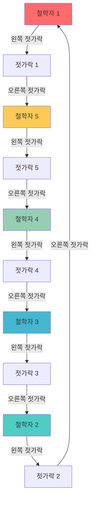
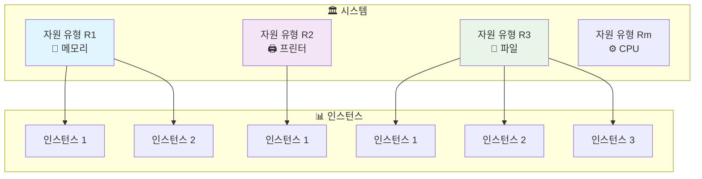
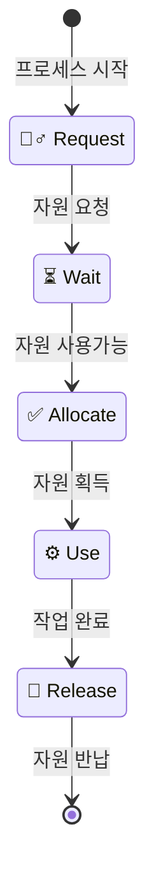
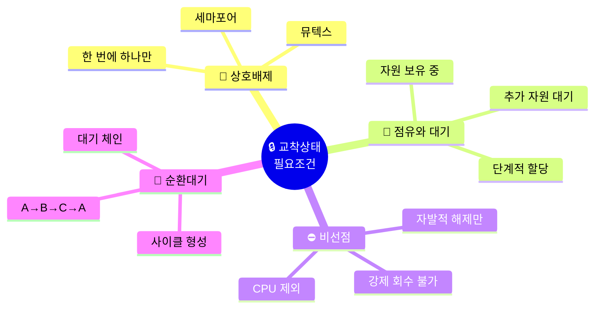
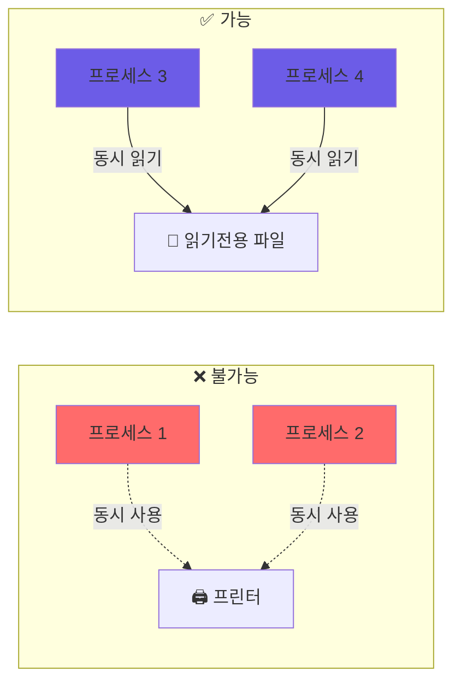
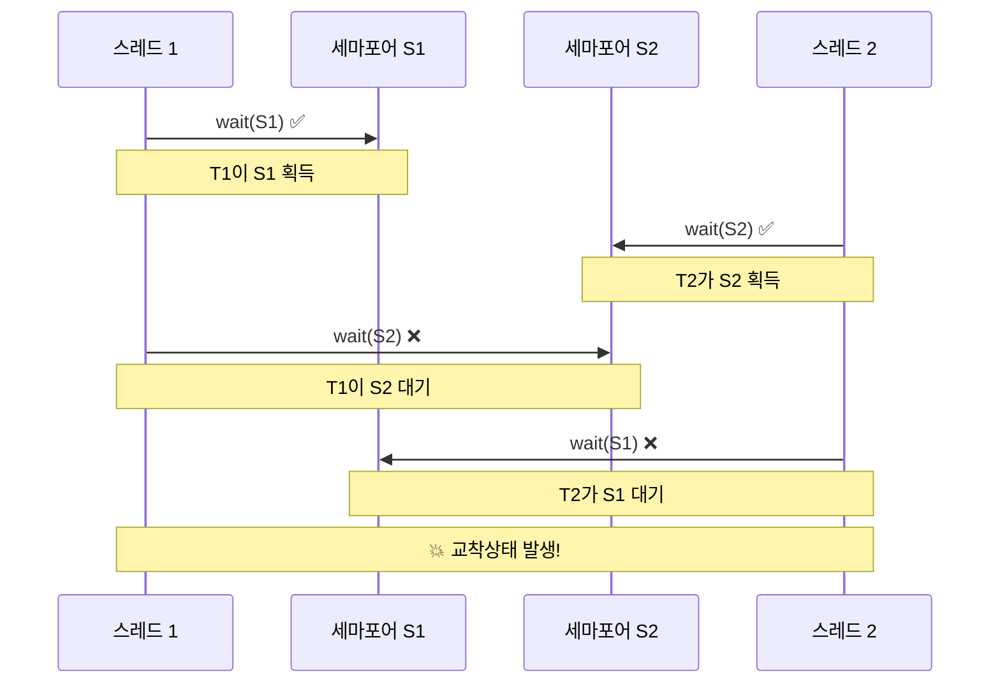
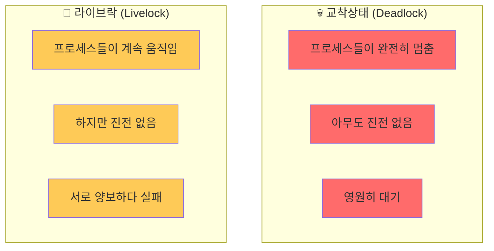
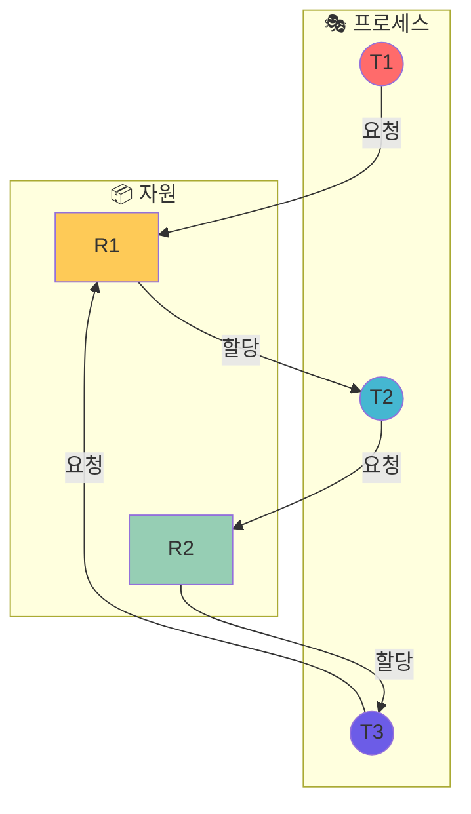
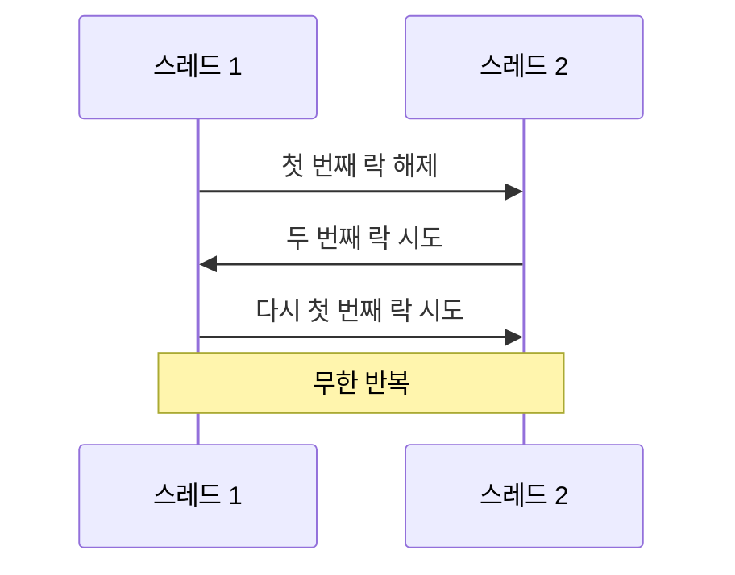
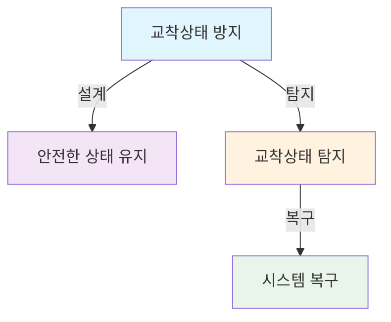

# 🔒 교착상태(Deadlock) 완전정복 가이드
*운영체제의 가장 복잡한 문제 중 하나를 시각적으로 이해하기*

## 📋 목차 (Table of Contents)
- [🎯 교착상태란 무엇인가?](#-교착상태란-무엇인가)
- [🏗️ 시스템 모델](#️-시스템-모델)
- [⚡ 교착상태 특성 분석](#-교착상태-특성-분석)
- [🛡️ 교착상태 처리 전략](#️-교착상태-처리-전략)
- [🚫 교착상태 예방](#-교착상태-예방)
- [🔮 교착상태 회피](#-교착상태-회피)
- [🔍 교착상태 탐지](#-교착상태-탐지)
- [🏥 교착상태 복구](#-교착상태-복구)
- [📚 추가 학습 자료](#-추가-학습-자료)

---

## 🎯 교착상태란 무엇인가?

> **교착상태(Deadlock)**는 멀티프로그래밍 환경에서 여러 프로세스나 스레드가 한정된 시스템 자원을 공유할 때 발생하는 **라이브니스(Liveness) 실패**의 대표적인 예입니다.

### 🏛️ 철학자들의 만찬 문제 (Dining Philosophers Problem)



### 💡 핵심 개념

| 개념 | 설명 | 예시 |
|------|------|------|
| **프로세스/스레드** | 자원을 요청하는 실행 단위 | 웹브라우저, 게임 프로그램 |
| **자원(Resource)** | 프로세스가 사용하는 시스템 구성요소 | CPU, 메모리, 파일, 프린터 |
| **상호 배제** | 한 번에 하나의 프로세스만 사용 가능 | 뮤텍스, 세마포어 |

**🔥 실생활 비유**: 
- 좁은 다리에서 두 대의 차가 마주보고 서로 비켜주기를 기다리는 상황
- 은행에서 두 사람이 서로의 계좌 승인을 기다리는 상황

---

## 🏗️ 시스템 모델 (System Model)

> 교착상태를 이해하기 위해서는 먼저 시스템이 어떻게 구성되고 작동하는지 알아야 합니다.

### 🔧 시스템 구성요소



### 🔄 자원 사용 생명주기



### 📝 자원 사용 단계별 설명

| 단계 | 설명 | 시스템 호출 예시 |
|------|------|------------------|
| **🙋‍♂️ 요청(Request)** | 프로세스가 필요한 자원을 시스템에 요청 | `open()`, `malloc()` |
| **⏳ 할당(Allocate)** | 시스템이 자원을 프로세스에 할당 | 커널의 자원 관리자 |
| **⚙️ 사용(Use)** | 프로세스가 할당받은 자원을 실제로 사용 | 파일 읽기/쓰기, 메모리 접근 |
| **🔄 해제(Release)** | 사용이 끝난 자원을 시스템에 반납 | `close()`, `free()` |

### 💡 실제 코드 예시

```c
// 💾 메모리 자원 사용 예시
void* memory = malloc(1024);    // 🙋‍♂️ 요청 & ✅ 할당
if (memory != NULL) {
    // ⚙️ 사용
    strcpy(memory, "Hello World");
    printf("%s\n", memory);
    
    free(memory);               // 🔄 해제
}

// 📁 파일 자원 사용 예시  
FILE* file = fopen("data.txt", "r");  // 🙋‍♂️ 요청 & ✅ 할당
if (file != NULL) {
    // ⚙️ 사용
    char buffer[100];
    fgets(buffer, 100, file);
    
    fclose(file);              // 🔄 해제
}
```

---

## ⚡ 교착상태 특성 분석

> 교착상태는 **4가지 필요조건**이 **모두 동시에** 충족될 때만 발생합니다. 하나라도 위반되면 교착상태는 절대 발생하지 않습니다!

### 🔒 교착상태의 4가지 필요조건



### 📊 조건별 상세 분석

#### 1️⃣ 🚫 상호 배제 (Mutual Exclusion)


**특징:**
- 🖨️ **비공유 자원**: 프린터, 뮤텍스, 테이프 드라이브
- 📖 **공유 가능 자원**: 읽기 전용 파일, 공유 메모리(읽기)

#### 2️⃣ 🤝 점유와 대기 (Hold and Wait)


#### 3️⃣ ⛔ 비선점 (No Preemption)


#### 4️⃣ 🔄 순환 대기 (Circular Wait)


### 🎭 라이브락 vs 교착상태



**🚶‍♂️ 라이브락 실생활 예시:**
> 좁은 복도에서 두 사람이 마주쳤을 때, 서로 비켜주려고 같은 방향으로 움직여서 계속 막히는 상황

### 🔍 자원 할당 그래프 (Resource Allocation Graph)



### 📈 교착상태 탐지 규칙

| 그래프 상태 | 인스턴스 수 | 교착상태 여부 |
|-------------|-------------|---------------|
| **🔄 사이클 없음** | 상관없음 | ✅ 교착상태 없음 |
| **🔄 사이클 있음** | 각 자원당 1개 | ❌ 교착상태 확실 |
| **🔄 사이클 있음** | 각 자원당 여러개 | ⚠️ 교착상태 가능성 |

## 라이브락 (Livelock)

라이브락은 데드락과 유사하지만, 스레드들이 멈추지 않고 지속적으로 무언가를 시도하지만 진전이 없는 상태를 말합니다. 이는 복도에서 두 사람이 서로 비켜주려다가 계속 부딪히는 상황에 비유될 수 있습니다.

- **예시**: `pthread_mutex_trylock`을 사용하여 두 번째 뮤텍스를 얻지 못하면 첫 번째 뮤텍스를 해제하는 방식으로 작성된 코드에서 발생할 수 있습니다.



---

# 교착상태 처리 방법 (Methods for Handling Deadlocks)

교착상태를 처리하는 방법은 크게 세 가지 접근법으로 나뉩니다:

1. **교착상태 방지(Deadlock Prevention)**: 시스템이 교착상태에 진입하지 않도록 설계.
2. **교착상태 회피(Deadlock Avoidance)**: 시스템이 불안전한 상태로 진입하지 않도록 동적으로 자원 할당 검사.
3. **교착상태 탐지 및 회복(Detection and Recovery)**: 교착상태를 허용하고 이후 탐지 및 복구.



## 교착상태 방지 (Deadlock Prevention)

교착상태 방지는 교착상태의 네 가지 필요 조건 중 하나 이상을 무효화함으로써 교착상태를 방지하는 방법입니다.

- **상호 배제(Mutual Exclusion)**: 공유 가능한 자원(예: 읽기 전용 파일)에는 상호 배제가 필요하지 않지만, 공유 불가능한 자원(non-sharable resources)에는 반드시 적용되어야 하므로 이 조건을 완전히 제거하는 것은 어렵습니다.
- **점유 및 대기(Hold and Wait)**:
  - 프로세스가 자원을 요청할 때, 다른 어떤 자원도 점유하고 있지 않음을 보장하는 방법입니다.
  - 예를 들어, 프로세스는 실행을 시작하기 전에 필요한 모든 자원을 한꺼번에 요청하고 할당받거나, 어떤 자원도 할당되지 않은 상태에서만 자원을 요청할 수 있도록 합니다.
  - 단점으로는 자원 활용률이 낮아지고 기아 상태(starvation)가 발생할 수 있습니다.
- **비선점(No Preemption)**:
  - 만약 프로세스가 이미 일부 자원을 점유하고 있는 상태에서 즉시 할당받을 수 없는 다른 자원을 요청한다면, 현재 점유하고 있는 모든 자원을 강제로 해제(release)하도록 합니다.
  - 선점된 자원들은 해당 프로세스가 기다리는 자원 목록에 추가되며, 프로세스는 원래 점유했던 자원과 새로 요청한 자원 모두를 다시 얻을 수 있을 때만 다시 시작됩니다.
- **순환 대기(Circular Wait)**:
  - 모든 자원 유형에 대해 총체적인 순서(total ordering)를 부과하고, 각 프로세스가 자원을 이 순서에 따라 오름차순으로만 요청하도록 요구하는 방법입니다.
  - 예를 들어, 뮤텍스 락(mutex locks)에 고유한 번호를 할당하고, 항상 낮은 번호의 락부터 높은 번호의 락 순서로 획득하도록 합니다. 영상에서 first_mutex = 1, second_mutex = 5와 같이 번호를 부여하여 thread_two의 락 획득 순서가 wait(s2) 다음 wait(s1)과 같이 되면 순환 대기가 발생할 수 있음을 보여줍니다.
  - 이 방법은 교착상태 방지에서 가장 일반적으로 사용되는 방법입니다.

## 교착상태 회피 (Deadlock Avoidance)

교착상태 회피는 시스템이 교착상태에 절대 진입하지 않도록 동적으로 자원 할당 상태를 검사합니다. 이를 위해 시스템은 사전에 각 프로세스가 필요로 할 최대 자원 수를 알아야 합니다.

- **자원 할당 상태(Resource-allocation state)**: 사용 가능한(available) 자원, 할당된(allocated) 자원, 프로세스의 최대 요구(maximum demands) 수에 의해 정의됩니다.
- **안전 상태(Safe State)**:
  - 시스템이 안전 상태에 있다는 것은 모든 스레드가 작업을 완료할 수 있는 일련의 순서(<T1, T2, ..., Tn>)가 존재함을 의미합니다.
  - 이 순서에서 각 Ti는 현재 사용 가능한 자원과 Tj(j < i)가 사용을 마친 후 반납할 자원만으로도 필요한 자원을 충족하여 작업을 완료할 수 있어야 합니다.
  - 안전 상태이면 교착상태가 발생하지 않습니다. 그러나 불안전 상태(unsafe state)라고 해서 반드시 교착상태인 것은 아니지만, 교착상태가 발생할 가능성이 있습니다.
  - 교착상태 회피 알고리즘은 시스템이 불안전 상태로 진입하는 것을 방지하는 것을 목표로 합니다.

### 회피 알고리즘 (Avoidance Algorithms)

- **자원 유형당 인스턴스가 하나인 경우(Single instance of a resource type)**: 자원 할당 그래프(Resource-Allocation Graph) 알고리즘을 사용합니다.
  - 클레임 간선(Claim edge): 프로세스 Ti가 자원 Rj를 요청할 수 있음을 나타내는 점선 화살표(Ti --> Rj)입니다. 프로세스 실행 전에 모든 클레임 간선이 그래프에 표시되어야 합니다.
  - 요청 간선(Request edge): 스레드가 자원을 요청할 때 클레임 간선이 요청 간선(실선)으로 바뀝니다 (Ti → Rj).
  - 할당 간선(Assignment edge): 자원이 스레드에 할당될 때 요청 간선이 할당 간선(Ti ← Rj)으로 바뀝니다.
  - 스레드가 자원을 해제하면 할당 간선은 다시 클레임 간선으로 바뀝니다.
  - 자원 할당 그래프 알고리즘은 스레드 Ti가 자원 Rj를 요청할 때, 요청 간선을 할당 간선으로 변경하는 것이 자원 할당 그래프에 사이클(cycle)을 형성하지 않는 경우에만 요청을 승인합니다.
  - 사이클이 없으면 교착상태가 없고, 사이클이 있으면 인스턴스가 하나일 때는 데드락, 여러 개일 때는 데드락 가능성(unsafe)이 있습니다.
- **자원 유형당 인스턴스가 여러 개인 경우(Multiple instances of a resource type)**: **은행원 알고리즘(Banker's Algorithm)**을 사용합니다.
  - 각 스레드는 사전에 자신이 필요로 할 **최대 자원 사용량(maximum use)**을 선언해야 합니다.
  - 스레드가 자원을 요청할 때 대기해야 할 수도 있습니다.
  - 모든 자원을 얻은 스레드는 유한한 시간 내에 자원을 반납해야 합니다.
  - 은행원 알고리즘을 위한 자료 구조 (Data Structures):
    - n: 프로세스(스레드)의 수.
    - m: 자원 유형의 수.
    - Available: 길이 m의 벡터. Available[j] = k는 자원 유형 Rj의 k개의 인스턴스가 사용 가능함을 나타냅니다.
    - Max: n x m 행렬. Max[i,j] = k는 프로세스 Pi가 자원 유형 Rj의 최대 k개의 인스턴스를 요청할 수 있음을 나타냅니다.
    - Allocation: n x m 행렬. Allocation[i,j] = k는 프로세스 Pi가 현재 자원 유형 Rj의 k개의 인스턴스를 할당받았음을 나타냅니다.
    - Need: n x m 행렬. Need[i,j] = k는 프로세스 Pi가 작업을 완료하기 위해 자원 유형 Rj의 k개의 인스턴스가 더 필요함을 나타냅니다. Need[i,j] = Max[i,j] – Allocation[i,j].
  - 안전성 알고리즘 (Safety Algorithm):
    1. Work (길이 m)와 Finish (길이 n) 벡터를 초기화합니다. Work = Available, Finish[i] = false (i = 0, 1, ..., n-1).
    2. 다음 두 조건을 모두 만족하는 i를 찾습니다: (a) Finish[i] == false (b) Need_i <= Work 만약 그러한 i가 없으면 4단계로 이동합니다.
    3. Work = Work + Allocation_i. Finish[i] = true. 2단계로 돌아갑니다.
    4. 만약 모든 i에 대해 Finish[i] == true이면, 시스템은 안전 상태입니다.
  - 자원 요청 알고리즘 (Resource-Request Algorithm for Process Pi): 프로세스 Pi가 자원 유형 Rj의 k개 인스턴스를 요청할 때(Request_i 벡터):
    1. 만약 Request_i <= Need_i이면 2단계로 이동합니다. 그렇지 않으면, 프로세스가 최대 요청량을 초과했으므로 오류 조건을 발생시킵니다.
    2. 만약 Request_i <= Available이면 3단계로 이동합니다. 그렇지 않으면, 자원이 사용 가능하지 않으므로 Ti는 대기해야 합니다.
    3. 요청된 자원을 Ti에 할당하는 것을 가정하여 시스템 상태를 임시로 수정합니다: Available = Available – Request_i; Allocation_i = Allocation_i + Request_i; Need_i = Need_i – Request_i;
    4. 이 새로운 상태에서 안전성 알고리즘을 실행합니다.
    - 만약 안전하면, 자원이 Ti에 할당됩니다.
    - 만약 불안전하면, Ti는 대기해야 하며 이전 자원 할당 상태로 복원됩니다.
  - 예시: 5개 스레드(T0-T4), 3개 자원 유형(A:10, B:5, C:7)의 스냅샷을 통해 은행원 알고리즘을 적용한 결과, <T1, T3, T4, T2, T0> 순서가 안전성 기준을 만족함을 보입니다. T1이 (1,0,2)를 요청했을 때, 시스템이 안전 상태로 유지될 수 있음을 보여주는 추가 예시도 제공됩니다.

## 교착상태 탐지 (Deadlock Detection)

교착상태 탐지는 시스템이 교착상태에 진입하는 것을 허용하고, 나중에 교착상태가 발생했는지 탐지한 후 회복하는 방법입니다. 또한, 문제를 무시하고 교착상태가 시스템에 절대 발생하지 않는다고 가정하는 접근법도 있습니다.

- **자원 유형당 인스턴스가 하나인 경우(Single Instance of Each Resource Type)**: **대기 그래프(Wait-for graph)**를 유지합니다.
  - 노드는 스레드를 나타내고, Ti → Tj는 스레드 Ti가 스레드 Tj를 기다리고 있음을 나타냅니다.
  - 주기적으로 그래프에서 사이클을 탐지합니다. 사이클이 존재하면 교착상태가 존재합니다.
  - 사이클 탐지 알고리즘은 n이 그래프의 정점(스레드) 수일 때 O(n^2)의 연산이 필요합니다.
- **자원 유형당 인스턴스가 여러 개인 경우(Several Instances of a Resource Type)**: 은행원 알고리즘과 유사한 탐지 알고리즘을 사용합니다.
  - 자료 구조:
    - Available: 길이 m의 벡터. 사용 가능한 자원의 수.
    - Allocation: n x m 행렬. 각 프로세스에 현재 할당된 자원의 수.
    - Request: n x m 행렬. 각 프로세스의 현재 요청량. Request[i][j] = k는 스레드 Ti가 자원 유형 Rj의 k개 인스턴스를 더 요청하고 있음을 나타냅니다.
  - 탐지 알고리즘 (Detection Algorithm):
    1. Work (길이 m)와 Finish (길이 n) 벡터를 초기화합니다: (a) Work = Available (b) Allocation_i != 0이면 Finish[i] = false, 그렇지 않으면 Finish[i] = true로 초기화합니다.
    2. 다음 두 조건을 모두 만족하는 i를 찾습니다: (a) Finish[i] == false (b) Request_i <= Work 그러한 i가 없으면 4단계로 이동합니다.
    3. Work = Work + Allocation_i. Finish[i] = true. 2단계로 돌아갑니다.
    4. 만약 일부 i에 대해 Finish[i] == false이면 시스템은 교착상태입니다. 이때 Finish[i] == false인 Ti는 교착상태에 빠진 스레드입니다.
    - 이 알고리즘은 시스템이 교착상태인지 탐지하는 데 O(m x n^2)의 연산이 필요합니다.
  - 예시: 5개 스레드(T0-T4), 3개 자원 유형(A:7, B:2, C:6)의 스냅샷을 통해 탐지 알고리즘을 적용합니다. 초기 상태에서 <T0, T2, T3, T1, T4> 순서가 안전 기준을 만족하여 모든 Finish[i]가 true가 됩니다. 그러나 T2가 추가적으로 C 유형 자원 1개를 요청하는 상황이 발생하면, 탐지 알고리즘 수행 시 T1, T2, T3, T4는 Finish[i]가 false로 남아 교착상태가 존재함을 확인합니다.
- 탐지 알고리즘 사용 시점 (Detection-Algorithm Usage):
  - 교착상태가 얼마나 자주 발생하는지.
  - 얼마나 많은 프로세스를 롤백(rollback)해야 하는지.
  - 자원 그래프에 많은 사이클이 존재할 때, 어떤 프로세스가 교착상태를 "유발"했는지 판단하기 어렵습니다.

## 교착상태로부터의 회복 (Recovery from Deadlock)

교착상태가 탐지된 후에는 시스템을 회복시켜야 합니다.

- **프로세스 종료(Process Termination)**:
  - 모든 교착상태 프로세스 강제 종료(Abort all deadlocked processes): 교착상태에 연루된 모든 프로세스를 한꺼번에 종료합니다.
  - 하나씩 종료(Abort one process at a time): 교착상태 사이클이 제거될 때까지 프로세스를 하나씩 종료합니다.
  - 종료할 프로세스 선택 기준(Order to abort):
    1. 프로세스의 우선순위(Priority of the process).
    2. 프로세스가 지금까지 계산한 시간과 완료까지 남은 시간 (How long process has computed, and how much longer to completion).
    3. 프로세스가 사용한 자원(Resources the process has used).
    4. 프로세스 완료에 필요한 자원(Resources process needs to complete).
    5. 종료해야 할 프로세스의 수(How many processes will need to be terminated).
    6. 프로세스가 대화식(interactive)인지 배치(batch)인지 여부.
- **자원 선점(Resource Preemption)**:
  - 희생자 선택(Selecting a victim): 교착상태에서 회복하기 위해 자원을 선점할 프로세스(희생자)를 선택하며, 이로 인한 비용을 최소화하는 것이 목표입니다.
  - 롤백(Rollback): 선택된 희생자 프로세스를 안전한 상태로 되돌리고, 그 상태부터 다시 시작합니다.
  - 기아 상태(Starvation): 동일한 프로세스가 계속해서 희생자로 선택될 수 있으므로, 롤백 횟수를 비용 요소에 포함하여 방지해야 합니다.

---

## 다음은 제공된 자료와 이전 대화를 바탕으로 교착상태(Deadlock)에 대한 자세하고 심층적인 분석입니다.

교착상태 (Deadlock) 개요
교착상태, 또는 데드락(Deadlock)은 멀티프로그래밍 환경에서 여러 프로세스나 스레드가 한정된 컴퓨터 시스템 자원을 공유하며 발생할 수 있는 문제입니다. 이는 여러 스레드나 프로세스가 제한된 자원을 사용하기 때문에, 특정 스레드나 프로세스가 자원을 점유하고 있을 때 다른 스레드나 프로세스가 해당 자원을 사용하기 위해 기다리게 되는 상황에서 나타납니다. 만약 각 스레드가 자원을 하나씩 점유하고 있으면서 상대방이 점유한 자원을 필요로 하는 경우, 서로 양보하지 않으면 영원히 작업을 완료할 수 없게 되는데, 이러한 상황을 교착상태라고 합니다.
라이브니스(Liveness) 실패의 한 종류이며, 철학자들의 만찬 문제와 같은 예시를 통해 쉽게 이해할 수 있습니다. 철학자들이 젓가락을 공유하면서 동시에 배가 고파 왼쪽 젓가락을 집어 들면, 오른쪽 젓가락을 잡을 수 없게 되어 모두 굶어 죽는 상황이 발생할 수 있습니다.
시스템 모델 (System Model)
시스템은 자원(Resources)으로 구성됩니다. 자원 유형(Resource types)으로는 R1, R2, ..., Rm 등이 있으며, CPU 사이클, 메모리 공간, I/O 장치 등이 그 예시입니다. 각 자원 유형 Ri는 Wi개의 인스턴스(instance)를 가질 수 있습니다.
각 프로세스 또는 스레드는 자원을 다음과 같은 순서로 활용합니다:

1.  요청(request): 자원을 요청합니다.
2.  사용(use): 요청한 자원이 할당되면 이를 사용합니다.
3.  해제(release): 자원 사용을 완료하면 자원을 반납하여 다른 프로세스나 스레드가 사용할 수 있도록 합니다.
    멀티스레드 애플리케이션에서의 교착상태 (Deadlock in Multithreaded Application)
    뮤텍스(Mutex) 잠금(locks)이나 세마포어(semaphore)를 사용할 때 교착상태가 발생할 수 있습니다. 예를 들어, 초기값이 1인 세마포어 S1과 S2가 있고, 두 스레드 T1과 T2가 있습니다.
    •
    T1: wait(s1), wait(s2)
    .
    •
    T2: wait(s2), wait(s1)
    .
    만약 T1이 S1을 획득한 후 (S1 값은 0이 됨) 스케줄러에 의해 T2로 제어권이 넘어가고, T2가 S2를 획득한 후 (S2 값은 0이 됨) S1을 요청하면, S1은 이미 T1이 가지고 있기 때문에 T2는 기다리게 됩니다. 다시 T1으로 제어권이 넘어가 S2를 요청하면, S2는 T2가 가지고 있기 때문에 T1도 기다리게 됩니다. 결과적으로 T1은 S1을 가지고 S2를 기다리고, T2는 S2를 가지고 S1을 기다리는 상태가 되어 교착상태에 빠지게 됩니다. 이는 자원 할당 그래프로도 나타낼 수 있습니다.
    라이블락 (Livelock)
    라이블락(Livelock)은 스레드가 계속해서 어떤 작업을 시도하지만 해당 작업이 실패하여 더 이상 진행되지 못하는 상황을 말합니다. 교착상태와 달리 스레드들이 멈춰있지 않고 계속 상태를 변경하지만, 실제적인 진행은 이루어지지 않습니다. 예를 들어, 두 스레드가 뮤텍스를 trylock 방식으로 획득하려 할 때, 한 스레드가 첫 번째 뮤텍스를 획득하고 두 번째 뮤텍스 획득에 실패하면 첫 번째 뮤텍스를 해제하는 방식으로 코드를 작성하면 라이블락이 발생할 수 있습니다. 두 스레드가 서로 상대방의 뮤텍스를 기다리면서 자신의 뮤텍스를 계속 해제하는 동작을 반복하게 되기 때문입니다.
    교착상태 특성 (Deadlock Characterization)
    교착상태는 다음 네 가지 필요 조건이 동시에 충족될 때 발생할 수 있습니다. 이 중 하나라도 충족되지 않으면 교착상태는 발생하지 않습니다.
4.  상호 배제 (Mutual Exclusion): 한 번에 하나의 스레드(또는 프로세스)만이 자원을 사용할 수 있습니다. 이는 공유 불가능한(non-sharable) 자원(예: 뮤텍스 잠금)에 반드시 적용되어야 하는 조건입니다. 읽기 전용 파일과 같이 공유 가능한 자원에는 이 조건이 필요하지 않습니다.
5.  점유 및 대기 (Hold and Wait): 최소한 하나의 자원을 점유하고 있는 스레드가 다른 스레드가 점유한 추가 자원을 얻기 위해 대기하는 상태를 말합니다.
6.  비선점 (No Preemption): 자원을 점유하고 있는 스레드가 작업을 완료하기 전에는 그 자원을 자발적으로만 해제할 수 있으며, 다른 스레드에 의해 강제로 빼앗길 수 없습니다.
7.  순환 대기 (Circular Wait): {T0, T1, ..., Tn}과 같은 스레드 집합이 존재하여, T0는 T1이 점유한 자원을 대기하고, T1은 T2가 점유한 자원을 대기하는 식으로 Tn-1은 Tn이 점유한 자원을 대기하며, Tn은 T0가 점유한 자원을 대기하는 순환적인 대기 상태를 말합니다.
    자원 할당 그래프 (Resource-Allocation Graph)
    자원 할당 그래프는 교착상태를 시각적으로 표현하고 식별하는 데 사용되는 도구입니다.
    •
    정점(Vertices): 시스템의 모든 스레드 {T1, T2, ..., Tn}과 모든 자원 유형 {R1, R2, ..., Rm}으로 나뉩니다.
    .
    •
    간선(Edges):
    ◦
    요청 간선(Request edge): 스레드 Ti가 자원 유형 Rj를 요청하는 경우 Ti → Rj로 표시합니다.
    .
    ◦
    할당 간선(Assignment edge): 자원 유형 Rj의 인스턴스가 스레드 Ti에 할당된 경우 Rj → Ti로 표시합니다.
    .
    교착상태 식별:
    •
    그래프에 사이클(cycle)이 없으면 교착상태는 발생하지 않습니다.
    .
    •
    그래프에 사이클이 있다면:
    ◦
    각 자원 유형당 인스턴스가 하나뿐인 경우, 사이클은 곧 교착상태를 의미합니다.
    .
    ◦
    각 자원 유형당 인스턴스가 여러 개인 경우, 사이클이 있다고 해서 반드시 교착상태인 것은 아니지만, 교착상태가 발생할 가능성이 있습니다.
    .
    교착상태 처리 방법 (Methods for Handling Deadlocks)
    교착상태를 처리하는 세 가지 일반적인 접근 방식이 있습니다.
    :
8.  시스템이 교착상태에 진입하는 것을 방지:
    ◦
    교착상태 예방(Deadlock Prevention): 교착상태의 네 가지 필요 조건 중 하나 이상을 무효화하여 교착상태가 발생하지 않도록 합니다.
    .
    ◦
    교착상태 회피(Deadlock Avoidance): 시스템의 자원 할당 상태를 동적으로 검사하여 교착상태가 발생할 수 있는 '안전하지 않은 상태'로 진입하는 것을 피합니다.
    .
9.  시스템이 교착상태에 진입하도록 허용하고 이후 복구(Recovery) 작업 수행:
    ◦
    교착상태 탐지(Deadlock Detection): 시스템이 교착상태에 진입했는지 여부를 주기적으로 확인하는 알고리즘을 사용합니다.
    .
    ◦
    교착상태 복구(Recovery from Deadlock): 교착상태가 탐지되면, 해당 상태에서 벗어나기 위한 방법을 적용합니다.
    .
10. 문제를 무시하고 교착상태가 시스템에 절대 발생하지 않는다고 가정: 이는 가장 수동적인 방법으로, 교착상태 발생 빈도가 낮을 경우에 사용됩니다.
    .
    교착상태 예방 (Deadlock Prevention)
    교착상태 예방은 네 가지 필요 조건 중 하나를 무효화하여 교착상태를 원천적으로 방지하는 방법입니다.
    .
11. 상호 배제 (Mutual Exclusion) 조건 무효화: 공유 가능한 자원(예: 읽기 전용 파일)에 대해서는 상호 배제 조건이 필요하지 않습니다. 그러나 공유 불가능한 자원(예: 프린터)의 경우 이 조건을 무효화하기 어렵습니다.
    .
12. 점유 및 대기 (Hold and Wait) 조건 무효화: 스레드가 자원을 요청할 때 다른 자원을 점유하고 있지 않음을 보장해야 합니다. 이를 달성하는 두 가지 방법이 있습니다:
    ◦
    모든 자원 동시 요청: 프로세스가 실행을 시작하기 전에 필요한 모든 자원을 한꺼번에 요청하고 할당받도록 요구합니다.
    .
    ◦
    자원 없을 때만 요청: 프로세스가 현재 어떤 자원도 점유하고 있지 않을 때만 자원을 요청하도록 허용합니다.
    .
    ◦
    이 방법의 단점은 자원 활용률이 낮고, 자원 고갈(starvation)이 발생할 수 있다는 점입니다.
    .
13. 비선점 (No Preemption) 조건 무효화:
    ◦
    만약 자원을 점유한 프로세스가 즉시 할당받을 수 없는 다른 자원을 요청할 경우, 현재 점유하고 있는 모든 자원을 해제하도록 강제합니다.
    .
    ◦
    선점된 자원들은 해당 프로세스가 대기하는 자원 목록에 추가됩니다.
    .
    ◦
    프로세스는 이전 자원들과 새롭게 요청한 자원들을 모두 다시 획득할 수 있을 때만 다시 시작될 수 있습니다.
    .
14. 순환 대기 (Circular Wait) 조건 무효화:
    ◦
    모든 자원 유형에 대해 총체적인 순서(total ordering)를 부과하고, 각 프로세스가 자원을 증가하는 순서로만 요청하도록 요구합니다. 이 방법은 교착상태 예방에서 가장 흔히 사용됩니다.
    .
    ◦
    예를 들어, first_mutex에 1, second_mutex에 5와 같은 고유한 번호를 할당하고, 항상 번호가 작은 뮤텍스부터 획득하도록 강제하는 것입니다.
    .
    교착상태 회피 (Deadlock Avoidance)
    교착상태 회피는 시스템이 '안전한 상태(safe state)'를 유지하도록 보장하여 교착상태를 피하는 방법입니다. 이를 위해서는 각 프로세스가 자신이 필요로 할 자원의 최대 개수를 미리 선언해야 합니다. 교착상태 회피 알고리즘은 현재 자원 할당 상태를 동적으로 검사하여 순환 대기 조건이 발생하지 않도록 합니다. 자원 할당 상태는 가용 자원, 할당된 자원, 그리고 프로세스의 최대 요구량으로 정의됩니다.
    안전 상태 (Safe State):
    •
    시스템이 안전 상태라는 것은 시스템의 모든 스레드를 위한 순서 <T1, T2, ..., Tn>이 존재하여, 각 Ti가 아직 요청할 수 있는 자원들을 현재 가용 가능한 자원들과 Ti 이전에 완료된 모든 Tj(j < i)가 해제한 자원들을 합하여 만족시킬 수 있음을 의미합니다.
    .
    •
    즉, Ti가 필요로 하는 자원이 즉시 사용 가능하지 않다면, 모든 Tj가 작업을 마칠 때까지 Ti가 기다릴 수 있다는 뜻입니다. Tj가 작업을 마치면 Ti는 필요한 자원을 얻어 실행하고, 할당된 자원을 반납한 후 종료합니다. 이어서 Ti+1이 필요한 자원을 얻고 계속 진행됩니다.
    .
    •
    기본 사실:
    ◦
    시스템이 안전 상태이면 교착상태는 발생하지 않습니다.
    .
    ◦
    시스템이 **안전하지 않은 상태(unsafe state)**이면 교착상태가 발생할 가능성이 있습니다. 교착상태 회피는 시스템이 절대 안전하지 않은 상태로 진입하지 않도록 보장합니다.
    .
    회피 알고리즘 (Avoidance Algorithms):
15. 각 자원 유형에 인스턴스가 하나인 경우:
    ◦
    **자원 할당 그래프(Resource-Allocation Graph)**를 사용합니다.
    .
    ◦
    기존 요청/할당 간선 외에, 스레드 Ti가 자원 Rj를 요청할 수 있음을 나타내는 클레임 간선(Claim edge) Ti → Rj를 점선으로 표시합니다.
    .
    ◦
    스레드가 자원을 요청하면 클레임 간선이 요청 간선으로 바뀌고, 자원이 할당되면 요청 간선이 할당 간선으로 바뀝니다.
    .
    ◦
    자원이 해제되면 할당 간선이 다시 클레임 간선으로 바뀝니다.
    .
    ◦
    스레드 Ti가 Rj를 요청할 때, 요청 간선을 할당 간선으로 변경했을 때 자원 할당 그래프에 사이클이 형성되지 않으면 요청을 승인합니다.
    .
16. 각 자원 유형에 인스턴스가 여러 개인 경우:
    ◦
    **은행원 알고리즘(Banker's Algorithm)**을 사용합니다.
    .
    ◦
    각 스레드는 사전에 자신이 필요로 할 최대 자원 사용량을 선언해야 합니다.
    .
    ◦
    스레드가 자원을 요청할 때, 경우에 따라 기다려야 할 수 있습니다.
    .
    ◦
    스레드가 모든 자원을 얻으면 유한한 시간 내에 자원을 반납해야 합니다.
    .
    ◦
    데이터 구조: (n = 프로세스 수, m = 자원 유형 수)
    ▪
    Available: 길이 m의 벡터. 각 자원 유형별 가용 인스턴스 수.
    .
    ▪
    Max: n x m 행렬. 각 프로세스 Pi가 요청할 수 있는 Rj의 최대 인스턴스 수.
    .
    ▪
    Allocation: n x m 행렬. 각 프로세스 Pi에 현재 할당된 Rj의 인스턴스 수.
    .
    ▪
    Need: n x m 행렬. 각 프로세스 Pi가 작업을 완료하기 위해 Rj가 아직 필요로 하는 인스턴스 수. Need[i, j] = Max[i, j] – Allocation[i, j].
    .
    ◦
    안전성 알고리즘 (Safety Algorithm): 시스템이 안전 상태인지 확인합니다.
    .
17. Work = Available, Finish[i] = false (모든 i에 대해) 초기화.
    .
18. Finish[i]가 false이고 Need_i <= Work인 i를 찾습니다. 없으면 4단계로 이동.
    .
19. Work = Work + Allocation_i, Finish[i] = true. 2단계로 돌아갑니다.
    .
20. 모든 Finish[i]가 true이면 시스템은 안전 상태입니다.
    .
    ◦
    자원 요청 알고리즘 (Resource-Request Algorithm): 프로세스 Pi가 자원을 요청(Request_i)했을 때, 이를 즉시 할당해도 안전한지 확인합니다.
    .
21. Request_i <= Need_i인지 확인. 아니면 에러 (최대 요구량 초과).
    .
22. Request_i <= Available인지 확인. 아니면 Ti는 대기 (자원 부족).
    .
23. 가상으로 요청된 자원을 Ti에 할당 (상태 변경: Available = Available - Request_i; Allocation_i = Allocation_i + Request_i; Need_i = Need_i - Request_i).
    .
24. 이 변경된 상태로 안전성 알고리즘을 실행합니다. 안전하면 자원을 할당하고, 안전하지 않으면 Ti는 대기하고 이전 자원 할당 상태를 복원합니다.
    .
    ◦
    예시: 5개 스레드(T0-T4), 3가지 자원 유형(A:10, B:5, C:7)의 스냅샷이 주어졌을 때, Need 행렬을 계산하고 안전 시퀀스 <T1, T3, T4, T2, T0>가 존재함을 통해 시스템이 안전 상태임을 확인합니다. T1의 (1,0,2) 요청이 안전하게 승인되는 과정과 T4의 (3,3,0) 요청, T0의 (0,2,0) 요청이 안전하지 않아 대기해야 하는 시나리오도 설명됩니다.
    .
    교착상태 탐지 (Deadlock Detection)
    교착상태 탐지는 시스템이 교착상태에 진입하도록 허용하고, 이후 탐지 알고리즘과 복구 스키마를 사용하여 처리하는 방법입니다.
    .
    자원 유형당 인스턴스가 하나인 경우:
    •
    **대기 그래프(Wait-for graph)**를 유지합니다.
    .
    •
    노드는 스레드이며, Ti → Tj 간선은 Ti가 Tj가 점유한 자원을 대기하고 있음을 나타냅니다.
    .
    •
    주기적으로 그래프에서 사이클을 검색합니다. 사이클이 존재하면 교착상태가 존재합니다.
    .
    •
    사이클 탐지 알고리즘은 O(n^2) 연산을 필요로 합니다 (n은 그래프의 정점 수).
    .
    자원 유형당 인스턴스가 여러 개인 경우:
    •
    다음 데이터 구조를 사용합니다:
    ◦
    Available: 길이 m의 벡터. 각 자원 유형별 가용 인스턴스 수.
    .
    ◦
    Allocation: n x m 행렬. 각 프로세스에 현재 할당된 자원 수.
    .
    ◦
    Request: n x m 행렬. 각 프로세스의 현재 자원 요청 수.
    .
    •
    탐지 알고리즘 (Detection Algorithm):
25. Work = Available로 초기화합니다.
    .
26. 모든 Allocation_i가 0이 아니면 Finish[i] = false로, 그렇지 않으면 Finish[i] = true로 초기화합니다.
    .
27. Finish[i]가 false이고 Request_i <= Work인 i를 찾습니다. 없으면 4단계로 이동.
    .
28. Work = Work + Allocation_i, Finish[i] = true. 2단계로 돌아갑니다.
    .
29. 어떤 Finish[i]가 false이면 시스템은 교착상태이며, 해당 Ti는 교착상태에 빠져 있습니다.
    .
    •
    이 알고리즘은 시스템이 교착상태인지 탐지하기 위해 O(m x n^2) 연산을 필요로 합니다.
    .
    •
    예시: 5개 스레드(T0-T4), 3가지 자원 유형(A:7, B:2, C:6)의 스냅샷이 주어졌을 때, 초기 상태에서는 <T0, T2, T3, T1, T4>와 같은 안전 시퀀스가 존재하여 모든 스레드가 완료될 수 있음을 확인합니다. 하지만 T2가 C 유형 자원을 추가로 요청하면 (0,0,1), 시스템은 교착상태에 빠지며 T1, T2, T3, T4가 교착상태에 연루됨을 탐지할 수 있습니다.
    .
    탐지 알고리즘 사용 시기 및 빈도:
    •
    교착상태 발생 가능성 및 롤백해야 할 프로세스 수에 따라 달라집니다.
    .
    •
    알고리즘을 임의로 너무 자주 호출하면 자원 그래프에 많은 사이클이 생겨 어느 프로세스가 교착상태의 '원인'인지 파악하기 어려울 수 있습니다.
    .
    교착상태로부터의 복구 (Recovery from Deadlock)
    교착상태가 탐지되면 시스템은 교착상태에서 벗어나기 위한 복구 절차를 수행해야 합니다.
    .
30. 프로세스 종료 (Process Termination):
    ◦
    모든 교착상태 프로세스 종료: 교착상태에 연루된 모든 프로세스를 한꺼번에 중단시킵니다.
    .
    ◦
    교착상태 사이클에서 하나씩 종료: 교착상태 사이클이 제거될 때까지 프로세스를 하나씩 종료시킵니다.
    .
    ◦
    종료할 프로세스 선택 기준: 어떤 프로세스를 종료할지 결정할 때 다음 요소들을 고려할 수 있습니다.
    :
31. 프로세스의 우선순위
    .
32. 프로세스가 얼마나 오랫동안 연산했는지, 그리고 완료까지 얼마나 더 남았는지
    .
33. 프로세스가 사용한 자원
    .
34. 프로세스가 완료하기 위해 필요한 자원
    .
35. 종료해야 할 프로세스의 수
    .
36. 프로세스가 상호작용적(interactive)인지 배치(batch)인지
    .
37. 자원 선점 (Resource Preemption):
    ◦
    희생자 선택(Selecting a victim): 최소한의 비용을 발생시키는 프로세스(희생자)를 선택하여 자원을 강제로 빼앗습니다.
    .
    ◦
    롤백(Rollback): 희생자로 선택된 프로세스를 안전한 상태로 되돌리고, 해당 상태부터 프로세스를 다시 시작합니다.
    .
    ◦
    기아(Starvation): 같은 프로세스가 항상 희생자로 선택될 수 있으므로, 롤백 횟수를 비용 요소에 포함하여 이러한 기아 상태를 방지해야 합니다.
