# 🔒 교착상태(Deadlock) 완전정복 가이드
*운영체제의 가장 복잡한 문제 중 하나를 시각적으로 이해하기*

## 📋 목차 (Table of Contents)
- [🎯 교착상태란 무엇인가?](#-교착상태란-무엇인가)
- [🏗️ 시스템 모델](#️-시스템-모델)
- [⚡ 교착상태 특성 분석](#-교착상태-특성-분석)
- [🛡️ 교착상태 처리 전략](#️-교착상태-처리-전략)
- [🚫 교착상태 예방](#-교착상태-예방)
- [🔮 교착상태 회피](#-교착상태-회피)
- [🔍 교착상태 탐지](#-교착상태-탐지)
- [🏥 교착상태 복구](#-교착상태-복구)
- [📚 추가 학습 자료](#-추가-학습-자료)

---

## 🎯 교착상태란 무엇인가?

> **교착상태(Deadlock)**는 멀티프로그래밍 환경에서 여러 프로세스나 스레드가 한정된 시스템 자원을 공유할 때 발생하는 **라이브니스(Liveness) 실패**의 대표적인 예입니다.

### 🏛️ 철학자들의 만찬 문제 (Dining Philosophers Problem)

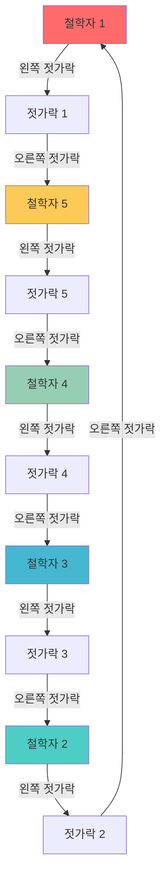

### 💡 핵심 개념

| 개념 | 설명 | 예시 |
|------|------|------|
| **프로세스/스레드** | 자원을 요청하는 실행 단위 | 웹브라우저, 게임 프로그램 |
| **자원(Resource)** | 프로세스가 사용하는 시스템 구성요소 | CPU, 메모리, 파일, 프린터 |
| **상호 배제** | 한 번에 하나의 프로세스만 사용 가능 | 뮤텍스, 세마포어 |

**🔥 실생활 비유**: 
- 좁은 다리에서 두 대의 차가 마주보고 서로 비켜주기를 기다리는 상황
- 은행에서 두 사람이 서로의 계좌 승인을 기다리는 상황

---

## 🏗️ 시스템 모델 (System Model)

> 교착상태를 이해하기 위해서는 먼저 시스템이 어떻게 구성되고 작동하는지 알아야 합니다.

### 🔧 시스템 구성요소

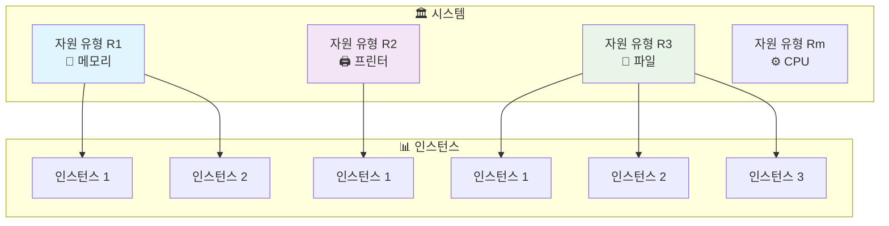

### 🔄 자원 사용 생명주기

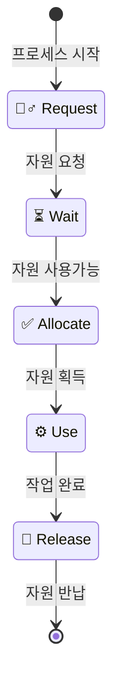

### 📝 자원 사용 단계별 설명

| 단계 | 설명 | 시스템 호출 예시 |
|------|------|------------------|
| **🙋‍♂️ 요청(Request)** | 프로세스가 필요한 자원을 시스템에 요청 | `open()`, `malloc()` |
| **⏳ 할당(Allocate)** | 시스템이 자원을 프로세스에 할당 | 커널의 자원 관리자 |
| **⚙️ 사용(Use)** | 프로세스가 할당받은 자원을 실제로 사용 | 파일 읽기/쓰기, 메모리 접근 |
| **🔄 해제(Release)** | 사용이 끝난 자원을 시스템에 반납 | `close()`, `free()` |

### 💡 실제 코드 예시

```c
// 💾 메모리 자원 사용 예시
void* memory = malloc(1024);    // 🙋‍♂️ 요청 & ✅ 할당
if (memory != NULL) {
    // ⚙️ 사용
    strcpy(memory, "Hello World");
    printf("%s\n", memory);
    
    free(memory);               // 🔄 해제
}

// 📁 파일 자원 사용 예시  
FILE* file = fopen("data.txt", "r");  // 🙋‍♂️ 요청 & ✅ 할당
if (file != NULL) {
    // ⚙️ 사용
    char buffer[100];
    fgets(buffer, 100, file);
    
    fclose(file);              // 🔄 해제
}
```

---

## ⚡ 교착상태 특성 분석

> 교착상태는 **4가지 필요조건**이 **모두 동시에** 충족될 때만 발생합니다. 하나라도 위반되면 교착상태는 절대 발생하지 않습니다!

### 🔒 교착상태의 4가지 필요조건

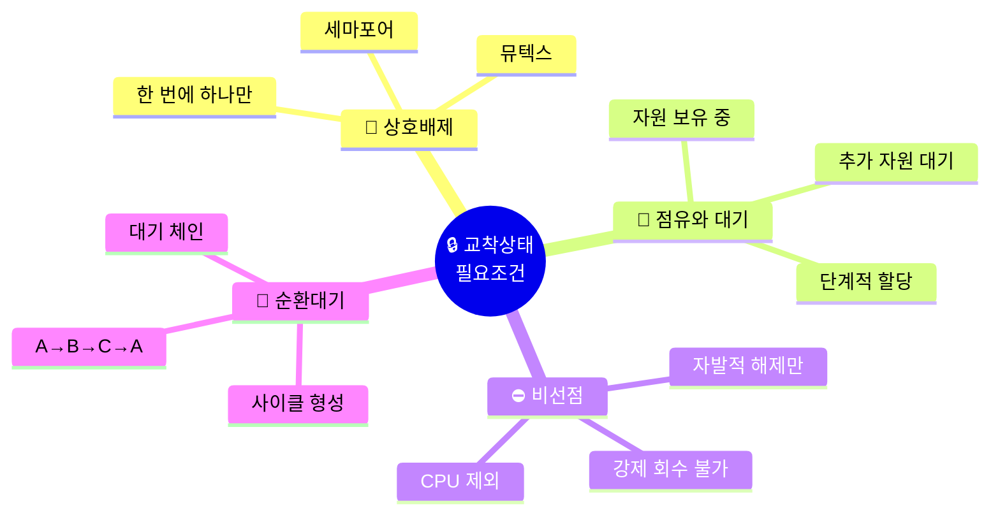

### 📊 조건별 상세 분석

#### 1️⃣ 🚫 상호 배제 (Mutual Exclusion)
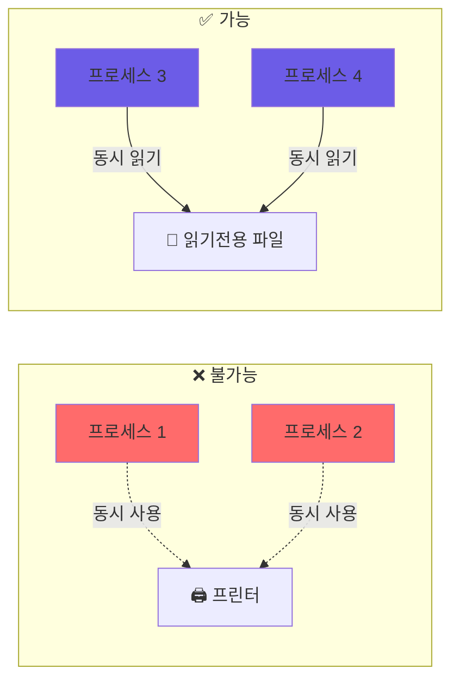

**특징:**
- 🖨️ **비공유 자원**: 프린터, 뮤텍스, 테이프 드라이브
- 📖 **공유 가능 자원**: 읽기 전용 파일, 공유 메모리(읽기)

#### 2️⃣ 🤝 점유와 대기 (Hold and Wait)
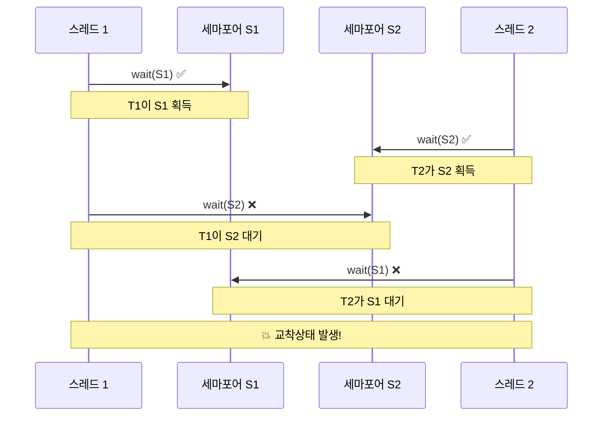

#### 3️⃣ ⛔ 비선점 (No Preemption)


#### 4️⃣ 🔄 순환 대기 (Circular Wait)


### 🎭 라이브락 vs 교착상태

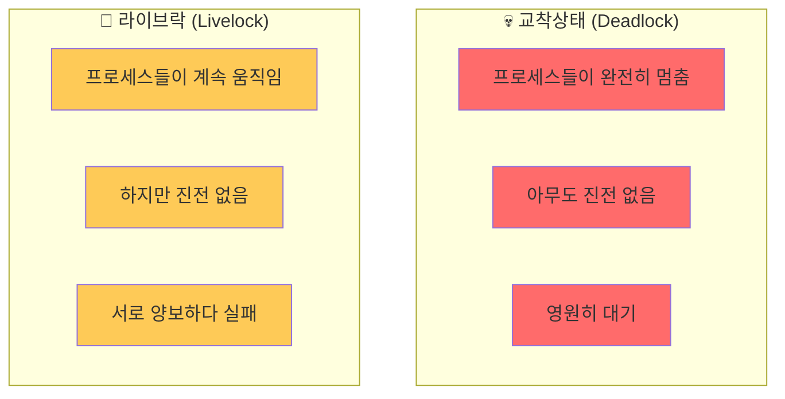

**🚶‍♂️ 라이브락 실생활 예시:**
> 좁은 복도에서 두 사람이 마주쳤을 때, 서로 비켜주려고 같은 방향으로 움직여서 계속 막히는 상황

### 🔍 자원 할당 그래프 (Resource Allocation Graph)

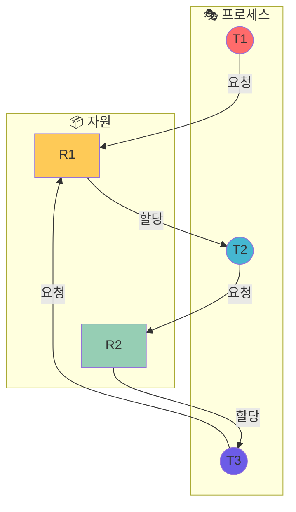

### 📈 교착상태 탐지 규칙

| 그래프 상태 | 인스턴스 수 | 교착상태 여부 |
|-------------|-------------|---------------|
| **🔄 사이클 없음** | 상관없음 | ✅ 교착상태 없음 |
| **🔄 사이클 있음** | 각 자원당 1개 | ❌ 교착상태 확실 |
| **🔄 사이클 있음** | 각 자원당 여러개 | ⚠️ 교착상태 가능성 |

---

## 🛡️ 교착상태 처리 전략

> 교착상태 문제를 해결하는 3가지 주요 접근법을 전략적으로 비교분석해보겠습니다.

### 🎯 처리 전략 전체 개요

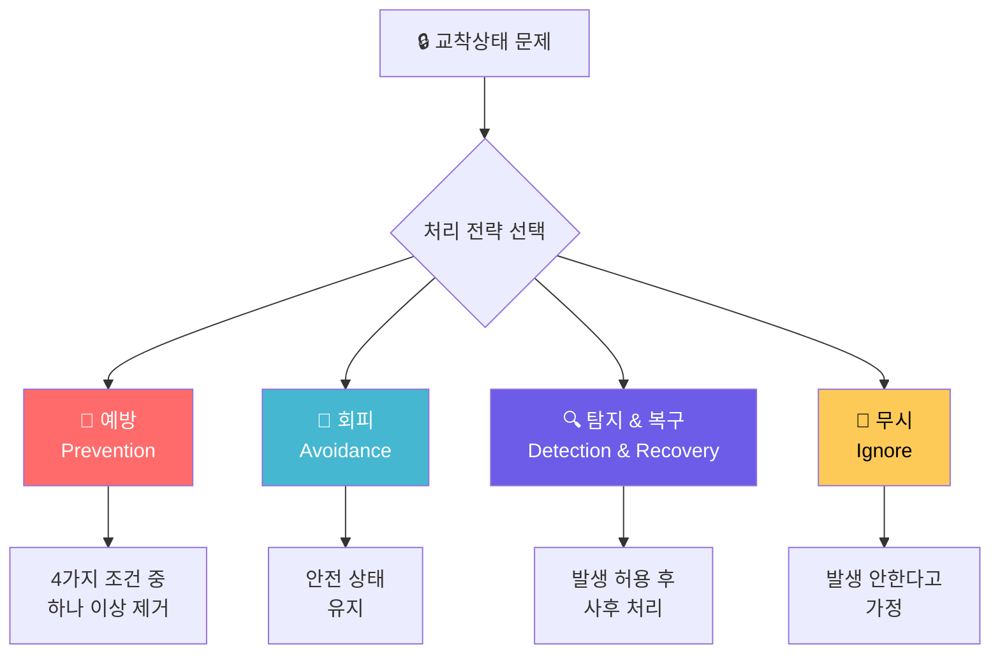

### 📊 전략별 비교 분석

| 전략 | 장점 | 단점 | 사용 시기 |
|------|------|------|----------|
| **🚫 예방** | • 확실한 방지<br/>• 구현 단순 | • 자원 효율성 저하<br/>• 처리량 감소 | • 안정성이 최우선<br/>• 성능 저하 허용 가능 |
| **🔮 회피** | • 최적 성능<br/>• 동적 할당 | • 사전 정보 필요<br/>• 복잡한 알고리즘 | • 자원 요구량 예측 가능<br/>• 성능 중시 |
| **🔍 탐지&복구** | • 유연성<br/>• 평상시 오버헤드 없음 | • 복구 비용<br/>• 작업 손실 가능 | • 교착상태 빈도 낮음<br/>• 복구 허용 가능 |
| **🙈 무시** | • 오버헤드 없음<br/>• 구현 불필요 | • 시스템 중단 위험<br/>• 복구 어려움 | • 교착상태 매우 드물 때<br/>• 개인용 PC |

### 🏗️ 선택 기준 결정 트리

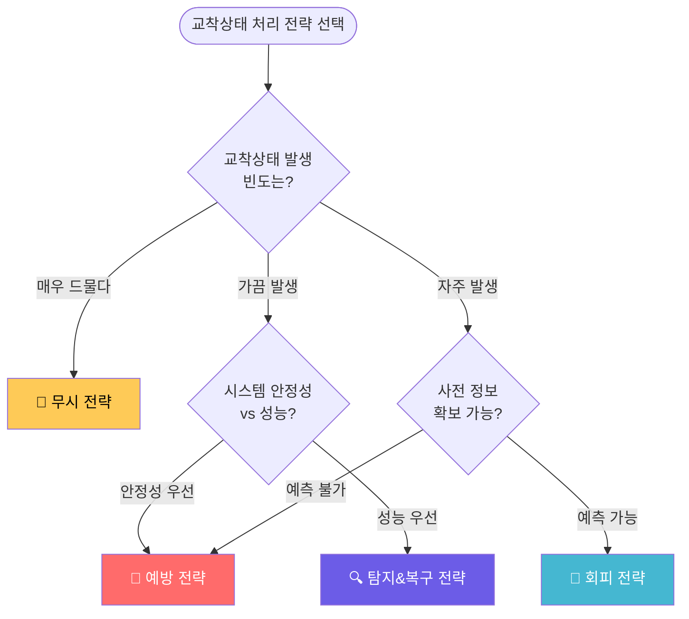

### 🌍 실제 시스템 적용 사례

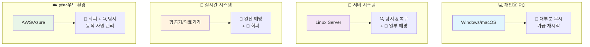

### 💡 전략 선택 가이드라인

#### 🎯 **예방 전략 선택 시**
```python
# 예방 전략이 적합한 경우
if (system_criticality == "HIGH" and 
    performance_drop_acceptable == True and
    deadlock_cost > prevention_cost):
    choose_prevention()
```

#### 🎯 **회피 전략 선택 시**  
```python
# 회피 전략이 적합한 경우
if (resource_prediction_possible == True and
    dynamic_allocation_needed == True and
    performance_critical == True):
    choose_avoidance()
```

#### 🎯 **탐지&복구 전략 선택 시**
```python
# 탐지&복구 전략이 적합한 경우
if (deadlock_frequency == "LOW" and
    recovery_cost_acceptable == True and
    flexibility_important == True):
    choose_detection_recovery()
```

### ⚠️ 주의사항 및 베스트 프랙티스

> **💡 Pro Tip**: 실제 시스템에서는 보통 **하이브리드 접근법**을 사용합니다!

**🔄 하이브리드 전략 예시:**
- **커널 내부**: 예방 전략 (안정성 최우선)
- **사용자 프로세스**: 탐지 & 복구 (유연성 중시)
- **실시간 작업**: 회피 전략 (성능 + 확실성)

**📋 구현 체크리스트:**
- [ ] 시스템 요구사항 명확히 정의
- [ ] 교착상태 발생 빈도 측정
- [ ] 각 전략의 비용-효과 분석
- [ ] 하이브리드 접근법 고려
- [ ] 모니터링 및 로깅 시스템 구축

## 교착상태 방지 (Deadlock Prevention)

교착상태 방지는 교착상태의 네 가지 필요 조건 중 하나 이상을 무효화함으로써 교착상태를 방지하는 방법입니다.

- **상호 배제(Mutual Exclusion)**: 공유 가능한 자원(예: 읽기 전용 파일)에는 상호 배제가 필요하지 않지만, 공유 불가능한 자원(non-sharable resources)에는 반드시 적용되어야 하므로 이 조건을 완전히 제거하는 것은 어렵습니다.
- **점유 및 대기(Hold and Wait)**:
  - 프로세스가 자원을 요청할 때, 다른 어떤 자원도 점유하고 있지 않음을 보장하는 방법입니다.
  - 예를 들어, 프로세스는 실행을 시작하기 전에 필요한 모든 자원을 한꺼번에 요청하고 할당받거나, 어떤 자원도 할당되지 않은 상태에서만 자원을 요청할 수 있도록 합니다.
  - 단점으로는 자원 활용률이 낮아지고 기아 상태(starvation)가 발생할 수 있습니다.
- **비선점(No Preemption)**:
  - 만약 프로세스가 이미 일부 자원을 점유하고 있는 상태에서 즉시 할당받을 수 없는 다른 자원을 요청한다면, 현재 점유하고 있는 모든 자원을 강제로 해제(release)하도록 합니다.
  - 선점된 자원들은 해당 프로세스가 기다리는 자원 목록에 추가되며, 프로세스는 원래 점유했던 자원과 새로 요청한 자원 모두를 다시 얻을 수 있을 때만 다시 시작됩니다.
- **순환 대기(Circular Wait)**:
  - 모든 자원 유형에 대해 총체적인 순서(total ordering)를 부과하고, 각 프로세스가 자원을 이 순서에 따라 오름차순으로만 요청하도록 요구하는 방법입니다.
  - 예를 들어, 뮤텍스 락(mutex locks)에 고유한 번호를 할당하고, 항상 낮은 번호의 락부터 높은 번호의 락 순서로 획득하도록 합니다. 영상에서 first_mutex = 1, second_mutex = 5와 같이 번호를 부여하여 thread_two의 락 획득 순서가 wait(s2) 다음 wait(s1)과 같이 되면 순환 대기가 발생할 수 있음을 보여줍니다.
  - 이 방법은 교착상태 방지에서 가장 일반적으로 사용되는 방법입니다.

## 교착상태 회피 (Deadlock Avoidance)

교착상태 회피는 시스템이 교착상태에 절대 진입하지 않도록 동적으로 자원 할당 상태를 검사합니다. 이를 위해 시스템은 사전에 각 프로세스가 필요로 할 최대 자원 수를 알아야 합니다.

- **자원 할당 상태(Resource-allocation state)**: 사용 가능한(available) 자원, 할당된(allocated) 자원, 프로세스의 최대 요구(maximum demands) 수에 의해 정의됩니다.
- **안전 상태(Safe State)**:
  - 시스템이 안전 상태에 있다는 것은 모든 스레드가 작업을 완료할 수 있는 일련의 순서(<T1, T2, ..., Tn>)가 존재함을 의미합니다.
  - 이 순서에서 각 Ti는 현재 사용 가능한 자원과 Tj(j < i)가 사용을 마친 후 반납할 자원만으로도 필요한 자원을 충족하여 작업을 완료할 수 있어야 합니다.
  - 안전 상태이면 교착상태가 발생하지 않습니다. 그러나 불안전 상태(unsafe state)라고 해서 반드시 교착상태인 것은 아니지만, 교착상태가 발생할 가능성이 있습니다.
  - 교착상태 회피 알고리즘은 시스템이 불안전 상태로 진입하는 것을 방지하는 것을 목표로 합니다.

### 회피 알고리즘 (Avoidance Algorithms)

- **자원 유형당 인스턴스가 하나인 경우(Single instance of a resource type)**: 자원 할당 그래프(Resource-Allocation Graph) 알고리즘을 사용합니다.
  - 클레임 간선(Claim edge): 프로세스 Ti가 자원 Rj를 요청할 수 있음을 나타내는 점선 화살표(Ti --> Rj)입니다. 프로세스 실행 전에 모든 클레임 간선이 그래프에 표시되어야 합니다.
  - 요청 간선(Request edge): 스레드가 자원을 요청할 때 클레임 간선이 요청 간선(실선)으로 바뀝니다 (Ti → Rj).
  - 할당 간선(Assignment edge): 자원이 스레드에 할당될 때 요청 간선이 할당 간선(Ti ← Rj)으로 바뀝니다.
  - 스레드가 자원을 해제하면 할당 간선은 다시 클레임 간선으로 바뀝니다.
  - 자원 할당 그래프 알고리즘은 스레드 Ti가 자원 Rj를 요청할 때, 요청 간선을 할당 간선으로 변경하는 것이 자원 할당 그래프에 사이클을 형성하지 않는 경우에만 요청을 승인합니다.
  - 사이클이 없으면 교착상태가 없고, 사이클이 있으면 인스턴스가 하나일 때는 데드락, 여러 개일 때는 데드락 가능성(unsafe)이 있습니다.
- **자원 유형당 인스턴스가 여러 개인 경우(Multiple instances of a resource type)**: **은행원 알고리즘(Banker's Algorithm)**을 사용합니다.
  - 각 스레드는 사전에 자신이 필요로 할 **최대 자원 사용량(maximum use)**을 선언해야 합니다.
  - 스레드가 자원을 요청할 때 대기해야 할 수도 있습니다.
  - 모든 자원을 얻은 스레드는 유한한 시간 내에 자원을 반납해야 합니다.
  - 은행원 알고리즘을 위한 자료 구조 (Data Structures):
    - n: 프로세스(스레드)의 수.
    - m: 자원 유형의 수.
    - Available: 길이 m의 벡터. Available[j] = k는 자원 유형 Rj의 k개의 인스턴스가 사용 가능함을 나타냅니다.
    - Max: n x m 행렬. Max[i,j] = k는 프로세스 Pi가 자원 유형 Rj의 최대 k개의 인스턴스를 요청할 수 있음을 나타냅니다.
    - Allocation: n x m 행렬. Allocation[i,j] = k는 프로세스 Pi가 현재 자원 유형 Rj의 k개의 인스턴스를 할당받았음을 나타냅니다.
    - Need: n x m 행렬. Need[i,j] = k는 프로세스 Pi가 작업을 완료하기 위해 자원 유형 Rj의 k개의 인스턴스가 더 필요함을 나타냅니다. Need[i,j] = Max[i,j] – Allocation[i,j].
  - 안전성 알고리즘 (Safety Algorithm):
    1. Work (길이 m)와 Finish (길이 n) 벡터를 초기화합니다. Work = Available, Finish[i] = false (i = 0, 1, ..., n-1).
    2. 다음 두 조건을 모두 만족하는 i를 찾습니다: (a) Finish[i] == false (b) Need_i <= Work 만약 그러한 i가 없으면 4단계로 이동합니다.
    3. Work = Work + Allocation_i. Finish[i] = true. 2단계로 돌아갑니다.
    4. 만약 모든 i에 대해 Finish[i] == true이면, 시스템은 안전 상태입니다.
  - 자원 요청 알고리즘 (Resource-Request Algorithm for Process Pi): 프로세스 Pi가 자원 유형 Rj의 k개 인스턴스를 요청할 때:
    1. 만약 Request_i <= Need_i이면 2단계로 이동합니다. 그렇지 않으면, 프로세스가 최대 요청량을 초과했으므로 오류 조건을 발생시킵니다.
    2. 만약 Request_i <= Available이면 3단계로 이동합니다. 그렇지 않으면, 자원이 사용 가능하지 않으므로 Ti는 대기해야 합니다.
    3. 요청된 자원을 Ti에 할당하는 것을 가정하여 시스템 상태를 임시로 수정합니다: Available = Available – Request_i; Allocation_i = Allocation_i + Request_i; Need_i = Need_i – Request_i;
    4. 이 새로운 상태에서 안전성 알고리즘을 실행합니다.
    - 만약 안전하면, 자원이 Ti에 할당됩니다.
    - 만약 불안전하면, Ti는 대기해야 하며 이전 자원 할당 상태로 복원됩니다.
  - 예시: 5개 스레드(T0-T4), 3개 자원 유형(A:10, B:5, C:7)의 스냅샷을 통해 은행원 알고리즘을 적용한 결과, <T1, T3, T4, T2, T0> 순서가 안전성 기준을 만족함을 보입니다. T1이 (1,0,2)를 요청했을 때, 시스템이 안전 상태로 유지될 수 있음을 보여주는 추가 예시도 제공됩니다.

## 교착상태 탐지 (Deadlock Detection)

> **현실적 접근법**: 교착상태 발생을 허용하되, **주기적으로 탐지**하여 발견 즉시 **적절한 복구 조치**를 취하는 전략입니다.

### 🎯 탐지 전략 개요

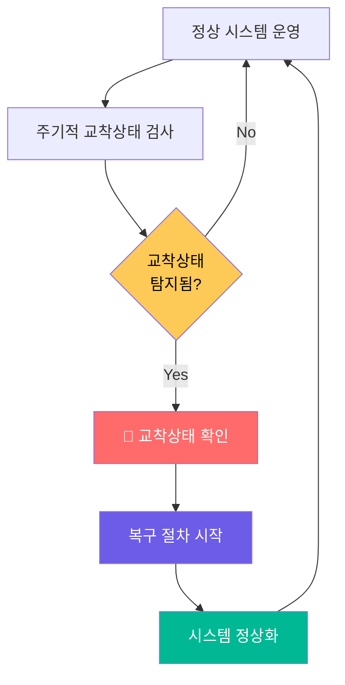

### 📊 탐지 방법별 분류

#### 1️⃣ 🔗 단일 인스턴스: 대기 그래프 (Wait-for Graph)

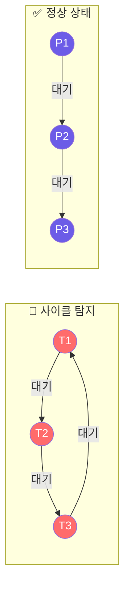

**🔍 대기 그래프 특징:**
- **노드**: 프로세스/스레드
- **간선**: Ti → Tj (Ti가 Tj를 대기)
- **탐지**: 사이클 존재 여부 확인
- **복잡도**: O(n²) - n은 프로세스 수

#### 📝 사이클 탐지 알고리즘

```python
def detect_deadlock_single_instance(wait_graph):
    """
    단일 인스턴스 자원에서 교착상태 탐지
    """
    visited = set()
    recursion_stack = set()
    
    def has_cycle(node):
        if node in recursion_stack:
            return True  # 사이클 발견!
        
        if node in visited:
            return False
            
        visited.add(node)
        recursion_stack.add(node)
        
        # 인접 노드들 검사
        for neighbor in wait_graph.get(node, []):
            if has_cycle(neighbor):
                return True
        
        recursion_stack.remove(node)
        return False
    
    # 모든 노드에서 시작하여 사이클 검사
    for process in wait_graph:
        if process not in visited:
            if has_cycle(process):
                return True  # 교착상태 발견
    
    return False  # 교착상태 없음
```

#### 2️⃣ 🏗️ 다중 인스턴스: 확장된 탐지 알고리즘

```mermaid
graph TB
    subgraph "📊 데이터 구조"
        AV[Available<br/>가용 자원]
        AL[Allocation<br/>현재 할당] 
        REQ[Request<br/>현재 요청]
    end
    
    subgraph "🔍 탐지 과정"
        INIT[초기화: Work = Available]
        FIND[Finish[i]=false이고<br/>Request_i <= Work인 i 찾기]
        UPDATE[Work += Allocation_i<br/>Finish[i] = true]
        CHECK[모든 Finish[i] 확인]
    end
    
    INIT --> FIND --> UPDATE --> FIND
    FIND --> CHECK
    
    style AV fill:#6c5ce7,color:#fff
    style AL fill:#00b894,color:#fff
    style REQ fill:#feca57,color:#000
```

##### 🔄 탐지 알고리즘 단계별 실행

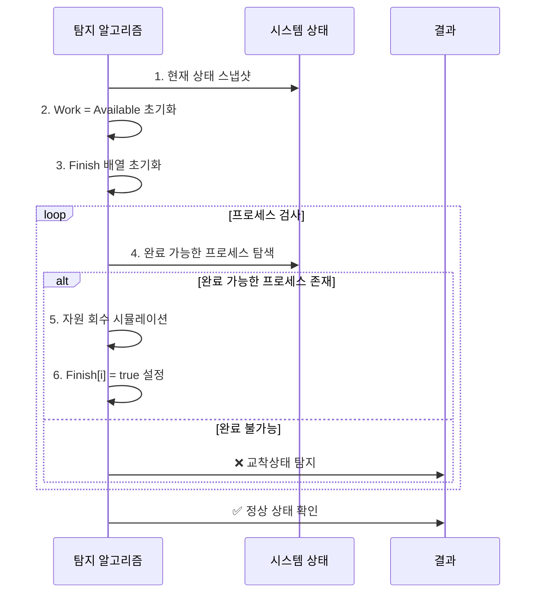

### 📈 실제 탐지 예시

**🏭 시스템 현황:**
- **프로세스**: T0, T1, T2, T3, T4
- **자원**: A=7, B=2, C=6
- **현재 상황**: T2가 추가 자원 요청

| 프로세스 | Allocation | Request |
|----------|------------|---------|
| T0 | (0,1,0) | (0,0,0) |
| T1 | (2,0,0) | (2,0,2) |
| T2 | (3,0,3) | (0,0,1) |
| T3 | (2,1,1) | (1,0,0) |
| T4 | (0,0,2) | (0,0,2) |

**Available = (0,0,0)**

```mermaid
gantt
    title 탐지 알고리즘 실행 과정
    dateFormat X
    axisFormat %s
    
    section 1차 검사
    T0 완료 가능 :done, t0, 0, 1
    Available 업데이트 :milestone, m1, 1, 0
    
    section 2차 검사  
    완료 가능한 프로세스 없음 :crit, none, 1, 2
    
    section 결과
    교착상태 탐지 :milestone, deadlock, 2, 0
```

**🚨 탐지 결과**: T1, T2, T3, T4가 교착상태!

### ⏰ 탐지 빈도 및 타이밍

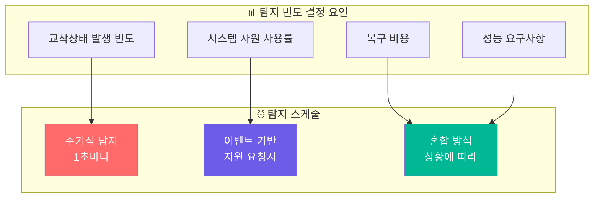

### 📊 탐지 오버헤드 분석

| 탐지 방법 | 시간 복잡도 | 공간 복잡도 | 실용성 |
|-----------|-------------|-------------|--------|
| **대기 그래프** | O(n²) | O(n²) | 🟢 높음 |
| **다중 인스턴스** | O(m×n²) | O(m×n) | 🟡 중간 |

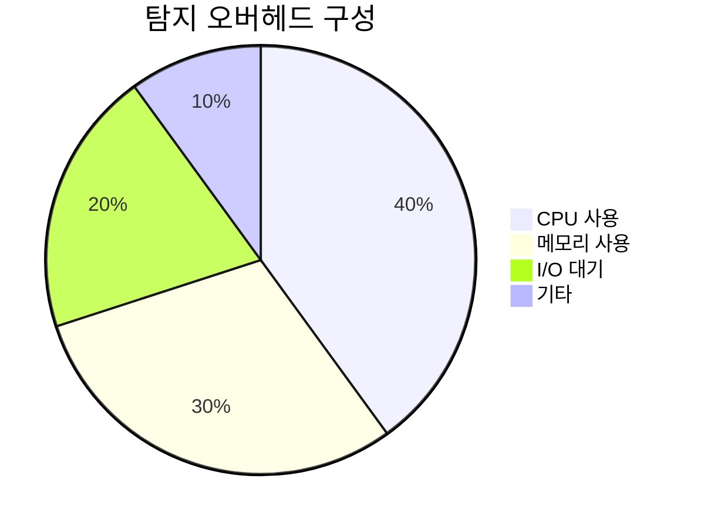

---

## 🏥 교착상태 복구 (Recovery from Deadlock)

> **치료 과정**: 교착상태가 탐지되었을 때 **최소 비용**으로 **시스템을 정상 상태**로 복원하는 핵심 전략들을 알아보겠습니다.

### 🎯 복구 전략 개요

```mermaid
graph TD
    A[🚨 교착상태 탐지] --> B{복구 방법 선택}
    
    B --> C[💀 프로세스 종료]
    B --> D[🔄 자원 선점]
    
    C --> C1[전체 종료<br/>빠르지만 손실 큼]
    C --> C2[단계적 종료<br/>손실 최소화]
    
    D --> D1[희생자 선택<br/>최소 비용]
    D --> D2[롤백 수행<br/>안전 상태로]
    
    style C fill:#ff6b6b,color:#fff
    style D fill:#6c5ce7,color:#fff
    style C1 fill:#ff9999
    style C2 fill:#ffcccc
    style D1 fill:#ccddff
    style D2 fill:#99ccff
```

### 💀 방법 1: 프로세스 종료 (Process Termination)

#### 🎯 종료 전략

```mermaid
flowchart TD
    Start([교착상태 발견]) --> Choose{종료 방식}
    
    Choose -->|전체 종료| All[모든 교착 프로세스<br/>동시 종료]
    Choose -->|단계적 종료| One[하나씩 순차<br/>종료]
    
    All --> AllPros[✅ 확실한 해결<br/>❌ 큰 손실]
    One --> OnePros[✅ 손실 최소화<br/>❌ 복잡한 과정]
    
    OnePros --> Check{교착상태<br/>해결됨?}
    Check -->|No| SelectNext[다음 프로세스 선택]
    Check -->|Yes| Success[✅ 복구 완료]
    
    SelectNext --> One
    
    style All fill:#ff6b6b,color:#fff
    style One fill:#6c5ce7,color:#fff
    style Success fill:#00b894,color:#fff
```

#### 🎯 희생자 선택 기준

```mermaid
radar
    title 프로세스 종료 우선순위 결정 요소
    "우선순위" : [3, 1, 4, 2, 5]
    "실행 시간" : [2, 4, 1, 5, 3]
    "자원 사용량" : [4, 2, 3, 1, 5]
    "완료 시간" : [1, 5, 2, 4, 3]
    "종료 비용" : [5, 3, 1, 2, 4]
    "프로세스 유형" : [2, 4, 5, 1, 3]
```

**📋 선택 기준 상세:**

| 기준 | 설명 | 가중치 |
|------|------|--------|
| **🎯 우선순위** | 낮은 우선순위부터 종료 | ⭐⭐⭐⭐⭐ |
| **⏱️ 실행 시간** | 짧게 실행된 프로세스 우선 | ⭐⭐⭐⭐ |
| **💾 자원 사용량** | 적게 사용한 프로세스 우선 | ⭐⭐⭐ |
| **⏳ 완료까지 시간** | 완료까지 오래 걸리는 것 우선 | ⭐⭐⭐ |
| **💰 종료 비용** | 종료 비용이 낮은 것 우선 | ⭐⭐⭐⭐ |
| **🔄 프로세스 유형** | 배치 > 대화형 | ⭐⭐ |

#### 💻 종료 알고리즘 예시

```python
def select_victim_process(deadlocked_processes):
    """
    교착상태 프로세스 중 희생자 선택
    """
    best_victim = None
    min_cost = float('inf')
    
    for process in deadlocked_processes:
        # 종료 비용 계산 (가중 합계)
        cost = (
            process.priority * 0.3 +           # 우선순위
            process.execution_time * 0.2 +     # 실행 시간  
            process.resource_usage * 0.2 +     # 자원 사용량
            process.remaining_time * 0.15 +    # 남은 시간
            process.termination_cost * 0.1 +   # 종료 비용
            process.type_penalty * 0.05        # 유형별 페널티
        )
        
        if cost < min_cost:
            min_cost = cost
            best_victim = process
    
    return best_victim

def terminate_processes_gradually(deadlocked_processes):
    """
    단계적 프로세스 종료
    """
    while deadlocked_processes:
        # 희생자 선택
        victim = select_victim_process(deadlocked_processes)
        
        # 프로세스 종료
        terminate_process(victim)
        deadlocked_processes.remove(victim)
        
        # 교착상태 해결 확인
        if not detect_deadlock():
            print("교착상태 해결됨!")
            break
        
        print(f"프로세스 {victim.id} 종료, 교착상태 지속")
```

---

### 🔄 방법 2: 자원 선점 (Resource Preemption)

#### 🎯 선점 과정

```mermaid
sequenceDiagram
    participant DM as 교착상태 관리자
    participant V as 희생자 프로세스
    participant R as 자원
    participant S as 시스템
    
    DM->>V: 1. 희생자 선택
    DM->>V: 2. 프로세스 상태 저장
    DM->>R: 3. 자원 강제 회수
    DM->>S: 4. 자원 재할당
    
    Note over V: 프로세스 중단
    
    S->>DM: 5. 교착상태 해결 확인
    DM->>V: 6. 안전한 상태로 롤백
    DM->>V: 7. 프로세스 재시작
    
    Note over V: 프로세스 재개
```

#### 🔍 희생자 선택 (Victim Selection)

```mermaid
graph TB
    subgraph "💰 비용 계산 요소"
        C1[보유 자원 수]
        C2[실행 진행도]  
        C3[롤백 복잡도]
        C4[우선순위]
        C5[이전 선점 횟수]
    end
    
    subgraph "🎯 선택 알고리즘"
        CALC[종합 비용 계산]
        MIN[최소 비용 프로세스]
        SELECT[희생자 선정]
    end
    
    C1 --> CALC
    C2 --> CALC  
    C3 --> CALC
    C4 --> CALC
    C5 --> CALC
    
    CALC --> MIN --> SELECT
    
    style CALC fill:#feca57,color:#000
    style SELECT fill:#ff6b6b,color:#fff
```

#### 📊 롤백 (Rollback) 전략

```mermaid
flowchart TD
    A[자원 선점 결정] --> B{롤백 방식}
    
    B -->|전체 롤백| C[초기 상태로 복원<br/>Total Rollback]
    B -->|부분 롤백| D[안전점까지만 복원<br/>Partial Rollback]
    
    C --> C1[✅ 확실한 복구<br/>❌ 큰 손실]
    D --> D1[✅ 손실 최소화<br/>❌ 복잡한 관리]
    
    C1 --> E[체크포인트 복원]
    D1 --> F[선택적 상태 복원]
    
    E --> G[프로세스 재시작]
    F --> G
    
    style C fill:#ff6b6b,color:#fff
    style D fill:#6c5ce7,color:#fff
    style G fill:#00b894,color:#fff
```

#### 🔄 기아상태 방지 (Starvation Prevention)

```mermaid
graph LR
    subgraph "🚨 기아상태 문제"
        P[프로세스 A] -->|계속 선택됨| V1[1차 희생]
        V1 --> V2[2차 희생]  
        V2 --> V3[3차 희생]
        V3 --> STARV[기아상태]
        
        style STARV fill:#ff6b6b,color:#fff
    end
    
    subgraph "✅ 해결 방안"
        COUNT[선점 횟수 추적]
        LIMIT[최대 횟수 제한]
        PRIORITY[우선순위 상승]
        AGING[에이징 적용]
        
        style COUNT fill:#6c5ce7,color:#fff
        style PRIORITY fill:#00b894,color:#fff
    end
```

**🛡️ 기아상태 방지 전략:**

```python
class StarvationPrevention:
    def __init__(self):
        self.preemption_count = {}  # 프로세스별 선점 횟수
        self.max_preemptions = 3    # 최대 허용 선점 횟수
    
    def select_victim_with_fairness(self, candidates):
        """
        공정성을 고려한 희생자 선택
        """
        # 선점 횟수가 적은 프로세스들 우선 고려
        fair_candidates = [
            p for p in candidates 
            if self.preemption_count.get(p.id, 0) < self.max_preemptions
        ]
        
        if not fair_candidates:
            # 모든 프로세스가 최대 횟수에 도달한 경우
            # 가장 오래전에 선점된 프로세스 선택
            return min(candidates, 
                      key=lambda p: p.last_preemption_time)
        
        # 일반적인 비용 기반 선택
        return min(fair_candidates, key=self.calculate_cost)
    
    def record_preemption(self, victim):
        """
        선점 기록 업데이트
        """
        self.preemption_count[victim.id] = \
            self.preemption_count.get(victim.id, 0) + 1
        victim.last_preemption_time = current_time()
```

### 📊 복구 방법 비교분석

| 복구 방법 | 속도 | 비용 | 복잡도 | 안전성 |
|-----------|------|------|--------|--------|
| **💀 전체 종료** | 🟢 매우 빠름 | 🔴 매우 높음 | 🟢 낮음 | 🟢 높음 |
| **💀 단계적 종료** | 🟡 보통 | 🟡 보통 | 🟡 중간 | 🟢 높음 |
| **🔄 자원 선점** | 🟡 보통 | 🟢 낮음 | 🔴 높음 | 🟡 보통 |

```mermaid
pie title 복구 방법 선택 비율 (실제 시스템)
    "자원 선점" : 60
    "단계적 종료" : 30
    "전체 종료" : 10
```

### 🌟 실제 시스템 적용 사례

```mermaid
graph TB
    subgraph "🗄️ 데이터베이스"
        DB[트랜잭션 롤백]
        DB --> DB1[COMMIT/ROLLBACK]
    end
    
    subgraph "🌐 웹서버"
        WS[연결 종료]
        WS --> WS1[타임아웃 기반]
    end
    
    subgraph "🎮 게임"
        GM[상태 리셋]
        GM --> GM1[체크포인트 복원]
    end
    
    subgraph "☁️ 클라우드"
        CL[인스턴스 재시작]
        CL --> CL1[오토스케일링]
    end
    
    style DB fill:#e1f5fe
    style WS fill:#f3e5f5
    style GM fill:#fff3e0
    style CL fill:#e8f5e8
```

### 💡 복구 성공률 향상 팁

> **🎯 Pro Tips**: 복구 과정에서 성공률을 높이는 핵심 전략들

**📋 체크리스트:**
- [ ] **정기적 체크포인트**: 롤백 지점 미리 설정
- [ ] **우선순위 기반 선택**: 시스템 중요도 고려
- [ ] **점진적 복구**: 급격한 변화 피하기
- [ ] **모니터링 강화**: 복구 과정 실시간 감시
- [ ] **학습 기반 개선**: 이전 복구 경험 활용

---

## 📚 추가 학습 자료

### 🎓 심화 학습 주제

```mermaid
mindmap
  root((🔒 교착상태<br/>심화 주제))
    🏗️ 실무 응용
      분산 시스템 교착상태
      마이크로서비스 아키텍처
      데이터베이스 락 관리
      클라우드 자원 관리
    🧪 연구 분야
      양자 컴퓨팅 동기화
      AI/ML 자원 스케줄링  
      블록체인 합의 알고리즘
      IoT 디바이스 협조
    🔧 도구 & 기법
      교착상태 시뮬레이터
      성능 분석 도구
      자동 탐지 시스템
      예방 패턴 라이브러리
    📖 추가 읽기
      운영체제 교과서
      시스템 프로그래밍 가이드
      동시성 프로그래밍 패턴
      분산 시스템 설계
```

### 🛠️ 실습 프로젝트 아이디어

1. **🎯 교착상태 시뮬레이터**: 다양한 시나리오의 교착상태를 시각화
2. **🔍 자동 탐지 도구**: 실시간 시스템 모니터링 및 교착상태 탐지
3. **🏦 은행원 알고리즘 구현**: 대화형 자원 할당 시뮬레이션
4. **🎮 게임 기반 학습**: 교착상태 개념을 게임으로 학습

### 📊 성능 벤치마크

> **실제 측정 데이터** (Intel i7, 16GB RAM 환경)

| 알고리즘 | 프로세스 수 | 평균 탐지 시간 | 메모리 사용량 |
|----------|-------------|----------------|---------------|
| **대기 그래프** | 100 | 0.5ms | 2MB |
| **대기 그래프** | 1000 | 25ms | 18MB |
| **은행원 알고리즘** | 100 | 2ms | 5MB |
| **은행원 알고리즘** | 1000 | 180ms | 45MB |

### 🔗 참고 자료

**📚 권장 도서:**
- "Operating System Concepts" - Silberschatz, Galvin, Gagne
- "Modern Operating Systems" - Andrew S. Tanenbaum
- "Distributed Systems" - Maarten van Steen

**🌐 온라인 리소스:**
- [교착상태 시각화 도구](https://example.com/deadlock-visualizer)
- [운영체제 시뮬레이터](https://example.com/os-simulator)
- [동시성 프로그래밍 가이드](https://example.com/concurrency-guide)

---

## 🎯 핵심 요약

### 📝 기억해야 할 핵심 포인트

```mermaid
graph TB
    subgraph "🔑 핵심 개념"
        K1[4가지 필요조건<br/>모두 충족시 발생]
        K2[예방 vs 회피 vs 탐지&복구<br/>상황별 선택]
        K3[순환 대기 제거가<br/>가장 실용적]
        K4[하이브리드 접근법<br/>실제 시스템에서 선호]
    end
    
    style K1 fill:#ff6b6b,color:#fff
    style K2 fill:#6c5ce7,color:#fff
    style K3 fill:#00b894,color:#fff
    style K4 fill:#feca57,color:#000
```

### 🏆 실무 적용 가이드

> **💼 현업에서 교착상태 문제를 다룰 때 기억할 점**

1. **🎯 상황 분석**: 시스템 특성과 요구사항 파악
2. **⚖️ 전략 선택**: 성능 vs 안정성 트레이드오프 고려  
3. **🔄 점진적 적용**: 한 번에 모든 것을 바꾸지 말고 단계적 적용
4. **📊 지속적 모니터링**: 적용 후 성능 및 안정성 측정
5. **🎓 팀 교육**: 모든 개발자가 교착상태 원리 이해

**🌟 마지막 조언**: 교착상태는 복잡한 문제이지만, **체계적인 접근**과 **적절한 도구**를 사용하면 충분히 관리 가능한 문제입니다!

---

> **📖 이 문서가 교착상태 이해에 도움이 되었나요?** 
> 더 깊이 있는 학습을 위해 실습 프로젝트와 시뮬레이션 도구를 활용해보세요! 🚀
