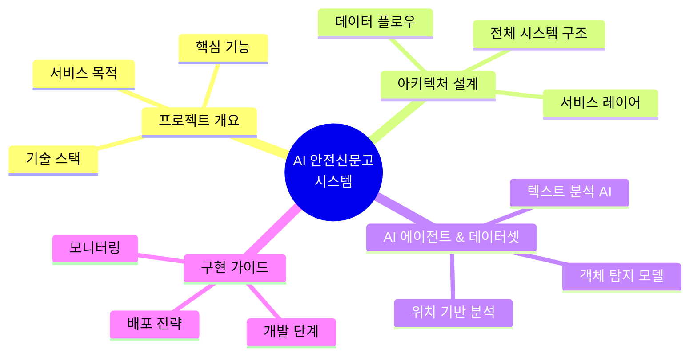
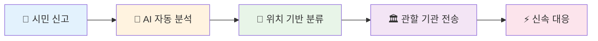
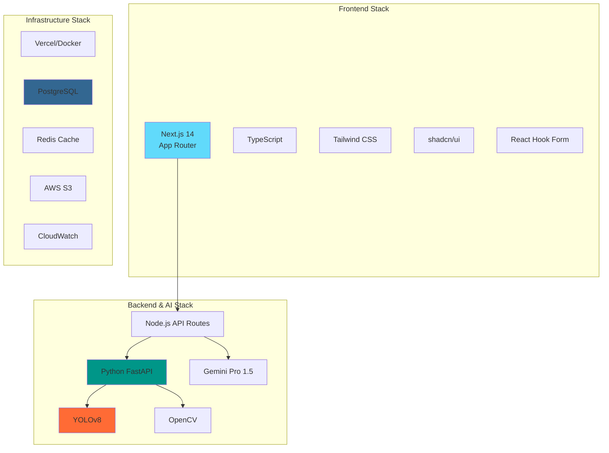
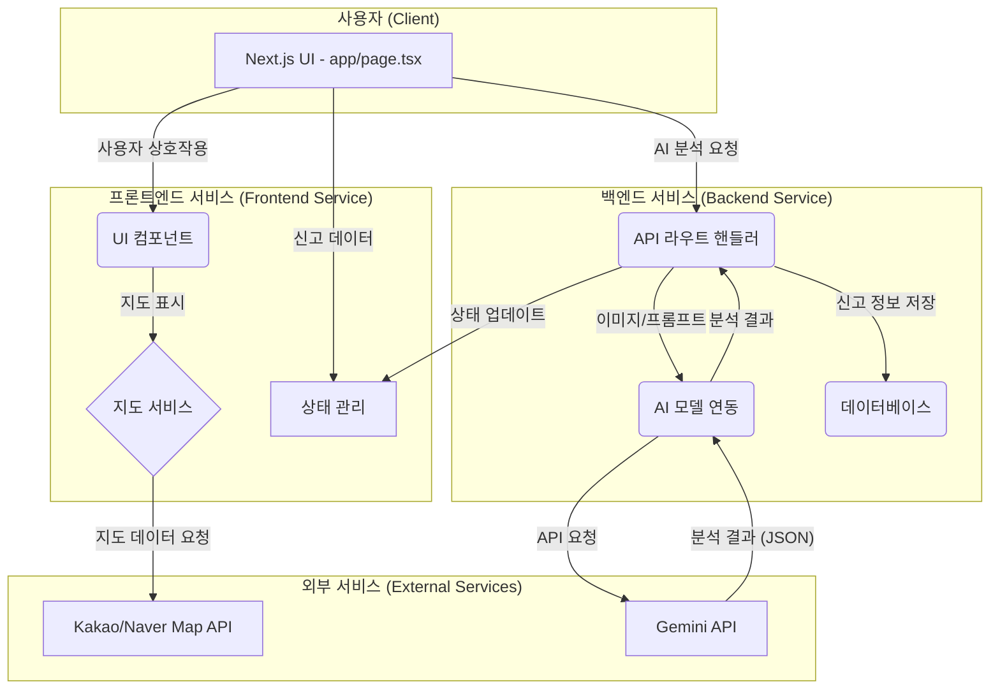
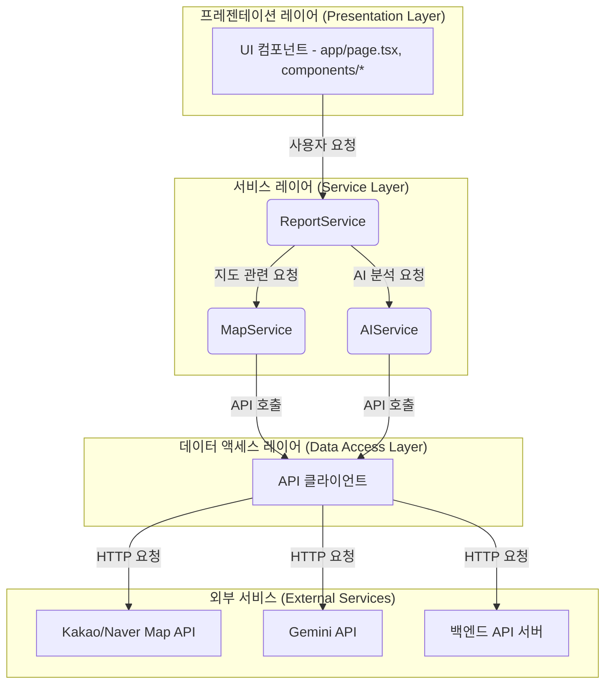

# 🚨 AI 안전신문고: 통합 아키텍처 설계 및 구현 가이드

**프로젝트명**: AI 안전신문고 (AI Safety Report System)  
**작성일**: 2025년 6월 21일  
**버전**: v1.0  
**문서 목적**: 객체 탐지 기반 안전신문고 시스템의 종합적인 아키텍처 설계 및 구현 방안

---

## 📋 목차

---

## 1. 🎯 프로젝트 개요

### 1.1 서비스 목적 및 비전

**AI 안전신문고**는 시민들이 일상에서 마주하는 다양한 안전 위험 요소를 **AI 기반 객체 탐지 기술**을 활용하여 신속하고 정확하게 신고할 수 있는 **통합 플랫폼**입니다.

### 1.2 핵심 기능 및 가치 제안

| 🎯 **핵심 기능** | 📝 **상세 설명** | 💡 **기술적 가치** |
|------------------|------------------|-------------------|
| **🔍 객체 탐지 기반 신고** | 사진/영상 업로드 시 AI가 자동으로 위험 요소 식별 | YOLOv8, OpenCV 활용한 실시간 분석 |
| **📍 지능형 위치 서비스** | GPS 좌표를 행정구역/관할 기관으로 자동 매핑 | Kakao/Naver Map API 연동 |
| **🤖 자연어 처리** | 신고 내용 텍스트 자동 분류 및 요약 | Gemini Pro 1.5 활용 |
| **🏛️ 스마트 라우팅** | 신고 유형에 따른 최적 담당 기관 자동 배정 | 룰 기반 + AI 하이브리드 |
| **📊 실시간 대시보드** | 신고 현황 및 처리 상태 시각화 | Chart.js, D3.js 활용 |

### 1.3 기술 스택 개요

---

### 1\. 프로젝트 아키텍처 다이어그램

프로젝트의 전체적인 구조와 데이터 흐름은 다음과 같이 시각화할 수 있습니다.

| 기호   | 설명                  |
| :----- | :-------------------- |
| **[]** | 컴포넌트 또는 UI 요소 |
| **()** | 서비스 또는 기능 모듈 |
| **{}** | 외부 API 또는 서비스  |

### 2\. 서비스 레이어 아키텍처 제안

현재 코드는 UI와 비즈니스 로직이 `app/page.tsx` 파일에 집중되어 있습니다. 향후 기능 확장과 유지보수의 용이성을 위해 다음과 같은 서비스 레이어 아키텍처 도입을 제안합니다.

#### **2.1. 제안 아키텍처 다이어그램**

#### **2.2. 서비스 레이어별 역할**

- **프레젠테이션 레이어 (Presentation Layer)**

  - **역할:** 사용자 인터페이스(UI)와 사용자 경험(UX)에 집중합니다.
  - **파일:** `app/page.tsx`, `components/*`
  - **주요 책임:**
    - 사용자 입력(이미지 업로드, 텍스트 입력 등) 처리
    - 서비스 레이어에서 받은 데이터를 화면에 렌더링
    - 사용자 상호작용에 따라 서비스 레이어의 함수 호출

- **서비스 레이어 (Service Layer)**

  - **역할:** 애플리케이션의 핵심 비즈니스 로직을 처리합니다. UI와 데이터 통신을 분리하여 코드의 재사용성과 테스트 용이성을 높입니다.
  - **구현 (신규 파일 제안):**
    - `services/reportService.ts`: 신고 접수, 상태 관리 등 신고 관련 비즈니스 로직
    - `services/mapService.ts`: 지도 관련 로직 (좌표-주소 변환, 검색 등)
    - `services/aiService.ts`: AI 모델(Gemini) 호출 및 결과 처리 로직

- **데이터 액세스 레이어 (Data Access Layer)**

  - **역할:** 외부 API와의 통신을 담당합니다.
  - **구현 (신규 파일 제안):**
    - `lib/apiClient.ts`: `fetch`를 기반으로 외부 API(Gemini, 자체 백엔드 서버 등)와 통신하는 클라이언트 모듈

### 3\. UX 유연성 및 일관성 확보 방안

다른 프로젝트와의 비교 및 일반적인 UX 패턴을 고려할 때, 다음과 같은 개선을 통해 사용자 경험의 유연성과 일관성을 높일 수 있습니다.

- **컴포넌트 기반 아키텍처 강화:**

  - `shadcn/ui`와 같은 컴포넌트 라이브러리를 적극적으로 활용하여 UI의 일관성을 유지합니다.
  - `UnifiedMap`, `MapProviderSelector`와 같이 재사용 가능한 컴포넌트로 기능을 모듈화하여 코드의 가독성과 유지보수성을 향상시킵니다.

- **상태 관리의 중앙화:**

  - 현재 `useState`를 통해 `app/page.tsx`에서 상태를 관리하고 있습니다. 프로젝트 규모가 커질 경우, `React Context`, `Zustand` 또는 `Recoil`과 같은 상태 관리 라이브러리를 도입하여 상태를 중앙에서 관리하고 컴포넌트 간 데이터 전달을 용이하게 할 수 있습니다.

- **사용자 피드백 강화:**

  - AI 분석, 민원 접수 등 비동기 작업 진행 시, 로딩 인디케이터나 스켈레톤 UI를 활용하여 사용자에게 명확한 피드백을 제공합니다.
  - `sonner`나 `react-hot-toast`와 같은 라이브러리를 사용하여 작업 완료 또는 오류 발생 시 토스트 메시지를 표시하여 사용자 경험을 개선할 수 있습니다.

- **API 응답 형식의 표준화:**

  - Gemini API와 같은 외부 AI 에이전트와 통신할 때, 프롬프트를 통해 응답 형식을 JSON으로 명확히 지정하여 안정적인 데이터 처리를 보장합니다. 이는 API 응답의 변화에 유연하게 대처할 수 있게 해줍니다.

이러한 서비스 레이어 아키텍처와 UX 개선 방안을 도입하면, 'AI 안전신문고' 프로젝트는 더욱 견고하고 확장 가능하며 사용자 친화적인 서비스로 발전할 수 있을 것입니다.
