# 🚨 AI 안전신문고: 통합 아키텍처 설계 및 구현 가이드

**프로젝트명**: AI 안전신문고 (AI Safety Report System)  
**작성일**: 2025년 6월 21일  
**버전**: v1.0  
**문서 목적**: 객체 탐지 기반 안전신문고 시스템의 종합적인 아키텍처 설계 및 구현 방안

---

## 📋 목차

```mermaid
mindmap
  root((AI 안전신문고<br/>시스템))
    프로젝트 개요
      서비스 목적
      핵심 기능
      기술 스택
    아키텍처 설계
      전체 시스템 구조
      서비스 레이어
      데이터 플로우
    AI 에이전트 & 데이터셋
      객체 탐지 모델
      텍스트 분석 AI
      위치 기반 분석
    구현 가이드
      개발 단계
      배포 전략
      모니터링
```



---

## 1. 🎯 프로젝트 개요

### 1.1 서비스 목적 및 비전

**AI 안전신문고**는 시민들이 일상에서 마주하는 다양한 안전 위험 요소를 **AI 기반 객체 탐지 기술**을 활용하여 신속하고 정확하게 신고할 수 있는 **통합 플랫폼**입니다.

```mermaid
graph LR
    A[📱 시민 신고] --> B[🤖 AI 자동 분석]
    B --> C[📍 위치 기반 분류]
    C --> D[🏛️ 관할 기관 전송]
    D --> E[⚡ 신속 대응]
    
    style A fill:#e3f2fd
    style B fill:#fff3e0
    style C fill:#e8f5e8
    style D fill:#f3e5f5
    style E fill:#fce4ec
```



### 1.2 핵심 기능 및 가치 제안

| 🎯 **핵심 기능** | 📝 **상세 설명** | 💡 **기술적 가치** |
|------------------|------------------|-------------------|
| **🔍 객체 탐지 기반 신고** | 사진/영상 업로드 시 AI가 자동으로 위험 요소 식별 | YOLOv8, OpenCV 활용한 실시간 분석 |
| **📍 지능형 위치 서비스** | GPS 좌표를 행정구역/관할 기관으로 자동 매핑 | Kakao/Naver Map API 연동 |
| **🤖 자연어 처리** | 신고 내용 텍스트 자동 분류 및 요약 | Gemini Pro 1.5 활용 |
| **🏛️ 스마트 라우팅** | 신고 유형에 따른 최적 담당 기관 자동 배정 | 룰 기반 + AI 하이브리드 |
| **📊 실시간 대시보드** | 신고 현황 및 처리 상태 시각화 | Chart.js, D3.js 활용 |

### 1.3 기술 스택 개요


---

## 2. 🏗️ 전체 시스템 아키텍처

### 2.1 고수준 아키텍처 다이어그램

```mermaid
graph TD
    subgraph "📱 Client Layer"
        A["Web Browser<br/>(Next.js PWA)"]
        B["Mobile App<br/>(React Native)"]
        C["Admin Dashboard<br/>(React)"]
    end

    subgraph "🌐 API Gateway Layer"
        D["NGINX<br/>Load Balancer"]
        E["Rate Limiting"]
        F["API Authentication"]
    end

    subgraph "🔧 Application Layer"
        G["Next.js API Routes<br/>(Node.js)"]
        H["Python AI Service<br/>(FastAPI)"]
        I["Notification Service<br/>(Node.js)"]
    end

    subgraph "🤖 AI Processing Layer"
        J["Object Detection<br/>(YOLOv8)"]
        K["Text Analysis<br/>(Gemini Pro)"]
        L["Image Processing<br/>(OpenCV)"]
        M["Location Analysis<br/>(Geospatial AI)"]
    end

    subgraph "💾 Data Layer"
        N["PostgreSQL<br/>(Primary DB)"]
        O["Redis<br/>(Cache & Session)"]
        P["AWS S3<br/>(File Storage)"]
        Q["Elasticsearch<br/>(Search & Analytics)"]
    end

    subgraph "🔗 External Services"
        R["Kakao Map API"]
        S["Naver Map API"]
        T["Government API"]
        U["SMS/Email Service"]
    end

    A --> D
    B --> D
    C --> D
    D --> E
    E --> F
    F --> G
    G --> H
    G --> I
    
    H --> J
    H --> K
    H --> L
    H --> M
    
    G --> N
    G --> O
    H --> P
    G --> Q
    
    G --> R
    G --> S
    I --> T
    I --> U
    
    style A fill:#e3f2fd
    style H fill:#fff3e0
    style J fill:#e8f5e8
    style N fill:#f3e5f5
```



### 2.2 데이터 플로우 시퀀스

```mermaid
sequenceDiagram
    participant U as 사용자
    participant W as Web App
    participant A as API Gateway
    participant S as AI Service
    participant D as Database
    participant E as External APIs
    
    U->>W: 1. 사진 업로드 + 위치 정보
    W->>A: 2. 신고 접수 요청
    A->>S: 3. AI 분석 요청
    
    par 객체 탐지
        S->>S: 4a. YOLO 모델 실행
    and 텍스트 분석
        S->>S: 4b. Gemini API 호출
    and 위치 분석
        S->>E: 4c. 지도 API 조회
    end
    
    S->>A: 5. 분석 결과 반환
    A->>D: 6. 신고 데이터 저장
    A->>W: 7. 처리 결과 응답
    W->>U: 8. 신고 완료 알림
    
    Note over S,D: 비동기 후처리
    S->>D: 9. 상세 분석 결과 저장
    S->>E: 10. 관할 기관 알림 발송
```



---

## 3. 🔧 서비스 레이어 아키텍처

### 3.1 계층별 상세 설계

```mermaid
graph TB
    subgraph "🎨 Presentation Layer"
        A1["Pages & Components<br/>• app/page.tsx<br/>• components/ui/*<br/>• components/maps/*"]
        A2["State Management<br/>• Zustand Store<br/>• React Query Cache<br/>• Form Validation"]
    end

    subgraph "⚡ Service Layer"
        B1["ReportService<br/>• 신고 접수 로직<br/>• 상태 관리<br/>• 유효성 검증"]
        B2["AIService<br/>• 객체 탐지 요청<br/>• 텍스트 분석<br/>• 결과 포맷팅"]
        B3["MapService<br/>• 좌표 변환<br/>• 주소 검색<br/>• 관할 구역 판정"]
        B4["NotificationService<br/>• 실시간 알림<br/>• 이메일 발송<br/>• SMS 전송"]
    end

    subgraph "📡 Data Access Layer"
        C1["API Client<br/>• HTTP 통신<br/>• 에러 핸들링<br/>• 재시도 로직"]
        C2["Database Repository<br/>• CRUD 작업<br/>• 트랜잭션 관리<br/>• 쿼리 최적화"]
    end

    subgraph "🗃️ Infrastructure Layer"
        D1["External APIs<br/>• Gemini Pro<br/>• Map Services<br/>• Government APIs"]
        D2["Storage<br/>• PostgreSQL<br/>• Redis<br/>• AWS S3"]
    end

    A1 --> B1
    A1 --> B2
    A1 --> B3
    A2 --> B1
    
    B1 --> C1
    B2 --> C1
    B3 --> C1
    B4 --> C1
    
    B1 --> C2
    B2 --> C2
    B3 --> C2
    
    C1 --> D1
    C2 --> D2
    
    style A1 fill:#e3f2fd
    style B1 fill:#fff3e0
    style C1 fill:#e8f5e8
    style D1 fill:#f3e5f5
```



### 3.2 핵심 서비스 모듈 설계

#### 📋 **ReportService** (services/reportService.ts)

```typescript
interface ReportService {
  // 신고 접수
  submitReport(data: ReportData): Promise<ReportResult>;
  
  // 신고 상태 조회
  getReportStatus(reportId: string): Promise<ReportStatus>;
  
  // 신고 목록 조회
  getReports(filters: ReportFilters): Promise<Report[]>;
  
  // 신고 수정
  updateReport(reportId: string, data: Partial<ReportData>): Promise<void>;
}
```

#### 🤖 **AIService** (services/aiService.ts)

```typescript
interface AIService {
  // 객체 탐지
  detectObjects(imageFile: File): Promise<DetectionResult>;
  
  // 텍스트 분석
  analyzeText(text: string): Promise<TextAnalysisResult>;
  
  // 위험도 평가
  assessRiskLevel(analysis: AnalysisData): Promise<RiskAssessment>;
  
  // 자동 분류
  categorizeReport(data: ReportData): Promise<CategoryResult>;
}
```

#### 🗺️ **MapService** (services/mapService.ts)

```typescript
interface MapService {
  // 좌표→주소 변환
  geocodeReverse(lat: number, lng: number): Promise<AddressInfo>;
  
  // 주소→좌표 변환
  geocodeForward(address: string): Promise<Coordinates>;
  
  // 관할 구역 판정
  determineJurisdiction(coordinates: Coordinates): Promise<JurisdictionInfo>;
  
  // 주변 시설 검색
  searchNearbyFacilities(coordinates: Coordinates): Promise<Facility[]>;
}
```

---

### 3\. UX 유연성 및 일관성 확보 방안

다른 프로젝트와의 비교 및 일반적인 UX 패턴을 고려할 때, 다음과 같은 개선을 통해 사용자 경험의 유연성과 일관성을 높일 수 있습니다.

- **컴포넌트 기반 아키텍처 강화:**

  - `shadcn/ui`와 같은 컴포넌트 라이브러리를 적극적으로 활용하여 UI의 일관성을 유지합니다.
  - `UnifiedMap`, `MapProviderSelector`와 같이 재사용 가능한 컴포넌트로 기능을 모듈화하여 코드의 가독성과 유지보수성을 향상시킵니다.

- **상태 관리의 중앙화:**

  - 현재 `useState`를 통해 `app/page.tsx`에서 상태를 관리하고 있습니다. 프로젝트 규모가 커질 경우, `React Context`, `Zustand` 또는 `Recoil`과 같은 상태 관리 라이브러리를 도입하여 상태를 중앙에서 관리하고 컴포넌트 간 데이터 전달을 용이하게 할 수 있습니다.

- **사용자 피드백 강화:**

  - AI 분석, 민원 접수 등 비동기 작업 진행 시, 로딩 인디케이터나 스켈레톤 UI를 활용하여 사용자에게 명확한 피드백을 제공합니다.
  - `sonner`나 `react-hot-toast`와 같은 라이브러리를 사용하여 작업 완료 또는 오류 발생 시 토스트 메시지를 표시하여 사용자 경험을 개선할 수 있습니다.

- **API 응답 형식의 표준화:**

  - Gemini API와 같은 외부 AI 에이전트와 통신할 때, 프롬프트를 통해 응답 형식을 JSON으로 명확히 지정하여 안정적인 데이터 처리를 보장합니다. 이는 API 응답의 변화에 유연하게 대처할 수 있게 해줍니다.

이러한 서비스 레이어 아키텍처와 UX 개선 방안을 도입하면, 'AI 안전신문고' 프로젝트는 더욱 견고하고 확장 가능하며 사용자 친화적인 서비스로 발전할 수 있을 것입니다.
