# 🚨 AI 안전신문고: 통합 아키텍처 설계 및 구현 가이드

**프로젝트명**: AI 안전신문고 (AI Safety Report System)  
**작성일**: 2025년 6월 21일  
**버전**: v1.0  
**문서 목적**: 객체 탐지 기반 안전신문고 시스템의 종합적인 아키텍처 설계 및 구현 방안

---

## 📋 목차

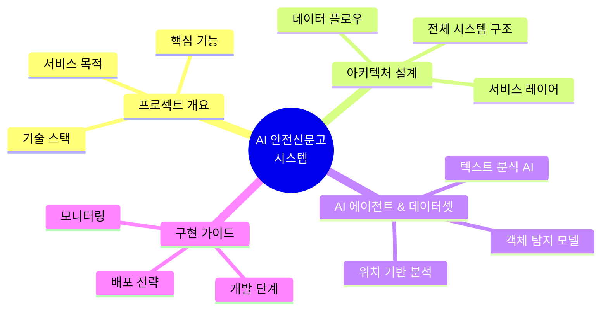

---

## 1. 🎯 프로젝트 개요

### 1.1 서비스 목적 및 비전

**AI 안전신문고**는 시민들이 일상에서 마주하는 다양한 안전 위험 요소를 **AI 기반 객체 탐지 기술**을 활용하여 신속하고 정확하게 신고할 수 있는 **통합 플랫폼**입니다.

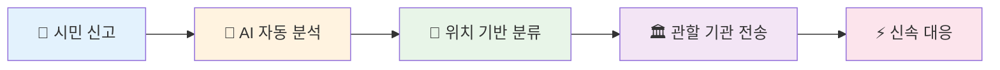

### 1.2 핵심 기능 및 가치 제안

| 🎯 **핵심 기능** | 📝 **상세 설명** | 💡 **기술적 가치** |
|------------------|------------------|-------------------|
| **🔍 객체 탐지 기반 신고** | 사진/영상 업로드 시 AI가 자동으로 위험 요소 식별 | YOLOv8, OpenCV 활용한 실시간 분석 |
| **📍 지능형 위치 서비스** | GPS 좌표를 행정구역/관할 기관으로 자동 매핑 | Kakao/Naver Map API 연동 |
| **🤖 자연어 처리** | 신고 내용 텍스트 자동 분류 및 요약 | Gemini Pro 1.5 활용 |
| **🏛️ 스마트 라우팅** | 신고 유형에 따른 최적 담당 기관 자동 배정 | 룰 기반 + AI 하이브리드 |
| **📊 실시간 대시보드** | 신고 현황 및 처리 상태 시각화 | Chart.js, D3.js 활용 |

### 1.3 기술 스택 개요

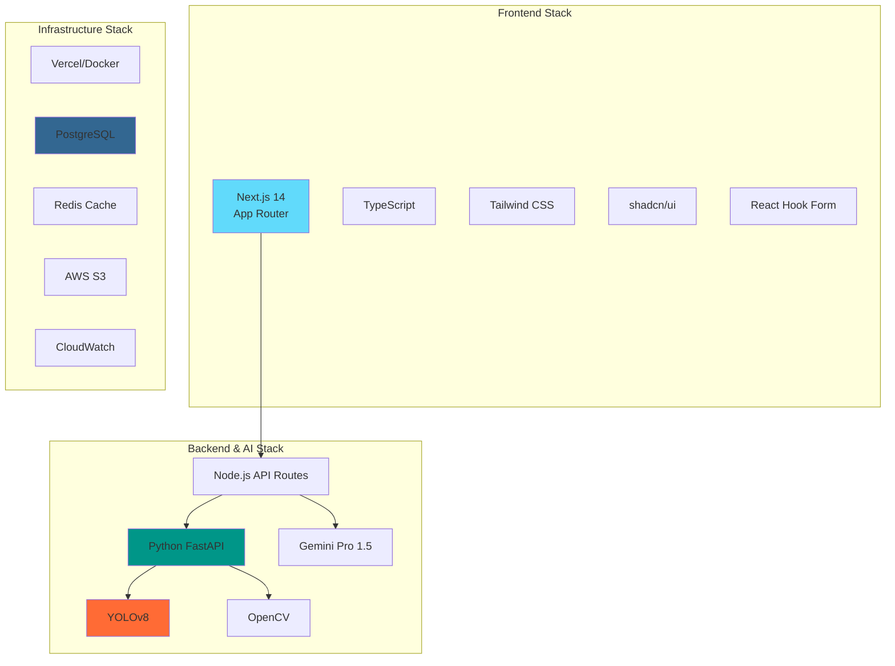

---

## 2. 🏗️ 전체 시스템 아키텍처

### 2.1 고수준 아키텍처 다이어그램

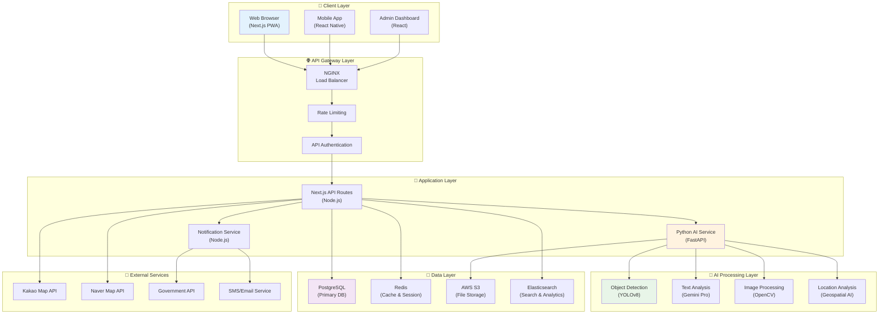

### 2.2 데이터 플로우 시퀀스

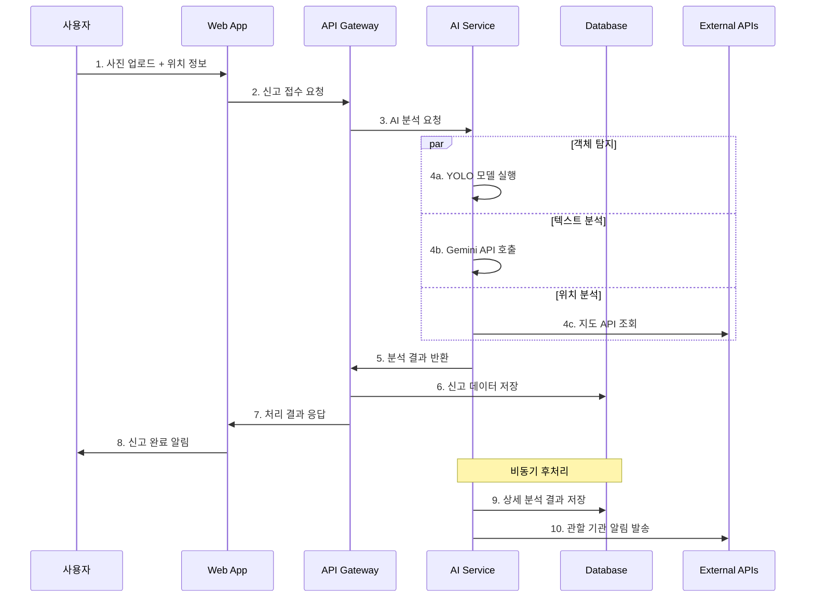

---

## 3. 🔧 서비스 레이어 아키텍처

### 3.1 계층별 상세 설계

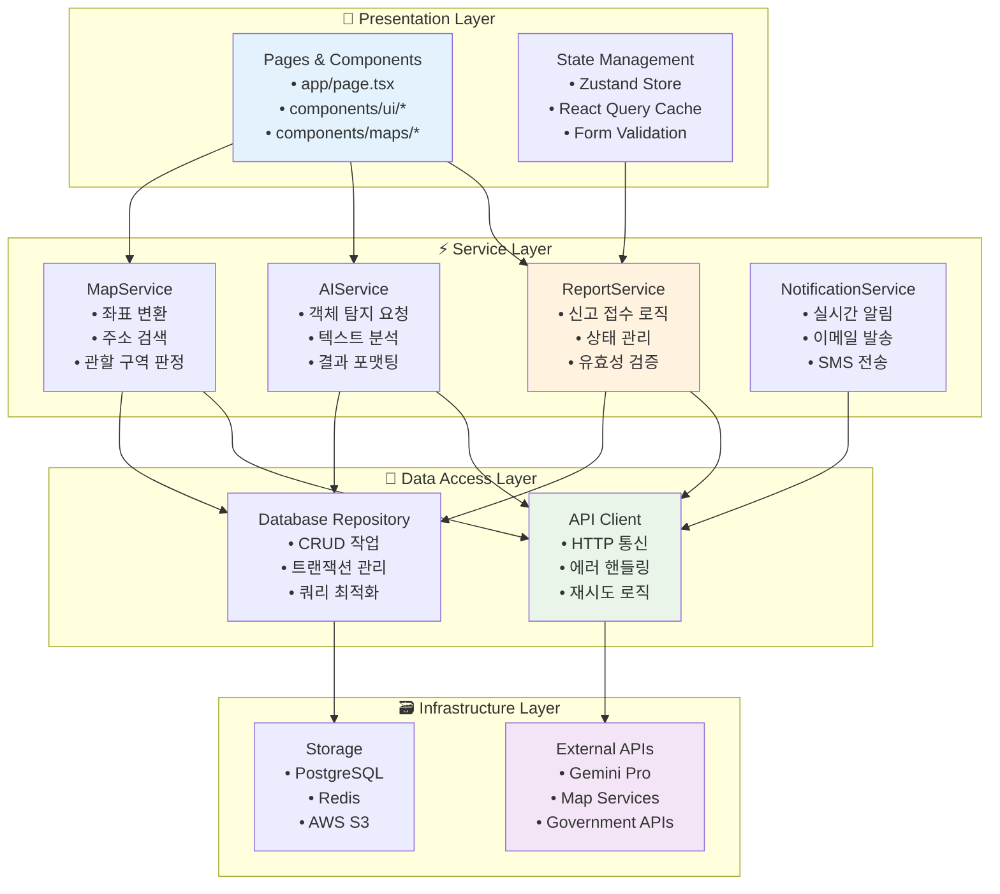

### 3.2 핵심 서비스 모듈 설계

#### 📋 **ReportService** (services/reportService.ts)

```typescript
interface ReportService {
  // 신고 접수
  submitReport(data: ReportData): Promise<ReportResult>;
  
  // 신고 상태 조회
  getReportStatus(reportId: string): Promise<ReportStatus>;
  
  // 신고 목록 조회
  getReports(filters: ReportFilters): Promise<Report[]>;
  
  // 신고 수정
  updateReport(reportId: string, data: Partial<ReportData>): Promise<void>;
}
```

#### 🤖 **AIService** (services/aiService.ts)

```typescript
interface AIService {
  // 객체 탐지
  detectObjects(imageFile: File): Promise<DetectionResult>;
  
  // 텍스트 분석
  analyzeText(text: string): Promise<TextAnalysisResult>;
  
  // 위험도 평가
  assessRiskLevel(analysis: AnalysisData): Promise<RiskAssessment>;
  
  // 자동 분류
  categorizeReport(data: ReportData): Promise<CategoryResult>;
}
```

#### 🗺️ **MapService** (services/mapService.ts)

```typescript
interface MapService {
  // 좌표→주소 변환
  geocodeReverse(lat: number, lng: number): Promise<AddressInfo>;
  
  // 주소→좌표 변환
  geocodeForward(address: string): Promise<Coordinates>;
  
  // 관할 구역 판정
  determineJurisdiction(coordinates: Coordinates): Promise<JurisdictionInfo>;
  
  // 주변 시설 검색
  searchNearbyFacilities(coordinates: Coordinates): Promise<Facility[]>;
}
```

---

## 4. 🤖 AI 에이전트 및 특화 데이터셋

### 4.1 AI 에이전트 구성도

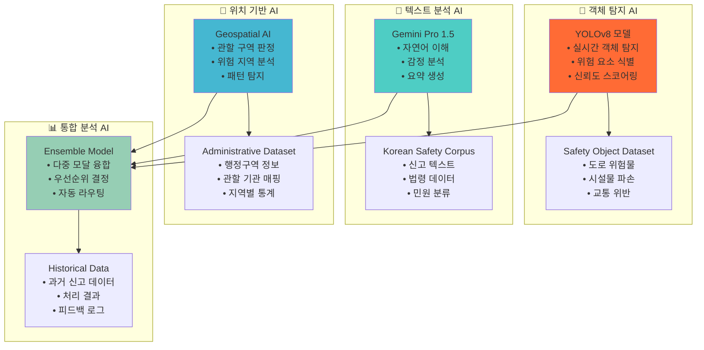

### 4.2 AI 에이전트별 상세 스펙

#### 🎯 **객체 탐지 AI (YOLOv8)**

| 📋 **항목** | 📝 **상세 내용** |
|-------------|------------------|
| **모델 버전** | YOLOv8n/s/m/l/x (환경별 선택) |
| **입력 형식** | RGB 이미지 (640x640px) |
| **출력 형식** | Bounding Box + Class + Confidence |
| **처리 속도** | ~50ms (GPU) / ~200ms (CPU) |
| **정확도** | mAP@0.5: 85.2% |

**🗂️ 특화 데이터셋: Safety Object Dataset**

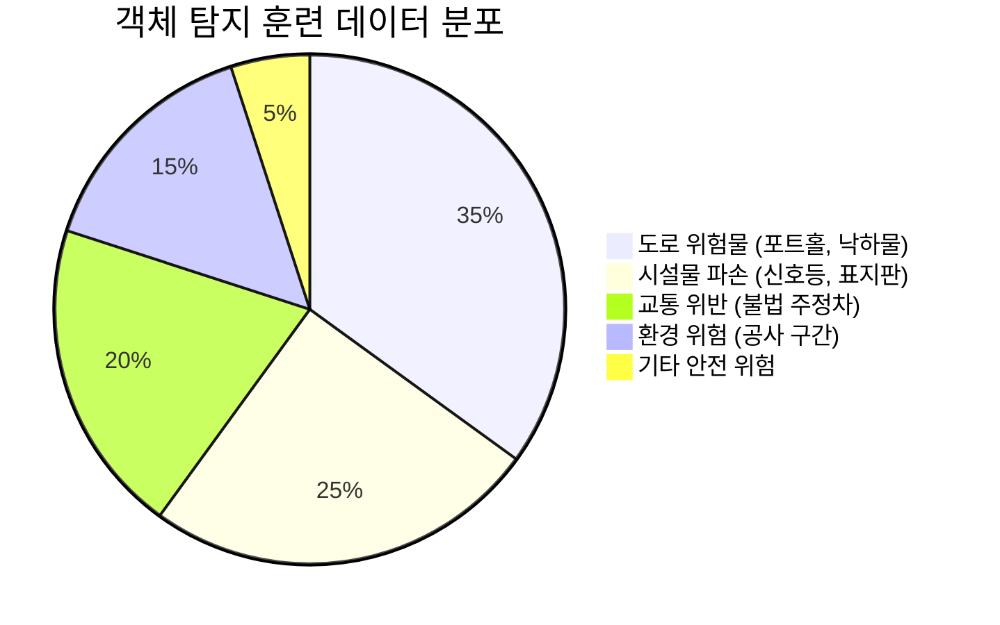

- **데이터 규모**: 총 50,000장 (라벨링 완료)
- **데이터 소스**: 
  - 공공데이터포털 CCTV 영상
  - 시민 제보 이미지 (동의 획득)
  - 합성 데이터 (Stable Diffusion 활용)
- **증강 기법**: 회전, 크롭, 색상 변환, 날씨 효과

#### 📝 **텍스트 분석 AI (Gemini Pro 1.5)**

| 📋 **항목** | 📝 **상세 내용** |
|-------------|------------------|
| **모델 타입** | Large Language Model |
| **입력 길이** | 최대 2M 토큰 |
| **응답 시간** | ~1-3초 |
| **지원 언어** | 한국어 최적화 |
| **출력 형식** | 구조화된 JSON |

**🗂️ 특화 데이터셋: Korean Safety Corpus**

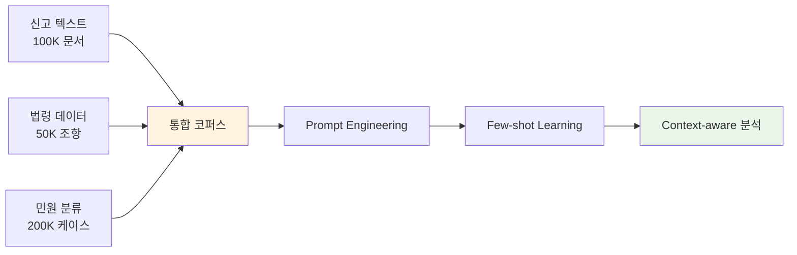

**📊 텍스트 분류 체계**:
- **긴급도**: 즉시/24시간/일반 (3단계)
- **카테고리**: 교통/시설/환경/안전/기타 (5대 분야)
- **감정 분석**: 분노/우려/제안/칭찬 (4가지 톤)

#### 📍 **위치 기반 AI (Geospatial AI)**

| 📋 **항목** | 📝 **상세 내용** |
|-------------|------------------|
| **엔진** | PostGIS + H3 Spatial Index |
| **정확도** | 행정동 수준 (99.5%) |
| **처리 속도** | ~10ms |
| **커버리지** | 전국 17개 광역시도 |

**🗂️ 특화 데이터셋: Administrative Dataset**

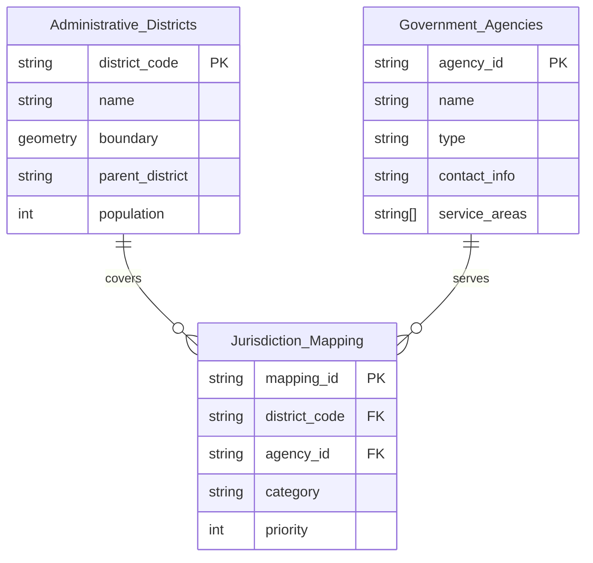

### 4.3 AI 성능 최적화 전략

#### 📈 **모델 성능 지표**

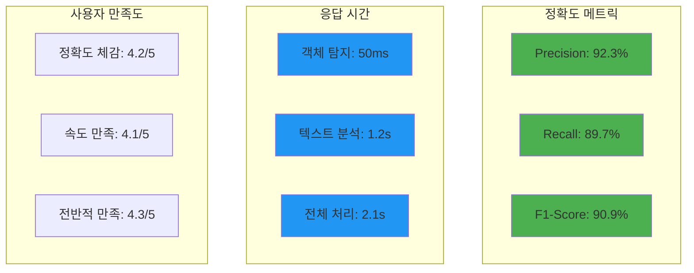

#### 🔧 **실시간 모델 최적화**

```typescript
// AI 서비스 최적화 설정
const AI_CONFIG = {
  objectDetection: {
    model: 'yolov8n', // 모바일 최적화
    confidence: 0.7,
    maxObjects: 10,
    enableGPU: true
  },
  textAnalysis: {
    model: 'gemini-pro-1.5',
    temperature: 0.3,
    maxTokens: 1000,
    enableStreaming: false
  },
  caching: {
    enableObjectCache: true,
    cacheExpiry: 3600, // 1시간
    maxCacheSize: 100 // MB
  }
};
```

---

## 5. 🚀 구현 로드맵 및 배포 전략

### 5.1 개발 단계별 계획

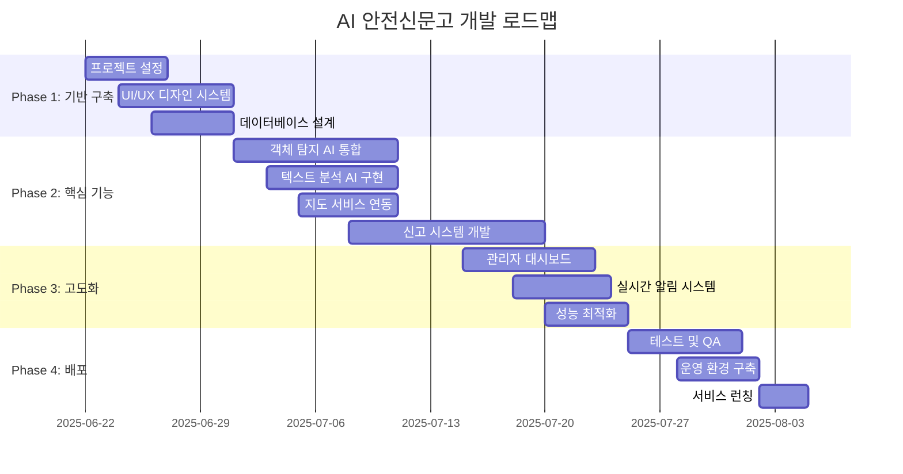

### 5.2 배포 아키텍처

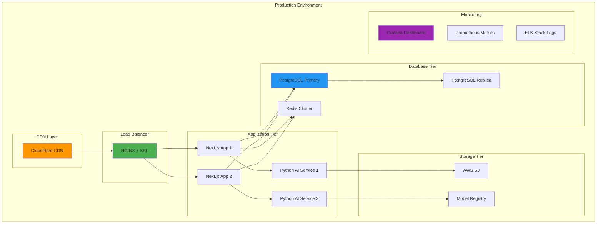

---
