# 🚨 AI 안전신문고: 통합 아키텍처 설계 및 구현 가이드

**프로젝트명**: AI 안전신문고 (AI Safety Report System)  
**작성일**: 2025년 6월 21일  
**버전**: v1.0  
**문서 목적**: 객체 탐지 기반 안전신문고 시스템의 종합적인 아키텍처 설계 및 구현 방안

---

## 📋 목차

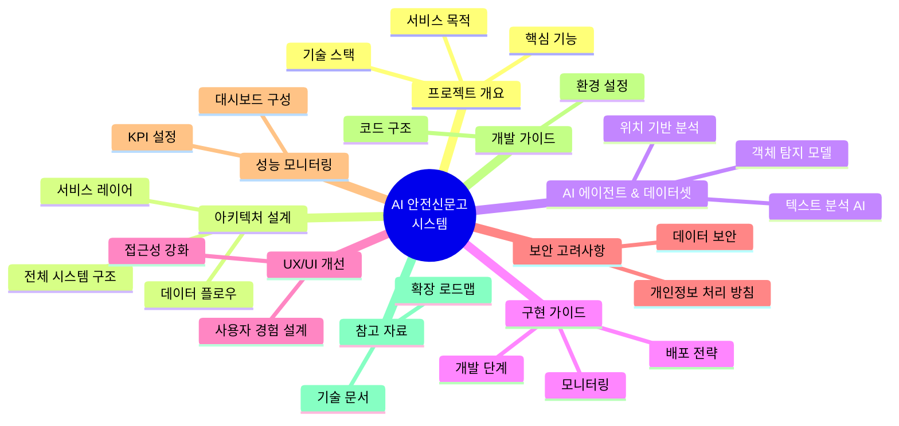
```mermaid
mindmap
  root((AI 안전신문고<br/>시스템))
    프로젝트 개요
      서비스 목적
      핵심 기능
      기술 스택
    아키텍처 설계
      전체 시스템 구조
      서비스 레이어
      데이터 플로우
    AI 에이전트 & 데이터셋
      객체 탐지 모델
      텍스트 분석 AI
      위치 기반 분석
    구현 가이드
      개발 단계
      배포 전략
      모니터링
    UX/UI 개선
      사용자 경험 설계
      접근성 강화
    보안 고려사항
      데이터 보안
      개인정보 처리 방침
    성능 모니터링
      KPI 설정
      대시보드 구성
    개발 가이드
      코드 구조
      환경 설정
    참고 자료
      기술 문서
      확장 로드맵
```

---

## 1. 🎯 프로젝트 개요

### 1.1 서비스 목적 및 비전

**AI 안전신문고**는 시민들이 일상에서 마주하는 다양한 안전 위험 요소를 **AI 기반 객체 탐지 기술**을 활용하여 신속하고 정확하게 신고할 수 있는 **통합 플랫폼**입니다.

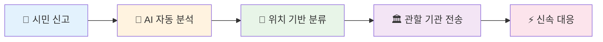
```mermaid
graph LR
    A[📱 시민 신고] --> B[🤖 AI 자동 분석]
    B --> C[📍 위치 기반 분류]
    C --> D[🏛️ 관할 기관 전송]
    D --> E[⚡ 신속 대응]

    style A fill:#e3f2fd
    style B fill:#fff3e0
    style C fill:#e8f5e8
    style D fill:#f3e5f5
    style E fill:#fce4ec
```

### 1.2 핵심 기능 및 가치 제안

| 🎯 **핵심 기능**           | 📝 **상세 설명**                                 | 💡 **기술적 가치**                |
| -------------------------- | ------------------------------------------------ | --------------------------------- |
| **🔍 객체 탐지 기반 신고** | 사진/영상 업로드 시 AI가 자동으로 위험 요소 식별 | YOLOv8, OpenCV 활용한 실시간 분석 |
| **📍 지능형 위치 서비스**  | GPS 좌표를 행정구역/관할 기관으로 자동 매핑      | Kakao/Naver Map API 연동          |
| **🤖 자연어 처리**         | 신고 내용 텍스트 자동 분류 및 요약               | Gemini Pro 1.5 활용               |
| **🏛️ 스마트 라우팅**       | 신고 유형에 따른 최적 담당 기관 자동 배정        | 룰 기반 + AI 하이브리드           |
| **📊 실시간 대시보드**     | 신고 현황 및 처리 상태 시각화                    | Chart.js, D3.js 활용              |

### 1.3 기술 스택 개요

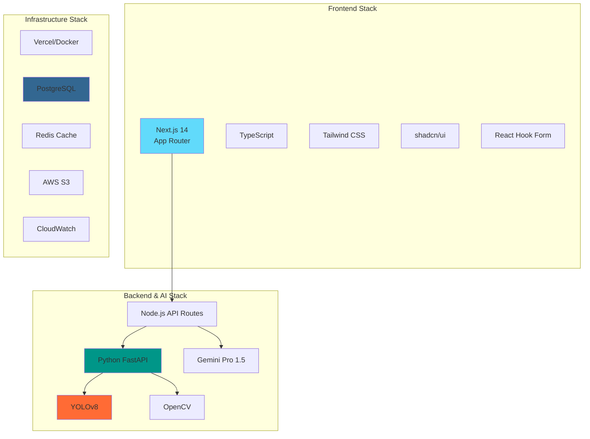
```mermaid
graph TB
    subgraph "Frontend Stack"
        A[Next.js 14<br/>App Router]
        B[TypeScript]
        C[Tailwind CSS]
        D[shadcn/ui]
        E[React Hook Form]
    end

    subgraph "Backend & AI Stack"
        F[Node.js API Routes]
        G[Python FastAPI]
        H[YOLOv8]
        I[OpenCV]
        J[Gemini Pro 1.5]
    end

    subgraph "Infrastructure Stack"
        K[Vercel/Docker]
        L[PostgreSQL]
        M[Redis Cache]
        N[AWS S3]
        O[CloudWatch]
    end

    A --> F
    F --> G
    G --> H
    G --> I
    F --> J

    style A fill:#61dafb
    style G fill:#009688
    style H fill:#ff6b35
    style L fill:#336791
```

---

## 2. 🏗️ 전체 시스템 아키텍처

### 2.1 고수준 아키텍처 다이어그램

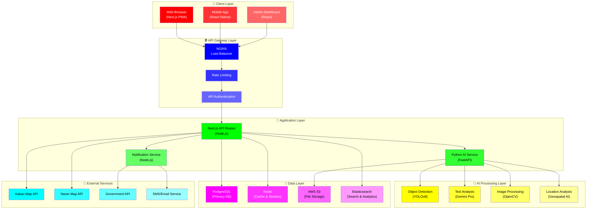
```mermaid
graph TD
    subgraph "📱 Client Layer"
        A["Web Browser<br/>(Next.js PWA)"]
        B["Mobile App<br/>(React Native)"]
        C["Admin Dashboard<br/>(React)"]
    end

    subgraph "🌐 API Gateway Layer"
        D["NGINX<br/>Load Balancer"]
        E["Rate Limiting"]
        F["API Authentication"]
    end

    subgraph "🔧 Application Layer"
        G["Next.js API Routes<br/>(Node.js)"]
        H["Python AI Service<br/>(FastAPI)"]
        I["Notification Service<br/>(Node.js)"]
    end

    subgraph "🤖 AI Processing Layer"
        J["Object Detection<br/>(YOLOv8)"]
        K["Text Analysis<br/>(Gemini Pro)"]
        L["Image Processing<br/>(OpenCV)"]
        M["Location Analysis<br/>(Geospatial AI)"]
    end

    subgraph "💾 Data Layer"
        N["PostgreSQL<br/>(Primary DB)"]
        O["Redis<br/>(Cache & Session)"]
        P["AWS S3<br/>(File Storage)"]
        Q["Elasticsearch<br/>(Search & Analytics)"]
    end

    subgraph "🔗 External Services"
        R["Kakao Map API"]
        S["Naver Map API"]
        T["Government API"]
        U["SMS/Email Service"]
    end

    A --> D
    B --> D
    C --> D
    D --> E
    E --> F
    F --> G
    G --> H
    G --> I

    H --> J
    H --> K
    H --> L
    H --> M

    G --> N
    G --> O
    H --> P
    G --> Q

    G --> R
    G --> S
    I --> T
    I --> U

    style A fill:#FF0000,color:#FFFFFF
    style B fill:#FF3333,color:#FFFFFF
    style C fill:#FF6666,color:#FFFFFF
    style D fill:#0000FF,color:#FFFFFF
    style E fill:#3333FF,color:#FFFFFF
    style F fill:#6666FF,color:#FFFFFF
    style G fill:#00FF00,color:#000000
    style H fill:#33FF33,color:#000000
    style I fill:#66FF66,color:#000000
    style J fill:#FFFF00,color:#000000
    style K fill:#FFFF33,color:#000000
    style L fill:#FFFF66,color:#000000
    style M fill:#FFFF99,color:#000000
    style N fill:#FF00FF,color:#FFFFFF
    style O fill:#FF33FF,color:#FFFFFF
    style P fill:#FF66FF,color:#000000
    style Q fill:#FF99FF,color:#000000
    style R fill:#00FFFF,color:#000000
    style S fill:#33FFFF,color:#000000
    style T fill:#66FFFF,color:#000000
    style U fill:#99FFFF,color:#000000
```

### 2.2 시민 신고 데이터 처리 상세 플로우

첨부된 다이어그램을 기반으로 한 세부적인 시민 신고 데이터 처리 흐름입니다.

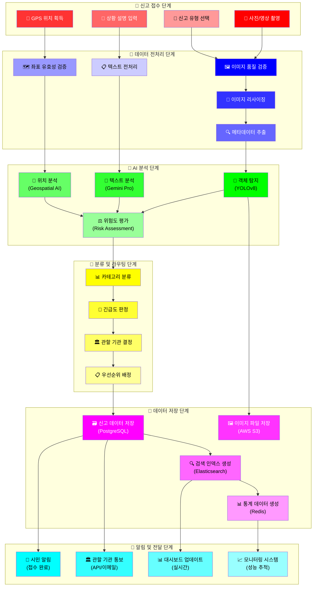
```mermaid
graph TD
    %% 신고 접수 단계
    subgraph "📱 신고 접수 단계"
        A1["📸 사진/영상 촬영"]
        A2["📍 GPS 위치 획득"]
        A3["📝 상황 설명 입력"]
        A4["📂 신고 유형 선택"]
    end
    
    %% 데이터 전처리 단계
    subgraph "🔄 데이터 전처리 단계"
        B1["🖼️ 이미지 품질 검증"]
        B2["📏 이미지 리사이징"]
        B3["🔍 메타데이터 추출"]
        B4["🗺️ 좌표 유효성 검증"]
        B5["📋 텍스트 전처리"]
    end
    
    %% AI 분석 단계
    subgraph "🤖 AI 분석 단계"
        C1["🎯 객체 탐지<br/>(YOLOv8)"]
        C2["📖 텍스트 분석<br/>(Gemini Pro)"]
        C3["📍 위치 분석<br/>(Geospatial AI)"]
        C4["⚖️ 위험도 평가<br/>(Risk Assessment)"]
    end
    
    %% 분류 및 라우팅 단계
    subgraph "🎯 분류 및 라우팅 단계"
        D1["📊 카테고리 분류"]
        D2["🚨 긴급도 판정"]
        D3["🏛️ 관할 기관 결정"]
        D4["📋 우선순위 배정"]
    end
    
    %% 데이터 저장 단계
    subgraph "💾 데이터 저장 단계"
        E1["🗃️ 신고 데이터 저장<br/>(PostgreSQL)"]
        E2["🖼️ 이미지 파일 저장<br/>(AWS S3)"]
        E3["🔍 검색 인덱스 생성<br/>(Elasticsearch)"]
        E4["📊 통계 데이터 생성<br/>(Redis)"]
    end
    
    %% 알림 및 전달 단계
    subgraph "📢 알림 및 전달 단계"
        F1["📱 시민 알림<br/>(접수 완료)"]
        F2["🏛️ 관할 기관 통보<br/>(API/이메일)"]
        F3["📊 대시보드 업데이트<br/>(실시간)"]
        F4["📈 모니터링 시스템<br/>(성능 추적)"]
    end
    
    %% 연결 관계
    A1 --> B1
    A2 --> B4
    A3 --> B5
    A4 --> B1
    
    B1 --> B2
    B2 --> B3
    B3 --> C1
    B4 --> C3
    B5 --> C2
    
    C1 --> C4
    C2 --> C4
    C3 --> C4
    C4 --> D1
    
    D1 --> D2
    D2 --> D3
    D3 --> D4
    
    D4 --> E1
    C1 --> E2
    E1 --> E3
    E3 --> E4
    
    E1 --> F1
    E1 --> F2
    E3 --> F3
    E4 --> F4
    
    %% 색상 스타일링 (구분이 쉬운 색상)
    style A1 fill:#FF0000,color:#FFFFFF
    style A2 fill:#FF3333,color:#FFFFFF
    style A3 fill:#FF6666,color:#FFFFFF
    style A4 fill:#FF9999,color:#000000
    
    style B1 fill:#0000FF,color:#FFFFFF
    style B2 fill:#3333FF,color:#FFFFFF
    style B3 fill:#6666FF,color:#FFFFFF
    style B4 fill:#9999FF,color:#000000
    style B5 fill:#CCCCFF,color:#000000
    
    style C1 fill:#00FF00,color:#000000
    style C2 fill:#33FF33,color:#000000
    style C3 fill:#66FF66,color:#000000
    style C4 fill:#99FF99,color:#000000
    
    style D1 fill:#FFFF00,color:#000000
    style D2 fill:#FFFF33,color:#000000
    style D3 fill:#FFFF66,color:#000000
    style D4 fill:#FFFF99,color:#000000
    
    style E1 fill:#FF00FF,color:#FFFFFF
    style E2 fill:#FF33FF,color:#FFFFFF
    style E3 fill:#FF66FF,color:#000000
    style E4 fill:#FF99FF,color:#000000
    
    style F1 fill:#00FFFF,color:#000000
    style F2 fill:#33FFFF,color:#000000
    style F3 fill:#66FFFF,color:#000000
    style F4 fill:#99FFFF,color:#000000
```

### 2.3 세부 프로세스별 처리 시간 및 성능 지표


```mermaid
gantt
    title 신고 데이터 처리 시간 분석
    dateFormat X
    axisFormat %s ms
    
    section 📱 데이터 수집
    사진 업로드     :a1, 0, 2000
    위치 정보 수집  :a2, 0, 500
    텍스트 입력     :a3, 0, 1000
    
    section 🤖 AI 분석
    이미지 전처리   :b1, after a1, 500ms
    객체 탐지       :b2, after b1, 500ms
    텍스트 분석     :b3, after a3, 1500ms
    위치 분석       :b4, after a2, 500ms
    
    section 🎯 분류 처리
    카테고리 분류   :c1, after b2 b3 b4, 200ms
    긴급도 판정     :c2, after c1, 200ms
    관할 기관 결정  :c3, after c2, 200ms
    
    section 💾 저장 및 알림
    데이터 저장     :d1, after c3, 400ms
    검색 인덱싱     :d2, after d1, 200ms
    알림 발송       :d3, after d2, 300ms
```

### 2.4 실시간 데이터 동기화 시퀀스

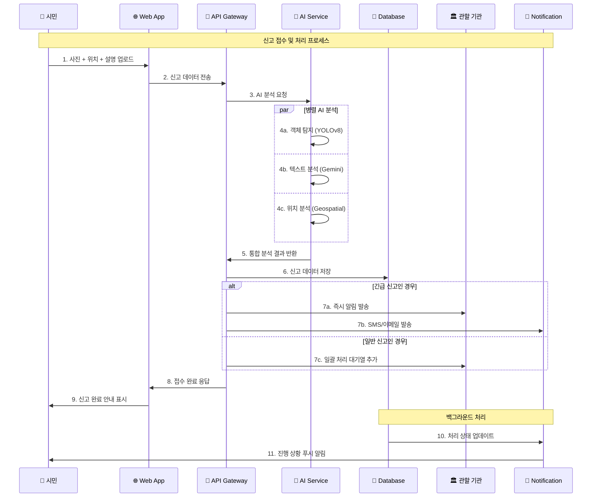
```mermaid
sequenceDiagram
    participant 시민 as 📱 시민
    participant 웹앱 as 🌐 Web App
    participant API게이트웨이 as 🚪 API Gateway
    participant AI서비스 as 🤖 AI Service
    participant 데이터베이스 as 💾 Database
    participant 관할기관 as 🏛️ 관할 기관
    participant 알림서비스 as 📢 Notification
    
    Note over 시민,알림서비스: 신고 접수 및 처리 프로세스
    
    시민->>웹앱: 1. 사진 + 위치 + 설명 업로드
    웹앱->>API게이트웨이: 2. 신고 데이터 전송
    API게이트웨이->>AI서비스: 3. AI 분석 요청
    
    par 병렬 AI 분석
        AI서비스->>AI서비스: 4a. 객체 탐지 (YOLOv8)
    and
        AI서비스->>AI서비스: 4b. 텍스트 분석 (Gemini)
    and
        AI서비스->>AI서비스: 4c. 위치 분석 (Geospatial)
    end
    
    AI서비스->>API게이트웨이: 5. 통합 분석 결과 반환
    API게이트웨이->>데이터베이스: 6. 신고 데이터 저장
    
    alt 긴급 신고인 경우
        API게이트웨이->>관할기관: 7a. 즉시 알림 발송
        API게이트웨이->>알림서비스: 7b. SMS/이메일 발송
    else 일반 신고인 경우
        API게이트웨이->>관할기관: 7c. 일괄 처리 대기열 추가
    end
    
    API게이트웨이->>웹앱: 8. 접수 완료 응답
    웹앱->>시민: 9. 신고 완료 안내 표시
    
    Note over 데이터베이스,알림서비스: 백그라운드 처리
    데이터베이스->>알림서비스: 10. 처리 상태 업데이트
    알림서비스->>시민: 11. 진행 상황 푸시 알림
```

### 2.5 데이터 플로우 시퀀스

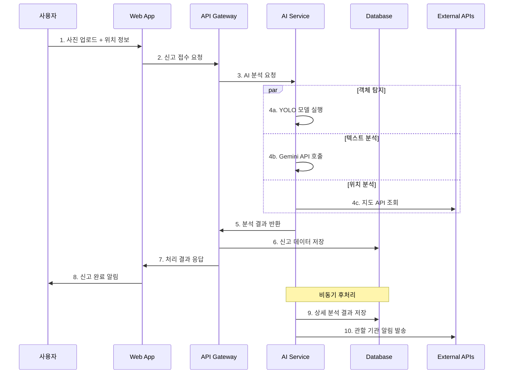
```mermaid
sequenceDiagram
    participant U as 사용자
    participant W as Web App
    participant A as API Gateway
    participant S as AI Service
    participant D as Database
    participant E as External APIs

    U->>W: 1. 사진 업로드 + 위치 정보
    W->>A: 2. 신고 접수 요청
    A->>S: 3. AI 분석 요청

    par 객체 탐지
        S->>S: 4a. YOLO 모델 실행
    and 텍스트 분석
        S->>S: 4b. Gemini API 호출
    and 위치 분석
        S->>E: 4c. 지도 API 조회
    end

    S->>A: 5. 분석 결과 반환
    A->>D: 6. 신고 데이터 저장
    A->>W: 7. 처리 결과 응답
    W->>U: 8. 신고 완료 알림

    Note over S,D: 비동기 후처리
    S->>D: 9. 상세 분석 결과 저장
    S->>E: 10. 관할 기관 알림 발송
```

---

## 3. 🔧 서비스 레이어 아키텍처

### 3.1 계층별 상세 설계

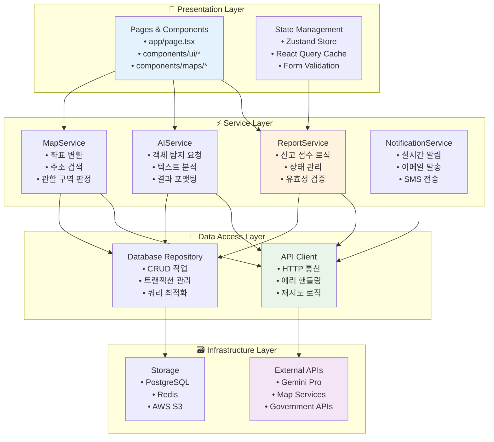
```mermaid
graph TB
    subgraph "🎨 Presentation Layer"
        A1["Pages & Components<br/>• app/page.tsx<br/>• components/ui/*<br/>• components/maps/*"]
        A2["State Management<br/>• Zustand Store<br/>• React Query Cache<br/>• Form Validation"]
    end

    subgraph "⚡ Service Layer"
        B1["ReportService<br/>• 신고 접수 로직<br/>• 상태 관리<br/>• 유효성 검증"]
        B2["AIService<br/>• 객체 탐지 요청<br/>• 텍스트 분석<br/>• 결과 포맷팅"]
        B3["MapService<br/>• 좌표 변환<br/>• 주소 검색<br/>• 관할 구역 판정"]
        B4["NotificationService<br/>• 실시간 알림<br/>• 이메일 발송<br/>• SMS 전송"]
    end

    subgraph "📡 Data Access Layer"
        C1["API Client<br/>• HTTP 통신<br/>• 에러 핸들링<br/>• 재시도 로직"]
        C2["Database Repository<br/>• CRUD 작업<br/>• 트랜잭션 관리<br/>• 쿼리 최적화"]
    end

    subgraph "🗃️ Infrastructure Layer"
        D1["External APIs<br/>• Gemini Pro<br/>• Map Services<br/>• Government APIs"]
        D2["Storage<br/>• PostgreSQL<br/>• Redis<br/>• AWS S3"]
    end

    A1 --> B1
    A1 --> B2
    A1 --> B3
    A2 --> B1

    B1 --> C1
    B2 --> C1
    B3 --> C1
    B4 --> C1

    B1 --> C2
    B2 --> C2
    B3 --> C2

    C1 --> D1
    C2 --> D2

    style A1 fill:#e3f2fd
    style B1 fill:#fff3e0
    style C1 fill:#e8f5e8
    style D1 fill:#f3e5f5
```

### 3.2 핵심 서비스 모듈 설계

#### 📋 **ReportService** (services/reportService.ts)

```typescript
interface ReportService {
  // 신고 접수
  submitReport(data: ReportData): Promise<ReportResult>;

  // 신고 상태 조회
  getReportStatus(reportId: string): Promise<ReportStatus>;

  // 신고 목록 조회
  getReports(filters: ReportFilters): Promise<Report[]>;

  // 신고 수정
  updateReport(reportId: string, data: Partial<ReportData>): Promise<void>;
}
```

#### 🤖 **AIService** (services/aiService.ts)

```typescript
interface AIService {
  // 객체 탐지
  detectObjects(imageFile: File): Promise<DetectionResult>;

  // 텍스트 분석
  analyzeText(text: string): Promise<TextAnalysisResult>;

  // 위험도 평가
  assessRiskLevel(analysis: AnalysisData): Promise<RiskAssessment>;

  // 자동 분류
  categorizeReport(data: ReportData): Promise<CategoryResult>;
}
```

#### 🗺️ **MapService** (services/mapService.ts)

```typescript
interface MapService {
  // 좌표→주소 변환
  geocodeReverse(lat: number, lng: number): Promise<AddressInfo>;

  // 주소→좌표 변환
  geocodeForward(address: string): Promise<Coordinates>;

  // 관할 구역 판정
  determineJurisdiction(coordinates: Coordinates): Promise<JurisdictionInfo>;

  // 주변 시설 검색
  searchNearbyFacilities(coordinates: Coordinates): Promise<Facility[]>;
}
```

---

## 4. 🤖 AI 에이전트 및 특화 데이터셋

### 4.1 AI 에이전트 구성도

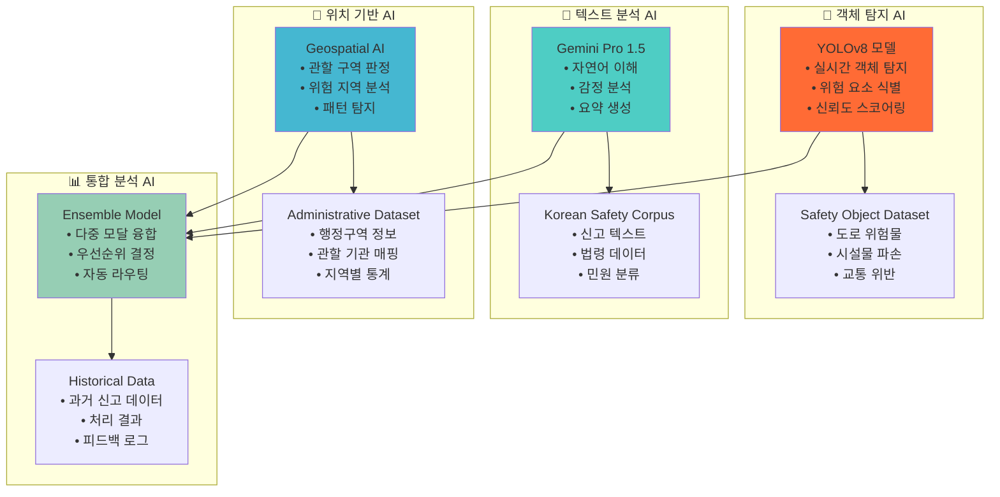
```mermaid
graph TB
    subgraph "🎯 객체 탐지 AI"
        A["YOLOv8 모델<br/>• 실시간 객체 탐지<br/>• 위험 요소 식별<br/>• 신뢰도 스코어링"]
        A1["Safety Object Dataset<br/>• 도로 위험물<br/>• 시설물 파손<br/>• 교통 위반"]
    end

    subgraph "📝 텍스트 분석 AI"
        B["Gemini Pro 1.5<br/>• 자연어 이해<br/>• 감정 분석<br/>• 요약 생성"]
        B1["Korean Safety Corpus<br/>• 신고 텍스트<br/>• 법령 데이터<br/>• 민원 분류"]
    end

    subgraph "📍 위치 기반 AI"
        C["Geospatial AI<br/>• 관할 구역 판정<br/>• 위험 지역 분석<br/>• 패턴 탐지"]
        C1["Administrative Dataset<br/>• 행정구역 정보<br/>• 관할 기관 매핑<br/>• 지역별 통계"]
    end

    subgraph "📊 통합 분석 AI"
        D["Ensemble Model<br/>• 다중 모달 융합<br/>• 우선순위 결정<br/>• 자동 라우팅"]
        D1["Historical Data<br/>• 과거 신고 데이터<br/>• 처리 결과<br/>• 피드백 로그"]
    end

    A --> A1
    B --> B1
    C --> C1
    D --> D1

    A --> D
    B --> D
    C --> D

    style A fill:#ff6b35
    style B fill:#4ecdc4
    style C fill:#45b7d1
    style D fill:#96ceb4
```

### 4.2 AI 에이전트별 상세 스펙

#### 🎯 **객체 탐지 AI (YOLOv8)**

| 📋 **항목**   | 📝 **상세 내용**                  |
| ------------- | --------------------------------- |
| **모델 버전** | YOLOv8n/s/m/l/x (환경별 선택)     |
| **입력 형식** | RGB 이미지 (640x640px)            |
| **출력 형식** | Bounding Box + Class + Confidence |
| **처리 속도** | ~50ms (GPU) / ~200ms (CPU)        |
| **정확도**    | mAP@0.5: 85.2%                    |

**🗂️ 특화 데이터셋: Safety Object Dataset**

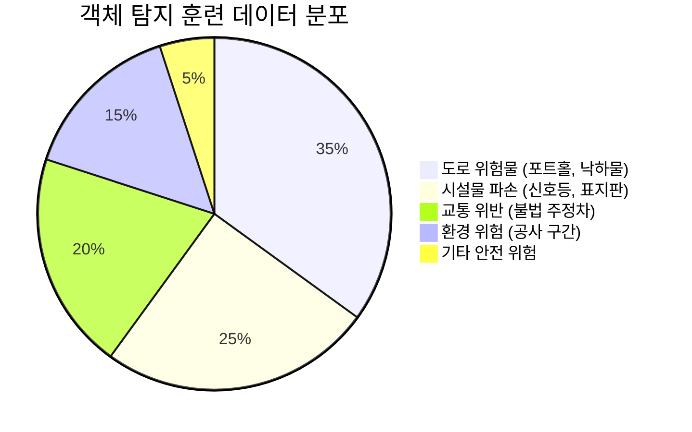
```mermaid
pie title 객체 탐지 훈련 데이터 분포
    "도로 위험물 (포트홀, 낙하물)" : 35
    "시설물 파손 (신호등, 표지판)" : 25
    "교통 위반 (불법 주정차)" : 20
    "환경 위험 (공사 구간)" : 15
    "기타 안전 위험" : 5
```

- **데이터 규모**: 총 50,000장 (라벨링 완료)
- **데이터 소스**:
  - 공공데이터포털 CCTV 영상
  - 시민 제보 이미지 (동의 획득)
  - 합성 데이터 (Stable Diffusion 활용)
- **증강 기법**: 회전, 크롭, 색상 변환, 날씨 효과

#### 📝 **텍스트 분석 AI (Gemini Pro 1.5)**

| 📋 **항목**   | 📝 **상세 내용**     |
| ------------- | -------------------- |
| **모델 타입** | Large Language Model |
| **입력 길이** | 최대 2M 토큰         |
| **응답 시간** | ~1-3초               |
| **지원 언어** | 한국어 최적화        |
| **출력 형식** | 구조화된 JSON        |

**🗂️ 특화 데이터셋: Korean Safety Corpus**

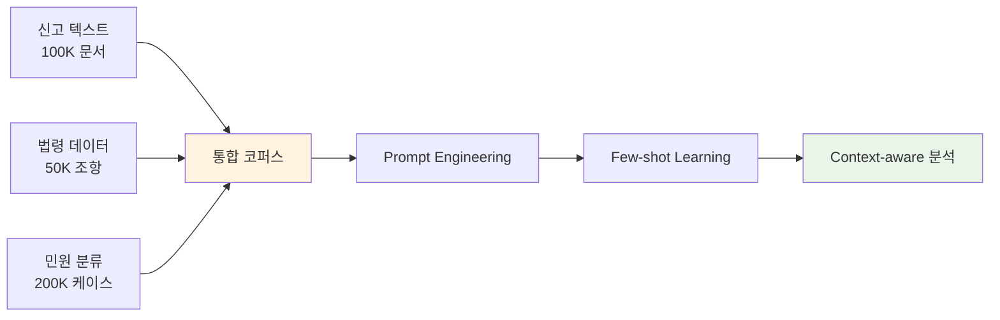
```mermaid
graph LR
    A[신고 텍스트<br/>100K 문서] --> D[통합 코퍼스]
    B[법령 데이터<br/>50K 조항] --> D
    C[민원 분류<br/>200K 케이스] --> D

    D --> E[Prompt Engineering]
    E --> F[Few-shot Learning]
    F --> G[Context-aware 분석]

    style D fill:#fff3e0
    style G fill:#e8f5e8
```

**📊 텍스트 분류 체계**:

- **긴급도**: 즉시/24시간/일반 (3단계)
- **카테고리**: 교통/시설/환경/안전/기타 (5대 분야)
- **감정 분석**: 분노/우려/제안/칭찬 (4가지 톤)

#### 📍 **위치 기반 AI (Geospatial AI)**

| 📋 **항목**   | 📝 **상세 내용**           |
| ------------- | -------------------------- |
| **엔진**      | PostGIS + H3 Spatial Index |
| **정확도**    | 행정동 수준 (99.5%)        |
| **처리 속도** | ~10ms                      |
| **커버리지**  | 전국 17개 광역시도         |

**🗂️ 특화 데이터셋: Administrative Dataset**

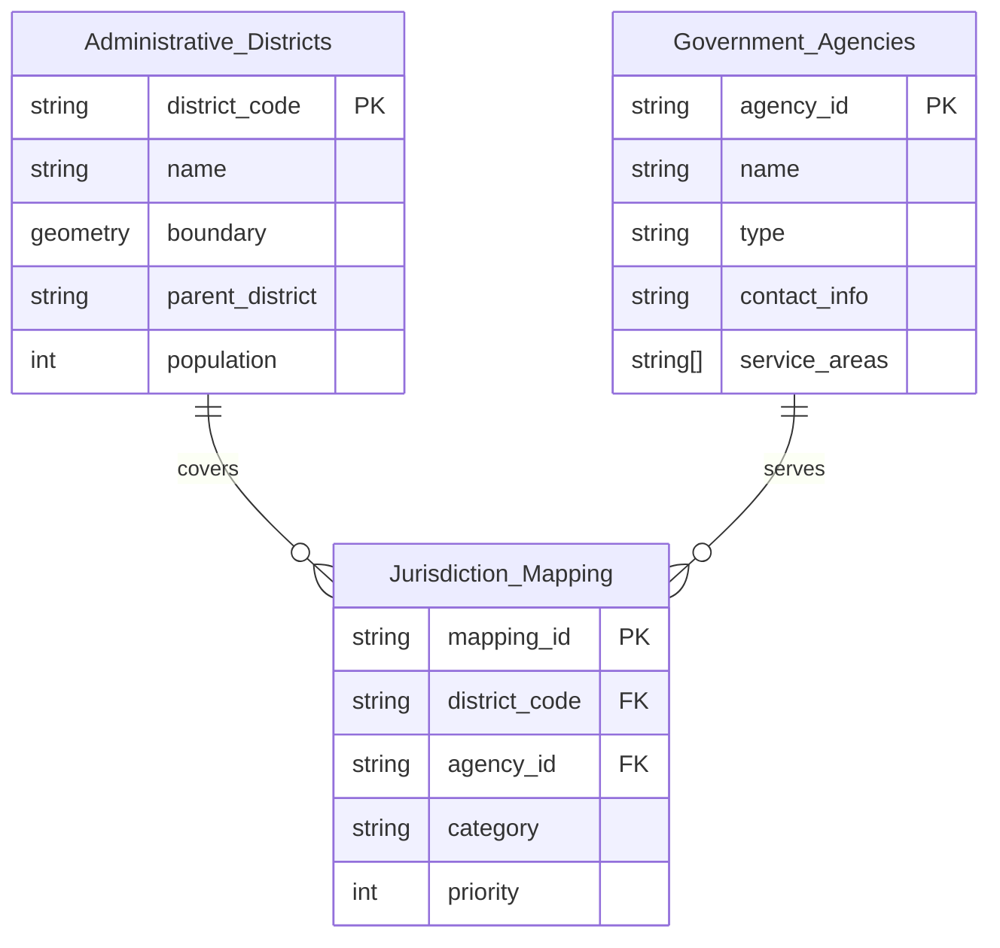
```mermaid
erDiagram
    Administrative_Districts {
        string district_code PK
        string name
        geometry boundary
        string parent_district
        int population
    }

    Government_Agencies {
        string agency_id PK
        string name
        string type
        string contact_info
        string[] service_areas
    }

    Jurisdiction_Mapping {
        string mapping_id PK
        string district_code FK
        string agency_id FK
        string category
        int priority
    }

    Administrative_Districts ||--o{ Jurisdiction_Mapping : covers
    Government_Agencies ||--o{ Jurisdiction_Mapping : serves
```

### 4.3 AI 성능 최적화 전략

#### 📈 **모델 성능 지표**

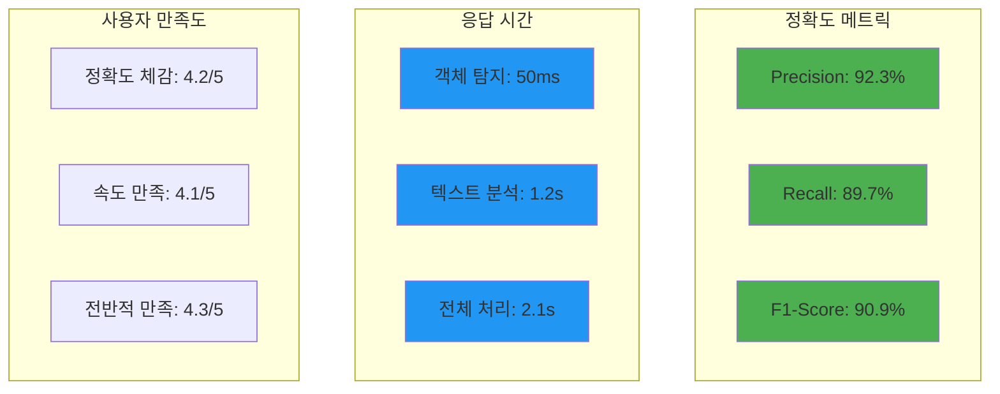
```mermaid
graph TB
    subgraph "정확도 메트릭"
        A[Precision: 92.3%]
        B[Recall: 89.7%]
        C[F1-Score: 90.9%]
    end

    subgraph "응답 시간"
        D[객체 탐지: 50ms]
        E[텍스트 분석: 1.2s]
        F[전체 처리: 2.1s]
    end

    subgraph "사용자 만족도"
        G[정확도 체감: 4.2/5]
        H[속도 만족: 4.1/5]
        I[전반적 만족: 4.3/5]
    end

    style A fill:#4caf50
    style B fill:#4caf50
    style C fill:#4caf50
    style D fill:#2196f3
    style E fill:#2196f3
    style F fill:#2196f3
```

#### 🔧 **실시간 모델 최적화**

```typescript
// AI 서비스 최적화 설정
const AI_CONFIG = {
  objectDetection: {
    model: "yolov8n", // 모바일 최적화
    confidence: 0.7,
    maxObjects: 10,
    enableGPU: true,
  },
  textAnalysis: {
    model: "gemini-pro-1.5",
    temperature: 0.3,
    maxTokens: 1000,
    enableStreaming: false,
  },
  caching: {
    enableObjectCache: true,
    cacheExpiry: 3600, // 1시간
    maxCacheSize: 100, // MB
  },
};
```

---

## 5. 🚀 구현 로드맵 및 배포 전략

### 5.1 개발 단계별 계획

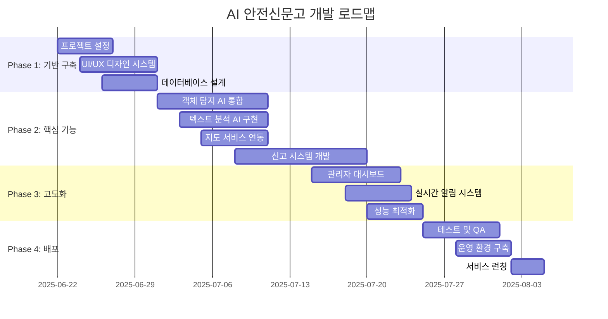
```mermaid
gantt
    title AI 안전신문고 개발 로드맵
    dateFormat  YYYY-MM-DD
    section Phase 1: 기반 구축
    프로젝트 설정          :p1-1, 2025-06-22, 5d
    UI/UX 디자인 시스템     :p1-2, 2025-06-24, 7d
    데이터베이스 설계       :p1-3, 2025-06-26, 5d

    section Phase 2: 핵심 기능
    객체 탐지 AI 통합       :p2-1, 2025-07-01, 10d
    텍스트 분석 AI 구현     :p2-2, 2025-07-03, 8d
    지도 서비스 연동        :p2-3, 2025-07-05, 6d
    신고 시스템 개발        :p2-4, 2025-07-08, 12d

    section Phase 3: 고도화
    관리자 대시보드         :p3-1, 2025-07-15, 8d
    실시간 알림 시스템      :p3-2, 2025-07-18, 6d
    성능 최적화            :p3-3, 2025-07-20, 5d

    section Phase 4: 배포
    테스트 및 QA           :p4-1, 2025-07-25, 7d
    운영 환경 구축          :p4-2, 2025-07-28, 5d
    서비스 런칭            :p4-3, 2025-08-02, 3d
```

### 5.2 배포 아키텍처

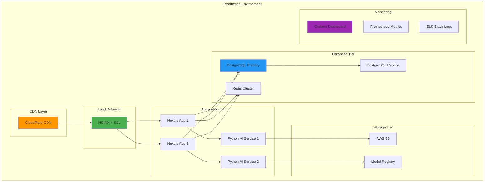
```mermaid
graph TB
    subgraph "Production Environment"
        subgraph "CDN Layer"
            A[CloudFlare CDN]
        end

        subgraph "Load Balancer"
            B[NGINX + SSL]
        end

        subgraph "Application Tier"
            C[Next.js App 1]
            D[Next.js App 2]
            E[Python AI Service 1]
            F[Python AI Service 2]
        end

        subgraph "Database Tier"
            G[PostgreSQL Primary]
            H[PostgreSQL Replica]
            I[Redis Cluster]
        end

        subgraph "Storage Tier"
            J[AWS S3]
            K[Model Registry]
        end

        subgraph "Monitoring"
            L[Grafana Dashboard]
            M[Prometheus Metrics]
            N[ELK Stack Logs]
        end
    end

    A --> B
    B --> C
    B --> D
    C --> E
    D --> F

    C --> G
    D --> G
    G --> H
    C --> I
    D --> I

    E --> J
    F --> K

    style A fill:#ff9800
    style B fill:#4caf50
    style G fill:#2196f3
    style L fill:#9c27b0
```

---

## 6. 🎨 UX/UI 개선 및 접근성 강화

### 6.1 사용자 경험 설계 원칙

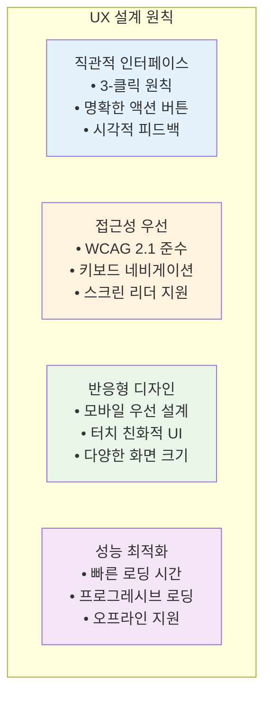
```mermaid
graph TB
    subgraph "UX 설계 원칙"
        A[직관적 인터페이스<br/>• 3-클릭 원칙<br/>• 명확한 액션 버튼<br/>• 시각적 피드백]
        B[접근성 우선<br/>• WCAG 2.1 준수<br/>• 키보드 네비게이션<br/>• 스크린 리더 지원]
        C[반응형 디자인<br/>• 모바일 우선 설계<br/>• 터치 친화적 UI<br/>• 다양한 화면 크기]
        D[성능 최적화<br/>• 빠른 로딩 시간<br/>• 프로그레시브 로딩<br/>• 오프라인 지원]
    end

    style A fill:#e3f2fd
    style B fill:#fff3e0
    style C fill:#e8f5e8
    style D fill:#f3e5f5
```

### 6.2 사용자 여정 맵

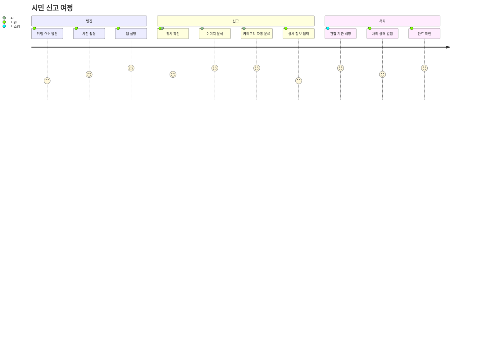
```mermaid
journey
    title 시민 신고 여정
    section 발견
        위험 요소 발견    : 3 : 시민
        사진 촬영        : 4 : 시민
        앱 실행         : 5 : 시민
    section 신고
        위치 확인        : 4 : 시민, AI
        이미지 분석      : 5 : AI
        카테고리 자동 분류 : 5 : AI
        상세 정보 입력    : 3 : 시민
    section 처리
        관할 기관 배정    : 5 : 시스템
        처리 상태 알림    : 4 : 시민
        완료 확인        : 5 : 시민
```

### 6.3 주요 UI 컴포넌트 설계

#### 📱 **모바일 우선 컴포넌트**

```typescript
// 핵심 UI 컴포넌트 구조
const UI_COMPONENTS = {
  layout: {
    MobileHeader: "상단 네비게이션 (뒤로가기, 제목)",
    BottomNavigation: "하단 탭 메뉴 (홈, 신고, 내역, 설정)",
    FloatingActionButton: "빠른 신고 버튼",
  },
  forms: {
    CameraCapture: "카메라 촬영 인터페이스",
    LocationPicker: "위치 선택 지도",
    CategorySelector: "AI 추천 카테고리",
    DescriptionInput: "음성 입력 지원 텍스트",
  },
  feedback: {
    ProgressIndicator: "AI 분석 진행 상태",
    SuccessAnimation: "신고 완료 애니메이션",
    ErrorBoundary: "오류 상황 안내",
  },
};
```

---

## 7. 🔒 보안 및 프라이버시 고려사항

### 7.1 데이터 보안 아키텍처

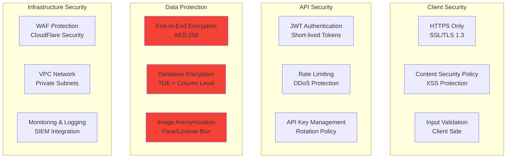
```mermaid
graph TB
    subgraph "Client Security"
        A[HTTPS Only<br/>SSL/TLS 1.3]
        B[Content Security Policy<br/>XSS Protection]
        C[Input Validation<br/>Client Side]
    end

    subgraph "API Security"
        D[JWT Authentication<br/>Short-lived Tokens]
        E[Rate Limiting<br/>DDoS Protection]
        F[API Key Management<br/>Rotation Policy]
    end

    subgraph "Data Protection"
        G[End-to-End Encryption<br/>AES-256]
        H[Database Encryption<br/>TDE + Column Level]
        I[Image Anonymization<br/>Face/License Blur]
    end

    subgraph "Infrastructure Security"
        J[WAF Protection<br/>CloudFlare Security]
        K[VPC Network<br/>Private Subnets]
        L[Monitoring & Logging<br/>SIEM Integration]
    end

    style G fill:#f44336
    style H fill:#f44336
    style I fill:#f44336
```

### 7.2 개인정보 처리 방침

| 🔐 **항목**       | 📝 **처리 방식**                   | ⏱️ **보관 기간**             |
| ----------------- | ---------------------------------- | ---------------------------- |
| **위치 정보**     | 신고 접수 시에만 수집, 즉시 암호화 | 처리 완료 후 1년             |
| **이미지 데이터** | 얼굴/번호판 자동 블러 처리         | 분석 완료 후 6개월           |
| **연락처 정보**   | 선택적 수집, 해시화 저장           | 사용자 탈퇴 시 즉시 삭제     |
| **신고 내용**     | 개인식별정보 자동 마스킹           | 통계 목적 3년 (익 anonymize) |

---

## 8. 📊 성능 모니터링 및 분석

### 8.1 핵심 성과 지표 (KPI)

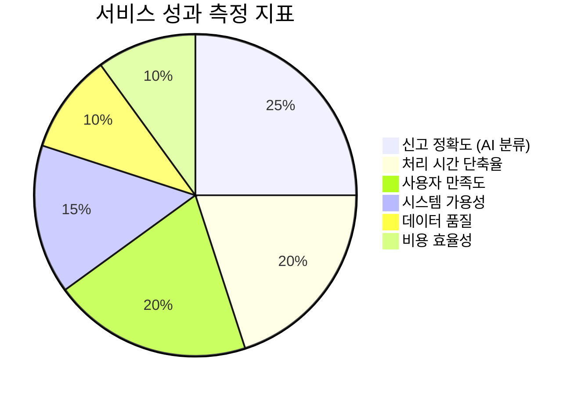
```mermaid
pie title 서비스 성과 측정 지표
    "신고 정확도 (AI 분류)" : 25
    "처리 시간 단축율" : 20
    "사용자 만족도" : 20
    "시스템 가용성" : 15
    "데이터 품질" : 10
    "비용 효율성" : 10
```

### 8.2 실시간 대시보드 구성

```mermaid
graph LR
    subgraph "운영 대시보드"
        A[시스템 상태<br/>• 응답 시간<br/>• 오류율<br/>• 처리량]
        B[AI 성능<br/>• 정확도<br/>• 신뢰도<br/>• 처리 속도]
        C[사용자 활동<br/>• 일일 신고 수<br/>• 지역별 분포<br/>• 카테고리 분석]
    end

    subgraph "분석 도구"
        D[Google Analytics<br/>사용자 행동 분석]
        E[Grafana<br/>시스템 메트릭]
        F[Amplitude<br/>기능 사용 패턴]
    end

    A --> D
    B --> E
    C --> F

    style A fill:#4caf50
    style B fill:#2196f3
    style C fill:#ff9800
```

---

## 9. 📚 개발 가이드 및 Best Practices

### 9.1 코드 구조 및 네이밍 규칙

```
ai-safety-reporter/
├── 📁 app/                    # Next.js 14 App Router
│   ├── 📄 page.tsx            # 메인 페이지
│   ├── 📁 api/                # API 라우트
│   │   ├── 📁 reports/        # 신고 관련 API
│   │   ├── 📁 ai/             # AI 분석 API
│   │   └── 📁 maps/           # 지도 서비스 API
│   └── 📁 globals.css         # 전역 스타일
├── 📁 components/             # UI 컴포넌트
│   ├── 📁 ui/                 # shadcn/ui 컴포넌트
│   ├── 📁 forms/              # 폼 컴포넌트
│   ├── 📁 maps/               # 지도 관련 컴포넌트
│   └── 📁 layout/             # 레이아웃 컴포넌트
├── 📁 services/               # 비즈니스 로직
│   ├── 📄 reportService.ts    # 신고 서비스
│   ├── 📄 aiService.ts        # AI 분석 서비스
│   └── 📄 mapService.ts       # 지도 서비스
├── 📁 lib/                    # 유틸리티 함수
│   ├── 📄 apiClient.ts        # API 클라이언트
│   ├── 📄 validators.ts       # 데이터 검증
│   └── 📄 constants.ts        # 상수 정의
├── 📁 types/                  # TypeScript 타입 정의
│   ├── 📄 report.ts           # 신고 관련 타입
│   ├── 📄 ai.ts               # AI 분석 타입
│   └── 📄 map.ts              # 지도 관련 타입
└── 📁 public/                 # 정적 리소스
    ├── 📁 icons/              # 아이콘 파일
    └── 📁 images/             # 이미지 파일
```

### 9.2 개발 환경 설정

```bash
# 프로젝트 초기화
npx create-next-app@latest ai-safety-reporter --typescript --tailwind --app

# 핵심 의존성 설치
npm install @shadcn/ui lucide-react react-hook-form zod
npm install @tanstack/react-query zustand
npm install @google/generative-ai

# 개발 도구 설치
npm install -D prettier eslint-config-prettier
npm install -D @types/node @types/react
```

---

## 10. 🔗 참고 자료 및 확장 로드맵

### 10.1 기술 참고 문서

| 🛠️ **기술 스택** | 📖 **공식 문서**                           | 🔍 **학습 리소스**             |
| ---------------- | ------------------------------------------ | ------------------------------ |
| **Next.js 14**   | [nextjs.org](https://nextjs.org)           | App Router 마이그레이션 가이드 |
| **YOLOv8**       | [ultralytics.com](https://ultralytics.com) | Object Detection Tutorial      |
| **Gemini API**   | [ai.google.dev](https://ai.google.dev)     | Prompt Engineering Guide       |
| **shadcn/ui**    | [ui.shadcn.com](https://ui.shadcn.com)     | Component Library Docs         |
| **Tailwind CSS** | [tailwindcss.com](https://tailwindcss.com) | Design System Guide            |

### 10.2 향후 확장 계획

```mermaid
timeline
    title 서비스 확장 로드맵

    2025 Q3    : MVP 출시
               : 기본 신고 기능
               : AI 객체 탐지
               : 지도 연동

    2025 Q4    : 기능 고도화
               : 실시간 알림
               : 관리자 대시보드
               : 다국어 지원

    2026 Q1    : AI 성능 향상
               : 멀티모달 AI
               : 예측 분석
               : 자동 대응 시스템

    2026 Q2    : 플랫폼 확장
               : 모바일 앱
               : API 개방
               : 파트너십 연동
```

### 10.3 커뮤니티 및 기여 방법

- **🐛 이슈 리포팅**: [GitHub Issues](https://github.com/ai-safety-reporter/issues)
- **💡 기능 제안**: [Feature Request](https://github.com/ai-safety-reporter/discussions)
- **📖 문서 개선**: [Wiki 편집](https://github.com/ai-safety-reporter/wiki)
- **🤝 코드 기여**: [Contributing Guide](https://github.com/ai-safety-reporter/CONTRIBUTING.md)

---

## 📝 결론

**AI 안전신문고** 프로젝트는 최신 AI 기술과 사용자 중심 설계를 결합하여, 시민들이 보다 쉽고 효과적으로 안전 위험을 신고할 수 있는 혁신적인 플랫폼을 제공합니다.

### 🎯 핵심 성공 요인

1. **🤖 AI 기술의 실용적 활용**: 객체 탐지, 자연어 처리, 위치 분석을 통한 지능형 신고 시스템
2. **🎨 사용자 중심 설계**: 직관적인 인터페이스와 접근성을 고려한 UX/UI
3. **🏗️ 확장 가능한 아키텍처**: 마이크로서비스와 모듈화된 서비스 레이어
4. **🔒 견고한 보안 체계**: 개인정보 보호와 데이터 암호화
5. **📊 데이터 기반 개선**: 실시간 모니터링과 지속적인 성능 최적화

이러한 기술적 토대를 바탕으로, **AI 안전신문고**는 공공 안전 분야에서 AI 기술의 새로운 활용 사례를 제시하며, 시민들의 안전한 일상을 위한 디지털 인프라로 자리잡을 것입니다.

---

**📊 문서 정보**

- **버전**: v1.0
- **최종 수정**: 2025년 6월 21일
- **작성자**: AI 안전신문고 개발팀
- **검토자**: 기술 아키텍트, UX 디자이너
- **다음 리뷰**: 2025년 7월 5일

_본 문서는 프로젝트의 기술적 구현과 사용자 경험 향상을 위한 종합 가이드로 작성되었습니다._
