# CBT Diary: MongoDB 연동 아키텍처 개선 제안서

**작성일**: 2025년 6월 21일  
**작성자**: CBT Diary 개발팀  
**문서 목적**: MariaDB + MongoDB 하이브리드 아키텍처 제안

---

## 📋 목차

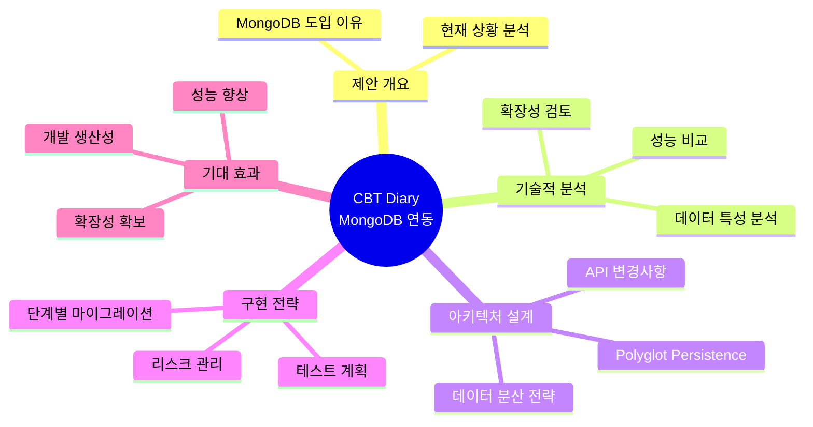

---

## 1. 📊 제안 개요

본 문서는 현재 MariaDB(관계형 데이터베이스) 중심으로 구현된 CBT-Diary 프로젝트에 **MongoDB(도큐먼트 데이터베이스)**를 도입하여, 각 데이터의 특성에 맞는 최적의 데이터베이스를 사용하는 **하이브리드 데이터베이스 아키텍처(Polyglot Persistence)**로 전환하는 방안을 제안합니다.

### 📈 현재 시스템 vs 제안 시스템

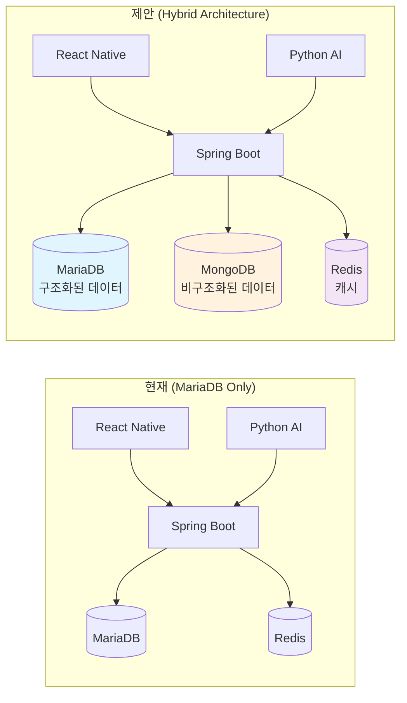

이러한 접근 방식은 데이터의 유연성, 확장성, 그리고 조회 성능을 극대화하여 서비스의 기술적 경쟁력을 한 단계 높이는 것을 목표로 합니다.

---## 2. 🤔 왜 MongoDB를 도입해야 하는가?

현재 시스템은 정형화된 데이터를 다루는 데 강점이 있는 MariaDB를 중심으로 설계되었습니다. 하지만 CBT-Diary 서비스가 다루는 데이터 중 일부는 MongoDB와 같은 NoSQL 데이터베이스에 더 적합한 특성을 가집니다.

### 📊 데이터 특성 분석 및 비교

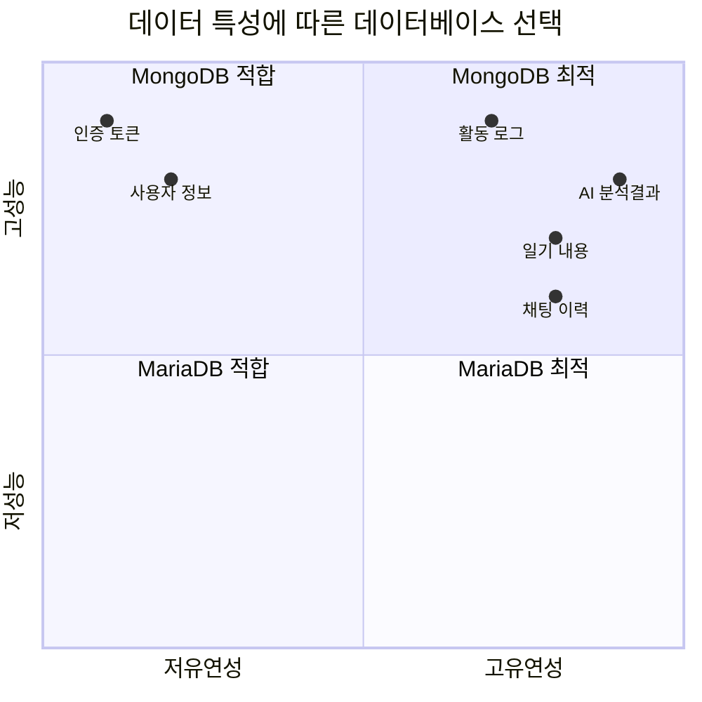

### 🔍 상세 비교 분석

| 📋 데이터 종류 | 🔄 현황 (MariaDB) | ❌ 문제점 및 한계 | ✅ MongoDB 도입 시 이점 |
|----------------|-------------------|-------------------|------------------------|
| **📝 일기 본문 및 AI 분석 결과** | diary, report 테이블에 정해진 컬럼으로 저장 | **비정형 데이터**: 일기 내용은 길이가 가변적인 긴 텍스트이며, AI 분석 결과(감정, 솔루션 등)는 복잡하고 중첩된 구조<br/>**유연성 부족**: AI 모델 개선으로 분석 항목이 추가/변경될 때마다 report 테이블의 스키마 변경(ALTER TABLE)이 필요 | **유연한 스키마**: JSON과 유사한 BSON 도큐먼트 구조로, 일기 내용과 복잡한 AI 분석 결과를 있는 그대로 저장<br/>**성능**: 관련된 데이터를 하나의 도큐먼트에 내장하여 JOIN 없이 한 번의 쿼리로 빠르게 조회 |
| **📊 사용자 활동 로그** | (현재 미구현) | 향후 서비스 확장 시, 대량의 쓰기(Write) 작업으로 인한 부하 발생 가능성 | **빠른 쓰기 성능**: 대량의 로그 데이터를 빠르게 저장<br/>**데이터 분석 용이**: 저장된 로그를 기반으로 사용자 행동 패턴 분석 |
| **🔔 실시간 알림 데이터** | sse_emitter 테이블 등 별도 구현 필요 | 실시간 알림 구현 시, 사용자 온라인 상태 및 알림 읽음 상태 관리의 복잡성 | **Capped Collection**: 오래된 데이터 자동 삭제로 최신 알림 목록 효율적 유지<br/>**Change Streams**: 데이터베이스 변경 사항 실시간 스트리밍 |

### 📈 성능 비교 예시

```mermaid
gantt
    title 쿼리 성능 비교 (일기 + AI 분석 결과 조회)
    dateFormat X
    axisFormat %s ms
    
    section MariaDB (JOIN)
    사용자 조회    :0, 50
    일기 조회      :50, 150
    AI 분석 조회   :150, 300
    Total         :0, 300
    
    section MongoDB (Single Query)
    통합 도큐먼트 조회 :0, 80
    Total             :0, 80
```

---

## 3. 🎯 MongoDB 적용 대상 서비스 분석

MongoDB의 장점을 극대화하기 위해, 다음 데이터들을 MongoDB로 이전하거나 신규 저장하는 것을 제안합니다.

### 📊 적용 우선순위 매트릭스

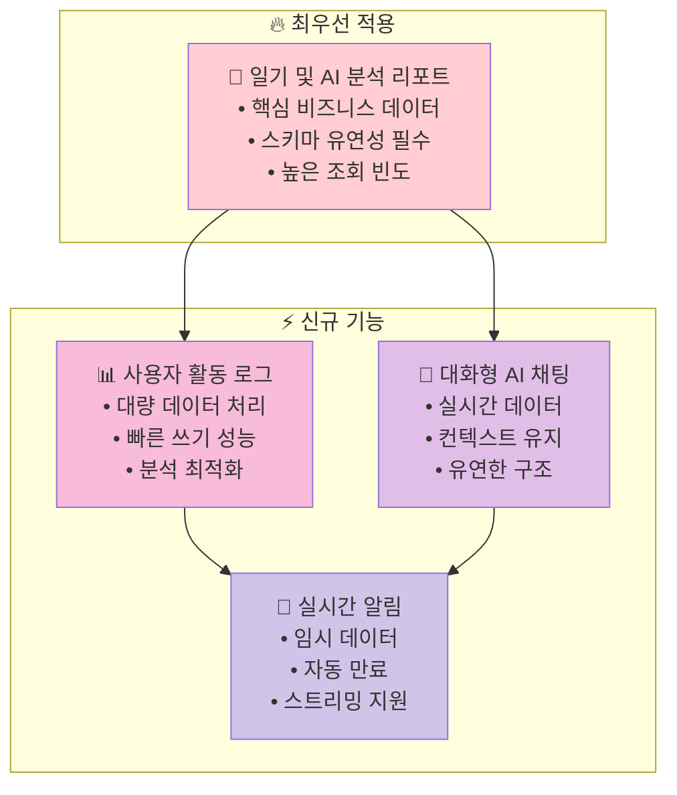

### ✅ [최우선 적용] 일기 및 AI 분석 리포트

**설명**: 사용자의 일기와 그에 대한 AI 분석 결과는 이 서비스의 가장 핵심적인 데이터입니다. 이 둘은 논리적으로 매우 강하게 연결되어 있으므로, 하나의 **"Diary Document"**로 묶어 저장하는 것이 가장 이상적입니다.

#### 📄 MongoDB 데이터 모델 예시 (diaries 컬렉션)

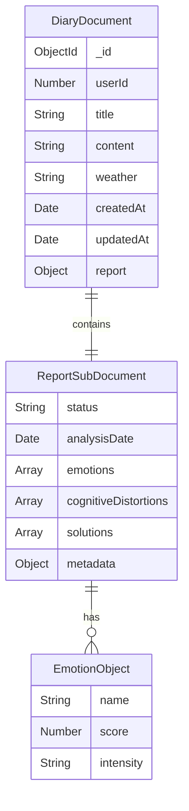

```json
{
  "_id": "6492a48f5e3b2e1f8a7b3d9c", // MongoDB의 ObjectId
  "userId": 123, // MariaDB의 User ID (FK 역할)
  "title": "오늘의 일기",
  "content": "오늘은 날씨가 정말 좋아서 기분이 상쾌했다...",
  "weather": "맑음",
  "createdAt": "2025-06-21T10:00:00Z",
  "updatedAt": "2025-06-21T10:00:00Z",
  "report": { // AI 분석 결과를 내장(embedded) 도큐먼트로 저장
    "status": "COMPLETED",
    "analysisDate": "2025-06-21T10:01:00Z",
    "emotions": [
      {"name": "행복", "score": 0.8, "intensity": "높음"},
      {"name": "평온", "score": 0.6, "intensity": "보통"}
    ],
    "cognitiveDistortions": [ // AI 모델이 고도화되어 새로운 필드가 생겨도 스키마 변경 불필요
      {
        "type": "긍정 편향",
        "originalSentence": "날씨가 좋아서 기분이 상쾌했다",
        "alternativeThought": "날씨와 관계없이 나의 기분을 조절할 수 있다.",
        "confidence": 0.7
      }
    ],
    "solutions": [
      "오늘 느낀 긍정적인 감정을 친구와 나눠보세요."
    ],
    "metadata": {
      "modelVersion": "GPT-4-turbo",
      "processingTime": 1250,
      "tokensUsed": 245
    }
  }
}
```

### ✅ [신규 기능] 사용자 활동 로그

**설명**: API 호출 로그, 주요 기능 사용 이력 등을 저장하여 서비스 운영 및 데이터 분석에 활용합니다.

#### 📊 활동 로그 데이터 플로우

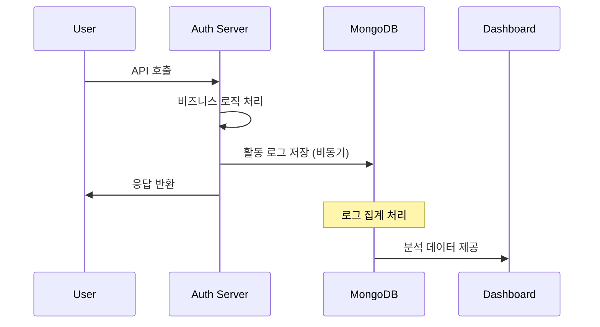

#### 📄 MongoDB 데이터 모델 예시 (activity_logs 컬렉션)

```json
{
  "_id": "...",
  "userId": 123,
  "action": "LOGIN_SUCCESS", // 또는 "CREATE_DIARY", "DELETE_DIARY" 등
  "ipAddress": "127.0.0.1",
  "timestamp": "2025-06-21T09:00:00Z",
  "details": {
    "device": "Android",
    "osVersion": "13.0",
    "appVersion": "1.2.3",
    "sessionId": "sess_abc123",
    "responseTime": 245,
    "statusCode": 200
  },
  "metadata": {
    "userAgent": "CBT-Diary/1.2.3 (Android 13.0)",
    "referer": "/dashboard",
    "geolocation": {
      "country": "KR",
      "city": "Seoul"
    }
  }
}
```

### ✅ [신규 기능] 대화형 AI 채팅 이력

**설명**: 사용자와 AI 챗봇 간의 대화 내용을 저장합니다. 각 대화 세션을 하나의 도큐먼트로 관리하여 컨텍스트를 유지하기 용이합니다.

#### 💬 채팅 세션 구조

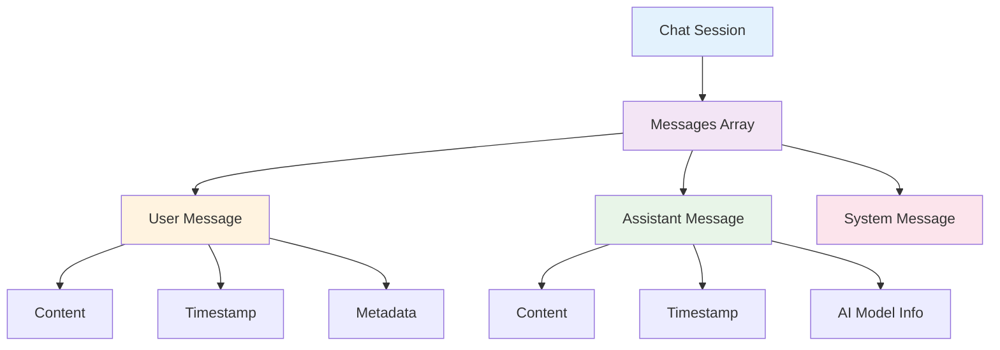

#### 📄 MongoDB 데이터 모델 예시 (chat_sessions 컬렉션)

```json
{
  "_id": "...",
  "userId": 123,
  "createdAt": "2025-06-21T11:00:00Z",
  "lastActivity": "2025-06-21T11:15:00Z",
  "status": "active", // active, closed, archived
  "summary": "우울감에 대한 상담 세션",
  "messages": [
    {
      "role": "user", 
      "content": "오늘 너무 우울해요.", 
      "timestamp": "2025-06-21T11:00:00Z",
      "metadata": {
        "sentiment": "negative",
        "urgency": "medium"
      }
    },
    {
      "role": "assistant", 
      "content": "무슨 일이 있으셨나요? 조금 더 자세히 이야기해주실 수 있나요?", 
      "timestamp": "2025-06-21T11:00:30Z",
      "metadata": {
        "model": "GPT-4",
        "temperature": 0.7,
        "responseTime": 1200
      }
    }
  ],
  "analytics": {
    "totalMessages": 8,
    "averageResponseTime": 1150,
    "userSentiment": "improving",
    "sessionDuration": 900 // seconds
  }
}
```

---

## 4. 🏗️ 제안 아키텍처: Polyglot Persistence

MariaDB와 MongoDB를 함께 사용하는 하이브리드 아키텍처입니다. **Auth-server**가 두 데이터베이스와 모두 통신하며, 데이터의 성격에 따라 적절한 저장소를 선택합니다.

### 🎯 전체 시스템 아키텍처

```mermaid
graph TB
    subgraph "Client Layer"
        Client[📱 CBT-front<br/>(React-Native)]
    end
    
    subgraph "API Gateway Layer"
        Gateway[🚪 API Gateway<br/>(Optional)]
    end
    
    subgraph "Application Layer"
        AuthServer[🔐 Auth-server<br/>(Spring Boot)]
        AiServer[🤖 ai-server<br/>(Python/FastAPI)]
    end
    
    subgraph "Database Layer"
        subgraph "Structured Data"
            RDBMS[(🗃️ MariaDB<br/>• 사용자 정보<br/>• 인증 데이터<br/>• 관계형 데이터)]
        end
        
        subgraph "Semi-Structured Data"
            NoSQL[(📄 MongoDB<br/>• 일기 내용<br/>• AI 분석 결과<br/>• 활동 로그<br/>• 채팅 이력)]
        end
        
        subgraph "Cache Layer"
            Cache[(⚡ Redis<br/>• 세션 정보<br/>• Refresh Token<br/>• 임시 데이터)]
        end
    end
    
    subgraph "External Services"
        OpenAI[🧠 OpenAI API<br/>(GPT Models)]
    end
    
    Client --> Gateway
    Gateway --> AuthServer
    AuthServer --> AiServer
    AiServer --> OpenAI
    
    AuthServer -.->|"사용자, 인증"| RDBMS
    AuthServer -.->|"일기, 로그, 채팅"| NoSQL
    AuthServer -.->|"캐시, 세션"| Cache
    
    style RDBMS fill:#e1f5fe
    style NoSQL fill:#fff3e0
    style Cache fill:#f3e5f5
    style AuthServer fill:#e8f5e8
    style AiServer fill:#fce4ec
```

### 📊 데이터 분산 전략

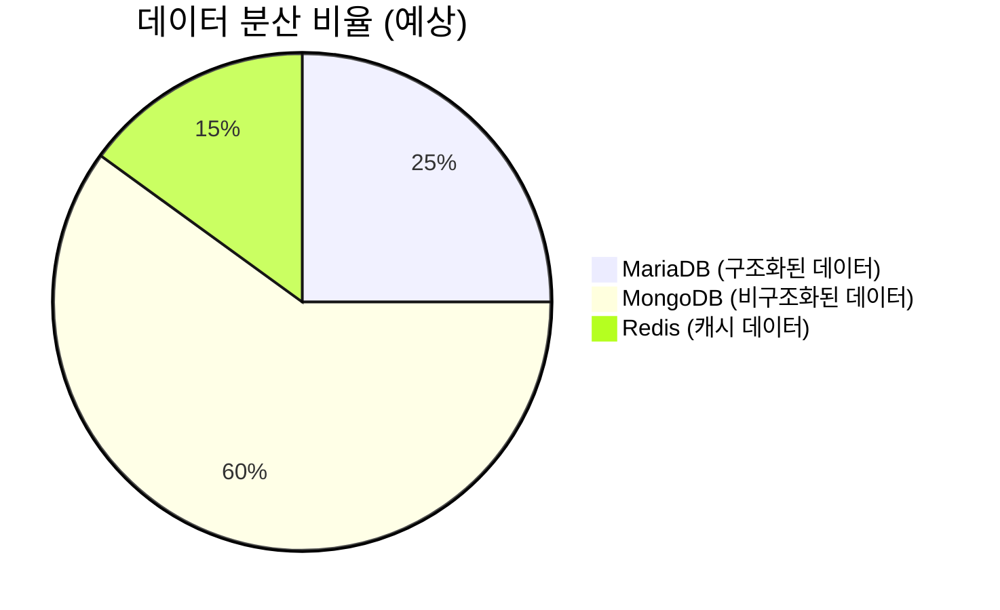

### 🔄 데이터 동기화 전략

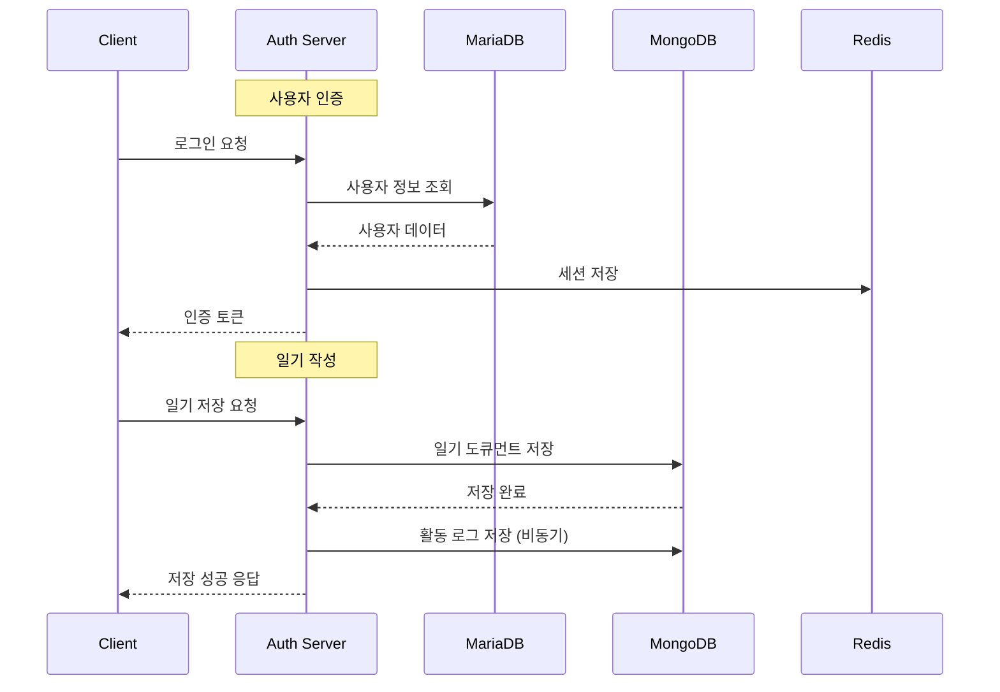

### 💾 **데이터베이스별 역할 분담**

| 🗃️ **MariaDB (RDBMS)** | 📄 **MongoDB (NoSQL)** | ⚡ **Redis (Cache)** |
|-------------------------|-------------------------|---------------------|
| ✅ 사용자 계정 정보 | ✅ 일기 내용 및 AI 분석 | ✅ JWT Refresh Token |
| ✅ 인증 및 권한 관리 | ✅ 사용자 활동 로그 | ✅ 세션 정보 |
| ✅ 시스템 설정 | ✅ 대화형 AI 채팅 이력 | ✅ 임시 캐시 데이터 |
| ✅ 관리자 기능 | ✅ 실시간 알림 데이터 | ✅ API 응답 캐시 |

### 🔗 마이크로서비스 통신 패턴

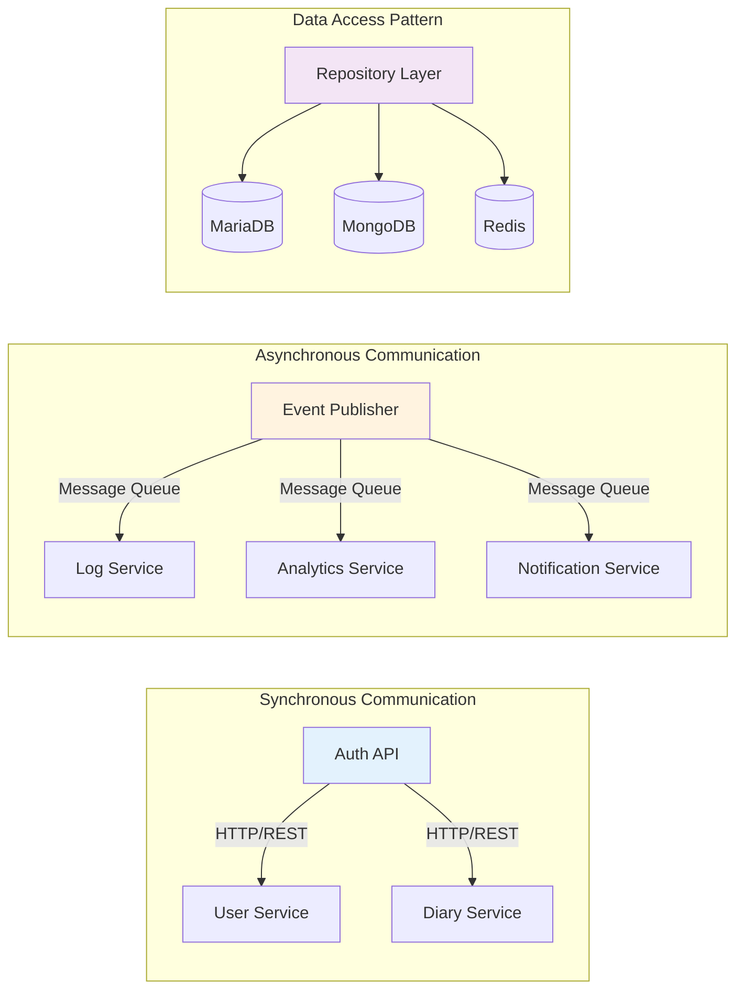

---

5.  단계별 구현 전략

    인프라 설정 (docker-compose.yml)

        docker-compose.yml 파일에 MongoDB 서비스를 추가하고, Auth-server가 접근할 수 있도록 네트워크를 설정합니다.

    백엔드 의존성 및 설정 (Auth-server)

        build.gradle에 spring-boot-starter-data-mongodb 의존성을 추가합니다.

        application.properties에 MongoDB 연결 정보를 추가합니다 (spring.data.mongodb.uri=...).

        기존 JPA 설정과 함께 MongoDB 설정을 위한 @Configuration 클래스를 추가합니다.

    도메인 및 리포지토리 재설계 (Auth-server)

        @Entity로 정의된 Diary, Report 클래스 대신, @Document 어노테이션을 사용한 DiaryDocument 클래스를 새로 정의합니다. (위의 JSON 예시 참고)

        JpaRepository를 상속받는 DiaryRepository 대신, MongoRepository를 상속받는 DiaryMongoRepository를 생성합니다.

    서비스 로직 수정 (DiaryService.java)

        기존 DiaryService에서 DiaryRepository(JPA)를 호출하던 부분을 DiaryMongoRepository를 호출하도록 수정합니다.

        AI 분석 결과를 별도의 report 테이블에 저장하는 대신, 조회해온 DiaryDocument에 report 필드를 업데이트하는 방식으로 로직을 변경합니다.

    AS-IS (JPA 기반)

    // DiaryService.java
    Diary diary = diaryRepository.save(new Diary(...));
    // ... AI 분석 후 ...
    Report report = reportRepository.save(new Report(...));
    diary.setReport(report);
    diaryRepository.save(diary);

    TO-BE (MongoDB 기반)

    // DiaryService.java
    DiaryDocument diaryDoc = diaryMongoRepository.save(new DiaryDocument(...));
    // ... AI 분석 후 ...
    diaryDoc.setReport(new ReportSubDocument(...)); // 분석 결과를 내장 도큐먼트로 설정
    diaryMongoRepository.save(diaryDoc); // 하나의 도큐먼트만 업데이트

6.  기대 효과

    개발 유연성 증대: AI 분석 결과 항목이 변경되어도 DB 스키마 수정이 필요 없어, AI 모델의 빠른 실험과 기능 추가가 용이해집니다.

    성능 향상: 일기와 분석 결과를 조회할 때 RDBMS의 JOIN 연산이 사라지고, 관련된 모든 데이터를 단일 도큐먼트 조회로 가져올 수 있어 읽기 성능이 크게 향상됩니다.

    확장성 확보: 대용량의 일기 데이터와 로그 데이터를 처리해야 할 때, 수평적 확장이 용이한 MongoDB의 아키텍처가 큰 장점을 가집니다.

    최적화된 아키텍처: 각 데이터의 특성에 맞는 최적의 데이터베이스를 사용함으로써, 시스템 전체의 효율성과 안정성을 높일 수 있습니다.
