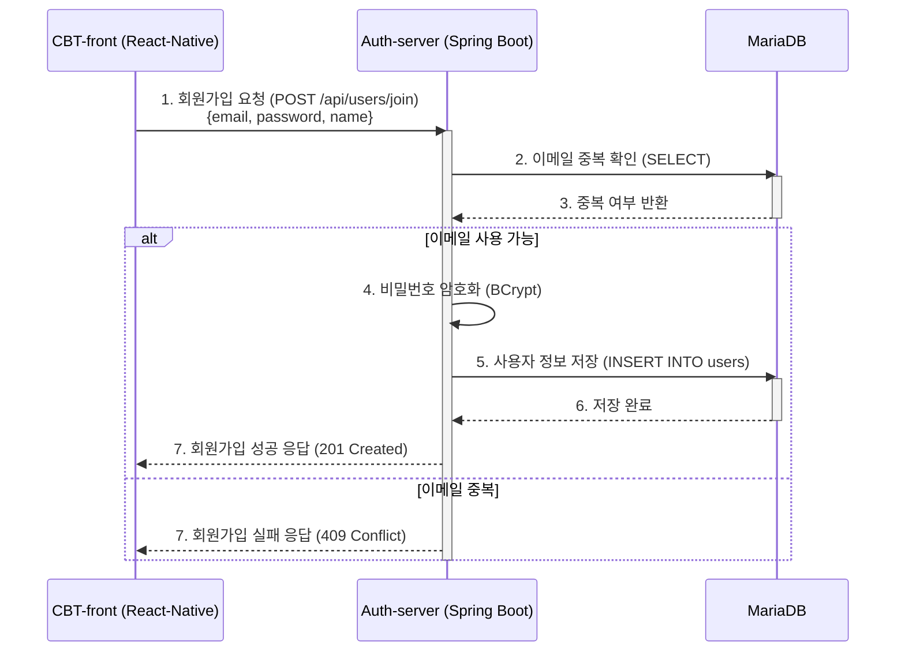
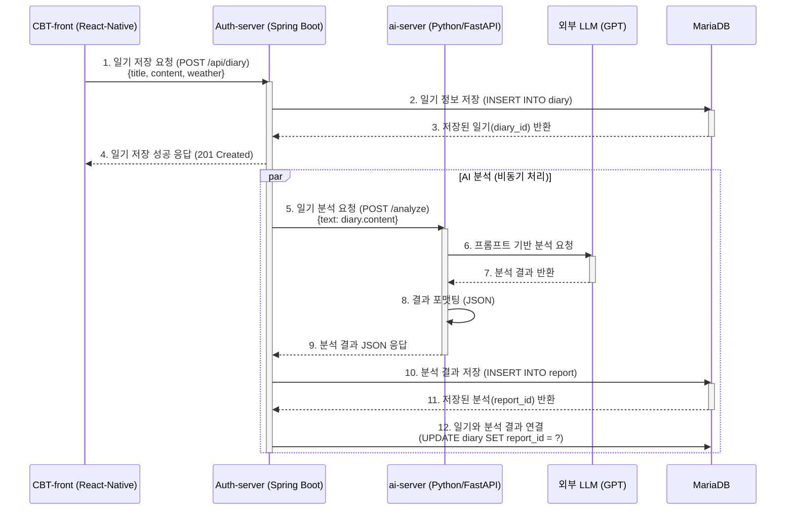
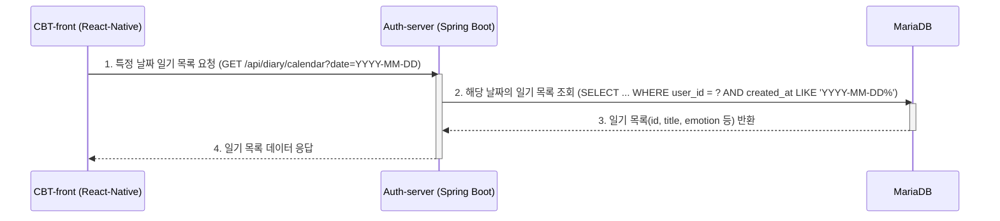

# CBT Diary: 전체 기능별 비즈니스 흐름도

본 문서는 사용자가 React-Native 클라이언트에서 특정 작업을 수행했을 때, Auth-server(Spring Boot), ai-server(Python), 그리고 데이터베이스(MariaDB, Redis) 간에 데이터가 어떻게 흐르는지 시퀀스 다이어그램으로 시각화한 것입니다.

> **참고**: 현재 프로젝트의 주 데이터베이스는 MariaDB입니다. 일기, 사용자 정보, AI 분석 결과 등 핵심 데이터는 모두 MariaDB에 저장 및 관리됩니다.

## 1. 사용자 인증 (Authentication)

### 1.1. 사용자 회원가입

사용자가 앱에서 이메일, 비밀번호, 이름 등 정보를 입력하고 '회원가입'을 요청했을 때의 흐름입니다.



### 1.2. 사용자 로그인 및 토큰 관리

사용자가 이메일과 비밀번호로 '로그인'을 요청했을 때의 인증 및 토큰 발급/저장 흐름입니다.

```mermaid
sequenceDiagram
    participant Client as CBT-front (React-Native)
    participant AuthServer as Auth-server (Spring Boot)
    participant Database as MariaDB
    participant Cache as Redis

    Client->>AuthServer: 1. 로그인 요청 (POST /api/auth/login) <br> {email, password}
    activate AuthServer

    AuthServer->>Database: 2. 사용자 정보 및 암호화된 비밀번호 조회 (SELECT)
    activate Database
    Database-->>AuthServer: 3. 사용자 정보 반환
    deactivate Database

    AuthServer->>AuthServer: 4. 비밀번호 일치 여부 확인

    alt 인증 성공
        AuthServer->>AuthServer: 5. Access & Refresh 토큰 생성 (JWT)

        AuthServer->>Cache: 6. Refresh 토큰 저장 (SET user_email:token)
        activate Cache
        Cache-->>AuthServer: 7. 저장 완료
        deactivate Cache

        AuthServer-->>Client: 8. 토큰 및 사용자 정보 응답 <br> {accessToken, refreshToken, user}
        deactivate AuthServer

        Client->>Client: 9. 기기에 토큰 및 사용자 정보 저장 (AsyncStorage)

    else 인증 실패
        AuthServer-->>Client: 8. 로그인 실패 응답 (401 Unauthorized)
        deactivate AuthServer
    end
```

## 2. 일기 관리 (Diary Management)

### 2.1. 일기 작성 및 AI 감정 분석

사용자가 일기를 작성하고 '저장'을 요청했을 때, 일기 저장과 AI 분석이 함께 이루어지는 비동기 흐름입니다.



### 2.2. 특정 날짜의 일기 목록 조회

사용자가 캘린더에서 특정 날짜를 선택했을 때, 해당 날짜에 작성된 모든 일기의 요약 정보를 가져오는 흐름입니다.



### 2.3. 일기 상세 내용 조회

사용자가 목록에서 특정 일기를 선택했을 때, 일기의 전체 내용과 AI 분석 결과를 함께 조회하는 흐름입니다.

```mermaid
sequenceDiagram
    participant Client as CBT-front (React-Native)
    participant AuthServer as Auth-server (Spring Boot)
    participant Database as MariaDB

        Client->>AuthServer: 1. 일기 상세 조회 요청 (GET /api/diary/{diaryId})
        activate AuthServer

        AuthServer->>Database: 2. 일기 및 연관된 분석 리포트 조회 <br> (SELECT * FROM diary d LEFT JOIN report r ON d.report_id = r.id WHERE d.id = ?)
        activate Database
        Database-->>AuthServer: 3. 일기 및 분석 데이터 반환
        deactivate Database

        AuthServer-->>Client: 4. 상세 데이터(일기+분석) 응답
        deactivate AuthServer

    2.4. 일기 수정사용자가 기존에 작성했던 일기의 내용을 수정하고 '저장'을 요청했을 때의 흐름입니다. (현재 로직에서는 수정 시 AI 재분석은 수행되지 않습니다.)sequenceDiagram
    participant Client as CBT-front (React-Native)
    participant AuthServer as Auth-server (Spring Boot)
    participant Database as MariaDB

        Client->>AuthServer: 1. 일기 수정 요청 (PUT /api/diary/{diaryId}) <br> {title, content, weather}
        activate AuthServer

        AuthServer->>Database: 2. 수정할 일기 조회 (소유자 확인)
        activate Database
        Database-->>AuthServer: 3. 일기 정보 반환
        deactivate Database

        alt 소유자 일치
            AuthServer->>Database: 4. 일기 내용 업데이트 (UPDATE diary SET ...)
            activate Database
            Database-->>AuthServer: 5. 업데이트 완료
            deactivate Database

            AuthServer-->>Client: 6. 수정 성공 응답 (200 OK)
        else 소유자 불일치 또는 일기 없음
            AuthServer-->>Client: 6. 실패 응답 (403 Forbidden / 404 Not Found)
        end
        deactivate AuthServer

    2.5. 일기 삭제사용자가 특정 일기를 삭제하는 흐름입니다.sequenceDiagram
    participant Client as CBT-front (React-Native)
    participant AuthServer as Auth-server (Spring Boot)
    participant Database as MariaDB

        Client->>AuthServer: 1. 일기 삭제 요청 (DELETE /api/diary/{diaryId})
        activate AuthServer

        AuthServer->>Database: 2. 삭제할 일기 조회 (소유자 확인)
        activate Database
        Database-->>AuthServer: 3. 일기 정보 반환
        deactivate Database

        alt 소유자 일치
            AuthServer->>Database: 4. 일기 및 연관된 리포트 삭제 (DELETE)
            note right of Database: Cascade 설정 또는<br>서비스 로직으로 Report 함께 삭제
            activate Database
            Database-->>AuthServer: 5. 삭제 완료
            deactivate Database

            AuthServer-->>Client: 6. 삭제 성공 응답 (204 No Content)
        else 소유자 불일치 또는 일기 없음
            AuthServer-->>Client: 6. 실패 응답 (403 Forbidden / 404 Not Found)
        end
        deactivate AuthServer
