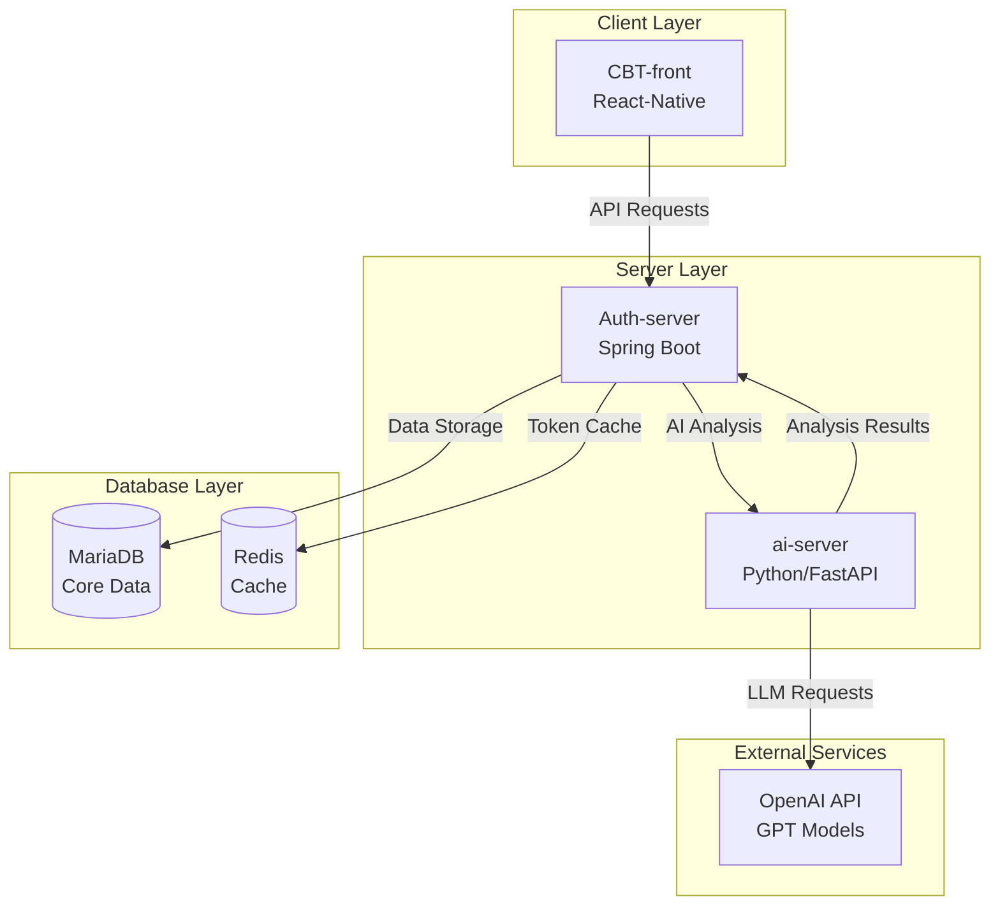

# CBT Diary: 전체 기능별 비즈니스 흐름도  

본 문서는 사용자가 React-Native 클라이언트에서 특정 작업을 수행했을 때, Auth-server(Spring Boot), ai-server(Python), 그리고 데이터베이스(MariaDB, Redis) 간에 데이터가 어떻게 흐르는지 시퀀스 다이어그램으로 시각화한 것입니다.

> **참고**: 현재 프로젝트의 주 데이터베이스는 MariaDB입니다. 일기, 사용자 정보, AI 분석 결과 등 핵심 데이터는 모두 MariaDB에 저장 및 관리됩니다.

## 1. 사용자 인증 (Authentication)

### 1.1. 사용자 회원가입

사용자가 앱에서 이메일, 비밀번호, 이름 등 정보를 입력하고 '회원가입'을 요청했을 때의 흐름입니다.

```mermaid
sequenceDiagram
    participant Client as CBT-front (React-Native)
    participant AuthServer as Auth-server (Spring Boot)
    participant Database as MariaDB

    Client->>AuthServer: 1. 회원가입 요청 (POST /api/users/join) <br> {email, password, name}
    activate AuthServer

    AuthServer->>Database: 2. 이메일 중복 확인 (SELECT)
    activate Database
    Database-->>AuthServer: 3. 중복 여부 반환
    deactivate Database

    alt 이메일 사용 가능
        AuthServer->>AuthServer: 4. 비밀번호 암호화 (BCrypt)
        AuthServer->>Database: 5. 사용자 정보 저장 (INSERT INTO users)
        activate Database
        Database-->>AuthServer: 6. 저장 완료
        deactivate Database

        AuthServer-->>Client: 7. 회원가입 성공 응답 (201 Created)
    else 이메일 중복
        AuthServer-->>Client: 7. 회원가입 실패 응답 (409 Conflict)
    end
    deactivate AuthServer
```



### 1.2. 사용자 로그인 및 토큰 관리

사용자가 이메일과 비밀번호로 '로그인'을 요청했을 때의 인증 및 토큰 발급/저장 흐름입니다.

```mermaid
sequenceDiagram
    participant Client as CBT-front (React-Native)
    participant AuthServer as Auth-server (Spring Boot)
    participant Database as MariaDB
    participant Cache as Redis

    Client->>AuthServer: 1. 로그인 요청 (POST /api/auth/login) <br> {email, password}
    activate AuthServer

    AuthServer->>Database: 2. 사용자 정보 및 암호화된 비밀번호 조회 (SELECT)
    activate Database
    Database-->>AuthServer: 3. 사용자 정보 반환
    deactivate Database

    AuthServer->>AuthServer: 4. 비밀번호 일치 여부 확인

    alt 인증 성공
        AuthServer->>AuthServer: 5. Access & Refresh 토큰 생성 (JWT)

        AuthServer->>Cache: 6. Refresh 토큰 저장 (SET user_email:token)
        activate Cache
        Cache-->>AuthServer: 7. 저장 완료
        deactivate Cache

        AuthServer-->>Client: 8. 토큰 및 사용자 정보 응답 <br> {accessToken, refreshToken, user}
        deactivate AuthServer

        Client->>Client: 9. 기기에 토큰 및 사용자 정보 저장 (AsyncStorage)

    else 인증 실패
        AuthServer-->>Client: 8. 로그인 실패 응답 (401 Unauthorized)
        deactivate AuthServer
    end
```

## 2. 일기 관리 (Diary Management)

### 2.1. 일기 작성 및 AI 감정 분석

사용자가 일기를 작성하고 '저장'을 요청했을 때, 일기 저장과 AI 분석이 함께 이루어지는 비동기 흐름입니다.

```mermaid
sequenceDiagram
    participant Client as CBT-front (React-Native)
    participant AuthServer as Auth-server (Spring Boot)
    participant AiServer as ai-server (Python/FastAPI)
    participant OpenAIApi as 외부 LLM (GPT)
    participant Database as MariaDB

    Client->>AuthServer: 1. 일기 저장 요청 (POST /api/diary) <br> {title, content, weather}
    activate AuthServer

    AuthServer->>Database: 2. 일기 정보 저장 (INSERT INTO diary)
    activate Database
    Database-->>AuthServer: 3. 저장된 일기(diary_id) 반환
    deactivate Database

    AuthServer-->>Client: 4. 일기 저장 성공 응답 (201 Created)

    par AI 분석 (비동기 처리)
        AuthServer->>AiServer: 5. 일기 분석 요청 (POST /analyze) <br> {text: diary.content}
        activate AiServer

        AiServer->>OpenAIApi: 6. 프롬프트 기반 분석 요청
        activate OpenAIApi
        OpenAIApi-->>AiServer: 7. 분석 결과 반환
        deactivate OpenAIApi

        AiServer->>AiServer: 8. 결과 포맷팅 (JSON)
        AiServer-->>AuthServer: 9. 분석 결과 JSON 응답
        deactivate AiServer

        AuthServer->>Database: 10. 분석 결과 저장 (INSERT INTO report)
        activate Database
        Database-->>AuthServer: 11. 저장된 분석(report_id) 반환
        deactivate Database

        AuthServer->>Database: 12. 일기와 분석 결과 연결 <br> (UPDATE diary SET report_id = ?)
    end
    deactivate AuthServer
```



### 2.2. 특정 날짜의 일기 목록 조회

사용자가 캘린더에서 특정 날짜를 선택했을 때, 해당 날짜에 작성된 모든 일기의 요약 정보를 가져오는 흐름입니다.

```mermaid
sequenceDiagram
    participant Client as CBT-front (React-Native)
    participant AuthServer as Auth-server (Spring Boot)
    participant Database as MariaDB

    Client->>AuthServer: 1. 특정 날짜 일기 목록 요청 (GET /api/diary/calendar?date=YYYY-MM-DD)
    activate AuthServer

    AuthServer->>Database: 2. 해당 날짜의 일기 목록 조회 (SELECT ... WHERE user_id = ? AND created_at LIKE 'YYYY-MM-DD%')
    activate Database
    Database-->>AuthServer: 3. 일기 목록(id, title, emotion 등) 반환
    deactivate Database

    AuthServer-->>Client: 4. 일기 목록 데이터 응답
    deactivate AuthServer
```



### 2.3. 일기 상세 내용 조회

사용자가 목록에서 특정 일기를 선택했을 때, 일기의 전체 내용과 AI 분석 결과를 함께 조회하는 흐름입니다.

```mermaid
sequenceDiagram
    participant Client as CBT-front (React-Native)
    participant AuthServer as Auth-server (Spring Boot)
    participant Database as MariaDB

    Client->>AuthServer: 1. 일기 상세 조회 요청 (GET /api/diary/{diaryId})
    activate AuthServer

    AuthServer->>Database: 2. 일기 및 연관된 분석 리포트 조회 <br> (SELECT * FROM diary d LEFT JOIN report r ON d.report_id = r.id WHERE d.id = ?)
    activate Database
    Database-->>AuthServer: 3. 일기 및 분석 데이터 반환
    deactivate Database

    AuthServer-->>Client: 4. 상세 데이터(일기+분석) 응답
    deactivate AuthServer
```



### 2.4. 일기 수정

사용자가 기존에 작성했던 일기의 내용을 수정하고 '저장'을 요청했을 때의 흐름입니다. (현재 로직에서는 수정 시 AI 재분석은 수행되지 않습니다.)

```mermaid
sequenceDiagram
    participant Client as CBT-front (React-Native)
    participant AuthServer as Auth-server (Spring Boot)
    participant Database as MariaDB

    Client->>AuthServer: 1. 일기 수정 요청 (PUT /api/diary/{diaryId}) <br> {title, content, weather}
    activate AuthServer

    AuthServer->>Database: 2. 수정할 일기 조회 (소유자 확인)
    activate Database
    Database-->>AuthServer: 3. 일기 정보 반환
    deactivate Database

    alt 소유자 일치
        AuthServer->>Database: 4. 일기 내용 업데이트 (UPDATE diary SET ...)
        activate Database
        Database-->>AuthServer: 5. 업데이트 완료
        deactivate Database

        AuthServer-->>Client: 6. 수정 성공 응답 (200 OK)
    else 소유자 불일치 또는 일기 없음
        AuthServer-->>Client: 6. 실패 응답 (403 Forbidden / 404 Not Found)
    end
    deactivate AuthServer
```



### 2.5. 일기 삭제

사용자가 특정 일기를 삭제하는 흐름입니다.

```mermaid
sequenceDiagram
    participant Client as CBT-front (React-Native)
    participant AuthServer as Auth-server (Spring Boot)
    participant Database as MariaDB

    Client->>AuthServer: 1. 일기 삭제 요청 (DELETE /api/diary/{diaryId})
    activate AuthServer

    AuthServer->>Database: 2. 삭제할 일기 조회 (소유자 확인)
    activate Database
    Database-->>AuthServer: 3. 일기 정보 반환
    deactivate Database

    alt 소유자 일치
        AuthServer->>Database: 4. 일기 및 연관된 리포트 삭제 (DELETE)
        note right of Database: Cascade 설정 또는<br>서비스 로직으로 Report 함께 삭제
        activate Database
        Database-->>AuthServer: 5. 삭제 완료
        deactivate Database

        AuthServer-->>Client: 6. 삭제 성공 응답 (204 No Content)
    else 소유자 불일치 또는 일기 없음
        AuthServer-->>Client: 6. 실패 응답 (403 Forbidden / 404 Not Found)
    end
    deactivate AuthServer
```



---

## 📊 프로젝트 아키텍처 개요



## 🔄 전체 시스템 플로우

```mermaid
flowchart LR
    Start([사용자 앱 실행]) --> Auth{인증 상태}
    Auth -->|로그인됨| Main[메인 화면]
    Auth -->|미로그인| Login[로그인/회원가입]
    
    Login --> Main
    Main --> Diary[일기 작성]
    Main --> Calendar[캘린더 조회]
    Main --> Analysis[분석 결과 조회]
    
    Diary --> AI[AI 감정 분석]
    AI --> Save[데이터 저장]
    Save --> Main
    
    Calendar --> DiaryList[일기 목록]
    DiaryList --> DiaryDetail[일기 상세]
    DiaryDetail --> Edit[편집/삭제]
    Edit --> Main
    
    Analysis --> Report[리포트 생성]
    Report --> Main
```



## ⚡ 주요 기능별 처리 시간

| 기능 | 예상 처리 시간 | 비고 |
|------|----------------|------|
| 회원가입 | 200-500ms | 이메일 중복 체크 포함 |
| 로그인 | 150-300ms | JWT 토큰 생성 |
| 일기 저장 | 100-200ms | AI 분석은 비동기 |
| AI 감정 분석 | 2-5초 | OpenAI API 응답 시간 |
| 일기 목록 조회 | 50-150ms | 페이징 적용 시 |
| 일기 상세 조회 | 100-200ms | 조인 쿼리 포함 |

## 🛠️ 기술 스택 상세

### Frontend
- **React Native**: 크로스 플랫폼 모바일 앱
- **AsyncStorage**: 로컬 데이터 저장 (토큰, 사용자 설정)

### Backend
- **Spring Boot**: RESTful API 서버
- **Spring Security**: 인증/인가 처리
- **JWT**: 토큰 기반 인증

### AI Server
- **FastAPI**: 빠른 API 응답을 위한 Python 웹 프레임워크
- **OpenAI API**: GPT 모델을 활용한 감정 분석

### Database
- **MariaDB**: 주 데이터베이스 (사용자, 일기, 분석 결과)
- **Redis**: 캐시 및 세션 관리

---

*이 문서는 CBT Diary 프로젝트의 전체적인 데이터 흐름을 이해하는 데 도움이 되도록 작성되었습니다. 각 다이어그램은 실제 API 엔드포인트와 데이터베이스 스키마를 기반으로 합니다.*
