# 📝 궁극의 문서 편집 지침
*문서를 전문적이고 매력적이며 접근 가능한 콘텐츠로 변환하세요*

## 📋 목차
- [🎯 개요](#-개요)
- [📊 문서 개선 프레임워크](#-문서-개선-프레임워크)
- [🔧 구현 지침](#-구현-지침)
- [✅ 품질 보증 체크리스트](#-품질-보증-체크리스트)
- [📚 추가 자료](#-추가-자료)
- [🎓 모범 사례 예시](#-모범-사례-예시)
- [🚀 실행 계획 템플릿](#-실행-계획-템플릿)

## 🎯 개요

이 종합 가이드는 일반 문서를 **최고 품질의 콘텐츠**로 변환하기 위한 체계적인 지침을 제공합니다. 이 지침은 품질, 접근성, 사용자 참여를 극대화하는 데 중점을 둡니다.

### 🌟 주요 이점
- **향상된 사용자 경험**: 가독성과 탐색성 개선
- **전문적인 외관**: 일관되고 시각적으로 매력적인 디자인
- **더 나은 접근성**: 모든 사용자를 위한 포괄적인 콘텐츠
- **증가된 참여도**: 상호작용적이고 매력적인 콘텐츠

### 📈 문서 품질 지표

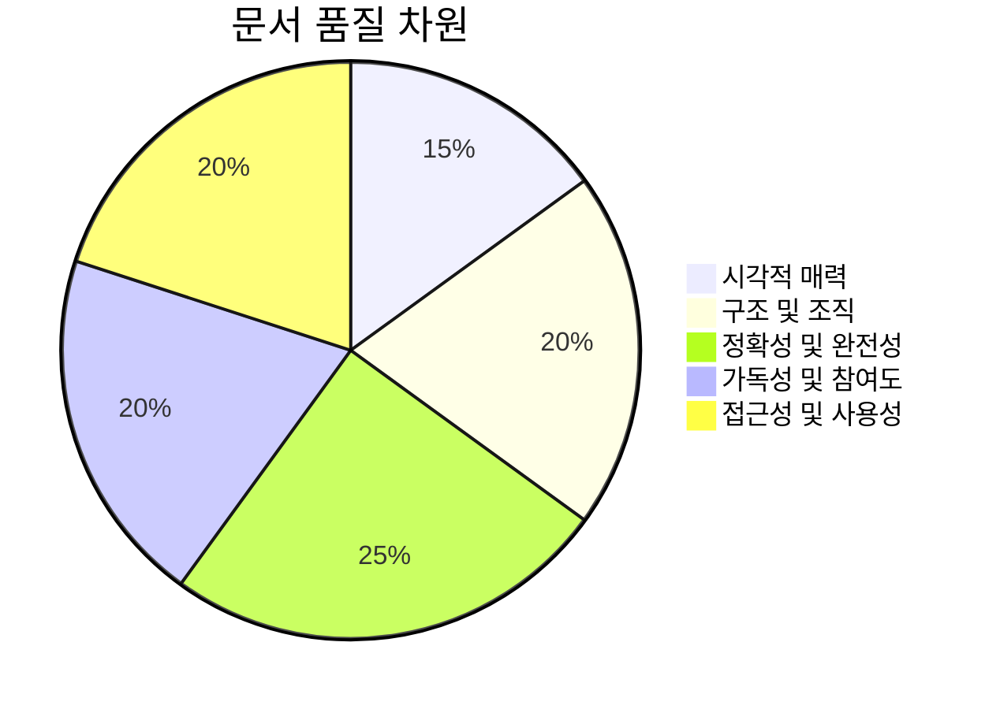

---

## 📊 문서 개선 프레임워크

다음 **13가지 핵심 원칙**을 따라 문서를 변환하세요:

### 1. 🎨 **시각적 우수성**
> **목표**: 텍스트 중심의 문서를 시각적으로 매력적인 경험으로 변환

#### 📸 포함할 시각적 요소:
- **Mermaid 다이어그램**: 플로우차트, 시퀀스 다이어그램, 클래스 다이어그램, 상태 다이어그램
- **차트 및 그래프**: 파이 차트, 막대 차트, 타임라인 시각화
- **아이콘 및 이모지**: 섹션 헤더 및 중요한 포인트에 전략적으로 사용
- **인포그래픽**: 복잡한 데이터를 단순화하여 시각적으로 표현

#### 🛠️ Mermaid 다이어그램 유형:
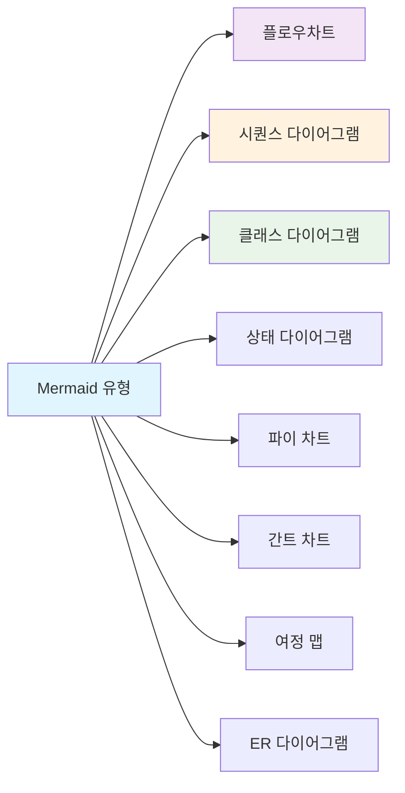

**💡 전문가 팁**: 각 시각적 요소는 명확한 목적을 가지고 콘텐츠 이해를 직접적으로 지원해야 합니다.

---

### 2. 🏗️ **구조적 조직**
> **목표**: 최적의 탐색을 위한 논리적이고 계층적인 콘텐츠 구조 생성

#### 📐 조직 원칙:
- **계층적 헤딩**: H1-H6을 일관되게 사용
- **논리적 흐름**: 각 섹션이 이전 섹션을 기반으로 구축
- **명확한 섹션**: 각 콘텐츠 블록의 뚜렷한 목적
- **점진적 공개**: 중요한 정보 우선 제공

#### 📋 콘텐츠 구조 템플릿:
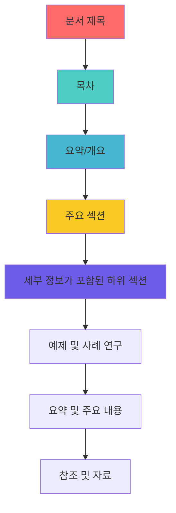

**✅ 구조 체크리스트**:
- [ ] 명확한 헤딩 계층 구조 (H1 → H6)
- [ ] 논리적 콘텐츠 흐름
- [ ] 일관된 서식
- [ ] 스캔 가능한 불릿 포인트
- [ ] 절차를 위한 번호 매기기 목록

---

### 3. 🎯 **정확성 및 검증**
> **목표**: 모든 정보가 최신이며 정확하고 신뢰할 수 있도록 보장

#### 🔍 검증 프로세스:
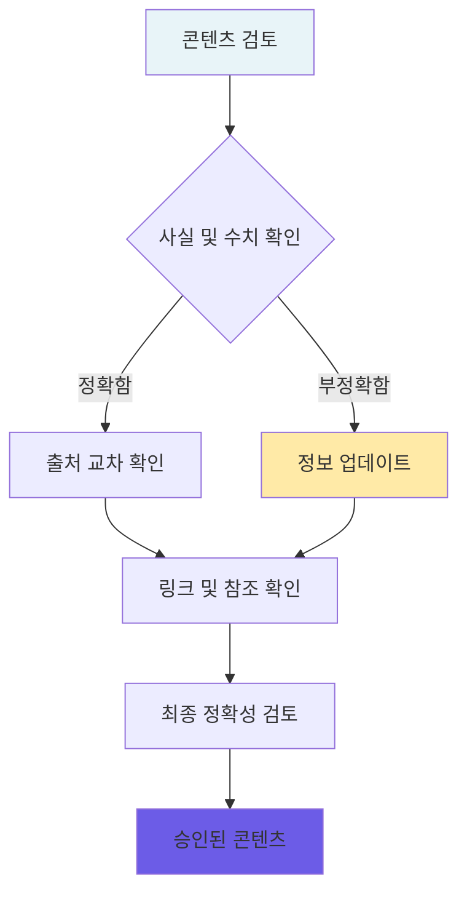

#### 📚 출처 검증 기준:
- **1차 출처**: 원본 연구, 공식 문서
- **최신 정보**: 최근 2-3년 이내에 발행된 자료
- **권위 있는 출처**: 인정받는 전문가 및 기관
- **다수 확인**: 중요한 사실 교차 확인

**⚡ 빠른 정확성 팁**:
- 모든 통계 및 데이터 포인트 사실 확인
- URL 및 외부 링크 기능 확인
- 오래된 예제 및 사례 연구 업데이트
- 참조 문서에 발행 날짜 포함

---

### 4. 📚 **포괄적 범위**
> **목표**: 정보의 누락 없이 주제의 모든 측면을 다룸

#### 🧩 완전성 프레임워크:
- **핵심 개념**: 기본 원칙 및 정의
- **실용적인 예**: 실제 적용 및 사용 사례
- **엣지 케이스**: 드물지만 중요한 시나리오
- **문제 해결**: 일반적인 문제 및 해결책

#### 📊 콘텐츠 격차 분석:
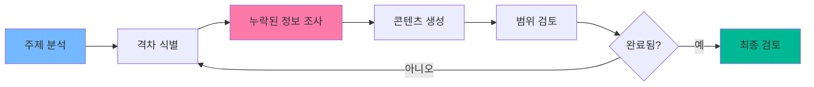

**🔍 범위 체크리스트**:
- [ ] 모든 하위 주제 다룸
- [ ] 초급자부터 고급자까지 수준별 내용 포함
- [ ] 각 주요 개념에 대한 예제 제공
- [ ] 일반적인 질문에 대한 답변 포함
- [ ] 다음 단계 또는 후속 조치 제공

---

### 5. 📖 **향상된 가독성**
> **목표**: 모든 독자가 접근하고 이해할 수 있도록 콘텐츠를 만듦

#### ✍️ 글쓰기 모범 사례:
- **명확한 언어**: 간단하고 직접적인 의사소통
- **짧은 문장**: 문장당 15-20단어 최대
- **능동태 사용**: 수동태보다 능동태 선호
- **일관된 용어 사용**: 기술 용어는 한 번 정의하고 일관되게 사용

#### 📏 가독성 지표:
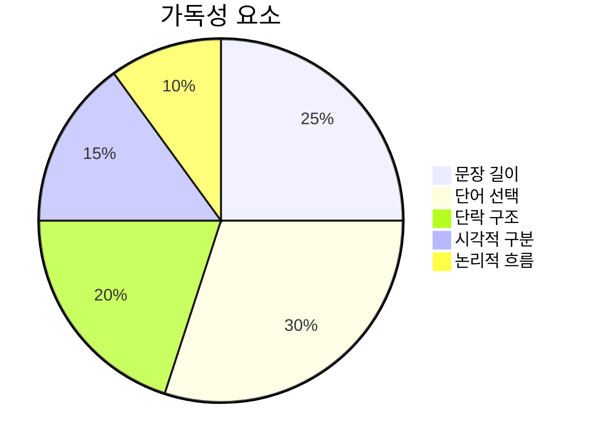

**🎯 가독성 목표**:
- **Flesch-Kincaid 학년 수준**: 8-10 (대부분의 독자가 접근 가능)
- **문장 길이**: 평균 15-20단어
- **단락 길이**: 최대 3-5문장
- **기술 용어**: 처음 사용 시 항상 정의

**💡 빠른 가독성 팁**:
- 아이디어를 연결하는 전환어 사용
- 긴 단락은 소제목으로 구분
- 시각적 여유를 위한 여백 포함
- 목록 및 주요 정보를 위한 불릿 포인트 사용

---

### 6. 🎪 **독자 참여**
> **목표**: 주의를 끌고 상호작용을 유도하는 매력적인 콘텐츠 생성

#### 🎭 참여 전략:
- **상호작용 요소**: 퀴즈, 설문조사, 자기 평가 도구
- **대화형 톤**: 독자에게 직접 말하기 ("당신", "당신의")
- **실제 예제**: 사례 연구, 성공 사례, 실용적인 시나리오
- **행동 촉구**: 명확한 다음 단계 및 독자 참여 유도

#### 🎮 인터랙티브 콘텐츠 아이디어:
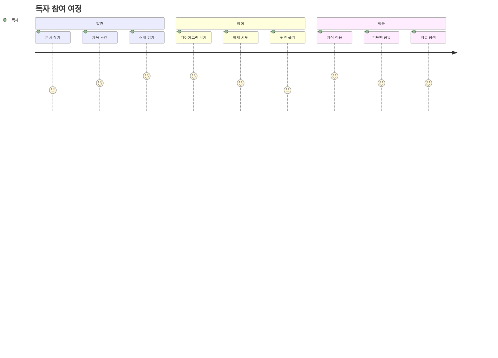

**🎯 참여 요소**:
- ❓ **지식 점검 질문**: 이해도 테스트
- 💭 **사고 실험**: "당신이라면 어떻게 할 것인가..."
- 📝 **실용적인 연습**: 실습 활동
- 🗣️ **토론 주제**: 팀 토론을 위한 질문
- 📊 **자기 평가 도구**: 진행 상황 추적

**참여 블록 예시**:
> 💡 **빠른 도전 과제**: 더 읽기 전에 불완전한 문서로 인해 문제가 발생했던 때를 생각해 보세요. 무엇이 사용하기 어렵게 만들었나요? 모범 사례를 탐색하면서 이를 염두에 두세요.

---

### 7. ♿ **보편적 접근성**
> **목표**: 모든 사용자가 사용할 수 있는 콘텐츠 보장, 장애인을 포함하여

#### 🌐 WCAG 2.1 준수 체크리스트:
- **대체 텍스트**: 모든 이미지 및 다이어그램에 대한 설명 텍스트
- **색 대비**: 일반 텍스트 4.5:1 비율, 큰 텍스트 3:1 비율
- **키보드 탐색**: 모든 대화형 요소에 키보드 접근 가능
- **스크린 리더 호환성**: 적절한 헤딩 구조 및 의미론적 마크업

#### 🎯 접근성 구현:
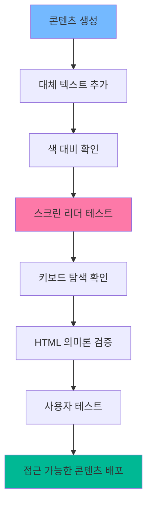

**♿ 접근성 기능**:
- **대체 텍스트 예시**: `alt="프로세스 흐름도, 5단계로 구성"`
- **색상 독립성**: 색상만으로 전달되지 않는 정보
- **명확한 헤딩**: 스크린 리더를 위한 논리적 H1-H6 계층 구조
- **링크 설명**: 의미 있는 링크 텍스트 (예: "여기를 클릭하세요" 아님)
- **테이블 헤더**: 데이터 테이블에 대한 적절한 `<th>` 요소

**📋 접근성 빠른 점검**:
- [ ] 모든 이미지에 설명 대체 텍스트가 있음
- [ ] 헤딩이 논리적 계층 구조를 따름
- [ ] 링크에 의미 있는 설명이 있음
- [ ] 색 대비가 기준을 충족함
- [ ] 이미지/CSS 없이 콘텐츠가 작동함

---

### 8. 🎨 **일관된 디자인 시스템**
> **목표**: 전문적인 외관을 위해 모든 문서에서 일관성 유지

#### 📐 스타일 가이드 요소:
- **타이포그래피**: 일관된 글꼴 계층 구조 및 크기
- **색상 팔레트**: 다양한 콘텐츠 유형에 대한 표준화된 색상
- **간격**: 균일한 여백, 패딩 및 줄 높이
- **서식**: 일관된 코드 블록, 인용 및 주석 상자

#### 🎯 일관성 프레임워크:
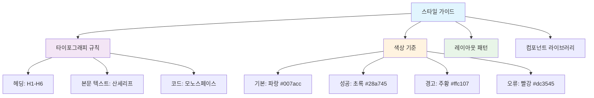

**📝 일관성 체크리스트**:
- [ ] 전체적으로 동일한 헤딩 스타일
- [ ] 일관된 불릿 포인트 형식
- [ ] 균일한 코드 블록 스타일링
- [ ] 표준화된 주석 상자
- [ ] 일관된 이미지 크기 및 배치

**🎨 스타일 예시**:
```
# H1: 메인 제목 (굵게, 32px)
## H2: 섹션 헤더 (굵게, 24px)  
### H3: 하위 섹션 (굵게, 20px)

**굵은 텍스트**: 중요한 개념
*기울임 텍스트*: 강조
`코드 텍스트`: 기술 용어
```

---

### 9. 🔎 **검색 최적화**
> **목표**: 검색 및 탐색을 통해 콘텐츠를 쉽게 발견할 수 있도록 함

#### 🎯 SEO 모범 사례:
- **설명적인 제목**: 명확하고 키워드가 포함된 헤딩
- **메타 설명**: 각 섹션에 대한 간결한 요약
- **내부 링크**: 관련 섹션 간의 교차 참조
- **키워드 전략**: 관련 용어의 자연스러운 통합

#### 🗺️ 탐색 향상:
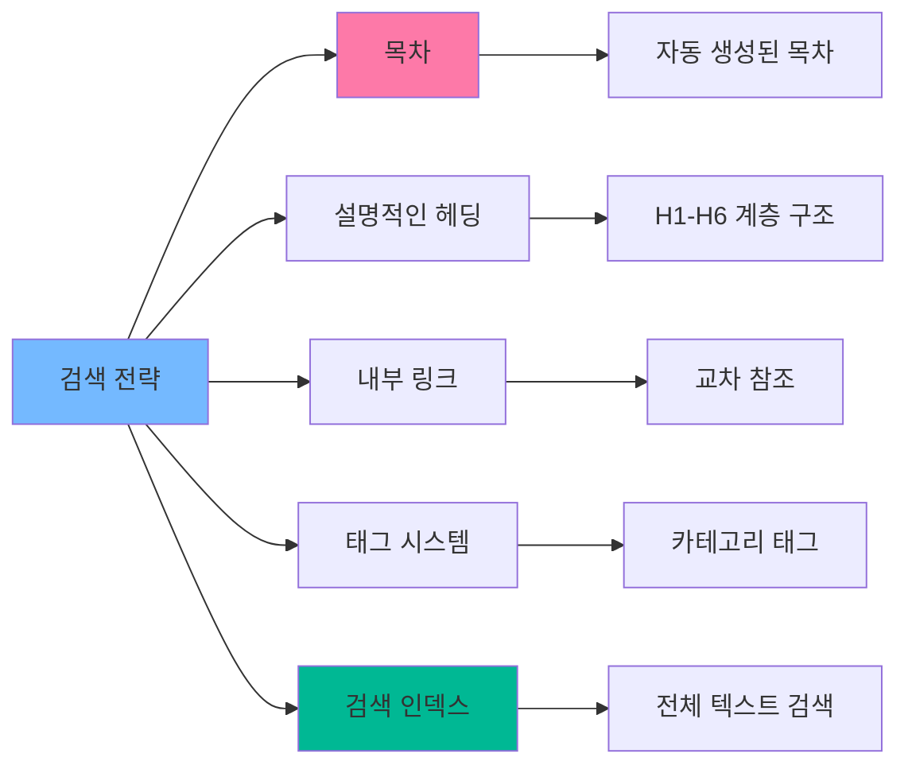

**🔍 검색 가능성 기능**:
- **목차**: 클릭 가능한 링크가 있는 자동 생성
- **섹션 요약**: 빠른 스캔을 위한 간략한 개요
- **관련 링크**: "참조" 섹션
- **태그 시스템**: 필터링을 위한 분류
- **용어집**: 알파벳순 용어 정의

**📊 검색 최적화 체크리스트**:
- [ ] 설명적인 페이지 제목 및 헤딩
- [ ] 클릭 가능한 링크가 있는 목차
- [ ] 내부 교차 참조
- [ ] 태그 또는 카테고리 시스템
- [ ] 검색 친화적인 URL 구조

---

### 10. 🤝 **협업 프레임워크**
> **목표**: 커뮤니티 기여 및 지속적인 개선 촉진

#### 👥 협업 기능:
- **댓글 시스템**: 독자 피드백 및 토론 허용
- **기여 지침**: 개선 사항 제출 프로세스 명확히 하기
- **버전 관리**: 변경 사항 추적 및 편집 이력 유지
- **커뮤니티 구축**: 포럼, 토론 게시판 또는 채팅 채널

#### 🔄 협업 워크플로우:
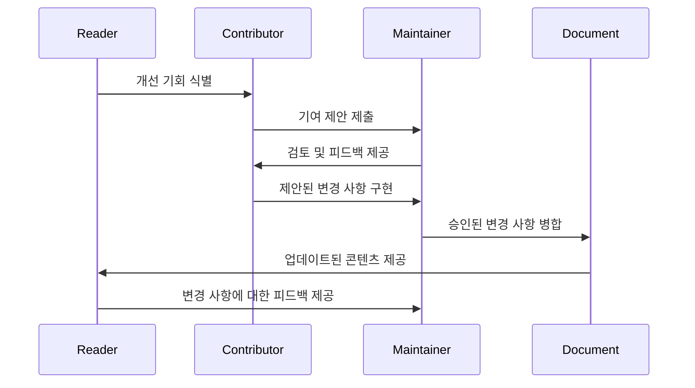

**🛠️ 협업 도구**:
- **GitHub Issues**: 버그 보고 및 기능 요청
- **Pull Requests**: 코드/콘텐츠 기여
- **토론 포럼**: 커뮤니티 Q&A
- **피드백 양식**: 구조화된 사용자 입력
- **버전 기록**: 변경 사항 추적 및 롤백

**📝 기여 지침 템플릿**:
```markdown
## 기여 방법
1. **문제 보고**: 버그/개선 사항에 대해 GitHub 이슈 사용
2. **변경 제안**: 포크 → 편집 → 풀 리퀘스트
3. **스타일 가이드**: 정해진 서식 규칙 준수
4. **검토 프로세스**: 모든 변경 사항은 병합 전에 검토됨
```

---

### 11. 📚 **정보 강화**
> **목표**: 포괄적인 자료 및 신뢰할 수 있는 참고 문헌 제공

#### 🎓 자료 범주:
- **1차 출처**: 공식 문서, 연구 논문
- **자습서**: 단계별 가이드 및 워크스루  
- **관련 독서**: 책, 기사 및 블로그 게시물
- **도구 및 소프트웨어**: 추천 애플리케이션 및 유틸리티
- **커뮤니티 자료**: 포럼, 그룹 및 전문가 네트워크

#### 📖 참고 문헌 관리:
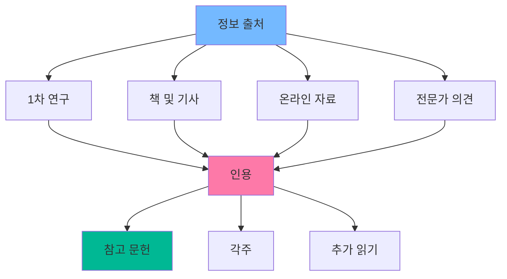

**📋 자료 통합 방법**:
- **인라인 인용**: `[1]` 참조 번호
- **각주**: 페이지 하단의 상세 출처 정보
- **추가 읽기**: 관련 자료의 선별된 목록
- **외부 링크**: 권위 있는 출처로의 직접 링크
- **자료 상자**: 추가 자료 강조

**🔗 자료 섹션 예시**:
```markdown
## 📚 추가 자료

### 책
- [제목] 저자 (연도) - 간단한 설명
- [제목] 저자 (연도) - 간단한 설명

### 온라인 자료  
- [웹사이트 이름](URL) - 설명
- [문서화](URL) - 공식 가이드

### 도구
- [도구 이름](URL) - 목적 및 이점
```

---

### 12. 👤 **사용자 중심 설계**
> **목표**: 직관적이고 사용자 친화적인 문서 경험 생성

#### 🎯 사용자 경험 원칙:
- **직관적인 탐색**: 논리적인 메뉴 구조 및 빵 부스러기
- **명확한 행동 촉구**: 명백한 다음 단계 및 경로
- **반응형 디자인**: 모든 장치 및 화면 크기에서 잘 작동
- **빠른 로딩**: 최적화된 이미지 및 효율적인 코드

#### 🚀 사용자 여정 최적화:
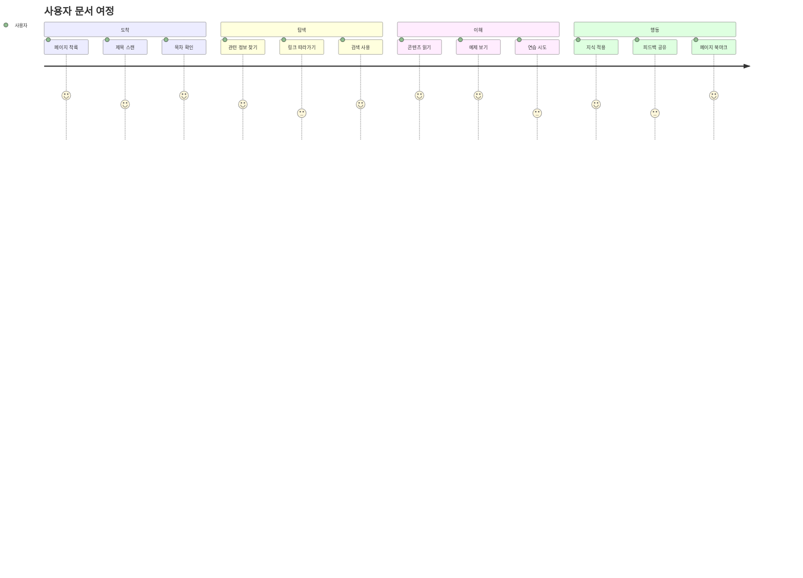

**🎨 UX 디자인 요소**:
- **점진적 공개**: 필요할 때 세부정보 표시
- **시각적 계층 구조**: 중요한 콘텐츠로 주의 안내
- **일관된 패턴**: 익숙한 상호작용 및 레이아웃
- **오류 예방**: 명확한 지침 및 예제
- **피드백 메커니즘**: 성공 메시지 및 진행 상황 표시기

**📱 모바일 우선 고려 사항**:
- 확대 없이 읽을 수 있는 텍스트
- 터치 친화적인 버튼 및 링크
- 더 나은 모바일 탐색을 위한 접이식 섹션
- 느린 네트워크에서도 빠른 로딩 시간

**✅ 사용자 친화적 체크리스트**:
- [ ] 명확한 탐색 빵 부스러기
- [ ] 명확한 행동 촉구 버튼
- [ ] 모바일 반응형 디자인
- [ ] 빠른 페이지 로딩 시간
- [ ] 사용하기 쉬운 검색 기능

---

### 13. 🔍 **품질 보증 프로세스**
> **목표**: 체계적인 검토 및 지속적인 개선을 통해 우수성 보장

#### 🎯 다단계 검토 프로세스:
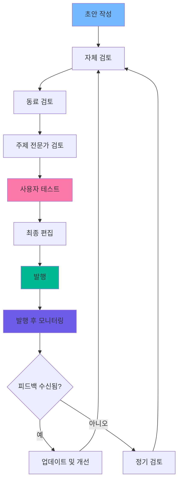

#### 📋 검토 체크리스트 범주:

| 범주 | 주요 항목 | 도구 |
|----------|-----------|-------|
| **콘텐츠** | 정확성, 완전성, 관련성 | 사실 확인, 전문가 검토 |
| **구조** | 논리적 흐름, 명확한 섹션, 목차 | 개요 검토, 탐색 테스트 |
| **언어** | 명확성, 톤, 문법 | Grammarly, 가독성 도구 |
| **접근성** | 대체 텍스트, 대비, 스크린 리더 | WAVE, 색상 대비 분석기 |
| **시각적** | 이미지, 다이어그램, 서식 | 디자인 검토, 교차 브라우저 테스트 |

#### 🔄 지속적인 개선 주기:
1. **사용량 모니터링**: 분석 및 사용자 행동
2. **피드백 수집**: 설문조사, 댓글, 지원 티켓  
3. **패턴 식별**: 일반적인 질문 또는 문제
4. **업데이트 계획**: 우선 순위 개선 사항
5. **변경 사항 구현**: 체계적으로 콘텐츠 업데이트
6. **영향 측정**: 개선 메트릭 추적

**⏰ 검토 일정 권장 사항**:
- **매일**: 긴급한 문제 또는 피드백 모니터링
- **매주**: 최근 변경 사항 및 사용자 댓글 검토
- **매월**: 포괄적인 콘텐츠 감사
- **분기별**: 전략적 검토 및 주요 업데이트
- **연간**: 전체 문서 개편

---

## 🔧 구현 지침

### 🚀 시작하기

#### 1단계: 평가 (1주차)
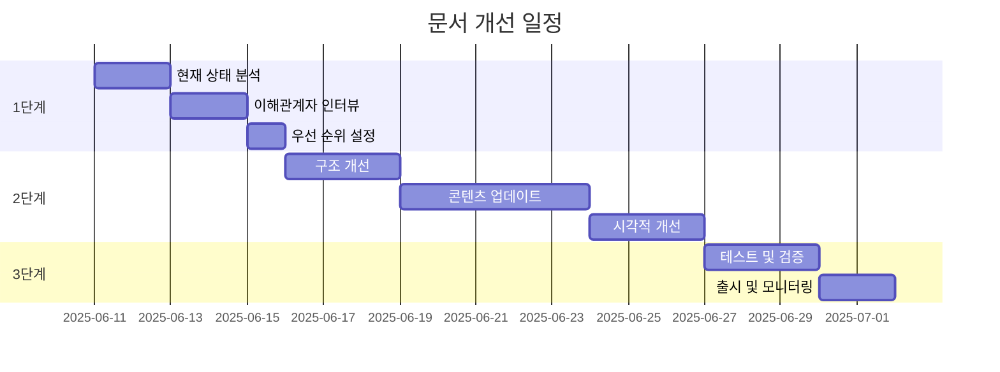

#### 평가 프레임워크:
1. **현재 상태 분석**: 기존 문서 평가
2. **격차 식별**: 13가지 원칙과 비교
3. **영향 평가**: 높은 가치의 개선 사항 우선 순위 지정
4. **자원 계획**: 필요한 시간 및 도구 할당
5. **성공 메트릭**: 측정 가능한 목표 정의

### 📊 진행 상황 추적

#### 문서 품질 스코어카드:
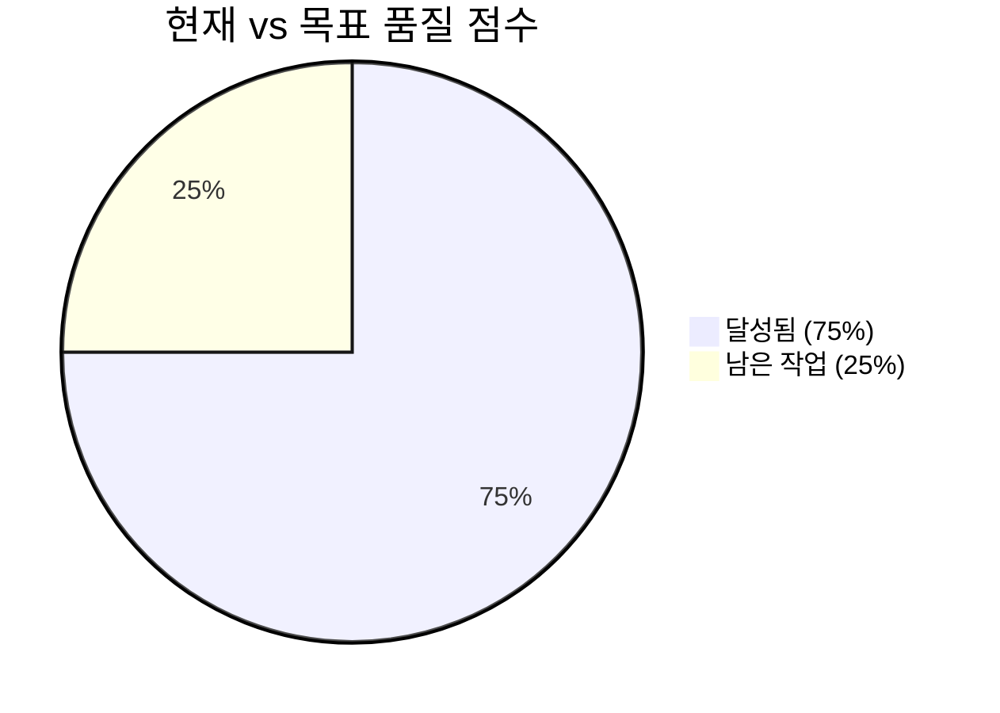

| 원칙 | 현재 점수 | 목표 점수 | 우선 순위 |
|-----------|---------------|--------------|----------|
| 시각적 우수성 | 6/10 | 9/10 | 높음 |
| 구조 | 8/10 | 9/10 | 중간 |
| 정확성 | 7/10 | 10/10 | 높음 |
| 완전성 | 5/10 | 9/10 | 높음 |
| 가독성 | 7/10 | 9/10 | 중간 |

---

## ✅ 품질 보증 체크리스트

### 📝 발행 전 체크리스트

#### 콘텐츠 품질
- [ ] **시각적**: 다이어그램이 이해를 돕고 적절하게 레이블이 붙어 있음
- [ ] **구조**: 섹션 간의 명확한 계층 및 논리적 흐름
- [ ] **정확성**: 사실 확인 및 출처 인용
- [ ] **완전성**: 정보 누락 또는 단계 누락 없음
- [ ] **가독성**: 대상 독자에게 적합한 명확하고 간결한 언어

#### 기술적 품질  
- [ ] **참여도**: 상호작용 요소 및 예제가 포함됨
- [ ] **접근성**: WCAG 2.1 AA 준수 확인
- [ ] **일관성**: 전체적으로 스타일 가이드 준수
- [ ] **검색 가능성**: 적절한 헤딩 및 키워드로 SEO 최적화
- [ ] **협업 가능성**: 피드백 메커니즘 및 기여 지침 마련

#### 사용자 경험
- [ ] **정보 제공**: 참조 및 추가 자료 제공
- [ ] **사용자 친화성**: 탐색이 직관적이고 모바일 반응형임
- [ ] **품질 보증**: 다단계 검토 프로세스 완료

### 🎯 성공 메트릭

#### 정량적 메트릭:
- **사용자 참여**: 
  - 페이지 체류 시간: 목표 3분 이상
  - 이탈률: 목표 <40%
  - 재방문율: 목표 25% 이상
- **작업 완료**: 
  - 사용자가 의도한 작업을 성공적으로 완료: 목표 80% 이상
- **접근성**: 
  - WCAG 준수 점수: 목표 95% 이상
  - 스크린 리더 호환성: 목표 100%

#### 정성적 메트릭:
- **만족도 점수**: 사용자 피드백에서 목표 4.5/5
- **콘텐츠 품질**: 전문가 검토 등급
- **사용성**: 사용자 테스트 피드백

---

## 📚 추가 자료

### 🛠️ 필수 도구

#### 콘텐츠 생성
- **Mermaid**: 다이어그램 생성 ([mermaid.js.org](https://mermaid.js.org))
- **Figma**: 디자인 및 프로토타이핑 ([figma.com](https://figma.com))
- **Canva**: 시각적 콘텐츠 생성 ([canva.com](https://canva.com))

#### 품질 보증
- **WAVE**: 접근성 테스트 ([wave.webaim.org](https://wave.webaim.org))
- **Grammarly**: 글쓰기 보조 ([grammarly.com](https://grammarly.com))
- **Hemingway**: 가독성 분석 ([hemingwayapp.com](https://hemingwayapp.com))
- **Lighthouse**: 성능 및 접근성 감사

#### 분석 및 피드백
- **Google Analytics**: 사용자 행동 추적
- **Hotjar**: 히트맵 및 사용자 녹화
- **Typeform**: 피드백 수집
- **GitHub**: 버전 관리 및 협업

### 📖 추가 읽기

#### 스타일 가이드
- [Microsoft Style Guide](https://docs.microsoft.com/style-guide/) - 포괄적인 글쓰기 기준
- [Google Developer Documentation Style Guide](https://developers.google.com/style) - 기술 문서 작성 모범 사례
- [Atlassian Design System](https://atlassian.design/) - 컴포넌트 및 패턴 라이브러리

#### 접근성 자료
- [WCAG 2.1 Guidelines](https://www.w3.org/WAI/WCAG21/quickref/) - 웹 접근성 기준
- [WebAIM](https://webaim.org/) - 접근성 평가 및 교육
- [A11y Project](https://www.a11yproject.com/) - 커뮤니티 주도의 접근성 자료

### 🎓 교육 자료

#### 온라인 과정
- **기술 문서 작성**: 
  - Google 기술 문서 작성 과정 (무료)
  - Coursera 기술 문서 작성 전문화 과정
  - edX 전문 글쓰기 과정
- **UX 글쓰기**: 
  - UX Writing Hub 과정
  - Designlab UX Writing 과정
- **접근성**: 
  - WebAIM 교육 프로그램
  - Deque University 과정

#### 인증
- **기술 문서 작성**: 기술 커뮤니케이션 협회 (STC)
- **접근성**: 국제 접근성 전문가 협회 (IAAP)
- **콘텐츠 전략**: 콘텐츠 마케팅 연구소

---

## 🎓 모범 사례 예시

### 📋 변환 전후 예시

#### ❌ 변환 전: 불완전한 문서 예시
```markdown
## 설정

소프트웨어를 설치합니다. 설정을 구성합니다. 프로그램을 실행합니다.

요구 사항:
- Node.js
- 데이터베이스
```

#### ✅ 변환 후: 향상된 문서 예시
```markdown
## 🚀 빠른 시작 설정 가이드

10분 이내에 애플리케이션을 실행하기 위한 간단한 단계입니다.

### 📋 필수 조건 확인 목록
시작하기 전에 다음이 있는지 확인하세요:
- [ ] **Node.js** v16+ ([여기에서 다운로드](https://nodejs.org/))
- [ ] **PostgreSQL** v12+ ([설치 가이드](link))
- [ ] **Git** ([설정 지침](link))

### 🔧 설치 단계

1. **저장소 복제**
   ```bash
   git clone https://github.com/your-repo/project.git
   cd project
   ```

2. **종속성 설치**
   ```bash
   npm install
   ```

3. **환경 구성**
   ```bash
   cp .env.example .env
   # 데이터베이스 자격 증명으로 .env 편집
   ```

4. **애플리케이션 시작**
   ```bash
   npm start
   ```

### ✅ 검증
이제 애플리케이션이 `http://localhost:3000`에서 실행되고 있어야 합니다.

> 💡 **문제가 발생하나요?** [문제 해결 가이드](link)를 확인하거나 [지원팀에 문의](link)하세요.
```

### 🎨 시각적 개선 예시

#### Mermaid 다이어그램 템플릿

**프로세스 흐름:**
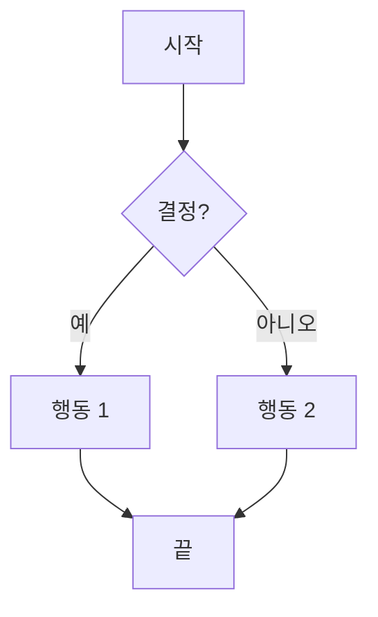

**사용자 여정:**
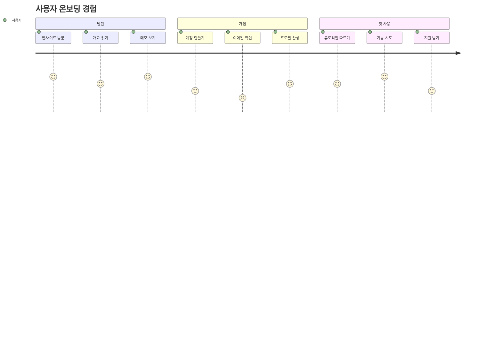

---

## 🚀 실행 계획 템플릿

### 📅 30일 실행 계획

#### 1주차: 기초
- [ ] **1-2일차**: 현재 문서 품질 평가
- [ ] **3-4일차**: 상위 3개 개선 사항 식별  
- [ ] **5-7일차**: 도구 설정 및 스타일 가이드 수립

#### 2주차: 구조 및 콘텐츠
- [ ] **8-10일차**: 콘텐츠 구조 및 탐색 재구성
- [ ] **11-12일차**: 헤딩 업데이트 및 목차 생성
- [ ] **13-14일차**: 시각적 요소 및 다이어그램 추가

#### 3주차: 개선
- [ ] **15-17일차**: 가독성 향상 및 예제 추가
- [ ] **18-19일차**: 접근성 준수 확인
- [ ] **20-21일차**: 상호작용 요소 및 행동 촉구 추가

#### 4주차: 품질 및 출시
- [ ] **22-24일차**: 종합 검토 및 테스트
- [ ] **25-26일차**: 피드백 수집 및 최종 조정
- [ ] **27-28일차**: 개선된 문서 출시
- [ ] **29-30일차**: 사용량 모니터링 및 초기 피드백 수집

### 📊 진행 상황 추적 템플릿

| 메트릭 | 기준선 | 목표 | 현재 | 상태 |
|--------|----------|---------|---------|---------|
| 페이지 조회수 | 1000/월 | 1500/월 | - | 🔄 진행 중 |
| 페이지 체류 시간 | 1:30 | 3:00 | - | 📅 계획됨 |
| 사용자 만족도 | 3.2/5 | 4.5/5 | - | 📅 계획됨 |
| 접근성 점수 | 65% | 95% | - | 🔄 진행 중 |

### 🎯 성공 축하 이정표

- **🏆 빠른 승리**: 첫 번째 시각적 다이어그램 추가
- **🏆 주요 진행**: 50% 원칙 구현  
- **🏆 성과 달성**: 모든 접근성 요구 사항 충족
- **🏆 우수성**: 사용자 만족도 >4.5/5
- **🏆 숙련도**: 문서가 회사 표준이 됨

---

> 💡 **최종 알림**: 훌륭한 문서는 결코 완성되지 않습니다. 사용자의 요구와 피드백에 따라 진화합니다. 기본 사항부터 시작하여 체계적으로 구현하고 실제 사용 패턴 및 사용자 피드백에 따라 지속적으로 개선하세요.

> 🚀 **문서 변환할 준비가 되셨나요?** 이 가이드를 사용하여 사용자가 사랑하고 실제로 사용할 뛰어난 콘텐츠를 만드는 로드맵으로 삼으세요!
