# 📚 Database Systems Comprehensive Guide
*A Complete Reference for Database Design, Implementation, and Management*

   

---

## 📖 Table of Contents

1. [📊 Database Storage and Indexing](#database-storage-and-indexing)
2. [🏗️ Relational Database Design](#relational-database-design)
3. [🔐 Transaction Management](#transaction-management)
4. [🔧 Advanced SQL Operations](#advanced-sql-operations)
5. [🌐 Application Development](#application-development)
6. [⚙️ MySQL-Specific Features](#mysql-specific-features)
7. [📝 Summary Notes](#summary-notes)

---

## 🎯 Learning Objectives

By the end of this guide, you will be able to:

✅ Design efficient database storage structures using indexes and hashing  
✅ Apply normalization principles to create well-designed database schemas  
✅ Implement transaction management with ACID properties  
✅ Write complex SQL queries with joins, views, and constraints  
✅ Develop database-driven applications with proper security measures  
✅ Understand MySQL-specific syntax and optimization techniques  

---

## 📋 Document Overview

This comprehensive guide covers seven fundamental areas of database systems:

```mermaid
graph TD
    A[Database Systems] --> B[Storage & Indexing]
    A --> C[Database Design]
    A --> D[Transaction Management]
    A --> E[Advanced SQL]
    A --> F[Application Development]
    A --> G[MySQL Features]
    A --> H[Summary & Notes]
    
    B --> B1[Index Types]
    B --> B2[Hashing Techniques]
    B --> B3[B+ Trees]
    
    C --> C1[Normalization]
    C --> C2[Functional Dependencies]
    C --> C3[BCNF & 3NF]
    
    D --> D1[ACID Properties]
    D --> D2[Concurrency Control]
    D --> D3[Serializability]
    
    E --> E1[Joins]
    E --> E2[Views]
    E --> E3[Permissions]
    
    F --> F1[Web Applications]
    F --> F2[Security]
    F --> F3[Performance]
    
    G --> G1[Syntax Rules]
    G --> G2[Character Sets]
    G --> G3[Case Sensitivity]
```

---
1. Ch11 Index and Hash (인덱스와 해싱)
이 챕터는 데이터베이스에서 저장된 데이터를 빠르게 찾는 방법에 대해 다룹니다
. 마치 도서관에서 책을 찾을 때 모든 책장을 뒤지는 대신 도서 색인 번호를 이용하는 것과 같은 원리입니다. 데이터베이스 질의(쿼리)는 대개 데이터의 아주 일부분만을 참조하기 때문에, 이러한 인덱싱(Indexing) 메커니즘을 이용하면 필요한 데이터에 빠르게 접근할 수 있습니다
.
•
Search Key (검색 키): 저장된 레코드를 찾는데 사용하는 속성(attribute)들입니다
.
•
Index File (인덱스 파일): 인덱스 파일은 원래의 데이터 파일보다 훨씬 작습니다
. 인덱스 파일은 일반적으로 검색 키와 해당 레코드로의 포인터 형태로 구성됩니다
.
인덱스의 두 가지 기본 개념
:
1.
Ordered Index (순서 인덱스): 검색 키 값에 의해 정렬된 순서로 저장됩니다
.
2.
Hash Index (해시 인덱스): 버켓(bucket)의 범위 안에서 일정하게 분배되며, 해시 함수를 이용합니다
. (여기서 말하는 Key는 Primary Key, Candidate Key 등과는 다른 개념입니다
.)
인덱스 기술의 평가 지표 (Metric)
:
•
액세스 시간 (Access Time): 데이터를 찾는데 걸리는 시간입니다
.
•
삽입 시간 (Insertion Time): 새로운 데이터를 삽입하고 인덱스 구조를 갱신하는데 걸리는 시간입니다
.
•
삭제 시간 (Deletion Time): 데이터를 삭제하고 인덱스 구조를 갱신하는데 걸리는 시간입니다
.
•
공간 부담 (Space Overhead): 인덱스를 유지하기 위해 추가적으로 필요한 저장 공간입니다
.
순서 인덱스 기법
: Search Key 값에 따라 레코드들이 정렬되어 저장됩니다
.
•
Primary Index (주 인덱스): 데이터 파일 자체가 search-key에 따라 물리적으로 연속적인 순서로 저장되어 있는 인덱스입니다
. 'Clustering Index (클러스터링 인덱스)'라고도 부릅니다. Search key는 일반적으로 Primary Key이지만 반드시 Primary Key여야 하는 것은 아닙니다. 테이블 당 하나만 생성 가능합니다. Primary Key를 설정하는 순간 주 인덱스로 사용됩니다 (저장 순서가 PK에 의해 정렬됨)
.
•
Secondary Index (2차 인덱스): 데이터 파일의 물리적인 저장 순서와는 별개로 구성되는 검색 키의 인덱스입니다
. 'Non-clustering Index'라고도 부릅니다. Unique 옵션을 설정하면 2차 인덱스로 지정될 수 있습니다 (Primary Key가 아니어도 가능하며, null을 허용하기 때문). Not null이 포함되면 클러스터링 인덱스로 활용 가능합니다. 외래키(Foreign Key) 또한 인덱스로 지정될 수 있습니다
.
Dense Index (밀집 인덱스)
: 레코드들의 모든 검색 키 값에 대한 인덱스 엔트리가 존재합니다. 예시: ID 속성을 이용한 인덱스. Dept_name을 이용한 dense index 예시도 있습니다. 밀집 인덱스는 항상 2차 인덱스이며 (정렬되지 않음), 반드시 간접 참조(indirect reference)여야 합니다
.
•
간접 참조 이유: 인덱스 파일은 검색 키와 레코드의 위치를 가리키는 포인터로 구성됩니다. 레코드의 물리적 위치가 변경될 수 있으므로, 인덱스가 직접 레코드를 가리키기보다는 해당 레코드가 저장된 블록이나 다른 중간 구조를 가리키는 간접 참조 방식이 효율적입니다. 소스에는 "반드시 간접참조여야 함 (why?)"라고만 되어 있고 직접적인 이유는 명시되지 않았으나, 일반적으로는 데이터 이동 시 인덱스 갱신 부하를 줄이기 위함입니다.
•
밀집 인덱스 이유: 소스에는 "반드시 밀집 인덱스여야 함 (why?)"라고만 되어 있고 직접적인 이유는 명시되지 않았습니다. 사실 밀집 인덱스는 1차 인덱스에도 사용될 수 있으며 (모든 검색 키 값에 대해 인덱스 엔트리를 가짐), 2차 인덱스에서는 항상 밀집 인덱스만 가능합니다. 이는 2차 인덱스는 파일의 물리적 순서와 무관하므로 특정 검색 키 값의 위치를 찾기 위해 해당 값의 모든 인덱스 엔트리가 필요하기 때문입니다.
Sparse Index (희소 인덱스)
: 몇 개의 search-key 값에 대해서만 인덱스가 존재합니다. Search key에 대해 순차적으로 저장된 경우에만 사용 가능합니다 (즉, 클러스터링 인덱스인 경우에만). Search-key의 값이 K인 경우, K보다 작거나 같으며 그 중에서 가장 큰 search-key의 인덱스를 활용하여 해당 위치부터 순차적으로 탐색합니다. 예시: ID 58583을 찾을 때, 32343 인덱스를 이용해 32343부터 순차 탐색
.
•
밀집 인덱스와 비교: 희소 인덱스는 인덱스를 위한 공간이 더 적고, 삽입 및 삭제 시 부하가 적습니다
. 하지만 검색 시에는 밀집 인덱스보다 느립니다. 좋은 절충안은 모든 블록에 대해 하나의 인덱스를 가지는 희소 인덱스를 만드는 것입니다 (메모리로 가져오는 비용 고려)
.
인덱스의 갱신 (Insertion and Deletion)
: 데이터의 갱신(삽입, 삭제)은 인덱스의 수정을 발생시키며, 이로 인해 데이터베이스에 부하가 발생합니다. 데이터 삽입 혹은 삭제에 따라 모든 레벨의 인덱스는 갱신되어야 합니다
.
•
삭제 시: 삭제되는 레코드가 특정 search-key 값이 가리키는 유일한 값이라면 search-key 또한 삭제되어야 합니다
.
◦
밀집 인덱스: 유일한 값이라면 인덱스 엔트리 삭제
. 유일하지 않다면 인덱스 엔트리가 다음 레코드를 가리키도록 갱신
.
◦
희소 인덱스: 만약 인덱스가 search-key 값을 가지는 레코드를 포함하지 않는다면 추가 동작이 없습니다
. 삭제된 레코드가 그 search-key에 대한 유일한 레코드라면 다음 키 검색을 위한 레코드로 교체합니다. 다음 키가 이미 인덱스 엔트리에 있는 경우에는 삭제됩니다. 삭제된 레코드가 search-key에 해당하는 유일한 레코드가 아니라면, 해당 key가 다음 레코드를 가리키도록 갱신됩니다. (58583, 15151, 22222 삭제 예시 언급
)
•
삽입 시: 삽입되는 레코드의 search-key 값을 이용해서 먼저 찾기를 수행합니다
.
◦
밀집 인덱스: 해당 값이 없다면 적절한 위치에 삽입합니다
.
◦
희소 인덱스: 인덱스는 각 블록에 대한 첫 번째 키 값을 저장합니다
. 새로운 블록을 만들게 되는 경우 엔트리가 갱신됩니다. (67523, Digital Media, Physics 삽입 예시 언급
)
B+ 트리 (B+ Tree)
: 기존의 순차적 저장 방식에 대한 대안으로 제시되며, 현재 광범위하게 사용되고 있습니다
.
•
순차적 인덱스의 단점: 파일이 커질수록 검색 성능이 저하되며
, 주기적으로 전체 파일을 재구성해야 합니다
.
•
B+ 트리 장점: 삽입과 갱신 시 파일의 재구성이 매우 작고, 지엽적이며
, 전체 파일 재구성이 필요 없습니다
.
•
B+ 트리 단점: 삽입, 갱신 시 연산 성능과 저장 공간에 부담이 생깁니다
.
•
B+ 트리 특징: Root에서 leaf까지의 경로는 같은 길이를 가집니다 (균형 트리 - Balanced tree)
. Root가 아닌 노드와 Root 노드 (자식이 있을 경우)는 n/2 에서 n개의 자식을 가집니다. Leaf node는 (n–1)/2 에서 n–1 개의 값을 가집니다 (여기서 n은 트리의 고정된 값입니다). (B+ 트리에서의 삭제, 삽입, 동일 값 탐색은 생략되었습니다
).
•
인덱스가 커서 메모리에 한번에 적재하기 힘들다면 연산 비용이 증가하는데
, 이를 해결하기 위해 주 인덱스를 순서대로 저장된 것으로 취급하고 이를 위한 희소 인덱스를 구성할 수 있습니다. 이것을 주 인덱스를 위한 외부 인덱스라고 합니다. 주 인덱스 파일 자체는 내부 인덱스라고 합니다
.
해싱 (Hashing)
: 해싱 기술은 인덱스 구조 없이 적절한 Hash 함수를 이용하여 데이터 위치에 직접 액세스 가능하도록 하는 방법입니다. 기존 순차 파일 구조에서 인덱스를 이용하려면 인덱스나 트리에 접근해야 하는데, 이는 입출력(I/O) 연산을 유발합니다
. 해싱은 이러한 추가 접근 없이 빠른 탐색을 목표로 합니다.
•
해시 함수 (Hash Function): 임의 길이 데이터를 고정 길이 데이터로 매핑하는 함수입니다
. 예시: MD5, SHA
.
•
버켓 (Bucket): 한 개 또는 다수의 레코드를 저장하는 공간 단위입니다
.
•
해시 파일 구조: 해시 함수를 이용하여 레코드의 search-key 값을 해당하는 bucket 주소 B로 대응시킵니다
. 예시: Dept_name을 key로 사용하는 instructor 레코드 저장 시, 총 10개의 bucket 생성. 예시 해시 함수: 각 i번째 글자에 i값을 대응하고 modulo 10 적용. h(Music)=1, h(History)=2, h(Physics)=3, h(Elec. Eng.)=3
.
•
이상적인 해시 함수: Uniform (균등 분포)의 결과를 보이는 함수입니다
. Random (무작위)하게 각 bucket에 레코드를 할당하여 검색 키 값 분포와 관계없이 동일한 레코드 수를 유지합니다
.
•
최악의 해시 함수: search-key 값을 하나의 bucket으로만 대응시키는 함수입니다
. 이 경우 액세스 시간이 키 값 수에 비례하게 되어 해싱의 이점을 잃습니다
.
•
Bucket Overflow (버켓 오버플로우): 버켓이 레코드를 저장할 공간이 부족한 경우입니다
.
◦
원인: 해시 함수 결과의 Skew (치우침) 발생 (많은 레코드가 같은 search-key를 가지거나, 선택된 해시 함수가 검색 키를 균등하게 분배하지 못하는 경우)
. 최대한 이상적인 설계를 해도 오버플로우는 발생할 수 있습니다
.
◦
해결: Overflow Chaining은 오버플로우 버켓을 링크드 리스트로 연결하여 사용합니다
. 이러한 구조를 Closed-hashing이라고 합니다
.
해시 인덱스 (Hash Index)
: 해싱은 파일 구조뿐만 아니라 인덱스 구조 생성에도 사용됩니다. search-key와 포인터를 구성하는 방식입니다. 해시 인덱스는 항상 2차 인덱스입니다 (non-clustered index: 정렬되지 않음). 파일 자체가 해싱을 사용하여 구성된 경우에는 별도의 해시 인덱스가 필요하지 않습니다
.
정적 해싱 (Static Hashing)의 문제점
: 정적 해싱에서 함수 h는 search-key 값을 고정된 버켓 집합 B에 대응시킵니다. 문제는 데이터베이스가 시간이 지나면서 늘어나거나 줄어든다는 것입니다. 초기 버켓 수가 너무 적으면 파일이 커질 때 오버플로우 버켓이 많아져 성능이 저하됩니다. 증가를 예상하여 공간을 할당하면 초기 공간 낭비가 심하고, 데이터베이스가 축소되어도 공간이 낭비됩니다
.
•
해결 방법: 주기적으로 새로운 해시 함수를 적용하는 방법이 있지만, 비용이 비싸고 일반 연산에 방해가 됩니다
. 더 나은 방법은 버켓 수가 동적으로 수정되도록 하는 **동적 해싱 (Dynamic Hashing)**입니다. Extendable Hashing이 있지만 실제로는 잘 사용되지 않는다고 언급됩니다
.
인덱스 선택 고려사항 (제한된 저장공간, 적은 데이터 변화)
: 저장공간이 매우 부족하고 데이터 변화(삽입, 삭제)가 적은 상황에서는 희소 인덱스가 가급적 권장됩니다. B+ 트리 인덱스나 밀집 인덱스는 상대적으로 공간 낭비가 더 심할 수 있습니다
.
기타 개념
:
•
NoSQL (Not Only SQL): 관계형 데이터베이스와 SQL이 항상 답은 아니며
, 최근의 비 관계형 DB를 칭하는 용어입니다 (정확한 정의는 아님, 시스템별 차이 큼). 대표 시스템: Cassandra, Hadoop, Hbase 등. 관계형 DB의 단점 (유연하지 못한 구조, 확장성 부족)을 극복하기 위해 등장했으며, Schema-less, 분산 처리에 특화되어 있습니다. 주요 모델: Key-value, Document, Column-family, Graph
.
•
Data Clustering (데이터 클러스터링): 개체(주로 데이터)들을 유사한 것들끼리 그룹화하는 과정입니다
. 알고리즘에 따라 결과가 다르며 정확한 정의는 어렵습니다
.
•
Information Retrieval (정보 검색): 검색 엔진은 DB와는 완전히 다른 분야이며
, 자연어 처리 및 단어 간 관계성 분석/처리가 핵심입니다
.
2. Ch8 RDB design (관계형 데이터베이스 설계)
이 챕터는 관계형 데이터베이스 설계의 중요성, 특히 **정규화 (Normalization)**의 개념과 필요성에 대해 다룹니다
. 함수 종속성(Functional Dependency)을 기반으로 하는 정규형(Normal Form)과 정규화 방법을 학습합니다
.
좋은 스키마란 무엇인가?
: 스키마 설계가 좋지 않으면 여러 문제가 발생합니다
.
•
정보의 중복 저장: 저장 공간 낭비를 초래합니다
. 교수 정보와 학과 정보를 결합한 스키마에서 학과 정보(건물, 예산)가 반복되는 예시
.
•
까다로운 정보 수정: 일관성을 주의해야 합니다 (학과 예산 수정 시 모든 중복된 데이터를 수정해야 함)
.
•
까다로운 추가 정보 삽입: NULL 값을 사용해야 하는 경우가 발생합니다 (예: 아직 교수가 없는 학과)
.
이러한 문제를 해결하기 위해 스키마를 여러 개의 릴레이션으로 **분해 (Decompose)**합니다
. 예를 들어, inst_dept 스키마를 instructor와 department 두 개로 나누는 것. inst_dept에서 학과 이름이 Candidate Key가 아니기 때문에 건물과 예산이 반복되는 것이며, 이는 분해되어야 함을 시사합니다
.
이상 현상 (Anomaly)
: 잘못된 스키마 설계로 인해 발생하는 문제입니다
.
•
삭제 이상 (Delete Anomaly): 어떤 정보를 삭제할 때, 그 정보와 관련된 다른 유용한 정보까지 함께 소실되는 경우입니다
. 예시: 학생이 수강 취소 시 해당 강의실 정보까지 소실됨
.
•
삽입 이상 (Insert Anomaly): 특정 정보를 삽입하기 위해 아직 존재하지 않는 다른 정보에 대해 NULL 값을 강제로 사용해야 하는 경우입니다
. 예시: 수강 신청하지 않은 학생 정보를 넣을 때 강의/강의실 정보가 없어 NULL 사용
.
•
수정 이상 (Update Anomaly): 중복된 정보 중 일부만 수정되어 데이터 일관성이 깨지는 경우입니다
. 예시: 강의실 변경 시 여러 레코드를 전부 수정해야 함
.
정규화 (Normalization)
: 데이터베이스에서 이상 현상이 발생하지 않도록, 스키마를 분해하는 과정입니다. 스키마 설계가 중복이 발생하지 않고 문제가 없다면, 이는 우연인지 규칙인지 검증이 필요하며, 정규화 과정을 통해 설계를 검증하고 문제가 있다면 적절히 분해 또는 조합하여 좋은 스키마로 변환합니다
.
원자적 도메인 (Atomic Domain) 및 제 1 정규형 (First Normal Form, 1NF)
:
•
도메인 (Domain): 속성이 가질 수 있는 값의 집합입니다.
•
원자적 (Atomic): 도메인의 원소들이 나눌 수 없는 단위로 되어 있을 때 원자적이라고 합니다
. Non-atomic의 예시: 복합 속성, 집합 속성, 학수번호 CS101 (학과 정보가 내포되어 분리 가능하다면). 원자성은 경우에 따라 다르게 판별될 수 있습니다
.
•
제 1 정규형 (1NF): 릴레이션 스키마 R의 모든 속성의 도메인이 원자적일 때, R은 1NF라고 합니다
. 비-원자적인 값은 문제가 될 수 있습니다. 1NF 원문 정의: "intersection of each row and column one and only one value". 비-원자적 예시와 1NF로의 수정 예시 (이름-전화번호 테이블). 1NF는 다른 정규형에 앞서 각 속성 값이 원자성을 유지하도록 만드는 것입니다
.
정규화의 기반 이론:
•
함수적 종속 (Functional Dependency - FD):
•
다중값 종속 (Multivalued Dependency - MD): (이번 학기에 다루지 않음)
함수적 종속 (Functional Dependency - FD)
: 적합한(legal) 릴레이션들에 존재하는 제약조건입니다. 특정 속성 집합 의 값이 다른 속성 집합 의 값을 유일하게 결정하는 경우를 의미합니다. 만약 모든 적합한 릴레이션 인스턴스 r(R)의 어떤 두 튜플 t1, t2에 대해 t1[] = t2[] 이면 t1[] = t2[]를 만족한다면, 함수 종속    가 성립하며 이는 R에 'holds on (보존된다)'라고 표현합니다. 즉, 는 를 결정합니다
.
•
FD는 Key 개념을 일반화한 것입니다
.
•
예시: 주민번호  학과, 주민번호  이름은 성립하지만
, 학과  이름은 위 릴레이션 예시에서 보존되지 않습니다 (동일 학과에 여러 이름 존재 가능)
.
•
inst_dept (ID, name, salary, dept_name, building, budget)에서 dept_name  building과 ID  building은 보존되지만, dept_name  salary는 보존되지 않습니다
.
Superkey (슈퍼키) 와 Candidate Key (후보 키)
:
•
Superkey: K가 릴레이션 R에 대해 K  R 인 경우, K는 R의 슈퍼키입니다
. 즉, K의 값으로 R의 모든 속성 값을 유일하게 결정할 수 있습니다.
•
Candidate Key: K가 R의 후보 키인 경우는 K  R 이면서, K의 어떤 진부분집합  ⊂ K도   R 하지 않는 경우입니다
. 즉, 최소 슈퍼키입니다.
함수 종속성의 사용
:
•
릴레이션 인스턴스가 적합한지 검사합니다 (주어진 FD 집합 F를 만족하는지)
.
•
적합한 릴레이션들의 제약조건을 구체화합니다
.
•
주의: 특정 시점의 인스턴스들은 F에 없는 우연한 종속성(예: 현재 시점에 동명이인이 없어 name  ID)을 만족시킬 수 있지만
, 함수 종속성은 시점에 관계없이 해당 릴레이션의 모든 튜플에 대해 항상 유효해야 합니다
.
•
자명한 함수 종속성 (Trivial Functional Dependency): 함수 종속성    가 해당 릴레이션의 모든 인스턴스에 대해 성립할 때, 이를 자명하다고 표현합니다
. 일반적으로    일 때    는 자명합니다. 예시: ID, name  ID, name  name
.
정규화를 위한 필수 요소
:
1.
실제로 적용되는 함수 종속성을 확인하는 작업과 이를 위한 이론이 필요합니다
.
2.
실제 적용되는 FD를 기반으로 BCNF와 3NF 형태로 무손실 분해(Lossless Decomposition)를 수행하는 알고리즘이 필요합니다
.
3.
분해 후 종속성을 보존(Dependency Preservation)하는지 확인하는 알고리즘이 필요합니다
.
함수 종속성의 Closure (F+)
: 주어진 함수 종속성 집합 F에 대해, 논리적으로 함축되어 있는 다른 FD들이 존재할 수 있습니다. 예: A  B와 B  C가 F에 있으면 A  C도 성립. 실제 존재하는 모든 FD 집합은 주어진 F의 Closure (F+)입니다. F+는 F의 Superset입니다
.
•
Armstrong's Axioms (암스트롱의 공리): F+를 구하기 위한 규칙으로, Sound (정당함 - 실제 보존되는 FD만 생성)하고 Complete (완전함 - 보존되는 모든 FD 생성)합니다
.
◦
Reflexivity (반사의 공리):    이면    이다
.
◦
Augmentation (확대의 공리):    이면    이다
.
◦
Transitivity (이행의 공리):    이고    이면    이다
.
•
F+를 구하는 알고리즘은 Armstrong 공리를 반복 적용합니다
.
•
추가 규칙 (Armstrong 공리의 부수적 법칙): 합집합 (  ,    이면   ), 분해 (   이면   ,   ), 유사 이행적 (  ,    이면   )
.
속성 집합의 Closure (+)
: 주어진 속성 집합 에 대해, 그 Closure (+)는 에 의해 결정되는 모든 속성들의 집합입니다. F에서 +를 구하는 알고리즘은 로 시작하여 F에 있는 FD들을 이용해 결과 집합에 속성이 추가되지 않을 때까지 반복합니다. 예시: (AG)+ 계산 과정
.
BCNF (Boyce-Codd Normal Form)
: 릴레이션 스키마 R이 함수 종속성 집합 F의 F+에 속하는 모든 종속성    에 대해 다음 중 하나를 만족한다면 BCNF입니다
:
1.
  가 자명하다 (즉,   )
.
2.
는 R의 슈퍼키 이다
. 즉, BCNF에서는 결정자(determinant)는 자명하거나 슈퍼키여야 합니다
.
•
BCNF가 아닌 스키마 예시: instr_dept에서 dept_name  building, budget 종속성은 보존되지만 dept_name은 슈퍼키가 아니므로 BCNF 위반입니다
.
•
BCNF 예시: student (ID, name, dept_name, contact)에서 유일한 결정자는 ID(superkey)뿐입니다
.
BCNF 분해 알고리즘
: 현재 스키마 R에 BCNF를 위반하는 종속성    가 있다고 가정하면, R을 다음과 같이 분해할 수 있습니다
:
•
R1 = ( U )
•
R2 = (R – ( - )) 이때 결정자인 는 양쪽 릴레이션에 전부 포함됩니다
.
•
BCNF 위반 테스트: 자명하지 않은 종속성    가 BCNF를 위반하는지 확인하려면 +를 계산하고, 그 결과가 R의 모든 속성을 포함하는지 (즉, R의 슈퍼키인지) 확인합니다
. 포함하지 않으면 는 슈퍼키가 아니므로 위반입니다.
•
간략한 테스트: R 자체가 BCNF인지 확인 시 F에 존재하는 종속성들이 BCNF를 위반하는지 확인하는 것으로 충분합니다
. 만약 F의 모든 종속성이 BCNF를 위반하지 않으면 F+의 종속성들도 만족합니다. 그러나, R에서 분해된 릴레이션 Ri를 검사할 때는 F만을 이용한 간략한 검사는 부정확합니다. Ri가 BCNF인지 확인하려면 F+에 존재하는 종속성들 중 Ri 속성으로 구성된 종속성을 검사하거나, F를 사용해   Ri인 에 대해 +가 Ri - 의 속성을 포함하고 있지 않은지 확인해야 합니다
.
•
BCNF 분해 알고리즘 상세 과정
.
•
예시: '학번, 강의명, 교수' 테이블 분해
. FDs: (학번, 강의명)  교수, (학번, 교수)  강의명, 교수  강의명. 전제 조건: 학생은 복수 수강 가능, 교수는 한 개 강의만 담당, 동명이인 없음. 후보키: (학번, 강의명), (학번, 교수) ( implicitly based on FDs and assumptions). 교수  강의명에서 '교수'는 슈퍼키가 아니므로 BCNF 위반. 분해 결과: R1(교수, 강의명), R2(학번, 교수)
.
BCNF 분해와 종속성 보존 (Dependency Preservation)
: BCNF에 의한 분해가 항상 종속성을 보존하는 것은 아닙니다. 즉, 분해된 릴레이션들만으로는 원래 릴레이션에 존재했던 모든 함수 종속성을 확인할 수 없을 수 있으며, 조인 연산을 통해서만 확인할 수 있게 됩니다
.
•
예시: R=(J, K, L) F={JK  L, L  K}. 후보키 JK, JL. L  K는 BCNF 위반. 어떤 분해도 JK  L를 보존할 수 없습니다
. dept_advisor 예시에서도 BCNF 분해 시 s_ID, dept_name  i_ID 종속성이 보존되지 않습니다
.
•
모든 함수 종속성이 유지됨을 보장하기 위해서는 분해한 각 개별 릴레이션에 대한 종속성을 테스트하면 충분하며, 이 때 해당 분해를 **종속성을 보존한다 (preserving)**고 합니다
. 실제로 모든 함수 종속성을 포함한 제약조건을 확인하는 것은 비용이 많이 듭니다
.
3NF (Third Normal Form)
: BCNF와 종속성 보존을 항상 동시에 만족시킬 수 없기 때문에, 조금 더 관대한 정규형인 3NF를 고려할 필요가 있습니다. 특히 BCNF 정규화 시 종속성이 보존되지 않는데 효율적인 종속성 검사가 중요한 경우에 사용됩니다
.
•
3NF 특징: 약간의 중복을 허용합니다
. 각 릴레이션의 종속성은 JOIN 연산 없이 검사할 수 있습니다. 비손실 분해와 종속성 보존을 보장할 수 있습니다
.
•
3NF 정의: 릴레이션 스키마 R의 함수 종속성 집합 F의 F+에 속하는 모든 종속성    에 대해 다음 조건들 중 하나를 만족시킨다면 3NF입니다
:
1.
  가 자명한 함수 종속이다 (즉,   )
.
2.
는 R의 슈퍼키 이다
.
3.
–  에 속한 각 attribute들은 R의 candidate key에 포함된다
. (NOTE: 각 속성들이 서로 다른 후보키에 포함될 수 있습니다)
.
•
BCNF는 조건 1과 2를 만족하므로 BCNF인 릴레이션은 3NF입니다
. 3NF는 조건 3을 추가로 허용하여 BCNF의 종속성 보존 문제를 완화한 것입니다. 불명확한 종속(non-superkey determinant)에 대해, 결정되는 속성이 후보키의 일부라면 허용합니다
.
•
dept_advisor 예시: (s_ID, i_ID, dept_name) F = {s_ID, dept_name  i_ID, i_ID  dept_name}. 후보키: (s_ID, dept_name) and (i_ID, s_ID)
. i_ID  dept_name 종속성에서 =i_ID, =dept_name. 는 슈퍼키가 아니므로 BCNF 위반. 하지만  –  = {dept_name}은 후보키 (s_ID, dept_name)에 포함되어 있으므로 3NF 조건 3을 만족합니다. 따라서 R은 3NF입니다
.
3NF 분해 결과
: 3NF로 정규화된 스키마에서는 약간의 중복이 발생할 수 있습니다. 예시: '계절학기 수강신청' 테이블 (학생번호, 강의명, 수강료)에서 '강의명  수강료' 종속성이 3NF 위반. 후보키는 (학생번호, 강의명). 강의명  수강료에서 =강의명, =수강료. 는 슈퍼키가 아니고, - = {수강료}는 후보키 (학생번호, 강의명)의 일부가 아니므로 3NF 위반입니다. 이 종속성을 없애기 위해 테이블을 (학생번호, 강의명)과 (강의명, 수강료)로 분해합니다
.
분해의 목표
: 릴레이션 R을 집합 {R1, ..., Rn}으로 분해할 때:
•
각 Ri는 '좋은' 형태(BCNF 또는 3NF)로
.
•
가능하다면, 분해는 **비손실 분해 (Lossless Decomposition)**여야 합니다 (무조건 지원해야 함)
.
•
**종속성 보존 (Dependency Preservation)**도 가급적 보존해야 합니다
.
•
비손실 분해 조건 (R = R1 ∪ R2 일 때): F+에 대해 R1 ∩ R2  R1 이거나 R1 ∩ R2  R2 가 성립해야 합니다
.
•
종속성 보존 조건: (F1 ∪ F2 ∪ ... ∪ Fn )+ = F + 가 성립해야 합니다. (Fi는 F+ 중 Ri의 속성으로 구성된 종속성 집합)
. 만족하지 않으면 조인 연산으로만 종속성 확인 가능. 특정 종속성    가 보존되는지 확인하는 알고리즘
.
설계 목표 요약
: BCNF + 비손실 + 종속성 보존. 만약 이 조건을 모두 만족할 수 없다면, 차선책으로 종속성 보존 일부를 포기하거나 3NF를 적용하여 약간의 중복을 허용합니다
.
스키마 설계 방법
:
1.
E-R 다이어그램을 테이블로 변환한 결과
. ER 모델이 적절하게 작성되면 테이블은 올바르게 작성될 수 있으며, 정규화 필요성이 적을 수 있습니다. 하지만 Key가 아닌 속성과 관련된 FD가 발생할 수 있습니다 (예: employee 개체에 department_name, building이 있고 department_name  building이 성립할 경우, department를 개체로 분리하는 좋은 설계가 필요). Key가 아닌 속성 FD는 매우 드뭅니다
.
2.
관련된 모든 속성을 포함하는 단일 릴레이션 (universal relation)에서 시작하여 정규화로 분해
.
3.
임시 설계 결과가 정규형을 만족하는지 검사
.
정규화와 성능의 Trade-off
: 때로는 성능을 위해 정규화되지 않은 스키마가 필요할 수도 있습니다. 예: 선수과목(prereqs)을 학수번호로 표현하면 과목명을 얻기 위해 조인 연산 필요
.
•
대안 1: 역정규화 (Denormalization): 빠른 결과 얻지만 추가 공간, 갱신 시 연산 시간 필요, 에러 방지를 위한 추가 코드 처리 필요
.
•
대안 2: Materialized View (구체화된 뷰): 쿼리 결과를 미리 담고 있는 객체 (오라클, IBM, PostgreSQL 등 지원)
. 장단점은 역정규화와 유사하며, 추가 코딩을 줄일 수 있습니다
.
정규화로 찾을 수 없는 문제
: 정규화 기준을 충족하더라도 '나쁜' 스키마 설계가 있을 수 있습니다. 예: 소득 정보를 년도별 테이블(earnings_2004, earnings_2005 등)로 구성하는 경우 (BCNF 만족). 여러 테이블을 조합하는 쿼리 작성 시 문제가 됩니다
.
시간 데이터 (Temporal data)
: 시간 간격에 유효한 데이터입니다. 스냅샷(snapshot)은 특정 시점의 값입니다. 시간적인 요소를 ER 모델에 표현하는 접근법 (속성, 개체, 관계). 표준은 없습니다. 시간에 따라 값이 변화하므로 종속성이 보존되지 않는 경우가 종종 발생합니다. 시간 함수 종속 (temporal functional dependency) X  Y는 스키마 R의 특정 스냅샷에 대해 보존될 때 성립합니다
.
BCNF 이후의 정규형: 4NF, 5NF (MD 등 다른 종속성 기반, 일반적으로 고려되지 않음)
.
정규화의 중요성 요약
: 정규화는 성능과 결과에 영향을 주는 상태 이상을 방지하기 위해 중요합니다. 설계한 스키마의 정합성을 보장하기 위해 정규화 과정을 통해 검사하고, 위반 시 분해합니다. 과정: 기본 종속성 확인, Closure 계산, 정규형 위반 검사, 규칙에 따른 분해. 분해의 결과로 비손실 분해(필수)와 종속성 보존(권장)을 고려해야 하며, 3NF와 BCNF 간의 Trade-off가 존재합니다
.
3. SQL_feature (MySQL 특정 기능)
이 소스는 MySQL 문법의 몇 가지 규칙과 특성을 다룹니다
.
•
MySQL의 글자수: 한글은 각 1글자 ("컴퓨터" = 3), 특수문자도 각 1글자 ("(,.)" = 4), 영문/숫자도 각 1글자 ("ABC12" = 5)로 계산됩니다
. LENGTH() 함수로 확인할 수 있습니다
.
•
문자셋 (Character Set)과 인코딩 (Encoding):
◦
문자셋: 문자의 모음 (부호, 공백 포함)
. DB는 사용할 문자셋을 설정하고 이를 기반으로 문자를 표현합니다
.
◦
인코딩: 문자를 컴퓨터가 이해하는 바이트로 대응시키는 규칙 (예: ASCII에서 A->65)
.
◦
예시: 한글 (KSC5601, EUC-KR), 영문 (US-ASCII), 한글+영문 (KSC5861/EUC-KR), 유니코드 (Unicode - UTF-8, UTF-16)
. 문자셋이 일치하지 않으면 문제가 발생할 수 있습니다. 특정 문자(Ğ)가 현재 문자셋(utf8)에 없으면 삽입 시 문제가 발생할 수 있습니다
.
•
Key 동작: Key가 중복된다는 것은 데이터를 식별할 수 없다는 뜻입니다
.
•
문자열 처리: 문자열 데이터는 반드시 작은따옴표(')나 큰따옴표(")로 묶어서 명시해야 합니다
. 따옴표 없이 사용하면 오류가 발생합니다. 테이블 이름이나 속성(column) 이름은 문자열 처리가 필요 없습니다
.
•
대소문자 처리:
◦
SQL은 일반적으로 키워드나 함수 이름 등은 대소문자를 구분하지 않습니다.
◦
속성(Column/Attribute) 이름: 대소문자를 구분하지 않습니다
.
◦
테이블(Relation) 이름: FROM 절에서 다루는 릴레이션 이름은 고유한 이름이므로 대소문자를 구분해야 합니다
.
◦
AS를 이용해 정의한 릴레이션의 임시 이름(Alias) 또한 고유한 이름이므로 대소문자를 구분해야 합니다
. 예시: FROM student AS STU WHERE STU.age = 3 (O), WHERE stu.age = 3 (X)
.
4. Notes (요약 노트)
손글씨 노트는 앞선 챕터의 핵심 개념을 간략히 요약하고 있습니다
.
•
일관성: DB 설계나 트랜잭션에서의 일관성 개념을 언급하며, DB 인스턴스(실제 데이터)와 제약조건(스키마)의 관계를 고려해야 함을 시사합니다
.
•
함수 종속성: 관계 스키마의 FD는 모든 가능한 적합한 인스턴스에 대해 만족해야 하며, 우연히 만족하는 특정 인스턴스만으로는 FD가 성립한다고 볼 수 없음을 강조합니다
. 이는 Ch8의 FD 설명
과 일맥상통합니다.
•
BCNF와 3NF: BCNF는 결정자가 슈퍼키이거나 자명해야 함을, 3NF는 BCNF의 완화 형태로 부분 함수 종속성(non-superkey determinant but determined attribute is part of candidate key)을 허용함을 간략히 명시합니다
. Ch8의 BCNF와 3NF
정의를 요약한 것입니다.
•
직렬 가능성: 동시 수행된 스케줄의 결과가 순차 수행 결과와 동일할 때 직렬 가능하다고 설명합니다
. 충돌 직렬성은 연산 순서 변경으로 직렬 스케줄과 동등하게 만들 수 있는 경우를 의미합니다. 이는 Ch14의 Serializability와 Conflict Serializability
개념입니다.
•
Superkey와 FD: Superkey의 정의(Super key  R)를 언급하고, Super key가 아닌 결정자를 3NF에서 허용하는 점을 다시 강조합니다
. Ch8의 Superkey 및 3NF 조건 3
과 관련됩니다.
•
정규화 목표: 종속성 보존 측면에서 3NF와 BCNF 간의 차이(trade-off)를 언급합니다
. Ch8의 분해 목표 설명
과 일치합니다.
•
FD 및 분해: 함수(결정자)가 종속자(결정되는 속성)를 결정한다는 FD 개념을 언급하며
, (학번, 교수)  강의명 및 교수  강의명(?) 예시를 통해 FD를 찾는 과정을 시사합니다. 이는 Ch8의 BCNF 분해 예시와 관련될 수 있습니다. 종속성 기반 정규화 시 비손실 분해를 보장해야 함을 언급하며, 분해 방법 (A+B 기준, 즉  U )과 Armstrong 공리를 통한 Closure 계산 필요성을 언급합니다. 이는 Ch8의 BCNF/3NF 분해 알고리즘 및 Armstrong 공리/Closure
와 관련됩니다.
5. ch14_transaction (트랜잭션)
이 챕터는 트랜잭션의 개념, 동시성(Concurrency)의 중요성, 동시성 제어에 대해 다룹니다
.
트랜잭션 (Transaction)
: 데이터를 접근하고 갱신하는 프로그램 수행의 논리적인 단위입니다. 예시: 은행 시스템에서 A 계좌에서 B 계좌로 $50 이체. 이 과정은 read(A), A:=A-50, write(A), read(B), B:=B+50, write(B)와 같은 일련의 DB 연산들로 분해됩니다. 이 과정에서 부분적인 동작만 실행되고 오류가 나거나 시스템이 중단되면 데이터 일관성이 깨질 수 있습니다
.
데이터 무결성 보장을 위한 트랜잭션의 요구사항 (ACID 속성)
: 데이터베이스 시스템은 트랜잭션의 부분적인 동작이 DB에 반영되지 않거나, 완료된 갱신 사항이 유지되도록 보장해야 합니다
.
•
Atomicity (원자성): 트랜잭션의 모든 동작들이 DB에 전부 반영되거나, 아니면 완전히 반영되지 않아야 합니다 (All-or-none)
. SW/HW 실패 발생 시 트랜잭션의 부분 동작이 DB에 반영되지 않도록 보장해야 합니다
.
•
Consistency (일관성): 독립적으로 수행된 모든 트랜잭션 작업은 DB의 일관성을 보장해야 합니다
. 트랜잭션 실행 중에는 DB가 일시적으로 불일치할 수 있지만, 성공적으로 끝난 후에는 DB가 일관적이어야 합니다. 일관성 요구사항에는 명시된 무결성 제약조건(Primary Key, Foreign Key)과 명시되지 않은 제약조건(예: 총 계좌 잔고 합 유지)이 포함됩니다. 문제가 있는 트랜잭션은 일관성을 깰 여지가 있습니다
.
•
Isolation (고립성): 여러 트랜잭션이 동시에 수행되더라도 각 트랜잭션은 서로 인식하지 않아야 합니다
. 각 트랜잭션의 중간 결과는 동시에 처리되는 다른 트랜잭션에게 알려지지 않아야 합니다. 즉, 모든 트랜잭션 Ti, Tj에 대해 Tj가 Ti 시작 전에 완료되었거나 Ti 완료 후 시작된 것처럼 보여야 합니다. 이는 트랜잭션을 순차적으로(serially) 수행하여 보장할 수 있지만, 실제로는 병렬 처리가 성능에 큰 이점이 있습니다
.
•
Durability (지속성): 트랜잭션이 성공적으로 종료(Commit)되었을 때, 그 변화는 시스템 실패가 발생하더라도 데이터베이스상에 지속적으로 유지되어야 합니다
.
동시 처리 (Concurrent Execution)
: 복수의 트랜잭션을 시스템에서 동시에 수행하면 성능에 큰 이점이 있습니다
.
•
프로세서와 디스크 활용률 증가: 더 나은 throughput (처리량)을 기대할 수 있습니다
. 한 트랜잭션이 CPU를 사용하는 동안 다른 트랜잭션은 디스크 I/O를 처리할 수 있기 때문입니다
.
•
평균 응답 시간 감소: 짧은 트랜잭션이 긴 트랜잭션을 기다릴 필요가 없습니다
.
동시성 제어 스키마 (Concurrency Control Scheme)
: 고립성(Isolation)을 확보하기 위한 방안으로, 동시에 수행되는 트랜잭션들 간 상호작용을 제어하여 일관성이 무너지지 않도록 합니다. 상세 제어 방법은 15장에서 다룬다고 합니다
.
스케줄 (Schedule)
: 동시에 실행된 트랜잭션의 명령어(작업)들이 처리되는 시간 순서를 표현한 것입니다. 트랜잭션 집합을 위한 스케줄은 해당 트랜잭션들의 모든 명령어를 포함하며, 각 트랜잭션 내의 명령 순서는 유지되어야 합니다. 성공 완료는 Commit, 실패는 Abort 명령으로 끝납니다
.
•
Serial Schedule (순차 스케줄): 트랜잭션들이 하나씩 순차적으로 실행되는 스케줄입니다
.
•
Non-serial Schedule (비순차 스케줄): 트랜잭션들이 interleaved (섞여서) 실행되는 스케줄입니다
.
•
Serializable Schedule (직렬 가능 스케줄): 동시 수행한 스케줄의 결과가 트랜잭션을 순차적으로 수행한 스케줄의 실행 결과와 동일할 때, 데이터베이스의 일관성을 보장하는 스케줄입니다
.
Conflict Serializability (충돌 직렬성)
:
•
Conflict (충돌): 트랜잭션 Ti, Tj의 연산 li, lj가 같은 데이터 항목에 대해 수행될 때, 그 중 최소 하나가 write 연산이면 둘은 충돌합니다
. R-W, W-R, W-W가 충돌 연산입니다. R-R은 충돌하지 않습니다. 충돌 발생 시 실행 순서가 강제됩니다. 충돌하지 않는 연산은 순서가 바뀌어도 결과는 동일합니다
.
•
Conflict Equivalent (충돌 동등): 충돌하지 않는 연산들의 위치 전환(swap)을 수행하여 스케줄 S가 스케줄 S으로 변환될 수 있을 때 S와 S는 충돌 동등합니다
.
•
Conflict Serializable (충돌 직렬적): 스케줄 S가 어떤 순차 스케줄과 충돌 동등하면 S는 충돌 직렬적입니다
. 예시: 스케줄 3은 충돌하지 않는 연산 순서 변경으로 스케줄 6(순차 스케줄)과 동등하게 변환되므로 충돌 직렬적입니다
.
Precedence Graph (우선순위 그래프)
: 스케줄의 충돌 직렬성을 검사하는 방법입니다. 트랜잭션들을 정점(vertex)으로 하는 방향성 그래프입니다. 두 트랜잭션이 충돌하고 Ti가 Tj보다 먼저 데이터 항목에 접근하면 Ti에서 Tj로 방향 간선(edge)을 그립니다
.
•
간선 Ti → Tj 발생하는 경우 (충돌하는 3가지 경우): Tj가 Read(X)하기 전에 Ti가 Write(X)하는 경우, Tj가 Write(X)하기 전에 Ti가 Read(X)하는 경우, Tj가 Write(X)하기 전에 Ti가 Write(X)하는 경우
.
•
스케줄을 우선순위 그래프로 표현했을 때, 사이클(cycle)이 나타나지 않는다면 해당 스케줄은 conflict serializable합니다
. Cycle detection 알고리즘 시간 복잡도 언급 (n², n+e)
.
•
그래프에 사이클이 나타나지 않으면 (acyclic), 위상 정렬(topological sorting)을 통해 직렬 실행 순서를 얻을 수 있습니다
.
Recoverable Schedules (복구 가능한 스케줄)
: 트랜잭션 쌍 Ti, Tj에 대해, Tj가 Ti가 이전에 기록한 데이터를 읽는 경우, Ti의 commit 연산이 Tj의 commit 연산보다 먼저 발생한 스케줄입니다. T8이 기록한 데이터를 T9가 읽었는데 T8이 중지(Abort)된다면 T9는 일관성이 깨진 데이터를 읽게 되어 문제가 되므로, 스케줄은 복구 가능해야 합니다
.
•
Cascading Rollback (연쇄적 롤백): 단일 트랜잭션 실패로 인해 여러 트랜잭션이 롤백되어야 하는 경우입니다
. T10 실패 시 T11, T12가 롤백되는 예시. 많은 작업량을 발생시킬 수 있습니다
.
•
Cascadeless Schedules (비연쇄 스케줄): i에 의해 기록된 데이터를 읽는 j에 대해, j의 읽기 연산을 실행하기 전에 i의 커밋이 먼저 실행되는 스케줄입니다
. 즉, 커밋되지 않은 데이터를 읽는 것을 허용하지 않습니다. 모든 비연쇄 스케줄은 복구 가능합니다. 스케줄은 가급적 비 연쇄적으로 설계하는 것이 바람직합니다
.
동시성 제어 목표: 가능한 모든 스케줄이 충돌 직렬성, 복구 가능(가급적 비연쇄)을 만족시키도록 하는 메커니즘을 제공하는 것입니다
. 한번에 한 트랜잭션만 실행하면 직렬 스케줄은 얻지만 병렬 처리는 안 됩니다. 동시성 제어는 병렬성과 부하 간 Trade-off입니다
.
약한 수준의 일관성 (Weak Isolation Levels)
: 일부 응용 프로그램(예: 읽기 전용 총 잔액 계산)은 완벽한 직렬화가 중요하지 않으며, 성능을 위해 직렬화할 수 없는 스케줄을 허용하기도 합니다. 성능과 정확도 간 Trade-off를 고려해야 합니다
.
•
SQL Isolation Levels (가장 약한 수준 → 가장 강한 수준):
◦
Read Uncommitted: 커밋되지 않은 레코드도 읽을 수 있습니다
. 가장 낮은 수준의 고립성입니다
. (Dirty Read 가능)
◦
Read Committed: 커밋된 레코드만 읽을 수 있지만, 같은 레코드를 연속해서 읽으면 다른(커밋된) 값이 반환될 수 있습니다
. (Non-repeatable Read 가능)
◦
Repeatable Read: 커밋된 데이터만 읽을 수 있으며, 같은 기록을 반복해서 읽으면 항상 같은 값을 리턴합니다
. (Phantom Read 가능)
◦
Serializable: 트랜잭션이 완벽하게 분리되며, 가장 제한이 심하고 동시성이 매우 낮습니다
. (모든 이상현상 방지)
SQL 트랜잭션 제어
: 명시적으로 트랜잭션을 시작 (START TRANSACTION, BEGIN, BEGIN WORK)하고, 성공 시 종료(COMMIT), 실패 시 종료(ROLLBACK)합니다. DROP과 같은 일부 SQL 명령은 자동 커밋(auto-commit)되는 경우가 많으니 주의해야 합니다. MySQL은 InnoDB 저장 엔진이 트랜잭션을 지원합니다
.
6. ch4_intermediate_SQL_part1 & ch4_intermediate_SQL_part2 (SQL 중간 문법)
이 챕터들은 SQL의 Join 연산, 무결성 제약조건, View, 권한에 대해 다룹니다.
Join (조인)
: 두 개의 릴레이션을 이용하여 하나의 새로운 릴레이션을 결과로 반환하는 연산입니다. Cartesian Product의 결과 중 특정 조건에 일치하는 튜플들을 선택하고 활용할 속성을 특정하여 구성합니다. 주로 FROM 절에서 사용됩니다
.
•
Join Condition (조인 조건): 두 릴레이션의 튜플들이 어떤 속성을 기준으로 일치를 확인할 것인지 정의합니다
.
•
Join 종류:
◦
Natural Join (자연 조인): 두 릴레이션에서 이름이 같은 모든 속성들을 기준으로 자동으로 조인을 수행합니다
. 결과 릴레이션에는 조인 기준이 된 속성이 한 번만 나타납니다. 예시: Students NATURAL JOIN departments (dept_id 기준 조인)
.
◦
Inner Join (내부 조인): 조인 조건(ON 절에 명시)에 일치하는 튜플들만 결과에 포함합니다
. 조인 조건 속성이 이름이 다르거나 여러 조건을 명시해야 할 때 사용합니다. 예시: Students INNER JOIN departments ON Students.dept_id = departments.dept_id. 자연 조인과 달리 조인 기준 속성이 이름이 같더라도 결과에 두 번 나타날 수 있습니다 (명시하지 않으면)
.
◦
Outer Join (외부 조인): 정보 소실을 피하기 위해 조인 조건에 일치하지 않는 튜플들도 결과에 추가합니다
. 일치하지 않는 튜플의 경우 다른 릴레이션 속성 값은 NULL로 채워집니다
.
▪
Left Outer Join (좌측 외부 조인): 좌측 릴레이션의 모든 튜플을 포함합니다
. 일치하는 우측 튜플이 없으면 NULL로 채웁니다. 예시: Course natural left outer join prereq
.
▪
Right Outer Join (우측 외부 조인): 우측 릴레이션의 모든 튜플을 포함합니다
. 일치하는 좌측 튜플이 없으면 NULL로 채웁니다. 예시: Course natural right outer join prereq
.
▪
Full Outer Join (전체 외부 조인): 좌측, 우측 릴레이션의 모든 튜플을 포함합니다
. 양쪽에 모두 일치하는 튜플이 없으면 해당 릴레이션 속성은 NULL로 채웁니다. 예시: Course natural full outer join prereq
.
Integrity Constraints (무결성 제약조건)
: 데이터 일관성이 손실되지 않도록 하여 데이터베이스 손상을 방지하는 규칙입니다
.
•
단일 릴레이션 하의 제약조건:
◦
Not null: 특정 속성이 NULL 값을 가지지 못하도록 설정합니다
.
◦
Primary key (기본 키): 릴레이션의 각 튜플을 고유하게 식별하는 하나 이상의 속성 집합입니다
. Primary Key는 자동으로 NOT NULL과 UNIQUE 속성을 가집니다
.
◦
Unique (고유): 해당 속성 또는 속성 집합이 Candidate Key를 구성할 수 있음을 명시합니다
. Unique 제약조건이 걸린 속성은 NULL을 허용합니다 (Primary Key와의 차이점)
.
◦
Check (P): 주어진 술어(Predicate) P가 모든 튜플에 대해 항상 참(True)이어야 함을 명시합니다
. 예시: semester는 'fall, winter, spring, summer' 중 하나여야 함
.
•
Referential Integrity (참조 무결성) / Foreign Key (외래 키): 한 릴레이션(참조하는 릴레이션)의 지정된 속성 집합에 나타나는 값들이 다른 릴레이션(참조되는 릴레이션)의 특정 속성들(Primary Key 또는 Unique 속성)에 반드시 나타남을 보장합니다
. 예시: '교수자' 릴레이션의 학과 이름은 '학과' 릴레이션에 존재하는 학과 이름이어야 합니다
.
◦
외래 키 제약조건 동작: 외래 키 설정으로 인해 참조되는 릴레이션의 키 값이 변경되거나 삭제될 때, 이를 참조하는 릴레이션의 데이터에 대한 제약이 발생합니다
.
◦
ON DELETE / ON UPDATE 옵션: 제약 조건 위반 시(참조되는 데이터 변경/삭제) 어떤 처리를 할 것인가 정의합니다
.
▪
Restrict (기본 설정): 참조되는 값이 존재하지 않으면 참조하는 데이터 삽입/갱신 불가
. 참조되는 튜플이 외래 키에 의해 참조되고 있다면 삭제 불가
.
▪
Cascade: 연쇄적인 처리를 수행합니다
. ON DELETE CASCADE: 참조되는 튜플 삭제 시, 이를 참조하는 튜플들도 함께 삭제. ON UPDATE CASCADE: 참조되는 튜플의 키 값 갱신 시, 이를 참조하는 외래 키 값들도 함께 갱신
.
▪
SET NULL: 참조되는 키 값이 변하거나 삭제될 때, 해당 외래 키 값을 NULL로 변경합니다
.
▪
NO ACTION: 참조되는 키 값이 삭제되거나 업데이트되어도 아무 동작을 하지 않습니다 (외래 키의 의미가 사라짐)
.
◦
MySQL에서는 CONSTRAINT 키워드를 사용하여 제약 조건 이름을 명시할 수 있습니다
. ALTER TABLE ... DROP FOREIGN KEY 문법으로 외래 키 제약 조건을 삭제할 수 있습니다
.
MySQL 시간 데이터 타입
:
•
date: 날짜 (년도, 월, 일)
. 예시: date '2005-7-27'
.
•
time: 시간 (시, 분, 초, 밀리초 포함 가능)
. 예시: time '09:00:30'
.
•
timestamp: date와 time을 모두 포함
. 예시: timestamp '2005-7-27 09:00:30.75'
.
•
interval: 기간
. NOW() 함수로 현재 시간/날짜를 얻고 INTERVAL 키워드와 단위(DAY, SECOND 등)를 사용하여 시간 계산에 활용할 수 있습니다. 예시: NOW() + INTERVAL 1 DAY, DATE_SUB(NOW(), INTERVAL 30 MINUTE)
.
SQL 기본 구조
: SELECT, FROM, WHERE 절로 구성됩니다. 테이블 생성 시 속성의 도메인과 제약조건을 정의하고, ALTER TABLE로 테이블 구조를 변경하거나 데이터를 삽입/삭제/변경할 수 있습니다
.
View (뷰)
: 특정 사용자의 관점에서 특정 데이터들을 숨기는 메커니즘을 제공합니다. 모든 사용자가 데이터베이스의 모든 실제 테이블을 볼 필요는 없습니다. 뷰는 실제 데이터를 모으는 역할이 아니며, 실제 개념적 릴레이션이 아닌 "가상의 릴레이션"으로 사용자에게 제공됩니다
.
•
정의: CREATE VIEW v AS <query expression> 문을 통해 정의됩니다
. <query expression>은 가능한 모든 SQL 문이 될 수 있습니다. 뷰 이름은 가상의 릴레이션을 의미합니다
.
•
특징: 테이블처럼 보이지만 실제 데이터는 없습니다
. '원하는 속성'과 '원하는 조건'에 따른 데이터만 볼 수 있도록 합니다. 매번 복잡한 쿼리를 작성할 필요 없이 뷰를 재사용하여 특정 데이터에 대한 접근을 제약할 수 있습니다
.
•
뷰의 갱신: 뷰에 대한 변경(INSERT 등)은 원본 릴레이션에 영향을 미칠 수 있으며
, 반대로 원본 릴레이션 변경도 뷰에 영향을 미칩니다. 뷰에 없는 속성은 NULL로 처리되어 원본 테이블에 삽입됩니다. 하지만 뷰를 통한 업데이트가 항상 원본에 반영되는 것은 아니며, 대부분 단순한 뷰(FROM 절에 단일 릴레이션, SELECT 절이 속성으로만 구성, NULL 허용 속성 제외한 모든 속성 SELECT, GROUP BY/HAVING 절 없음 등)의 업데이트만 반영됩니다
.
SQL 권한 (Permissions)
: 데이터베이스 객체(릴레이션, 뷰 등)에 대한 접근 및 조작 권한입니다
.
•
데이터 조작 권한: Read (읽기), Insert (삽입), Update (수정), Delete (삭제)
.
•
스키마 수정 권한: Index (인덱스 생성/삭제), Resources (새 릴레이션 생성), Alteration (속성 추가/삭제), Drop (릴레이션 삭제)
.
•
권한 부여 (GRANT): GRANT <privilege-list> ON <relation-list> TO <user-list> 문을 사용합니다
. <user-list>에는 사용자 ID, PUBLIC (모든 유효 사용자), 역할(role)이 올 수 있습니다. 뷰에 권한을 부여하는 것이 해당 뷰가 생성된 원본 릴레이션에 대한 권한을 의미하지는 않습니다. 권한을 부여하는 사용자는 해당 권한을 가지고 있어야 합니다
.
•
권한 취소 (REVOKE): REVOKE <privilege-list> ON <relation-list> FROM <user-list> [RESTRICT | CASCADE] 문을 사용합니다
. RESTRICT는 연쇄 취소(cascading revocation)를 막습니다. <user-list>에 PUBLIC을 포함하면 명시적으로 권한을 받은 사용자 외 모든 사용자의 관련 권한이 취소됩니다. 여러 사용자로부터 같은 권한을 두 번 받은 경우, 한 명의 권한 취소로도 권한이 유지될 수 있습니다. 취소되는 권한에 의존하는 다른 권한들도 연쇄적으로 취소될 수 있습니다
.
•
Role (역할): 사용자별로 개별 권한을 관리하는 대신, '역할'을 정해놓고 사용자에게 역할을 부여하는 방식입니다
. 새로운 사용자가 추가될 때마다 권한을 개별 명시하지 않고 역할만 부여하면 됩니다. CREATE ROLE로 역할을 생성하고, GRANT <role-name> TO <user-list>로 사용자나 다른 역할에 역할을 부여할 수 있습니다. 역할에 부여된 권한은 해당 역할을 가진 사용자에게 적용됩니다
.
•
References Privilege: 외래 키 생성을 허가하는 권한입니다
. 외래 키 제약 조건은 참조되는 테이블의 데이터 삭제나 갱신에 제약을 가하기 때문에, 이를 명시적으로 허가하기 위해 별도의 권한이 필요합니다
.
•
WITH GRANT OPTION: 권한 부여 시 이 옵션을 사용하면 권한을 받은 사용자가 해당 권한을 다른 사용자에게 다시 부여할 수 있습니다
.
•
Authorization Graph (권한 그래프): 권한의 부여 관계를 시각화한 그래프입니다
. 연쇄 취소는 그래프에서 연결된 권한들이 함께 취소되는 것을 의미합니다
.
7. ch9_application_design_and_dev (응용 프로그램 설계 및 개발)
이 챕터는 데이터베이스를 활용하는 소프트웨어 시스템의 구조, 웹 기반 응용 프로그램, 성능 및 보안 이슈를 다룹니다.
응용 프로그램 구조
: 일반 사용자들은 SQL과 같은 쿼리 언어를 직접 사용하지 않고, 응용 프로그램이 사용자와 데이터베이스 간 중개자 역할을 합니다
.
•
구성 요소: Front-end (사용자 인터페이스), Middle layer (비즈니스 로직 등), Backend (데이터베이스)
.
•
Front-end: 사용자 인터페이스 (Forms, GUI, Web-based)
.
•
아키텍처 변화: Mainframe (60-70년대) → Personal Computer (80년대) → Web (90년대 이후) 시대로 변화했습니다
. 웹 브라우저가 DB 접근을 위한 사실상 표준 UI가 되었습니다. 다양한 장소에서 특별한 설치 없이 GUI만으로 접근 가능합니다 (JS, Flash 등 스크립트는 투명하게 다운로드됨). 예시: 은행, 항공 예약 등
.
웹과 데이터베이스
:
•
Web: Hypertext 기반 분산 정보 시스템
. HTML 문서 (형식 지정 텍스트, 링크, Form). Form을 통해 사용자 데이터 입력 및 서버 전송 지원
.
•
URL: 웹을 통해 접근 가능한 문서의 고유 주소 (protocol, server, path)
. http는 Hyper Text Transfer Protocol 접근 방식
.
•
HTTP: 웹서버 통신에 사용
. 웹 서버를 통해 서비스의 Front-end를 쉽게 제공 가능. HTML 문서를 생성하는 서버 측 프로그램. HTTP 서버는 요청 시 프로그램 실행 후 HTML 전달. 인자를 전달받아 결과 반환, GUI 제공 가능
.
•
CGI (Common Gateway Interface): 웹과 응용 프로그램 서버 간 통신 인터페이스
. 여러 계층 서버 구성 시 오버헤드 발생 가능. 최근 대안: Two-layer architecture
.
•
HTTP의 비 지속적 연결 (Connectionless): 서버는 요청 응답 후 클라이언트 연결 종료 및 요청 정보 망각
. Unix login, JDBC/ODBC 같은 지속적 연결과 대조. 이유: 서버 부하 감소, OS 연결 수 제약 때문
.
•
세션 (Session): 정보 서비스는 사용자 인증 등 세션 정보 필요
. 해결책: Cookie
.
•
Cookie (쿠키): 식별 정보를 담은 짧은 텍스트
. 서버가 브라우저에 전송 (세션 식별 위해 첫 상호작용 시). 브라우저가 이후 통신 시 서버로 다시 전송 (HTTP 프로토콜 일부). 서버는 저장된 쿠키 이용해 요청 처리 (인증 정보, 사용자 정보 등). 임시적, 한정된 시간 저장
.
•
Java Servlet: 웹 서버와 서버 측 응용 프로그램 간 통신 정의
. 웹 form 입력값 가져와 HTML 전송 등 메소드 제공. 응용 프로그램 서버에 로드, 요청은 새 스레드로 처리, 완료 시 스레드 종료. 세션 제어 API 지원 (쿠키 이용 세션 식별). 세션 활성화 체크, 생성, 값 확인/수정 예시
.
•
Server-side Scripting: Web과 DB 연결 용이
. HTML 문서에 실행 코드와 SQL 쿼리 정의. HTML form 입력값 바로 코드/쿼리 사용. 요청 시 웹 서버가 코드/쿼리 실행하여 HTML 생성
.
•
스크립트 언어 예시: JSP, PHP (가장 많이 사용됨), VBScript, Perl, Python
. JSP는 Java + Servlet으로 컴파일됨. JSP, PHP 코드 예시. Python (pymysql) DB 연결 코드 예시
.
응용 프로그램 계층 (Application Layers)
:
•
Application Layer: 사용자 인터페이스 등 상호작용 처리
. 종종 MVC 구조 차용. Model (비즈니스 로직), View (데이터 표현), Controller (입력, 동작, 출력)
.
•
Business-logic Layer: 데이터 및 관련 동작의 추상적 내용 제공
. 객체 데이터 모델 등 이용. 저장 관련 스키마 공개하지 않음. 개체의 추상적 구성 전달 (학생, 교수). 세부 비즈니스 규칙 정의 (선수 과목, 휴학/재학 서비스). 특정 작업 수행 workflow 제공 (학생 입학 절차)
.
•
Data Access Layer: 비즈니스 로직과 DB 연결 정의
. 객체 모델과 관계형 모델 연결 코드가 필요. Alternative: 객체지향 DB (상업적 실패). 스키마 설계자는 클래스와 릴레이션 매핑. 세션도 DB 저장 필요할 수 있음. 예시: Hibernate (Java 객체-릴레이션 매핑). Microsoft Entity Data Model (ER 모델, Entity SQL 지원)
.
원격 웹 데이터 접근
:
•
REST (Representation State Transfer): 표준 HTTP 요청으로 웹 서비스 함수 호출, 데이터 전달 (XML/JSON 형식)
.
•
대용량 웹 서비스: XML 인코딩으로 매개변수/결과 처리, HTTP 프로토콜 사용 API 정의
.
응용 프로그램 성능 (Performance)
: 웹 서비스에 중요한 이슈 (고 트래픽 사이트)
.
•
성능 향상 방법: 캐싱 (Caching): 요청 간 공통점 활용, 페이지 제공 비용 축소
.
◦
서버 측 캐싱: JDBC 연결 캐싱 (Connection Pooling)
. DB 쿼리 결과 캐싱 (DB 변경 시 업데이트 필요)
.
◦
클라이언트 측 캐싱: 웹 프록시 이용 페이지 캐싱
.
응용 프로그램 보안 (Security)
:
•
SQL Injection (SQL 삽입 공격): 조작된 SQL 질의문 삽입, DB 정보 열람/유출/조작 기법
. 개발자 의도와 다른 SQL 실행. 사용자 입력 값을 쿼리문에 직접 사용할 때 발생. 예시: 이름 입력란에 'X' or 'Y'='Y를 넣어 WHERE name = 'X' or 'Y' = 'Y' 쿼리 생성 시 모든 레코드 반환
.
8. ch3_supplement (MySQL 문법 보충)
이 소스는 MySQL 문법의 글자수, 허용 문자, Key 동작, 문자열 처리, 대소문자에 대해 다룹니다
. (이는 SQL_feature 소스와 내용이 많이 겹칩니다. SQL_feature 섹션에서 이미 다루었습니다.)
개념 간의 연결 및 전체 맥락
이 소스들은 관계형 데이터베이스 시스템의 주요 구성 요소와 설계 및 운영 과정의 핵심 과제들을 순서대로 다루고 있습니다.
•
데이터 저장 및 접근 (Ch11 Index/Hash): DB 시스템은 데이터를 물리적으로 저장하고
필요할 때 빠르게 찾아와야 합니다. 인덱스와 해싱은 이러한 빠른 데이터 접근을 위한 핵심적인 물리적 저장 및 검색 기법입니다. 좋은 인덱스/해싱 전략은 응용 프로그램의 성능에 직접적인 영향을 미칩니다
.
•
데이터 모델 설계 (Ch8 RDB Design): 데이터를 어떻게 구조화할 것인가는 매우 중요하며
, 이는 관계형 모델을 기반으로 합니다. 잘못된 설계는 데이터의 중복, 일관성 문제, 삽입/삭제/수정 이상과 같은 심각한 문제를 야기합니다. 이러한 문제를 해결하고 '좋은' 스키마를 만들기 위한 체계적인 방법론이 정규화입니다. 정규화는 주로 함수 종속성 개념을 기반으로 하며, BCNF와 3NF 같은 정규형을 목표로 비손실 분해와 종속성 보존을 고려하며 스키마를 분해합니다
.
•
데이터 조작 및 관리 (Ch4 Intermediate SQL): 설계된 스키마를 기반으로 데이터를 정의하고 조작하는 언어가 SQL입니다
. 다양한 릴레이션의 데이터를 조합하기 위해 Join 연산이 사용되며, 데이터의 정확성과 일관성을 유지하기 위해 무결성 제약조건 (Primary Key, Foreign Key, Check 등)을 활용합니다. 사용자의 필요에 따라 특정 데이터만 볼 수 있도록 View를 정의하고, 누가 어떤 작업(읽기, 쓰기, 스키마 변경 등)을 할 수 있는지 권한
을 관리합니다.
•
동시성 및 안정성 (Ch14 Transaction): 실제 시스템에서는 여러 사용자가 동시에 데이터에 접근하고 변경할 수 있으며
, 시스템 오류도 발생할 수 있습니다. 트랜잭션은 이러한 동시 접근 및 오류 상황에서도 데이터의 일관성과 무결성을 보장하기 위한 논리적 작업 단위입니다. 트랜잭션의 ACID 속성 (원자성, 일관성, 고립성, 지속성)은 이 목표를 달성하기 위한 핵심 개념입니다. 특히 고립성 보장을 위해 동시성 제어가 필요하며, 이는 스케줄, 충돌, 직렬 가능성 (충돌 직렬성), 우선순위 그래프 등의 개념으로 설명됩니다. 시스템 오류 발생 시 데이터 복구를 위해 복구 가능 스케줄 및 비연쇄 스케줄
의 개념도 중요합니다.
•
응용 프로그램 연동 (Ch9 Application Design): 최종 사용자는 대개 응용 프로그램을 통해 DB와 상호작용합니다
. 응용 프로그램은 UI (Front-end), 비즈니스 로직 (Middle), DB (Backend)의 계층으로 구성되며, 특히 웹 기반 응용 프로그램에서는 HTTP, Cookie, Servlet, Server-side scripting 등의 기술을 통해 DB와 연동합니다. 응용 프로그램 개발 시에는 성능 (캐싱, 커넥션 풀링) 및 보안 (SQL Injection 방지)과 같은 이슈를 반드시 고려해야 합니다. 설계된 DB 스키마(관계형 모델)와 응용 프로그램의 객체 지향 모델 간의 매핑
도 중요한 과제입니다.
이처럼 각 챕터의 개념들은 유기적으로 연결되어 있습니다. 좋은 스키마를 설계하고(Ch8), 효율적인 저장 및 접근 방법을 선택하며(Ch11), 데이터 조작 및 제약 조건을 정의하고(Ch4), 동시 접근 및 오류 상황에서도 데이터 무결성을 보장하며(Ch14), 이를 최종 사용자가 편리하게 사용할 수 있도록 응용 프로그램을 개발하는 것(Ch9)이 데이터베이스 시스템을 다루는 전반적인 과정입니다. MySQL 특정 문법(SQL_feature)은 이러한 개념들을 실제 특정 DB 시스템에서 구현할 때 알아야 할 세부 사항을 제공합니다. 노트(Notes)는 이 핵심 개념들을 다시 한번 요약하고 강조하는 역할을 합니다
.
사용자 약점 파악 및 추가 설명 제공 계획
현재까지의 대화만으로는 사용자님이 어떤 개념을 특히 어려워하시는지, 어떤 유형의 문제에서 실수가 잦은지 파악하기 어렵습니다. 데이터베이스 분야의 개념들은 처음 접할 때 생소하고 추상적으로 느껴질 수 있으며, 특히 정규화의 함수 종속성 계산, 트랜잭션의 스케줄 분석, SQL의 다양한 Join 방식 등에서 어려움을 느끼는 경우가 많습니다.
앞으로 대화가 진행되면서 사용자님의 질문 내용, 문제 풀이 과정이나 결과 등을 통해 약점이 파악되면, 해당 개념에 대해 다음과 같은 방식으로 추가 설명을 제공해 드릴 예정입니다:
1.
심층 설명: 해당 개념의 필요성, 원리, 작동 방식 등을 더 상세하게 설명합니다.
2.
다양한 비유/예시: 사용자님이 익숙한 다른 분야의 비유나 더 구체적인 실생활 예시를 활용하여 개념을 명확히 합니다.
3.
헷갈리는 개념 비교: 유사하거나 헷갈리기 쉬운 개념들을 명확히 비교하여 차이점을 강조합니다 (예: BCNF vs 3NF, Natural Join vs Inner Join, Sparse Index vs Dense Index 등).
4.
맞춤형 문제: 해당 약점을 보완하기 위한 추가 연습 문제나 응용 문제를 제공합니다.
5.
사고 과정 안내: 문제를 풀거나 개념을 적용할 때 따라야 할 단계별 사고 과정을 제시하여 혼동을 줄입니다.
예시: "함수 종속성에서 결정자(determinant)와 종속자(determined part)를 헷갈리는 경우가 많습니다
. 주민등록번호  이름, 학과 예시처럼, 주민등록번호 하나만 알면 이름과 학과가 결정되므로 주민등록번호가 결정자, 이름과 학과가 종속자입니다. 반대로 학과  이름은 성립하지 않을 수 있죠. BCNF와 3NF 조건을 적용할 때는 이 결정자가 어떤 역할을 하는지 (알파가 슈퍼키인가?) 혹은 종속자 중 결정자 외의 부분이 (베타 - 알파) 후보키의 일부인가를 꼼꼼히 확인해야 합니다
." 와 같이 특정 부분을 짚어 설명할 수 있습니다.
실전 연습 문제
제공해주신 소스 파일들을 바탕으로 각 주요 주제별 개념을 응용해 볼 수 있는 연습 문제들을 출제하겠습니다. 요청하신 대로 최소 20개 이상의 문제를 다양한 난이도로 구성하는 것은 한 번의 응답으로 제공하기에는 매우 방대하므로, 우선 각 주요 주제를 아우르는 10개의 문제 세트를 제공하고, 필요하다면 얼마든지 추가 문제 세트를 요청하실 수 있도록 하겠습니다. 각 문제에는 상세한 해설을 포함하여 정답 도출 과정을 명확히 설명해 드립니다.
문제 세트 1
1.
[기초 확인] 데이터베이스에서 인덱스를 사용하는 주된 목적은 무엇인가요? 도서관 비유를 사용하여 설명해 보세요.
◦
해설: 데이터베이스에서 인덱스를 사용하는 가장 큰 목적은 저장된 데이터를 빠르게 찾는 것입니다
. 데이터베이스는 방대한 양의 데이터를 저장하고 있으며, 대부분의 질의(쿼리)는 이 데이터의 특정 일부분만을 참조합니다. 인덱스는 이 필요한 데이터의 위치를 미리 파악하여, 전체 데이터를 처음부터 순차적으로 탐색하는 것보다 훨씬 빠르게 원하는 데이터에 접근할 수 있도록 돕는 메커니즘입니다
.
◦
이는 도서관에서 원하는 책을 찾을 때, 모든 책꽂이를 일일이 살펴보는 대신 도서 색인 카드나 전산 시스템의 색인 번호를 이용하는 것과 같은 원리입니다
. 색인을 통해 책이 어느 층, 어느 구역, 몇 번 책꽂이에 있는지 위치를 파악하면, 해당 위치로 바로 이동하여 책을 쉽게 찾을 수 있습니다
. 데이터베이스 인덱스도 마찬가지로, 특정 검색 키에 해당하는 데이터 레코드가 저장된 위치(물리적 주소 등)를 인덱스 파일에 기록해두고, 검색 시에는 이 인덱스 파일을 먼저 찾아 데이터 레코드의 위치를 알아낸 뒤 바로 해당 위치로 이동하여 데이터를 읽어오는 방식입니다.
2.
[개념 응용] 인덱스의 두 가지 기본 개념인 순서 인덱스와 해시 인덱스를 비교 설명하고, 각각 어떤 상황에 더 적합할지 간략히 서술해 보세요.
◦
해설:
▪
순서 인덱스 (Ordered index): 데이터 레코드 또는 인덱스 엔트리가 검색 키 값에 따라 정렬된 순서로 저장됩니다
. 특정 범위의 데이터를 검색하거나 정렬된 순서로 데이터를 읽어올 때 효율적입니다. 예를 들어 '급여가 5000만원 이상인 모든 직원'과 같은 범위를 검색할 때 유용합니다.
▪
해시 인덱스 (Hash index): 검색 키 값을 해시 함수에 넣어 나온 결과 값에 따라 데이터 레코드 또는 인덱스 엔트리를 버켓(bucket)이라는 공간에 분산하여 저장합니다
. 특정 키 값을 정확히 일치하는 데이터를 검색할 때(Equatlity Search) 매우 빠릅니다. 해시 함수를 통해 바로 데이터가 저장된 버켓의 위치를 계산할 수 있기 때문입니다
. 예를 들어 '직원 ID가 12345인 직원'을 찾을 때 유용합니다.
▪
적합성: 순서 인덱스는 범위 검색이나 정렬된 데이터 접근이 잦은 경우에 더 적합합니다. 해시 인덱스는 정확한 키 값 일치 검색이 잦은 경우에 더 적합합니다. 소스에서는 해시 인덱스가 버켓 범위 내에서 일정하게 분배된다고 설명합니다
. 이상적인 해시 함수는 데이터를 버켓에 균등하게 분배하며, 이를 통해 특정 레코드를 찾기 위한 액세스 시간을 최소화합니다
.
3.
[심화 응용] 다음 릴레이션 R과 함수 종속성 집합 F가 주어졌습니다. R = (A, B, C, D) F = { A  B, C  D, A  C } 이때, 속성 집합 {A}+ (A의 Closure)를 F를 이용하여 구하는 과정을 설명하세요.
◦
해설: 속성 집합 의 Closure +는 에 의해 결정되는 모든 속성의 집합입니다
. F와 +를 구하는 알고리즘
에 따라 {A}+를 계산해 보겠습니다.
1.
result := ; 초기 result는 구하고자 하는 Closure의 시작점인 속성 집합 A입니다. result = {A}
.
2.
while (result가 변하는 동안) do: result 집합에 변화가 없을 때까지 다음 과정을 반복합니다
.
3.
for each    in F do: F에 있는 각 함수 종속성   에 대해 검사합니다
.
4.
if   result then result := result  : 만약 현재 result 집합이 함수 종속성   의 결정자 를 포함하고 있다면, 종속자 를 result 집합에 추가합니다
.
•
F = { A  B, C  D, A  C }
•
현재 result = {A}.
•
첫 번째 FD, A  B:  = {A}. {A}  {A} (참)
. result에 ={B}를 추가합니다. result = {A} ∪ {B} = {A, B}. result가 변했으므로 반복을 계속합니다.
•
현재 result = {A, B}.
•
F에 있는 FD들을 다시 검사합니다 (result가 변했으므로 다시 처음부터 검사하거나, result가 변할 때마다 모든 FD를 다시 검사하는 방식으로 알고리즘 구현 가능).
•
A  B:  = {A}. {A}  {A, B} (참). result에 {B}를 추가하지만 이미 포함되어 있어 변화 없습니다.
•
C  D:  = {C}. {C}  {A, B} (거짓). 변화 없습니다.
•
A  C:  = {A}. {A}  {A, B} (참). result에 ={C}를 추가합니다. result = {A, B} ∪ {C} = {A, B, C}. result가 변했으므로 반복을 계속합니다.
•
현재 result = {A, B, C}.
•
F에 있는 FD들을 다시 검사합니다.
•
A  B:  = {A}. {A}  {A, B, C} (참). 변화 없습니다.
•
C  D:  = {C}. {C}  {A, B, C} (참). result에 ={D}를 추가합니다. result = {A, B, C} ∪ {D} = {A, B, C, D}. result가 변했으므로 반복을 계속합니다.
•
현재 result = {A, B, C, D}.
•
F에 있는 FD들을 다시 검사합니다.
•
A  B:  = {A}. {A}  {A, B, C, D} (참). 변화 없습니다.
•
C  D:  = {C}. {C}  {A, B, C, D} (참). 변화 없습니다.
•
A  C:  = {A}. {A}  {A, B, C, D} (참). 변화 없습니다.
•
더 이상 result 집합에 변화가 없습니다. 반복을 종료합니다
.
5.
end while
6.
return result; 최종 result 값은 {A, B, C, D}입니다.
◦
최종 답: {A}+ = {A, B, C, D} 입니다. 즉, 속성 A의 값만으로 릴레이션 R의 모든 속성 값(A, B, C, D)을 유일하게 결정할 수 있습니다. 이는 A가 R의 슈퍼키(Superkey)임을 의미합니다
.
4.
[개념 응용] 관계형 데이터베이스 설계에서 정보의 중복 저장이 야기하는 문제점 세 가지를 이상 현상(Anomaly)과 연관 지어 설명해 보세요.
◦
해설: 정보의 중복 저장은 데이터 일관성을 해치고 비효율성을 야기하는 주요 문제입니다
. 이는 다음과 같은 이상 현상(Anomaly)으로 나타납니다
.
1.
삭제 이상 (Delete Anomaly): 어떤 정보를 삭제할 때, 그 정보와 함께 저장된 다른 유용한 정보까지 원치 않게 함께 삭제되는 문제입니다
. 예를 들어, 특정 학과의 마지막 교수 정보가 해당 학과의 예산, 건물 정보와 같은 테이블에 함께 저장되어 있다면, 그 교수 정보를 삭제하는 순간 해당 학과의 예산/건물 정보까지 소실될 수 있습니다
.
2.
삽입 이상 (Insert Anomaly): 특정 정보를 데이터베이스에 새로 추가하려고 할 때, 아직 존재하지 않는 다른 정보 때문에 삽입이 불가능하거나 불필요하게 NULL 값을 사용해야 하는 문제입니다
. 예를 들어, 교수가 없는 학과를 새로 추가하려는데, 학과 정보가 교수 테이블에 종속되어 있다면, 해당 학과 정보를 삽입하기 위해 교수가 없더라도 NULL 값을 사용해야 하는 상황이 발생할 수 있습니다
.
3.
수정 이상 (Update Anomaly): 동일한 정보가 데이터베이스의 여러 위치에 중복 저장되어 있을 때, 해당 정보를 수정하면서 모든 중복된 데이터를 일관되게 변경하지 못해 데이터 불일치가 발생하는 문제입니다
. 예를 들어, 특정 학과의 예산 정보가 여러 교수 레코드에 중복 저장되어 있다면, 학과 예산이 변경될 때 관련된 모든 교수 레코드를 정확히 찾아 수정해야 합니다. 만약 일부만 수정된다면, 같은 학과인데도 교수 레코드에 따라 예산 정보가 다른 일관성 없는 상태가 됩니다
.
5.
[심화 응용] 릴레이션 R과 함수 종속성 집합 F가 다음과 같습니다. R = (A, B, C, D) F = { AB  C, C  D, A  D } R이 BCNF를 만족하는지 판단하고, 만약 만족하지 않는다면 BCNF로 분해하는 과정을 설명하세요.
◦
해설: R이 BCNF인지 판단하기 위해서는 모든 자명하지 않은 함수 종속성   에 대해 가 R의 슈퍼키인지 확인해야 합니다
. R의 속성 집합은 {A, B, C, D}입니다.
▪
후보키를 찾기 위해 +를 계산해 봅니다.
•
(AB)+: result = {A, B}. AB  C이므로 result = {A, B, C}. C  D이므로 result = {A, B, C, D}. A  D는 AB  {A,B,C}는 아니므로 사용할 수 없습니다. (AB)+ = {A, B, C, D}. AB는 R의 슈퍼키입니다
. AB의 진부분집합 A+, B+를 계산해 보면 A+={A, D}, B+={B}. 둘 다 {A, B, C, D}를 포함하지 않으므로 AB는 후보키입니다
.
•
다른 속성 집합의 Closure를 계산하여 다른 후보키가 있는지 확인할 수 있지만, BCNF 검사는 주어진 FDs의 결정자가 슈퍼키인지 확인하는 것으로 시작할 수 있습니다
.
▪
F = { AB  C, C  D, A  D }에 있는 자명하지 않은 FD를 검사합니다.
1.
AB  C:  = {A, B},  = {C}. 자명하지 않습니다 (C  AB).  = {A, B}는 위에서 R의 슈퍼키임을 확인했습니다. 이 FD는 BCNF 조건을 만족합니다.
2.
C  D:  = {C},  = {D}. 자명하지 않습니다 (D  C).  = {C}의 Closure를 계산해 봅니다: {C}+ = {C}. C  D이므로 {C, D}. F의 다른 FD 중 결정자가 {C, D}의 부분집합인 것은 없습니다. {C}+ = {C, D}. {C, D}는 R의 모든 속성을 포함하지 않으므로 C는 R의 슈퍼키가 아닙니다
. 따라서 C  D는 BCNF를 위반합니다
.
3.
A  D:  = {A},  = {D}. 자명하지 않습니다 (D  A).  = {A}의 Closure를 계산해 봅니다: {A}+ = {A}. A  D이므로 {A, D}. F의 다른 FD 중 결정자가 {A, D}의 부분집합인 것은 없습니다. {A}+ = {A, D}. {A, D}는 R의 모든 속성을 포함하지 않으므로 A는 R의 슈퍼키가 아닙니다
. 따라서 A  D도 BCNF를 위반합니다
.
▪
결론: 릴레이션 R은 함수 종속성 C  D 와 A  D 때문에 BCNF를 만족하지 않습니다
.
▪
BCNF 분해: BCNF 위반 종속성   를 이용하여 R을 두 개의 릴레이션 R1 = ( U )와 R2 = (R – ( - ))로 분해합니다
. 두 개의 위반 FD가 있으므로 어떤 것을 먼저 사용해도 됩니다. C  D를 이용하여 분해해 보겠습니다.
•
= {C},  = {D}.
•
R1 = ( U ) = ({C} U {D}) = {C, D}
.
•
R2 = (R – ( - )) = ({A, B, C, D} – ({D} - {C})) = ({A, B, C, D} – {D}) = {A, B, C}
.
•
원래 릴레이션 R(A, B, C, D)는 R1(C, D)과 R2(A, B, C)로 분해되었습니다. 결정자 C는 두 릴레이션 모두에 포함됩니다
.
▪
분해된 릴레이션 검사: 이제 분해된 릴레이션 R1과 R2가 BCNF를 만족하는지 확인해야 합니다
. 검사 시에는 원래 F의 F+에 있는 종속성들 중 해당 릴레이션 속성으로만 구성된 종속성을 고려해야 합니다
.
•
R1(C, D): R1의 속성은 {C, D}입니다. F+에 {C, D} 속성만 포함하는 자명하지 않은 FD는 C  D 뿐입니다 (F에 있음). C  D에서 ={C}의 R1에 대한 Closure {C}+는 {C, D}입니다. {C, D}는 R1의 모든 속성을 포함하므로 C는 R1의 슈퍼키입니다. 따라서 R1은 BCNF를 만족합니다.
•
R2(A, B, C): R2의 속성은 {A, B, C}입니다. F+에 {A, B, C} 속성만 포함하는 자명하지 않은 FD를 찾아야 합니다. F = { AB  C, C  D, A  D }에서 F+를 계산하면 AB  C, C  D, A  D, A  C (A  D, D  C가 있다면), AB  D (AB  C, C  D), A  CD (A  C, A  D) 등등이 있을 수 있습니다. R2 속성 {A, B, C}만 포함하는 자명하지 않은 FD는 AB  C 뿐입니다. AB  C에서 ={A, B}. {A, B}+ in R2는 {A, B, C}입니다. {A, B, C}는 R2의 모든 속성을 포함하므로 {A, B}는 R2의 슈퍼키입니다. 따라서 R2는 BCNF를 만족합니다.
▪
결론: R(A, B, C, D)는 R1(C, D)과 R2(A, B, C)로 BCNF 분해될 수 있습니다. 이 분해는 비손실 분해입니다 (R1 ∩ R2 = {C}, R1 ∩ R2  R1 즉 C  CD (R1)가 성립하는지는 R1에서 C가 슈퍼키이므로 R1에 대한 C+가 R1 전체를 포함하면 성립합니다. R1={C,D}, C  D 이므로 R1에서 C는 슈퍼키입니다. 따라서 C  R1 이 성립합니다. R2 ∩ R1 = {C}, C  R1 이 성립하므로 비손실 분해입니다.
). 그러나 원래의 A  D 함수 종속성은 이 분해에서 보존되지 않습니다. A는 R2에, D는 R1에 있습니다. R1과 R2를 조인해야만 이 종속성을 확인할 수 있습니다
.
6.
[기초 확인] 트랜잭션의 4가지 핵심 속성인 ACID에 대해 각각 설명해 보세요.
◦
해설: 트랜잭션은 데이터베이스 시스템에서 데이터의 일관성과 무결성을 보장하기 위한 논리적인 작업 단위이며
, 다음 네 가지 핵심 속성(ACID)을 만족해야 합니다
.
▪
Atomicity (원자성): 트랜잭션 내의 모든 연산은 하나로 간주됩니다. 즉, 트랜잭션이 성공적으로 완료되려면 모든 연산이 완벽하게 수행되어야 하고, 도중에 오류가 발생하여 트랜잭션이 실패하면 이전에 수행했던 모든 연산을 취소하여(Rollback) 데이터베이스를 트랜잭션 시작 전 상태로 되돌려야 합니다
. "All-or-none (모두 수행되거나 아니면 아무것도 수행되지 않거나)"의 원칙입니다
.
▪
Consistency (일관성): 트랜잭션이 실행되기 전과 실행된 후에 데이터베이스는 항상 일관된 상태를 유지해야 합니다
. 트랜잭션 자체는 데이터베이스의 일관성 제약(Primary Key, Foreign Key 등 명시적 제약과 기타 명시되지 않은 제약)을 준수해야 하며, 트랜잭션의 수행 결과로 인해 데이터베이스의 일관성이 깨져서는 안 됩니다. (트랜잭션 실행 '도중'에는 일시적으로 불일치 상태일 수 있습니다
.)
▪
Isolation (고립성): 여러 개의 트랜잭션이 동시에 실행될 때, 각 트랜잭션은 마치 시스템에서 자신만이 단독으로 실행되는 것처럼 느껴야 합니다
. 즉, 다른 트랜잭션의 중간 수행 결과에 영향을 받거나 노출되지 않아야 합니다. 이를 통해 동시 실행 시 발생할 수 있는 문제(Dirty Read, Non-repeatable Read, Phantom Read 등)를 방지하고, 트랜잭션이 순차적으로 실행된 것과 동일한 결과를 보장합니다 (직렬 가능성)
.
▪
Durability (지속성): 트랜잭션이 성공적으로 완료(Commit)된 후에는, 그 트랜잭션에 의해 데이터베이스에 가해진 모든 변경 사항은 시스템 오류(하드웨어 고장, 정전 등)가 발생하더라도 영구적으로 보존되어야 합니다
. 시스템이 복구된 후에도 커밋된 트랜잭션의 결과는 유지되어야 합니다.
7.
[개념 응용] 두 트랜잭션 T1과 T2가 동일한 데이터 항목 X에 대해 다음 순서로 연산을 수행한다고 가정해 보세요. 이 연산들은 서로 충돌(Conflict)하는 연산인지 판단하고, 그 이유를 설명하세요.
◦
T1: Read(X)
◦
T2: Write(X)
◦
해설: 네, 이 연산들은 서로 충돌(Conflict)하는 연산입니다
.
◦
이유: 충돌은 서로 다른 트랜잭션의 두 연산이 ① 동일한 데이터 항목을 대상으로 하고 ② 최소한 하나가 쓰기(Write) 연산일 때 발생합니다
. 주어진 경우를 보면, 두 연산은 모두 데이터 항목 X를 대상으로 합니다. 그리고 T2의 연산은 Write(X)이므로 쓰기 연산입니다. 이 두 가지 조건이 모두 충족되므로 T1의 Read(X)와 T2의 Write(X)는 충돌합니다
.
◦
이렇게 충돌하는 연산은 그 실행 순서가 결과에 영향을 미치므로, 스케줄에서 이러한 연산들의 순서는 함부로 변경될 수 없습니다
. 만약 이 순서가 지켜지지 않으면 데이터 불일치가 발생할 수 있습니다 (예: T2가 X를 변경하기 전에 T1이 X를 읽어야 하는데 T2가 먼저 변경해 버리면 T1은 이전 값을 읽을 수 없음).
8.
[심화 응용] 다음 SQL 쿼리를 보고, 이것이 SQL Injection 공격에 취약한지 판단하고, 취약하다면 어떤 입력값이 어떤 문제를 일으킬 수 있는지 예시를 들어 설명해 보세요.
SELECT * FROM users WHERE username = '사용자_입력값';
◦
해설: 네, 이 SQL 쿼리는 SQL Injection 공격에 매우 취약합니다
.
◦
이유: 사용자로부터 받은 입력값을 아무런 검증이나 이스케이프 처리 없이 SQL 쿼리 문자열 내에 직접 삽입하여 사용하기 때문입니다
. 공격자는 이 '사용자_입력값' 자리에 의도된 SQL 코드를 삽입하여 데이터베이스 서버가 예상치 못한 명령을 실행하도록 만들 수 있습니다
.
◦
문제 예시:
▪
만약 공격자가 '사용자_입력값' 자리에 admin' -- 이라는 값을 넣는다고 가정해 봅시다.
▪
원래 쿼리 문자열은 다음과 같이 완성됩니다: SELECT * FROM users WHERE username = 'admin' -- ';
▪
MySQL 등 많은 SQL 데이터베이스에서 --는 그 뒤에 오는 내용을 주석으로 처리합니다. 따라서 쿼리는 SELECT * FROM users WHERE username = 'admin' ; 와 같이 해석됩니다.
▪
원래 개발자는 사용자 입력값과 정확히 일치하는 username을 찾으려 했지만, 공격자는 admin이라는 username을 가진 사용자의 정보를 조회할 수 있게 됩니다. 비밀번호를 몰라도 관리자 계정 정보에 접근할 수 있게 되는 것입니다
.
▪
더 악의적인 예로, 공격자가 ' OR '1'='1 와 같은 값을 넣는다면 쿼리는 다음과 같이 완성됩니다: SELECT * FROM users WHERE username = '' OR '1'='1';
▪
'1'='1' 조건은 항상 참(True)이므로 WHERE 절 전체가 항상 참이 됩니다. 이 쿼리는 users 테이블의 모든 사용자 정보를 반환하게 됩니다
. 이는 민감한 사용자 데이터 유출로 이어질 수 있습니다
.
▪
또한 '; DROP TABLE users; -- 와 같은 값을 넣어 테이블을 삭제하거나 데이터를 임의로 수정/삭제하는 명령을 실행시킬 수도 있습니다
.
◦
결론: 사용자 입력값을 직접 쿼리에 삽입하는 방식은 매우 위험하며, prepared statement 또는 바인딩 변수를 사용하는 등 SQL Injection을 방지하는 안전한 코딩 기법을 반드시 사용해야 합니다
.
9.
[기초 확인] SQL에서 문자열 데이터를 사용할 때 반드시 지켜야 할 문법 규칙은 무엇이며, 이를 지키지 않으면 어떤 결과가 발생하나요?
◦
해설: SQL에서 문자열 상수(literal) 데이터를 사용할 때에는 반드시 작은따옴표(') 또는 **큰따옴표(")**로 묶어서 해당 값이 문자열 데이터임을 명시해 주어야 합니다
. (소스에서는 MySQL 기준으로 작은따옴표와 큰따옴표 모두 가능하다고 언급하고 있으며
, 표준 SQL에서는 작은따옴표를 주로 사용합니다.)
◦
만약 문자열 데이터를 따옴표로 묶지 않고 사용하면, 데이터베이스 시스템은 그 값을 문자열로 인식하지 않고 테이블 이름, 속성(column) 이름, 키워드 등 다른 SQL 요소로 해석하려고 시도합니다
. 대부분의 경우, 사용자가 입력한 문자열과 동일한 이름의 테이블이나 속성이 없으므로 문법 오류가 발생하여 쿼리가 실행되지 않습니다. 예를 들어, WHERE stu_name = 호날두 와 같이 '호날두'를 따옴표 없이 사용하면, 데이터베이스는 '호날두'를 속성 이름 등으로 간주하고 찾으려 하지만 그런 이름이 없으므로 오류가 발생합니다
.
10.
[개념 응용] MySQL에서 테이블 이름과 속성(Column) 이름의 대소문자 구분 규칙에 대해 설명하고, SELECT * FROM STUDENT WHERE STU_NAME = '호날두'와 SELECT * FROM student WHERE stu_name = '호날두' 쿼리의 실행 결과가 어떻게 될지 비교해 보세요.
◦
해설:
▪
속성(Column) 이름: MySQL에서 속성 이름은 일반적으로 대소문자를 구분하지 않습니다
. 즉, STU_NAME, stu_name, Stu_Name 등은 모두 같은 속성을 가리킵니다.
▪
테이블(Relation) 이름: MySQL에서 테이블 이름은 대소문자를 구분합니다
. 특히 FROM 절에서 테이블을 참조할 때 사용하는 이름은 실제 생성된 테이블 이름의 대소문자와 정확히 일치해야 합니다. 이는 운영체제의 파일 시스템이 대소문자를 구분하는지 여부에 따라 달라질 수 있지만, 일반적으로 구분하는 것으로 간주하고 사용하는 것이 안전합니다. AS를 사용하여 정의한 테이블의 임시 이름(Alias) 또한 대소문자를 구분합니다
.
▪
쿼리 비교:
•
SELECT * FROM STUDENT WHERE STU_NAME = '호날두' : WHERE STU_NAME = '호날두'에서 STU_NAME은 속성 이름이므로 대소문자를 구분하지 않아 stu_name 속성을 제대로 참조합니다
. 하지만 FROM STUDENT에서 STUDENT는 테이블 이름이므로 대소문자를 구분합니다
. 만약 실제 테이블 이름이 'student' (소문자)로 생성되었다면 이 쿼리는 오류가 발생합니다 (테이블을 찾을 수 없음). 만약 실제 테이블 이름이 'STUDENT' (대문자)로 생성되었다면 쿼리는 정상 실행됩니다.
•
SELECT * FROM student WHERE stu_name = '호날두' : WHERE stu_name = '호날두'에서 stu_name은 속성 이름이므로 대소문자를 구분하지 않아 stu_name 속성을 제대로 참조합니다
. FROM student에서 student는 테이블 이름이므로 대소문자를 구분합니다
. 만약 실제 테이블 이름이 'student' (소문자)로 생성되었다면 쿼리는 정상 실행됩니다. 만약 실제 테이블 이름이 'STUDENT' (대문자)로 생성되었다면 이 쿼리는 오류가 발생합니다 (테이블을 찾을 수 없음).
▪
결론: 두 쿼리는 FROM 절의 테이블 이름 대소문자에 따라 실행 성공/실패가 결정됩니다. 속성 이름 부분(STU_NAME, stu_name)은 두 쿼리 모두 동일한 속성을 참조하므로 차이가 없습니다
.
이 문제들은 제공된 소스의 핵심 개념들을 복습하고 적용해보는 데 초점을 맞추었습니다. 요청하신 모든 페이지의 모든 내용을 문제로 만들기에는 현실적인 어려움이 있으나, 각 주요 개념에 대해 상세한 설명을 포함하여 학습 내용을 깊이 이해하실 수 있도록 구성하였습니다.

1. SQL 쿼리 예시
제공된 소스에서 찾을 수 있는 SQL 쿼리 및 관련 구문들은 다음과 같습니다.
•
SELECT LENGTH( 'ABC12' )
•
INSERT INTO student (ID ,stu_name ,dept_id,age) VALUES ('0', 'ğğ', NULL , NULL);
•
SELECT * FROM student WHERE stu_name = ’호날두'
•
SELECT * FROM student WHERE stu_name = ＂호날두"
•
SELECT * FROM student WHERE stu_name = 호날두
•
SELECT * FROM student WHERE stu_name = ＇호날두'
•
SELECT * FROM student WHERE stu_name = ’호날두’
•
SELECT * FROM student WHERE STU_NAME = ＂호날두"
•
SELECT * FROM student WHERE stu_name = ＂호날두"
•
SELECT STU_NAME FROM student``
•
SELECT stu_name FROM student``
•
SELECT * FROM STUDENT
•
SELECT * FROM student
•
SELECT * FROM student AS STU WHERE STU.age =3
•
SELECT * FROM student AS STU WHERE stu.age =3
•
SELECT ID, name, dept_name FROM Students NATURAL JOIN departments
•
SELECT * FROM Students NATURAL LEFT OUTER JOIN departments
•
SELECT * FROM Students NATURAL RIGHT OUTER JOIN departments
•
SELECT student_id, name, dept_name FROM Students INNER JOIN departments ON Students.dept_id = departments.dept_id
•
SELECT * FROM course NATURAL JOIN takes
•
SELECT * FROM course INNER JOIN takes ON course.c_id = takes.c_id
•
CREATE TABLE test_stu( 학번 VARCHAR( 10 ) , 이름 VARCHAR( 5 ) , 학과이름 VARCHAR( 20 ) , PRIMARY KEY ( 학번 ) , CONSTRAINT fk_Dept FOREIGN KEY ( 학과이름 ) REFERENCES test_dept( 학과이름 ) )
•
ALTER TABLE orders DROP FOREIGN KEY fk_Dept;
•
UPDATE test_deptSET학과이름= '물리화학과' WHEREtest_dept.학과이름 = '물리학과';
•
INSERT INTO 2018_regist VALUES ("우치", NOW( ) , NOW( ) , NOW( ))
•
INSERT INTO 2018_regist VALUES ("뽀또", NOW( ) , "00:10:50", "2018-11-20 17:45:00")
•
INSERT INTO 2018_regist VALUES ( "버찌", NOW( ) + INTERVAL 1 DAY , NOW( ) + INTERVAL 10 SECOND , NOW( ) )
•
INSERT INTO 2018_regist VALUES (이름, NOW( ) , NOW( ) , NOW( ))
•
INSERT INTO 2018_regist VALUES (이름, 적당한 날짜 + INTERVAL 31DAY , 적당한 시간 , NOW( ))
•
SELECT DATE_SUB( NOW( ) , INTERVAL 1DAY )
•
SELECT * FROM 2018_regist WHERE 타임스탬프 < DATE_SUB( NOW( ) , INTERVAL 30 MINUTE )
•
SELECT 학번, 이름, 학과, 이메일, 전화번호 FROM student
(뷰 생성 쿼리의 일부)
•
CREATE VIEW v AS <query expression>
(일반적인 뷰 생성 구문)
•
CREAT VIEW sugangsaeng AS SELECT 학번, 이름, 학과, 이메일, 전화번호 FROM student
•
SELECT * FROM sugangsaeng WHERE 학과 = ‘CS’
•
CREAT VIEW 학과정보(학과이름, 예산, 학생수) AS SELECT 학과이름, avg(예산), count(*) FROM student NATURAL INNER JOIN dept GROUP BY 학과이름
•
CREAT VIEW 컴공4학년 AS SELECT * FROM sugangsaeng WHERE 학과 =‘CS’ and 학년 = ‘4’
•
insert into sugangsaeng values (“CS”, “김xx”, …)
•
CREATE VIEW CS_students(name,age) AS SELECT name, age FROM Students WHERE dept_id = 1
•
SELECT * FROM CS_students
•
grant select on department to Uchi with grant option;
•
revoke select on department from messi restrict;
•
grant select, insert on student to harry, potter with grant option
•
revoke insert on student from potter
•
grant insert on student to potter
•
revoke insert on student from harry
•
START TRANSACTION
•
COMMIT
•
ROLLBACK
•
SELECT booked FROM seat_status WHERE SHOW_ID = “SHOW1” and SEAT_ID = “002”
•
INSERT into booking VALUES (“USER_ID”, “SHOW1”, “002”)
•
UPDATE seat_status SET booked = true WHERE SHOW_ID = “SHOW1” and SEAT_ID = “002”
•
select * from instructor where name = ‘name’
(SQL Injection 설명의 예시)
•
select * from instructor where name = ‘X’ or ‘Y’ = ‘Y’
(SQL Injection 결과 예시)
--------------------------------------------------------------------------------
2. 자주 혼동되는 SQL 쿼리 작성 실수 목록 (50개 이상)
제공된 소스에는 이 목록이 직접적으로 포함되어 있지 않습니다. 따라서 이 부분의 정보는 외부 지식을 기반으로 작성되었으며, 독립적인 확인이 필요할 수 있습니다.
SQL 쿼리 작성 시 자주 발생하는 실수들을 다음과 같이 정리할 수 있습니다:
가. 구문 및 키워드 오용/오해:
1.
EXISTS와 IN의 혼동: EXISTS는 서브쿼리가 반환하는 행의 존재 여부만 확인하며, SELECT *가 관례적으로 사용되지만 실제로는 어떤 컬럼을 선택하든 결과에 영향을 주지 않습니다. 반면 IN은 값 목록(또는 서브쿼리가 반환하는 단일 컬럼 값 목록)에 특정 값이 포함되어 있는지 확인합니다. EXISTS 뒤에 (변수1, 변수2)와 같이 여러 컬럼을 넣으려 하거나, IN 대신 EXISTS를 잘못 사용하는 경우가 흔합니다.
2.
집계 함수와 GROUP BY의 잘못된 사용: SELECT 절에 집계 함수(예: COUNT, SUM, AVG)와 일반 컬럼을 함께 사용할 때 GROUP BY 절을 누락하거나, GROUP BY에 포함되어야 할 컬럼을 빠뜨리는 경우
.
3.
WHERE 절에 집계 함수 사용: 집계 함수의 결과에 조건을 걸 때는 WHERE 대신 HAVING 절을 사용해야 합니다.
4.
컬럼 이름 간 쉼표 누락: SELECT 또는 INSERT 문에서 여러 컬럼을 지정할 때 쉼표를 빠뜨리는 경우.
5.
문자열 리터럴의 따옴표 오류: 싱글 쿼트(') 또는 더블 쿼트(")를 잘못 사용하거나, 문자열이 아닌 컬럼을 따옴표로 감싸는 실수 (DB 시스템에 따라 허용되거나 오류 발생).
6.
세미콜론 누락: SQL 문장의 끝에 세미콜론(;)을 빠뜨리는 경우 (많은 클라이언트는 이를 용인하나, 좋은 습관은 아닙니다).
7.
키워드 오타: FROM을 FRONM 등으로 잘못 타이핑하는 경우.
8.
서브쿼리 내 ORDER BY 남용: ORDER BY는 최상위 쿼리에서만 결과 순서에 영향을 미치며, LIMIT/TOP과 함께 사용되지 않는 한 서브쿼리 내에서는 무의미합니다.
9.
데이터 타입 불일치: INSERT 또는 UPDATE 시 컬럼의 데이터 타입과 일치하지 않는 값을 입력하는 경우 (예: 숫자가 아닌 문자열을 숫자 컬럼에).
10.
LIKE 연산자 오용: LIKE를 사용하면서 와일드카드 문자(%, _)를 생략하여 일반 등호(=)처럼 동작하게 만드는 경우.
11.
문자열 리터럴의 따옴표 완전히 생략: 문자열 값을 따옴표로 전혀 감싸지 않아 SQL 엔진이 이를 컬럼 이름으로 인식하게 하는 경우
.
12.
복잡한 WHERE 절의 논리 오류: AND, OR, NOT 연산자의 우선순위를 잘못 이해하여 의도치 않은 결과가 나오는 경우. 괄호를 사용하여 논리를 명확히 해야 합니다.
13.
괄호의 불일치: 복잡한 쿼리에서 괄호의 개수가 맞지 않아 구문 오류가 발생하는 경우.
14.
DISTINCT와 ORDER BY의 부조화: SELECT DISTINCT와 함께 ORDER BY 절에 SELECT 목록에 없는 컬럼을 사용하는 경우 (DB에 따라 동작 방식이 다름).
15.
테이블/컬럼 별칭 (AS) 생략: AS 키워드는 필수는 아니지만, 명확성을 위해 사용하는 것이 좋습니다.
16.
NULL 값 비교 오류: NULL은 다른 값과 비교할 때 TRUE나 FALSE가 아닌 UNKNOWN을 반환하므로, = 연산자 대신 IS NULL 또는 IS NOT NULL을 사용해야 합니다.
17.
IN 절에 NULL 포함: WHERE column IN (value1, value2, NULL)과 같이 사용하면 NULL 값에 대해서는 UNKNOWN이 되어 예상치 못한 결과가 나올 수 있습니다.
18.
NULL 값 연산 결과 오류: NULL이 포함된 산술 연산은 대부분 NULL을 반환합니다. COALESCE나 ISNULL 같은 함수로 NULL을 처리해야 합니다.
19.
JOIN 조건 누락: JOIN 문에서 ON 또는 USING 절을 빠뜨려 카르테시안 곱(Cartesian Product)이 발생하는 경우
.
20.
UNION, UNION ALL, INTERSECT, EXCEPT의 혼동: 각 연산자의 중복 처리 방식과 결과 집합의 차이를 잘못 이해하는 경우.
21.
LIMIT / TOP에 ORDER BY 누락: LIMIT나 TOP을 사용할 때 ORDER BY가 없으면, 어떤 행이 선택될지 비결정적입니다.
22.
날짜 범위에 BETWEEN 사용 시 시간 구성 요소 누락: BETWEEN 'YYYY-MM-DD' AND 'YYYY-MM-DD'는 마지막 날짜의 자정까지만 포함하는 경우가 많으므로, 시간 구성 요소를 고려하지 않으면 데이터 누락이 발생할 수 있습니다.
23.
스키마/데이터베이스 이름 미지정: 현재 컨텍스트가 아닌 다른 스키마/데이터베이스의 객체를 참조할 때 이름을 명시하지 않아 오류가 발생하는 경우.
24.
COUNT(*) vs COUNT(column) vs COUNT(DISTINCT column) 혼동: COUNT(*)는 모든 행을 세고, COUNT(column)은 NULL이 아닌 값을 세며, COUNT(DISTINCT column)은 고유한 NULL이 아닌 값만 셉니다.
25.
WHERE 절 없이 UPDATE 또는 DELETE 실행: 실수로 테이블의 모든 레코드를 수정하거나 삭제하는 치명적인 실수.
나. 논리 및 설계 오류: 26. SQL Injection 취약점: 사용자 입력을 직접 SQL 쿼리에 삽입하여 악의적인 SQL 명령이 실행되도록 하는 보안 취약점
. 27. 과도한 정규화 또는 부족한 정규화: 데이터 모델이 너무 정규화되어 복잡한 조인이 필요하거나, 정규화가 부족하여 데이터 중복 및 이상 현상(anomaly)이 발생하는 경우. 28. 기본 키/외래 키 미정의: 데이터 무결성 제약 조건이 없어 데이터의 일관성이 깨지는 경우. 29. 서브쿼리 또는 뷰에서 ORDER BY의 지속성 가정: 서브쿼리나 뷰의 결과는 일반적으로 순서가 보장되지 않으며, 최상위 쿼리에서 다시 ORDER BY를 명시해야 합니다. 30. 문자열 비교 및 객체 이름의 대소문자 구분 오류: 데이터베이스 설정(collation)에 따라 문자열 비교나 테이블/컬럼 이름이 대소문자를 구분할 수 있으므로 이를 고려해야 합니다. 31. 문자 집합(charset) 및 인코딩 문제: 데이터베이스와 애플리케이션 간의 문자 집합이 일치하지 않아 문자가 깨져 보이거나 저장되는 문제. 32. 트랜잭션 격리 수준 및 동시성 문제 간과: 여러 트랜잭션이 동시에 실행될 때 발생하는 더티 리드(dirty read), 반복 불가능한 리드(non-repeatable read), 팬텀 리드(phantom read) 등 문제를 제대로 이해하지 못하는 경우. 33. 외래 키 제약 조건 (ON DELETE/ON UPDATE) 미설정: 참조 무결성을 위해 CASCADE, SET NULL, RESTRICT 등의 옵션을 설정하지 않아 데이터가 고아(orphan) 되거나 예상치 못한 삭제/수정이 발생하는 경우. 34. TRUNCATE TABLE과 DELETE FROM의 오용: TRUNCATE TABLE은 DDL(데이터 정의 언어)로 트랜잭션 롤백이 불가능하며 테이블 구조만 남기고 모든 데이터를 빠르게 삭제합니다. DELETE FROM은 DML(데이터 조작 언어)로 WHERE 절을 사용하여 특정 행만 삭제하고 롤백이 가능합니다. 35. 암묵적 데이터 타입 변환 의존: 데이터베이스가 자동으로 데이터 타입을 변환할 것이라고 가정하여 성능 저하나 예상치 못한 결과가 발생하는 경우. 36. JOIN 유형 (INNER JOIN vs LEFT JOIN 등)의 의미 불분명: 조인 유형에 따라 결과 집합의 크기와 내용이 크게 달라지므로, 각 유형의 정확한 의미를 이해해야 합니다. 37. 지나치게 복잡한 쿼리 작성: 가독성, 디버깅, 성능 최적화에 어려움을 주는 지나치게 길거나 복잡한 쿼리. 38. 쿼리 실행 계획(Execution Plan) 분석 소홀: 쿼리의 성능 병목 지점을 파악하고 최적화하기 위해 실행 계획을 확인하지 않는 경우. 39. 트랜잭션 커밋(COMMIT) 또는 롤백(ROLLBACK) 누락: 애플리케이션에서 트랜잭션을 명시적으로 종료하지 않아 데이터 불일치나 잠금(lock) 문제가 발생하는 경우. 40. 대량 데이터 처리 시 배치(batch) 처리 미적용: 대량의 INSERT 또는 UPDATE 작업을 한 번에 처리하지 않고 개별적으로 실행하여 성능 저하를 유발하는 경우. 41. SQL Injection 방어 미비: 사용자 입력을 SQL 쿼리에 직접 연결하는 대신, 매개변수화된 쿼리(prepared statements)를 사용하지 않는 경우. 42. 사용자 입력 값 검증 누락: SQL 쿼리에 전달하기 전에 사용자 입력의 유효성을 검사하지 않아 잘못된 데이터나 공격이 발생할 수 있는 경우. 43. 하드코딩된 값 사용: 쿼리 내에 고정된 값을 직접 사용하는 대신, 변수나 파라미터를 활용하지 않아 유연성이 떨어지는 경우. 44. DB별 함수/구문 차이 간과: 특정 데이터베이스 시스템(예: MySQL의 LIMIT, SQL Server의 TOP)에만 존재하는 함수나 구문을 다른 DB에서 그대로 사용하려는 경우. 45. 인덱스 미사용 또는 비효율적 사용: WHERE 절이나 JOIN 조건에 인덱스가 없는 컬럼을 사용하여 풀 테이블 스캔(full table scan)이 발생하고 쿼리 속도가 느려지는 경우. 46. 과도한 인덱스 생성: 너무 많은 인덱스를 만들면 INSERT, UPDATE, DELETE 작업의 성능이 저하되고 추가적인 저장 공간이 필요해집니다. 47. SELECT * 남용: 필요한 컬럼만 지정하지 않고 SELECT *를 사용하여 불필요한 데이터를 가져와 네트워크 부하와 메모리 사용량을 늘리는 경우. 48. EXPLAIN 또는 ANALYZE 미활용: 쿼리 성능 분석 도구를 사용하지 않아 쿼리 최적화 기회를 놓치는 경우. 49. 애플리케이션에서의 데이터베이스 연결 관리 부실: 연결을 제대로 닫지 않거나 연결 풀링(connection pooling)을 사용하지 않아 리소스 낭비가 발생하는 경우. 50. 뷰(View)의 한계 간과: 뷰가 항상 업데이트 가능한 것은 아니며, 복잡한 뷰는 성능 저하를 일으킬 수 있음을 이해하지 못하는 경우. 51. ORDER BY 없는 결과 순서 가정: 명시적인 ORDER BY가 없으면 쿼리 결과의 순서는 보장되지 않습니다. 52. UNION과 UNION ALL의 비효율적 사용: 중복을 허용해도 되는 상황에서 중복 제거 오버헤드가 있는 UNION 대신 UNION ALL을 사용하지 않는 경우. 53. 집계 함수에서 NULL 값 처리 오류: SUM, AVG 등은 NULL 값을 무시하고 계산하지만, COUNT(*)는 NULL이 있는 행도 포함합니다. 이를 고려하지 않아 결과가 달라질 수 있습니다. 54. NOT IN과 NULL 값의 조합: WHERE column NOT IN (value1, value2, NULL)과 같이 사용하면, 서브쿼리 결과에 NULL이 포함될 경우 NOT IN 조건이 항상 UNKNOWN이 되어 어떠한 행도 반환하지 않을 수 있습니다. 55. 업데이트 불가능한 뷰에 대한 업데이트 시도: 집계 함수, DISTINCT, GROUP BY 등을 포함하는 복잡한 뷰는 일반적으로 업데이트할 수 없습니다.

1. 데이터베이스 기본 개념 및 성능 최적화
1.1 인덱싱 (Indexing)
•
개념: 저장된 항목을 빠르게 찾기 위한 방법으로, 도서관에서 도서색인번호를 통해 책의 위치를 파악하는 것과 유사한 원리입니다
. 데이터베이스를 사용할 때 대부분의 질의(쿼리)는 극히 일부분의 데이터만을 참조하므로, 필요한 데이터에 빠르게 접근하기 위해 인덱싱 메커니즘을 이용합니다. Search Key는 저장된 레코드를 찾는데 사용하는 속성들을 의미합니다
.
•
인덱스 파일 구조: 인덱스 파일은 원래의 파일보다 훨씬 작습니다
.
•
기본 개념:
◦
순서 인덱스 (Ordered index): 값에 의해 정렬된 순서로 저장됩니다
.
◦
해시 인덱스 (Hash index): 해시 함수를 이용하여 버켓의 범위 안에서 일정하게 분배되어 저장됩니다
.
•
인덱스 기술의 평가 지표:
◦
액세스 시간: 데이터에 접근하는 데 걸리는 시간
.
◦
삽입 시간: 새로운 데이터를 삽입하고 인덱스 구조를 갱신하는 데 걸리는 시간
.
◦
삭제 시간: 데이터를 삭제하고 인덱스 구조를 갱신하는 데 걸리는 시간
.
◦
공간 부담: 인덱스로 인해 추가적으로 발생하는 공간
.
•
순서 인덱스 기법:
◦
Search-key의 값에 따라 레코드들이 정렬되어 있습니다
.
◦
주 인덱스 (Primary index): 파일들이 search-key에 따라 연속적인 순서로 저장되어 있습니다. 이를 **클러스터링 인덱스(clustering index, clustered index)**라고도 부릅니다
. Search key는 primary key가 일반적이지만, 반드시 primary key여야 하는 것은 아닙니다. 클러스터링 인덱스는 테이블 당 하나만 생성 가능합니다
.
◦
2차 인덱스 (Secondary index): 파일의 연속적인 순서와 별개로 구성되는 검색 키의 인덱스입니다. 이를 Non clustering index라고도 부릅니다
. Unique 옵션을 설정하면 2차 인덱스로 지정되며, Primary key가 없어도 2차 인덱스로 지정될 수 있습니다 (null 허용 때문). Not null이 포함되면 클러스터링 인덱스로 활용 가능합니다. 외래키 또한 인덱스로 지정될 수 있습니다
.
◦
Dense index (밀집 인덱스): 레코드들의 모든 검색 키 값에 대한 인덱스가 존재합니다
.
◦
Sparse index (희소 인덱스): 몇 개의 search-key 값에 대해서만 인덱스가 존재합니다
. Search key에 대해 순차적으로 저장된 경우(즉, 클러스터링 인덱스)에만 사용 가능합니다. 밀집 인덱스에 비해 인덱스를 위한 공간과 삽입 및 삭제 시의 부하가 적지만, 검색 시에는 느립니다. 모든 블록에 대해 하나의 인덱스를 가지는 희소 인덱스를 만드는 것이 좋은 절충안이 될 수 있습니다
.
•
인덱스 갱신: 데이터의 삽입 혹은 삭제에 따라 모든 레벨의 인덱스가 갱신되어야 합니다
.
•
B+ 트리: 기존 순차적 인덱스의 단점(파일이 커질수록 검색 성능 저하, 주기적인 전체 파일 재구성 필요)을 해결하기 위해 광범위하게 사용됩니다
. 삽입과 갱신 시 파일의 재구성이 매우 작고 지엽적이며, 전체 파일의 재구성이 필요하지 않다는 장점이 있습니다. 그러나 삽입, 갱신 시 연산 성능과 저장 공간에 부담이 생긴다는 단점도 있습니다. B+ 트리는 Root에서 leaf까지의 경로 길이가 같고(균형 트리), root 또는 leaf가 아닌 각 node는 특정 개수의 자식을 가집니다
.
•
성능과 트레이드오프: 인덱스는 검색 성능을 개선하지만, 데이터 갱신 시 인덱스 수정으로 인해 데이터베이스에 부하가 발생할 수 있습니다
.
1.2 해싱 (Hashing)
•
개념: 해시 함수(hash function)는 임의의 길이 데이터를 고정된 길이의 데이터로 매핑하는 함수입니다 (예: MD5, SHA)
. 기존 순차 파일 구조에서 인덱스를 이용하려면 인덱스나 트리에 접근해야 하지만, 해싱은 적절한 해시 함수를 이용하여 인덱스 구조 없이도 액세스 가능하게 합니다
.
•
버켓 (Bucket): 한 개 혹은 다수의 레코드를 저장하는 공간의 단위입니다
.
•
해시 파일 구조: 해시 함수를 이용하여 레코드의 search-key 값이 해당하는 bucket을 찾습니다
. 해시 함수 h는 모든 search-key 값 K에 대해 bucket 주소 B를 대응시킵니다
.
•
이상적인 해시 함수: uniform (균등 분포)의 결과를 보여야 하며, random (무작위), 즉 각 bucket에는 검색 키 값의 분포와 관계없이 동일한 레코드가 할당되어야 합니다
. 최악의 해시 함수는 모든 search-key value를 하나의 bucket으로 대응시키는 것입니다
.
•
Bucket overflow: Bucket이 레코드를 저장하기 위한 충분한 공간이 없는 경우를 말합니다
. 해시 함수의 결과에서 Skew(치우침)가 발생하거나, 많은 레코드가 같은 search-key를 가지는 경우에 발생할 수 있습니다. Overflow chaining은 오버플로우 bucket을 링크드 리스트로 연결하여 처리하며, 이러한 해싱 구조를 closed-hashing이라고 합니다
.
•
해시 인덱스: search-key와 포인터를 구성하는 데 사용됩니다
. 해시 인덱스는 항상 2차 인덱스(non-clustered index, 정렬되지 않음)입니다. 파일 자체가 해싱을 사용하여 구성되는 경우 별도의 해시 인덱스가 필요하지 않습니다
.
•
동적 해싱 (Dynamic Hashing): 데이터베이스는 시간이 지남에 따라 늘어나거나 줄어들기 때문에, 초기 bucket 수가 너무 적으면 overflow bucket이 많아 성능이 저하될 수 있습니다
. 이를 해결하기 위해 bucket의 숫자가 동적으로 수정되도록 허용하는 것이 동적 해싱이며, Extendable Hashing이 사용됩니다
.
1.3 NoSQL (Not Only SQL)
•
개념: 관계형 데이터베이스와 SQL이 항상 최적의 답은 아닐 때 사용되는 비관계형 데이터베이스 시스템들을 총칭하는 용어입니다
. 대표적인 시스템으로는 Cassandra, Hadoop, Hbase 등이 있습니다
.
•
관계형 데이터베이스의 단점: 데이터 구조가 유연하지 못하고(컬럼 수정이 어려움), 확장성이 떨어진다는 치명적인 단점이 있습니다 (기본적으로 중앙처리 중심의 구조에 최적화되어 있음)
.
•
NoSQL의 특징: Schema-less를 지원하고 분산 처리에 특화되어 있습니다
.
•
주요 모델:
◦
Key-value: 가장 단순한 형태로, 확장에 용이하지만 기존 쿼리 사용이 불가합니다
.
◦
Document: Key-value에서 진화한 형태로, Value가 객체와 유사한 형태로 저장됩니다
.
◦
Column-family: 클러스터링에 특화되어 있습니다
.
◦
Graph: 트랜잭션을 지원하며, 패턴 인식 등에 적절하고 관계형 모델과 유사합니다
.
•
기타 개념:
◦
데이터 클러스터링: 각 개체(주로 데이터)들을 유사한 것들끼리 그룹화하는 과정입니다
.
◦
정보 검색: 검색엔진은 DB와는 완전히 다른 분야이며, 자연어 처리 및 각 word들의 관계성 분석 및 처리가 핵심입니다
.
2. 관계형 데이터베이스 설계 및 정규화
2.1 스키마 설계의 중요성 및 이상 현상 (Anomaly)
•
좋은 스키마: 정보의 중복 저장을 방지하고, 정보 수정 시 일관성을 유지하며, 추가 정보 삽입 시 null을 사용하지 않도록 설계하는 것이 중요합니다
.
•
문제점 (이상 현상):
◦
정보의 중복 저장: 저장 공간 낭비
.
◦
까다로운 정보 수정: 일관성을 주의해야 함
.
◦
까다로운 추가 정보 삽입: null을 사용해야 하는 경우가 발생
.
◦
삭제 이상: 특정 정보를 삭제할 때 다른 중요한 정보가 함께 소실되는 문제
.
◦
삽입 이상: 특정 정보만 삽입할 수 없어 null 값을 사용해야 하는 문제
.
◦
수정 이상: 중복된 정보를 수정할 때 여러 레코드를 모두 수정해야 하는 문제
.
•
정규화 (Normalization): 이러한 이상 현상이 발생하지 않도록 스키마를 분해하는 과정입니다
. 이는 설계한 스키마를 검증하고, 문제가 있을 경우 적절한 변환을 통해 좋은 스키마로 만드는 과정입니다
.
2.2 정규형 (Normal Form)
•
제 1 정규형 (First Normal Form, 1NF): 릴레이션 스키마 R의 모든 속성(attribute)의 도메인이 원자적(atomic)일 때 R은 1NF라고 합니다
. 원자성이란 원소들이 더 이상 나눌 수 없는 단위로 되어 있는 것을 의미합니다. 복합 속성이나 집합인 속성, 의미상 나눌 수 있는 값(예: 학수번호 CS101에서 'CS'와 '101')은 비-원자적일 수 있습니다
.
2.3 함수 종속성 (Functional Dependency, FD)
•
개념: 특정 속성의 집합이 다른 속성의 집합의 값을 유일하게 결정하는 경우를 의미합니다
. 이는 키(key)의 개념을 일반화한 것입니다. R의 튜플 t1과 t2에 대해 t1[] = t2[] 이면 t1[] = t2[]일 때, 함수 종속  가 성립하며 R에 보존(holds on)된다고 표현합니다
.
•
Superkey 및 Candidate Key: 속성 집합 K가 릴레이션 R에 대해 K  R을 만족하면 K는 R의 슈퍼키입니다
. 만약 K가 K  R을 만족하고, K의 어떤 부분집합 도  R을 만족하지 않는다면 K는 R의 candidate key입니다
.
•
자명한 (Trivial) 함수 종속성:  가  일 때 자명하다고 표현합니다
. (예: ID, name  ID)
.
•
Closure (폐포):
◦
F+: 주어진 함수 종속성 집합 F에 대해, 논리적으로 함축되어 있는 모든 함수적 종속성의 집합을 F+라고 합니다
. F+는 F의 superset입니다
.
◦
Armstrong’s Axioms (암스트롱의 공리): F+를 구하기 위해 반복해서 적용할 수 있는 규칙들입니다.
▪
반사의 공리 (Reflexivity): 가 의 부분집합이라면,  이다
.
▪
확대의 공리 (Augmentation): 만약  라면,  이다
.
▪
이행의 공리 (Transitivity): 만약  이고  라면,  이다
.
◦
추가적인 규칙: 합집합의 성질, 분해의 성질, 유사 이행적 성질 등이 있습니다
.
◦
속성 집합의 Closure (+): 주어진 속성 집합 에 의해 결정되는 속성의 집합을 +로 표기합니다
. 이를 계산하는 알고리즘도 존재합니다
.
2.4 BCNF (Boyce-Codd Normal Form)
•
정의: 릴레이션 스키마 R이 함수 종속성 집합 F의 F+에 속하는 모든 종속성  가 다음 조건 중 하나를 만족하면 BCNF입니다
:
1.
 가 자명하다 (  )
.
2.
는 R의 슈퍼키이다
.
◦
즉, 결정자()는 자명하거나 슈퍼키여야 합니다
.
•
BCNF 위반 예시: instr_dept 릴레이션에서 dept_name  building, budget 종속성은 보존되지만 dept_name이 슈퍼키가 아니므로 BCNF를 위반합니다
.
•
분해 (Decomposition): 현재 스키마 R에 BCNF를 위배하는 종속성  가 있다면, R을 ( U )와 (R – ( - ))로 분해할 수 있습니다
. 분해된 릴레이션을 검사할 때는 F만으로 간략하게 검사하는 것은 부정확할 수 있습니다
.
•
한계: BCNF에 의한 분해가 항상 종속성 보존을 보장하는 것은 아닙니다
.
2.5 3NF (Third Normal Form)
•
필요성: BCNF 분해가 항상 종속성 보존을 만족시키지 못하는 문제 때문에, 종속성 보존이 중요한 경우에 3NF라는 좀 더 관대한 정규형을 고려할 필요가 있습니다
.
•
특징: 약간의 중복을 허용하지만, 각 릴레이션의 종속성은 join 연산 없이 검사할 수 있으며, 비손실 분해와 종속성 보존을 보장할 수 있습니다
.
•
정의: 릴레이션 스키마 R의 함수 종속성 집합 F의 F+에 대해, 속하는 모든 종속성  가 다음 조건들 중 하나를 만족시킨다면 3NF입니다
:
1.
 가 자명한 함수 종속이다 (  )
.
2.
는 R의 슈퍼키이다
.
3.
– 에 속한 각 attribute들은 R의 candidate key에 포함된다
.
◦
(참고: BCNF인 릴레이션은 3NF입니다)
.
•
차이점: BCNF는 결정자가 자명하거나 슈퍼키여야 하지만, 3NF는 – 가 후보키에 포함되는 경우도 허용합니다
. 이로 인해 3NF에서는 약간의 중복이 발생할 수 있습니다
.
•
정규화와 성능의 트레이드오프: 성능을 위해서는 때로 정규화되지 않은 스키마가 필요할 수 있으며, 이 경우 역정규화(denormalization)를 수행하거나 materialized view를 사용할 수 있습니다
. Materialized view는 쿼리 결과를 담고 있는 오브젝트로, 역정규화와 유사한 장단점을 가집니다
.
3. 트랜잭션 및 동시성 제어
3.1 트랜잭션 개념 및 ACID 속성
•
트랜잭션 (Transaction): 데이터베이스에 접근하고 데이터를 갱신하는 프로그램 수행의 논리적인 단위입니다
. 예를 들어, 은행에서 $50를 이체하는 과정은 여러 단계의 SQL 명령어로 구성될 수 있습니다
.
•
ACID 속성: 데이터의 무결성을 보장하기 위해 데이터베이스 시스템은 트랜잭션의 네 가지 핵심 속성을 보장해야 합니다
.
◦
원자성 (Atomicity): 트랜잭션의 모든 동작들이 적절하게 반영되거나, 아니면 완전히 반영되지 않아야 합니다 (All-or-none)
. 부분적인 동작이 DB에 반영되지 않도록 보장합니다
.
◦
일관성 (Consistency): 트랜잭션이 성공적으로 완료되면, 데이터베이스는 일관된 상태로 유지되어야 합니다
. 트랜잭션 실행 중에는 일시적으로 불일치할 수 있지만, 종료 후에는 일관적이어야 합니다
.
◦
고립성 (Isolation): 여러 트랜잭션이 동시에 수행되더라도, 각 트랜잭션은 서로의 중간 결과를 알지 못해야 합니다
. 이는 마치 트랜잭션들이 순차적으로 실행되는 것처럼 보이도록 합니다
.
◦
지속성 (Durability): 트랜잭션이 성공적으로 종료되었을 때, 그 변경사항은 시스템 장애가 발생하더라도 데이터베이스에 영구적으로 유지되어야 합니다
.
3.2 동시 처리 (Concurrency) 및 스케줄 (Schedule)
•
동시 처리의 이점: 복수의 트랜잭션들이 동시에 수행되면 프로세서와 디스크 활용률이 증가하여 throughput이 향상되고, 짧은 트랜잭션이 긴 트랜잭션을 기다릴 필요가 없어 평균 응답 시간을 줄여줍니다
.
•
스케줄: 동시에 실행된 트랜잭션의 명령어(작업)들이 처리되는 시간순서 표현입니다
. 각 트랜잭션별 명령들은 주어진 순서대로 처리되어야 하며, 성공적으로 완료된 트랜잭션은 commit, 완료되지 못한 트랜잭션은 abort 명령을 수행합니다
.
•
직렬 가능한 (Serializable) 스케줄: 동시 수행된 스케줄의 결과가 트랜잭션들을 순차적으로 실행한 스케줄의 실행 결과와 동일해야 데이터베이스의 일관성을 보장할 수 있습니다. 이를 만족하는 스케줄을 직렬 가능한 스케줄이라고 합니다
.
•
충돌 직렬성 (Conflict Serializability): 트랜잭션 Ti와 Tj에 존재하는 연산 li와 lj가 동일한 데이터 항목에 대해 수행될 때, 그 중 최소한 한 개가 쓰기(write) 연산일 경우 li와 lj는 서로 충돌(Conflict)한다고 표현합니다
.
◦
충돌 유형: read(Q)와 write(Q), write(Q)와 read(Q), write(Q)와 write(Q)는 충돌합니다. read(Q)와 read(Q)는 충돌하지 않습니다
.
◦
충돌 동등 (Conflict Equivalent): 충돌하지 않는 연산들의 위치 전환(swap)을 수행하여 스케줄 S가 스케줄 S'로 변환될 수 있을 때, 두 스케줄은 충돌 동등하다고 표현합니다
.
◦
충돌 직렬적 (Conflict Serializable): 스케줄 S가 충돌하지 않는 연산들의 순서 변경을 통해 순차적인 스케줄과 충돌 동등하게 변환될 수 있다면, 그 스케줄 S는 충돌 직렬적이라고 합니다
.
◦
우선순위 그래프 (Precedence graph): 스케줄이 충돌 직렬적인지 검사하기 위해 사용됩니다
. 트랜잭션들을 노드(vertex)로 하고, 두 트랜잭션이 충돌하고 Ti가 먼저 해당 데이터 항목에 접근했다면 Ti에서 Tj로 방향성 간선이 그려집니다. 이 그래프에 사이클(Cycle)이 나타나지 않는다면 (비순환적, acyclic), 해당 스케줄은 충돌 직렬적입니다
.
•
복구 가능한 스케줄 (Recoverable Schedules): 트랜잭션 쌍 Ti와 Tj에 대해, Tj가 Ti가 이전에 기록한 데이터를 읽는 경우, Ti의 commit 연산이 Tj의 commit보다 먼저 발생해야 합니다
. 이는 한 트랜잭션이 실패했을 때, 그 변경사항을 읽었던 다른 트랜잭션이 일관성이 없는 데이터를 읽는 것을 방지하여 롤백(Rollback) 후에도 데이터 일관성을 유지할 수 있도록 합니다
.
•
연쇄적 롤백 (Cascading Rollback): 단일 트랜잭션의 실패로 인해 여러 트랜잭션의 롤백을 수행해야 하는 경우를 말하며, 이는 많은 작업량을 유발할 수 있습니다
.
•
비연쇄인 스케줄 (Cascadeless Schedules): Ti가 기록한 데이터를 Tj가 읽을 때, Tj의 읽기 연산을 실행하기 전에 Ti의 commit이 먼저 실행되는 스케줄을 의미합니다
. 모든 비연쇄인 스케줄은 복구 가능하며, 스케줄은 가급적 비연쇄적으로 설계하는 것이 바람직합니다
.
3.3 고립성 수준 (Isolation Level) 및 SQL 트랜잭션 명령어
•
고립성 수준: 성능과 정확도 사이의 trade-off를 고려하여 다양한 고립성 수준을 제공합니다
.
◦
직렬적 (Serializable): 트랜잭션이 완벽하게 분리되어 동시성이 가장 낮습니다
.
◦
반복 읽기 (Repeatable Read): 커밋된 데이터만 읽을 수 있으며, 같은 레코드를 반복해서 읽으면 항상 같은 값을 반환합니다
.
◦
읽기 완료 (Read Committed): 커밋된 레코드만 읽을 수 있지만, 레코드를 연속해서 읽으면 다른 (커밋된) 값이 반환될 수 있습니다
.
◦
읽기 미완료 (Read Uncommitted): 커밋되지 않은 레코드도 읽을 수 있는 가장 낮은 수준의 고립성입니다
.
•
SQL 트랜잭션 명령어:
◦
START TRANSACTION: 트랜잭션을 명시적으로 시작합니다 (BEGIN 또는 BEGIN WORK도 가능)
.
◦
COMMIT: 현재 수행 중인 트랜잭션을 커밋하여 변경사항을 영구적으로 저장합니다
.
◦
ROLLBACK: 현재 수행 중인 트랜잭션을 abort하여 변경사항을 취소하고 시작 전 상태로 되돌립니다
.
◦
DROP과 같은 일부 SQL 명령어는 자동 commit되는 경우가 많으므로 주의해야 합니다
.
◦
MySQL의 InnoDB 스토리지 엔진은 트랜잭션을 지원합니다
.
4. SQL 고급 기능 및 사용법
4.1 조인 (Join) 연산
•
개념: 두 개의 릴레이션을 이용하여 하나의 새로운 릴레이션을 결과로 반환합니다
. Cartesian Product의 결과 중, 두 릴레이션에서 특정 조건에 일치하는 튜플들을 선택하며, 결과에서 활용할 attributes를 특정할 수 있습니다. Join 연산은 주로 FROM 절에서 subquery 연산을 이용할 때 사용됩니다
.
•
조인 조건 (Join Condition): 두 릴레이션에 존재하는 튜플들이 어떤 attributes를 기준으로 일치를 확인할 것인지 정의합니다
.
•
조인 종류:
◦
내부 조인 (INNER JOIN): ON 절에 제시된 조건에 일치하는 튜플들만 반환합니다
.
◦
자연 조인 (NATURAL JOIN): 두 릴레이션에 동일한 이름을 가진 모든 컬럼을 기준으로 조인을 수행합니다
. 내부 조인과 달리, 명시적인 ON 절 없이 공통 컬럼을 자동으로 찾아서 조인합니다
.
◦
NATURAL JOIN의 경우, dept_id와 c_id와 같이 이름이 같은 두 개 이상의 attribute이 무조건 일치해야 합니다
.
◦
외부 조인 (OUTER JOIN): 조인 조건에 일치하지 않는 튜플들도 정보 손실을 피하기 위해 NULL 값을 사용하여 결과에 포함합니다
.
▪
LEFT OUTER JOIN: 왼쪽 릴레이션의 모든 튜플을 포함하고, 오른쪽 릴레이션에서 일치하는 튜플이 없으면 NULL을 채웁니다
.
▪
RIGHT OUTER JOIN: 오른쪽 릴레이션의 모든 튜플을 포함하고, 왼쪽 릴레이션에서 일치하는 튜플이 없으면 NULL을 채웁니다
.
▪
FULL OUTER JOIN: 양쪽 릴레이션의 모든 튜플을 포함하고, 일치하지 않는 부분은 NULL로 채웁니다
.
4.2 무결성 제약조건 (Integrity Constraints)
•
개념: 데이터 일관성이 손실되지 않도록 하여 실수로 데이터베이스가 손상되는 것을 방지합니다
.
•
단일 릴레이션 하의 제약조건:
◦
NOT NULL: 특정 attribute이 null 값을 가지지 못하도록 설정합니다
.
◦
PRIMARY KEY: 릴레이션의 주 키를 지정합니다
.
◦
UNIQUE (A1, A2, …, Am): 지정된 속성들(A1, A2, … Am)이 candidate key를 구성할 수 있음을 명시합니다
. PRIMARY KEY와 달리 null이 허용될 수 있습니다
.
◦
CHECK (P): P라는 predicate (조건)을 만족하는지 검사합니다
. 예시로 semester가 fall, winter, spring, summer 중 하나여야 한다는 조건을 걸 수 있습니다
.
•
참조 무결성 (Referential Integrity): 지정된 속성들의 집합에 대해, 한 릴레이션에 나타나는 값들이 다른 릴레이션에 있는 특정 속성들에서 나타남을 보장합니다
. 이는 외래키(FOREIGN KEY) 설정을 통해 구현됩니다. 외래키 설정으로 인해 DELETE, UPDATE, INSERT 수행 시 키에 따른 제약이 발생합니다
.
•
외래키 제약조건 옵션:
◦
RESTRICT: 기본 설정입니다. 참조되는 값이 존재하지 않으면 데이터 갱신이 불가능하고, 삭제 연산으로 인해 무결성이 위협받는 경우 삭제가 불가능합니다
.
◦
CASCADE: 연쇄적인 처리를 수행합니다
. ON DELETE CASCADE는 참조되는 레코드가 삭제될 때 참조하는 레코드도 함께 삭제하고, ON UPDATE CASCADE는 참조되는 값이 갱신될 때 참조하는 값도 함께 갱신합니다
.
◦
SET NULL: 참조키가 변하거나 사라지면 해당 외래키 값을 null로 변경합니다
.
◦
NO ACTION: 참조키가 삭제되거나 업데이트 되어도 아무런 동작을 하지 않습니다 (외래키의 의미가 없어짐)
.
◦
MySQL에서는 CONSTRAINT 키워드를 사용하여 외래키 제약조건을 명시할 수 있습니다
.
4.3 SQL 데이터 타입 및 시간 데이터
•
날짜/시간 데이터 타입:
◦
DATE: 날짜(4자리 연도, 월, 일)
. 예시: DATE '2005-7-27'
.
◦
TIME: 시간(시-분-초)
. 예시: TIME '09:00:30'
.
◦
TIMESTAMP: 날짜와 시간
. 예시: TIMESTAMP '2005-7-27 09:00:30.75'
.
◦
INTERVAL: 기간을 나타냅니다
. NOW() 함수를 사용하여 현재 시간 기준으로 INTERVAL을 더하거나 뺄 수 있습니다
.
4.4 뷰 (View)
•
개념: 특정 사용자의 관점에서 특정 데이터들을 숨기는 메커니즘을 제공하는 "가상의 릴레이션"입니다
. 뷰는 실제 데이터를 저장하지 않으며, 실제 뷰의 컬럼과 레코드에는 데이터가 없습니다
.
•
사용 목적: 매번 새롭게 쿼리를 작성하여 데이터를 확인할 필요 없이, 뷰를 이용해서 특정 데이터들에 대한 데이터베이스 사용자들의 접근에 제약을 줄 수 있습니다
.
•
정의: CREATE VIEW v AS <query expression> 구문을 통해 정의됩니다. <query expression>은 가능한 모든 SQL 문입니다
.
•
변경 영향: 뷰의 변경은 원래 릴레이션에 영향을 미치고, 반대로 릴레이션의 변경도 뷰에 영향을 미칩니다
. 그러나 모든 업데이트가 뷰를 통해 원래 릴레이션에 반영되는 것은 아니며, 대부분 단순한 뷰에서의 UPDATE만 반영됩니다
.
4.5 권한 관리 (GRANT, REVOKE, Role)
•
데이터베이스 권한:
◦
데이터에 대한 권한: Read (읽기), Insert (삽입), Update (수정), Delete (삭제)
.
◦
데이터베이스 스키마 수정 권한: Index (인덱스 생성/삭제), Resources (새 릴레이션 생성), Alteration (기존 릴레이션 속성 추가/삭제), Drop (릴레이션 삭제)
.
•
GRANT 명령어: 사용자나 역할에 권한을 부여합니다
. <user list>에는 사용자 ID, PUBLIC (모든 유효 사용자), role을 사용할 수 있습니다. 뷰에 권한을 부여하는 것이 그 뷰가 생성된 릴레이션에 대한 권한을 의미하지는 않습니다
.
•
REVOKE 명령어: 부여된 권한을 취소합니다
. RESTRICT 구문을 사용하여 연쇄 취소(cascading revocation)를 막을 수 있습니다
.
•
역할 (Role): 사용자마다 개별적으로 권한을 전달하는 대신, "역할"을 정해놓고 권한을 부여한 뒤 사용자에게 그 역할을 부여하는 효율적인 방법입니다
. 역할을 생성하고 사용자에게 부여하는 방식은 새로운 사용자가 추가될 때 권한 관리를 용이하게 합니다
.
•
REFERENCES 권한: 외래키 생성을 허가하는 권한입니다
. 외래키 제약조건으로 인해 데이터의 삭제나 갱신에 제약이 생기기 때문에, 이를 명시적으로 지정하는 권한이 따로 필요합니다
.
•
WITH GRANT OPTION: 권한을 부여받은 사용자가 그 권한을 다른 사용자에게 다시 전달할 수 있도록 합니다
.
4.6 MySQL 특정 규칙 (SQL_feature_250512_180438.pdf)
•
글자 수: 한글과 특수문자는 각 1글자, 영문과 숫자는 각 1글자로 계산됩니다
. LENGTH() 함수로 확인할 수 있습니다
.
•
문자셋 (Character Set)과 인코딩 (Encoding): 데이터베이스는 사용할 문자셋을 설정하고 해당 문자셋 기반으로 문자를 표현합니다
. 문자셋은 문자의 모음이고, 인코딩은 문자를 컴퓨터가 이해하는 바이트로 대응시키는 규칙입니다. 문자셋이 일치하지 않으면 문제가 발생할 수 있습니다
.
•
Key의 동작: Key가 중복된다는 것은 데이터를 식별할 수 없다는 의미입니다
.
•
문자열 처리: 문자열 데이터를 사용할 때는 싱글 쿼트(') 혹은 더블 쿼트(")를 이용하여 문자열 데이터임을 명시해야 합니다
.
•
테이블 이름이나 컬럼(attribute) 이름은 문자열 처리가 필요 없습니다
.
•
대소문자: SQL은 일반적으로 컬럼 이름 등에서 대소문자를 구분하지 않습니다
. 그러나 FROM 절에서 다루는 릴레이션의 이름이나 AS를 이용하여 정의한 릴레이션의 임시 이름은 고유한 이름이므로 대소문자를 구분해야 합니다
.
5. 데이터베이스 응용 프로그램 설계 및 개발
5.1 응용 프로그램 구조
•
개념: 일반 사용자들은 SQL과 같은 쿼리 언어를 직접 사용하지 않으므로, 응용 프로그램이 사용자와 데이터베이스 간의 중개자 역할을 합니다
.
•
구성: 응용 프로그램은 일반적으로 Front-end (사용자 인터페이스), Middle layer, Backend로 구성됩니다
. Front-end는 Forms나 Graphical User Interfaces (GUI)를 제공하며, 많은 인터페이스가 Web-based입니다
.
•
시대별 변화: 응용 프로그램 구조는 Mainframe (1960~70년대), Personal Computer era (1980년대), Web era (1990년대 이후)를 거쳐 변화했습니다
. 웹 브라우저는 데이터베이스에 접근하는 사용자 인터페이스의 사실상 표준이 되었습니다
.
5.2 웹 기반 데이터베이스 접근
•
HTML: hypertext를 기반으로 하는 분산형 정보 시스템인 웹에서 hypertext 문서를 작성하는 데 사용됩니다
. 폰트, 형식 지정된 텍스트, 다른 문서로의 링크, 사용자 데이터 입력을 위한 Forms 등을 포함합니다
.
•
URL (Uniform Resource Locator): 웹을 통해 접근 가능한 모든 문서에 주어지는 고유한 주소입니다
. 프로토콜(http), 웹 서버의 고유한 이름(www.acm.org), 서버 내 파일 또는 문서 경로(sigmod)로 구성됩니다
.
•
HTTP (Hypertext Transfer Protocol): 웹 서버의 통신에 사용됩니다
. HTTP 서버가 문서 요청을 받을 때 프로그램을 실행시켜 생성된 HTML 문서를 전달하며, Web Client는 추가 인자를 전달받고 그에 따른 결과를 전달받을 수 있습니다. HTTP는 비 지속적 연결(connectionless)을 택하고 있어 서버에 걸리는 부하를 감소시킵니다
.
•
CGI (Common Gateway Interface): 웹과 응용 프로그램 서버 간의 통신 인터페이스입니다
.
•
세션 (Session): 정보 서비스는 사용자 인증과 같은 세션 정보가 필요합니다
. HTTP의 비 지속적 연결로 인해 세션 정보를 유지하기 위해 cookie가 사용됩니다
.
◦
Cookie (쿠키): 식별 정보를 담은 짧은 텍스트로, 서버에서 브라우저로 전송되어 세션을 식별하는 데 사용됩니다
.
◦
Java Servlet: 웹 서버와 서버에서 동작하는 응용 프로그램 간의 통신을 정의하며, 웹 form에서 입력값을 가져오고 클라이언트에 HTML을 전송하는 메소드를 제공합니다
. 각 요청은 서버 내에서 새로운 스레드로 처리됩니다
.
•
서버사이드 스크립팅 (Server-side Scripting): 웹과 데이터베이스의 연결을 더 쉽게 할 수 있도록 HTML 문서에 실행 가능한 코드와 SQL 쿼리를 정의하는 방식입니다
. JSP, PHP, VBScript, Perl, Python 등 다양한 언어가 있습니다
.
5.3 응용 프로그램 계층 (Application Architectures)
•
구성:
◦
사용자 인터페이스 계층 (User Interface Layer): 사용자 인터페이스를 이용해 상호작용을 처리하며, Model-View-Controller (MVC) 구조를 차용하는 경우가 많습니다
.
◦
비즈니스 로직 계층 (Business-Logic Layer): 데이터와 데이터를 이용한 동작의 추상적인 내용을 제공하며, Object Data Model 등을 이용하고 저장 관련 스키마를 공개하지 않습니다
. 비즈니스 규칙 (Business Rules)을 정의하고 workflows (특정 작업을 처리하기 위한 순서와 과정)를 제공합니다
.
◦
데이터 접근 계층 (Data Access Layer): 비즈니스 로직과 실제 데이터베이스 간의 연결을 정의하며, 객체 모델과 관계형 모델을 연결해줍니다
.
•
객체-관계 매핑 (Object-Relational Mapping, ORM): 객체지향 기반의 데이터 모델과 관계형 데이터베이스 모델 간의 연결을 위한 코드가 필요합니다
. Hibernate 시스템이 대표적인 예시로, Java 객체와 릴레이션을 연결시켜줍니다. Microsoft에서는 Entity Data Model을 개발하여 개체-관계 모델을 지원하고 Entity SQL을 제공합니다
.
•
웹 서비스: REST (Representation State Transfer)는 표준 HTTP 요청을 통해 웹 서비스의 함수를 호출하고 데이터를 XML 형식 또는 JSON 형식으로 전달받는 방식입니다
. 대용량 웹 서비스는 XML 인코딩을 통해 매개변수와 결과를 처리하고 HTTP 프로토콜 관련 API를 정의합니다
.
5.4 응용 프로그램 성능 (Performance)
•
개념: 웹 서비스에서 성능은 매우 중요한 이슈이며, 특히 유명한 웹사이트는 매 초당 수천 건의 요청이 발생할 수 있습니다
.
•
캐싱 (Caching): 성능 향상을 위한 방법 중 하나로, 요청들 간에 발생하는 공통성을 활용하여 페이지를 제공하는 비용을 축소합니다
.
◦
서버측 캐싱: JDBC 연결 캐싱, Connection pooling, 데이터베이스 쿼리 결과 캐싱 등이 있습니다 (데이터베이스가 변경되는 경우 캐싱 결과는 업데이트 되어야 함)
.
◦
클라이언트측 캐싱: 웹 프록시를 이용하여 페이지를 캐싱하는 방식입니다
.
5.5 응용 프로그램 보안 (Security)
•
SQL Injection: 조작된 SQL 질의문을 삽입해 웹 서버 데이터베이스 정보를 열람하고 정보를 유출·조작하는 웹 해킹 공격 기법입니다
. 개발자가 의도하지 않은 SQL 명령을 실행하여 데이터베이스를 비정상적으로 조작합니다
.
◦
예시: 사용자 입력 Name 값에 'X' or 'Y' = 'Y'와 같은 악의적인 문자열을 삽입하면, select * from instructor where name = ‘X’ or ‘Y’ = ‘Y’와 같은 쿼리가 생성되어 의도치 않은 모든 데이터가 조회될 수 있습니다
.

제공된 소스 분석 및 핵심 개념 설명
제공해주신 소스 파일들은 크게 다음과 같은 주제를 다루고 있습니다.
1.
Ch11 Index and Hash: 데이터 저장 구조 및 빠른 검색 방법
2.
Ch8 RDB design: 관계형 데이터베이스 설계 및 정규화 (Normalization)
3.
ch14_transaction: 트랜잭션의 개념 및 동시성 제어
4.
ch4_intermediate_SQL_part1 & ch4_intermediate_SQL_part2: SQL 중간 문법 (Join, 무결성 제약조건, View, 권한)
5.
ch9_application_design and dev: 데이터베이스를 활용하는 응용 프로그램 설계 및 개발
6.
SQL_feature: MySQL 특정 문법 규칙 (문자셋, 키, 대소문자 등)
7.
Notes: 앞선 주제들에 대한 요약 및 추가 설명 (손글씨)
각 파일의 내용을 순서대로 상세히 설명드리겠습니다.
1. Ch11 Index and Hash (인덱스와 해싱)
이 챕터는 데이터베이스에서 저장된 데이터를 빠르게 찾는 방법에 대해 다룹니다
. 마치 도서관에서 책을 찾을 때 모든 책장을 뒤지는 대신 도서 색인 번호를 이용하는 것과 같은 원리입니다. 데이터베이스 질의(쿼리)는 대개 데이터의 아주 일부분만을 참조하기 때문에, 이러한 인덱싱(Indexing) 메커니즘을 이용하면 필요한 데이터에 빠르게 접근할 수 있습니다
.
•
Search Key (검색 키): 저장된 레코드를 찾는데 사용하는 속성(attribute)들입니다
.
•
Index File (인덱스 파일): 인덱스 파일은 원래의 데이터 파일보다 훨씬 작습니다
. 인덱스 파일은 일반적으로 검색 키와 해당 레코드로의 포인터 형태로 구성됩니다
.
인덱스의 두 가지 기본 개념
:
1.
Ordered Index (순서 인덱스): 검색 키 값에 의해 정렬된 순서로 저장됩니다
.
2.
Hash Index (해시 인덱스): 버켓(bucket)의 범위 안에서 일정하게 분배되며, 해시 함수를 이용합니다
. (여기서 말하는 Key는 Primary Key, Candidate Key 등과는 다른 개념입니다
.)
인덱스 기술의 평가 지표 (Metric)
:
•
액세스 시간 (Access Time): 데이터를 찾는데 걸리는 시간입니다
.
•
삽입 시간 (Insertion Time): 새로운 데이터를 삽입하고 인덱스 구조를 갱신하는데 걸리는 시간입니다
.
•
삭제 시간 (Deletion Time): 데이터를 삭제하고 인덱스 구조를 갱신하는데 걸리는 시간입니다
.
•
공간 부담 (Space Overhead): 인덱스를 유지하기 위해 추가적으로 필요한 저장 공간입니다
.
순서 인덱스 기법
: Search Key 값에 따라 레코드들이 정렬되어 저장됩니다
.
•
Primary Index (주 인덱스): 데이터 파일 자체가 search-key에 따라 물리적으로 연속적인 순서로 저장되어 있는 인덱스입니다
. 'Clustering Index (클러스터링 인덱스)'라고도 부릅니다. Search key는 일반적으로 Primary Key이지만 반드시 Primary Key여야 하는 것은 아닙니다. 테이블 당 하나만 생성 가능합니다. Primary Key를 설정하는 순간 주 인덱스로 사용됩니다 (저장 순서가 PK에 의해 정렬됨)
.
•
Secondary Index (2차 인덱스): 데이터 파일의 물리적인 저장 순서와는 별개로 구성되는 검색 키의 인덱스입니다
. 'Non-clustering Index'라고도 부릅니다. Unique 옵션을 설정하면 2차 인덱스로 지정될 수 있습니다 (Primary Key가 아니어도 가능하며, null을 허용하기 때문). Not null이 포함되면 클러스터링 인덱스로 활용 가능합니다. 외래키(Foreign Key) 또한 인덱스로 지정될 수 있습니다
.
Dense Index (밀집 인덱스)
: 레코드들의 모든 검색 키 값에 대한 인덱스 엔트리가 존재합니다. 예시: ID 속성을 이용한 인덱스. Dept_name을 이용한 dense index 예시도 있습니다. 밀집 인덱스는 항상 2차 인덱스이며 (정렬되지 않음), 반드시 간접 참조(indirect reference)여야 합니다
.
•
간접 참조 이유: 인덱스 파일은 검색 키와 레코드의 위치를 가리키는 포인터로 구성됩니다. 레코드의 물리적 위치가 변경될 수 있으므로, 인덱스가 직접 레코드를 가리키기보다는 해당 레코드가 저장된 블록이나 다른 중간 구조를 가리키는 간접 참조 방식이 효율적입니다. 소스에는 "반드시 간접참조여야 함 (why?)"라고만 되어 있고 직접적인 이유는 명시되지 않았으나, 일반적으로는 데이터 이동 시 인덱스 갱신 부하를 줄이기 위함입니다.
•
밀집 인덱스 이유: 소스에는 "반드시 밀집 인덱스여야 함 (why?)"라고만 되어 있고 직접적인 이유는 명시되지 않았습니다. 사실 밀집 인덱스는 1차 인덱스에도 사용될 수 있으며 (모든 검색 키 값에 대해 인덱스 엔트리를 가짐), 2차 인덱스에서는 항상 밀집 인덱스만 가능합니다. 이는 2차 인덱스는 파일의 물리적 순서와 무관하므로 특정 검색 키 값의 위치를 찾기 위해 해당 값의 모든 인덱스 엔트리가 필요하기 때문입니다.
Sparse Index (희소 인덱스)
: 몇 개의 search-key 값에 대해서만 인덱스가 존재합니다. Search key에 대해 순차적으로 저장된 경우에만 사용 가능합니다 (즉, 클러스터링 인덱스인 경우에만). Search-key의 값이 K인 경우, K보다 작거나 같으며 그 중에서 가장 큰 search-key의 인덱스를 활용하여 해당 위치부터 순차적으로 탐색합니다. 예시: ID 58583을 찾을 때, 32343 인덱스를 이용해 32343부터 순차 탐색
.
•
밀집 인덱스와 비교: 희소 인덱스는 인덱스를 위한 공간이 더 적고, 삽입 및 삭제 시 부하가 적습니다
. 하지만 검색 시에는 밀집 인덱스보다 느립니다. 좋은 절충안은 모든 블록에 대해 하나의 인덱스를 가지는 희소 인덱스를 만드는 것입니다 (메모리로 가져오는 비용 고려)
.
인덱스의 갱신 (Insertion and Deletion)
: 데이터의 갱신(삽입, 삭제)은 인덱스의 수정을 발생시키며, 이로 인해 데이터베이스에 부하가 발생합니다. 데이터 삽입 혹은 삭제에 따라 모든 레벨의 인덱스는 갱신되어야 합니다
.
•
삭제 시: 삭제되는 레코드가 특정 search-key 값이 가리키는 유일한 값이라면 search-key 또한 삭제되어야 합니다
.
◦
밀집 인덱스: 유일한 값이라면 인덱스 엔트리 삭제
. 유일하지 않다면 인덱스 엔트리가 다음 레코드를 가리키도록 갱신
.
◦
희소 인덱스: 만약 인덱스가 search-key 값을 가지는 레코드를 포함하지 않는다면 추가 동작이 없습니다
. 삭제된 레코드가 그 search-key에 대한 유일한 레코드라면 다음 키 검색을 위한 레코드로 교체합니다. 다음 키가 이미 인덱스 엔트리에 있는 경우에는 삭제됩니다. 삭제된 레코드가 search-key에 해당하는 유일한 레코드가 아니라면, 해당 key가 다음 레코드를 가리키도록 갱신됩니다. (58583, 15151, 22222 삭제 예시 언급
)
•
삽입 시: 삽입되는 레코드의 search-key 값을 이용해서 먼저 찾기를 수행합니다
.
◦
밀집 인덱스: 해당 값이 없다면 적절한 위치에 삽입합니다
.
◦
희소 인덱스: 인덱스는 각 블록에 대한 첫 번째 키 값을 저장합니다
. 새로운 블록을 만들게 되는 경우 엔트리가 갱신됩니다. (67523, Digital Media, Physics 삽입 예시 언급
)
B+ 트리 (B+ Tree)
: 기존의 순차적 저장 방식에 대한 대안으로 제시되며, 현재 광범위하게 사용되고 있습니다
.
•
순차적 인덱스의 단점: 파일이 커질수록 검색 성능이 저하되며
, 주기적으로 전체 파일을 재구성해야 합니다
.
•
B+ 트리 장점: 삽입과 갱신 시 파일의 재구성이 매우 작고, 지엽적이며
, 전체 파일 재구성이 필요 없습니다
.
•
B+ 트리 단점: 삽입, 갱신 시 연산 성능과 저장 공간에 부담이 생깁니다
.
•
B+ 트리 특징: Root에서 leaf까지의 경로는 같은 길이를 가집니다 (균형 트리 - Balanced tree)
. Root가 아닌 노드와 Root 노드 (자식이 있을 경우)는 n/2 에서 n개의 자식을 가집니다. Leaf node는 (n–1)/2 에서 n–1 개의 값을 가집니다 (여기서 n은 트리의 고정된 값입니다). (B+ 트리에서의 삭제, 삽입, 동일 값 탐색은 생략되었습니다
).
•
인덱스가 커서 메모리에 한번에 적재하기 힘들다면 연산 비용이 증가하는데
, 이를 해결하기 위해 주 인덱스를 순서대로 저장된 것으로 취급하고 이를 위한 희소 인덱스를 구성할 수 있습니다. 이것을 주 인덱스를 위한 외부 인덱스라고 합니다. 주 인덱스 파일 자체는 내부 인덱스라고 합니다
.
해싱 (Hashing)
: 해싱 기술은 인덱스 구조 없이 적절한 Hash 함수를 이용하여 데이터 위치에 직접 액세스 가능하도록 하는 방법입니다. 기존 순차 파일 구조에서 인덱스를 이용하려면 인덱스나 트리에 접근해야 하는데, 이는 입출력(I/O) 연산을 유발합니다
. 해싱은 이러한 추가 접근 없이 빠른 탐색을 목표로 합니다.
•
해시 함수 (Hash Function): 임의 길이 데이터를 고정 길이 데이터로 매핑하는 함수입니다
. 예시: MD5, SHA
.
•
버켓 (Bucket): 한 개 또는 다수의 레코드를 저장하는 공간 단위입니다
.
•
해시 파일 구조: 해시 함수를 이용하여 레코드의 search-key 값을 해당하는 bucket 주소 B로 대응시킵니다
. 예시: Dept_name을 key로 사용하는 instructor 레코드 저장 시, 총 10개의 bucket 생성. 예시 해시 함수: 각 i번째 글자에 i값을 대응하고 modulo 10 적용. h(Music)=1, h(History)=2, h(Physics)=3, h(Elec. Eng.)=3
.
•
이상적인 해시 함수: Uniform (균등 분포)의 결과를 보이는 함수입니다
. Random (무작위)하게 각 bucket에 레코드를 할당하여 검색 키 값 분포와 관계없이 동일한 레코드 수를 유지합니다
.
•
최악의 해시 함수: search-key 값을 하나의 bucket으로만 대응시키는 함수입니다
. 이 경우 액세스 시간이 키 값 수에 비례하게 되어 해싱의 이점을 잃습니다
.
•
Bucket Overflow (버켓 오버플로우): 버켓이 레코드를 저장할 공간이 부족한 경우입니다
.
◦
원인: 해시 함수 결과의 Skew (치우침) 발생 (많은 레코드가 같은 search-key를 가지거나, 선택된 해시 함수가 검색 키를 균등하게 분배하지 못하는 경우)
. 최대한 이상적인 설계를 해도 오버플로우는 발생할 수 있습니다
.
◦
해결: Overflow Chaining은 오버플로우 버켓을 링크드 리스트로 연결하여 사용합니다
. 이러한 구조를 Closed-hashing이라고 합니다
.
해시 인덱스 (Hash Index)
: 해싱은 파일 구조뿐만 아니라 인덱스 구조 생성에도 사용됩니다. search-key와 포인터를 구성하는 방식입니다. 해시 인덱스는 항상 2차 인덱스입니다 (non-clustered index: 정렬되지 않음). 파일 자체가 해싱을 사용하여 구성된 경우에는 별도의 해시 인덱스가 필요하지 않습니다
.
정적 해싱 (Static Hashing)의 문제점
: 정적 해싱에서 함수 h는 search-key 값을 고정된 버켓 집합 B에 대응시킵니다. 문제는 데이터베이스가 시간이 지나면서 늘어나거나 줄어든다는 것입니다. 초기 버켓 수가 너무 적으면 파일이 커질 때 오버플로우 버켓이 많아져 성능이 저하됩니다. 증가를 예상하여 공간을 할당하면 초기 공간 낭비가 심하고, 데이터베이스가 축소되어도 공간이 낭비됩니다
.
•
해결 방법: 주기적으로 새로운 해시 함수를 적용하는 방법이 있지만, 비용이 비싸고 일반 연산에 방해가 됩니다
. 더 나은 방법은 버켓 수가 동적으로 수정되도록 하는 **동적 해싱 (Dynamic Hashing)**입니다. Extendable Hashing이 있지만 실제로는 잘 사용되지 않는다고 언급됩니다
.
인덱스 선택 고려사항 (제한된 저장공간, 적은 데이터 변화)
: 저장공간이 매우 부족하고 데이터 변화(삽입, 삭제)가 적은 상황에서는 희소 인덱스가 가급적 권장됩니다. B+ 트리 인덱스나 밀집 인덱스는 상대적으로 공간 낭비가 더 심할 수 있습니다
.
기타 개념
:
•
NoSQL (Not Only SQL): 관계형 데이터베이스와 SQL이 항상 답은 아니며
, 최근의 비 관계형 DB를 칭하는 용어입니다 (정확한 정의는 아님, 시스템별 차이 큼). 대표 시스템: Cassandra, Hadoop, Hbase 등. 관계형 DB의 단점 (유연하지 못한 구조, 확장성 부족)을 극복하기 위해 등장했으며, Schema-less, 분산 처리에 특화되어 있습니다. 주요 모델: Key-value, Document, Column-family, Graph
.
•
Data Clustering (데이터 클러스터링): 개체(주로 데이터)들을 유사한 것들끼리 그룹화하는 과정입니다
. 알고리즘에 따라 결과가 다르며 정확한 정의는 어렵습니다
.
•
Information Retrieval (정보 검색): 검색 엔진은 DB와는 완전히 다른 분야이며
, 자연어 처리 및 단어 간 관계성 분석/처리가 핵심입니다
.
2. Ch8 RDB design (관계형 데이터베이스 설계)
이 챕터는 관계형 데이터베이스 설계의 중요성, 특히 **정규화 (Normalization)**의 개념과 필요성에 대해 다룹니다
. 함수 종속성(Functional Dependency)을 기반으로 하는 정규형(Normal Form)과 정규화 방법을 학습합니다
.
좋은 스키마란 무엇인가?
: 스키마 설계가 좋지 않으면 여러 문제가 발생합니다
.
•
정보의 중복 저장: 저장 공간 낭비를 초래합니다
. 교수 정보와 학과 정보를 결합한 스키마에서 학과 정보(건물, 예산)가 반복되는 예시
.
•
까다로운 정보 수정: 일관성을 주의해야 합니다 (학과 예산 수정 시 모든 중복된 데이터를 수정해야 함)
.
•
까다로운 추가 정보 삽입: NULL 값을 사용해야 하는 경우가 발생합니다 (예: 아직 교수가 없는 학과)
.
이러한 문제를 해결하기 위해 스키마를 여러 개의 릴레이션으로 **분해 (Decompose)**합니다
. 예를 들어, inst_dept 스키마를 instructor와 department 두 개로 나누는 것. inst_dept에서 학과 이름이 Candidate Key가 아니기 때문에 건물과 예산이 반복되는 것이며, 이는 분해되어야 함을 시사합니다
.
이상 현상 (Anomaly)
: 잘못된 스키마 설계로 인해 발생하는 문제입니다
.
•
삭제 이상 (Delete Anomaly): 어떤 정보를 삭제할 때, 그 정보와 관련된 다른 유용한 정보까지 함께 소실되는 경우입니다
. 예시: 학생이 수강 취소 시 해당 강의실 정보까지 소실됨
.
•
삽입 이상 (Insert Anomaly): 특정 정보를 삽입하기 위해 아직 존재하지 않는 다른 정보에 대해 NULL 값을 강제로 사용해야 하는 경우입니다
. 예시: 수강 신청하지 않은 학생 정보를 넣을 때 강의/강의실 정보가 없어 NULL 사용
.
•
수정 이상 (Update Anomaly): 중복된 정보 중 일부만 수정되어 데이터 일관성이 깨지는 경우입니다
. 예시: 강의실 변경 시 여러 레코드를 전부 수정해야 함
.
정규화 (Normalization)
: 데이터베이스에서 이상 현상이 발생하지 않도록, 스키마를 분해하는 과정입니다. 스키마 설계가 중복이 발생하지 않고 문제가 없다면, 이는 우연인지 규칙인지 검증이 필요하며, 정규화 과정을 통해 설계를 검증하고 문제가 있다면 적절히 분해 또는 조합하여 좋은 스키마로 변환합니다
.
원자적 도메인 (Atomic Domain) 및 제 1 정규형 (First Normal Form, 1NF)
:
•
도메인 (Domain): 속성이 가질 수 있는 값의 집합입니다.
•
원자적 (Atomic): 도메인의 원소들이 나눌 수 없는 단위로 되어 있을 때 원자적이라고 합니다
. Non-atomic의 예시: 복합 속성, 집합 속성, 학수번호 CS101 (학과 정보가 내포되어 분리 가능하다면). 원자성은 경우에 따라 다르게 판별될 수 있습니다
.
•
제 1 정규형 (1NF): 릴레이션 스키마 R의 모든 속성의 도메인이 원자적일 때, R은 1NF라고 합니다
. 비-원자적인 값은 문제가 될 수 있습니다. 1NF 원문 정의: "intersection of each row and column one and only one value". 비-원자적 예시와 1NF로의 수정 예시 (이름-전화번호 테이블). 1NF는 다른 정규형에 앞서 각 속성 값이 원자성을 유지하도록 만드는 것입니다
.
정규화의 기반 이론:
•
함수적 종속 (Functional Dependency - FD):
•
다중값 종속 (Multivalued Dependency - MD): (이번 학기에 다루지 않음)
함수적 종속 (Functional Dependency - FD)
: 적합한(legal) 릴레이션들에 존재하는 제약조건입니다. 특정 속성 집합 의 값이 다른 속성 집합 의 값을 유일하게 결정하는 경우를 의미합니다. 만약 모든 적합한 릴레이션 인스턴스 r(R)의 어떤 두 튜플 t1, t2에 대해 t1[] = t2[] 이면 t1[] = t2[]를 만족한다면, 함수 종속    가 성립하며 이는 R에 'holds on (보존된다)'라고 표현합니다. 즉, 는 를 결정합니다
.
•
FD는 Key 개념을 일반화한 것입니다
.
•
예시: 주민번호  학과, 주민번호  이름은 성립하지만
, 학과  이름은 위 릴레이션 예시에서 보존되지 않습니다 (동일 학과에 여러 이름 존재 가능)
.
•
inst_dept (ID, name, salary, dept_name, building, budget)에서 dept_name  building과 ID  building은 보존되지만, dept_name  salary는 보존되지 않습니다
.
Superkey (슈퍼키) 와 Candidate Key (후보 키)
:
•
Superkey: K가 릴레이션 R에 대해 K  R 인 경우, K는 R의 슈퍼키입니다
. 즉, K의 값으로 R의 모든 속성 값을 유일하게 결정할 수 있습니다.
•
Candidate Key: K가 R의 후보 키인 경우는 K  R 이면서, K의 어떤 진부분집합  ⊂ K도   R 하지 않는 경우입니다
. 즉, 최소 슈퍼키입니다.
함수 종속성의 사용
:
•
릴레이션 인스턴스가 적합한지 검사합니다 (주어진 FD 집합 F를 만족하는지)
.
•
적합한 릴레이션들의 제약조건을 구체화합니다
.
•
주의: 특정 시점의 인스턴스들은 F에 없는 우연한 종속성(예: 현재 시점에 동명이인이 없어 name  ID)을 만족시킬 수 있지만
, 함수 종속성은 시점에 관계없이 해당 릴레이션의 모든 튜플에 대해 항상 유효해야 합니다
.
•
자명한 함수 종속성 (Trivial Functional Dependency): 함수 종속성    가 해당 릴레이션의 모든 인스턴스에 대해 성립할 때, 이를 자명하다고 표현합니다
. 일반적으로    일 때    는 자명합니다. 예시: ID, name  ID, name  name
.
정규화를 위한 필수 요소
:
1.
실제로 적용되는 함수 종속성을 확인하는 작업과 이를 위한 이론이 필요합니다
.
2.
실제 적용되는 FD를 기반으로 BCNF와 3NF 형태로 무손실 분해(Lossless Decomposition)를 수행하는 알고리즘이 필요합니다
.
3.
분해 후 종속성을 보존(Dependency Preservation)하는지 확인하는 알고리즘이 필요합니다
.
함수 종속성의 Closure (F+)
: 주어진 함수 종속성 집합 F에 대해, 논리적으로 함축되어 있는 다른 FD들이 존재할 수 있습니다. 예: A  B와 B  C가 F에 있으면 A  C도 성립. 실제 존재하는 모든 FD 집합은 주어진 F의 Closure (F+)입니다. F+는 F의 Superset입니다
.
•
Armstrong's Axioms (암스트롱의 공리): F+를 구하기 위한 규칙으로, Sound (정당함 - 실제 보존되는 FD만 생성)하고 Complete (완전함 - 보존되는 모든 FD 생성)합니다
.
◦
Reflexivity (반사의 공리):    이면    이다
.
◦
Augmentation (확대의 공리):    이면    이다
.
◦
Transitivity (이행의 공리):    이고    이면    이다
.
•
F+를 구하는 알고리즘은 Armstrong 공리를 반복 적용합니다
.
•
추가 규칙 (Armstrong 공리의 부수적 법칙): 합집합 (  ,    이면   ), 분해 (   이면   ,   ), 유사 이행적 (  ,    이면   )
.
속성 집합의 Closure (+)
: 주어진 속성 집합 에 대해, 그 Closure (+)는 에 의해 결정되는 모든 속성들의 집합입니다. F에서 +를 구하는 알고리즘은 로 시작하여 F에 있는 FD들을 이용해 결과 집합에 속성이 추가되지 않을 때까지 반복합니다. 예시: (AG)+ 계산 과정
.
BCNF (Boyce-Codd Normal Form)
: 릴레이션 스키마 R이 함수 종속성 집합 F의 F+에 속하는 모든 종속성    에 대해 다음 중 하나를 만족한다면 BCNF입니다
:
1.
  가 자명하다 (즉,   )
.
2.
는 R의 슈퍼키 이다
. 즉, BCNF에서는 결정자(determinant)는 자명하거나 슈퍼키여야 합니다
.
•
BCNF가 아닌 스키마 예시: instr_dept에서 dept_name  building, budget 종속성은 보존되지만 dept_name은 슈퍼키가 아니므로 BCNF 위반입니다
.
•
BCNF 예시: student (ID, name, dept_name, contact)에서 유일한 결정자는 ID(superkey)뿐입니다
.
BCNF 분해 알고리즘
: 현재 스키마 R에 BCNF를 위반하는 종속성    가 있다고 가정하면, R을 다음과 같이 분해할 수 있습니다
:
•
R1 = ( U )
•
R2 = (R – ( - )) 이때 결정자인 는 양쪽 릴레이션에 전부 포함됩니다
.
•
BCNF 위반 테스트: 자명하지 않은 종속성    가 BCNF를 위반하는지 확인하려면 +를 계산하고, 그 결과가 R의 모든 속성을 포함하는지 (즉, R의 슈퍼키인지) 확인합니다
. 포함하지 않으면 는 슈퍼키가 아니므로 위반입니다.
•
간략한 테스트: R 자체가 BCNF인지 확인 시 F에 존재하는 종속성들이 BCNF를 위반하는지 확인하는 것으로 충분합니다
. 만약 F의 모든 종속성이 BCNF를 위반하지 않으면 F+의 종속성들도 만족합니다. 그러나, R에서 분해된 릴레이션 Ri를 검사할 때는 F만을 이용한 간략한 검사는 부정확합니다. Ri가 BCNF인지 확인하려면 F+에 존재하는 종속성들 중 Ri 속성으로 구성된 종속성을 검사하거나, F를 사용해   Ri인 에 대해 +가 Ri - 의 속성을 포함하고 있지 않은지 확인해야 합니다
.
•
BCNF 분해 알고리즘 상세 과정
.
•
예시: '학번, 강의명, 교수' 테이블 분해
. FDs: (학번, 강의명)  교수, (학번, 교수)  강의명, 교수  강의명. 전제 조건: 학생은 복수 수강 가능, 교수는 한 개 강의만 담당, 동명이인 없음. 후보키: (학번, 강의명), (학번, 교수) ( implicitly based on FDs and assumptions). 교수  강의명에서 '교수'는 슈퍼키가 아니므로 BCNF 위반. 분해 결과: R1(교수, 강의명), R2(학번, 교수)
.
BCNF 분해와 종속성 보존 (Dependency Preservation)
: BCNF에 의한 분해가 항상 종속성을 보존하는 것은 아닙니다. 즉, 분해된 릴레이션들만으로는 원래 릴레이션에 존재했던 모든 함수 종속성을 확인할 수 없을 수 있으며, 조인 연산을 통해서만 확인할 수 있게 됩니다
.
•
예시: R=(J, K, L) F={JK  L, L  K}. 후보키 JK, JL. L  K는 BCNF 위반. 어떤 분해도 JK  L를 보존할 수 없습니다
. dept_advisor 예시에서도 BCNF 분해 시 s_ID, dept_name  i_ID 종속성이 보존되지 않습니다
.
•
모든 함수 종속성이 유지됨을 보장하기 위해서는 분해한 각 개별 릴레이션에 대한 종속성을 테스트하면 충분하며, 이 때 해당 분해를 **종속성을 보존한다 (preserving)**고 합니다
. 실제로 모든 함수 종속성을 포함한 제약조건을 확인하는 것은 비용이 많이 듭니다
.
3NF (Third Normal Form)
: BCNF와 종속성 보존을 항상 동시에 만족시킬 수 없기 때문에, 조금 더 관대한 정규형인 3NF를 고려할 필요가 있습니다. 특히 BCNF 정규화 시 종속성이 보존되지 않는데 효율적인 종속성 검사가 중요한 경우에 사용됩니다
.
•
3NF 특징: 약간의 중복을 허용합니다
. 각 릴레이션의 종속성은 JOIN 연산 없이 검사할 수 있습니다. 비손실 분해와 종속성 보존을 보장할 수 있습니다
.
•
3NF 정의: 릴레이션 스키마 R의 함수 종속성 집합 F의 F+에 속하는 모든 종속성    에 대해 다음 조건들 중 하나를 만족시킨다면 3NF입니다
:
1.
  가 자명한 함수 종속이다 (즉,   )
.
2.
는 R의 슈퍼키 이다
.
3.
–  에 속한 각 attribute들은 R의 candidate key에 포함된다
. (NOTE: 각 속성들이 서로 다른 후보키에 포함될 수 있습니다)
.
•
BCNF는 조건 1과 2를 만족하므로 BCNF인 릴레이션은 3NF입니다
. 3NF는 조건 3을 추가로 허용하여 BCNF의 종속성 보존 문제를 완화한 것입니다. 불명확한 종속(non-superkey determinant)에 대해, 결정되는 속성이 후보키의 일부라면 허용합니다
.
•
dept_advisor 예시: (s_ID, i_ID, dept_name) F = {s_ID, dept_name  i_ID, i_ID  dept_name}. 후보키: (s_ID, dept_name) and (i_ID, s_ID)
. i_ID  dept_name 종속성에서 =i_ID, =dept_name. 는 슈퍼키가 아니므로 BCNF 위반. 하지만  –  = {dept_name}은 후보키 (s_ID, dept_name)에 포함되어 있으므로 3NF 조건 3을 만족합니다. 따라서 R은 3NF입니다
.
3NF 분해 결과
: 3NF로 정규화된 스키마에서는 약간의 중복이 발생할 수 있습니다. 예시: '계절학기 수강신청' 테이블 (학생번호, 강의명, 수강료)에서 '강의명  수강료' 종속성이 3NF 위반. 후보키는 (학생번호, 강의명). 강의명  수강료에서 =강의명, =수강료. 는 슈퍼키가 아니고, - = {수강료}는 후보키 (학생번호, 강의명)의 일부가 아니므로 3NF 위반입니다. 이 종속성을 없애기 위해 테이블을 (학생번호, 강의명)과 (강의명, 수강료)로 분해합니다
.
분해의 목표
: 릴레이션 R을 집합 {R1, ..., Rn}으로 분해할 때:
•
각 Ri는 '좋은' 형태(BCNF 또는 3NF)로
.
•
가능하다면, 분해는 **비손실 분해 (Lossless Decomposition)**여야 합니다 (무조건 지원해야 함)
.
•
**종속성 보존 (Dependency Preservation)**도 가급적 보존해야 합니다
.
•
비손실 분해 조건 (R = R1 ∪ R2 일 때): F+에 대해 R1 ∩ R2  R1 이거나 R1 ∩ R2  R2 가 성립해야 합니다
.
•
종속성 보존 조건: (F1 ∪ F2 ∪ ... ∪ Fn )+ = F + 가 성립해야 합니다. (Fi는 F+ 중 Ri의 속성으로 구성된 종속성 집합)
. 만족하지 않으면 조인 연산으로만 종속성 확인 가능. 특정 종속성    가 보존되는지 확인하는 알고리즘
.
설계 목표 요약
: BCNF + 비손실 + 종속성 보존. 만약 이 조건을 모두 만족할 수 없다면, 차선책으로 종속성 보존 일부를 포기하거나 3NF를 적용하여 약간의 중복을 허용합니다
.
스키마 설계 방법
:
1.
E-R 다이어그램을 테이블로 변환한 결과
. ER 모델이 적절하게 작성되면 테이블은 올바르게 작성될 수 있으며, 정규화 필요성이 적을 수 있습니다. 하지만 Key가 아닌 속성과 관련된 FD가 발생할 수 있습니다 (예: employee 개체에 department_name, building이 있고 department_name  building이 성립할 경우, department를 개체로 분리하는 좋은 설계가 필요). Key가 아닌 속성 FD는 매우 드뭅니다
.
2.
관련된 모든 속성을 포함하는 단일 릴레이션 (universal relation)에서 시작하여 정규화로 분해
.
3.
임시 설계 결과가 정규형을 만족하는지 검사
.
정규화와 성능의 Trade-off
: 때로는 성능을 위해 정규화되지 않은 스키마가 필요할 수도 있습니다. 예: 선수과목(prereqs)을 학수번호로 표현하면 과목명을 얻기 위해 조인 연산 필요
.
•
대안 1: 역정규화 (Denormalization): 빠른 결과 얻지만 추가 공간, 갱신 시 연산 시간 필요, 에러 방지를 위한 추가 코드 처리 필요
.
•
대안 2: Materialized View (구체화된 뷰): 쿼리 결과를 미리 담고 있는 객체 (오라클, IBM, PostgreSQL 등 지원)
. 장단점은 역정규화와 유사하며, 추가 코딩을 줄일 수 있습니다
.
정규화로 찾을 수 없는 문제
: 정규화 기준을 충족하더라도 '나쁜' 스키마 설계가 있을 수 있습니다. 예: 소득 정보를 년도별 테이블(earnings_2004, earnings_2005 등)로 구성하는 경우 (BCNF 만족). 여러 테이블을 조합하는 쿼리 작성 시 문제가 됩니다
.
시간 데이터 (Temporal data)
: 시간 간격에 유효한 데이터입니다. 스냅샷(snapshot)은 특정 시점의 값입니다. 시간적인 요소를 ER 모델에 표현하는 접근법 (속성, 개체, 관계). 표준은 없습니다. 시간에 따라 값이 변화하므로 종속성이 보존되지 않는 경우가 종종 발생합니다. 시간 함수 종속 (temporal functional dependency) X  Y는 스키마 R의 특정 스냅샷에 대해 보존될 때 성립합니다
.
BCNF 이후의 정규형: 4NF, 5NF (MD 등 다른 종속성 기반, 일반적으로 고려되지 않음)
.
정규화의 중요성 요약
: 정규화는 성능과 결과에 영향을 주는 상태 이상을 방지하기 위해 중요합니다. 설계한 스키마의 정합성을 보장하기 위해 정규화 과정을 통해 검사하고, 위반 시 분해합니다. 과정: 기본 종속성 확인, Closure 계산, 정규형 위반 검사, 규칙에 따른 분해. 분해의 결과로 비손실 분해(필수)와 종속성 보존(권장)을 고려해야 하며, 3NF와 BCNF 간의 Trade-off가 존재합니다
.
3. SQL_feature (MySQL 특정 기능)
이 소스는 MySQL 문법의 몇 가지 규칙과 특성을 다룹니다
.
•
MySQL의 글자수: 한글은 각 1글자 ("컴퓨터" = 3), 특수문자도 각 1글자 ("(,.)" = 4), 영문/숫자도 각 1글자 ("ABC12" = 5)로 계산됩니다
. LENGTH() 함수로 확인할 수 있습니다
.
•
문자셋 (Character Set)과 인코딩 (Encoding):
◦
문자셋: 문자의 모음 (부호, 공백 포함)
. DB는 사용할 문자셋을 설정하고 이를 기반으로 문자를 표현합니다
.
◦
인코딩: 문자를 컴퓨터가 이해하는 바이트로 대응시키는 규칙 (예: ASCII에서 A->65)
.
◦
예시: 한글 (KSC5601, EUC-KR), 영문 (US-ASCII), 한글+영문 (KSC5861/EUC-KR), 유니코드 (Unicode - UTF-8, UTF-16)
. 문자셋이 일치하지 않으면 문제가 발생할 수 있습니다. 특정 문자(Ğ)가 현재 문자셋(utf8)에 없으면 삽입 시 문제가 발생할 수 있습니다
.
•
Key 동작: Key가 중복된다는 것은 데이터를 식별할 수 없다는 뜻입니다
.
•
문자열 처리: 문자열 데이터는 반드시 작은따옴표(')나 큰따옴표(")로 묶어서 명시해야 합니다
. 따옴표 없이 사용하면 오류가 발생합니다. 테이블 이름이나 속성(column) 이름은 문자열 처리가 필요 없습니다
.
•
대소문자 처리:
◦
SQL은 일반적으로 키워드나 함수 이름 등은 대소문자를 구분하지 않습니다.
◦
속성(Column/Attribute) 이름: 대소문자를 구분하지 않습니다
.
◦
테이블(Relation) 이름: FROM 절에서 다루는 릴레이션 이름은 고유한 이름이므로 대소문자를 구분해야 합니다
.
◦
AS를 이용해 정의한 릴레이션의 임시 이름(Alias) 또한 고유한 이름이므로 대소문자를 구분해야 합니다
. 예시: FROM student AS STU WHERE STU.age = 3 (O), WHERE stu.age = 3 (X)
.
4. Notes (요약 노트)
손글씨 노트는 앞선 챕터의 핵심 개념을 간략히 요약하고 있습니다
.
•
일관성: DB 설계나 트랜잭션에서의 일관성 개념을 언급하며, DB 인스턴스(실제 데이터)와 제약조건(스키마)의 관계를 고려해야 함을 시사합니다
.
•
함수 종속성: 관계 스키마의 FD는 모든 가능한 적합한 인스턴스에 대해 만족해야 하며, 우연히 만족하는 특정 인스턴스만으로는 FD가 성립한다고 볼 수 없음을 강조합니다
. 이는 Ch8의 FD 설명
과 일맥상통합니다.
•
BCNF와 3NF: BCNF는 결정자가 슈퍼키이거나 자명해야 함을, 3NF는 BCNF의 완화 형태로 부분 함수 종속성(non-superkey determinant but determined attribute is part of candidate key)을 허용함을 간략히 명시합니다
. Ch8의 BCNF와 3NF
정의를 요약한 것입니다.
•
직렬 가능성: 동시 수행된 스케줄의 결과가 순차 수행 결과와 동일할 때 직렬 가능하다고 설명합니다
. 충돌 직렬성은 연산 순서 변경으로 직렬 스케줄과 동등하게 만들 수 있는 경우를 의미합니다. 이는 Ch14의 Serializability와 Conflict Serializability
개념입니다.
•
Superkey와 FD: Superkey의 정의(Super key  R)를 언급하고, Super key가 아닌 결정자를 3NF에서 허용하는 점을 다시 강조합니다
. Ch8의 Superkey 및 3NF 조건 3
과 관련됩니다.
•
정규화 목표: 종속성 보존 측면에서 3NF와 BCNF 간의 차이(trade-off)를 언급합니다
. Ch8의 분해 목표 설명
과 일치합니다.
•
FD 및 분해: 함수(결정자)가 종속자(결정되는 속성)를 결정한다는 FD 개념을 언급하며
, (학번, 교수)  강의명 및 교수  강의명(?) 예시를 통해 FD를 찾는 과정을 시사합니다. 이는 Ch8의 BCNF 분해 예시와 관련될 수 있습니다. 종속성 기반 정규화 시 비손실 분해를 보장해야 함을 언급하며, 분해 방법 (A+B 기준, 즉  U )과 Armstrong 공리를 통한 Closure 계산 필요성을 언급합니다. 이는 Ch8의 BCNF/3NF 분해 알고리즘 및 Armstrong 공리/Closure
와 관련됩니다.
5. ch14_transaction (트랜잭션)
이 챕터는 트랜잭션의 개념, 동시성(Concurrency)의 중요성, 동시성 제어에 대해 다룹니다
.
트랜잭션 (Transaction)
: 데이터를 접근하고 갱신하는 프로그램 수행의 논리적인 단위입니다. 예시: 은행 시스템에서 A 계좌에서 B 계좌로 $50 이체. 이 과정은 read(A), A:=A-50, write(A), read(B), B:=B+50, write(B)와 같은 일련의 DB 연산들로 분해됩니다. 이 과정에서 부분적인 동작만 실행되고 오류가 나거나 시스템이 중단되면 데이터 일관성이 깨질 수 있습니다
.
데이터 무결성 보장을 위한 트랜잭션의 요구사항 (ACID 속성)
: 데이터베이스 시스템은 트랜잭션의 부분적인 동작이 DB에 반영되지 않거나, 완료된 갱신 사항이 유지되도록 보장해야 합니다
.
•
Atomicity (원자성): 트랜잭션의 모든 동작들이 DB에 전부 반영되거나, 아니면 완전히 반영되지 않아야 합니다 (All-or-none)
. SW/HW 실패 발생 시 트랜잭션의 부분 동작이 DB에 반영되지 않도록 보장해야 합니다
.
•
Consistency (일관성): 독립적으로 수행된 모든 트랜잭션 작업은 DB의 일관성을 보장해야 합니다
. 트랜잭션 실행 중에는 DB가 일시적으로 불일치할 수 있지만, 성공적으로 끝난 후에는 DB가 일관적이어야 합니다. 일관성 요구사항에는 명시된 무결성 제약조건(Primary Key, Foreign Key)과 명시되지 않은 제약조건(예: 총 계좌 잔고 합 유지)이 포함됩니다. 문제가 있는 트랜잭션은 일관성을 깰 여지가 있습니다
.
•
Isolation (고립성): 여러 트랜잭션이 동시에 수행되더라도 각 트랜잭션은 서로 인식하지 않아야 합니다
. 각 트랜잭션의 중간 결과는 동시에 처리되는 다른 트랜잭션에게 알려지지 않아야 합니다. 즉, 모든 트랜잭션 Ti, Tj에 대해 Tj가 Ti 시작 전에 완료되었거나 Ti 완료 후 시작된 것처럼 보여야 합니다. 이는 트랜잭션을 순차적으로(serially) 수행하여 보장할 수 있지만, 실제로는 병렬 처리가 성능에 큰 이점이 있습니다
.
•
Durability (지속성): 트랜잭션이 성공적으로 종료(Commit)되었을 때, 그 변화는 시스템 실패가 발생하더라도 데이터베이스상에 지속적으로 유지되어야 합니다
.
동시 처리 (Concurrent Execution)
: 복수의 트랜잭션을 시스템에서 동시에 수행하면 성능에 큰 이점이 있습니다
.
•
프로세서와 디스크 활용률 증가: 더 나은 throughput (처리량)을 기대할 수 있습니다
. 한 트랜잭션이 CPU를 사용하는 동안 다른 트랜잭션은 디스크 I/O를 처리할 수 있기 때문입니다
.
•
평균 응답 시간 감소: 짧은 트랜잭션이 긴 트랜잭션을 기다릴 필요가 없습니다
.
동시성 제어 스키마 (Concurrency Control Scheme)
: 고립성(Isolation)을 확보하기 위한 방안으로, 동시에 수행되는 트랜잭션들 간 상호작용을 제어하여 일관성이 무너지지 않도록 합니다. 상세 제어 방법은 15장에서 다룬다고 합니다
.
스케줄 (Schedule)
: 동시에 실행된 트랜잭션의 명령어(작업)들이 처리되는 시간 순서를 표현한 것입니다. 트랜잭션 집합을 위한 스케줄은 해당 트랜잭션들의 모든 명령어를 포함하며, 각 트랜잭션 내의 명령 순서는 유지되어야 합니다. 성공 완료는 Commit, 실패는 Abort 명령으로 끝납니다
.
•
Serial Schedule (순차 스케줄): 트랜잭션들이 하나씩 순차적으로 실행되는 스케줄입니다
.
•
Non-serial Schedule (비순차 스케줄): 트랜잭션들이 interleaved (섞여서) 실행되는 스케줄입니다
.
•
Serializable Schedule (직렬 가능 스케줄): 동시 수행한 스케줄의 결과가 트랜잭션을 순차적으로 수행한 스케줄의 실행 결과와 동일할 때, 데이터베이스의 일관성을 보장하는 스케줄입니다
.
Conflict Serializability (충돌 직렬성)
:
•
Conflict (충돌): 트랜잭션 Ti, Tj의 연산 li, lj가 같은 데이터 항목에 대해 수행될 때, 그 중 최소 하나가 write 연산이면 둘은 충돌합니다
. R-W, W-R, W-W가 충돌 연산입니다. R-R은 충돌하지 않습니다. 충돌 발생 시 실행 순서가 강제됩니다. 충돌하지 않는 연산은 순서가 바뀌어도 결과는 동일합니다
.
•
Conflict Equivalent (충돌 동등): 충돌하지 않는 연산들의 위치 전환(swap)을 수행하여 스케줄 S가 스케줄 S으로 변환될 수 있을 때 S와 S는 충돌 동등합니다
.
•
Conflict Serializable (충돌 직렬적): 스케줄 S가 어떤 순차 스케줄과 충돌 동등하면 S는 충돌 직렬적입니다
. 예시: 스케줄 3은 충돌하지 않는 연산 순서 변경으로 스케줄 6(순차 스케줄)과 동등하게 변환되므로 충돌 직렬적입니다
.
Precedence Graph (우선순위 그래프)
: 스케줄의 충돌 직렬성을 검사하는 방법입니다. 트랜잭션들을 정점(vertex)으로 하는 방향성 그래프입니다. 두 트랜잭션이 충돌하고 Ti가 Tj보다 먼저 데이터 항목에 접근하면 Ti에서 Tj로 방향 간선(edge)을 그립니다
.
•
간선 Ti → Tj 발생하는 경우 (충돌하는 3가지 경우): Tj가 Read(X)하기 전에 Ti가 Write(X)하는 경우, Tj가 Write(X)하기 전에 Ti가 Read(X)하는 경우, Tj가 Write(X)하기 전에 Ti가 Write(X)하는 경우
.
•
스케줄을 우선순위 그래프로 표현했을 때, 사이클(cycle)이 나타나지 않는다면 해당 스케줄은 conflict serializable합니다
. Cycle detection 알고리즘 시간 복잡도 언급 (n², n+e)
.
•
그래프에 사이클이 나타나지 않으면 (acyclic), 위상 정렬(topological sorting)을 통해 직렬 실행 순서를 얻을 수 있습니다
.
Recoverable Schedules (복구 가능한 스케줄)
: 트랜잭션 쌍 Ti, Tj에 대해, Tj가 Ti가 이전에 기록한 데이터를 읽는 경우, Ti의 commit 연산이 Tj의 commit 연산보다 먼저 발생한 스케줄입니다. T8이 기록한 데이터를 T9가 읽었는데 T8이 중지(Abort)된다면 T9는 일관성이 깨진 데이터를 읽게 되어 문제가 되므로, 스케줄은 복구 가능해야 합니다
.
•
Cascading Rollback (연쇄적 롤백): 단일 트랜잭션 실패로 인해 여러 트랜잭션이 롤백되어야 하는 경우입니다
. T10 실패 시 T11, T12가 롤백되는 예시. 많은 작업량을 발생시킬 수 있습니다
.
•
Cascadeless Schedules (비연쇄 스케줄): i에 의해 기록된 데이터를 읽는 j에 대해, j의 읽기 연산을 실행하기 전에 i의 커밋이 먼저 실행되는 스케줄입니다
. 즉, 커밋되지 않은 데이터를 읽는 것을 허용하지 않습니다. 모든 비연쇄 스케줄은 복구 가능합니다. 스케줄은 가급적 비 연쇄적으로 설계하는 것이 바람직합니다
.
동시성 제어 목표: 가능한 모든 스케줄이 충돌 직렬성, 복구 가능(가급적 비연쇄)을 만족시키도록 하는 메커니즘을 제공하는 것입니다
. 한번에 한 트랜잭션만 실행하면 직렬 스케줄은 얻지만 병렬 처리는 안 됩니다. 동시성 제어는 병렬성과 부하 간 Trade-off입니다
.
약한 수준의 일관성 (Weak Isolation Levels)
: 일부 응용 프로그램(예: 읽기 전용 총 잔액 계산)은 완벽한 직렬화가 중요하지 않으며, 성능을 위해 직렬화할 수 없는 스케줄을 허용하기도 합니다. 성능과 정확도 간 Trade-off를 고려해야 합니다
.
•
SQL Isolation Levels (가장 약한 수준 → 가장 강한 수준):
◦
Read Uncommitted: 커밋되지 않은 레코드도 읽을 수 있습니다
. 가장 낮은 수준의 고립성입니다
. (Dirty Read 가능)
◦
Read Committed: 커밋된 레코드만 읽을 수 있지만, 같은 레코드를 연속해서 읽으면 다른(커밋된) 값이 반환될 수 있습니다
. (Non-repeatable Read 가능)
◦
Repeatable Read: 커밋된 데이터만 읽을 수 있으며, 같은 기록을 반복해서 읽으면 항상 같은 값을 리턴합니다
. (Phantom Read 가능)
◦
Serializable: 트랜잭션이 완벽하게 분리되며, 가장 제한이 심하고 동시성이 매우 낮습니다
. (모든 이상현상 방지)
SQL 트랜잭션 제어
: 명시적으로 트랜잭션을 시작 (START TRANSACTION, BEGIN, BEGIN WORK)하고, 성공 시 종료(COMMIT), 실패 시 종료(ROLLBACK)합니다. DROP과 같은 일부 SQL 명령은 자동 커밋(auto-commit)되는 경우가 많으니 주의해야 합니다. MySQL은 InnoDB 저장 엔진이 트랜잭션을 지원합니다
.
6. ch4_intermediate_SQL_part1 & ch4_intermediate_SQL_part2 (SQL 중간 문법)
이 챕터들은 SQL의 Join 연산, 무결성 제약조건, View, 권한에 대해 다룹니다.
Join (조인)
: 두 개의 릴레이션을 이용하여 하나의 새로운 릴레이션을 결과로 반환하는 연산입니다. Cartesian Product의 결과 중 특정 조건에 일치하는 튜플들을 선택하고 활용할 속성을 특정하여 구성합니다. 주로 FROM 절에서 사용됩니다
.
•
Join Condition (조인 조건): 두 릴레이션의 튜플들이 어떤 속성을 기준으로 일치를 확인할 것인지 정의합니다
.
•
Join 종류:
◦
Natural Join (자연 조인): 두 릴레이션에서 이름이 같은 모든 속성들을 기준으로 자동으로 조인을 수행합니다
. 결과 릴레이션에는 조인 기준이 된 속성이 한 번만 나타납니다. 예시: Students NATURAL JOIN departments (dept_id 기준 조인)
.
◦
Inner Join (내부 조인): 조인 조건(ON 절에 명시)에 일치하는 튜플들만 결과에 포함합니다
. 조인 조건 속성이 이름이 다르거나 여러 조건을 명시해야 할 때 사용합니다. 예시: Students INNER JOIN departments ON Students.dept_id = departments.dept_id. 자연 조인과 달리 조인 기준 속성이 이름이 같더라도 결과에 두 번 나타날 수 있습니다 (명시하지 않으면)
.
◦
Outer Join (외부 조인): 정보 소실을 피하기 위해 조인 조건에 일치하지 않는 튜플들도 결과에 추가합니다
. 일치하지 않는 튜플의 경우 다른 릴레이션 속성 값은 NULL로 채워집니다
.
▪
Left Outer Join (좌측 외부 조인): 좌측 릴레이션의 모든 튜플을 포함합니다
. 일치하는 우측 튜플이 없으면 NULL로 채웁니다. 예시: Course natural left outer join prereq
.
▪
Right Outer Join (우측 외부 조인): 우측 릴레이션의 모든 튜플을 포함합니다
. 일치하는 좌측 튜플이 없으면 NULL로 채웁니다. 예시: Course natural right outer join prereq
.
▪
Full Outer Join (전체 외부 조인): 좌측, 우측 릴레이션의 모든 튜플을 포함합니다
. 양쪽에 모두 일치하는 튜플이 없으면 해당 릴레이션 속성은 NULL로 채웁니다. 예시: Course natural full outer join prereq
.
Integrity Constraints (무결성 제약조건)
: 데이터 일관성이 손실되지 않도록 하여 데이터베이스 손상을 방지하는 규칙입니다
.
•
단일 릴레이션 하의 제약조건:
◦
Not null: 특정 속성이 NULL 값을 가지지 못하도록 설정합니다
.
◦
Primary key (기본 키): 릴레이션의 각 튜플을 고유하게 식별하는 하나 이상의 속성 집합입니다
. Primary Key는 자동으로 NOT NULL과 UNIQUE 속성을 가집니다
.
◦
Unique (고유): 해당 속성 또는 속성 집합이 Candidate Key를 구성할 수 있음을 명시합니다
. Unique 제약조건이 걸린 속성은 NULL을 허용합니다 (Primary Key와의 차이점)
.
◦
Check (P): 주어진 술어(Predicate) P가 모든 튜플에 대해 항상 참(True)이어야 함을 명시합니다
. 예시: semester는 'fall, winter, spring, summer' 중 하나여야 함
.
•
Referential Integrity (참조 무결성) / Foreign Key (외래 키): 한 릴레이션(참조하는 릴레이션)의 지정된 속성 집합에 나타나는 값들이 다른 릴레이션(참조되는 릴레이션)의 특정 속성들(Primary Key 또는 Unique 속성)에 반드시 나타남을 보장합니다
. 예시: '교수자' 릴레이션의 학과 이름은 '학과' 릴레이션에 존재하는 학과 이름이어야 합니다
.
◦
외래 키 제약조건 동작: 외래 키 설정으로 인해 참조되는 릴레이션의 키 값이 변경되거나 삭제될 때, 이를 참조하는 릴레이션의 데이터에 대한 제약이 발생합니다
.
◦
ON DELETE / ON UPDATE 옵션: 제약 조건 위반 시(참조되는 데이터 변경/삭제) 어떤 처리를 할 것인가 정의합니다
.
▪
Restrict (기본 설정): 참조되는 값이 존재하지 않으면 참조하는 데이터 삽입/갱신 불가
. 참조되는 튜플이 외래 키에 의해 참조되고 있다면 삭제 불가
.
▪
Cascade: 연쇄적인 처리를 수행합니다
. ON DELETE CASCADE: 참조되는 튜플 삭제 시, 이를 참조하는 튜플들도 함께 삭제. ON UPDATE CASCADE: 참조되는 튜플의 키 값 갱신 시, 이를 참조하는 외래 키 값들도 함께 갱신
.
▪
SET NULL: 참조되는 키 값이 변하거나 삭제될 때, 해당 외래 키 값을 NULL로 변경합니다
.
▪
NO ACTION: 참조되는 키 값이 삭제되거나 업데이트되어도 아무 동작을 하지 않습니다 (외래 키의 의미가 사라짐)
.
◦
MySQL에서는 CONSTRAINT 키워드를 사용하여 제약 조건 이름을 명시할 수 있습니다
. ALTER TABLE ... DROP FOREIGN KEY 문법으로 외래 키 제약 조건을 삭제할 수 있습니다
.
MySQL 시간 데이터 타입
:
•
date: 날짜 (년도, 월, 일)
. 예시: date '2005-7-27'
.
•
time: 시간 (시, 분, 초, 밀리초 포함 가능)
. 예시: time '09:00:30'
.
•
timestamp: date와 time을 모두 포함
. 예시: timestamp '2005-7-27 09:00:30.75'
.
•
interval: 기간
. NOW() 함수로 현재 시간/날짜를 얻고 INTERVAL 키워드와 단위(DAY, SECOND 등)를 사용하여 시간 계산에 활용할 수 있습니다. 예시: NOW() + INTERVAL 1 DAY, DATE_SUB(NOW(), INTERVAL 30 MINUTE)
.
SQL 기본 구조
: SELECT, FROM, WHERE 절로 구성됩니다. 테이블 생성 시 속성의 도메인과 제약조건을 정의하고, ALTER TABLE로 테이블 구조를 변경하거나 데이터를 삽입/삭제/변경할 수 있습니다
.
View (뷰)
: 특정 사용자의 관점에서 특정 데이터들을 숨기는 메커니즘을 제공합니다. 모든 사용자가 데이터베이스의 모든 실제 테이블을 볼 필요는 없습니다. 뷰는 실제 데이터를 모으는 역할이 아니며, 실제 개념적 릴레이션이 아닌 "가상의 릴레이션"으로 사용자에게 제공됩니다
.
•
정의: CREATE VIEW v AS <query expression> 문을 통해 정의됩니다
. <query expression>은 가능한 모든 SQL 문이 될 수 있습니다. 뷰 이름은 가상의 릴레이션을 의미합니다
.
•
특징: 테이블처럼 보이지만 실제 데이터는 없습니다
. '원하는 속성'과 '원하는 조건'에 따른 데이터만 볼 수 있도록 합니다. 매번 복잡한 쿼리를 작성할 필요 없이 뷰를 재사용하여 특정 데이터에 대한 접근을 제약할 수 있습니다
.
•
뷰의 갱신: 뷰에 대한 변경(INSERT 등)은 원본 릴레이션에 영향을 미칠 수 있으며
, 반대로 원본 릴레이션 변경도 뷰에 영향을 미칩니다. 뷰에 없는 속성은 NULL로 처리되어 원본 테이블에 삽입됩니다. 하지만 뷰를 통한 업데이트가 항상 원본에 반영되는 것은 아니며, 대부분 단순한 뷰(FROM 절에 단일 릴레이션, SELECT 절이 속성으로만 구성, NULL 허용 속성 제외한 모든 속성 SELECT, GROUP BY/HAVING 절 없음 등)의 업데이트만 반영됩니다
.
SQL 권한 (Permissions)
: 데이터베이스 객체(릴레이션, 뷰 등)에 대한 접근 및 조작 권한입니다
.
•
데이터 조작 권한: Read (읽기), Insert (삽입), Update (수정), Delete (삭제)
.
•
스키마 수정 권한: Index (인덱스 생성/삭제), Resources (새 릴레이션 생성), Alteration (속성 추가/삭제), Drop (릴레이션 삭제)
.
•
권한 부여 (GRANT): GRANT <privilege-list> ON <relation-list> TO <user-list> 문을 사용합니다
. <user-list>에는 사용자 ID, PUBLIC (모든 유효 사용자), 역할(role)이 올 수 있습니다. 뷰에 권한을 부여하는 것이 해당 뷰가 생성된 원본 릴레이션에 대한 권한을 의미하지는 않습니다. 권한을 부여하는 사용자는 해당 권한을 가지고 있어야 합니다
.
•
권한 취소 (REVOKE): REVOKE <privilege-list> ON <relation-list> FROM <user-list> [RESTRICT | CASCADE] 문을 사용합니다
. RESTRICT는 연쇄 취소(cascading revocation)를 막습니다. <user-list>에 PUBLIC을 포함하면 명시적으로 권한을 받은 사용자 외 모든 사용자의 관련 권한이 취소됩니다. 여러 사용자로부터 같은 권한을 두 번 받은 경우, 한 명의 권한 취소로도 권한이 유지될 수 있습니다. 취소되는 권한에 의존하는 다른 권한들도 연쇄적으로 취소될 수 있습니다
.
•
Role (역할): 사용자별로 개별 권한을 관리하는 대신, '역할'을 정해놓고 사용자에게 역할을 부여하는 방식입니다
. 새로운 사용자가 추가될 때마다 권한을 개별 명시하지 않고 역할만 부여하면 됩니다. CREATE ROLE로 역할을 생성하고, GRANT <role-name> TO <user-list>로 사용자나 다른 역할에 역할을 부여할 수 있습니다. 역할에 부여된 권한은 해당 역할을 가진 사용자에게 적용됩니다
.
•
References Privilege: 외래 키 생성을 허가하는 권한입니다
. 외래 키 제약 조건은 참조되는 테이블의 데이터 삭제나 갱신에 제약을 가하기 때문에, 이를 명시적으로 허가하기 위해 별도의 권한이 필요합니다
.
•
WITH GRANT OPTION: 권한 부여 시 이 옵션을 사용하면 권한을 받은 사용자가 해당 권한을 다른 사용자에게 다시 부여할 수 있습니다
.
•
Authorization Graph (권한 그래프): 권한의 부여 관계를 시각화한 그래프입니다
. 연쇄 취소는 그래프에서 연결된 권한들이 함께 취소되는 것을 의미합니다
.
7. ch9_application_design_and_dev (응용 프로그램 설계 및 개발)
이 챕터는 데이터베이스를 활용하는 소프트웨어 시스템의 구조, 웹 기반 응용 프로그램, 성능 및 보안 이슈를 다룹니다.
응용 프로그램 구조
: 일반 사용자들은 SQL과 같은 쿼리 언어를 직접 사용하지 않고, 응용 프로그램이 사용자와 데이터베이스 간 중개자 역할을 합니다
.
•
구성 요소: Front-end (사용자 인터페이스), Middle layer (비즈니스 로직 등), Backend (데이터베이스)
.
•
Front-end: 사용자 인터페이스 (Forms, GUI, Web-based)
.
•
아키텍처 변화: Mainframe (60-70년대) → Personal Computer (80년대) → Web (90년대 이후) 시대로 변화했습니다
. 웹 브라우저가 DB 접근을 위한 사실상 표준 UI가 되었습니다. 다양한 장소에서 특별한 설치 없이 GUI만으로 접근 가능합니다 (JS, Flash 등 스크립트는 투명하게 다운로드됨). 예시: 은행, 항공 예약 등
.
웹과 데이터베이스
:
•
Web: Hypertext 기반 분산 정보 시스템
. HTML 문서 (형식 지정 텍스트, 링크, Form). Form을 통해 사용자 데이터 입력 및 서버 전송 지원
.
•
URL: 웹을 통해 접근 가능한 문서의 고유 주소 (protocol, server, path)
. http는 Hyper Text Transfer Protocol 접근 방식
.
•
HTTP: 웹서버 통신에 사용
. 웹 서버를 통해 서비스의 Front-end를 쉽게 제공 가능. HTML 문서를 생성하는 서버 측 프로그램. HTTP 서버는 요청 시 프로그램 실행 후 HTML 전달. 인자를 전달받아 결과 반환, GUI 제공 가능
.
•
CGI (Common Gateway Interface): 웹과 응용 프로그램 서버 간 통신 인터페이스
. 여러 계층 서버 구성 시 오버헤드 발생 가능. 최근 대안: Two-layer architecture
.
•
HTTP의 비 지속적 연결 (Connectionless): 서버는 요청 응답 후 클라이언트 연결 종료 및 요청 정보 망각
. Unix login, JDBC/ODBC 같은 지속적 연결과 대조. 이유: 서버 부하 감소, OS 연결 수 제약 때문
.
•
세션 (Session): 정보 서비스는 사용자 인증 등 세션 정보 필요
. 해결책: Cookie
.
•
Cookie (쿠키): 식별 정보를 담은 짧은 텍스트
. 서버가 브라우저에 전송 (세션 식별 위해 첫 상호작용 시). 브라우저가 이후 통신 시 서버로 다시 전송 (HTTP 프로토콜 일부). 서버는 저장된 쿠키 이용해 요청 처리 (인증 정보, 사용자 정보 등). 임시적, 한정된 시간 저장
.
•
Java Servlet: 웹 서버와 서버 측 응용 프로그램 간 통신 정의
. 웹 form 입력값 가져와 HTML 전송 등 메소드 제공. 응용 프로그램 서버에 로드, 요청은 새 스레드로 처리, 완료 시 스레드 종료. 세션 제어 API 지원 (쿠키 이용 세션 식별). 세션 활성화 체크, 생성, 값 확인/수정 예시
.
•
Server-side Scripting: Web과 DB 연결 용이
. HTML 문서에 실행 코드와 SQL 쿼리 정의. HTML form 입력값 바로 코드/쿼리 사용. 요청 시 웹 서버가 코드/쿼리 실행하여 HTML 생성
.
•
스크립트 언어 예시: JSP, PHP (가장 많이 사용됨), VBScript, Perl, Python
. JSP는 Java + Servlet으로 컴파일됨. JSP, PHP 코드 예시. Python (pymysql) DB 연결 코드 예시
.
응용 프로그램 계층 (Application Layers)
:
•
Application Layer: 사용자 인터페이스 등 상호작용 처리
. 종종 MVC 구조 차용. Model (비즈니스 로직), View (데이터 표현), Controller (입력, 동작, 출력)
.
•
Business-logic Layer: 데이터 및 관련 동작의 추상적 내용 제공
. 객체 데이터 모델 등 이용. 저장 관련 스키마 공개하지 않음. 개체의 추상적 구성 전달 (학생, 교수). 세부 비즈니스 규칙 정의 (선수 과목, 휴학/재학 서비스). 특정 작업 수행 workflow 제공 (학생 입학 절차)
.
•
Data Access Layer: 비즈니스 로직과 DB 연결 정의
. 객체 모델과 관계형 모델 연결 코드가 필요. Alternative: 객체지향 DB (상업적 실패). 스키마 설계자는 클래스와 릴레이션 매핑. 세션도 DB 저장 필요할 수 있음. 예시: Hibernate (Java 객체-릴레이션 매핑). Microsoft Entity Data Model (ER 모델, Entity SQL 지원)
.
원격 웹 데이터 접근
:
•
REST (Representation State Transfer): 표준 HTTP 요청으로 웹 서비스 함수 호출, 데이터 전달 (XML/JSON 형식)
.
•
대용량 웹 서비스: XML 인코딩으로 매개변수/결과 처리, HTTP 프로토콜 사용 API 정의
.
응용 프로그램 성능 (Performance)
: 웹 서비스에 중요한 이슈 (고 트래픽 사이트)
.
•
성능 향상 방법: 캐싱 (Caching): 요청 간 공통점 활용, 페이지 제공 비용 축소
.
◦
서버 측 캐싱: JDBC 연결 캐싱 (Connection Pooling)
. DB 쿼리 결과 캐싱 (DB 변경 시 업데이트 필요)
.
◦
클라이언트 측 캐싱: 웹 프록시 이용 페이지 캐싱
.
응용 프로그램 보안 (Security)
:
•
SQL Injection (SQL 삽입 공격): 조작된 SQL 질의문 삽입, DB 정보 열람/유출/조작 기법
. 개발자 의도와 다른 SQL 실행. 사용자 입력 값을 쿼리문에 직접 사용할 때 발생. 예시: 이름 입력란에 'X' or 'Y'='Y를 넣어 WHERE name = 'X' or 'Y' = 'Y' 쿼리 생성 시 모든 레코드 반환
.
8. ch3_supplement (MySQL 문법 보충)
이 소스는 MySQL 문법의 글자수, 허용 문자, Key 동작, 문자열 처리, 대소문자에 대해 다룹니다
. (이는 SQL_feature 소스와 내용이 많이 겹칩니다. SQL_feature 섹션에서 이미 다루었습니다.)
개념 간의 연결 및 전체 맥락
이 소스들은 관계형 데이터베이스 시스템의 주요 구성 요소와 설계 및 운영 과정의 핵심 과제들을 순서대로 다루고 있습니다.
•
데이터 저장 및 접근 (Ch11 Index/Hash): DB 시스템은 데이터를 물리적으로 저장하고
필요할 때 빠르게 찾아와야 합니다. 인덱스와 해싱은 이러한 빠른 데이터 접근을 위한 핵심적인 물리적 저장 및 검색 기법입니다. 좋은 인덱스/해싱 전략은 응용 프로그램의 성능에 직접적인 영향을 미칩니다
.
•
데이터 모델 설계 (Ch8 RDB Design): 데이터를 어떻게 구조화할 것인가는 매우 중요하며
, 이는 관계형 모델을 기반으로 합니다. 잘못된 설계는 데이터의 중복, 일관성 문제, 삽입/삭제/수정 이상과 같은 심각한 문제를 야기합니다. 이러한 문제를 해결하고 '좋은' 스키마를 만들기 위한 체계적인 방법론이 정규화입니다. 정규화는 주로 함수 종속성 개념을 기반으로 하며, BCNF와 3NF 같은 정규형을 목표로 비손실 분해와 종속성 보존을 고려하며 스키마를 분해합니다
.
•
데이터 조작 및 관리 (Ch4 Intermediate SQL): 설계된 스키마를 기반으로 데이터를 정의하고 조작하는 언어가 SQL입니다
. 다양한 릴레이션의 데이터를 조합하기 위해 Join 연산이 사용되며, 데이터의 정확성과 일관성을 유지하기 위해 무결성 제약조건 (Primary Key, Foreign Key, Check 등)을 활용합니다. 사용자의 필요에 따라 특정 데이터만 볼 수 있도록 View를 정의하고, 누가 어떤 작업(읽기, 쓰기, 스키마 변경 등)을 할 수 있는지 권한
을 관리합니다.
•
동시성 및 안정성 (Ch14 Transaction): 실제 시스템에서는 여러 사용자가 동시에 데이터에 접근하고 변경할 수 있으며
, 시스템 오류도 발생할 수 있습니다. 트랜잭션은 이러한 동시 접근 및 오류 상황에서도 데이터의 일관성과 무결성을 보장하기 위한 논리적 작업 단위입니다. 트랜잭션의 ACID 속성 (원자성, 일관성, 고립성, 지속성)은 이 목표를 달성하기 위한 핵심 개념입니다. 특히 고립성 보장을 위해 동시성 제어가 필요하며, 이는 스케줄, 충돌, 직렬 가능성 (충돌 직렬성), 우선순위 그래프 등의 개념으로 설명됩니다. 시스템 오류 발생 시 데이터 복구를 위해 복구 가능 스케줄 및 비연쇄 스케줄
의 개념도 중요합니다.
•
응용 프로그램 연동 (Ch9 Application Design): 최종 사용자는 대개 응용 프로그램을 통해 DB와 상호작용합니다
. 응용 프로그램은 UI (Front-end), 비즈니스 로직 (Middle), DB (Backend)의 계층으로 구성되며, 특히 웹 기반 응용 프로그램에서는 HTTP, Cookie, Servlet, Server-side scripting 등의 기술을 통해 DB와 연동합니다. 응용 프로그램 개발 시에는 성능 (캐싱, 커넥션 풀링) 및 보안 (SQL Injection 방지)과 같은 이슈를 반드시 고려해야 합니다. 설계된 DB 스키마(관계형 모델)와 응용 프로그램의 객체 지향 모델 간의 매핑
도 중요한 과제입니다.
이처럼 각 챕터의 개념들은 유기적으로 연결되어 있습니다. 좋은 스키마를 설계하고(Ch8), 효율적인 저장 및 접근 방법을 선택하며(Ch11), 데이터 조작 및 제약 조건을 정의하고(Ch4), 동시 접근 및 오류 상황에서도 데이터 무결성을 보장하며(Ch14), 이를 최종 사용자가 편리하게 사용할 수 있도록 응용 프로그램을 개발하는 것(Ch9)이 데이터베이스 시스템을 다루는 전반적인 과정입니다. MySQL 특정 문법(SQL_feature)은 이러한 개념들을 실제 특정 DB 시스템에서 구현할 때 알아야 할 세부 사항을 제공합니다. 노트(Notes)는 이 핵심 개념들을 다시 한번 요약하고 강조하는 역할을 합니다
.
사용자 약점 파악 및 추가 설명 제공 계획
현재까지의 대화만으로는 사용자님이 어떤 개념을 특히 어려워하시는지, 어떤 유형의 문제에서 실수가 잦은지 파악하기 어렵습니다. 데이터베이스 분야의 개념들은 처음 접할 때 생소하고 추상적으로 느껴질 수 있으며, 특히 정규화의 함수 종속성 계산, 트랜잭션의 스케줄 분석, SQL의 다양한 Join 방식 등에서 어려움을 느끼는 경우가 많습니다.
앞으로 대화가 진행되면서 사용자님의 질문 내용, 문제 풀이 과정이나 결과 등을 통해 약점이 파악되면, 해당 개념에 대해 다음과 같은 방식으로 추가 설명을 제공해 드릴 예정입니다:
1.
심층 설명: 해당 개념의 필요성, 원리, 작동 방식 등을 더 상세하게 설명합니다.
2.
다양한 비유/예시: 사용자님이 익숙한 다른 분야의 비유나 더 구체적인 실생활 예시를 활용하여 개념을 명확히 합니다.
3.
헷갈리는 개념 비교: 유사하거나 헷갈리기 쉬운 개념들을 명확히 비교하여 차이점을 강조합니다 (예: BCNF vs 3NF, Natural Join vs Inner Join, Sparse Index vs Dense Index 등).
4.
맞춤형 문제: 해당 약점을 보완하기 위한 추가 연습 문제나 응용 문제를 제공합니다.
5.
사고 과정 안내: 문제를 풀거나 개념을 적용할 때 따라야 할 단계별 사고 과정을 제시하여 혼동을 줄입니다.
예시: "함수 종속성에서 결정자(determinant)와 종속자(determined part)를 헷갈리는 경우가 많습니다
. 주민등록번호  이름, 학과 예시처럼, 주민등록번호 하나만 알면 이름과 학과가 결정되므로 주민등록번호가 결정자, 이름과 학과가 종속자입니다. 반대로 학과  이름은 성립하지 않을 수 있죠. BCNF와 3NF 조건을 적용할 때는 이 결정자가 어떤 역할을 하는지 (알파가 슈퍼키인가?) 혹은 종속자 중 결정자 외의 부분이 (베타 - 알파) 후보키의 일부인가를 꼼꼼히 확인해야 합니다
." 와 같이 특정 부분을 짚어 설명할 수 있습니다.
실전 연습 문제
제공해주신 소스 파일들을 바탕으로 각 주요 주제별 개념을 응용해 볼 수 있는 연습 문제들을 출제하겠습니다. 요청하신 대로 최소 20개 이상의 문제를 다양한 난이도로 구성하는 것은 한 번의 응답으로 제공하기에는 매우 방대하므로, 우선 각 주요 주제를 아우르는 10개의 문제 세트를 제공하고, 필요하다면 얼마든지 추가 문제 세트를 요청하실 수 있도록 하겠습니다. 각 문제에는 상세한 해설을 포함하여 정답 도출 과정을 명확히 설명해 드립니다.
문제 세트 1
1.
[기초 확인] 데이터베이스에서 인덱스를 사용하는 주된 목적은 무엇인가요? 도서관 비유를 사용하여 설명해 보세요.
◦
해설: 데이터베이스에서 인덱스를 사용하는 가장 큰 목적은 저장된 데이터를 빠르게 찾는 것입니다
. 데이터베이스는 방대한 양의 데이터를 저장하고 있으며, 대부분의 질의(쿼리)는 이 데이터의 특정 일부분만을 참조합니다. 인덱스는 이 필요한 데이터의 위치를 미리 파악하여, 전체 데이터를 처음부터 순차적으로 탐색하는 것보다 훨씬 빠르게 원하는 데이터에 접근할 수 있도록 돕는 메커니즘입니다
.
◦
이는 도서관에서 원하는 책을 찾을 때, 모든 책꽂이를 일일이 살펴보는 대신 도서 색인 카드나 전산 시스템의 색인 번호를 이용하는 것과 같은 원리입니다
. 색인을 통해 책이 어느 층, 어느 구역, 몇 번 책꽂이에 있는지 위치를 파악하면, 해당 위치로 바로 이동하여 책을 쉽게 찾을 수 있습니다
. 데이터베이스 인덱스도 마찬가지로, 특정 검색 키에 해당하는 데이터 레코드가 저장된 위치(물리적 주소 등)를 인덱스 파일에 기록해두고, 검색 시에는 이 인덱스 파일을 먼저 찾아 데이터 레코드의 위치를 알아낸 뒤 바로 해당 위치로 이동하여 데이터를 읽어오는 방식입니다.
2.
[개념 응용] 인덱스의 두 가지 기본 개념인 순서 인덱스와 해시 인덱스를 비교 설명하고, 각각 어떤 상황에 더 적합할지 간략히 서술해 보세요.
◦
해설:
▪
순서 인덱스 (Ordered index): 데이터 레코드 또는 인덱스 엔트리가 검색 키 값에 따라 정렬된 순서로 저장됩니다
. 특정 범위의 데이터를 검색하거나 정렬된 순서로 데이터를 읽어올 때 효율적입니다. 예를 들어 '급여가 5000만원 이상인 모든 직원'과 같은 범위를 검색할 때 유용합니다.
▪
해시 인덱스 (Hash index): 검색 키 값을 해시 함수에 넣어 나온 결과 값에 따라 데이터 레코드 또는 인덱스 엔트리를 버켓(bucket)이라는 공간에 분산하여 저장합니다
. 특정 키 값을 정확히 일치하는 데이터를 검색할 때(Equatlity Search) 매우 빠릅니다. 해시 함수를 통해 바로 데이터가 저장된 버켓의 위치를 계산할 수 있기 때문입니다
. 예를 들어 '직원 ID가 12345인 직원'을 찾을 때 유용합니다.
▪
적합성: 순서 인덱스는 범위 검색이나 정렬된 데이터 접근이 잦은 경우에 더 적합합니다. 해시 인덱스는 정확한 키 값 일치 검색이 잦은 경우에 더 적합합니다. 소스에서는 해시 인덱스가 버켓 범위 내에서 일정하게 분배된다고 설명합니다
. 이상적인 해시 함수는 데이터를 버켓에 균등하게 분배하며, 이를 통해 특정 레코드를 찾기 위한 액세스 시간을 최소화합니다
.
3.
[심화 응용] 다음 릴레이션 R과 함수 종속성 집합 F가 주어졌습니다. R = (A, B, C, D) F = { A  B, C  D, A  C } 이때, 속성 집합 {A}+ (A의 Closure)를 F를 이용하여 구하는 과정을 설명하세요.
◦
해설: 속성 집합 의 Closure +는 에 의해 결정되는 모든 속성의 집합입니다
. F와 +를 구하는 알고리즘
에 따라 {A}+를 계산해 보겠습니다.
1.
result := ; 초기 result는 구하고자 하는 Closure의 시작점인 속성 집합 A입니다. result = {A}
.
2.
while (result가 변하는 동안) do: result 집합에 변화가 없을 때까지 다음 과정을 반복합니다
.
3.
for each    in F do: F에 있는 각 함수 종속성   에 대해 검사합니다
.
4.
if   result then result := result  : 만약 현재 result 집합이 함수 종속성   의 결정자 를 포함하고 있다면, 종속자 를 result 집합에 추가합니다
.
•
F = { A  B, C  D, A  C }
•
현재 result = {A}.
•
첫 번째 FD, A  B:  = {A}. {A}  {A} (참)
. result에 ={B}를 추가합니다. result = {A} ∪ {B} = {A, B}. result가 변했으므로 반복을 계속합니다.
•
현재 result = {A, B}.
•
F에 있는 FD들을 다시 검사합니다 (result가 변했으므로 다시 처음부터 검사하거나, result가 변할 때마다 모든 FD를 다시 검사하는 방식으로 알고리즘 구현 가능).
•
A  B:  = {A}. {A}  {A, B} (참). result에 {B}를 추가하지만 이미 포함되어 있어 변화 없습니다.
•
C  D:  = {C}. {C}  {A, B} (거짓). 변화 없습니다.
•
A  C:  = {A}. {A}  {A, B} (참). result에 ={C}를 추가합니다. result = {A, B} ∪ {C} = {A, B, C}. result가 변했으므로 반복을 계속합니다.
•
현재 result = {A, B, C}.
•
F에 있는 FD들을 다시 검사합니다.
•
A  B:  = {A}. {A}  {A, B, C} (참). 변화 없습니다.
•
C  D:  = {C}. {C}  {A, B, C} (참). result에 ={D}를 추가합니다. result = {A, B, C} ∪ {D} = {A, B, C, D}. result가 변했으므로 반복을 계속합니다.
•
현재 result = {A, B, C, D}.
•
F에 있는 FD들을 다시 검사합니다.
•
A  B:  = {A}. {A}  {A, B, C, D} (참). 변화 없습니다.
•
C  D:  = {C}. {C}  {A, B, C, D} (참). 변화 없습니다.
•
A  C:  = {A}. {A}  {A, B, C, D} (참). 변화 없습니다.
•
더 이상 result 집합에 변화가 없습니다. 반복을 종료합니다
.
5.
end while
6.
return result; 최종 result 값은 {A, B, C, D}입니다.
◦
최종 답: {A}+ = {A, B, C, D} 입니다. 즉, 속성 A의 값만으로 릴레이션 R의 모든 속성 값(A, B, C, D)을 유일하게 결정할 수 있습니다. 이는 A가 R의 슈퍼키(Superkey)임을 의미합니다
.
4.
[개념 응용] 관계형 데이터베이스 설계에서 정보의 중복 저장이 야기하는 문제점 세 가지를 이상 현상(Anomaly)과 연관 지어 설명해 보세요.
◦
해설: 정보의 중복 저장은 데이터 일관성을 해치고 비효율성을 야기하는 주요 문제입니다
. 이는 다음과 같은 이상 현상(Anomaly)으로 나타납니다
.
1.
삭제 이상 (Delete Anomaly): 어떤 정보를 삭제할 때, 그 정보와 함께 저장된 다른 유용한 정보까지 원치 않게 함께 삭제되는 문제입니다
. 예를 들어, 특정 학과의 마지막 교수 정보가 해당 학과의 예산, 건물 정보와 같은 테이블에 함께 저장되어 있다면, 그 교수 정보를 삭제하는 순간 해당 학과의 예산/건물 정보까지 소실될 수 있습니다
.
2.
삽입 이상 (Insert Anomaly): 특정 정보를 데이터베이스에 새로 추가하려고 할 때, 아직 존재하지 않는 다른 정보 때문에 삽입이 불가능하거나 불필요하게 NULL 값을 사용해야 하는 문제입니다
. 예를 들어, 교수가 없는 학과를 새로 추가하려는데, 학과 정보가 교수 테이블에 종속되어 있다면, 해당 학과 정보를 삽입하기 위해 교수가 없더라도 NULL 값을 사용해야 하는 상황이 발생할 수 있습니다
.
3.
수정 이상 (Update Anomaly): 동일한 정보가 데이터베이스의 여러 위치에 중복 저장되어 있을 때, 해당 정보를 수정하면서 모든 중복된 데이터를 일관되게 변경하지 못해 데이터 불일치가 발생하는 문제입니다
. 예를 들어, 특정 학과의 예산 정보가 여러 교수 레코드에 중복 저장되어 있다면, 학과 예산이 변경될 때 관련된 모든 교수 레코드를 정확히 찾아 수정해야 합니다. 만약 일부만 수정된다면, 같은 학과인데도 교수 레코드에 따라 예산 정보가 다른 일관성 없는 상태가 됩니다
.
5.
[심화 응용] 릴레이션 R과 함수 종속성 집합 F가 다음과 같습니다. R = (A, B, C, D) F = { AB  C, C  D, A  D } R이 BCNF를 만족하는지 판단하고, 만약 만족하지 않는다면 BCNF로 분해하는 과정을 설명하세요.
◦
해설: R이 BCNF인지 판단하기 위해서는 모든 자명하지 않은 함수 종속성   에 대해 가 R의 슈퍼키인지 확인해야 합니다
. R의 속성 집합은 {A, B, C, D}입니다.
▪
후보키를 찾기 위해 +를 계산해 봅니다.
•
(AB)+: result = {A, B}. AB  C이므로 result = {A, B, C}. C  D이므로 result = {A, B, C, D}. A  D는 AB  {A,B,C}는 아니므로 사용할 수 없습니다. (AB)+ = {A, B, C, D}. AB는 R의 슈퍼키입니다
. AB의 진부분집합 A+, B+를 계산해 보면 A+={A, D}, B+={B}. 둘 다 {A, B, C, D}를 포함하지 않으므로 AB는 후보키입니다
.
•
다른 속성 집합의 Closure를 계산하여 다른 후보키가 있는지 확인할 수 있지만, BCNF 검사는 주어진 FDs의 결정자가 슈퍼키인지 확인하는 것으로 시작할 수 있습니다
.
▪
F = { AB  C, C  D, A  D }에 있는 자명하지 않은 FD를 검사합니다.
1.
AB  C:  = {A, B},  = {C}. 자명하지 않습니다 (C  AB).  = {A, B}는 위에서 R의 슈퍼키임을 확인했습니다. 이 FD는 BCNF 조건을 만족합니다.
2.
C  D:  = {C},  = {D}. 자명하지 않습니다 (D  C).  = {C}의 Closure를 계산해 봅니다: {C}+ = {C}. C  D이므로 {C, D}. F의 다른 FD 중 결정자가 {C, D}의 부분집합인 것은 없습니다. {C}+ = {C, D}. {C, D}는 R의 모든 속성을 포함하지 않으므로 C는 R의 슈퍼키가 아닙니다
. 따라서 C  D는 BCNF를 위반합니다
.
3.
A  D:  = {A},  = {D}. 자명하지 않습니다 (D  A).  = {A}의 Closure를 계산해 봅니다: {A}+ = {A}. A  D이므로 {A, D}. F의 다른 FD 중 결정자가 {A, D}의 부분집합인 것은 없습니다. {A}+ = {A, D}. {A, D}는 R의 모든 속성을 포함하지 않으므로 A는 R의 슈퍼키가 아닙니다
. 따라서 A  D도 BCNF를 위반합니다
.
▪
결론: 릴레이션 R은 함수 종속성 C  D 와 A  D 때문에 BCNF를 만족하지 않습니다
.
▪
BCNF 분해: BCNF 위반 종속성   를 이용하여 R을 두 개의 릴레이션 R1 = ( U )와 R2 = (R – ( - ))로 분해합니다
. 두 개의 위반 FD가 있으므로 어떤 것을 먼저 사용해도 됩니다. C  D를 이용하여 분해해 보겠습니다.
•
= {C},  = {D}.
•
R1 = ( U ) = ({C} U {D}) = {C, D}
.
•
R2 = (R – ( - )) = ({A, B, C, D} – ({D} - {C})) = ({A, B, C, D} – {D}) = {A, B, C}
.
•
원래 릴레이션 R(A, B, C, D)는 R1(C, D)과 R2(A, B, C)로 분해되었습니다. 결정자 C는 두 릴레이션 모두에 포함됩니다
.
▪
분해된 릴레이션 검사: 이제 분해된 릴레이션 R1과 R2가 BCNF를 만족하는지 확인해야 합니다
. 검사 시에는 원래 F의 F+에 있는 종속성들 중 해당 릴레이션 속성으로만 구성된 종속성을 고려해야 합니다
.
•
R1(C, D): R1의 속성은 {C, D}입니다. F+에 {C, D} 속성만 포함하는 자명하지 않은 FD는 C  D 뿐입니다 (F에 있음). C  D에서 ={C}의 R1에 대한 Closure {C}+는 {C, D}입니다. {C, D}는 R1의 모든 속성을 포함하므로 C는 R1의 슈퍼키입니다. 따라서 R1은 BCNF를 만족합니다.
•
R2(A, B, C): R2의 속성은 {A, B, C}입니다. F+에 {A, B, C} 속성만 포함하는 자명하지 않은 FD를 찾아야 합니다. F = { AB  C, C  D, A  D }에서 F+를 계산하면 AB  C, C  D, A  D, A  C (A  D, D  C가 있다면), AB  D (AB  C, C  D), A  CD (A  C, A  D) 등등이 있을 수 있습니다. R2 속성 {A, B, C}만 포함하는 자명하지 않은 FD는 AB  C 뿐입니다. AB  C에서 ={A, B}. {A, B}+ in R2는 {A, B, C}입니다. {A, B, C}는 R2의 모든 속성을 포함하므로 {A, B}는 R2의 슈퍼키입니다. 따라서 R2는 BCNF를 만족합니다.
▪
결론: R(A, B, C, D)는 R1(C, D)과 R2(A, B, C)로 BCNF 분해될 수 있습니다. 이 분해는 비손실 분해입니다 (R1 ∩ R2 = {C}, R1 ∩ R2  R1 즉 C  CD (R1)가 성립하는지는 R1에서 C가 슈퍼키이므로 R1에 대한 C+가 R1 전체를 포함하면 성립합니다. R1={C,D}, C  D 이므로 R1에서 C는 슈퍼키입니다. 따라서 C  R1 이 성립합니다. R2 ∩ R1 = {C}, C  R1 이 성립하므로 비손실 분해입니다.
). 그러나 원래의 A  D 함수 종속성은 이 분해에서 보존되지 않습니다. A는 R2에, D는 R1에 있습니다. R1과 R2를 조인해야만 이 종속성을 확인할 수 있습니다
.
6.
[기초 확인] 트랜잭션의 4가지 핵심 속성인 ACID에 대해 각각 설명해 보세요.
◦
해설: 트랜잭션은 데이터베이스 시스템에서 데이터의 일관성과 무결성을 보장하기 위한 논리적인 작업 단위이며
, 다음 네 가지 핵심 속성(ACID)을 만족해야 합니다
.
▪
Atomicity (원자성): 트랜잭션 내의 모든 연산은 하나로 간주됩니다. 즉, 트랜잭션이 성공적으로 완료되려면 모든 연산이 완벽하게 수행되어야 하고, 도중에 오류가 발생하여 트랜잭션이 실패하면 이전에 수행했던 모든 연산을 취소하여(Rollback) 데이터베이스를 트랜잭션 시작 전 상태로 되돌려야 합니다
. "All-or-none (모두 수행되거나 아니면 아무것도 수행되지 않거나)"의 원칙입니다
.
▪
Consistency (일관성): 트랜잭션이 실행되기 전과 실행된 후에 데이터베이스는 항상 일관된 상태를 유지해야 합니다
. 트랜잭션 자체는 데이터베이스의 일관성 제약(Primary Key, Foreign Key 등 명시적 제약과 기타 명시되지 않은 제약)을 준수해야 하며, 트랜잭션의 수행 결과로 인해 데이터베이스의 일관성이 깨져서는 안 됩니다. (트랜잭션 실행 '도중'에는 일시적으로 불일치 상태일 수 있습니다
.)
▪
Isolation (고립성): 여러 개의 트랜잭션이 동시에 실행될 때, 각 트랜잭션은 마치 시스템에서 자신만이 단독으로 실행되는 것처럼 느껴야 합니다
. 즉, 다른 트랜잭션의 중간 수행 결과에 영향을 받거나 노출되지 않아야 합니다. 이를 통해 동시 실행 시 발생할 수 있는 문제(Dirty Read, Non-repeatable Read, Phantom Read 등)를 방지하고, 트랜잭션이 순차적으로 실행된 것과 동일한 결과를 보장합니다 (직렬 가능성)
.
▪
Durability (지속성): 트랜잭션이 성공적으로 완료(Commit)된 후에는, 그 트랜잭션에 의해 데이터베이스에 가해진 모든 변경 사항은 시스템 오류(하드웨어 고장, 정전 등)가 발생하더라도 영구적으로 보존되어야 합니다
. 시스템이 복구된 후에도 커밋된 트랜잭션의 결과는 유지되어야 합니다.
7.
[개념 응용] 두 트랜잭션 T1과 T2가 동일한 데이터 항목 X에 대해 다음 순서로 연산을 수행한다고 가정해 보세요. 이 연산들은 서로 충돌(Conflict)하는 연산인지 판단하고, 그 이유를 설명하세요.
◦
T1: Read(X)
◦
T2: Write(X)
◦
해설: 네, 이 연산들은 서로 충돌(Conflict)하는 연산입니다
.
◦
이유: 충돌은 서로 다른 트랜잭션의 두 연산이 ① 동일한 데이터 항목을 대상으로 하고 ② 최소한 하나가 쓰기(Write) 연산일 때 발생합니다
. 주어진 경우를 보면, 두 연산은 모두 데이터 항목 X를 대상으로 합니다. 그리고 T2의 연산은 Write(X)이므로 쓰기 연산입니다. 이 두 가지 조건이 모두 충족되므로 T1의 Read(X)와 T2의 Write(X)는 충돌합니다
.
◦
이렇게 충돌하는 연산은 그 실행 순서가 결과에 영향을 미치므로, 스케줄에서 이러한 연산들의 순서는 함부로 변경될 수 없습니다
. 만약 이 순서가 지켜지지 않으면 데이터 불일치가 발생할 수 있습니다 (예: T2가 X를 변경하기 전에 T1이 X를 읽어야 하는데 T2가 먼저 변경해 버리면 T1은 이전 값을 읽을 수 없음).
8.
[심화 응용] 다음 SQL 쿼리를 보고, 이것이 SQL Injection 공격에 취약한지 판단하고, 취약하다면 어떤 입력값이 어떤 문제를 일으킬 수 있는지 예시를 들어 설명해 보세요.
SELECT * FROM users WHERE username = '사용자_입력값';
◦
해설: 네, 이 SQL 쿼리는 SQL Injection 공격에 매우 취약합니다
.
◦
이유: 사용자로부터 받은 입력값을 아무런 검증이나 이스케이프 처리 없이 SQL 쿼리 문자열 내에 직접 삽입하여 사용하기 때문입니다
. 공격자는 이 '사용자_입력값' 자리에 의도된 SQL 코드를 삽입하여 데이터베이스 서버가 예상치 못한 명령을 실행하도록 만들 수 있습니다
.
◦
문제 예시:
▪
만약 공격자가 '사용자_입력값' 자리에 admin' -- 이라는 값을 넣는다고 가정해 봅시다.
▪
원래 쿼리 문자열은 다음과 같이 완성됩니다: SELECT * FROM users WHERE username = 'admin' -- ';
▪
MySQL 등 많은 SQL 데이터베이스에서 --는 그 뒤에 오는 내용을 주석으로 처리합니다. 따라서 쿼리는 SELECT * FROM users WHERE username = 'admin' ; 와 같이 해석됩니다.
▪
원래 개발자는 사용자 입력값과 정확히 일치하는 username을 찾으려 했지만, 공격자는 admin이라는 username을 가진 사용자의 정보를 조회할 수 있게 됩니다. 비밀번호를 몰라도 관리자 계정 정보에 접근할 수 있게 되는 것입니다
.
▪
더 악의적인 예로, 공격자가 ' OR '1'='1 와 같은 값을 넣는다면 쿼리는 다음과 같이 완성됩니다: SELECT * FROM users WHERE username = '' OR '1'='1';
▪
'1'='1' 조건은 항상 참(True)이므로 WHERE 절 전체가 항상 참이 됩니다. 이 쿼리는 users 테이블의 모든 사용자 정보를 반환하게 됩니다
. 이는 민감한 사용자 데이터 유출로 이어질 수 있습니다
.
▪
또한 '; DROP TABLE users; -- 와 같은 값을 넣어 테이블을 삭제하거나 데이터를 임의로 수정/삭제하는 명령을 실행시킬 수도 있습니다
.
◦
결론: 사용자 입력값을 직접 쿼리에 삽입하는 방식은 매우 위험하며, prepared statement 또는 바인딩 변수를 사용하는 등 SQL Injection을 방지하는 안전한 코딩 기법을 반드시 사용해야 합니다
.
9.
[기초 확인] SQL에서 문자열 데이터를 사용할 때 반드시 지켜야 할 문법 규칙은 무엇이며, 이를 지키지 않으면 어떤 결과가 발생하나요?
◦
해설: SQL에서 문자열 상수(literal) 데이터를 사용할 때에는 반드시 작은따옴표(') 또는 **큰따옴표(")**로 묶어서 해당 값이 문자열 데이터임을 명시해 주어야 합니다
. (소스에서는 MySQL 기준으로 작은따옴표와 큰따옴표 모두 가능하다고 언급하고 있으며
, 표준 SQL에서는 작은따옴표를 주로 사용합니다.)
◦
만약 문자열 데이터를 따옴표로 묶지 않고 사용하면, 데이터베이스 시스템은 그 값을 문자열로 인식하지 않고 테이블 이름, 속성(column) 이름, 키워드 등 다른 SQL 요소로 해석하려고 시도합니다
. 대부분의 경우, 사용자가 입력한 문자열과 동일한 이름의 테이블이나 속성이 없으므로 문법 오류가 발생하여 쿼리가 실행되지 않습니다. 예를 들어, WHERE stu_name = 호날두 와 같이 '호날두'를 따옴표 없이 사용하면, 데이터베이스는 '호날두'를 속성 이름 등으로 간주하고 찾으려 하지만 그런 이름이 없으므로 오류가 발생합니다
.
10.
[개념 응용] MySQL에서 테이블 이름과 속성(Column) 이름의 대소문자 구분 규칙에 대해 설명하고, SELECT * FROM STUDENT WHERE STU_NAME = '호날두'와 SELECT * FROM student WHERE stu_name = '호날두' 쿼리의 실행 결과가 어떻게 될지 비교해 보세요.
◦
해설:
▪
속성(Column) 이름: MySQL에서 속성 이름은 일반적으로 대소문자를 구분하지 않습니다
. 즉, STU_NAME, stu_name, Stu_Name 등은 모두 같은 속성을 가리킵니다.
▪
테이블(Relation) 이름: MySQL에서 테이블 이름은 대소문자를 구분합니다
. 특히 FROM 절에서 테이블을 참조할 때 사용하는 이름은 실제 생성된 테이블 이름의 대소문자와 정확히 일치해야 합니다. 이는 운영체제의 파일 시스템이 대소문자를 구분하는지 여부에 따라 달라질 수 있지만, 일반적으로 구분하는 것으로 간주하고 사용하는 것이 안전합니다. AS를 사용하여 정의한 테이블의 임시 이름(Alias) 또한 대소문자를 구분합니다
.
▪
쿼리 비교:
•
SELECT * FROM STUDENT WHERE STU_NAME = '호날두' : WHERE STU_NAME = '호날두'에서 STU_NAME은 속성 이름이므로 대소문자를 구분하지 않아 stu_name 속성을 제대로 참조합니다
. 하지만 FROM STUDENT에서 STUDENT는 테이블 이름이므로 대소문자를 구분합니다
. 만약 실제 테이블 이름이 'student' (소문자)로 생성되었다면 이 쿼리는 오류가 발생합니다 (테이블을 찾을 수 없음). 만약 실제 테이블 이름이 'STUDENT' (대문자)로 생성되었다면 쿼리는 정상 실행됩니다.
•
SELECT * FROM student WHERE stu_name = '호날두' : WHERE stu_name = '호날두'에서 stu_name은 속성 이름이므로 대소문자를 구분하지 않아 stu_name 속성을 제대로 참조합니다
. FROM student에서 student는 테이블 이름이므로 대소문자를 구분합니다
. 만약 실제 테이블 이름이 'student' (소문자)로 생성되었다면 쿼리는 정상 실행됩니다. 만약 실제 테이블 이름이 'STUDENT' (대문자)로 생성되었다면 이 쿼리는 오류가 발생합니다 (테이블을 찾을 수 없음).
▪
결론: 두 쿼리는 FROM 절의 테이블 이름 대소문자에 따라 실행 성공/실패가 결정됩니다. 속성 이름 부분(STU_NAME, stu_name)은 두 쿼리 모두 동일한 속성을 참조하므로 차이가 없습니다
.
