```mermaid
graph LR
    A[Data Query] --> B{Index Available?}
    B -->|Yes| C[Use Index]
    B -->|No| D[Full Table Scan]
    C --> E[Direct Access]
    D --> F[Sequential Search]
    E --> G[Fast Result ⚡]
    F --> H[Slow Result 🐌]
    
    style C fill:#90EE90
    style D fill:#FFB6C1
    style G fill:#90EE90
    style H fill:#FFB6C1
```

```mermaid
graph LR
    A[B+ Trees] --> B[Advantages ✅]
    A --> C[Disadvantages ❌]
    
    B --> D[Minimal file reorganization]
    B --> E[Local changes only]
    B --> F[No full file reconstruction]
    B --> G[Balanced tree structure]
    
    C --> H[Insert/update overhead]
    C --> I[Additional storage space]
    
    style B fill:#90EE90
    style C fill:#FFB6C1
```

```mermaid
graph TD
    A[Armstrong's Axioms] --> B[Reflexivity]
    A --> C[Augmentation]
    A --> D[Transitivity]
    
    B --> B1[If Y ⊆ X, then X → Y]
    C --> C1[If X → Y, then XZ → YZ]
    D --> D1[If X → Y and Y → Z, then X → Z]
    
    style A fill:#4169E1
    style B1 fill:#ADD8E6
    style C1 fill:#ADD8E6
    style D1 fill:#ADD8E6
```

# 📚 Database Systems Comprehensive Guide
*A Complete Reference for Database Design, Implementation, and Management*

   

---

## 📖 Table of Contents

1. [📊 Database Storage and Indexing](#database-storage-and-indexing)
2. [🏗️ Relational Database Design](#relational-database-design)
3. [🔐 Transaction Management](#transaction-management)
4. [🔧 Advanced SQL Operations](#advanced-sql-operations)
5. [🌐 Application Development](#application-development)
6. [⚙️ MySQL-Specific Features](#mysql-specific-features)
7. [📝 Summary Notes](#summary-notes)

---

## 🎯 Learning Objectives

By the end of this guide, you will be able to:

✅ Design efficient database storage structures using indexes and hashing  
✅ Apply normalization principles to create well-designed database schemas  
✅ Implement transaction management with ACID properties  
✅ Write complex SQL queries with joins, views, and constraints  
✅ Develop database-driven applications with proper security measures  
✅ Understand MySQL-specific syntax and optimization techniques  

---

## 📋 Document Overview

This comprehensive guide covers seven fundamental areas of database systems:


---
# 📊 Database Storage and Indexing

> **"Efficient data retrieval is the foundation of high-performance database systems"**

## 🎯 Chapter Overview

Database indexing is like having a well-organized library catalog system. Instead of searching through every book on every shelf, you can use the catalog to directly locate the exact book you need. Similarly, database indexes allow rapid access to specific data without scanning entire tables.



---

## 🔑 Core Concepts

### 📍 Search Key
**Definition**: The attributes used to locate stored records in a database.

**Example**: In a student database, the student ID could serve as a search key to quickly find a specific student's information.

### 📂 Index File Structure
An index file is significantly smaller than the original data file and typically consists of:
- **Search key values**
- **Pointers to corresponding records**


---

## 🏗️ Index Types

### 1️⃣ Ordered Index (순서 인덱스)

**Characteristics**:
- Records stored in sorted order by search key values
- Efficient for range queries and sorted data access
- Examples: "Find all employees with salary ≥ $50,000"


#### 🔍 Primary Index (Clustering Index)
- **One per table** - The data file is physically ordered by the search key
- **Search key**: Usually (but not necessarily) the Primary Key
- **Physical storage**: Records are stored consecutively based on search key order

#### 🔍 Secondary Index (Non-clustering Index)
- **Multiple allowed** - Independent of physical storage order
- **Unique option**: Can be designated as secondary index even without being Primary Key
- **Foreign keys**: Can also be designated as indexes

### 2️⃣ Hash Index (해시 인덱스)

**Characteristics**:
- Uses hash functions to distribute data evenly across buckets
- Excellent for exact-match queries
- Examples: "Find employee with ID = 12345"

```mermaid
graph TD
    A[Search Key] --> B[Hash Function]
    B --> C[Bucket Address]
    C --> D[Data Records]
    
    E[Key: Music] --> F[h(Music) = 1]
    G[Key: History] --> H[h(History) = 2]
    I[Key: Physics] --> J[h(Physics) = 3]
    
    F --> K[Bucket 1]
    H --> L[Bucket 2]
    J --> M[Bucket 3]
    
    style B fill:#FFD700
    style K fill:#90EE90
    style L fill:#90EE90
    style M fill:#90EE90
```

---

## 📊 Index Performance Metrics

| Metric | Description | Optimization Goal |
|--------|-------------|-------------------|
| **Access Time** | Time to locate data | ⬇️ Minimize |
| **Insertion Time** | Time to insert new data + update index | ⬇️ Minimize |
| **Deletion Time** | Time to delete data + update index | ⬇️ Minimize |
| **Space Overhead** | Additional storage required for index | ⬇️ Minimize |

---

## 🎨 Dense vs Sparse Indexes

### 🟦 Dense Index (밀집 인덱스)


**Characteristics**:
- Index entry exists for every search key value
- Always secondary index (unsorted)
- Must use indirect reference

### 🟨 Sparse Index (희소 인덱스)


**Characteristics**:
- Index entries exist for only some search key values
- Can only be used with clustering indexes
- Searches start from the nearest index entry and scan sequentially

---

## 🌳 B+ Trees

B+ Trees provide an excellent alternative to sequential indexing and are widely used in modern database systems.

### 📈 Advantages vs Disadvantages



### 🏗️ B+ Tree Structure

**Key Properties**:
- **Balanced**: All paths from root to leaf have equal length
- **Node capacity**: Non-root nodes have n/2 to n children
- **Leaf capacity**: Leaf nodes contain (n-1)/2 to n-1 values

---

## 🔧 Hashing Techniques

### 🔨 Hash Functions

**Definition**: Functions that map arbitrary-length data to fixed-length data.

**Examples**: MD5, SHA-256

### 🪣 Bucket Management


### ⚠️ Bucket Overflow

**Causes**:
1. **Skewed distribution**: Poor hash function causing uneven data distribution
2. **Duplicate keys**: Many records with the same search key value

**Solution**: **Overflow Chaining**
- Link overflow buckets using linked lists
- This structure is called **Closed Hashing**

### 🔄 Dynamic vs Static Hashing

| Aspect | Static Hashing | Dynamic Hashing |
|--------|----------------|-----------------|
| **Bucket Count** | Fixed | Variable |
| **Scalability** | Poor | Excellent |
| **Space Utilization** | May waste space | Efficient |
| **Reorganization** | Periodic full reorganization | Incremental adjustments |

---

## 🚀 Performance Optimization Guidelines

### 🎯 When to Use Each Index Type


### 📋 Best Practices

1. **🎯 Choose appropriate index type** based on query patterns
2. **⚖️ Balance performance vs storage** overhead
3. **🔄 Regular maintenance** of indexes for optimal performance
4. **📊 Monitor query performance** and adjust indexing strategy accordingly

---

## 🌐 NoSQL and Alternative Storage

### 📊 NoSQL Overview

**Definition**: "Not Only SQL" - Non-relational database systems designed to overcome traditional relational database limitations.


**Popular Systems**: Cassandra, Hadoop, HBase, MongoDB

**Key Features**:
- **Schema-less**: Flexible data structures
- **Distributed processing**: Horizontal scalability
- **High availability**: Fault tolerance

---

## 🧪 Interactive Quiz

> **Test your understanding!**

**Question 1**: Which index type is best for the query "Find all employees with salary between $40,000 and $60,000"?

<details>
<summary>Click for answer</summary>

**Answer**: Ordered Index

**Explanation**: Range queries are most efficiently handled by ordered indexes because the data is stored in sorted order, allowing for efficient range scans.
</details>

**Question 2**: What is the main advantage of hash indexes over ordered indexes?

<details>
<summary>Click for answer</summary>

**Answer**: Faster exact-match queries

**Explanation**: Hash indexes can directly compute the bucket location for a specific key value, making exact-match queries very fast (O(1) average case).
</details>

---

## 🏗️ Relational Database Design

> **"Good database design is the foundation of data integrity and system efficiency"**

## 🎯 Chapter Overview

Database design is like architectural planning for a building. A well-designed database prevents structural problems, ensures efficient use of space, and provides a solid foundation for future expansion. Poor design leads to data redundancy, inconsistency, and maintenance nightmares.


---

## ⚠️ Database Design Problems

### 📊 The Three Anomalies


#### 🚫 Insert Anomaly
**Problem**: Cannot insert certain data without having other unrelated data.

**Example**: Cannot add a new department to the system without having at least one instructor assigned to it.

#### 🔄 Update Anomaly
**Problem**: Same information stored in multiple places must be updated everywhere.

**Example**: If a department changes its budget, all instructor records referencing that department must be updated.

#### 🗑️ Delete Anomaly
**Problem**: Deleting one piece of information inadvertently removes other valuable information.

**Example**: Removing the last instructor from a department also removes all department information.

---

## 🔧 The Solution: Normalization

**Definition**: Normalization is the process of decomposing schemas to eliminate anomalies and ensure data integrity.


---

## 🎯 Normal Forms

### 1️⃣ First Normal Form (1NF)

**Rule**: All attribute domains must be atomic (indivisible).


**Examples of Non-Atomic Values**:
- Multiple phone numbers in one field: "123-456-7890, 987-654-3210"
- Composite addresses: "123 Main St, Apt 4B"
- Course codes with embedded meaning: "CS101" (CS = Computer Science, 101 = Level)

### 2️⃣ Functional Dependencies (FD)

**Definition**: An attribute or set of attributes X functionally determines another set of attributes Y if each X value is associated with exactly one Y value.

**Notation**: X → Y (X determines Y)


#### 🔍 Armstrong's Axioms

**Three fundamental rules for deriving functional dependencies**:

1. **Reflexivity**: If Y ⊆ X, then X → Y
2. **Augmentation**: If X → Y, then XZ → YZ
3. **Transitivity**: If X → Y and Y → Z, then X → Z



#### 🔄 Closure Computation

**Algorithm to compute attribute closure (α⁺)**:

```
result := α
while (result changes) do
    for each β → γ in F do
        if β ⊆ result then
            result := result ∪ γ
```

**Example**: Given F = {A → B, C → D, A → C} and α = {A}

```mermaid
graph TD
    A[Start: result = {A}] --> B[Apply A → B: result = {A,B}]
    B --> C[Apply A → C: result = {A,B,C}]
    C --> D[Apply C → D: result = {A,B,C,D}]
    D --> E[No more changes: {A}⁺ = {A,B,C,D}]
    
    style A fill:#FFD700
    style E fill:#90EE90
```

---

## 🏆 Advanced Normal Forms

### 3️⃣ Third Normal Form (3NF)

**Definition**: A relation is in 3NF if, for every functional dependency α → β:
1. α → β is trivial (β ⊆ α), OR
2. α is a superkey, OR  
3. Each attribute in β - α is part of some candidate key


**Advantages**:
✅ Allows some redundancy for dependency preservation  
✅ Can check dependencies without joins  
✅ Guarantees lossless decomposition  

### 4️⃣ Boyce-Codd Normal Form (BCNF)

**Definition**: A relation is in BCNF if, for every functional dependency α → β:
1. α → β is trivial (β ⊆ α), OR
2. α is a superkey


---

## 🔄 Decomposition Process

### 📋 BCNF Decomposition Algorithm

```mermaid
graph TD
    A[Start with Relation R] --> B{BCNF Violation?}
    B -->|No| C[Done: R is in BCNF]
    B -->|Yes| D[Find violating FD: α → β]
    D --> E[Create R1 = α ∪ β]
    E --> F[Create R2 = R - (β - α)]
    F --> G[Recursively check R1, R2]
    G --> B
    
    style C fill:#90EE90
    style D fill:#FFB6C1
```

**Example Decomposition**:

**Original**: Student_Course(Student_ID, Course_Name, Instructor)  
**FDs**: {Student_ID, Course_Name} → Instructor, Instructor → Course_Name  

**Problem**: Instructor → Course_Name violates BCNF (Instructor is not a superkey)

**Solution**:
- R1(Instructor, Course_Name)
- R2(Student_ID, Instructor)

### ⚖️ Design Goals

```mermaid
graph TD
    A[Decomposition Goals] --> B[Lossless Decomposition]
    A --> C[Dependency Preservation]
    A --> D[Eliminate Anomalies]
    
    B --> B1[R = R1 ⋈ R2 ⋈ ... ⋈ Rn]
    C --> C1[All FDs can be checked locally]
    D --> D1[No insert/update/delete anomalies]
    
    E[Trade-offs] --> F[BCNF + Lossless]
    E --> G[3NF + Dependency Preservation]
    
    style B1 fill:#90EE90
    style C1 fill:#FFD700
    style D1 fill:#90EE90
    style F fill:#FF6347
    style G fill:#4169E1
```

---

## 🎮 Hands-On Exercise

### 🧩 Normalization Challenge

**Given Relation**: Employee_Project(EmpID, EmpName, ProjID, ProjName, Hours, DeptName, DeptBudget)

**Functional Dependencies**:
- EmpID → EmpName, DeptName
- DeptName → DeptBudget  
- EmpID, ProjID → Hours
- ProjID → ProjName

**Your Task**: Normalize this relation to BCNF. 

<details>
<summary>Click to see solution</summary>

**Step 1**: Identify BCNF violations
- DeptName → DeptBudget (DeptName is not a superkey)

**Step 2**: Decompose
- R1(DeptName, DeptBudget)
- R2(EmpID, EmpName, ProjID, ProjName, Hours, DeptName)

**Step 3**: Check R2 for violations
- ProjID → ProjName (ProjID is not a superkey)

**Step 4**: Further decompose R2
- R3(ProjID, ProjName)
- R4(EmpID, EmpName, ProjID, Hours, DeptName)

**Final BCNF Relations**:
1. Departments(DeptName, DeptBudget)
2. Projects(ProjID, ProjName)  
3. Employees(EmpID, EmpName, DeptName)
4. Assignments(EmpID, ProjID, Hours)

</details>

---

## 💡 Design Alternatives

### 🔀 Denormalization

Sometimes, performance requirements may justify denormalization:

```mermaid
graph LR
    A[Normalization] --> B[Benefits]
    A --> C[Costs]
    
    B --> B1[Data Integrity]
    B --> B2[Storage Efficiency] 
    B --> B3[Update Consistency]
    
    C --> C1[Join Overhead]
    C --> C2[Query Complexity]
    C --> C3[Performance Impact]
    
    D[Denormalization] --> E[Faster Queries]
    D --> F[Storage Redundancy]
    
    style A fill:#4169E1
    style D fill:#FF6347
    style E fill:#90EE90
    style F fill:#FFB6C1
```

### 📋 Materialized Views

**Alternative to denormalization**: Store query results as physical tables that are automatically maintained.

**Benefits**:
- Improved query performance
- Automatic maintenance
- Reduced application complexity

---

## 🎮 Interactive Assessment

> **Check your understanding with these questions!**

**Question 1**: What type of anomaly occurs when you cannot insert a new department without assigning an employee to it?

<details>
<summary>Click for answer</summary>

**Answer**: Insert Anomaly

**Explanation**: Insert anomalies occur when you cannot add certain information without being forced to add unrelated information or NULL values.
</details>

**Question 2**: If Student_ID → Course_List (where Course_List contains multiple courses), which normal form is violated?

<details>
<summary>Click for answer</summary>

**Answer**: First Normal Form (1NF)

**Explanation**: 1NF requires all attributes to be atomic. Storing multiple courses in a single attribute violates atomicity.
</details>

**Question 3**: In the FD "Student_ID, Course_ID → Grade", what is the determinant?

<details>
<summary>Click for answer</summary>

**Answer**: {Student_ID, Course_ID}

**Explanation**: The determinant is the left side of the functional dependency - the attributes that determine other attributes.
</details>

---

## 📊 Performance Considerations

### ⚡ Query Performance vs Normalization

```mermaid
graph TD
    A[Normalization Level] --> B[High Normalization]
    A --> C[Moderate Normalization]
    A --> D[Low Normalization]
    
    B --> B1[Many small tables]
    B --> B2[Complex joins required]
    B --> B3[Minimal redundancy]
    
    C --> C1[Balanced approach]
    C --> C2[Some joins needed]
    C --> C3[Controlled redundancy]
    
    D --> D1[Few large tables]
    D --> D2[Simple queries]
    D --> D3[Significant redundancy]
    
    style B fill:#4169E1
    style C fill:#90EE90
    style D fill:#FF6347
```

### 🎯 When to Consider Denormalization

1. **Read-heavy workloads** with infrequent updates
2. **Performance-critical queries** that require multiple joins
3. **Data warehousing** scenarios with analytical workloads
4. **Caching layers** where consistency can be managed separately

---

## 📚 Key Takeaways

✅ **Normalization prevents** data anomalies and ensures integrity  
✅ **1NF requires atomic** attribute values  
✅ **3NF balances** normalization with dependency preservation  
✅ **BCNF eliminates** all anomalies but may lose dependencies  
✅ **Design involves trade-offs** between normalization and performance  
✅ **Functional dependencies** drive the normalization process  

---

## 🔗 Related Topics

- [Database Storage and Indexing](#database-storage-and-indexing)
- [Advanced SQL Operations](#advanced-sql-operations)
- [Transaction Management](#transaction-management)

---

## 📊 Database Storage and Indexing

> **"Efficient data retrieval is the foundation of high-performance database systems"**

## 🎯 Chapter Overview

Database indexing is like having a well-organized library catalog system. Instead of searching through every book on every shelf, you can use the catalog to directly locate the exact book you need. Similarly, database indexes allow rapid access to specific data without scanning entire tables.

```mermaid
graph LR
    A[Data Query] --> B{Index Available?}
    B -->|Yes| C[Use Index]
    B -->|No| D[Full Table Scan]
    C --> E[Direct Access]
    D --> F[Sequential Search]
    E --> G[Fast Result ⚡]
    F --> H[Slow Result 🐌]
    
    style C fill:#90EE90
    style D fill:#FFB6C1
    style G fill:#90EE90
    style H fill:#FFB6C1
```

---

## 🔑 Core Concepts

### 📍 Search Key
**Definition**: The attributes used to locate stored records in a database.

**Example**: In a student database, the student ID could serve as a search key to quickly find a specific student's information.

### 📂 Index File Structure
An index file is significantly smaller than the original data file and typically consists of:
- **Search key values**
- **Pointers to corresponding records**

```mermaid
graph TD
    A[Index File] --> B[Search Key 1]
    A --> C[Search Key 2]
    A --> D[Search Key N]
    B --> E[Pointer → Record 1]
    C --> F[Pointer → Record 2]
    D --> G[Pointer → Record N]
    
    style A fill:#ADD8E6
    style E fill:#98FB98
    style F fill:#98FB98
    style G fill:#98FB98
```

---

## 🏗️ Index Types

### 1️⃣ Ordered Index (순서 인덱스)

**Characteristics**:
- Records stored in sorted order by search key values
- Efficient for range queries and sorted data access
- Examples: "Find all employees with salary ≥ $50,000"

```mermaid
graph LR
    A[Index Entry 1] --> B[Index Entry 2]
    B --> C[Index Entry 3]
    C --> D[Index Entry 4]
    A1[Value: 100] --> A2[Pointer]
    B1[Value: 150] --> B2[Pointer]
    C1[Value: 200] --> C2[Pointer]
    D1[Value: 250] --> D2[Pointer]
    
    A --- A1
    B --- B1
    C --- C1
    D --- D1
```

#### 🔍 Primary Index (Clustering Index)
- **One per table** - The data file is physically ordered by the search key
- **Search key**: Usually (but not necessarily) the Primary Key
- **Physical storage**: Records are stored consecutively based on search key order

#### 🔍 Secondary Index (Non-clustering Index)
- **Multiple allowed** - Independent of physical storage order
- **Unique option**: Can be designated as secondary index even without being Primary Key
- **Foreign keys**: Can also be designated as indexes

### 2️⃣ Hash Index (해시 인덱스)

**Characteristics**:
- Uses hash functions to distribute data evenly across buckets
- Excellent for exact-match queries
- Examples: "Find employee with ID = 12345"

```mermaid
graph TD
    A[Search Key] --> B[Hash Function]
    B --> C[Bucket Address]
    C --> D[Data Records]
    
    E[Key: Music] --> F[h(Music) = 1]
    G[Key: History] --> H[h(History) = 2]
    I[Key: Physics] --> J[h(Physics) = 3]
    
    F --> K[Bucket 1]
    H --> L[Bucket 2]
    J --> M[Bucket 3]
    
    style B fill:#FFD700
    style K fill:#90EE90
    style L fill:#90EE90
    style M fill:#90EE90
```

---

## 📊 Index Performance Metrics

| Metric | Description | Optimization Goal |
|--------|-------------|-------------------|
| **Access Time** | Time to locate data | ⬇️ Minimize |
| **Insertion Time** | Time to insert new data + update index | ⬇️ Minimize |
| **Deletion Time** | Time to delete data + update index | ⬇️ Minimize |
| **Space Overhead** | Additional storage required for index | ⬇️ Minimize |

---

## 🎨 Dense vs Sparse Indexes

### 🟦 Dense Index (밀집 인덱스)

```mermaid
graph TD
    A[Dense Index] --> B[Index entry for EVERY search key]
    B --> C[Always Secondary Index]
    B --> D[Must use Indirect Reference]
    
    E[Record 1] --> F[Index Entry 1]
    G[Record 2] --> H[Index Entry 2]
    I[Record 3] --> J[Index Entry 3]
    K[Record 4] --> L[Index Entry 4]
    
    style A fill:#4169E1
    style C fill:#FFB6C1
    style D fill:#FFB6C1
```

**Characteristics**:
- Index entry exists for every search key value
- Always secondary index (unsorted)
- Must use indirect reference

### 🟨 Sparse Index (희소 인덱스)

```mermaid
graph TD
    A[Sparse Index] --> B[Index entries for SOME search keys only]
    B --> C[Only for Clustering Index]
    B --> D[Sequential search from nearest entry]
    
    E[Records 1-10] --> F[Index Entry 1]
    G[Records 11-20] --> H[Index Entry 2]
    I[Records 21-30] --> J[Index Entry 3]
    
    style A fill:#FFD700
    style C fill:#98FB98
    style D fill:#98FB98
```

**Characteristics**:
- Index entries exist for only some search key values
- Can only be used with clustering indexes
- Searches start from the nearest index entry and scan sequentially

---

## 🌳 B+ Trees

B+ Trees provide an excellent alternative to sequential indexing and are widely used in modern database systems.

### 📈 Advantages vs Disadvantages

```mermaid
graph LR
    A[B+ Trees] --> B[Advantages ✅]
    A --> C[Disadvantages ❌]
    
    B --> D[Minimal file reorganization]
    B --> E[Local changes only]
    B --> F[No full file reconstruction]
    B --> G[Balanced tree structure]
    
    C --> H[Insert/update overhead]
    C --> I[Additional storage space]
    
    style B fill:#90EE90
    style C fill:#FFB6C1
```

### 🏗️ B+ Tree Structure

**Key Properties**:
- **Balanced**: All paths from root to leaf have equal length
- **Node capacity**: Non-root nodes have n/2 to n children
- **Leaf capacity**: Leaf nodes contain (n-1)/2 to n-1 values

---

## 🔧 Hashing Techniques

### 🔨 Hash Functions

**Definition**: Functions that map arbitrary-length data to fixed-length data.

**Examples**: MD5, SHA-256

### 🪣 Bucket Management

```mermaid
graph TD
    A[Hash Function] --> B[Bucket 0]
    A --> C[Bucket 1]
    A --> D[Bucket 2]
    A --> E[Bucket N-1]
    
    F[Record 1] --> A
    G[Record 2] --> A
    H[Record 3] --> A
    
    style A fill:#FFD700
    style B fill:#ADD8E6
    style C fill:#ADD8E6
    style D fill:#ADD8E6
    style E fill:#ADD8E6
```

### ⚠️ Bucket Overflow

**Causes**:
1. **Skewed distribution**: Poor hash function causing uneven data distribution
2. **Duplicate keys**: Many records with the same search key value

**Solution**: **Overflow Chaining**
- Link overflow buckets using linked lists
- This structure is called **Closed Hashing**

### 🔄 Dynamic vs Static Hashing

| Aspect | Static Hashing | Dynamic Hashing |
|--------|----------------|-----------------|
| **Bucket Count** | Fixed | Variable |
| **Scalability** | Poor | Excellent |
| **Space Utilization** | May waste space | Efficient |
| **Reorganization** | Periodic full reorganization | Incremental adjustments |

---

## 🚀 Performance Optimization Guidelines

### 🎯 When to Use Each Index Type

```mermaid
graph TD
    A[Query Type?] --> B{Range Query?}
    A --> C{Exact Match?}
    A --> D{Storage Limited?}
    A --> E{Frequent Updates?}
    
    B -->|Yes| F[Use Ordered Index]
    C -->|Yes| G[Use Hash Index]
    D -->|Yes| H[Use Sparse Index]
    E -->|Yes| I[Minimize Index Count]
    
    style F fill:#90EE90
    style G fill:#90EE90
    style H fill:#FFD700
    style I fill:#FFB6C1
```

### 📋 Best Practices

1. **🎯 Choose appropriate index type** based on query patterns
2. **⚖️ Balance performance vs storage** overhead
3. **🔄 Regular maintenance** of indexes for optimal performance
4. **📊 Monitor query performance** and adjust indexing strategy accordingly

---

## 🌐 NoSQL and Alternative Storage

### 📊 NoSQL Overview

**Definition**: "Not Only SQL" - Non-relational database systems designed to overcome traditional relational database limitations.

```mermaid
graph TD
    A[NoSQL Models] --> B[Key-Value]
    A --> C[Document]
    A --> D[Column-Family]
    A --> E[Graph]
    
    B --> F[Simple, Scalable]
    C --> G[JSON-like structures]
    D --> H[Cassandra, HBase]
    E --> I[Relationship-focused]
    
    style A fill:#FF6347
    style B fill:#98FB98
    style C fill:#98FB98
    style D fill:#98FB98
    style E fill:#98FB98
```

**Popular Systems**: Cassandra, Hadoop, HBase, MongoDB

**Key Features**:
- **Schema-less**: Flexible data structures
- **Distributed processing**: Horizontal scalability
- **High availability**: Fault tolerance

---

## 🧪 Interactive Quiz

> **Test your understanding!**

**Question 1**: Which index type is best for the query "Find all employees with salary between $40,000 and $60,000"?

<details>
<summary>Click for answer</summary>

**Answer**: Ordered Index

**Explanation**: Range queries are most efficiently handled by ordered indexes because the data is stored in sorted order, allowing for efficient range scans.
</details>

**Question 2**: What is the main advantage of hash indexes over ordered indexes?

<details>
<summary>Click for answer</summary>

**Answer**: Faster exact-match queries

**Explanation**: Hash indexes can directly compute the bucket location for a specific key value, making exact-match queries very fast (O(1) average case).
</details>

---

## 🏗️ Relational Database Design

> **"Good database design is the foundation of data integrity and system efficiency"**

## 🎯 Chapter Overview

Database design is like architectural planning for a building. A well-designed database prevents structural problems, ensures efficient use of space, and provides a solid foundation for future expansion. Poor design leads to data redundancy, inconsistency, and maintenance nightmares.

```mermaid
graph TD
    A[Poor Schema Design] --> B[Data Redundancy]
    A --> C[Update Anomalies]
    A --> D[Insert Anomalies]
    A --> E[Delete Anomalies]
    
    F[Good Schema Design] --> G[Data Integrity]
    F --> H[Storage Efficiency]
    F --> I[Easy Maintenance]
    F --> J[Scalability]
    
    style A fill:#FFB6C1
    style B fill:#FFB6C1
    style C fill:#FFB6C1
    style D fill:#FFB6C1
    style E fill:#FFB6C1
    style F fill:#90EE90
    style G fill:#90EE90
    style H fill:#90EE90
    style I fill:#90EE90
    style J fill:#90EE90
```

---

## ⚠️ Database Design Problems

### 📊 The Three Anomalies

```mermaid
graph LR
    A[Database Anomalies] --> B[Insert Anomaly]
    A --> C[Update Anomaly]
    A --> D[Delete Anomaly]
    
    B --> B1[Cannot insert partial data]
    B --> B2[Forced NULL values]
    
    C --> C1[Data inconsistency]
    C --> C2[Multiple updates required]
    
    D --> D1[Unintended data loss]
    D --> D2[Information coupling]
    
    style A fill:#FF6347
    style B fill:#FFB6C1
    style C fill:#FFB6C1
    style D fill:#FFB6C1
```

#### 🚫 Insert Anomaly
**Problem**: Cannot insert certain data without having other unrelated data.

**Example**: Cannot add a new department to the system without having at least one instructor assigned to it.

#### 🔄 Update Anomaly
**Problem**: Same information stored in multiple places must be updated everywhere.

**Example**: If a department changes its budget, all instructor records referencing that department must be updated.

#### 🗑️ Delete Anomaly
**Problem**: Deleting one piece of information inadvertently removes other valuable information.

**Example**: Removing the last instructor from a department also removes all department information.

---

## 🔧 The Solution: Normalization

**Definition**: Normalization is the process of decomposing schemas to eliminate anomalies and ensure data integrity.

```mermaid
graph TD
    A[Unnormalized Schema] --> B[Identify Problems]
    B --> C[Apply Normalization Rules]
    C --> D[1NF: Atomic Values]
    D --> E[2NF: Remove Partial Dependencies]
    E --> F[3NF: Remove Transitive Dependencies]
    F --> G[BCNF: Remove All Anomalies]
    
    style A fill:#FFB6C1
    style G fill:#90EE90
```

---

## 🎯 Normal Forms

### 1️⃣ First Normal Form (1NF)

**Rule**: All attribute domains must be atomic (indivisible).

```mermaid
graph LR
    A[Non-Atomic Example] --> B[Student: John, Mary]
    A --> C[Phone: 123-456, 789-012]
    
    D[Atomic Example] --> E[Student: John]
    D --> F[Phone: 123-456]
    D --> G[Student: John]
    D --> H[Phone: 789-012]
    
    style A fill:#FFB6C1
    style B fill:#FFB6C1
    style C fill:#FFB6C1
    style D fill:#90EE90
    style E fill:#90EE90
    style F fill:#90EE90
    style G fill:#90EE90
    style H fill:#90EE90
```

**Examples of Non-Atomic Values**:
- Multiple phone numbers in one field: "123-456-7890, 987-654-3210"
- Composite addresses: "123 Main St, Apt 4B"
- Course codes with embedded meaning: "CS101" (CS = Computer Science, 101 = Level)

### 2️⃣ Functional Dependencies (FD)

**Definition**: An attribute or set of attributes X functionally determines another set of attributes Y if each X value is associated with exactly one Y value.

**Notation**: X → Y (X determines Y)

```mermaid
graph LR
    A[Student ID] --> B[Student Name]
    A --> C[Major]
    A --> D[GPA]
    
    E[Course ID] --> F[Course Name]
    E --> G[Credits]
    E --> H[Department]
    
    style A fill:#FFD700
    style E fill:#FFD700
```

#### 🔍 Armstrong's Axioms

**Three fundamental rules for deriving functional dependencies**:

1. **Reflexivity**: If Y ⊆ X, then X → Y
2. **Augmentation**: If X → Y, then XZ → YZ
3. **Transitivity**: If X → Y and Y → Z, then X → Z

```mermaid
graph TD
    A[Armstrong's Axioms] --> B[Reflexivity]
    A --> C[Augmentation]
    A --> D[Transitivity]
    
    B --> B1[If Y ⊆ X, then X → Y]
    C --> C1[If X → Y, then XZ → YZ]
    D --> D1[If X → Y and Y → Z, then X → Z]
    
    style A fill:#4169E1
    style B1 fill:#ADD8E6
    style C1 fill:#ADD8E6
    style D1 fill:#ADD8E6
```

#### 🔄 Closure Computation

**Algorithm to compute attribute closure (α⁺)**:

```
result := α
while (result changes) do
    for each β → γ in F do
        if β ⊆ result then
            result := result ∪ γ
```

**Example**: Given F = {A → B, C → D, A → C} and α = {A}

```mermaid
graph TD
    A[Start: result = {A}] --> B[Apply A → B: result = {A,B}]
    B --> C[Apply A → C: result = {A,B,C}]
    C --> D[Apply C → D: result = {A,B,C,D}]
    D --> E[No more changes: {A}⁺ = {A,B,C,D}]
    
    style A fill:#FFD700
    style E fill:#90EE90
```

---

## 🏆 Advanced Normal Forms

### 3️⃣ Third Normal Form (3NF)

**Definition**: A relation is in 3NF if, for every functional dependency α → β:
1. α → β is trivial (β ⊆ α), OR
2. α is a superkey, OR  
3. Each attribute in β - α is part of some candidate key

```mermaid
graph TD
    A[3NF Conditions] --> B[Trivial FD]
    A --> C[Superkey Determinant]
    A --> D[Prime Attribute]
    
    B --> B1[β ⊆ α]
    C --> C1[α is superkey]
    D --> D1[β-α attributes are prime]
    
    style A fill:#4169E1
    style B1 fill:#90EE90
    style C1 fill:#90EE90
    style D1 fill:#FFD700
```

**Advantages**:
✅ Allows some redundancy for dependency preservation  
✅ Can check dependencies without joins  
✅ Guarantees lossless decomposition  

### 4️⃣ Boyce-Codd Normal Form (BCNF)

**Definition**: A relation is in BCNF if, for every functional dependency α → β:
1. α → β is trivial (β ⊆ α), OR
2. α is a superkey

```mermaid
graph TD
    A[BCNF Conditions] --> B[Trivial FD]
    A --> C[Superkey Determinant]
    
    B --> B1[β ⊆ α]
    C --> C1[α is superkey]
    
    D[BCNF vs 3NF] --> E[BCNF: Stricter]
    D --> F[3NF: More Permissive]
    
    E --> G[Eliminates all anomalies]
    F --> H[May preserve dependencies]
    
    style A fill:#4169E1
    style E fill:#FF6347
    style F fill:#FFD700
    style G fill:#90EE90
    style H fill:#90EE90
```

---

## 🔄 Decomposition Process

### 📋 BCNF Decomposition Algorithm

```mermaid
graph TD
    A[Start with Relation R] --> B{BCNF Violation?}
    B -->|No| C[Done: R is in BCNF]
    B -->|Yes| D[Find violating FD: α → β]
    D --> E[Create R1 = α ∪ β]
    E --> F[Create R2 = R - (β - α)]
    F --> G[Recursively check R1, R2]
    G --> B
    
    style C fill:#90EE90
    style D fill:#FFB6C1
```

**Example Decomposition**:

**Original**: Student_Course(Student_ID, Course_Name, Instructor)  
**FDs**: {Student_ID, Course_Name} → Instructor, Instructor → Course_Name  

**Problem**: Instructor → Course_Name violates BCNF (Instructor is not a superkey)

**Solution**:
- R1(Instructor, Course_Name)
- R2(Student_ID, Instructor)

### ⚖️ Design Goals

```mermaid
graph TD
    A[Decomposition Goals] --> B[Lossless Decomposition]
    A --> C[Dependency Preservation]
    A --> D[Eliminate Anomalies]
    
    B --> B1[R = R1 ⋈ R2 ⋈ ... ⋈ Rn]
    C --> C1[All FDs can be checked locally]
    D --> D1[No insert/update/delete anomalies]
    
    E[Trade-offs] --> F[BCNF + Lossless]
    E --> G[3NF + Dependency Preservation]
    
    style B1 fill:#90EE90
    style C1 fill:#FFD700
    style D1 fill:#90EE90
    style F fill:#FF6347
    style G fill:#4169E1
```

---

## 🎮 Hands-On Exercise

### 🧩 Normalization Challenge

**Given Relation**: Employee_Project(EmpID, EmpName, ProjID, ProjName, Hours, DeptName, DeptBudget)

**Functional Dependencies**:
- EmpID → EmpName, DeptName
- DeptName → DeptBudget  
- EmpID, ProjID → Hours
- ProjID → ProjName

**Your Task**: Normalize this relation to BCNF. 

<details>
<summary>Click to see solution</summary>

**Step 1**: Identify BCNF violations
- DeptName → DeptBudget (DeptName is not a superkey)

**Step 2**: Decompose
- R1(DeptName, DeptBudget)
- R2(EmpID, EmpName, ProjID, ProjName, Hours, DeptName)

**Step 3**: Check R2 for violations
- ProjID → ProjName (ProjID is not a superkey)

**Step 4**: Further decompose R2
- R3(ProjID, ProjName)
- R4(EmpID, EmpName, ProjID, Hours, DeptName)

**Final BCNF Relations**:
1. Departments(DeptName, DeptBudget)
2. Projects(ProjID, ProjName)  
3. Employees(EmpID, EmpName, DeptName)
4. Assignments(EmpID, ProjID, Hours)

</details>

---

## 💡 Design Alternatives

### 🔀 Denormalization

Sometimes, performance requirements may justify denormalization:

```mermaid
graph LR
    A[Normalization] --> B[Benefits]
    A --> C[Costs]
    
    B --> B1[Data Integrity]
    B --> B2[Storage Efficiency] 
    B --> B3[Update Consistency]
    
    C --> C1[Join Overhead]
    C --> C2[Query Complexity]
    C --> C3[Performance Impact]
    
    D[Denormalization] --> E[Faster Queries]
    D --> F[Storage Redundancy]
    
    style A fill:#4169E1
    style D fill:#FF6347
    style E fill:#90EE90
    style F fill:#FFB6C1
```

### 📋 Materialized Views

**Alternative to denormalization**: Store query results as physical tables that are automatically maintained.

**Benefits**:
- Improved query performance
- Automatic maintenance
- Reduced application complexity

---

## 🎮 Interactive Assessment

> **Check your understanding with these questions!**

**Question 1**: What type of anomaly occurs when you cannot insert a new department without assigning an employee to it?

<details>
<summary>Click for answer</summary>

**Answer**: Insert Anomaly

**Explanation**: Insert anomalies occur when you cannot add certain information without being forced to add unrelated information or NULL values.
</details>

**Question 2**: If Student_ID → Course_List (where Course_List contains multiple courses), which normal form is violated?

<details>
<summary>Click for answer</summary>

**Answer**: First Normal Form (1NF)

**Explanation**: 1NF requires all attributes to be atomic. Storing multiple courses in a single attribute violates atomicity.
</details>

**Question 3**: In the FD "Student_ID, Course_ID → Grade", what is the determinant?

<details>
<summary>Click for answer</summary>

**Answer**: {Student_ID, Course_ID}

**Explanation**: The determinant is the left side of the functional dependency - the attributes that determine other attributes.
</details>

---

## 📊 Performance Considerations

### ⚡ Query Performance vs Normalization

```mermaid
graph TD
    A[Normalization Level] --> B[High Normalization]
    A --> C[Moderate Normalization]
    A --> D[Low Normalization]
    
    B --> B1[Many small tables]
    B --> B2[Complex joins required]
    B --> B3[Minimal redundancy]
    
    C --> C1[Balanced approach]
    C --> C2[Some joins needed]
    C --> C3[Controlled redundancy]
    
    D --> D1[Few large tables]
    D --> D2[Simple queries]
    D --> D3[Significant redundancy]
    
    style B fill:#4169E1
    style C fill:#90EE90
    style D fill:#FF6347
```

### 🎯 When to Consider Denormalization

1. **Read-heavy workloads** with infrequent updates
2. **Performance-critical queries** that require multiple joins
3. **Data warehousing** scenarios with analytical workloads
4. **Caching layers** where consistency can be managed separately

---

## 📚 Key Takeaways

✅ **Normalization prevents** data anomalies and ensures integrity  
✅ **1NF requires atomic** attribute values  
✅ **3NF balances** normalization with dependency preservation  
✅ **BCNF eliminates** all anomalies but may lose dependencies  
✅ **Design involves trade-offs** between normalization and performance  
✅ **Functional dependencies** drive the normalization process  

---

## 🔗 Related Topics

- [Database Storage and Indexing](#database-storage-and-indexing)
- [Advanced SQL Operations](#advanced-sql-operations)
- [Transaction Management](#transaction-management)

---

## 📊 Database Storage and Indexing

> **"Efficient data retrieval is the foundation of high-performance database systems"**

## 🎯 Chapter Overview

Database indexing is like having a well-organized library catalog system. Instead of searching through every book on every shelf, you can use the catalog to directly locate the exact book you need. Similarly, database indexes allow rapid access to specific data without scanning entire tables.

```mermaid
graph LR
    A[Data Query] --> B{Index Available?}
    B -->|Yes| C[Use Index]
    B -->|No| D[Full Table Scan]
    C --> E[Direct Access]
    D --> F[Sequential Search]
    E --> G[Fast Result ⚡]
    F --> H[Slow Result 🐌]
    
    style C fill:#90EE90
    style D fill:#FFB6C1
    style G fill:#90EE90
    style H fill:#FFB6C1
```

---

## 🔑 Core Concepts

### 📍 Search Key
**Definition**: The attributes used to locate stored records in a database.

**Example**: In a student database, the student ID could serve as a search key to quickly find a specific student's information.

### 📂 Index File Structure
An index file is significantly smaller than the original data file and typically consists of:
- **Search key values**
- **Pointers to corresponding records**

```mermaid
graph TD
    A[Index File] --> B[Search Key 1]
    A --> C[Search Key 2]
    A --> D[Search Key N]
    B --> E[Pointer → Record 1]
    C --> F[Pointer → Record 2]
    D --> G[Pointer → Record N]
    
    style A fill:#ADD8E6
    style E fill:#98FB98
    style F fill:#98FB98
    style G fill:#98FB98
```

---

## 🏗️ Index Types

### 1️⃣ Ordered Index (순서 인덱스)

**Characteristics**:
- Records stored in sorted order by search key values
- Efficient for range queries and sorted data access
- Examples: "Find all employees with salary ≥ $50,000"

```mermaid
graph LR
    A[Index Entry 1] --> B[Index Entry 2]
    B --> C[Index Entry 3]
    C --> D[Index Entry 4]
    A1[Value: 100] --> A2[Pointer]
    B1[Value: 150] --> B2[Pointer]
    C1[Value: 200] --> C2[Pointer]
    D1[Value: 250] --> D2[Pointer]
    
    A --- A1
    B --- B1
    C --- C1
    D --- D1
```

#### 🔍 Primary Index (Clustering Index)
- **One per table** - The data file is physically ordered by the search key
- **Search key**: Usually (but not necessarily) the Primary Key
- **Physical storage**: Records are stored consecutively based on search key order

#### 🔍 Secondary Index (Non-clustering Index)
- **Multiple allowed** - Independent of physical storage order
- **Unique option**: Can be designated as secondary index even without being Primary Key
- **Foreign keys**: Can also be designated as indexes

### 2️⃣ Hash Index (해시 인덱스)

**Characteristics**:
- Uses hash functions to distribute data evenly across buckets
- Excellent for exact-match queries
- Examples: "Find employee with ID = 12345"

```mermaid
graph TD
    A[Search Key] --> B[Hash Function]
    B --> C[Bucket Address]
    C --> D[Data Records]
    
    E[Key: Music] --> F[h(Music) = 1]
    G[Key: History] --> H[h(History) = 2]
    I[Key: Physics] --> J[h(Physics) = 3]
    
    F --> K[Bucket 1]
    H --> L[Bucket 2]
    J --> M[Bucket 3]
    
    style B fill:#FFD700
    style K fill:#90EE90
    style L fill:#90EE90
    style M fill:#90EE90
```

---

## 📊 Index Performance Metrics

| Metric | Description | Optimization Goal |
|--------|-------------|-------------------|
| **Access Time** | Time to locate data | ⬇️ Minimize |
| **Insertion Time** | Time to insert new data + update index | ⬇️ Minimize |
| **Deletion Time** | Time to delete data + update index | ⬇️ Minimize |
| **Space Overhead** | Additional storage required for index | ⬇️ Minimize |

---

## 🎨 Dense vs Sparse Indexes

### 🟦 Dense Index (밀집 인덱스)

```mermaid
graph TD
    A[Dense Index] --> B[Index entry for EVERY search key]
    B --> C[Always Secondary Index]
    B --> D[Must use Indirect Reference]
    
    E[Record 1] --> F[Index Entry 1]
    G[Record 2] --> H[Index Entry 2]
    I[Record 3] --> J[Index Entry 3]
    K[Record 4] --> L[Index Entry 4]
    
    style A fill:#4169E1
    style C fill:#FFB6C1
    style D fill:#FFB6C1
```

**Characteristics**:
- Index entry exists for every search key value
- Always secondary index (unsorted)
- Must use indirect reference

### 🟨 Sparse Index (희소 인덱스)

```mermaid
graph TD
    A[Sparse Index] --> B[Index entries for SOME search keys only]
    B --> C[Only for Clustering Index]
    B --> D[Sequential search from nearest entry]
    
    E[Records 1-10] --> F[Index Entry 1]
    G[Records 11-20] --> H[Index Entry 2]
    I[Records 21-30] --> J[Index Entry 3]
    
    style A fill:#FFD700
    style C fill:#98FB98
    style D fill:#98FB98
```

**Characteristics**:
- Index entries exist for only some search key values
- Can only be used with clustering indexes
- Searches start from the nearest index entry and scan sequentially

---

## 🌳 B+ Trees

B+ Trees provide an excellent alternative to sequential indexing and are widely used in modern database systems.

### 📈 Advantages vs Disadvantages

```mermaid
graph LR
    A[B+ Trees] --> B[Advantages ✅]
    A --> C[Disadvantages ❌]
    
    B --> D[Minimal file reorganization]
    B --> E[Local changes only]
    B --> F[No full file reconstruction]
    B --> G[Balanced tree structure]
    
    C --> H[Insert/update overhead]
    C --> I[Additional storage space]
    
    style B fill:#90EE90
    style C fill:#FFB6C1
```

### 🏗️ B+ Tree Structure

**Key Properties**:
- **Balanced**: All paths from root to leaf have equal length
- **Node capacity**: Non-root nodes have n/2 to n children
- **Leaf capacity**: Leaf nodes contain (n-1)/2 to n-1 values

---

## 🔧 Hashing Techniques

### 🔨 Hash Functions

**Definition**: Functions that map arbitrary-length data to fixed-length data.

**Examples**: MD5, SHA-256

### 🪣 Bucket Management

```mermaid
graph TD
    A[Hash Function] --> B[Bucket 0]
    A --> C[Bucket 1]
    A --> D[Bucket 2]
    A --> E[Bucket N-1]
    
    F[Record 1] --> A
    G[Record 2] --> A
    H[Record 3] --> A
    
    style A fill:#FFD700
    style B fill:#ADD8E6
    style C fill:#ADD8E6
    style D fill:#ADD8E6
    style E fill:#ADD8E6
```

### ⚠️ Bucket Overflow

**Causes**:
1. **Skewed distribution**: Poor hash function causing uneven data distribution
2. **Duplicate keys**: Many records with the same search key value

**Solution**: **Overflow Chaining**
- Link overflow buckets using linked lists
- This structure is called **Closed Hashing**

### 🔄 Dynamic vs Static Hashing

| Aspect | Static Hashing | Dynamic Hashing |
|--------|----------------|-----------------|
| **Bucket Count** | Fixed | Variable |
| **Scalability** | Poor | Excellent |
| **Space Utilization** | May waste space | Efficient |
| **Reorganization** | Periodic full reorganization | Incremental adjustments |

---

## 🚀 Performance Optimization Guidelines

### 🎯 When to Use Each Index Type

```mermaid
graph TD
    A[Query Type?] --> B{Range Query?}
    A --> C{Exact Match?}
    A --> D{Storage Limited?}
    A --> E{Frequent Updates?}
    
    B -->|Yes| F[Use Ordered Index]
    C -->|Yes| G[Use Hash Index]
    D -->|Yes| H[Use Sparse Index]
    E -->|Yes| I[Minimize Index Count]
    
    style F fill:#90EE90
    style G fill:#90EE90
    style H fill:#FFD700
    style I fill:#FFB6C1
```

### 📋 Best Practices

1. **🎯 Choose appropriate index type** based on query patterns
2. **⚖️ Balance performance vs storage** overhead
3. **🔄 Regular maintenance** of indexes for optimal performance
4. **📊 Monitor query performance** and adjust indexing strategy accordingly

---

## 🌐 NoSQL and Alternative Storage

### 📊 NoSQL Overview

**Definition**: "Not Only SQL" - Non-relational database systems designed to overcome traditional relational database limitations.

```mermaid
graph TD
    A[NoSQL Models] --> B[Key-Value]
    A --> C[Document]
    A --> D[Column-Family]
    A --> E[Graph]
    
    B --> F[Simple, Scalable]
    C --> G[JSON-like structures]
    D --> H[Cassandra, HBase]
    E --> I[Relationship-focused]
    
    style A fill:#FF6347
    style B fill:#98FB98
    style C fill:#98FB98
    style D fill:#98FB98
    style E fill:#98FB98
```

**Popular Systems**: Cassandra, Hadoop, HBase, MongoDB

**Key Features**:
- **Schema-less**: Flexible data structures
- **Distributed processing**: Horizontal scalability
- **High availability**: Fault tolerance

---

## 🧪 Interactive Quiz

> **Test your understanding!**

**Question 1**: Which index type is best for the query "Find all employees with salary between $40,000 and $60,000"?

<details>
<summary>Click for answer</summary>

**Answer**: Ordered Index

**Explanation**: Range queries are most efficiently handled by ordered indexes because the data is stored in sorted order, allowing for efficient range scans.
</details>

**Question 2**: What is the main advantage of hash indexes over ordered indexes?

<details>
<summary>Click for answer</summary>

**Answer**: Faster exact-match queries

**Explanation**: Hash indexes can directly compute the bucket location for a specific key value, making exact-match queries very fast (O(1) average case).
</details>

---

## 🏗️ Relational Database Design

> **"Good database design is the foundation of data integrity and system efficiency"**

## 🎯 Chapter Overview

Database design is like architectural planning for a building. A well-designed database prevents structural problems, ensures efficient use of space, and provides a solid foundation for future expansion. Poor design leads to data redundancy, inconsistency, and maintenance nightmares.

```mermaid
graph TD
    A[Poor Schema Design] --> B[Data Redundancy]
    A --> C[Update Anomalies]
    A --> D[Insert Anomalies]
    A --> E[Delete Anomalies]
    
    F[Good Schema Design] --> G[Data Integrity]
    F --> H[Storage Efficiency]
    F --> I[Easy Maintenance]
    F --> J[Scalability]
    
    style A fill:#FFB6C1
    style B fill:#FFB6C1
    style C fill:#FFB6C1
    style D fill:#FFB6C1
    style E fill:#FFB6C1
    style F fill:#90EE90
    style G fill:#90EE90
    style H fill:#90EE90
    style I fill:#90EE90
    style J fill:#90EE90
```

---

## ⚠️ Database Design Problems

### 📊 The Three Anomalies

```mermaid
graph LR
    A[Database Anomalies] --> B[Insert Anomaly]
    A --> C[Update Anomaly]
    A --> D[Delete Anomaly]
    
    B --> B1[Cannot insert partial data]
    B --> B2[Forced NULL values]
    
    C --> C1[Data inconsistency]
    C --> C2[Multiple updates required]
    
    D --> D1[Unintended data loss]
    D --> D2[Information coupling]
    
    style A fill:#FF6347
    style B fill:#FFB6C1
    style C fill:#FFB6C1
    style D fill:#FFB6C1
```

#### 🚫 Insert Anomaly
**Problem**: Cannot insert certain data without having other unrelated data.

**Example**: Cannot add a new department to the system without having at least one instructor assigned to it.

#### 🔄 Update Anomaly
**Problem**: Same information stored in multiple places must be updated everywhere.

**Example**: If a department changes its budget, all instructor records referencing that department must be updated.

#### 🗑️ Delete Anomaly
**Problem**: Deleting one piece of information inadvertently removes other valuable information.

**Example**: Removing the last instructor from a department also removes all department information.

---

## 🔧 The Solution: Normalization

**Definition**: Normalization is the process of decomposing schemas to eliminate anomalies and ensure data integrity.

```mermaid
graph TD
    A[Unnormalized Schema] --> B[Identify Problems]
    B --> C[Apply Normalization Rules]
    C --> D[1NF: Atomic Values]
    D --> E[2NF: Remove Partial Dependencies]
    E --> F[3NF: Remove Transitive Dependencies]
    F --> G[BCNF: Remove All Anomalies]
    
    style A fill:#FFB6C1
    style G fill:#90EE90
```

---

## 🎯 Normal Forms

### 1️⃣ First Normal Form (1NF)

**Rule**: All attribute domains must be atomic (indivisible).

```mermaid
graph LR
    A[Non-Atomic Example] --> B[Student: John, Mary]
    A --> C[Phone: 123-456, 789-012]
    
    D[Atomic Example] --> E[Student: John]
    D --> F[Phone: 123-456]
    D --> G[Student: John]
    D --> H[Phone: 789-012]
    
    style A fill:#FFB6C1
    style B fill:#FFB6C1
    style C fill:#FFB6C1
    style D fill:#90EE90
    style E fill:#90EE90
    style F fill:#90EE90
    style G fill:#90EE90
    style H fill:#90EE90
```

**Examples of Non-Atomic Values**:
- Multiple phone numbers in one field: "123-456-7890, 987-654-3210"
- Composite addresses: "123 Main St, Apt 4B"
- Course codes with embedded meaning: "CS101" (CS = Computer Science, 101 = Level)

### 2️⃣ Functional Dependencies (FD)

**Definition**: An attribute or set of attributes X functionally determines another set of attributes Y if each X value is associated with exactly one Y value.

**Notation**: X → Y (X determines Y)

```mermaid
graph LR
    A[Student ID] --> B[Student Name]
    A --> C[Major]
    A --> D[GPA]
    
    E[Course ID] --> F[Course Name]
    E --> G[Credits]
    E --> H[Department]
    
    style A fill:#FFD700
    style E fill:#FFD700
```

#### 🔍 Armstrong's Axioms

**Three fundamental rules for deriving functional dependencies**:

1. **Reflexivity**: If Y ⊆ X, then X → Y
2. **Augmentation**: If X → Y, then XZ → YZ
3. **Transitivity**: If X → Y and Y → Z, then X → Z

```mermaid
graph TD
    A[Armstrong's Axioms] --> B[Reflexivity]
    A --> C[Augmentation]
    A --> D[Transitivity]
    
    B --> B1[If Y ⊆ X, then X → Y]
    C --> C1[If X → Y, then XZ → YZ]
    D --> D1[If X → Y and Y → Z, then X → Z]
    
    style A fill:#4169E1
    style B1 fill:#ADD8E6
    style C1 fill:#ADD8E6
    style D1 fill:#ADD8E6
```

#### 🔄 Closure Computation

**Algorithm to compute attribute closure (α⁺)**:

```
result := α
while (result changes) do
    for each β → γ in F do
        if β ⊆ result then
            result := result ∪ γ
```

**Example**: Given F = {A → B, C → D, A → C} and α = {A}

```mermaid
graph TD
    A[Start: result = {A}] --> B[Apply A → B: result = {A,B}]
    B --> C[Apply A → C: result = {A,B,C}]
    C --> D[Apply C → D: result = {A,B,C,D}]
    D --> E[No more changes: {A}⁺ = {A,B,C,D}]
    
    style A fill:#FFD700
    style E fill:#90EE90
```

---

## 🏆 Advanced Normal Forms

### 3️⃣ Third Normal Form (3NF)

**Definition**: A relation is in 3NF if, for every functional dependency α → β:
1. α → β is trivial (β ⊆ α), OR
2. α is a superkey, OR  
3. Each attribute in β - α is part of some candidate key

```mermaid
graph TD
    A[3NF Conditions] --> B[Trivial FD]
    A --> C[Superkey Determinant]
    A --> D[Prime Attribute]
    
    B --> B1[β ⊆ α]
    C --> C1[α is superkey]
    D --> D1[β-α attributes are prime]
    
    style A fill:#4169E1
    style B1 fill:#90EE90
    style C1 fill:#90EE90
    style D1 fill:#FFD700
```

**Advantages**:
✅ Allows some redundancy for dependency preservation  
✅ Can check dependencies without joins  
✅ Guarantees lossless decomposition  

### 4️⃣ Boyce-Codd Normal Form (BCNF)

**Definition**: A relation is in BCNF if, for every functional dependency α → β:
1. α → β is trivial (β ⊆ α), OR
2. α is a superkey

```mermaid
graph TD
    A[BCNF Conditions] --> B[Trivial FD]
    A --> C[Superkey Determinant]
    
    B --> B1[β ⊆ α]
    C --> C1[α is superkey]
    
    D[BCNF vs 3NF] --> E[BCNF: Stricter]
    D --> F[3NF: More Permissive]
    
    E --> G[Eliminates all anomalies]
    F --> H[May preserve dependencies]
    
    style A fill:#4169E1
    style E fill:#FF6347
    style F fill:#FFD700
    style G fill:#90EE90
    style H fill:#90EE90
```

---

## 🔄 Decomposition Process

### 📋 BCNF Decomposition Algorithm

```mermaid
graph TD
    A[Start with Relation R] --> B{BCNF Violation?}
    B -->|No| C[Done: R is in BCNF]
    B -->|Yes| D[Find violating FD: α → β]
    D --> E[Create R1 = α ∪ β]
    E --> F[Create R2 = R - (β - α)]
    F --> G[Recursively check R1, R2]
    G --> B
    
    style C fill:#90EE90
    style D fill:#FFB6C1
```

**Example Decomposition**:

**Original**: Student_Course(Student_ID, Course_Name, Instructor)  
**FDs**: {Student_ID, Course_Name} → Instructor, Instructor → Course_Name  

**Problem**: Instructor → Course_Name violates BCNF (Instructor is not a superkey)

**Solution**:
- R1(Instructor, Course_Name)
- R2(Student_ID, Instructor)

### ⚖️ Design Goals

```mermaid
graph TD
    A[Decomposition Goals] --> B[Lossless Decomposition]
    A --> C[Dependency Preservation]
    A --> D[Eliminate Anomalies]
    
    B --> B1[R = R1 ⋈ R2 ⋈ ... ⋈ Rn]
    C --> C1[All FDs can be checked locally]
    D --> D1[No insert/update/delete anomalies]
    
    E[Trade-offs] --> F[BCNF + Lossless]
    E --> G[3NF + Dependency Preservation]
    
    style B1 fill:#90EE90
    style C1 fill:#FFD700
    style D1 fill:#90EE90
    style F fill:#FF6347
    style G fill:#4169E1
```

---

## 🎮 Hands-On Exercise

### 🧩 Normalization Challenge

**Given Relation**: Employee_Project(EmpID, EmpName, ProjID, ProjName, Hours, DeptName, DeptBudget)

**Functional Dependencies**:
- EmpID → EmpName, DeptName
- DeptName → DeptBudget  
- EmpID, ProjID → Hours
- ProjID → ProjName

**Your Task**: Normalize this relation to BCNF. 

<details>
<summary>Click to see solution</summary>

**Step 1**: Identify BCNF violations
- DeptName → DeptBudget (DeptName is not a superkey)

**Step 2**: Decompose
- R1(DeptName, DeptBudget)
- R2(EmpID, EmpName, ProjID, ProjName, Hours, DeptName)

**Step 3**: Check R2 for violations
- ProjID → ProjName (ProjID is not a superkey)

**Step 4**: Further decompose R2
- R3(ProjID, ProjName)
- R4(EmpID, EmpName, ProjID, Hours, DeptName)

**Final BCNF Relations**:
1. Departments(DeptName, DeptBudget)
2. Projects(ProjID, ProjName)  
3. Employees(EmpID, EmpName, DeptName)
4. Assignments(EmpID, ProjID, Hours)

</details>

---

## 💡 Design Alternatives

### 🔀 Denormalization

Sometimes, performance requirements may justify denormalization:

```mermaid
graph LR
    A[Normalization] --> B[Benefits]
    A --> C[Costs]
    
    B --> B1[Data Integrity]
    B --> B2[Storage Efficiency] 
    B --> B3[Update Consistency]
    
    C --> C1[Join Overhead]
    C --> C2[Query Complexity]
    C --> C3[Performance Impact]
    
    D[Denormalization] --> E[Faster Queries]
    D --> F[Storage Redundancy]
    
    style A fill:#4169E1
    style D fill:#FF6347
    style E fill:#90EE90
    style F fill:#FFB6C1
```

### 📋 Materialized Views

**Alternative to denormalization**: Store query results as physical tables that are automatically maintained.

**Benefits**:
- Improved query performance
- Automatic maintenance
- Reduced application complexity

---

## 🎮 Interactive Assessment

> **Check your understanding with these questions!**

**Question 1**: What type of anomaly occurs when you cannot insert a new department without assigning an employee to it?

<details>
<summary>Click for answer</summary>

**Answer**: Insert Anomaly

**Explanation**: Insert anomalies occur when you cannot add certain information without being forced to add unrelated information or NULL values.
</details>

**Question 2**: If Student_ID → Course_List (where Course_List contains multiple courses), which normal form is violated?

<details>
<summary>Click for answer</summary>

**Answer**: First Normal Form (1NF)

**Explanation**: 1NF requires all attributes to be atomic. Storing multiple courses in a single attribute violates atomicity.
</details>

**Question 3**: In the FD "Student_ID, Course_ID → Grade", what is the determinant?

<details>
<summary>Click for answer</summary>

**Answer**: {Student_ID, Course_ID}

**Explanation**: The determinant is the left side of the functional dependency - the attributes that determine other attributes.
</details>

---

## 📊 Performance Considerations

### ⚡ Query Performance vs Normalization

```mermaid
graph TD
    A[Normalization Level] --> B[High Normalization]
    A --> C[Moderate Normalization]
    A --> D[Low Normalization]
    
    B --> B1[Many small tables]
    B --> B2[Complex joins required]
    B --> B3[Minimal redundancy]
    
    C --> C1[Balanced approach]
    C --> C2[Some joins needed]
    C --> C3[Controlled redundancy]
    
    D --> D1[Few large tables]
    D --> D2[Simple queries]
    D --> D3[Significant redundancy]
    
    style B fill:#4169E1
    style C fill:#90EE90
    style D fill:#FF6347
```

### 🎯 When to Consider Denormalization

1. **Read-heavy workloads** with infrequent updates
2. **Performance-critical queries** that require multiple joins
3. **Data warehousing** scenarios with analytical workloads
4. **Caching layers** where consistency can be managed separately

---

## 📚 Key Takeaways

✅ **Normalization prevents** data anomalies and ensures integrity  
✅ **1NF requires atomic** attribute values  
✅ **3NF balances** normalization with dependency preservation  
✅ **BCNF eliminates** all anomalies but may lose dependencies  
✅ **Design involves trade-offs** between normalization and performance  
✅ **Functional dependencies** drive the normalization process  

---

## 🔗 Related Topics

- [Database Storage and Indexing](#database-storage-and-indexing)
- [Advanced SQL Operations](#advanced-sql-operations)
- [Transaction Management](#transaction-management)

---

## 📊 Database Storage and Indexing

> **"Efficient data retrieval is the foundation of high-performance database systems"**

## 🎯 Chapter Overview

Database indexing is like having a well-organized library catalog system. Instead of searching through every book on every shelf, you can use the catalog to directly locate the exact book you need. Similarly, database indexes allow rapid access to specific data without scanning entire tables.

```mermaid
graph LR
    A[Data Query] --> B{Index Available?}
    B -->|Yes| C[Use Index]
    B -->|No| D[Full Table Scan]
    C --> E[Direct Access]
    D --> F[Sequential Search]
    E --> G[Fast Result ⚡]
    F --> H[Slow Result 🐌]
    
    style C fill:#90EE90
    style D fill:#FFB6C1
    style G fill:#90EE90
    style H fill:#FFB6C1
```

---

## 🔑 Core Concepts

### 📍 Search Key
**Definition**: The attributes used to locate stored records in a database.

**Example**: In a student database, the student ID could serve as a search key to quickly find a specific student's information.

### 📂 Index File Structure
An index file is significantly smaller than the original data file and typically consists of:
- **Search key values**
- **Pointers to corresponding records**

```mermaid
graph TD
    A[Index File] --> B[Search Key 1]
    A --> C[Search Key 2]
    A --> D[Search Key N]
    B --> E[Pointer → Record 1]
    C --> F[Pointer → Record 2]
    D --> G[Pointer → Record N]
    
    style A fill:#ADD8E6
    style E fill:#98FB98
    style F fill:#98FB98
    style G fill:#98FB98
```

---

## 🏗️ Index Types

### 1️⃣ Ordered Index (순서 인덱스)

**Characteristics**:
- Records stored in sorted order by search key values
- Efficient for range queries and sorted data access
- Examples: "Find all employees with salary ≥ $50,000"

```mermaid
graph LR
    A[Index Entry 1] --> B[Index Entry 2]
    B --> C[Index Entry 3]
    C --> D[Index Entry 4]
    A1[Value: 100] --> A2[Pointer]
    B1[Value: 150] --> B2[Pointer]
    C1[Value: 200] --> C2[Pointer]
    D1[Value: 250] --> D2[Pointer]
    
    A --- A1
    B --- B1
    C --- C1
    D --- D1
```

#### 🔍 Primary Index (Clustering Index)
- **One per table** - The data file is physically ordered by the search key
- **Search key**: Usually (but not necessarily) the Primary Key
- **Physical storage**: Records are stored consecutively based on search key order

#### 🔍 Secondary Index (Non-clustering Index)
- **Multiple allowed** - Independent of physical storage order
- **Unique option**: Can be designated as secondary index even without being Primary Key
- **Foreign keys**: Can also be designated as indexes

### 2️⃣ Hash Index (해시 인덱스)

**Characteristics**:
- Uses hash functions to distribute data evenly across buckets
- Excellent for exact-match queries
- Examples: "Find employee with ID = 12345"

```mermaid
graph TD
    A[Search Key] --> B[Hash Function]
    B --> C[Bucket Address]
    C --> D[Data Records]
    
    E[Key: Music] --> F[h(Music) = 1]
    G[Key: History] --> H[h(History) = 2]
    I[Key: Physics] --> J[h(Physics) = 3]
    
    F --> K[Bucket 1]
    H --> L[Bucket 2]
    J --> M[Bucket 3]
    
    style B fill:#FFD700
    style K fill:#90EE90
    style L fill:#90EE90
    style M fill:#90EE90
```

---

## 📊 Index Performance Metrics

| Metric | Description | Optimization Goal |
|--------|-------------|-------------------|
| **Access Time** | Time to locate data | ⬇️ Minimize |
| **Insertion Time** | Time to insert new data + update index | ⬇️ Minimize |
| **Deletion Time** | Time to delete data + update index | ⬇️ Minimize |
| **Space Overhead** | Additional storage required for index | ⬇️ Minimize |

---

## 🎨 Dense vs Sparse Indexes

### 🟦 Dense Index (밀집 인덱스)

```mermaid
graph TD
    A[Dense Index] --> B[Index entry for EVERY search key]
    B --> C[Always Secondary Index]
    B --> D[Must use Indirect Reference]
    
    E[Record 1] --> F[Index Entry 1]
    G[Record 2] --> H[Index Entry 2]
    I[Record 3] --> J[Index Entry 3]
    K[Record 4] --> L[Index Entry 4]
    
    style A fill:#4169E1
    style C fill:#FFB6C1
    style D fill:#FFB6C1
```

**Characteristics**:
- Index entry exists for every search key value
- Always secondary index (unsorted)
- Must use indirect reference

### 🟨 Sparse Index (희소 인덱스)

```mermaid
graph TD
    A[Sparse Index] --> B[Index entries for SOME search keys only]
    B --> C[Only for Clustering Index]
    B --> D[Sequential search from nearest entry]
    
    E[Records 1-10] --> F[Index Entry 1]
    G[Records 11-20] --> H[Index Entry 2]
    I[Records 21-30] --> J[Index Entry 3]
    
    style A fill:#FFD700
    style C fill:#98FB98
    style D fill:#98FB98
```

**Characteristics**:
- Index entries exist for only some search key values
- Can only be used with clustering indexes
- Searches start from the nearest index entry and scan sequentially

---

## 🌳 B+ Trees

B+ Trees provide an excellent alternative to sequential indexing and are widely used in modern database systems.

### 📈 Advantages vs Disadvantages

```mermaid
graph LR
    A[B+ Trees] --> B[Advantages ✅]
    A --> C[Disadvantages ❌]
    
    B --> D[Minimal file reorganization]
    B --> E[Local changes only]
    B --> F[No full file reconstruction]
    B --> G[Balanced tree structure]
    
    C --> H[Insert/update overhead]
    C --> I[Additional storage space]
    
    style B fill:#90EE90
    style C fill:#FFB6C1
```

### 🏗️ B+ Tree Structure

**Key Properties**:
- **Balanced**: All paths from root to leaf have equal length
- **Node capacity**: Non-root nodes have n/2 to n children
- **Leaf capacity**: Leaf nodes contain (n-1)/2 to n-1 values

---

## 🔧 Hashing Techniques

### 🔨 Hash Functions

**Definition**: Functions that map arbitrary-length data to fixed-length data.

**Examples**: MD5, SHA-256

### 🪣 Bucket Management

```mermaid
graph TD
    A[Hash Function] --> B[Bucket 0]
    A --> C[Bucket 1]
    A --> D[Bucket 2]
    A --> E[Bucket N-1]
    
    F[Record 1] --> A
    G[Record 2] --> A
    H[Record 3] --> A
    
    style A fill:#FFD700
    style B fill:#ADD8E6
    style C fill:#ADD8E6
    style D fill:#ADD8E6
    style E fill:#ADD8E6
```

### ⚠️ Bucket Overflow

**Causes**:
1. **Skewed distribution**: Poor hash function causing uneven data distribution
2. **Duplicate keys**: Many records with the same search key value

**Solution**: **Overflow Chaining**
- Link overflow buckets using linked lists
- This structure is called **Closed Hashing**

### 🔄 Dynamic vs Static Hashing

| Aspect | Static Hashing | Dynamic Hashing |
|--------|----------------|-----------------|
| **Bucket Count** | Fixed | Variable |
| **Scalability** | Poor | Excellent |
| **Space Utilization** | May waste space | Efficient |
| **Reorganization** | Periodic full reorganization | Incremental adjustments |

---

## 🚀 Performance Optimization Guidelines

### 🎯 When to Use Each Index Type

```mermaid
graph TD
    A[Query Type?] --> B{Range Query?}
    A --> C{Exact Match?}
    A --> D{Storage Limited?}
    A --> E{Frequent Updates?}
    
    B -->|Yes| F[Use Ordered Index]
    C -->|Yes| G[Use Hash Index]
    D -->|Yes| H[Use Sparse Index]
    E -->|Yes| I[Minimize Index Count]
    
    style F fill:#90EE90
    style G fill:#90EE90
    style H fill:#FFD700
    style I fill:#FFB6C1
```

### 📋 Best Practices

1. **🎯 Choose appropriate index type** based on query patterns
2. **⚖️ Balance performance vs storage** overhead
3. **🔄 Regular maintenance** of indexes for optimal performance
4. **📊 Monitor query performance** and adjust indexing strategy accordingly

---

## 🌐 NoSQL and Alternative Storage

### 📊 NoSQL Overview

**Definition**: "Not Only SQL" - Non-relational database systems designed to overcome traditional relational database limitations.

```mermaid
graph TD
    A[NoSQL Models] --> B[Key-Value]
    A --> C[Document]
    A --> D[Column-Family]
    A --> E[Graph]
    
    B --> F[Simple, Scalable]
    C --> G[JSON-like structures]
    D --> H[Cassandra, HBase]
    E --> I[Relationship-focused]
    
    style A fill:#FF6347
    style B fill:#98FB98
    style C fill:#98FB98
    style D fill:#98FB98
    style E fill:#98FB98
```

**Popular Systems**: Cassandra, Hadoop, HBase, MongoDB

**Key Features**:
- **Schema-less**: Flexible data structures
- **Distributed processing**: Horizontal scalability
- **High availability**: Fault tolerance

---

## 🧪 Interactive Quiz

> **Test your understanding!**

**Question 1**: Which index type is best for the query "Find all employees with salary between $40,000 and $60,000"?

<details>
<summary>Click for answer</summary>

**Answer**: Ordered Index

**Explanation**: Range queries are most efficiently handled by ordered indexes because the data is stored in sorted order, allowing for efficient range scans.
</details>

**Question 2**: What is the main advantage of hash indexes over ordered indexes?

<details>
<summary>Click for answer</summary>

**Answer**: Faster exact-match queries

**Explanation**: Hash indexes can directly compute the bucket location for a specific key value, making exact-match queries very fast (O(1) average case).
</details>

---

## 🏗️ Relational Database Design

> **"Good database design is the foundation of data integrity and system efficiency"**

## 🎯 Chapter Overview

Database design is like architectural planning for a building. A well-designed database prevents structural problems, ensures efficient use of space, and provides a solid foundation for future expansion. Poor design leads to data redundancy, inconsistency, and maintenance nightmares.

```mermaid
graph TD
    A[Poor Schema Design] --> B[Data Redundancy]
    A --> C[Update Anomalies]
    A --> D[Insert Anomalies]
    A --> E[Delete Anomalies]
    
    F[Good Schema Design] --> G[Data Integrity]
    F --> H[Storage Efficiency]
    F --> I[Easy Maintenance]
    F --> J[Scalability]
    
    style A fill:#FFB6C1
    style B fill:#FFB6C1
    style C fill:#FFB6C1
    style D fill:#FFB6C1
    style E fill:#FFB6C1
    style F fill:#90EE90
    style G fill:#90EE90
    style H fill:#90EE90
    style I fill:#90EE90
    style J fill:#90EE90
```

---

## ⚠️ Database Design Problems

### 📊 The Three Anomalies

```mermaid
graph LR
    A[Database Anomalies] --> B[Insert Anomaly]
    A --> C[Update Anomaly]
    A --> D[Delete Anomaly]
    
    B --> B1[Cannot insert partial data]
    B --> B2[Forced NULL values]
    
    C --> C1[Data inconsistency]
    C --> C2[Multiple updates required]
    
    D --> D1[Unintended data loss]
    D --> D2[Information coupling]
    
    style A fill:#FF6347
    style B fill:#FFB6C1
    style C fill:#FFB6C1
    style D fill:#FFB6C1
```

#### 🚫 Insert Anomaly
**Problem**: Cannot insert certain data without having other unrelated data.

**Example**: Cannot add a new department to the system without having at least one instructor assigned to it.

#### 🔄 Update Anomaly
**Problem**: Same information stored in multiple places must be updated everywhere.

**Example**: If a department changes its budget, all instructor records referencing that department must be updated.

#### 🗑️ Delete Anomaly
**Problem**: Deleting one piece of information inadvertently removes other valuable information.

**Example**: Removing the last instructor from a department also removes all department information.

---

## 🔧 The Solution: Normalization

**Definition**: Normalization is the process of decomposing schemas to eliminate anomalies and ensure data integrity.

```mermaid
graph TD
    A[Unnormalized Schema] --> B[Identify Problems]
    B --> C[Apply Normalization Rules]
    C --> D[1NF: Atomic Values]
    D --> E[2NF: Remove Partial Dependencies]
    E --> F[3NF: Remove Transitive Dependencies]
    F --> G[BCNF: Remove All Anomalies]
    
    style A fill:#FFB6C1
    style G fill:#90EE90
```

---

## 🎯 Normal Forms

### 1️⃣ First Normal Form (1NF)

**Rule**: All attribute domains must be atomic (indivisible).

```mermaid
graph LR
    A[Non-Atomic Example] --> B[Student: John, Mary]
    A --> C[Phone: 123-456, 789-012]
    
    D[Atomic Example] --> E[Student: John]
    D --> F[Phone: 123-456]
    D --> G[Student: John]
    D --> H[Phone: 789-012]
    
    style A fill:#FFB6C1
    style B fill:#FFB6C1
    style C fill:#FFB6C1
    style D fill:#90EE90
    style E fill:#90EE90
    style F fill:#90EE90
    style G fill:#90EE90
    style H fill:#90EE90
```

**Examples of Non-Atomic Values**:
- Multiple phone numbers in one field: "123-456-7890, 987-654-3210"
- Composite addresses: "123 Main St, Apt 4B"
- Course codes with embedded meaning: "CS101" (CS = Computer Science, 101 = Level)

### 2️⃣ Functional Dependencies (FD)

**Definition**: An attribute or set of attributes X functionally determines another set of attributes Y if each X value is associated with exactly one Y value.

**Notation**: X → Y (X determines Y)

```mermaid
graph LR
    A[Student ID] --> B[Student Name]
    A --> C[Major]
    A --> D[GPA]
    
    E[Course ID] --> F[Course Name]
    E --> G[Credits]
    E --> H[Department]
    
    style A fill:#FFD700
    style E fill:#FFD700
```

#### 🔍 Armstrong's Axioms

**Three fundamental rules for deriving functional dependencies**:

1. **Reflexivity**: If Y ⊆ X, then X → Y
2. **Augmentation**: If X → Y, then XZ → YZ
3. **Transitivity**: If X → Y and Y → Z, then X → Z

```mermaid
graph TD
    A[Armstrong's Axioms] --> B[Reflexivity]
    A --> C[Augmentation]
    A --> D[Transitivity]
    
    B --> B1[If Y ⊆ X, then X → Y]
    C --> C1[If X → Y, then XZ → YZ]
    D --> D1[If X → Y and Y → Z, then X → Z]
    
    style A fill:#4169E1
    style B1 fill:#ADD8E6
    style C1 fill:#ADD8E6
    style D1 fill:#ADD8E6
```

#### 🔄 Closure Computation

**Algorithm to compute attribute closure (α⁺)**:

```
result := α
while (result changes) do
    for each β → γ in F do
        if β ⊆ result then
            result := result ∪ γ
```

**Example**: Given F = {A → B, C → D, A → C} and α = {A}

```mermaid
graph TD
    A[Start: result = {A}] --> B[Apply A → B: result = {A,B}]
    B --> C[Apply A → C: result = {A,B,C}]
    C --> D[Apply C → D: result = {A,B,C,D}]
    D --> E[No more changes: {A}⁺ = {A,B,C,D}]
    
    style A fill:#FFD700
    style E fill:#90EE90
```

---

## 🏆 Advanced Normal Forms

### 3️⃣ Third Normal Form (3NF)

**Definition**: A relation is in 3NF if, for every functional dependency α → β:
1. α → β is trivial (β ⊆ α), OR
2. α is a superkey, OR  
3. Each attribute in β - α is part of some candidate key

```mermaid
graph TD
    A[3NF Conditions] --> B[Trivial FD]
    A --> C[Superkey Determinant]
    A --> D[Prime Attribute]
    
    B --> B1[β ⊆ α]
    C --> C1[α is superkey]
    D --> D1[β-α attributes are prime]
    
    style A fill:#4169E1
    style B1 fill:#90EE90
    style C1 fill:#90EE90
    style D1 fill:#FFD700
```

**Advantages**:
✅ Allows some redundancy for dependency preservation  
✅ Can check dependencies without joins  
✅ Guarantees lossless decomposition  

### 4️⃣ Boyce-Codd Normal Form (BCNF)

**Definition**: A relation is in BCNF if, for every functional dependency α → β:
1. α → β is trivial (β ⊆ α), OR
2. α is a superkey

```mermaid
graph TD
    A[BCNF Conditions] --> B[Trivial FD]
    A --> C[Superkey Determinant]
    
    B --> B1[β ⊆ α]
    C --> C1[α is superkey]
    
    D[BCNF vs 3NF] --> E[BCNF: Stricter]
    D --> F[3NF: More Permissive]
    
    E --> G[Eliminates all anomalies]
    F --> H[May preserve dependencies]
    
    style A fill:#4169E1
    style E fill:#FF6347
    style F fill:#FFD700
    style G fill:#90EE90
    style H fill:#90EE90
```

---

## 🔄 Decomposition Process

### 📋 BCNF Decomposition Algorithm

```mermaid
graph TD
    A[Start with Relation R] --> B{BCNF Violation?}
    B -->|No| C[Done: R is in BCNF]
    B -->|Yes| D[Find violating FD: α → β]
    D --> E[Create R1 = α ∪ β]
    E --> F[Create R2 = R - (β - α)]
    F --> G[Recursively check R1, R2]
    G --> B
    
    style C fill:#90EE90
    style D fill:#FFB6C1
```

**Example Decomposition**:

**Original**: Student_Course(Student_ID, Course_Name, Instructor)  
**FDs**: {Student_ID, Course_Name} → Instructor, Instructor → Course_Name  

**Problem**: Instructor → Course_Name violates BCNF (Instructor is not a superkey)

**Solution**:
- R1(Instructor, Course_Name)
- R2(Student_ID, Instructor)

### ⚖️ Design Goals

```mermaid
graph TD
    A[Decomposition Goals] --> B[Lossless Decomposition]
    A --> C[Dependency Preservation]
    A --> D[Eliminate Anomalies]
    
    B --> B1[R = R1 ⋈ R2 ⋈ ... ⋈ Rn]
    C --> C1[All FDs can be checked locally]
    D --> D1[No insert/update/delete anomalies]
    
    E[Trade-offs] --> F[BCNF + Lossless]
    E --> G[3NF + Dependency Preservation]
    
    style B1 fill:#90EE90
    style C1 fill:#FFD700
    style D1 fill:#90EE90
    style F fill:#FF6347
    style G fill:#4169E1
```

---
