# 📚 Database Systems Comprehensive Guide
*A Complete Reference for Database Design, Implementation, and Management*

   

---

## 📖 Table of Contents

1. [📊 Database Storage and Indexing](#database-storage-and-indexing)
2. [🏗️ Relational Database Design](#relational-database-design)
3. [🔐 Transaction Management](#transaction-management)
4. [🔧 Advanced SQL Operations](#advanced-sql-operations)
5. [🌐 Application Development](#application-development)
6. [⚙️ MySQL-Specific Features](#mysql-specific-features)
7. [📝 Summary Notes](#summary-notes)

---

## 🎯 Learning Objectives

By the end of this guide, you will be able to:

✅ Design efficient database storage structures using indexes and hashing  
✅ Apply normalization principles to create well-designed database schemas  
✅ Implement transaction management with ACID properties  
✅ Write complex SQL queries with joins, views, and constraints  
✅ Develop database-driven applications with proper security measures  
✅ Understand MySQL-specific syntax and optimization techniques  

---

## 📋 Document Overview

This comprehensive guide covers seven fundamental areas of database systems:

```mermaid
graph TD
    A[Database Systems] --> B[Storage & Indexing]
    A --> C[Database Design]
    A --> D[Transaction Management]
    A --> E[Advanced SQL]
    A --> F[Application Development]
    A --> G[MySQL Features]
    A --> H[Summary & Notes]
    
    B --> B1[Index Types]
    B --> B2[Hashing Techniques]
    B --> B3[B+ Trees]
    
    C --> C1[Normalization]
    C --> C2[Functional Dependencies]
    C --> C3[BCNF & 3NF]
    
    D --> D1[ACID Properties]
    D --> D2[Concurrency Control]
    D --> D3[Serializability]
    
    E --> E1[Joins]
    E --> E2[Views]
    E --> E3[Permissions]
    
    F --> F1[Web Applications]
    F --> F2[Security]
    F --> F3[Performance]
    
    G --> G1[Syntax Rules]
    G --> G2[Character Sets]
    G --> G3[Case Sensitivity]
```

---
# 📊 Database Storage and Indexing

> **"Efficient data retrieval is the foundation of high-performance database systems"**

## 🎯 Chapter Overview

Database indexing is like having a well-organized library catalog system. Instead of searching through every book on every shelf, you can use the catalog to directly locate the exact book you need. Similarly, database indexes allow rapid access to specific data without scanning entire tables.

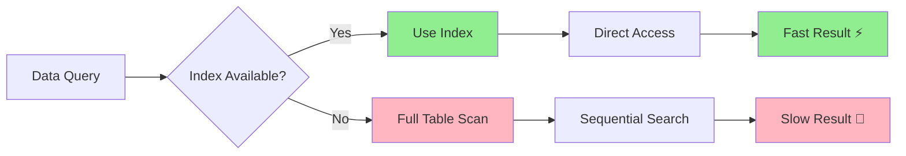

---

## 🔑 Core Concepts

### 📍 Search Key
**Definition**: The attributes used to locate stored records in a database.

**Example**: In a student database, the student ID could serve as a search key to quickly find a specific student's information.

### 📂 Index File Structure
An index file is significantly smaller than the original data file and typically consists of:
- **Search key values**
- **Pointers to corresponding records**

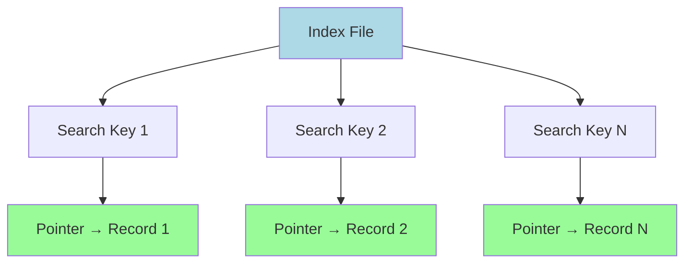

---

## 🏗️ Index Types

### 1️⃣ Ordered Index (순서 인덱스)

**Characteristics**:
- Records stored in sorted order by search key values
- Efficient for range queries and sorted data access
- Examples: "Find all employees with salary ≥ $50,000"

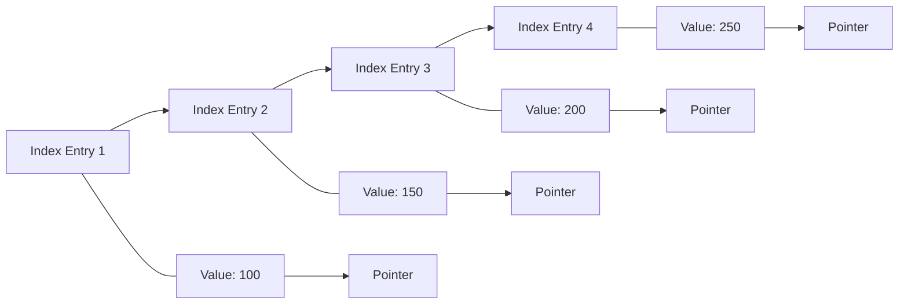

#### 🔍 Primary Index (Clustering Index)
- **One per table** - The data file is physically ordered by the search key
- **Search key**: Usually (but not necessarily) the Primary Key
- **Physical storage**: Records are stored consecutively based on search key order

#### 🔍 Secondary Index (Non-clustering Index)
- **Multiple allowed** - Independent of physical storage order
- **Unique option**: Can be designated as secondary index even without being Primary Key
- **Foreign keys**: Can also be designated as indexes

### 2️⃣ Hash Index (해시 인덱스)

**Characteristics**:
- Uses hash functions to distribute data evenly across buckets
- Excellent for exact-match queries
- Examples: "Find employee with ID = 12345"

```mermaid
graph TD
    A[Search Key] --> B[Hash Function]
    B --> C[Bucket Address]
    C --> D[Data Records]
    
    E[Key: Music] --> F[h(Music) = 1]
    G[Key: History] --> H[h(History) = 2]
    I[Key: Physics] --> J[h(Physics) = 3]
    
    F --> K[Bucket 1]
    H --> L[Bucket 2]
    J --> M[Bucket 3]
    
    style B fill:#FFD700
    style K fill:#90EE90
    style L fill:#90EE90
    style M fill:#90EE90
```

---

## 📊 Index Performance Metrics

| Metric | Description | Optimization Goal |
|--------|-------------|-------------------|
| **Access Time** | Time to locate data | ⬇️ Minimize |
| **Insertion Time** | Time to insert new data + update index | ⬇️ Minimize |
| **Deletion Time** | Time to delete data + update index | ⬇️ Minimize |
| **Space Overhead** | Additional storage required for index | ⬇️ Minimize |

---

## 🎨 Dense vs Sparse Indexes

### 🟦 Dense Index (밀집 인덱스)

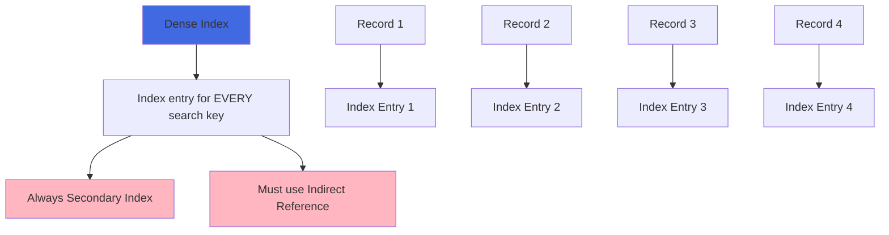

**Characteristics**:
- Index entry exists for every search key value
- Always secondary index (unsorted)
- Must use indirect reference

### 🟨 Sparse Index (희소 인덱스)

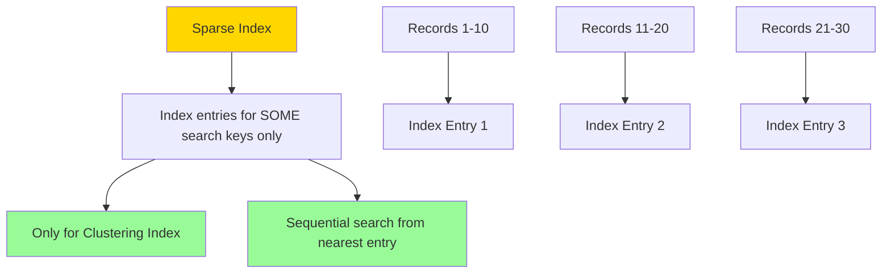

**Characteristics**:
- Index entries exist for only some search key values
- Can only be used with clustering indexes
- Searches start from the nearest index entry and scan sequentially

---

## 🌳 B+ Trees

B+ Trees provide an excellent alternative to sequential indexing and are widely used in modern database systems.

### 📈 Advantages vs Disadvantages

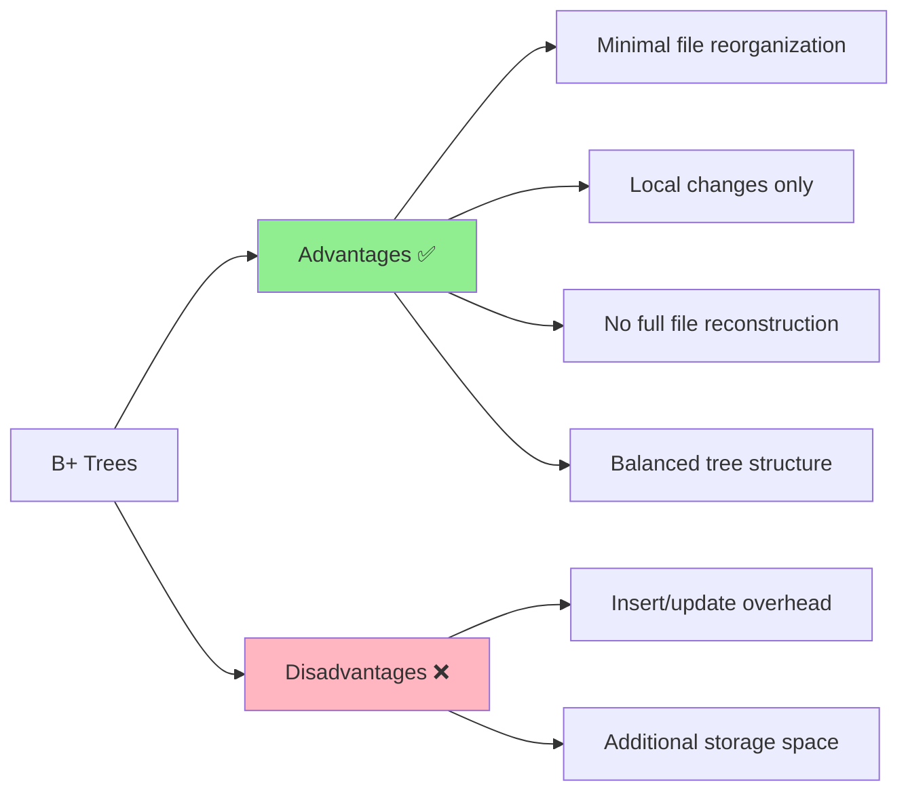

### 🏗️ B+ Tree Structure

**Key Properties**:
- **Balanced**: All paths from root to leaf have equal length
- **Node capacity**: Non-root nodes have n/2 to n children
- **Leaf capacity**: Leaf nodes contain (n-1)/2 to n-1 values

---

## 🔧 Hashing Techniques

### 🔨 Hash Functions

**Definition**: Functions that map arbitrary-length data to fixed-length data.

**Examples**: MD5, SHA-256

### 🪣 Bucket Management

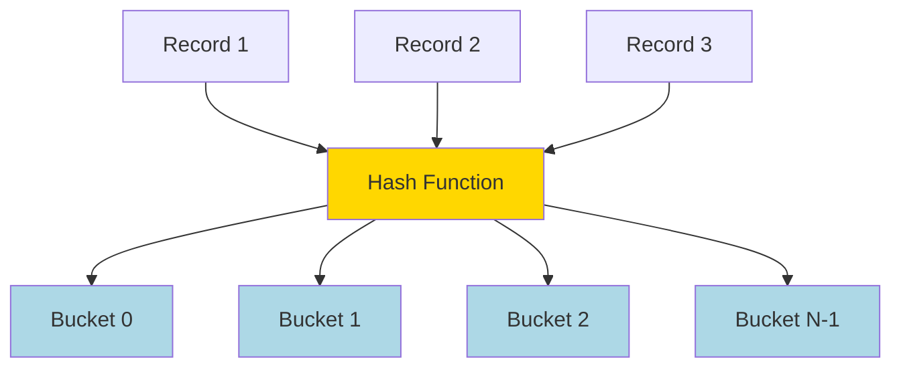

### ⚠️ Bucket Overflow

**Causes**:
1. **Skewed distribution**: Poor hash function causing uneven data distribution
2. **Duplicate keys**: Many records with the same search key value

**Solution**: **Overflow Chaining**
- Link overflow buckets using linked lists
- This structure is called **Closed Hashing**

### 🔄 Dynamic vs Static Hashing

| Aspect | Static Hashing | Dynamic Hashing |
|--------|----------------|-----------------|
| **Bucket Count** | Fixed | Variable |
| **Scalability** | Poor | Excellent |
| **Space Utilization** | May waste space | Efficient |
| **Reorganization** | Periodic full reorganization | Incremental adjustments |

---

## 🚀 Performance Optimization Guidelines

### 🎯 When to Use Each Index Type

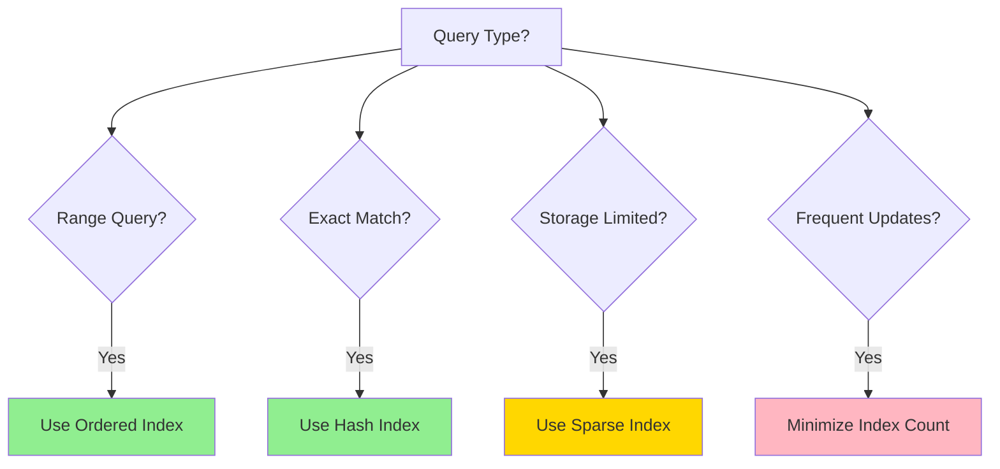

### 📋 Best Practices

1. **🎯 Choose appropriate index type** based on query patterns
2. **⚖️ Balance performance vs storage** overhead
3. **🔄 Regular maintenance** of indexes for optimal performance
4. **📊 Monitor query performance** and adjust indexing strategy accordingly

---

## 🌐 NoSQL and Alternative Storage

### 📊 NoSQL Overview

**Definition**: "Not Only SQL" - Non-relational database systems designed to overcome traditional relational database limitations.

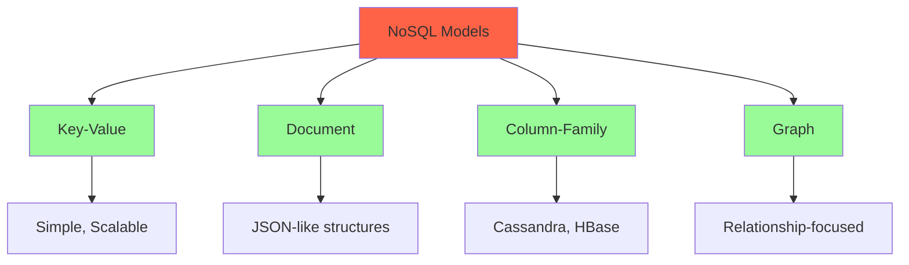

**Popular Systems**: Cassandra, Hadoop, HBase, MongoDB

**Key Features**:
- **Schema-less**: Flexible data structures
- **Distributed processing**: Horizontal scalability
- **High availability**: Fault tolerance

---

## 🧪 Interactive Quiz

> **Test your understanding!**

**Question 1**: Which index type is best for the query "Find all employees with salary between $40,000 and $60,000"?

<details>
<summary>Click for answer</summary>

**Answer**: Ordered Index

**Explanation**: Range queries are most efficiently handled by ordered indexes because the data is stored in sorted order, allowing for efficient range scans.
</details>

**Question 2**: What is the main advantage of hash indexes over ordered indexes?

<details>
<summary>Click for answer</summary>

**Answer**: Faster exact-match queries

**Explanation**: Hash indexes can directly compute the bucket location for a specific key value, making exact-match queries very fast (O(1) average case).
</details>

---

## 🏗️ Relational Database Design

> **"Good database design is the foundation of data integrity and system efficiency"**

## 🎯 Chapter Overview

Database design is like architectural planning for a building. A well-designed database prevents structural problems, ensures efficient use of space, and provides a solid foundation for future expansion. Poor design leads to data redundancy, inconsistency, and maintenance nightmares.

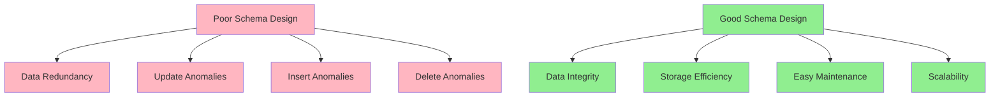

---

## ⚠️ Database Design Problems

### 📊 The Three Anomalies

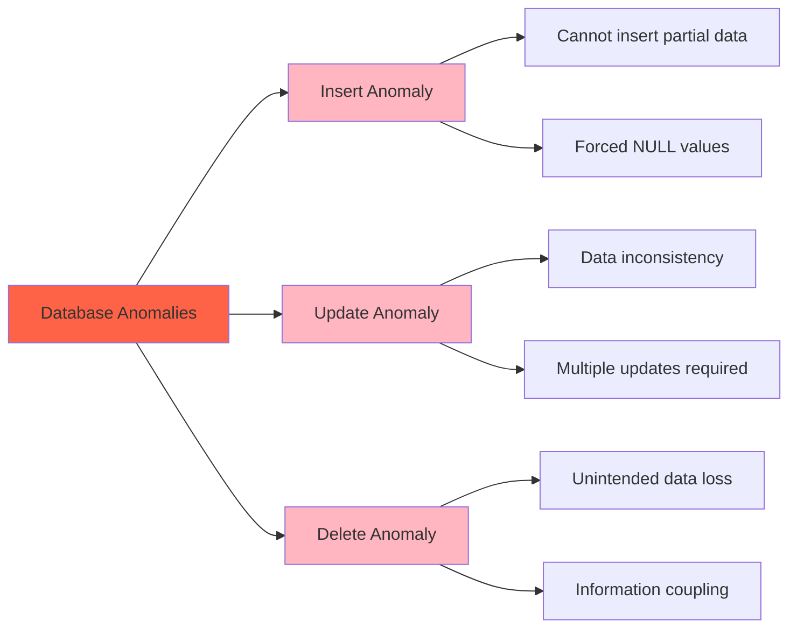

#### 🚫 Insert Anomaly
**Problem**: Cannot insert certain data without having other unrelated data.

**Example**: Cannot add a new department to the system without having at least one instructor assigned to it.

#### 🔄 Update Anomaly
**Problem**: Same information stored in multiple places must be updated everywhere.

**Example**: If a department changes its budget, all instructor records referencing that department must be updated.

#### 🗑️ Delete Anomaly
**Problem**: Deleting one piece of information inadvertently removes other valuable information.

**Example**: Removing the last instructor from a department also removes all department information.

---

## 🔧 The Solution: Normalization

**Definition**: Normalization is the process of decomposing schemas to eliminate anomalies and ensure data integrity.

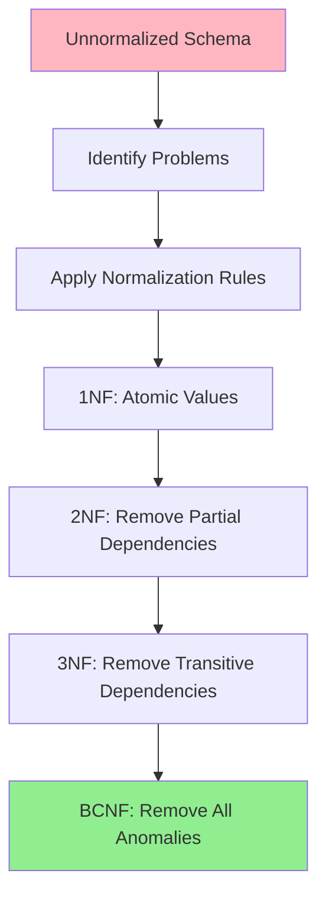

---

## 🎯 Normal Forms

### 1️⃣ First Normal Form (1NF)

**Rule**: All attribute domains must be atomic (indivisible).

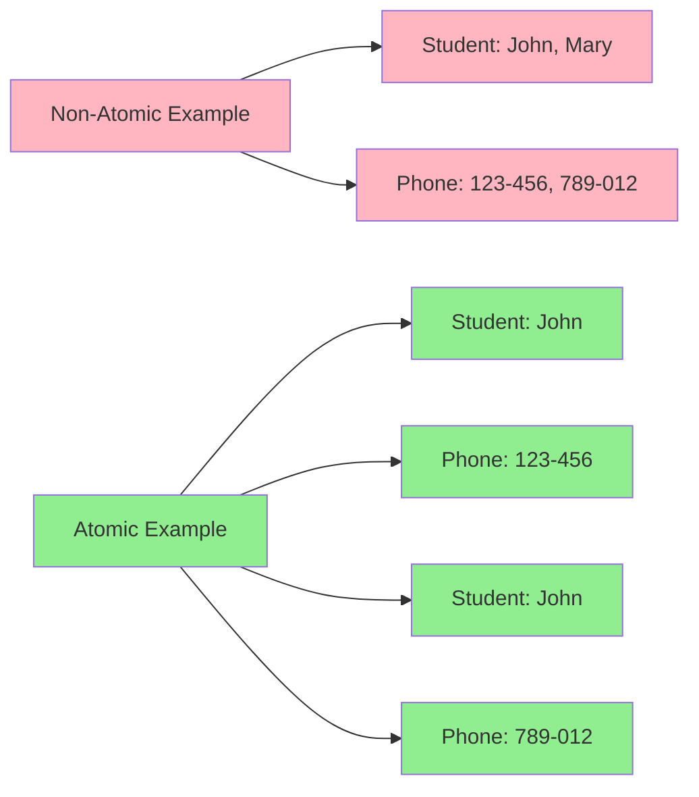

**Examples of Non-Atomic Values**:
- Multiple phone numbers in one field: "123-456-7890, 987-654-3210"
- Composite addresses: "123 Main St, Apt 4B"
- Course codes with embedded meaning: "CS101" (CS = Computer Science, 101 = Level)

### 2️⃣ Functional Dependencies (FD)

**Definition**: An attribute or set of attributes X functionally determines another set of attributes Y if each X value is associated with exactly one Y value.

**Notation**: X → Y (X determines Y)

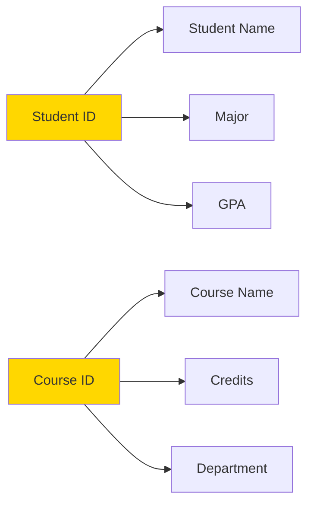

#### 🔍 Armstrong's Axioms

**Three fundamental rules for deriving functional dependencies**:

1. **Reflexivity**: If Y ⊆ X, then X → Y
2. **Augmentation**: If X → Y, then XZ → YZ
3. **Transitivity**: If X → Y and Y → Z, then X → Z

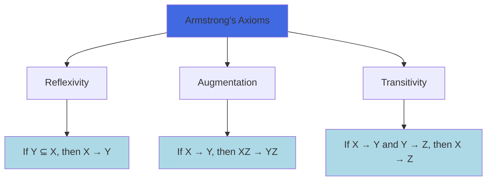

#### 🔄 Closure Computation

**Algorithm to compute attribute closure (α⁺)**:

```
result := α
while (result changes) do
    for each β → γ in F do
        if β ⊆ result then
            result := result ∪ γ
```

**Example**: Given F = {A → B, C → D, A → C} and α = {A}

```mermaid
graph TD
    A[Start: result = {A}] --> B[Apply A → B: result = {A,B}]
    B --> C[Apply A → C: result = {A,B,C}]
    C --> D[Apply C → D: result = {A,B,C,D}]
    D --> E[No more changes: {A}⁺ = {A,B,C,D}]
    
    style A fill:#FFD700
    style E fill:#90EE90
```

---

## 🏆 Advanced Normal Forms

### 3️⃣ Third Normal Form (3NF)

**Definition**: A relation is in 3NF if, for every functional dependency α → β:
1. α → β is trivial (β ⊆ α), OR
2. α is a superkey, OR  
3. Each attribute in β - α is part of some candidate key

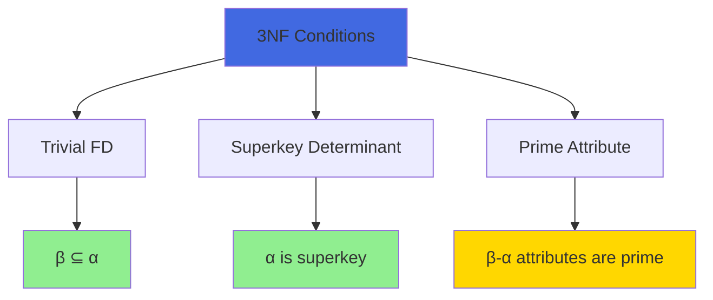

**Advantages**:
✅ Allows some redundancy for dependency preservation  
✅ Can check dependencies without joins  
✅ Guarantees lossless decomposition  

### 4️⃣ Boyce-Codd Normal Form (BCNF)

**Definition**: A relation is in BCNF if, for every functional dependency α → β:
1. α → β is trivial (β ⊆ α), OR
2. α is a superkey

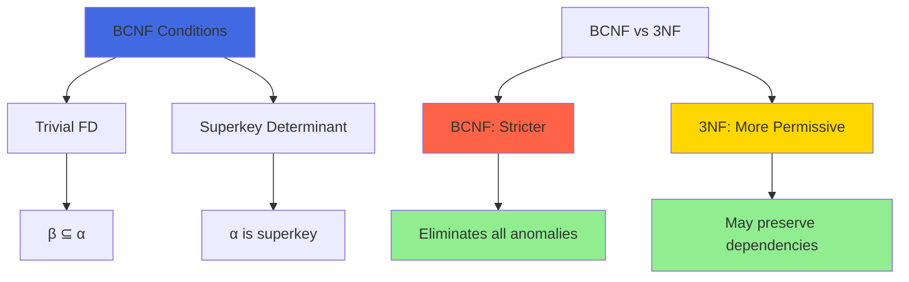

---

## 🔄 Decomposition Process

### 📋 BCNF Decomposition Algorithm

```mermaid
graph TD
    A[Start with Relation R] --> B{BCNF Violation?}
    B -->|No| C[Done: R is in BCNF]
    B -->|Yes| D[Find violating FD: α → β]
    D --> E[Create R1 = α ∪ β]
    E --> F[Create R2 = R - (β - α)]
    F --> G[Recursively check R1, R2]
    G --> B
    
    style C fill:#90EE90
    style D fill:#FFB6C1
```

**Example Decomposition**:

**Original**: Student_Course(Student_ID, Course_Name, Instructor)  
**FDs**: {Student_ID, Course_Name} → Instructor, Instructor → Course_Name  

**Problem**: Instructor → Course_Name violates BCNF (Instructor is not a superkey)

**Solution**:
- R1(Instructor, Course_Name)
- R2(Student_ID, Instructor)

### ⚖️ Design Goals

```mermaid
graph TD
    A[Decomposition Goals] --> B[Lossless Decomposition]
    A --> C[Dependency Preservation]
    A --> D[Eliminate Anomalies]
    
    B --> B1[R = R1 ⋈ R2 ⋈ ... ⋈ Rn]
    C --> C1[All FDs can be checked locally]
    D --> D1[No insert/update/delete anomalies]
    
    E[Trade-offs] --> F[BCNF + Lossless]
    E --> G[3NF + Dependency Preservation]
    
    style B1 fill:#90EE90
    style C1 fill:#FFD700
    style D1 fill:#90EE90
    style F fill:#FF6347
    style G fill:#4169E1
```

---

## 🎮 Hands-On Exercise

### 🧩 Normalization Challenge

**Given Relation**: Employee_Project(EmpID, EmpName, ProjID, ProjName, Hours, DeptName, DeptBudget)

**Functional Dependencies**:
- EmpID → EmpName, DeptName, DeptBudget
- ProjID → ProjName  
- EmpID, ProjID → Hours

**Tasks**:
1. Identify the current normal form
2. Decompose to BCNF
3. Check for lossless decomposition

<details>
<summary>💡 Solution</summary>

**Current Form**: 1NF (has update anomalies due to transitive dependencies)

**BCNF Decomposition**:
1. **Employee**(EmpID, EmpName, DeptName, DeptBudget)
2. **Project**(ProjID, ProjName)  
3. **Assignment**(EmpID, ProjID, Hours)

**Verification**: Lossless because:
- Employee ∩ Assignment = {EmpID} and EmpID → EmpName, DeptName, DeptBudget
- Project ∩ Assignment = {ProjID} and ProjID → ProjName
</details>

---

## 🔍 Advanced Topics

### 🔄 Denormalization Considerations

Sometimes, **strategic denormalization** can improve performance:

```mermaid
graph LR
    A[Normalized Design] --> B[Multiple Joins]
    B --> C[Query Complexity]
    
    D[Denormalized Design] --> E[Fewer Joins]
    E --> F[Faster Queries]
    E --> G[Storage Redundancy]
    
    style A fill:#90EE90
    style D fill:#FFD700
    style C fill:#FFB6C1
    style F fill:#90EE90
    style G fill:#FFB6C1
```

**When to Consider Denormalization**:
- **Read-heavy workloads** with infrequent updates
- **Performance-critical queries** requiring multiple joins
- **Data warehousing** scenarios

### 🪟 Materialized Views

**Alternative to denormalization**: Precomputed query results stored as tables

**Advantages**:
✅ Maintains normalized base tables  
✅ Improves query performance  
✅ Automatic maintenance (in some systems)  

**Trade-offs**:
❌ Additional storage overhead  
❌ Maintenance cost on updates  
❌ Potential staleness issues  

---

## 📚 Assessment Questions

> **Test your comprehensive understanding!**

**Question 1**: Given the FD set {A → BC, CD → E, B → D, E → A}, find the candidate keys for relation R(A,B,C,D,E).

<details>
<summary>Click for solution</summary>

**Solution**: Candidate keys are **{A}** and **{E}**

**Explanation**: 
- A⁺ = {A,B,C,D,E} (A determines all attributes)
- E⁺ = {E,A,B,C,D} (E determines all attributes via E→A)
- Other attributes cannot determine all attributes independently
</details>

**Question 2**: Is the relation R(A,B,C,D) with FDs {AB → C, C → D, D → A} in BCNF?

<details>
<summary>Click for solution</summary>

**Answer**: No, R is not in BCNF

**Explanation**: 
- C → D violates BCNF because C is not a superkey
- D → A violates BCNF because D is not a superkey
- Only AB → C satisfies BCNF condition (AB is a candidate key)
</details>

---

## 🔗 Key Takeaways

```mermaid
graph TD
    A[Database Design Principles] --> B[Understand the Domain]
    A --> C[Identify Functional Dependencies]
    A --> D[Apply Normalization Systematically]
    A --> E[Balance Theory with Practice]
    
    B --> B1[Requirements Analysis]
    C --> C1[Closure Computation]
    D --> D1[1NF → 2NF → 3NF → BCNF]
    E --> E1[Performance Considerations]
    
    style A fill:#4169E1
    style B1 fill:#ADD8E6
    style C1 fill:#ADD8E6
    style D1 fill:#ADD8E6
    style E1 fill:#ADD8E6
```

1. **🎯 Good design prevents problems** - Investment in design saves debugging time
2. **📏 Normalization is systematic** - Follow the rules, but understand the trade-offs
3. **⚖️ Balance is key** - Pure theory must meet practical requirements
4. **🔄 Design is iterative** - Expect to refine your schema over time

---

# 🔐 Transaction Management

> **"In the world of databases, transactions are the guardians of data integrity"**

## 🎯 Chapter Overview

Imagine multiple people trying to withdraw money from the same bank account simultaneously, or two customers trying to book the last available airline seat. Without proper transaction management, chaos would ensue! Transactions ensure that database operations are reliable, consistent, and predictable even in concurrent, failure-prone environments.

```mermaid
graph TD
    A[Why Transactions?] --> B[Concurrent Access]
    A --> C[System Failures]
    A --> D[Data Integrity]
    
    B --> B1[Multiple users, same data]
    B --> B2[Race conditions]
    B --> B3[Lost updates]
    
    C --> C1[Hardware failures]
    C --> C2[Software crashes]
    C --> C3[Network issues]
    
    D --> D1[Business rules]
    D --> D2[Consistency constraints]
    D --> D3[Referential integrity]
    
    style A fill:#FF6347
    style B fill:#FFB6C1
    style C fill:#FFB6C1
    style D fill:#90EE90
```

### 🎓 Learning Objectives

By the end of this section, you will be able to:

✅ **Define** transactions and explain their importance  
✅ **Apply** ACID properties to real-world scenarios  
✅ **Analyze** concurrency problems and their solutions  
✅ **Implement** transaction control in SQL  
✅ **Design** recovery strategies for system failures  
✅ **Evaluate** different isolation levels and their trade-offs  

---

## 🏗️ What is a Transaction?

**Definition**: A transaction is a logical unit of work that contains one or more SQL statements. All statements in a transaction are executed as a single, indivisible unit.

### 🌟 Real-World Example: Bank Transfer

```mermaid
sequenceDiagram
    participant User
    participant Database
    participant Account_A
    participant Account_B
    
    User->>Database: BEGIN TRANSACTION
    User->>Account_A: Debit $100
    Account_A-->>Database: Balance: $500 → $400
    User->>Account_B: Credit $100
    Account_B-->>Database: Balance: $300 → $400
    User->>Database: COMMIT
    
    Note over Database: Transaction Successful ✅
```

**Transaction Steps**:
1. **BEGIN** - Start the transaction
2. **Debit from Account A** - Subtract $100
3. **Credit to Account B** - Add $100  
4. **COMMIT** - Make changes permanent

**What if something goes wrong?**

```mermaid
sequenceDiagram
    participant User
    participant Database
    participant Account_A
    participant Account_B
    
    User->>Database: BEGIN TRANSACTION
    User->>Account_A: Debit $100
    Account_A-->>Database: Balance: $500 → $400
    User->>Account_B: Credit $100
    Note over Account_B: ❌ SYSTEM FAILURE
    User->>Database: ROLLBACK
    Account_A-->>Database: Balance: $400 → $500
    
    Note over Database: Transaction Rolled Back 🔄
```

---

## 🏛️ ACID Properties

The cornerstone of transaction management - **ACID** properties ensure database reliability:

```mermaid
graph TD
    A[ACID Properties] --> B[Atomicity 🎯]
    A --> C[Consistency 🔄]
    A --> D[Isolation 🏝️]
    A --> E[Durability 💾]
    
    B --> B1[All or Nothing]
    B --> B2[No partial execution]
    
    C --> C1[Valid state transitions]
    C --> C2[Integrity constraints]
    
    D --> D1[Concurrent isolation]
    D --> D2[No interference]
    
    E --> E1[Permanent changes]
    E --> E2[Survive failures]
    
    style A fill:#4169E1
    style B fill:#FF6347
    style C fill:#32CD32
    style D fill:#FFD700
    style E fill:#9370DB
```

### 🎯 Atomicity (원자성)

**Principle**: "All or Nothing" - Either all operations in a transaction complete successfully, or none of them do.

```mermaid
graph LR
    A[Transaction T1] --> B{All Operations Successful?}
    B -->|Yes| C[COMMIT - All Changes Applied]
    B -->|No| D[ROLLBACK - No Changes Applied]
    
    E[Operation 1: ✅] --> F[Operation 2: ✅]
    F --> G[Operation 3: ✅]
    G --> H[Transaction Succeeds]
    
    I[Operation 1: ✅] --> J[Operation 2: ❌]
    J --> K[Entire Transaction Fails]
    
    style C fill:#90EE90
    style D fill:#FFB6C1
    style H fill:#90EE90
    style K fill:#FFB6C1
```

**Implementation Mechanisms**:
- **Write-Ahead Logging (WAL)**: Log changes before applying them
- **Shadow Paging**: Keep original pages until commit
- **Rollback Segments**: Store undo information

### 🔄 Consistency (일관성)

**Principle**: Transactions move the database from one consistent state to another consistent state.

```mermaid
graph TD
    A[Consistent State 1] --> B[Transaction Execution]
    B --> C[Consistent State 2]
    
    D[Example: Bank Database] --> E[Total Money = $1000]
    E --> F[Transfer $100: A→B]
    F --> G[Total Money = $1000]
    
    H[Integrity Constraints] --> I[Primary Keys]
    H --> J[Foreign Keys]
    H --> K[Check Constraints]
    H --> L[Business Rules]
    
    style A fill:#90EE90
    style C fill:#90EE90
    style E fill:#90EE90
    style G fill:#90EE90
```

**Types of Consistency**:
- **Entity Integrity**: Primary key constraints
- **Referential Integrity**: Foreign key constraints  
- **Domain Integrity**: Data type and check constraints
- **User-Defined**: Business rule constraints

### 🏝️ Isolation (고립성)

**Principle**: Concurrent transactions should not interfere with each other. Each transaction should appear to execute in isolation.

```mermaid
graph TD
    A[Multiple Concurrent Transactions] --> B[T1: Transfer Money]
    A --> C[T2: Calculate Interest]
    A --> D[T3: Generate Report]
    
    B --> E[Sees Consistent Snapshot]
    C --> F[Sees Consistent Snapshot]
    D --> G[Sees Consistent Snapshot]
    
    E --> H[No Interference]
    F --> H
    G --> H
    
    style H fill:#90EE90
```

**Concurrency Problems Without Isolation**:
- **Dirty Read**: Reading uncommitted changes
- **Non-Repeatable Read**: Same query returns different results
- **Phantom Read**: New rows appear in range queries
- **Lost Update**: Concurrent updates overwrite each other

### 💾 Durability (지속성)

**Principle**: Once a transaction commits, its changes are permanent and survive system failures.

```mermaid
graph TD
    A[Transaction Commits] --> B[Changes Written to Disk]
    B --> C[System Failure Occurs]
    C --> D[System Restarts]
    D --> E[Changes Still Present]
    
    F[Implementation Methods] --> G[Write-Ahead Logging]
    F --> H[Force-Write at Commit]
    F --> I[Redundant Storage]
    F --> J[Backup & Recovery]
    
    style E fill:#90EE90
    style G fill:#ADD8E6
    style H fill:#ADD8E6
    style I fill:#ADD8E6
    style J fill:#ADD8E6
```

---

## 🔄 Transaction States

Understanding the lifecycle of a transaction:

```mermaid
stateDiagram-v2
    [*] --> Active: BEGIN TRANSACTION
    Active --> PartiallyCommitted: COMMIT issued
    Active --> Failed: Error occurs
    PartiallyCommitted --> Committed: Write to disk complete
    PartiallyCommitted --> Failed: Write fails
    Failed --> Aborted: ROLLBACK complete
    Committed --> [*]: Transaction complete
    Aborted --> [*]: Transaction complete
    
    note right of Active: Executing operations
    note right of PartiallyCommitted: Waiting for disk write
    note right of Committed: Changes permanent
    note right of Aborted: Changes undone
```

### 📊 State Transition Examples

| State | Description | Example |
|-------|-------------|---------|
| **Active** | Transaction is executing | Running UPDATE statements |
| **Partially Committed** | Final statement executed, waiting for commit | COMMIT issued, disk write pending |
| **Committed** | Transaction completed successfully | Changes written to disk |
| **Failed** | Normal execution can no longer proceed | Constraint violation detected |
| **Aborted** | Transaction has been rolled back | All changes undone |

---

## 🚦 Concurrency Control

### 🎭 The Concurrency Challenge

When multiple transactions run simultaneously, various problems can occur:

```mermaid
graph TD
    A[Concurrency Problems] --> B[Lost Update Problem]
    A --> C[Dirty Read Problem]
    A --> D[Non-Repeatable Read]
    A --> E[Phantom Read Problem]
    
    B --> B1[T1 and T2 both update X]
    B --> B2[One update overwrites the other]
    
    C --> C1[T1 reads uncommitted data from T2]
    C --> C2[T2 later rolls back]
    
    D --> D1[T1 reads X twice]
    D --> D2[T2 modifies X between reads]
    
    E --> E1[T1 reads range of rows]
    E --> E2[T2 inserts new rows in range]
    
    style A fill:#FF6347
    style B fill:#FFB6C1
    style C fill:#FFB6C1
    style D fill:#FFB6C1
    style E fill:#FFB6C1
```

### 🔒 Locking Mechanisms

**Lock Types**:

```mermaid
graph TD
    A[Lock Types] --> B[Shared Lock S]
    A --> C[Exclusive Lock X]
    
    B --> B1[Multiple readers allowed]
    B --> B2[No writers allowed]
    
    C --> C1[Single writer only]
    C --> C2[No other readers or writers]
    
    D[Lock Compatibility Matrix]
    D --> E[S + S = ✅ Compatible]
    D --> F[S + X = ❌ Incompatible]
    D --> G[X + S = ❌ Incompatible]
    D --> H[X + X = ❌ Incompatible]
    
    style B fill:#90EE90
    style C fill:#FF6347
    style E fill:#90EE90
    style F fill:#FFB6C1
    style G fill:#FFB6C1
    style H fill:#FFB6C1
```

### 🔄 Two-Phase Locking (2PL)

**Protocol**: Ensures serializability by requiring transactions to acquire all locks before releasing any.

```mermaid
graph TD
    A[Two-Phase Locking] --> B[Growing Phase]
    A --> C[Shrinking Phase]
    
    B --> B1[Acquire locks only]
    B --> B2[No lock releases]
    
    C --> C1[Release locks only]
    C --> C2[No new lock acquisitions]
    
    D[Timeline Example] --> E[Acquire Lock A]
    E --> F[Acquire Lock B]
    F --> G[Lock Point - Switch to Shrinking]
    G --> H[Release Lock A]
    H --> I[Release Lock B]
    
    style B fill:#90EE90
    style C fill:#FFD700
    style G fill:#FF6347
```

**Advantages**: Guarantees serializability  
**Disadvantages**: Can cause deadlocks, reduced concurrency

---

## 🔍 Isolation Levels

SQL standard defines four isolation levels, each providing different trade-offs between consistency and performance:

```mermaid
graph TD
    A[Isolation Levels] --> B[Read Uncommitted]
    A --> C[Read Committed]
    A --> D[Repeatable Read]
    A --> E[Serializable]
    
    B --> B1[Allows: All anomalies]
    B --> B2[Performance: Highest]
    
    C --> C1[Prevents: Dirty reads]
    C --> C2[Allows: Non-repeatable, phantom reads]
    
    D --> D1[Prevents: Dirty, non-repeatable reads]
    D --> D2[Allows: Phantom reads]
    
    E --> E1[Prevents: All anomalies]
    E --> E2[Performance: Lowest]
    
    style B fill:#FFB6C1
    style C fill:#FFD700
    style D fill:#90EE90
    style E fill:#4169E1
```

### 📊 Isolation Level Comparison

| Isolation Level | Dirty Read | Non-Repeatable Read | Phantom Read | Performance |
|----------------|------------|-------------------|--------------|-------------|
| **Read Uncommitted** | ❌ Possible | ❌ Possible | ❌ Possible | 🚀 Highest |
| **Read Committed** | ✅ Prevented | ❌ Possible | ❌ Possible | 🏃 High |
| **Repeatable Read** | ✅ Prevented | ✅ Prevented | ❌ Possible | 🚶 Medium |
| **Serializable** | ✅ Prevented | ✅ Prevented | ✅ Prevented | 🐌 Lowest |

### 💡 Practical Usage Guidelines

```mermaid
graph LR
    A[Choose Isolation Level] --> B{Data Criticality?}
    B -->|High| C[Serializable/Repeatable Read]
    B -->|Medium| D[Read Committed]
    B -->|Low| E[Read Uncommitted]
    
    F{Concurrent Load?} --> G[High: Lower isolation]
    F --> H[Low: Higher isolation]
    
    style C fill:#90EE90
    style D fill:#FFD700
    style E fill:#FFB6C1
```

---

## 💾 Recovery Management

### 🔥 Failure Types

```mermaid
graph TD
    A[Database Failures] --> B[Transaction Failures]
    A --> C[System Failures]
    A --> D[Media Failures]
    
    B --> B1[Logical errors]
    B --> B2[Constraint violations]
    B --> B3[Deadlocks]
    
    C --> C1[Power outages]
    C --> C2[Software crashes]
    C --> C3[Operating system failures]
    
    D --> D1[Disk crashes]
    D --> D2[Tape failures]
    D --> D3[Catastrophic events]
    
    style B fill:#FFD700
    style C fill:#FF6347
    style D fill:#8B0000
```

### 📝 Write-Ahead Logging (WAL)

**Core Principle**: Log changes before applying them to the database.

```mermaid
sequenceDiagram
    participant T as Transaction
    participant L as Log
    participant D as Database
    
    T->>L: Write BEGIN record
    T->>L: Write UPDATE record (before image)
    T->>D: Update data page
    T->>L: Write COMMIT record
    L->>D: Force log to disk
    
    Note over L,D: Changes are recoverable
```

**Log Record Types**:
- **Start**: Transaction begins
- **Update**: Before and after images
- **Commit**: Transaction completes
- **Abort**: Transaction rolls back
- **Checkpoint**: Recovery point

### 🔄 Recovery Algorithms

#### ARIES (Algorithm for Recovery and Isolation Exploiting Semantics)

```mermaid
graph TD
    A[ARIES Recovery] --> B[Analysis Phase]
    A --> C[Redo Phase]
    A --> D[Undo Phase]
    
    B --> B1[Scan log from last checkpoint]
    B --> B2[Identify active transactions]
    B --> B3[Build dirty page table]
    
    C --> C1[Redo all logged operations]
    C --> C2[Restore database to failure point]
    
    D --> D1[Undo uncommitted transactions]
    D --> D2[Restore consistent state]
    
    style B fill:#ADD8E6
    style C fill:#90EE90
    style D fill:#FFD700
```

---

## 🛠️ SQL Transaction Control

### 📝 Basic Transaction Commands

```sql
-- Start a transaction
BEGIN TRANSACTION;
-- or
START TRANSACTION;

-- Commit changes
COMMIT;

-- Rollback changes
ROLLBACK;

-- Set savepoint
SAVEPOINT sp1;

-- Rollback to savepoint
ROLLBACK TO sp1;
```

### 🎯 Practical Examples

#### Example 1: Bank Transfer Transaction

```sql
BEGIN TRANSACTION;

-- Check account balances
SELECT balance FROM accounts WHERE account_id IN (101, 102);

-- Debit from account 101
UPDATE accounts 
SET balance = balance - 500 
WHERE account_id = 101 AND balance >= 500;

-- Check if debit succeeded
IF @@ROWCOUNT = 0
BEGIN
    ROLLBACK;
    RETURN;
END

-- Credit to account 102
UPDATE accounts 
SET balance = balance + 500 
WHERE account_id = 102;

-- Log the transaction
INSERT INTO transaction_log (from_account, to_account, amount, timestamp)
VALUES (101, 102, 500, GETDATE());

COMMIT TRANSACTION;
```

#### Example 2: Order Processing with Savepoints

```sql
BEGIN TRANSACTION;

-- Insert order
INSERT INTO orders (customer_id, order_date, total_amount)
VALUES (12345, GETDATE(), 150.00);

DECLARE @order_id INT = SCOPE_IDENTITY();

SAVEPOINT order_items;

-- Insert order items
INSERT INTO order_items (order_id, product_id, quantity, price)
VALUES (@order_id, 1001, 2, 50.00);

INSERT INTO order_items (order_id, product_id, quantity, price)
VALUES (@order_id, 1002, 1, 50.00);

-- Update inventory
UPDATE products 
SET stock_quantity = stock_quantity - 2 
WHERE product_id = 1001 AND stock_quantity >= 2;

IF @@ROWCOUNT = 0
BEGIN
    ROLLBACK TO order_items;
    -- Could partially fulfill order or cancel completely
    ROLLBACK;
    RETURN;
END

UPDATE products 
SET stock_quantity = stock_quantity - 1 
WHERE product_id = 1002 AND stock_quantity >= 1;

COMMIT TRANSACTION;
```

### ⚙️ Setting Isolation Levels

```sql
-- Set isolation level for current session
SET TRANSACTION ISOLATION LEVEL READ COMMITTED;

-- Set for specific transaction
BEGIN TRANSACTION;
SET TRANSACTION ISOLATION LEVEL REPEATABLE READ;
-- ... transaction operations ...
COMMIT;

-- Table hints for specific queries
SELECT * FROM products WITH (NOLOCK);  -- READ UNCOMMITTED
SELECT * FROM products WITH (HOLDLOCK); -- REPEATABLE READ
```

---

## 🧠 Advanced Concepts

### ⚡ Optimistic vs Pessimistic Concurrency Control

```mermaid
graph LR
    A[Concurrency Control Strategies] --> B[Pessimistic]
    A --> C[Optimistic]
    
    B --> B1[Assume conflicts will occur]
    B --> B2[Lock early and often]
    B --> B3[Better for high contention]
    
    C --> C1[Assume conflicts are rare]
    C --> C2[Check for conflicts at commit]
    C --> C3[Better for low contention]
    
    style B fill:#FFB6C1
    style C fill:#90EE90
```

**Optimistic Locking Example**:
```sql
-- Read with version number
SELECT id, name, version FROM employees WHERE id = 100;
-- version = 42

-- Later, update with version check
UPDATE employees 
SET name = 'John Smith', version = version + 1
WHERE id = 100 AND version = 42;

-- If @@ROWCOUNT = 0, someone else modified the record
```

### 🕸️ Deadlock Detection and Prevention

```mermaid
graph TD
    A[Deadlock Scenarios] --> B[T1 waits for T2]
    A --> C[T2 waits for T1]
    B --> D[Circular Wait = Deadlock]
    C --> D
    
    E[Detection Methods] --> F[Wait-for Graph]
    E --> G[Timeout-based]
    E --> H[Victim Selection]
    
    I[Prevention Strategies] --> J[Ordered Locking]
    I --> K[Timeout Limits]
    I --> L[Deadlock Priority]
    
    style D fill:#FF6347
    style F fill:#ADD8E6
    style G fill:#ADD8E6
    style H fill:#ADD8E6
```

---

## 🧪 Interactive Scenarios

### 🎮 Scenario 1: Lost Update Problem

**Setup**: Two cashiers processing returns simultaneously

```mermaid
sequenceDiagram
    participant C1 as Cashier 1
    participant C2 as Cashier 2
    participant DB as Database
    
    DB->>C1: Read inventory: 100 units
    DB->>C2: Read inventory: 100 units
    C1->>DB: Return 5 units (100 + 5 = 105)
    C2->>DB: Return 3 units (100 + 3 = 103)
    
    Note over DB: Final value: 103 ❌<br/>Should be: 108 ✅
```

**Question**: How would you prevent this lost update problem?

<details>
<summary>💡 Solution</summary>

**Solutions**:
1. **Locking**: Use exclusive locks on inventory records
2. **Optimistic Concurrency**: Use version numbers or timestamps
3. **Atomic Operations**: Use SQL UPDATE with expressions

```sql
-- Solution 1: Explicit Locking
BEGIN TRANSACTION;
SELECT inventory_count FROM products WITH (UPDLOCK) WHERE id = 1001;
UPDATE products SET inventory_count = inventory_count + 5 WHERE id = 1001;
COMMIT;

-- Solution 2: Atomic Update
UPDATE products 
SET inventory_count = inventory_count + 5 
WHERE id = 1001;
```
</details>

### 🎮 Scenario 2: Phantom Read Detection

**Setup**: Manager generating reports while new employees are being added

<details>
<summary>💭 Think About It</summary>

At REPEATABLE READ isolation level:
- The same SELECT will return the same rows
- But new rows can still appear (phantoms)
- This affects aggregate functions like COUNT, SUM

**Question**: What isolation level would prevent phantom reads?
</details>

---

## 📊 Performance Considerations

### 🚀 Transaction Optimization Tips

```mermaid
graph TD
    A[Transaction Performance] --> B[Keep Transactions Short]
    A --> C[Minimize Lock Duration]
    A --> D[Use Appropriate Isolation]
    A --> E[Batch Operations]
    
    B --> B1[Faster commit times]
    B --> B2[Reduced lock contention]
    
    C --> C1[Acquire locks late]
    C --> C2[Release locks early]
    
    D --> D1[Balance consistency vs performance]
    D --> D2[Consider read patterns]
    
    E --> E1[Reduce transaction overhead]
    E --> E2[Improve throughput]
    
    style A fill:#4169E1
    style B1 fill:#90EE90
    style B2 fill:#90EE90
    style C1 fill:#90EE90
    style C2 fill:#90EE90
```

### 📈 Monitoring Transaction Health

**Key Metrics to Track**:
- **Transaction Duration**: Average and maximum time
- **Lock Wait Time**: Time spent waiting for locks
- **Deadlock Frequency**: Number of deadlocks per hour
- **Rollback Ratio**: Percentage of transactions rolled back
- **Log Growth Rate**: Size of transaction log

---

## 🧪 Hands-On Lab Exercise

### 🔬 Transaction Isolation Experiment

**Objective**: Observe different isolation levels in action

**Setup**:
```sql
-- Create test table
CREATE TABLE accounts (
    id INT PRIMARY KEY,
    name VARCHAR(50),
    balance DECIMAL(10,2)
);

INSERT INTO accounts VALUES 
(1, 'Alice', 1000.00),
(2, 'Bob', 500.00);
```

**Experiment Steps**:

1. **Session 1** (READ COMMITTED):
```sql
SET TRANSACTION ISOLATION LEVEL READ COMMITTED;
BEGIN TRANSACTION;
SELECT balance FROM accounts WHERE id = 1;
-- Wait for Session 2 to make changes
SELECT balance FROM accounts WHERE id = 1;
COMMIT;
```

2. **Session 2**:
```sql
BEGIN TRANSACTION;
UPDATE accounts SET balance = 1500.00 WHERE id = 1;
-- Session 1 will see the old value until we commit
COMMIT;
```

**Expected Results**:
- Session 1 will see different values in the two SELECT statements
- This demonstrates non-repeatable read

**Try with REPEATABLE READ**: What changes?

---

## 🔗 Key Takeaways

```mermaid
mindmap
  root((Transaction Management))
    ACID Properties
      Atomicity
      Consistency  
      Isolation
      Durability
    Concurrency Control
      Locking
      Isolation Levels
      Deadlock Handling
    Recovery
      Logging
      Checkpoint
      Rollback
    Best Practices
      Short Transactions
      Appropriate Isolation
      Error Handling
      Performance Monitoring
```

### 🎯 Essential Principles

1. **🛡️ ACID is non-negotiable** for critical systems
2. **⚖️ Balance consistency with performance** using appropriate isolation levels  
3. **🔒 Understand your locking strategy** to avoid deadlocks
4. **📝 Always handle transaction failures** gracefully
5. **📊 Monitor transaction performance** regularly
6. **🔄 Design for recovery** from day one

### 🚀 Next Steps

- Practice implementing transactions in your database system
- Experiment with different isolation levels
- Set up monitoring for transaction metrics
- Design backup and recovery procedures
- Learn about distributed transaction management (2PC, Saga patterns)

---
