# 📚 데이터베이스 시스템 종합 가이드

_데이터베이스 설계, 구현 및 관리를 위한 완전한 참고서_

   

---

## 📖 목차

1. [📊 데이터베이스 저장 및 인덱싱](#데이터베이스-저장-및-인덱싱)
2. [🏗️ 관계형 데이터베이스 설계](#관계형-데이터베이스-설계)
3. [🔐 트랜잭션 관리](#트랜잭션-관리)
4. [🔧 고급 SQL 연산](#고급-sql-연산)
5. [🌐 애플리케이션 개발](#애플리케이션-개발)
6. [⚙️ MySQL 특화 기능](#mysql-특화-기능)
7. [📝 요약 노트](#요약-노트)

---

## 🎯 학습 목표

이 가이드를 완료하면 다음을 할 수 있게 됩니다:

✅ 인덱스와 해싱을 사용하여 효율적인 데이터베이스 저장 구조 설계  
✅ 정규화 원칙을 적용하여 잘 설계된 데이터베이스 스키마 생성  
✅ ACID 속성을 가진 트랜잭션 관리 구현  
✅ 조인, 뷰, 제약 조건을 포함한 복잡한 SQL 쿼리 작성  
✅ 적절한 보안 조치를 갖춘 데이터베이스 기반 애플리케이션 개발  
✅ MySQL 특화 구문 및 최적화 기법 이해

---

## 📋 문서 개요

이 종합 가이드는 데이터베이스 시스템의 7가지 기본 영역을 다룹니다:

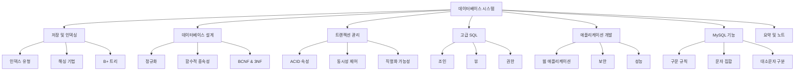

---

# 📊 데이터베이스 저장 및 인덱싱

> **"효율적인 데이터 검색은 고성능 데이터베이스 시스템의 기초입니다"**

## 🎯 챕터 개요

데이터베이스 인덱싱은 잘 정리된 도서관 목록 시스템과 같습니다. 모든 책장의 모든 책을 검색하는 대신, 목록을 사용하여 필요한 정확한 책을 직접 찾을 수 있습니다. 마찬가지로 데이터베이스 인덱스는 전체 테이블을 스캔하지 않고도 특정 데이터에 빠르게 접근할 수 있게 해줍니다.

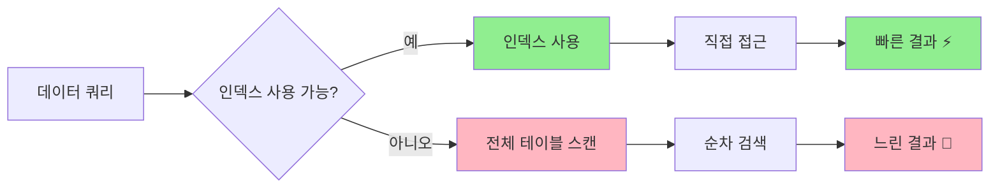

---

## 🔑 핵심 개념

### 📍 검색 키

**정의**: 데이터베이스에서 저장된 레코드를 찾는 데 사용되는 속성들.

**예시**: 학생 데이터베이스에서 학번이 특정 학생의 정보를 빠르게 찾기 위한 검색 키 역할을 할 수 있습니다.

### 📂 인덱스 파일 구조

인덱스 파일은 원본 데이터 파일보다 훨씬 작으며 일반적으로 다음으로 구성됩니다:

- **검색 키 값**
- **해당 레코드에 대한 포인터**

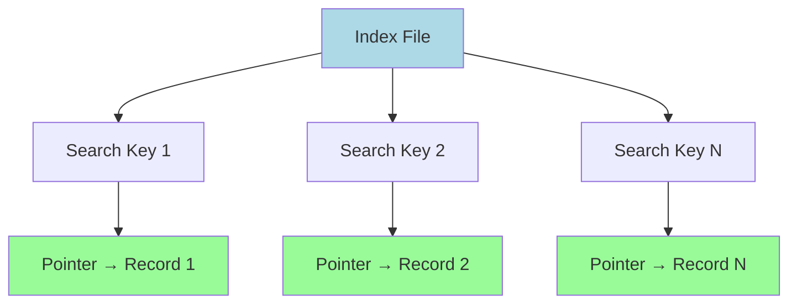

---

## 🏗️ 인덱스 유형

### 1️⃣ 순서 인덱스 (Ordered Index)

**특징**:

- 검색 키 값 기준으로 정렬된 순서로 레코드 저장
- 범위 쿼리 및 정렬된 데이터 접근에 효율적
- 예시: "급여가 50,000달러 이상인 모든 직원을 찾기"

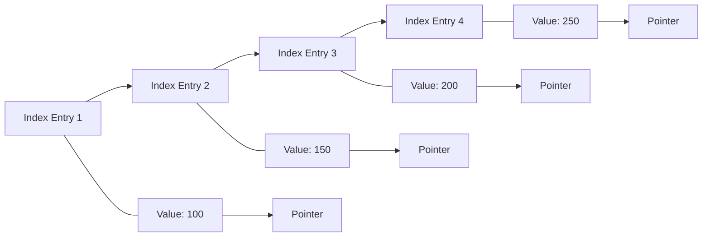

#### 🔍 주 인덱스 (클러스터링 인덱스)

- **테이블당 하나** - 데이터 파일이 검색 키 기준으로 물리적으로 정렬됨
- **검색 키**: 보통(반드시 Primary Key는 아님) 기본 키
- **물리적 저장**: 검색 키 순서대로 레코드가 연속적으로 저장

#### 🔍 보조 인덱스 (비클러스터링 인덱스)

- **여러 개 허용** - 물리적 저장 순서와 독립적
- **Unique 옵션**: 기본 키가 아니어도 보조 인덱스로 지정 가능
- **외래 키**도 인덱스로 지정 가능

### 2️⃣ Hash Index (해시 인덱스)

**특징**:

- 해시 함수를 사용해 데이터를 버킷에 고르게 분산
- 정확히 일치하는 조회에 탁월
- 예시: "ID가 12345인 직원을 찾기"

```mermaid
graph TD
    A[Search Key] --> B[Hash Function]
    B --> C[Bucket Address]
    C --> D[Data Records]

    E[Key: Music] --> F[h(Music) = 1]
    G[Key: History] --> H[h(History) = 2]
    I[Key: Physics] --> J[h(Physics) = 3]

    F --> K[Bucket 1]
    H --> L[Bucket 2]
    J --> M[Bucket 3]

    style B fill:#FFD700
    style K fill:#90EE90
    style L fill:#90EE90
    style M fill:#90EE90
```

---

## 📊 인덱스 성능 지표

| 지표              | 설명                                  | 최적화 목표 |
| ----------------- | ------------------------------------- | ----------- |
| **접근 시간**     | 데이터를 찾는 시간                    | ⬇️ 최소화   |
| **삽입 시간**     | 새 데이터 삽입 + 인덱스 업데이트 시간 | ⬇️ 최소화   |
| **삭제 시간**     | 데이터 삭제 + 인덱스 업데이트 시간    | ⬇️ 최소화   |
| **공간 오버헤드** | 인덱스에 필요한 추가 저장 공간        | ⬇️ 최소화   |

---

## 🎨 밀집 인덱스 vs 희소 인덱스

### 🟦 Dense Index (밀집 인덱스)

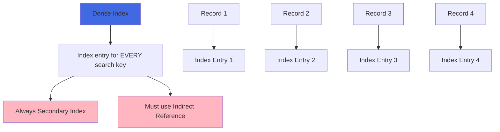

**특징**:

- Index entry exists for every search key value
- Always secondary index (unsorted)
- Must use indirect reference

### 🟨 Sparse Index (희소 인덱스)

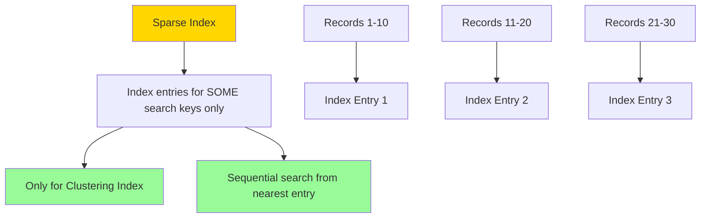

**특징**:

- Index entries exist for only some search key values
- Can only be used with clustering indexes
- Searches start from the nearest index entry and scan sequentially

---

## 🌳 B+ 트리

B+ Trees provide an excellent alternative to sequential indexing and are widely used in modern database systems.

### 📈 장점 vs 단점

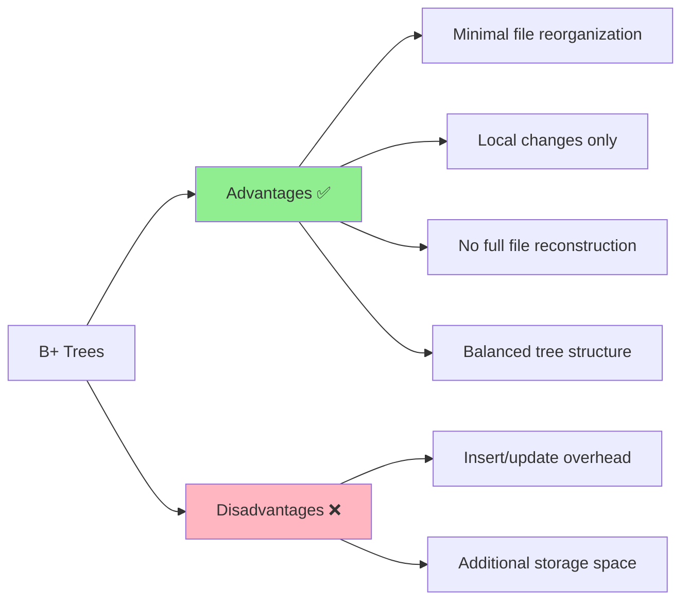

### 🏗️ B+ 트리 구조

**Key Properties**:

- **Balanced**: All paths from root to leaf have equal length
- **Node capacity**: Non-root nodes have n/2 to n children
- **Leaf capacity**: Leaf nodes contain (n-1)/2 to n-1 values

---

## 🔧 해싱 기법

### 🔨 Hash Functions

**정의**: 임의 길이의 데이터를 고정 길이 데이터로 매핑하는 함수.

**예시**: MD5, SHA-256

### 🪣 Bucket Management

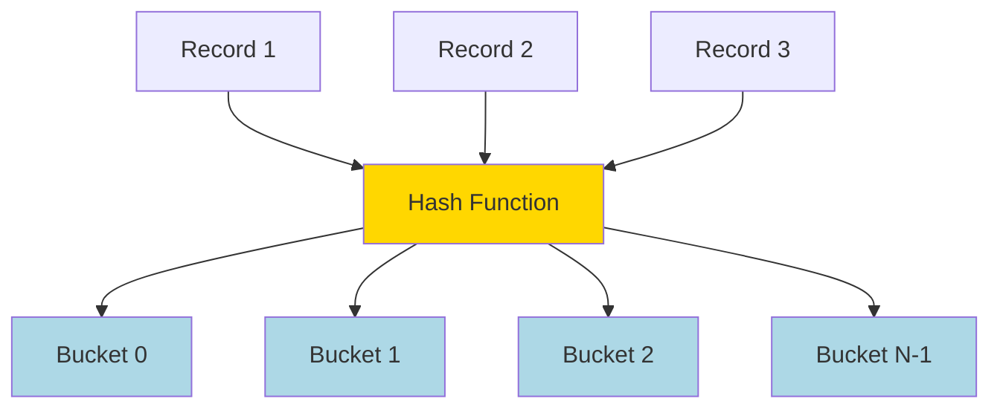

### ⚠️ Bucket Overflow

**원인**:

1. **편향된 분포**: 품질이 낮은 해시 함수로 인해 데이터가 고르게 분포되지 않음
2. **중복 키**: 동일한 검색 키 값을 가진 레코드가 많음

**해결책**: **오버플로 체이닝(Overflow Chaining)**

- 연결 리스트로 오버플로 버킷을 연결
- 이러한 구조를 **클로즈드 해싱(Closed Hashing)** 이라고 함

### 🔄 Dynamic vs Static Hashing

| 항목 | 정적 해싱 | 동적 해싱 |
| --------------------- | ---------------------------- | ----------------------- |
| **버킷 수** | 고정 | 가변 |
| **확장성** | 낮음 | 우수함 |
| **공간 활용도** | 공간 낭비 가능 | 효율적 |
| **재구성** | 주기적 전체 재구성 | 점진적 조정 |

---

## 🚀 Performance Optimization Guidelines

### 🎯 When to Use Each Index Type

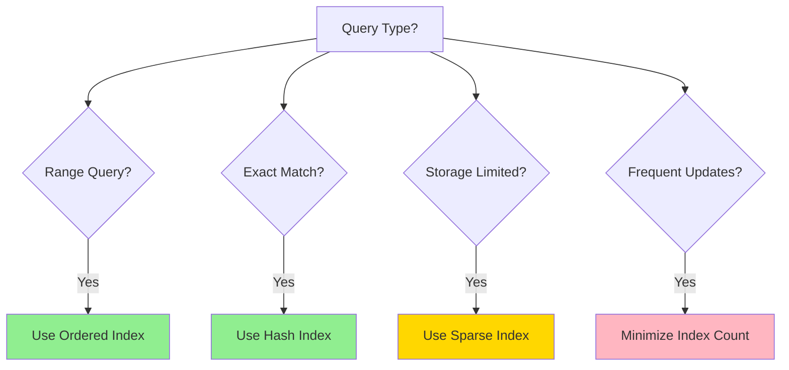

### 📋 모범 사례

1. **🎯 쿼리 패턴에 맞는 적절한 인덱스 유형 선택**
2. **⚖️ 성능과 저장 공간 오버헤드 간 균형**
3. **🔄 인덱스 정기 점검**으로 최적 성능 유지
4. **📊 쿼리 성능 모니터링** 후 인덱싱 전략 조정

---

## 🌐 NoSQL and Alternative Storage

### 📊 NoSQL 개요

**정의**: "Not Only SQL" — 전통적인 관계형 데이터베이스의 한계를 극복하기 위해 설계된 비관계형 데이터베이스 시스템.

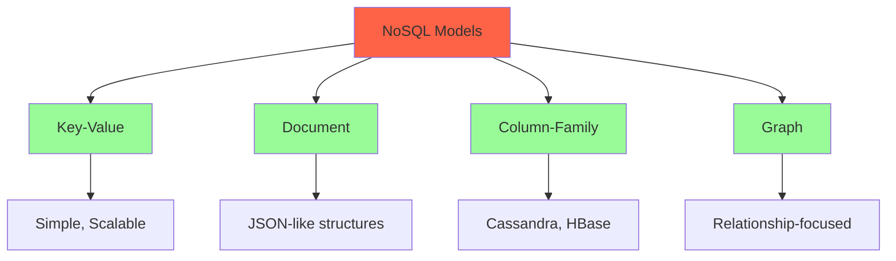

**대표 시스템**: Cassandra, Hadoop, HBase, MongoDB

**주요 특징**:

- **스키마 없음(Schema-less)**: 유연한 데이터 구조
- **분산 처리**: 수평 확장성
- **고가용성**: 장애 허용

---

## 🧪 Interactive Quiz

> **이해도 확인 퀴즈!**

**문제 1**: "급여가 40,000~60,000달러인 모든 직원을 찾으려면 어느 인덱스가 가장 적합한가요?"

<details>
<summary>정답 보기</summary>

**정답**: 순서 인덱스(Ordered Index)

**해설**: 데이터가 정렬된 순서로 저장되어 있어 범위 스캔이 효율적이므로 순서 인덱스가 범위 쿼리에 가장 적합합니다.

</details>

**문제 2**: 해시 인덱스가 순서 인덱스보다 가지는 주요 장점은 무엇인가요?

<details>
<summary>정답 보기</summary>

**정답**: 정확히 일치하는 쿼리에서 더 빠름

**해설**: 해시 인덱스는 특정 키 값의 버킷 위치를 직접 계산할 수 있어 정확히 일치하는 조회 시 평균 O(1)의 속도를 보입니다.

</details>

---

## 🏗️ Relational Database Design

> **"Good database design is the foundation of data integrity and system efficiency"**

## 🎯 Chapter Overview

Database design is like architectural planning for a building. A well-designed database prevents structural problems, ensures efficient use of space, and provides a solid foundation for future expansion. Poor design leads to data redundancy, inconsistency, and maintenance nightmares.

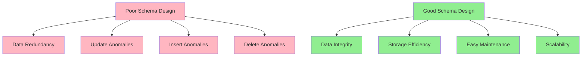

---

## ⚠️ Database Design Problems

### 📊 The Three Anomalies

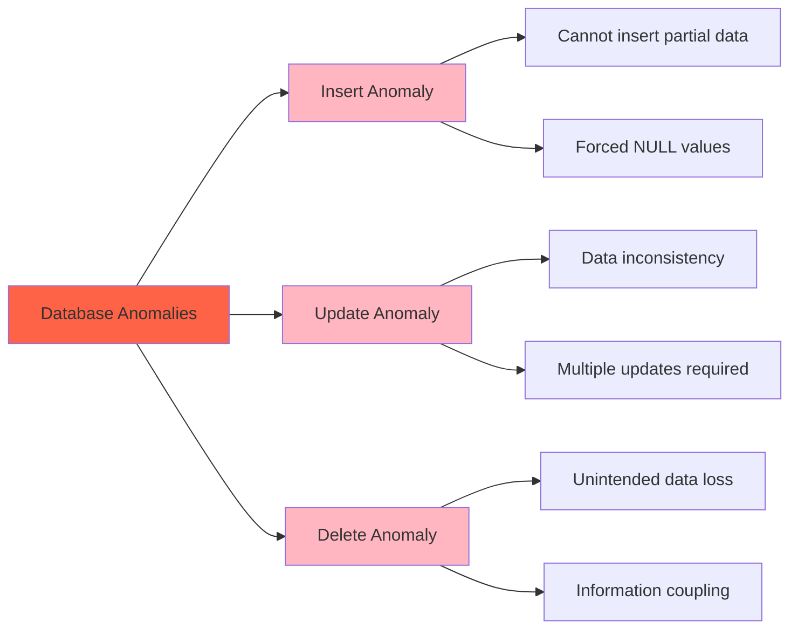

#### 🚫 Insert Anomaly

**Problem**: Cannot insert certain data without having other unrelated data.

**Example**: Cannot add a new department to the system without having at least one instructor assigned to it.

#### 🔄 Update Anomaly

**Problem**: Same information stored in multiple places must be updated everywhere.

**Example**: If a department changes its budget, all instructor records referencing that department must be updated.

#### 🗑️ Delete Anomaly

**Problem**: Deleting one piece of information inadvertently removes other valuable information.

**Example**: Removing the last instructor from a department also removes all department information.

---

## 🔧 The Solution: Normalization

**Definition**: Normalization is the process of decomposing schemas to eliminate anomalies and ensure data integrity.

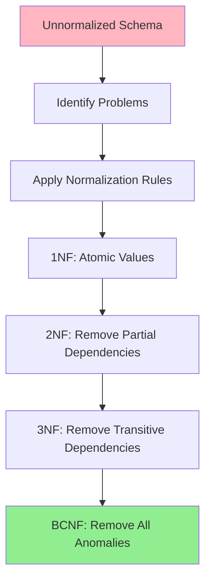

---

## 🎯 Normal Forms

### 1️⃣ First Normal Form (1NF)

**Rule**: All attribute domains must be atomic (indivisible).

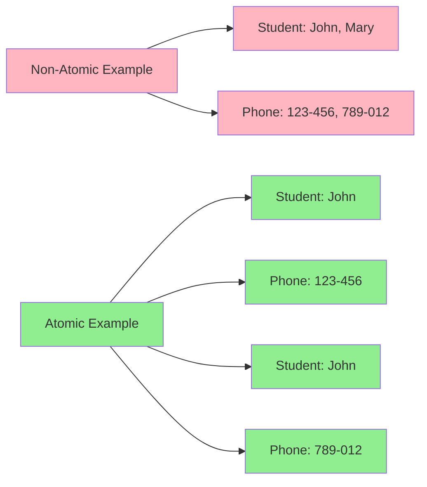

**Examples of Non-Atomic Values**:

- Multiple phone numbers in one field: "123-456-7890, 987-654-3210"
- Composite addresses: "123 Main St, Apt 4B"
- Course codes with embedded meaning: "CS101" (CS = Computer Science, 101 = Level)

### 2️⃣ Functional Dependencies (FD)

**Definition**: An attribute or set of attributes X functionally determines another set of attributes Y if each X value is associated with exactly one Y value.

**Notation**: X → Y (X determines Y)

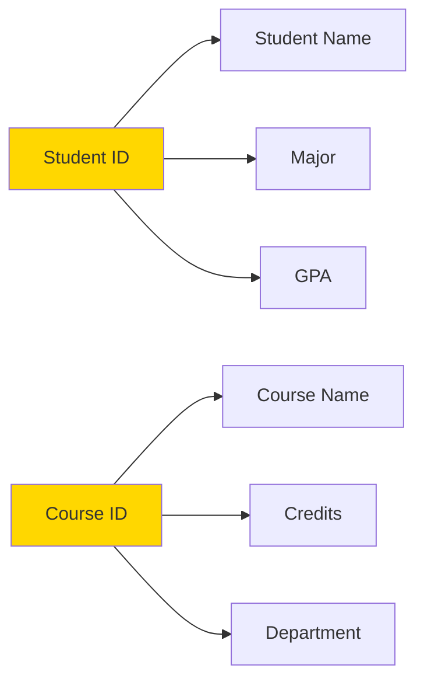

#### 🔍 Armstrong's Axioms

**Three fundamental rules for deriving functional dependencies**:

1. **Reflexivity**: If Y ⊆ X, then X → Y
2. **Augmentation**: If X → Y, then XZ → YZ
3. **Transitivity**: If X → Y and Y → Z, then X → Z

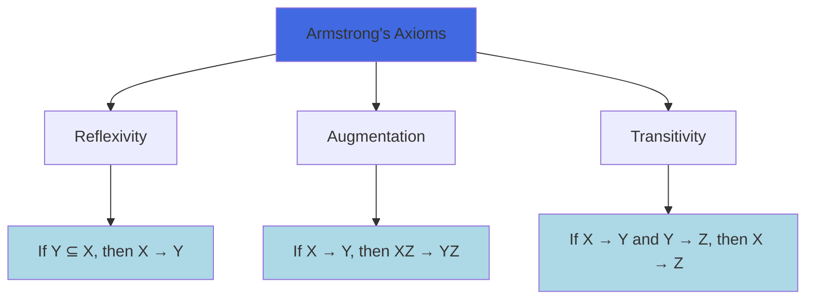

#### 🔄 Closure Computation

**Algorithm to compute attribute closure (α⁺)**:

```
result := α
while (result changes) do
    for each β → γ in F do
        if β ⊆ result then
            result := result ∪ γ
```

**Example**: Given F = {A → B, C → D, A → C} and α = {A}

```mermaid
graph TD
    A[Start: result = {A}] --> B[Apply A → B: result = {A,B}]
    B --> C[Apply A → C: result = {A,B,C}]
    C --> D[Apply C → D: result = {A,B,C,D}]
    D --> E[No more changes: {A}⁺ = {A,B,C,D}]

    style A fill:#FFD700
    style E fill:#90EE90
```

---

## 🏆 Advanced Normal Forms

### 3️⃣ Third Normal Form (3NF)

**Definition**: A relation is in 3NF if, for every functional dependency α → β:

1. α → β is trivial (β ⊆ α), OR
2. α is a superkey, OR
3. Each attribute in β - α is part of some candidate key

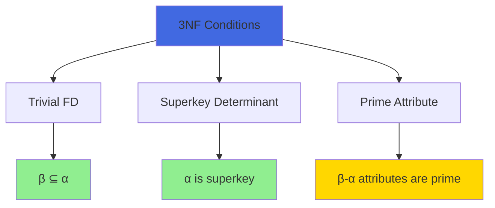

**Advantages**:
✅ Allows some redundancy for dependency preservation  
✅ Can check dependencies without joins  
✅ Guarantees lossless decomposition

### 4️⃣ Boyce-Codd Normal Form (BCNF)

**Definition**: A relation is in BCNF if, for every functional dependency α → β:

1. α → β is trivial (β ⊆ α), OR
2. α is a superkey

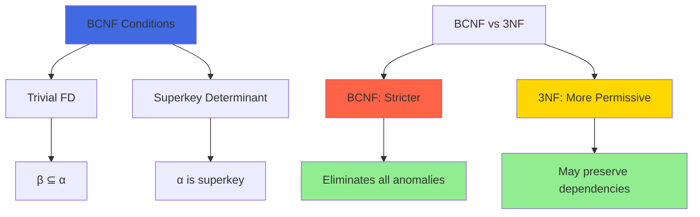

---

## 🔄 Decomposition Process

### 📋 BCNF Decomposition Algorithm

```mermaid
graph TD
    A[Start with Relation R] --> B{BCNF Violation?}
    B -->|No| C[Done: R is in BCNF]
    B -->|Yes| D[Find violating FD: α → β]
    D --> E[Create R1 = α ∪ β]
    E --> F[Create R2 = R - (β - α)]
    F --> G[Recursively check R1, R2]
    G --> B

    style C fill:#90EE90
    style D fill:#FFB6C1
```

**Example Decomposition**:

**Original**: Student_Course(Student_ID, Course_Name, Instructor)  
**FDs**: {Student_ID, Course_Name} → Instructor, Instructor → Course_Name

**Problem**: Instructor → Course_Name violates BCNF (Instructor is not a superkey)

**Solution**:

- R1(Instructor, Course_Name)
- R2(Student_ID, Instructor)

### ⚖️ Design Goals

```mermaid
graph TD
    A[Decomposition Goals] --> B[Lossless Decomposition]
    A --> C[Dependency Preservation]
    A --> D[Eliminate Anomalies]

    B --> B1[R = R1 ⋈ R2 ⋈ ... ⋈ Rn]
    C --> C1[All FDs can be checked locally]
    D --> D1[No insert/update/delete anomalies]

    E[Trade-offs] --> F[BCNF + Lossless]
    E --> G[3NF + Dependency Preservation]

    style B1 fill:#90EE90
    style C1 fill:#FFD700
    style D1 fill:#90EE90
    style F fill:#FF6347
    style G fill:#4169E1
```

---

## 🎮 Hands-On Exercise

### 🧩 Normalization Challenge

**Given Relation**: Employee_Project(EmpID, EmpName, ProjID, ProjName, Hours, DeptName, DeptBudget)

**Functional Dependencies**:

- EmpID → EmpName, DeptName, DeptBudget
- ProjID → ProjName
- EmpID, ProjID → Hours

**Tasks**:

1. Identify the current normal form
2. Decompose to BCNF
3. Check for lossless decomposition

<details>
<summary>💡 Solution</summary>

**Current Form**: 1NF (has update anomalies due to transitive dependencies)

**BCNF Decomposition**:

1. **Employee**(EmpID, EmpName, DeptName, DeptBudget)
2. **Project**(ProjID, ProjName)
3. **Assignment**(EmpID, ProjID, Hours)

**Verification**: Lossless because:

- Employee ∩ Assignment = {EmpID} and EmpID → EmpName, DeptName, DeptBudget
- Project ∩ Assignment = {ProjID} and ProjID → ProjName
</details>

---

## 🔍 Advanced Topics

### 🔄 Denormalization Considerations

Sometimes, **strategic denormalization** can improve performance:

```mermaid
graph LR
    A[Normalized Design] --> B[Multiple Joins]
    B --> C[Query Complexity]

    D[Denormalized Design] --> E[Fewer Joins]
    E --> F[Faster Queries]
    E --> G[Storage Redundancy]

    style A fill:#90EE90
    style D fill:#FFD700
    style C fill:#FFB6C1
    style F fill:#90EE90
    style G fill:#FFB6C1
```

**When to Consider Denormalization**:

- **Read-heavy workloads** with infrequent updates
- **Performance-critical queries** requiring multiple joins
- **Data warehousing** scenarios

### 🪟 Materialized Views

**Alternative to denormalization**: Precomputed query results stored as tables

**Advantages**:
✅ Maintains normalized base tables  
✅ Improves query performance  
✅ Automatic maintenance (in some systems)

**Trade-offs**:
❌ Additional storage overhead  
❌ Maintenance cost on updates  
❌ Potential staleness issues

---

# 🔐 Transaction Management

> **"In the world of databases, transactions are the guardians of data integrity"**

## 🎯 Chapter Overview

Imagine multiple people trying to withdraw money from the same bank account simultaneously, or two customers trying to book the last available airline seat. Without proper transaction management, chaos would ensue! Transactions ensure that database operations are reliable, consistent, and predictable even in concurrent, failure-prone environments.

```mermaid
graph TD
    A[Why Transactions?] --> B[Concurrent Access]
    A --> C[System Failures]
    A --> D[Data Integrity]

    B --> B1[Multiple users, same data]
    B --> B2[Race conditions]
    B --> B3[Lost updates]

    C --> C1[Hardware failures]
    C --> C2[Software crashes]
    C --> C3[Network issues]

    D --> D1[Business rules]
    D --> D2[Consistency constraints]
    D --> D3[Referential integrity]

    style A fill:#FF6347
    style B fill:#FFB6C1
    style C fill:#FFB6C1
    style D fill:#90EE90
```

### 🎓 Learning Objectives

By the end of this section, you will be able to:

✅ **Define** transactions and explain their importance  
✅ **Apply** ACID properties to real-world scenarios  
✅ **Analyze** concurrency problems and their solutions  
✅ **Implement** transaction control in SQL  
✅ **Design** recovery strategies for system failures  
✅ **Evaluate** different isolation levels and their trade-offs

---

## 🏗️ What is a Transaction?

**Definition**: A transaction is a logical unit of work that contains one or more SQL statements. All statements in a transaction are executed as a single, indivisible unit.

### 🌟 Real-World Example: Bank Transfer

```mermaid
sequenceDiagram
    participant User
    participant Database
    participant Account_A
    participant Account_B

    User->>Database: BEGIN TRANSACTION
    User->>Account_A: Debit $100
    Account_A-->>Database: Balance: $500 → $400
    User->>Account_B: Credit $100
    Account_B-->>Database: Balance: $300 → $400
    User->>Database: COMMIT

    Note over Database: Transaction Successful ✅
```

**Transaction Steps**:

1. **BEGIN** - Start the transaction
2. **Debit from Account A** - Subtract $100
3. **Credit to Account B** - Add $100
4. **COMMIT** - Make changes permanent

**What if something goes wrong?**

```mermaid
sequenceDiagram
    participant User
    participant Database
    participant Account_A
    participant Account_B

    User->>Database: BEGIN TRANSACTION
    User->>Account_A: Debit $100
    Account_A-->>Database: Balance: $500 → $400
    User->>Account_B: Credit $100
    Note over Account_B: ❌ SYSTEM FAILURE
    User->>Database: ROLLBACK
    Account_A-->>Database: Balance: $400 → $500

    Note over Database: Transaction Rolled Back 🔄
```

---

## 🏛️ ACID Properties

The cornerstone of transaction management - **ACID** properties ensure database reliability:

```mermaid
graph TD
    A[ACID Properties] --> B[Atomicity 🎯]
    A --> C[Consistency 🔄]
    A --> D[Isolation 🏝️]
    A --> E[Durability 💾]

    B --> B1[All or Nothing]
    B --> B2[No partial execution]

    C --> C1[Valid state transitions]
    C --> C2[Integrity constraints]

    D --> D1[Concurrent isolation]
    D --> D2[No interference]

    E --> E1[Permanent changes]
    E --> E2[Survive failures]

    style A fill:#4169E1
    style B fill:#FF6347
    style C fill:#32CD32
    style D fill:#FFD700
    style E fill:#9370DB
```

### 🎯 Atomicity (원자성)

**Principle**: "All or Nothing" - Either all operations in a transaction complete successfully, or none of them do.

```mermaid
graph LR
    A[Transaction T1] --> B{All Operations Successful?}
    B -->|Yes| C[COMMIT - All Changes Applied]
    B -->|No| D[ROLLBACK - No Changes Applied]

    E[Operation 1: ✅] --> F[Operation 2: ✅]
    F --> G[Operation 3: ✅]
    G --> H[Transaction Succeeds]

    I[Operation 1: ✅] --> J[Operation 2: ❌]
    J --> K[Entire Transaction Fails]

    style C fill:#90EE90
    style D fill:#FFB6C1
    style H fill:#90EE90
    style K fill:#FFB6C1
```

**Implementation Mechanisms**:

- **Write-Ahead Logging (WAL)**: Log changes before applying them
- **Shadow Paging**: Keep original pages until commit
- **Rollback Segments**: Store undo information

### 🔄 Consistency (일관성)

**Principle**: Transactions move the database from one consistent state to another consistent state.

```mermaid
graph TD
    A[Consistent State 1] --> B[Transaction Execution]
    B --> C[Consistent State 2]

    D[Example: Bank Database] --> E[Total Money = $1000]
    E --> F[Transfer $100: A→B]
    F --> G[Total Money = $1000]

    H[Integrity Constraints] --> I[Primary Keys]
    H --> J[Foreign Keys]
    H --> K[Check Constraints]
    H --> L[Business Rules]

    style A fill:#90EE90
    style C fill:#90EE90
    style E fill:#90EE90
    style G fill:#90EE90
```

**일관성의 유형**:

- **개체 무결성**: 기본 키 제약
- **참조 무결성**: 외래 키 제약
- **도메인 무결성**: 데이터 타입 및 체크 제약
- **사용자 정의 무결성**: 비즈니스 규칙 제약

### 🏝️ Isolation (고립성)

**원칙**: 동시 실행되는 트랜잭션은 서로 간섭해서는 안 됩니다. 각 트랜잭션은 고립되어 실행되는 것처럼 보여야 합니다.

```mermaid
graph TD
    A[Multiple Concurrent Transactions] --> B[T1: Transfer Money]
    A --> C[T2: Calculate Interest]
    A --> D[T3: Generate Report]

    B --> E[Sees Consistent Snapshot]
    C --> F[Sees Consistent Snapshot]
    D --> G[Sees Consistent Snapshot]

    E --> H[No Interference]
    F --> H
    G --> H

    style H fill:#90EE90
```

**고립성이 보장되지 않을 때 발생하는 동시성 문제**:

- **더티 리드(Dirty Read)**: 커밋되지 않은 변경 내용을 읽음
- **논리적 일관성 미보장(Non-Repeatable Read)**: 동일 쿼리가 서로 다른 결과를 반환
- **팬텀 리드(Phantom Read)**: 범위 쿼리에서 새로운 행이 나타남
- **손실된 업데이트(Lost Update)**: 동시 업데이트가 서로를 덮어씀

### 💾 Durability (지속성)

**원칙**: 트랜잭션이 커밋되면 그 변경 사항은 영구적이며 시스템 장애 후에도 유지됩니다.

```mermaid
graph TD
    A[Transaction Commits] --> B[Changes Written to Disk]
    B --> C[System Failure Occurs]
    C --> D[System Restarts]
    D --> E[Changes Still Present]

    F[Implementation Methods] --> G[Write-Ahead Logging]
    F --> H[Force-Write at Commit]
    F --> I[Redundant Storage]
    F --> J[Backup & Recovery]

    style E fill:#90EE90
    style G fill:#ADD8E6
    style H fill:#ADD8E6
    style I fill:#ADD8E6
    style J fill:#ADD8E6
```

---

## 🔄 Transaction States

트랜잭션의 생명주기 이해:

```mermaid
stateDiagram-v2
    [*] --> Active: BEGIN TRANSACTION
    Active --> PartiallyCommitted: COMMIT issued
    Active --> Failed: Error occurs
    PartiallyCommitted --> Committed: Write to disk complete
    PartiallyCommitted --> Failed: Write fails
    Failed --> Aborted: ROLLBACK complete
    Committed --> [*]: Transaction complete
    Aborted --> [*]: Transaction complete

    note right of Active: Executing operations
    note right of PartiallyCommitted: Waiting for disk write
    note right of Committed: Changes permanent
    note right of Aborted: Changes undone
```

### 📊 State Transition Examples

| 상태 | 설명 | 예시 |
| ----------------------- | -------------------------------------------- | --------------------------------- |
| **Active** | 트랜잭션이 실행 중 | UPDATE 문 실행 중 |
| **Partially Committed** | 마지막 명령 실행 완료, 커밋 대기 중 | COMMIT 명령 실행, 디스크 쓰기 대기 |
| **Committed** | 트랜잭션이 정상적으로 완료됨 | 변경 사항이 디스크에 기록됨 |
| **Failed** | 정상 실행이 더 이상 불가능 | 제약 조건 위반 탐지 |
| **Aborted** | 트랜잭션이 롤백됨 | 모든 변경이 취소됨 |

---

## 🚦 Concurrency Control

### 🎭 The Concurrency Challenge

When multiple transactions run simultaneously, various problems can occur:

```mermaid
graph TD
    A[Concurrency Problems] --> B[Lost Update Problem]
    A --> C[Dirty Read Problem]
    A --> D[Non-Repeatable Read]
    A --> E[Phantom Read Problem]

    B --> B1[T1 and T2 both update X]
    B --> B2[One update overwrites the other]

    C --> C1[T1 reads uncommitted data from T2]
    C --> C2[T2 later rolls back]

    D --> D1[T1 reads X twice]
    D --> D2[T2 modifies X between reads]

    E --> E1[T1 reads range of rows]
    E --> E2[T2 inserts new rows in range]

    style A fill:#FF6347
    style B fill:#FFB6C1
    style C fill:#FFB6C1
    style D fill:#FFB6C1
    style E fill:#FFB6C1
```

### 🔒 Locking Mechanisms

**Lock Types**:

```mermaid
graph TD
    A[Lock Types] --> B[Shared Lock S]
    A --> C[Exclusive Lock X]

    B --> B1[Multiple readers allowed]
    B --> B2[No writers allowed]

    C --> C1[Single writer only]
    C --> C2[No other readers or writers]

    D[Lock Compatibility Matrix]
    D --> E[S + S = ✅ Compatible]
    D --> F[S + X = ❌ Incompatible]
    D --> G[X + S = ❌ Incompatible]
    D --> H[X + X = ❌ Incompatible]

    style B fill:#90EE90
    style C fill:#FF6347
    style E fill:#90EE90
    style F fill:#FFB6C1
    style G fill:#FFB6C1
    style H fill:#FFB6C1
```

### 🔄 Two-Phase Locking (2PL)

**Protocol**: Ensures serializability by requiring transactions to acquire all locks before releasing any.

```mermaid
graph TD
    A[Two-Phase Locking] --> B[Growing Phase]
    A --> C[Shrinking Phase]

    B --> B1[Acquire locks only]
    B --> B2[No lock releases]

    C --> C1[Release locks only]
    C --> C2[No new lock acquisitions]

    D[Timeline Example] --> E[Acquire Lock A]
    E --> F[Acquire Lock B]
    F --> G[Lock Point - Switch to Shrinking]
    G --> H[Release Lock A]
    H --> I[Release Lock B]

    style B fill:#90EE90
    style C fill:#FFD700
    style G fill:#FF6347
```

**Advantages**: Guarantees serializability  
**Disadvantages**: Can cause deadlocks, reduced concurrency

---

## 🔍 Isolation Levels

SQL standard defines four isolation levels, each providing different trade-offs between consistency and performance:

```mermaid
graph TD
    A[Isolation Levels] --> B[Read Uncommitted]
    A --> C[Read Committed]
    A --> D[Repeatable Read]
    A --> E[Serializable]

    B --> B1[Allows: All anomalies]
    B --> B2[Performance: Highest]

    C --> C1[Prevents: Dirty reads]
    C --> C2[Allows: Non-repeatable, phantom reads]

    D --> D1[Prevents: Dirty, non-repeatable reads]
    D --> D2[Allows: Phantom reads]

    E --> E1[Prevents: All anomalies]
    E --> E2[Performance: Lowest]

    style B fill:#FFB6C1
    style C fill:#FFD700
    style D fill:#90EE90
    style E fill:#4169E1
```

### 📊 Isolation Level Comparison

| Isolation Level      | Dirty Read   | Non-Repeatable Read | Phantom Read | Performance |
| -------------------- | ------------ | ------------------- | ------------ | ----------- |
| **Read Uncommitted** | ❌ Possible  | ❌ Possible         | ❌ Possible  | 🚀 Highest  |
| **Read Committed**   | ✅ Prevented | ❌ Possible         | ❌ Possible  | 🏃 High     |
| **Repeatable Read**  | ✅ Prevented | ✅ Prevented        | ❌ Possible  | 🚶 Medium   |
| **Serializable**     | ✅ Prevented | ✅ Prevented        | ✅ Prevented | 🐌 Lowest   |

### 💡 Practical Usage Guidelines

```mermaid
graph TD
    A[Choose Isolation Level] --> B{Data Criticality?}
    B -->|High| C[Serializable/Repeatable Read]
    B -->|Medium| D[Read Committed]
    B -->|Low| E[Read Uncommitted]

    F{Concurrent Load?} --> G[High: Lower isolation]
    F --> H[Low: Higher isolation]

    style C fill:#90EE90
    style D fill:#FFD700
    style E fill:#FFB6C1
```

---

## 💾 Recovery Management

### 🔥 Failure Types

```mermaid
graph TD
    A[Database Failures] --> B[Transaction Failures]
    A --> C[System Failures]
    A --> D[Media Failures]

    B --> B1[Logical errors]
    B --> B2[Constraint violations]
    B --> B3[Deadlocks]

    C --> C1[Power outages]
    C --> C2[Software crashes]
    C --> C3[Operating system failures]

    D --> D1[Disk crashes]
    D --> D2[Tape failures]
    D --> D3[Catastrophic events]

    style B fill:#FFD700
    style C fill:#FF6347
    style D fill:#8B0000
```

### 📝 Write-Ahead Logging (WAL)

**Core Principle**: Log changes before applying them to the database.

```mermaid
sequenceDiagram
    participant T as Transaction
    participant L as Log
    participant D as Database

    T->>L: Write BEGIN record
    T->>L: Write UPDATE record (before image)
    T->>D: Update data page
    T->>L: Write COMMIT record
    L->>D: Force log to disk

    Note over L,D: Changes are recoverable
```

**Log Record Types**:

- **Start**: Transaction begins
- **Update**: Before and after images
- **Commit**: Transaction completes
- **Abort**: Transaction rolls back
- **Checkpoint**: Recovery point

### 🔄 Recovery Algorithms

#### ARIES (Algorithm for Recovery and Isolation Exploiting Semantics)

```mermaid
graph TD
    A[ARIES Recovery] --> B[Analysis Phase]
    A --> C[Redo Phase]
    A --> D[Undo Phase]

    B --> B1[Scan log from last checkpoint]
    B --> B2[Identify active transactions]
    B --> B3[Build dirty page table]

    C --> C1[Redo all logged operations]
    C --> C2[Restore database to failure point]

    D --> D1[Undo uncommitted transactions]
    D --> D2[Restore consistent state]

    style B fill:#ADD8E6
    style C fill:#90EE90
    style D fill:#FFD700
```

---

## 🛠️ SQL Transaction Control

### 📝 Basic Transaction Commands

```sql
-- Start a transaction
BEGIN TRANSACTION;
-- or
START TRANSACTION;

-- Commit changes
COMMIT;

-- Rollback changes
ROLLBACK;

-- Set savepoint
SAVEPOINT sp1;

-- Rollback to savepoint
ROLLBACK TO sp1;
```

### 🎯 Practical Examples

#### Example 1: Bank Transfer Transaction

```sql
BEGIN TRANSACTION;

-- Check account balances
SELECT balance FROM accounts WHERE account_id IN (101, 102);

-- Debit from account 101
UPDATE accounts
SET balance = balance - 500
WHERE account_id = 101 AND balance >= 500;

-- Check if debit succeeded
IF @@ROWCOUNT = 0
BEGIN
    ROLLBACK;
    RETURN;
END

-- Credit to account 102
UPDATE accounts
SET balance = balance + 500
WHERE account_id = 102;

-- Log the transaction
INSERT INTO transaction_log (from_account, to_account, amount, timestamp)
VALUES (101, 102, 500, GETDATE());

COMMIT TRANSACTION;
```

#### Example 2: Order Processing with Savepoints

```sql
BEGIN TRANSACTION;

-- Insert order
INSERT INTO orders (customer_id, order_date, total_amount)
VALUES (12345, GETDATE(), 150.00);

DECLARE @order_id INT = SCOPE_IDENTITY();

SAVEPOINT order_items;

-- Insert order items
INSERT INTO order_items (order_id, product_id, quantity, price)
VALUES (@order_id, 1001, 2, 50.00);

INSERT INTO order_items (order_id, product_id, quantity, price)
VALUES (@order_id, 1002, 1, 50.00);

-- Update inventory
UPDATE products
SET stock_quantity = stock_quantity - 2
WHERE product_id = 1001 AND stock_quantity >= 2;

IF @@ROWCOUNT = 0
BEGIN
    ROLLBACK TO order_items;
    -- Could partially fulfill order or cancel completely
    ROLLBACK;
    RETURN;
END

UPDATE products
SET stock_quantity = stock_quantity - 1
WHERE product_id = 1002 AND stock_quantity >= 1;

COMMIT TRANSACTION;
```

### ⚙️ Setting Isolation Levels

```sql
-- Set isolation level for current session
SET TRANSACTION ISOLATION LEVEL READ COMMITTED;

-- Set for specific transaction
BEGIN TRANSACTION;
SET TRANSACTION ISOLATION LEVEL REPEATABLE READ;
-- ... transaction operations ...
COMMIT;

-- Table hints for specific queries
SELECT * FROM products WITH (NOLOCK);  -- READ UNCOMMITTED
SELECT * FROM products WITH (HOLDLOCK); -- REPEATABLE READ
```

---

## 🧠 Advanced Concepts

### ⚡ Optimistic vs Pessimistic Concurrency Control

```mermaid
graph LR
    A[Concurrency Control Strategies] --> B[Pessimistic]
    A --> C[Optimistic]

    B --> B1[Assume conflicts will occur]
    B --> B2[Lock early and often]
    B --> B3[Better for high contention]

    C --> C1[Assume conflicts are rare]
    C --> C2[Check for conflicts at commit]
    C --> C3[Better for low contention]

    style B fill:#FFB6C1
    style C fill:#90EE90
```

**Optimistic Locking Example**:

```sql
-- Read with version number
SELECT id, name, version FROM employees WHERE id = 100;
-- version = 42

-- Later, update with version check
UPDATE employees
SET name = 'John Smith', version = version + 1
WHERE id = 100 AND version = 42;

-- If @@ROWCOUNT = 0, someone else modified the record
```

### 🕸️ Deadlock Detection and Prevention

```mermaid
graph TD
    A[Deadlock Scenarios] --> B[T1 waits for T2]
    A --> C[T2 waits for T1]
    B --> D[Circular Wait = Deadlock]
    C --> D

    E[Detection Methods] --> F[Wait-for Graph]
    E --> G[Timeout-based]
    E --> H[Victim Selection]

    I[Prevention Strategies] --> J[Ordered Locking]
    I --> K[Timeout Limits]
    I --> L[Deadlock Priority]

    style D fill:#FF6347
    style F fill:#ADD8E6
    style G fill:#ADD8E6
    style H fill:#ADD8E6
```

---

## 🧪 Interactive Scenarios

### 🎮 Scenario 1: Lost Update Problem

**Setup**: Two cashiers processing returns simultaneously

```mermaid
sequenceDiagram
    participant C1 as Cashier 1
    participant C2 as Cashier 2
    participant DB as Database

    DB->>C1: Read inventory: 100 units
    DB->>C2: Read inventory: 100 units
    C1->>DB: Return 5 units (100 + 5 = 105)
    C2->>DB: Return 3 units (100 + 3 = 103)

    Note over DB: Final value: 103 ❌<br/>Should be: 108 ✅
```

**Question**: How would you prevent this lost update problem?

<details>
<summary>💡 Solution</summary>

**Solutions**:

1. **Locking**: Use exclusive locks on inventory records
2. **Optimistic Concurrency**: Use version numbers or timestamps
3. **Atomic Operations**: Use SQL UPDATE with expressions

```sql
-- Solution 1: Explicit Locking
BEGIN TRANSACTION;
SELECT inventory_count FROM products WITH (UPDLOCK) WHERE id = 1001;
UPDATE products SET inventory_count = inventory_count + 5 WHERE id = 1001;
COMMIT;

-- Solution 2: Atomic Update
UPDATE products
SET inventory_count = inventory_count + 5
WHERE id = 1001;
```

</details>

### 🎮 Scenario 2: Phantom Read Detection

**Setup**: Manager generating reports while new employees are being added

<details>
<summary>💭 Think About It</summary>

At REPEATABLE READ isolation level:

- The same SELECT will return the same rows
- But new rows can still appear (phantoms)
- This affects aggregate functions like COUNT, SUM

**Question**: What isolation level would prevent phantom reads?

</details>

---

## 📊 Performance Considerations

### 🚀 Transaction Optimization Tips

```mermaid
graph TD
    A[Transaction Performance] --> B[Keep Transactions Short]
    A --> C[Minimize Lock Duration]
    A --> D[Use Appropriate Isolation]
    A --> E[Batch Operations]

    B --> B1[Faster commit times]
    B --> B2[Reduced lock contention]

    C --> C1[Acquire locks late]
    C --> C2[Release locks early]

    D --> D1[Balance consistency vs performance]
    D --> D2[Consider read patterns]

    E --> E1[Reduce transaction overhead]
    E --> E2[Improve throughput]

    style A fill:#4169E1
    style B1 fill:#90EE90
    style B2 fill:#90EE90
    style C1 fill:#90EE90
    style C2 fill:#90EE90
```

### 📈 Monitoring Transaction Health

**Key Metrics to Track**:

- **Transaction Duration**: Average and maximum time
- **Lock Wait Time**: Time spent waiting for locks
- **Deadlock Frequency**: Number of deadlocks per hour
- **Rollback Ratio**: Percentage of transactions rolled back
- **Log Growth Rate**: Size of transaction log

---

## 🧪 Hands-On Lab Exercise

### 🔬 Transaction Isolation Experiment

**Objective**: Observe different isolation levels in action

**Setup**:

```sql
-- Create test table
CREATE TABLE accounts (
    id INT PRIMARY KEY,
    name VARCHAR(50),
    balance DECIMAL(10,2)
);

INSERT INTO accounts VALUES
(1, 'Alice', 1000.00),
(2, 'Bob', 500.00);
```

**Experiment Steps**:

1. **Session 1** (READ COMMITTED):

```sql
SET TRANSACTION ISOLATION LEVEL READ COMMITTED;
BEGIN TRANSACTION;
SELECT balance FROM accounts WHERE id = 1;
-- Wait for Session 2 to make changes
SELECT balance FROM accounts WHERE id = 1;
COMMIT;
```

2. **Session 2**:

```sql
BEGIN TRANSACTION;
UPDATE accounts SET balance = 1500.00 WHERE id = 1;
-- Session 1 will see the old value until we commit
COMMIT;
```

**Expected Results**:

- Session 1 will see different values in the two SELECT statements
- This demonstrates non-repeatable read

**Try with REPEATABLE READ**: What changes?

---

# 🌐 Application Development

> **"Bridging databases and real-world applications: design, patterns, and best practices"**

## 🎯 Chapter Overview

Modern applications rely on robust database integration for reliability, scalability, and maintainability. This section explores how to design, develop, and optimize database-driven applications, focusing on architecture, security, and real-world development patterns.

```mermaid
graph TD
    A[Application Development] --> B[Architecture]
    A --> C[Data Access Layer]
    A --> D[ORMs]
    A --> E[Security]
    A --> F[Testing]
    A --> G[Performance]

    B --> B1[Client-Server]
    B --> B2[Microservices]
    B --> B3[Serverless]

    C --> C1[Direct SQL]
    C --> C2[Stored Procedures]
    C --> C3[APIs]

    D --> D1[ActiveRecord]
    D --> D2[Data Mapper]
    D --> D3[Query Builders]

    E --> E1[SQL Injection]
    E --> E2[Access Control]
    E --> E3[Encryption]

    F --> F1[Unit Testing]
    F --> F2[Integration Testing]
    F --> F3[Mocking]

    G --> G1[Connection Pooling]
    G --> G2[Caching]
    G --> G3[Scalability]

    style A fill:#4169E1
    style B fill:#32CD32
    style C fill:#FFD700
    style D fill:#FF6347
    style E fill:#9370DB
    style F fill:#FF1493
    style G fill:#90EE90
```

### 🎓 Learning Objectives

By the end of this section, you will be able to:

✅ **Design** scalable, maintainable database-driven applications  
✅ **Implement** secure data access patterns  
✅ **Leverage** ORMs and query builders effectively  
✅ **Test** database logic with confidence  
✅ **Optimize** for performance and scalability

---

## 🏗️ Application Architecture Patterns

### 🏢 Client-Server vs Microservices vs Serverless

```mermaid
graph LR
    A[Client] --> B[API Server]
    B --> C[Database]
    B --> D[Cache]
    B --> E[Message Queue]

    F[Microservice 1] --> G[DB 1]
    H[Microservice 2] --> I[DB 2]
    J[Microservice 3] --> K[DB 3]

    L[Serverless Function] --> M[API Gateway]
    M --> N[Database]

    style B fill:#4169E1
    style F fill:#FFD700
    style H fill:#FFD700
    style J fill:#FFD700
    style L fill:#90EE90
```

- **Client-Server**: Centralized API, single DB, easier to manage
- **Microservices**: Decentralized, each service owns its DB, enables independent scaling
- **Serverless**: Event-driven, stateless, scales automatically

---

## 🔗 Data Access Strategies

### 🛠️ Direct SQL vs ORMs vs Query Builders

| Approach          | Pros                         | Cons                    | Use Case                            |
| ----------------- | ---------------------------- | ----------------------- | ----------------------------------- |
| **Direct SQL**    | Full control, performance    | Verbose, error-prone    | Complex queries, performance tuning |
| **ORM**           | Productivity, abstraction    | May hide inefficiencies | Rapid development, CRUD apps        |
| **Query Builder** | Flexible, safer than raw SQL | Can be verbose          | Dynamic queries, safer user input   |

**주요 ORM**: SQLAlchemy(Python), Hibernate(Java), Entity Framework(.NET), Sequelize(Node.js)

**예시: SQL 인젝션 방지**

```python
# Python with parameterized queries
cursor.execute('SELECT * FROM users WHERE username = %s', (username,))
```

---

## 🛡️ 보안 모범 사례

- **파라미터화된 쿼리 사용**: SQL 인젝션 방지
- **데이터베이스 권한 최소화**: 애플리케이션 사용자 권한 제한
- **민감 데이터 암호화**: 저장 시와 전송 시 모두 암호화
- **모든 사용자 입력 검증 및 정제**
- **RBAC(역할 기반 접근 제어) 구현**
- **데이터베이스 접근 모니터링 및 로깅**

```mermaid
graph TD
    A[Security Risks] --> B[SQL Injection]
    A --> C[Privilege Escalation]
    A --> D[Data Leakage]
    A --> E[Weak Encryption]

    B --> B1[Use parameterized queries]
    C --> C1[Principle of least privilege]
    D --> D1[Audit logs]
    E --> E1[Strong encryption algorithms]

    style A fill:#FF6347
    style B1 fill:#90EE90
    style C1 fill:#90EE90
    style D1 fill:#90EE90
    style E1 fill:#90EE90
```

---

## 🧪 데이터베이스 애플리케이션 테스트

- **단위 테스트(Unit Testing)**: 로직을 격리하여 테스트(데이터베이스 호출 모킹)
- **통합 테스트(Integration Testing)**: 실제 DB 또는 인메모리 DB로 테스트
- **테스트 데이터 관리**: 픽스처, 팩토리 혹은 시드 스크립트 사용
- **트랜잭션 롤백**: 각 테스트 후 롤백하여 DB를 깨끗하게 유지

**예시: pytest와 SQLAlchemy를 사용한 Python 테스트**

```python
import pytest
from sqlalchemy import create_engine
from sqlalchemy.orm import sessionmaker
from myapp.models import Base, User

@pytest.fixture(scope='function')
def db_session():
    engine = create_engine('sqlite:///:memory:')
    Base.metadata.create_all(engine)
    Session = sessionmaker(bind=engine)
    session = Session()
    yield session
    session.close()

def test_create_user(db_session):
    user = User(username='alice')
    db_session.add(user)
    db_session.commit()
    assert db_session.query(User).filter_by(username='alice').count() == 1
```

---

## 🚀 성능 및 확장성

- **커넥션 풀링(Connection Pooling)**: 효율성을 위해 DB 연결 재사용
- **캐싱(Caching)**: 자주 사용되는 쿼리에 Redis/Memcached 사용
- **대량 연산(Bulk Operations)**: 빠른 처리를 위한 일괄 삽입/업데이트
- **비동기 처리(Asynchronous Processing)**: 무거운 작업을 백그라운드 워커로 오프로드
- **데이터베이스 샤딩(Database Sharding)**: 확장을 위해 데이터를 여러 DB로 분산

```mermaid
graph TD
    A[Performance] --> B[Connection Pooling]
    A --> C[Caching]
    A --> D[Bulk Operations]
    A --> E[Async Processing]
    A --> F[Sharding]

    style A fill:#4169E1
    style B fill:#90EE90
    style C fill:#FFD700
    style D fill:#32CD32
    style E fill:#FF6347
    style F fill:#9370DB
```

---

## 🧪 실습 과제

> **시나리오**: 수백만 명의 사용자와 트랜잭션을 처리할 수 있는 확장 가능하고 안전한 웹 앱을 설계해야 합니다.

**질문**:

1. 어떤 아키텍처를 선택하겠으며, 그 이유는 무엇인가요?
2. 데이터 액세스 계층을 어떻게 보호하시겠습니까?
3. 어떤 성능 최적화를 구현하시겠습니까?

<details>
<summary>💡 Sample Solution</summary>

- **아키텍처**: 확장성과 장애 격리를 위해 각 서비스별 독립 DB를 갖는 마이크로서비스
- **보안**: 파라미터화 쿼리, RBAC, 암호화, 감사 로깅
- **성능**: 커넥션 풀링, 캐싱, 비동기 처리, 샤딩
</details>

---

## 🔗 핵심 정리

```mermaid
mindmap
  root((App Development))
    Architecture
      Client-Server
      Microservices
      Serverless
    Data Access
      Direct SQL
      ORM
      Query Builder
    Security
      SQL Injection
      RBAC
      Encryption
    Testing
      Unit
      Integration
      Rollback
    Performance
      Pooling
      Caching
      Sharding
```

### 🎯 Best Practices

1. **처음부터 확장성과 보안을 고려하여 설계**
2. **유지보수를 위해 ORM과 쿼리 빌더 활용**
3. **데이터베이스 로직을 철저히 테스트**
4. **성능을 지속적으로 모니터링하고 최적화**
5. **데이터 접근 패턴과 보안 정책을 문서화**

---

# ⚙️ MySQL 특화 기능

> **"MySQL의 잠재력 활용: 고유 기능, 구문, 최적화 팁"**

## 🎯 Chapter Overview

MySQL은 가장 인기 있는 오픈 소스 관계형 데이터베이스 중 하나입니다. 이 섹션에서는 실무 중심으로 MySQL 전용 구문, 스토리지 엔진, 문자 집합, 성능 최적화 기법을 살펴봅니다.

```mermaid
graph TD
    A[MySQL Features] --> B[Syntax]
    A --> C[Storage Engines]
    A --> D[Character Sets]
    A --> E[Indexes]
    A --> F[Optimization]
    A --> G[Replication]

    B --> B1[Auto Increment]
    B --> B2[Limit/Offset]
    B --> B3[IF/CASE]

    C --> C1[InnoDB]
    C --> C2[MyISAM]
    C --> C3[Memory]

    D --> D1[UTF-8]
    D --> D2[Collation]
    D --> D3[Charset Conversion]

    E --> E1[Fulltext]
    E --> E2[Spatial]
    E --> E3[Unique]

    F --> F1[Query Hints]
    F --> F2[EXPLAIN]
    F --> F3[Optimizer Switch]

    G --> G1[Master-Slave]
    G --> G2[GTID]
    G --> G3[Failover]

    style A fill:#4169E1
    style B fill:#FFD700
    style C fill:#32CD32
    style D fill:#FF6347
    style E fill:#9370DB
    style F fill:#90EE90
    style G fill:#FF1493
```

### 🎓 Learning Objectives

By the end of this section, you will be able to:

✅ **작성**: 고급 구문을 활용한 MySQL 전용 SQL  
✅ **선택**: 워크로드에 맞는 스토리지 엔진  
✅ **설정**: 글로벌 앱을 위한 문자 집합과 정렬  
✅ **최적화**: MySQL 도구와 기능을 활용한 쿼리 최적화  
✅ **활용**: 고가용성을 위한 복제 및 백업

---

## 📝 MySQL 구문 하이라이트

- **AUTO_INCREMENT**: 자동 증가 기본 키
- **LIMIT/OFFSET**: 페이지네이션 및 결과 제한
- **IF/CASE**: 쿼리 내 조건 로직
- **REPLACE INTO**: 한 문장으로 삽입 또는 업데이트
- **INSERT IGNORE**: 중복 키 오류 무시
- **ON DUPLICATE KEY UPDATE**: Upsert 패턴

**Example**:

```sql
CREATE TABLE users (
    id INT AUTO_INCREMENT PRIMARY KEY,
    username VARCHAR(50) NOT NULL UNIQUE,
    email VARCHAR(100),
    created_at TIMESTAMP DEFAULT CURRENT_TIMESTAMP
);

-- Pagination
SELECT * FROM users ORDER BY created_at DESC LIMIT 10 OFFSET 20;

-- Upsert
INSERT INTO users (username, email) VALUES ('alice', 'alice@email.com')
ON DUPLICATE KEY UPDATE email = VALUES(email);
```

---

## 🗄️ 스토리지 엔진

| 엔진 | 트랜잭션 지원 | 외래 키 | 전문 검색 | 공간 인덱스 | 활용 사례 |
| ------ | ------------- | ------------ | -------- | ------- | -------------------------- |
| InnoDB | ✅            | ✅           | ✅       | ✅      | 기본값, ACID, 신뢰성 |
| MyISAM | ❌            | ❌           | ✅       | ✅      | 읽기 중심, 레거시         |
| MEMORY | ❌            | ❌           | ❌       | ❌      | 빠른 임시 테이블     |
| CSV    | ❌            | ❌           | ❌       | ❌      | 데이터 교환              |

**엔진 변경 방법**:

```sql
ALTER TABLE mytable ENGINE = InnoDB;
```

---

## 🌐 문자 집합 & 정렬(collation)

- **utf8mb4**: 완전한 유니코드 지원(권장)
- **Collation**: 정렬 및 비교 규칙(예: utf8mb4_unicode_ci)
- **Conversion**: `CONVERT()` 및 `ALTER TABLE ... CONVERT TO CHARACTER SET ...` 사용

**Example**:

```sql
CREATE DATABASE mydb CHARACTER SET utf8mb4 COLLATE utf8mb4_unicode_ci;
ALTER TABLE users CONVERT TO CHARACTER SET utf8mb4 COLLATE utf8mb4_unicode_ci;
```

---

## 🗺️ MySQL 인덱스 유형

- **B-Tree**: 대부분 인덱스의 기본값
- **Fulltext**: 텍스트 검색(InnoDB/MyISAM)
- **Spatial**: GIS 데이터(InnoDB/MyISAM)
- **Unique**: 유일성 보장

**Example**:

```sql
CREATE FULLTEXT INDEX idx_ft_bio ON users(bio);
CREATE SPATIAL INDEX idx_location ON places(location);
```

---

## 🚀 쿼리 최적화 도구

- **EXPLAIN**: 쿼리 실행 계획 분석
- **Optimizer Hints**: 쿼리 플래너에 힌트 제공
- **ANALYZE TABLE**: 테이블 통계 업데이트
- **SHOW STATUS/SHOW PROFILE**: 성능 모니터링

**Example**:

```sql
EXPLAIN SELECT * FROM orders WHERE customer_id = 123;
ANALYZE TABLE orders;
SHOW STATUS LIKE 'Threads%';
```

---

## 🔄 복제 & 고가용성

- **Master-Slave Replication**: 읽기 확장 및 백업
- **GTID (Global Transaction ID)**: 더 안전한 장애 전환
- **Semi-Sync Replication**: 속도와 안전성 균형
- **Automatic Failover**: MHA, Orchestrator와 같은 도구 사용

```mermaid
graph LR
    A[Master] --> B[Slave 1]
    A --> C[Slave 2]
    B --> D[Read Queries]
    C --> E[Read Queries]
    A --> F[Write Queries]

    style A fill:#4169E1
    style B fill:#FFD700
    style C fill:#FFD700
    style D fill:#90EE90
    style E fill:#90EE90
    style F fill:#FF6347
```

---

## 🧪 Interactive Quiz

**문제 1**: MySQL에서 utf8과 utf8mb4의 차이점은 무엇인가요?

<details>
<summary>정답 보기</summary>
utf8mb4는 이모지와 보조 평면 문자를 포함한 전체 유니코드 범위를 지원하지만 utf8은 지원하지 않습니다.
</details>

**문제 2**: ACID 준수와 외래 키 지원을 위해 어떤 스토리지 엔진을 사용해야 하나요?

<details>
<summary>정답 보기</summary>
InnoDB
</details>

**문제 3**: MySQL에서 쿼리 실행 계획을 어떻게 분석하나요?

<details>
<summary>정답 보기</summary>
쿼리 앞에 EXPLAIN 문을 사용합니다.
</details>

---

## 🔗 핵심 정리

```mermaid
mindmap
  root((MySQL Features))
    Syntax
      Auto Increment
      Limit/Offset
      Upsert
    Storage Engines
      InnoDB
      MyISAM
      Memory
    Charset
      utf8mb4
      Collation
    Indexes
      Fulltext
      Spatial
      Unique
    Optimization
      Explain
      Hints
      Analyze
    Replication
      Master-Slave
      GTID
      Failover
```

### 🎯 Best Practices

1. **새 프로젝트에는 항상 utf8mb4 사용**
2. **트랜잭션 워크로드에는 InnoDB 권장**
3. **EXPLAIN으로 쿼리를 주기적으로 분석**
4. **확장 및 백업을 위해 복제 활용**
5. **보안 및 기능 향상을 위해 MySQL을 최신 상태로 유지**

---

# 📝 Summary Notes & Further Resources

> **"Review, reinforce, and expand your database knowledge"**

## 🎯 Visual Summary

```mermaid
mindmap
  root((Database Mastery))
    Storage & Indexing
      B+ Trees
      Hashing
      NoSQL
    Design
      Normalization
      BCNF/3NF
      FD/Closure
    Transactions
      ACID
      Concurrency
      Recovery
    SQL
      Joins
      Window Functions
      CTEs
    Application
      Security
      Testing
      Performance
    MySQL
      Syntax
      Storage Engines
      Optimization
```

---

## 🗝️ Key Takeaways

- **Indexing**: Use the right index for your query pattern (ordered for range, hash for exact match)
- **Normalization**: Prevent anomalies, but balance with performance needs
- **Transactions**: ACID is essential for reliability; understand isolation levels
- **Advanced SQL**: Window functions, CTEs, and analytics unlock powerful insights
- **App Development**: Secure, test, and optimize your data access layer
- **MySQL**: Prefer InnoDB, utf8mb4, and use EXPLAIN for tuning

---

## 📚 Further Resources

- [PostgreSQL vs MySQL Comparison](https://www.enterprisedb.com/postgres-tutorials/postgresql-vs-mysql)
- [SQL Style Guide](https://www.sqlstyle.guide/)
- [Database Normalization Explained](https://www.essentialsql.com/get-ready-to-learn-sql-database-normalization-explained-in-simple-english/)
- [MySQL Official Documentation](https://dev.mysql.com/doc/)
- [Awesome Database Learning](https://github.com/learn-anything/databases)
- [SQLBolt Interactive SQL Lessons](https://sqlbolt.com/)

---

## 🤝 Collaboration & Feedback

- **Suggest improvements**: Open an issue or pull request in your version control system
- **Comment and discuss**: Use collaborative tools (e.g., GitHub Discussions, Google Docs comments)
- **Peer review**: Share with colleagues for feedback
- **Stay updated**: Follow database community blogs and changelogs

---

## 🧪 Self-Assessment Quiz

**Question 1**: What are the four ACID properties of transactions?

<details><summary>Show answer</summary>Atomicity, Consistency, Isolation, Durability</details>

**Question 2**: When should you denormalize a schema?

<details><summary>Show answer</summary>When performance is critical and controlled redundancy is acceptable</details>

**Question 3**: What is the difference between a clustered and non-clustered index?

<details><summary>Show answer</summary>Clustered index determines physical row order; non-clustered is a separate structure</details>

**Question 4**: How do you prevent SQL injection?

<details><summary>Show answer</summary>Use parameterized queries and input validation</details>

**Question 5**: What is the recommended character set for new MySQL projects?

<details><summary>Show answer</summary>utf8mb4</details>

---

## 🏁 Congratulations!

You have completed a comprehensive journey through modern database concepts, design, and best practices. Continue learning, experimenting, and collaborating to master the art and science of databases!

---
