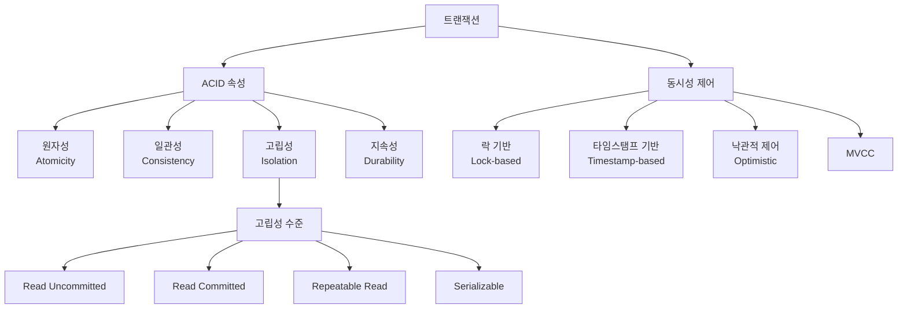
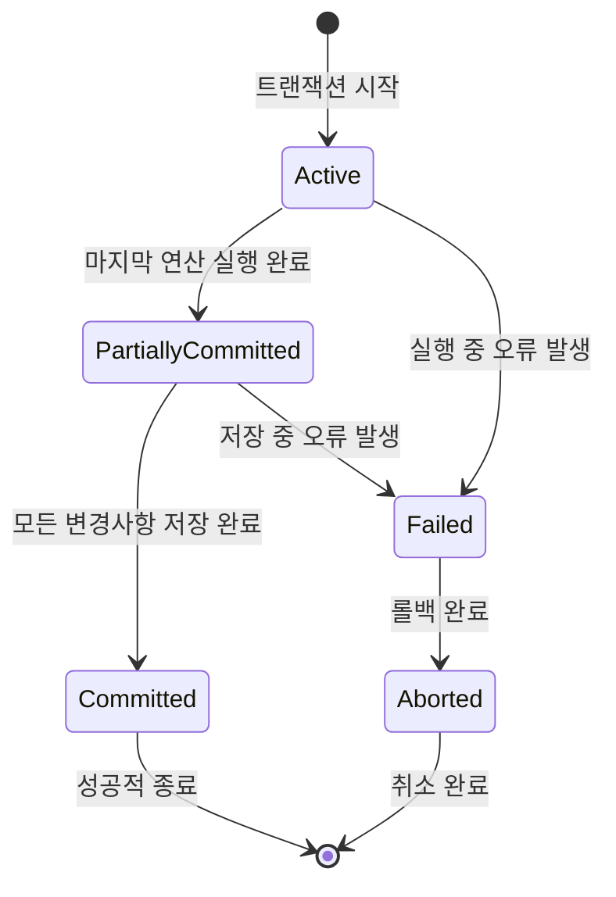
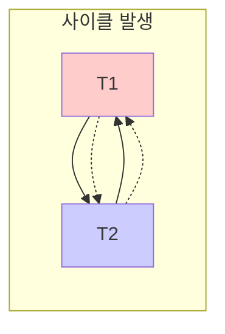
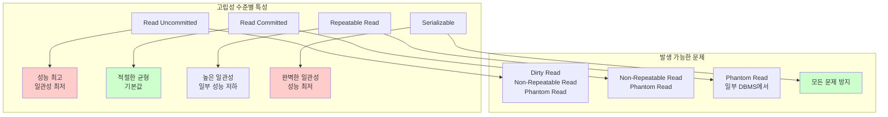
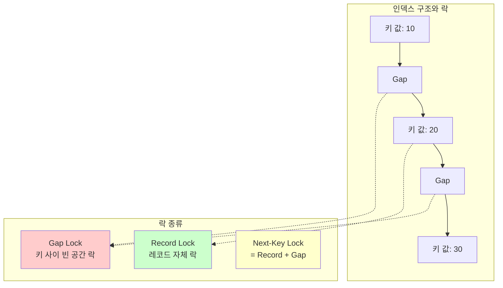
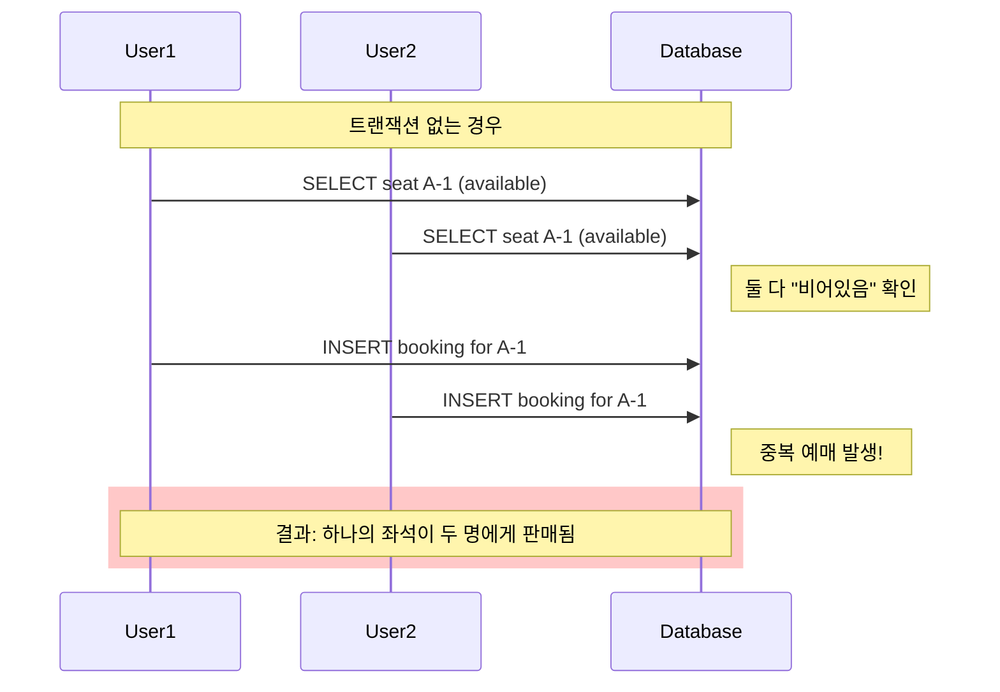
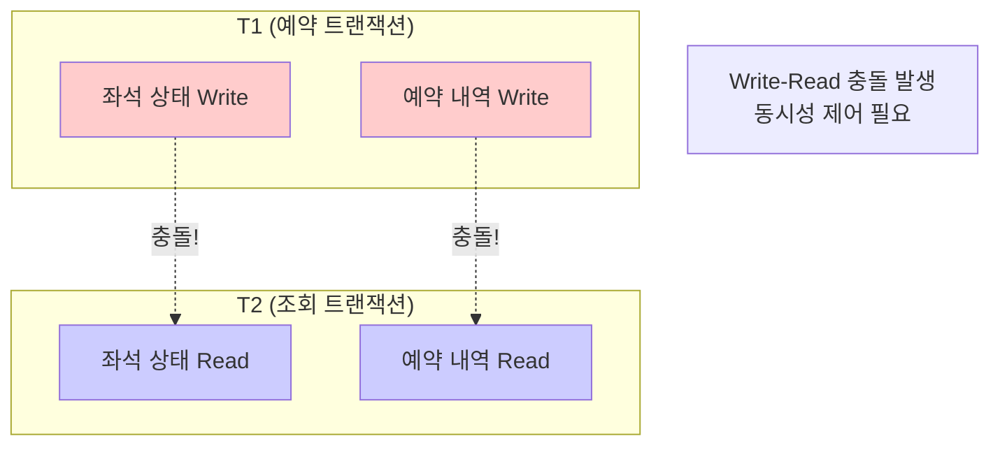

# 데이터베이스 문제집 3편: 트랜잭션과 동시성 제어

## 📊 트랜잭션과 동시성 제어 개요



## 📚 트랜잭션 기본 개념 및 ACID 속성

---

### Q1. 트랜잭션의 논리적 단위 개념

**🔍 문제:** 트랜잭션(Transaction)이 "프로그램 수행의 논리적인 단위"라고 불리는 이유를 은행 계좌 이체 예시를 통해 설명하시오.

**💡 해설:**
- **핵심 개념**: 트랜잭션은 **사용자 관점에서의 완결된 작업 단위**
- **물리적 vs 논리적**: 물리적 연산의 개수와 무관하게 논리적으로 하나의 의미있는 작업

**📖 예시 분석 - 계좌 이체**
```
논리적 작업: "A가 B에게 10만원 이체"
├── 물리적 연산1: A계좌에서 10만원 출금 (UPDATE)
└── 물리적 연산2: B계좌에 10만원 입금 (UPDATE)
```

**🎯 결론**: 이 두 연산은 분리될 수 없는 하나의 논리적 단위로 취급되어야만 데이터 정합성이 유지되므로, 트랜잭션은 **논리적인 단위**라고 불립니다.

---

### Q2. 원자성(Atomicity) 위반 시 문제점

**🔍 문제:** 트랜잭션의 ACID 속성 중, **원자성(Atomicity)**이 보장되지 않았을 때 발생할 수 있는 치명적인 문제점을 설명하시오.

**💡 해설:**
- **원자성 원칙**: `All or Nothing` - 모든 연산이 성공하거나 모두 실패해야 함
- **위반 시 결과**: 일부 연산만 성공하는 **불완전한 상태** 발생

**⚠️ 문제 시나리오**
```
A → B 1만원 이체 중 시스템 장애 발생
✅ 성공: A계좌에서 1만원 출금
❌ 실패: B계좌에 1만원 입금
결과: 1만원이 공중으로 사라짐 (데이터 유실)
```

**🎯 결론**: 데이터의 유실 또는 불일치가 발생하여 **데이터베이스의 신뢰도가 심각하게 훼손**됩니다.

---

### Q3. 일관성(Consistency) 보장 책임

**🔍 문제:** 일관성(Consistency) 속성은 주로 누가(DBMS vs. 개발자) 보장해야 하는 책임이며, 그 이유는 무엇인가요?

**💡 해설:**
- **주 책임자**: **응용 프로그램 개발자**
- **DBMS 역할**: 일관성을 지킬 수 있는 **환경 제공** (A, I, D 보장)
- **개발자 역할**: **비즈니스 로직의 타당성** 보장

**🔄 역할 분담**
```
DBMS: 원자성 + 고립성 + 지속성 → 일관성 지원 환경
개발자: 비즈니스 규칙 구현 → 실제 일관성 달성
```

**📖 예시**: '계좌 잔고는 음수가 될 수 없다'는 규칙은 개발자가 **응용 프로그램 코드나 데이터베이스 제약조건**을 통해 직접 구현해야 합니다.

---

### Q4. 고립성(Isolation)의 필요성

**🔍 문제:** **고립성(Isolation)**이 필요한 이유를 '더티 리드(Dirty Read)' 현상을 예로 들어 설명하시오.

**💡 해설:**
- **목적**: 동시 실행되는 트랜잭션들 간의 **부적절한 간섭 방지**
- **위험성**: 고립성 부재 시 **데이터 부정합** 발생

**🚨 더티 리드(Dirty Read) 시나리오**
```
시간순서:
1. T1: 데이터 X를 100→200으로 수정 (아직 커밋 안함)
2. T2: 데이터 X를 읽음 (200을 읽음) ← Dirty Read!
3. T1: 문제 발생으로 롤백 (X는 다시 100이 됨)
4. T2: 존재하지 않는 200 기반으로 작업 진행 → 데이터 부정합
```

**🎯 결론**: 고립성은 이러한 **'더러운' 데이터 기반 작업을 방지**하여 데이터 무결성을 보장합니다.

---

### Q5. 지속성(Durability) 보장 메커니즘

**🔍 문제:** **지속성(Durability)**을 보장하기 위해 DBMS가 사용하는 핵심적인 메커니즘은 무엇인가요?

**💡 해설:**
- **핵심 메커니즘**: **로그(Log) 시스템 + 복구(Recovery) 메커니즘**
- **저장 위치**: 비휘발성 저장소 (HDD, SSD)

**🔄 지속성 보장 과정**
```
1. 트랜잭션 실행 → 로그에 변경사항 기록
2. 커밋 발생 → 로그를 비휘발성 저장소에 영구 저장
3. 시스템 장애 발생 → 서버 재시작
4. 복구 과정 → 로그 분석하여 커밋된 변경사항 재적용(Redo)
```

**🎯 결론**: 시스템 장애가 발생해도 **커밋된 트랜잭션의 결과는 영구적으로 보존**됩니다.

---

### Q6. 트랜잭션 상태 전이 과정

**🔍 문제:** 트랜잭션의 5가지 상태(Active, Partially Committed, Committed, Failed, Aborted) 전이 과정을 설명하시오.



**💡 해설:**

**📍 각 상태별 특징**
1. **🔄 Active**: 트랜잭션이 실행을 시작하여 연산을 수행 중인 상태
2. **⏳ Partially Committed**: 트랜잭션의 마지막 연산까지 모두 실행을 마친 직후의 상태 (아직 최종 저장 전)
3. **✅ Committed**: 모든 연산이 성공적으로 완료되어 변경 내용이 데이터베이스에 영구적으로 저장된 상태
4. **❌ Failed**: 트랜잭션 실행 중 오류가 발생하여 더 이상 정상 진행이 불가능한 상태
5. **🔙 Aborted**: 트랜잭션이 실패하여, 이전의 모든 연산이 취소(Rollback)되고 트랜잭션 시작 전 상태로 되돌아간 상태

**🔄 주요 전이 경로**
- **정상 경로**: Active → Partially Committed → Committed
- **실패 경로**: Active/Partially Committed → Failed → Aborted

---

## 🔄 동시성 제어 및 스케줄

---

### Q7. 동시 처리(Concurrency)의 필요성

**🔍 문제:** 데이터베이스에서 여러 트랜잭션을 순차적이 아닌 동시에 처리(Concurrency)하는 이유 2가지를 설명하시오.

**💡 해설:**

**🎯 목표 1: 시스템 자원 활용률 극대화 (Throughput 향상)**
```
시나리오: 트랜잭션 A가 디스크 I/O 대기 중
→ CPU는 유휴 상태
→ 트랜잭션 B가 CPU 사용하여 작업 수행
→ 결과: 전체 시스템 처리량 증가
```

**🎯 목표 2: 사용자 평균 응답 시간 단축**
```
순차 처리: 긴 트랜잭션 → 짧은 트랜잭션 (총 대기시간 증가)
동시 처리: 짧은 트랜잭션이 먼저 완료 가능 (평균 응답시간 감소)
```

**🎯 결론**: 시스템 자원을 쉬지 않고 활용하여 **전체 처리량을 높이고 사용자 대기시간을 줄임**

---

### Q8. 스케줄(Schedule)의 개념과 순서 보장

**🔍 문제:** 스케줄(Schedule)이란 무엇이며, 스케줄의 명령 순서가 각 트랜잭션 내부의 원래 순서를 지켜야 하는 이유는 무엇인가요?

**💡 해설:**

**📋 스케줄의 정의**: 여러 트랜잭션이 동시에 실행될 때, 각 트랜잭션에 속한 명령어(연산)들이 처리되는 **시간 순서를 나타낸 것**

**🔒 순서 보장의 중요성**
- **논리적 의미 보존**: 각 트랜잭션은 논리적으로 의미가 있는 연산들의 순서로 구성
- **결과 정확성**: 원래 순서가 바뀌면 트랜잭션의 의도와 결과가 달라짐

**📖 예시**: 
```
올바른 순서: 이자 계산 → 입금 (논리적으로 타당)
잘못된 순서: 입금 → 이자 계산 (의미 왜곡)
```

**🎯 결론**: 트랜잭션 내부 순서는 **논리적 무결성**을 위해 반드시 보장되어야 함

---

### Q9. 직렬 가능한(Serializable) 스케줄

**🔍 문제:** '직렬 가능한(Serializable)' 스케줄이 동시성 제어에서 가지는 의미는 무엇인가요?

**💡 해설:**

**🎯 핵심 개념**: 동시 실행 결과 = 직렬 실행 결과

**🔄 동등성 보장**
```
병행 스케줄: T1과 T2가 동시에 실행
직렬 스케줄: T1 → T2 또는 T2 → T1 순차 실행
조건: 병행 스케줄의 결과가 어떤 직렬 스케줄과 동일해야 함
```

**✅ 장점**
- **동시성 허용**: 성능 향상
- **일관성 보장**: 데이터 무결성 유지
- **안전성**: 가장 이상적이고 안전한 스케줄

**🎯 결론**: 동시성의 이점을 누리면서도 **데이터베이스 일관성을 완벽하게 보장**하는 최적의 스케줄

---

### Q10. 충돌(Conflict)의 3가지 조건

**🔍 문제:** 두 연산이 '충돌(Conflict)'한다고 말할 수 있는 3가지 조건을 모두 설명하시오.

**💡 해설:**

**🎯 충돌 조건 (모두 만족해야 함)**

**1️⃣ 서로 다른 트랜잭션**: 두 연산이 서로 다른 트랜잭션에 속해 있어야 함
**2️⃣ 동일한 데이터 항목**: 두 연산이 동일한 데이터 항목(item)에 접근해야 함  
**3️⃣ 최소 하나는 Write**: 두 연산 중 적어도 하나는 쓰기(Write) 연산이어야 함

**📊 충돌 유형 분석**
```
✅ 충돌하는 경우:
- Read-Write: 읽기와 쓰기
- Write-Read: 쓰기와 읽기  
- Write-Write: 쓰기와 쓰기

❌ 충돌하지 않는 경우:
- Read-Read: 읽기와 읽기 (동시 읽기 허용)
```

**🎯 결론**: 충돌은 **데이터 일관성에 영향을 주는 연산 조합**을 의미

---

### Q11. 충돌 직렬성(Conflict Serializability) 판별법

**🔍 문제:** '충돌 직렬성(Conflict Serializability)'은 어떻게 판별할 수 있나요?

**💡 해설:**

**🔄 이론적 방법**: 충돌하지 않는 연산들의 순서를 바꿔가며 직렬 스케줄로 변환 시도

**🎯 실용적 방법**: **우선순위 그래프(Precedence Graph) 분석**

**📋 판별 절차**
```
1. 모든 트랜잭션을 노드로 표현
2. 충돌하는 연산들 사이에 방향 간선 추가
3. 그래프에 사이클(Cycle) 존재 여부 확인
```

**✅ 판별 결과**
- **사이클 없음** → 충돌 직렬 가능
- **사이클 있음** → 충돌 직렬 불가능

**🎯 결론**: 우선순위 그래프의 **사이클 존재 여부**로 간단히 판별 가능

---

### Q12. 우선순위 그래프의 간선(Edge) 의미

**🔍 문제:** 우선순위 그래프(Precedence Graph)에서 Ti → Tj 간선(edge)은 무엇을 의미하나요?

**💡 해설:**

**➡️ 간선의 의미**: Ti가 Tj보다 **먼저 실행되어야 함**을 나타냄

**📋 생성 조건**
```
1. Ti의 연산이 Tj의 연산보다 먼저 실행됨
2. 두 연산이 동일한 데이터에 대해 충돌함
3. 따라서 직렬 순서에서 Ti → Tj 순서 고정
```

**📖 예시**
```
시나리오: T1이 데이터 X를 쓰고, T2가 X를 읽음
결과: T1 → T2 간선 생성
의미: 최종 직렬 스케줄에서 T1이 T2보다 반드시 먼저 와야 함
```

**🎯 결론**: 간선은 트랜잭션 간의 **실행 순서 의존성**을 표현

문제 13. 우선순위 그래프에 사이클(예: T1 → T2 → T1)이 존재하면 왜 충돌 직렬성이 깨지는지 설명하시오.

### 우선순위 그래프와 사이클

*사이클이 있으면 모순된 순서 요구 (T1이 T2 앞에 동시에 T2가 T1 앞에)*

답안: 사이클 T1 → T2 → T1은, 직렬 순서에서 T1이 T2보다 먼저 와야 한다는 조건과 동시에 T2가 T1보다 먼저 와야 한다는 모순된 요구사항을 의미하기 때문입니다. 이러한 모순을 만족시키는 직렬 스케줄은 존재할 수 없으므로, 해당 병행 스케줄은 직렬 가능하지 않다고 결론 내립니다.

문제 14. 스케줄의 '복구 가능성(Recoverability)'이란 무엇이며, 왜 중요한가요?
답안: 복구 가능성이란, 트랜잭션 T_j가 T_i가 쓴 데이터를 읽었을 경우, T_i의 커밋(Commit)이 반드시 T_j의 커밋보다 먼저 일어나야 한다는 조건입니다. 이는 T_i가 롤백되었을 때 T_j가 존재하지 않는 데이터를 기반으로 커밋하는 '더러운 읽기' 문제를 방지하고, 데이터베이스가 항상 일관된 상태로 복구될 수 있도록 보장하기 때문에 중요합니다.

문제 15. '연쇄적 롤백(Cascading Rollback)'이 무엇인지 설명하고, 이것이 왜 비효율적인지 설명하시오.
답안: 연쇄적 롤백이란, 하나의 트랜잭션 T1이 실패하여 롤백될 때, T1이 쓴 데이터를 읽었던 다른 트랜잭션 T2, 그리고 T2가 쓴 데이터를 읽은 T3 등이 연쇄적으로 모두 롤백되어야 하는 상황을 말합니다. 이는 단 하나의 실패가 수많은 작업들을 무효로 만들어 시스템 성능에 큰 부담을 주고 자원을 낭비하므로 매우 비효율적입니다.

문제 16. '비연쇄인 스케줄(Cascadeless Schedule)'은 연쇄적 롤백 문제를 어떻게 해결하나요?

### 연쇄적 롤백 vs 비연쇄인 스케줄

```mermaid
graph TD
    subgraph "연쇄적 롤백 발생"
        A1[T1 writes X] --> B1[T2 reads X]
        B1 --> C1[T3 reads from T2]
        C1 --> D1[T1 fails] 
        D1 --> E1[T2 must rollback]
        E1 --> F1[T3 must rollback]
    end
    
    subgraph "비연쇄인 스케줄"
        A2[T1 writes X] --> B2[T1 commits]
        B2 --> C2[T2 reads X]
        C2 --> D2[T2 commits]
        D2 --> E2[T3 reads from T2]
    end
    
    style D1 fill:#ffcccc
    style E1 fill:#ffcccc  
    style F1 fill:#ffcccc
    style B2 fill:#ccffcc
    style D2 fill:#ccffcc
```


답안: "어떤 트랜잭션이 다른 트랜잭션이 쓴 데이터를 읽으려면, 쓰는 트랜잭션이 반드시 커밋(Commit)을 완료한 이후에만 읽을 수 있다"는 더 엄격한 규칙을 적용합니다. 이 규칙을 통해, 아직 커밋되지 않은 데이터(롤백될 가능성이 있는 데이터)를 다른 트랜잭션이 아예 읽지 못하도록 원천 차단하므로, 연쇄적 롤백이 발생할 가능성 자체가 사라집니다.

---

## 🔒 SQL 고립성 수준(Isolation Levels)

---

### Q17. 고립성 수준을 단계별로 제공하는 이유

**🔍 문제:** SQL에서 트랜잭션의 '고립성 수준(Isolation Level)'을 여러 단계로 나누어 제공하는 이유는 무엇인가요?

### SQL 고립성 수준 비교


**💡 해설:**

**⚖️ 핵심 이유: 일관성 vs 성능의 트레이드오프**

**📈 고립성 수준 ↑ 효과**
- ✅ **일관성**: 데이터 정확성 완벽 보장
- ❌ **성능**: 락 범위/시간 증가로 동시성 저하

**📉 고립성 수준 ↓ 효과**  
- ✅ **성능**: 높은 동시성으로 처리 속도 향상
- ❌ **일관성**: 데이터 부정합 문제 발생 가능

**🎯 결론**: **시스템 요구사항에 맞는 최적의 균형점** 선택을 위해 다단계 제공

---

### Q18. Read Uncommitted에서의 더티 리드

**🔍 문제:** 가장 낮은 고립성 수준인 Read Uncommitted에서 발생하는 '더티 리드(Dirty Read)' 현상을 설명하시오.

**💡 해설:**

**🚨 더티 리드(Dirty Read) 시나리오**
```
시간 순서:
1. T1: 계좌 잔고 100만원 → 50만원으로 수정 (아직 커밋 안함)
2. T2: 계좌 잔고 조회 → 50만원 읽음 (Dirty Read!)
3. T1: 오류 발생으로 롤백 → 잔고는 다시 100만원
4. T2: 존재하지 않는 50만원 기준으로 작업 진행
```

**⚠️ 문제점**
- **불일치**: T2가 읽은 50만원은 실제로 존재하지 않는 값
- **부정합**: T2의 작업 결과가 잘못된 데이터 기반으로 생성
- **신뢰성**: 데이터베이스 무결성 심각하게 훼손

**🎯 결론**: 커밋되지 않은 **'더러운'** 데이터를 읽어 **데이터 정합성이 깨짐**

---

### Q19. Read Committed에서의 Non-Repeatable Read

**🔍 문제:** Read Committed 수준에서 'Non-Repeatable Read' 현상이 발생하는 이유를 설명하시오.

**💡 해설:**

**🔄 Non-Repeatable Read 시나리오**
```
T1 트랜잭션 내에서:
1. T1: 상품 가격 조회 → 10,000원 읽음
2. T2: 같은 상품 가격을 15,000원으로 수정 후 커밋
3. T1: 같은 상품 가격 재조회 → 15,000원 읽음 (다른 값!)
```

**🎯 발생 원리**
- **Read Committed 보장**: 커밋된 데이터만 읽기 (더티 리드 방지)
- **한계점**: 트랜잭션 중간에 다른 트랜잭션의 커밋된 변경사항 반영
- **결과**: 같은 데이터를 **반복해서 읽을 수 없음**

**🎯 결론**: 트랜잭션 내에서 **동일한 읽기 결과를 보장하지 못함**

---

### Q20. Repeatable Read의 문제 해결 방식

**🔍 문제:** Repeatable Read 수준은 'Non-Repeatable Read' 문제를 어떻게 해결하나요?

**💡 해설:**

**📸 스냅샷 기반 해결**
- **핵심 기술**: 트랜잭션 시작 시점의 **데이터 버전(스냅샷)** 고정
- **구현 방식**: 주로 **MVCC(Multi-Version Concurrency Control)** 사용

**🔄 동작 원리**
```
T1 트랜잭션:
1. T1 시작 → 현재 시점의 데이터 스냅샷 생성
2. T2가 데이터 수정 후 커밋 (T1과 무관)
3. T1의 모든 읽기 → 자신의 스냅샷만 참조
4. 결과: 항상 동일한 값 읽기 보장
```

**✅ 장점**
- **일관성**: 트랜잭션 내 반복 읽기 보장
- **성능**: 읽기 작업이 쓰기 작업을 차단하지 않음
- **격리**: 다른 트랜잭션 변경사항에 영향받지 않음

**🎯 결론**: **스냅샷 격리**를 통해 트랜잭션 내 **읽기 일관성 완벽 보장**

---

### Q21. 팬텀 리드(Phantom Read) 현상

**🔍 문제:** '팬텀 리드(Phantom Read)'란 무엇이며, Repeatable Read 수준에서도 이 현상이 발생할 수 있는 이유는 무엇인가요?

**💡 해설:**

**👻 팬텀 리드 정의**: 트랜잭션 내에서 범위 조회 시, **처음에는 없었던 레코드(유령 레코드)가 두 번째 조회에서 나타나는 현상**

**🔄 발생 시나리오**
```
T1 트랜잭션:
1. T1: "20대 직원 수" 조회 → 5명 결과
2. T2: 25세 직원 추가 후 커밋 (새로운 레코드 삽입)
3. T1: "20대 직원 수" 재조회 → 6명 결과 (유령 레코드 출현!)
```

**🎯 Repeatable Read의 한계**
- **보장 범위**: 기존 행(Row)의 **값 변경** 방지
- **미보장 범위**: 새로운 행의 **삽입(Insert)** 허용
- **결과**: 범위 쿼리에서 **레코드 개수 변화** 발생

**🎯 결론**: 기존 데이터는 반복 읽기가 가능하지만, **새로 추가된 데이터로 인한 범위 변화는 막지 못함**

---

### Q22. MySQL InnoDB의 팬텀 리드 방지 메커니즘

**🔍 문제:** MySQL(InnoDB 엔진)이 Repeatable Read 수준에서 갭 락(Gap Lock)과 넥스트 키 락(Next-Key Lock)을 사용하여 팬텀 리드를 방지하는 원리를 간략히 설명하시오.

### MySQL InnoDB의 팬텀 리드 방지 메커니즘


**💡 해설:**

**🔒 락 종류별 역할**
- **Record Lock**: 기존 레코드의 **값 변경 방지**
- **Gap Lock**: 키 값 사이 **빈 공간에 새 데이터 삽입 방지**
- **Next-Key Lock**: Record Lock + Gap Lock 조합

**🎯 팬텀 리드 방지 원리**
```
시나리오: "나이 >= 20 AND 나이 <= 30" 범위 조회

1. 기존 레코드 (20, 25, 30)에 Record Lock 설정
2. Gap Lock 설정:
   - (∞, 20) 구간 락
   - (20, 25) 구간 락  
   - (25, 30) 구간 락
   - (30, ∞) 구간 락

결과: 어떤 값도 해당 범위에 새로 삽입 불가능
```

**🎯 결론**: **범위 전체를 락으로 보호**하여 새로운 레코드 삽입을 원천 차단

---

### Q23. Serializable 고립성 수준의 동시성 제어

**🔍 문제:** 가장 높은 고립성 수준인 Serializable은 동시성을 어떻게 제어하며, 어떤 장단점을 가지나요?

**💡 해설:**

**🔒 Serializable 제어 방식**
- **핵심 원리**: 트랜잭션들을 **거의 순차적으로 실행**
- **구현 방법**: 모든 읽기 작업에도 **공유 락(Shared Lock)** 적용
- **효과**: 다른 트랜잭션의 데이터 수정 완전 차단

**⚖️ 장단점 분석**

**✅ 장점**
```
완벽한 일관성: 모든 종류의 데이터 부정합 문제 방지
- ❌ Dirty Read 방지
- ❌ Non-Repeatable Read 방지  
- ❌ Phantom Read 방지
안전성: 금융, 의료 등 중요 시스템에 적합
```

**❌ 단점**
```
성능 저하: 동시 처리 능력 극도로 제한
- 읽기 작업도 락으로 인한 대기 발생
- 처리량(Throughput) 급감
- 응답 시간 증가
실용성: 대부분 시스템에서 거의 사용 안함
```

**🎯 결론**: **완벽한 일관성 vs 심각한 성능 저하** - 극도로 중요한 데이터에만 제한적 사용

---

### Q24. Read Committed가 기본값인 이유

**🔍 문제:** 대부분의 상용 DBMS가 Read Committed를 기본 고립성 수준으로 채택하는 이유는 무엇일까요?

**💡 해설:**

**🎯 최적의 균형점 (Sweet Spot)**
- **핵심**: **실용성과 안전성의 황금 비율**

**⚖️ 균형점 분석**
```
데이터 안전성:
✅ Dirty Read 방지 → 심각한 데이터 오류 차단
❌ Non-Repeatable Read 허용 → 대부분 업무에 큰 문제 없음

성능 최적화:
✅ 적절한 동시성 확보 → 높은 처리량 유지
✅ 락 경합 최소화 → 빠른 응답 시간
✅ 교착상태 위험 감소 → 안정적 운영
```

**📊 실무 적합성**
- **일반 웹 서비스**: 충분한 일관성 + 우수한 성능
- **비즈니스 시스템**: 업무 요구사항 만족
- **대용량 처리**: 높은 동시성 지원

**🎯 결론**: **99% 상황에서 최적**인 **데이터 정합성과 시스템 성능의 합리적 타협점**

---

## 🔄 SQL 트랜잭션 제어 및 종합 문제

### 트랜잭션 명령어 흐름
```mermaid
sequenceDiagram
    participant User
    participant Transaction
    participant Database
    
    User->>Transaction: START TRANSACTION
    activate Transaction
    User->>Transaction: SQL Operations (DML)
    Transaction->>Database: Lock Resources
    
    alt Success Case
        User->>Transaction: COMMIT
        Transaction->>Database: Apply Changes
        Transaction->>Database: Release Locks
        deactivate Transaction
    else Failure Case
        User->>Transaction: ROLLBACK
        Transaction->>Database: Undo Changes
        Transaction->>Database: Release Locks
        deactivate Transaction
    end
```

문제 25. SQL에서 트랜잭션을 시작, 성공적으로 종료, 실패하여 취소하는 명령어를 각각 작성하시오.

---

### Q25. SQL 트랜잭션 제어 명령어

**🔍 문제:** SQL에서 트랜잭션을 시작, 성공적으로 종료, 실패하여 취소하는 명령어를 각각 작성하시오.

**💡 해설:**

**📋 트랜잭션 제어 명령어**

**🚀 시작**: 
```sql
START TRANSACTION;  -- 표준 SQL
-- 또는
BEGIN;             -- MySQL, PostgreSQL 등
```

**✅ 성공적 종료**:
```sql
COMMIT;            -- 모든 변경사항을 영구 저장
```

**❌ 실패 및 취소**:
```sql
ROLLBACK;          -- 모든 변경사항을 취소하고 원상복구
```

**🔄 실행 예시**
```sql
START TRANSACTION;
UPDATE accounts SET balance = balance - 10000 WHERE id = 'A';
UPDATE accounts SET balance = balance + 10000 WHERE id = 'B';
-- 성공 시: COMMIT;
-- 실패 시: ROLLBACK;
```

**🎯 결론**: **명시적 트랜잭션 제어**로 데이터 일관성 보장

---

### Q26. DDL 명령어의 트랜잭션 주의사항

**🔍 문제:** DROP TABLE과 같은 DDL(데이터 정의어) 문장이 트랜잭션 컨텍스트에서 특별히 주의해야 할 이유는 무엇인가요?

**💡 해설:**

**⚠️ DDL의 특별한 동작: Auto Commit**
- **핵심 문제**: DDL 실행 시 **자동 커밋(Auto Commit)** 발생
- **영향 범위**: DDL 이전의 모든 미완료 작업도 강제 커밋

**🚨 문제 시나리오**
```sql
START TRANSACTION;
UPDATE products SET price = 15000 WHERE id = 1;  -- 가격 수정
UPDATE products SET stock = stock - 1 WHERE id = 1;  -- 재고 차감

DROP TABLE temp_table;  -- DDL 실행 → 자동 커밋 발생!
-- 결과: 위의 UPDATE 작업들이 의도치 않게 영구 저장됨

-- 이후 문제 발생 시 ROLLBACK 불가능!
```

**🛡️ 안전한 사용법**
```sql
-- 방법 1: 트랜잭션 분리
COMMIT;  -- 이전 작업 명시적 완료
DROP TABLE temp_table;  -- DDL 실행
START TRANSACTION;  -- 새 트랜잭션 시작

-- 방법 2: DDL 회피
-- 가능하면 트랜잭션 내에서 DDL 사용 피하기
```

**🎯 결론**: DDL은 **트랜잭션 경계를 무시하고 강제 커밋**하므로 매우 신중한 사용 필요

---

### Q27. 동시 좌석 예매 시 트랜잭션 부재 문제

**🔍 문제:** 두 명의 사용자가 동시에 '공연장 좌석 A-1'을 예매하려고 할 때, 트랜잭션이 없다면 어떤 문제가 발생할 수 있는지 설명하시오.

### 동시성 문제 시나리오


**💡 해설:**

**🚨 문제 발생 단계**
```
1️⃣ 사용자1: A-1 좌석 상태 확인 → "비어있음" 응답
2️⃣ 사용자2: A-1 좌석 상태 확인 → "비어있음" 응답 (동시 접근)
3️⃣ 사용자1: A-1 좌석 예매 정보 저장 (INSERT)
4️⃣ 사용자2: A-1 좌석 예매 정보 저장 (INSERT) - 중복!
```

**⚠️ 심각한 결과**
- **중복 판매**: 하나의 좌석이 두 명에게 동시 판매
- **비즈니스 손실**: 고객 불만 및 신뢰도 하락
- **데이터 무결성**: 시스템 일관성 파괴

**🛡️ 트랜잭션 해결책**
```sql
-- 사용자1의 안전한 예매 과정
START TRANSACTION;
SELECT * FROM seats WHERE seat_id = 'A-1' FOR UPDATE;  -- 락 설정
-- 좌석 상태 확인 후
INSERT INTO bookings (seat_id, user_id) VALUES ('A-1', 'user1');
UPDATE seats SET status = 'booked' WHERE seat_id = 'A-1';
COMMIT;
```

**🎯 결론**: 트랜잭션과 **적절한 락**을 통해 **동시성 문제 완전 방지** 가능

---

### Q28. 약한 일관성이 허용되는 트랜잭션 예시

**🔍 문제:** 약한 수준의 일관성(Weak Levels of Consistency)이 허용되는 트랜잭션의 예시를 드시오.

**💡 해설:**

**📊 통계 및 분석 작업**
- **웹사이트 방문자 수 집계**: 실시간 정확성보다 전체 추세가 중요
- **상품 조회수 카운터**: 몇 번의 누락이 있어도 큰 문제 없음
- **로그 분석**: 대략적인 패턴 파악이 목적

**🔄 적합한 이유**
```
특징: 100% 정확성보다 빠른 처리가 우선
- ✅ 전체적 추세 파악이 목적
- ✅ 소량의 데이터 누락 허용 가능
- ✅ 높은 동시성으로 성능 향상
- ❌ 트랜잭션별 정확성은 불요
```

**📈 실무 예시**
```sql
-- 대시보드용 통계 (Read Uncommitted 허용)
SELECT COUNT(*) as total_views 
FROM page_views 
WHERE date = TODAY();

-- 실시간 랭킹 (일부 부정확성 허용)
SELECT product_id, view_count 
FROM products 
ORDER BY view_count DESC 
LIMIT 10;
```

**🎯 결론**: **성능 > 정확성**인 **분석 및 통계 업무**에서 약한 일관성 활용

---

### Q29. 스토리지 엔진별 트랜잭션 지원 차이

**🔍 문제:** MySQL의 InnoDB 스토리지 엔진이 트랜잭션을 지원하는 반면, MyISAM 스토리지 엔진은 지원하지 않습니다. 이 차이가 시스템 설계에 어떤 영향을 미칠까요?

**💡 해설:**

**🏦 트랜잭션 필수 시스템 → InnoDB 선택**
```
적용 분야:
✅ 금융 시스템 (계좌 이체, 결제)
✅ 전자상거래 (주문, 재고 관리)
✅ 예약 시스템 (좌석, 호텔)
✅ 사용자 관리 (회원가입, 권한)

요구사항: 데이터 무결성이 생명
```

**📊 읽기 중심 시스템 → MyISAM 고려 가능**
```
적용 분야:
✅ 로그 분석 시스템
✅ 읽기 전용 게시판
✅ 통계 및 리포팅
✅ 캐시 데이터 저장소

요구사항: 빠른 조회 성능 우선
```

**⚖️ 성능 vs 안정성 비교**

| 특성 | InnoDB | MyISAM |
|------|--------|---------|
| **트랜잭션** | ✅ 지원 | ❌ 미지원 |
| **ACID** | ✅ 완전 지원 | ❌ 부분 지원 |
| **락** | 행 수준 락 | 테이블 수준 락 |
| **읽기 성능** | 보통 | 빠름 |
| **쓰기 성능** | 안정적 | 빠르지만 불안정 |
| **복구** | 자동 복구 | 수동 복구 |

**🎯 결론**: **미션 크리티컬 → InnoDB**, **단순 조회 → MyISAM** 선택

---

### Q30. 트랜잭션 간 충돌 분석

**🔍 문제:** 항공기 좌석을 예약하는 트랜잭션 T1(좌석 상태 변경(write), 예약 내역 기록(write))과 예약 현황을 단순히 조회만 하는 트랜잭션 T2(좌석 상태 조회(read), 예약 내역 조회(read))가 동시에 실행될 때, 두 트랜잭션 간에 충돌이 발생하는지 설명하시오.

### 트랜잭션 간 충돌 분석


**💡 해설:**

**🎯 충돌 조건 검증**
1. **서로 다른 트랜잭션**: T1 ≠ T2 ✅
2. **동일한 데이터 항목**: 좌석 상태, 예약 내역 ✅  
3. **최소 하나는 Write**: T1은 모든 연산이 Write ✅

**🔄 충돌 발생 지점**
```
T1 Write(좌석상태) ↔ T2 Read(좌석상태) → Write-Read 충돌
T1 Write(예약내역) ↔ T2 Read(예약내역) → Write-Read 충돌
```

**⚖️ 동시성 제어 필요성**
- **데이터 일관성**: T2가 중간 상태의 불완전한 데이터 읽기 방지
- **실행 순서**: T1 완료 후 T2 실행 또는 적절한 고립성 수준 설정
- **비즈니스 요구**: 예약 과정 중 정확한 현황 조회 보장

**🎯 결론**: **Write-Read 충돌 발생** → **동시성 제어 메커니즘 반드시 필요**

---

## 🎓 학습 완료! 

데이터베이스 트랜잭션과 동시성 제어에 대한 **30개 핵심 문제**를 모두 마스터했습니다! 

**📚 주요 학습 성과:**
- ✅ ACID 속성의 완전한 이해
- ✅ 고립성 수준별 특성과 적용 사례
- ✅ 동시성 제어 메커니즘과 충돌 분석
- ✅ 실무 시나리오별 트랜잭션 설계
- ✅ MySQL/InnoDB의 고급 락 메커니즘

이제 **실제 시스템 설계와 데이터베이스 최적화**에 이 지식을 자신 있게 적용할 수 있습니다! 🚀