# 📚 데이터베이스 시스템 종합 학습 가이드

> **본 문서는 데이터베이스 시스템의 핵심 개념을 체계적으로 다루는 종합 학습 자료입니다.**

## 📋 목차 (Table of Contents)

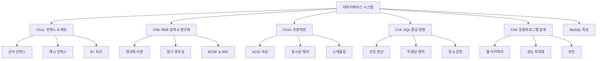

## 🎯 학습 목표 및 전체 구조

### 📊 주요 주제 개관

| 챕터 | 주제 | 핵심 목표 | 연관성 |
|------|------|-----------|--------|
| **Ch11** | Index & Hash | 빠른 데이터 접근 | → 성능 최적화 |
| **Ch8** | RDB Design | 좋은 스키마 설계 | → 데이터 무결성 |
| **Ch14** | Transaction | 동시성 & 안정성 | → 시스템 신뢰성 |
| **Ch4** | SQL 중급 | 데이터 조작 & 제약 | → 실무 적용 |
| **Ch9** | Application | 웹 연동 & 보안 | → 실제 서비스 |
| **MySQL** | 특정 문법 | 구현 세부사항 | → 실제 개발 |

### 🔗 개념 간 연결관계


---

# 📖 Ch11: Index and Hash (인덱스와 해싱)

## 🎯 학습 목표
데이터베이스에서 **빠른 데이터 검색**을 위한 핵심 기술인 인덱스와 해싱의 원리를 이해하고, 각 기법의 특성과 적용 상황을 파악합니다.

## 🔍 인덱스 개요

### 💡 기본 개념
> **인덱스는 도서관의 도서 목록과 같습니다!**
> 
> 🏛️ **도서관 비유**: 수만 권의 책 중에서 특정 책을 찾을 때
> - ❌ **인덱스 없이**: 모든 책장을 하나씩 뒤져봐야 함
> - ✅ **인덱스 사용**: 목록에서 분류번호를 찾아 해당 위치로 바로 이동

### 📊 핵심 용어 정리

| 용어 | 정의 | 예시 |
|------|------|------|
| **Search Key** | 레코드 검색에 사용되는 속성들 | 학번, 이름, 급여 등 |
| **Index File** | 검색 키와 포인터로 구성된 작은 파일 | `(검색키값, 데이터위치)` |
| **Data File** | 실제 레코드가 저장된 파일 | 학생 정보, 교수 정보 등 |
| **Pointer** | 실제 데이터 레코드의 물리적 위치 | 블록 번호, 오프셋 등 |

### 🏗️ 인덱스 구조 개념도

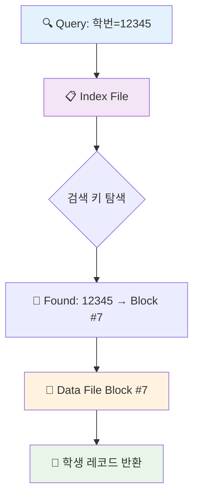

## ⚖️ 인덱스 vs 순차 검색 비교

### 📈 성능 비교표

| 측면 | 순차 검색 | 인덱스 검색 |
|------|-----------|-------------|
| **시간 복잡도** | O(n) | O(log n) |
| **검색 속도** | 🐌 느림 | ⚡ 빠름 |
| **저장 공간** | 💾 적음 | 💾💾 추가 공간 필요 |
| **삽입/삭제** | 🟢 단순 | 🟡 인덱스 갱신 필요 |
| **적합한 상황** | 작은 데이터셋 | 대용량 데이터셋 |

### 🎮 인덱스 성능 평가 지표

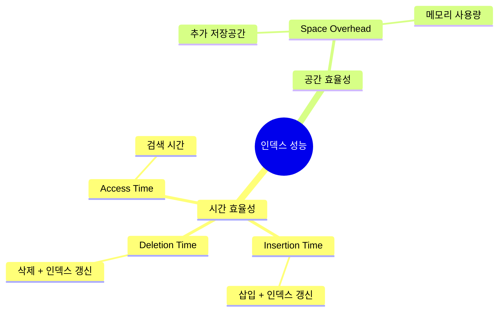

## 🗂️ 인덱스 분류체계

### 📋 1. 저장 방식에 따른 분류

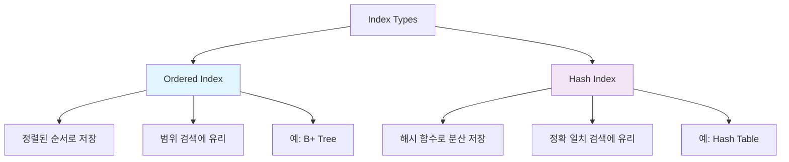

### 🏠 2. 데이터 배치에 따른 분류

#### 🥇 Primary Index (주 인덱스 / Clustering Index)

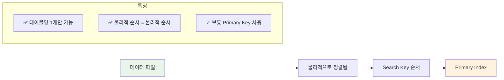

#### 🥈 Secondary Index (보조 인덱스 / Non-clustering Index)

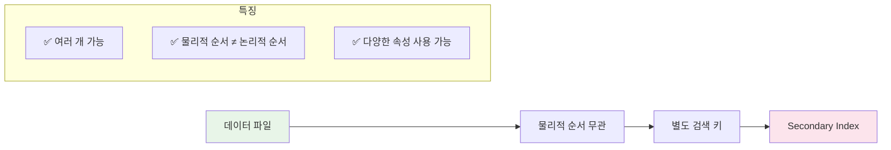

## 🔬 순서 인덱스 심화

### 🎯 Dense Index (밀집 인덱스)

#### ✨ 개념 및 특징
- **정의**: 모든 검색 키 값에 대한 인덱스 엔트리가 존재
- **구조**: `(검색키값, 포인터)` 쌍이 모든 레코드에 대해 존재

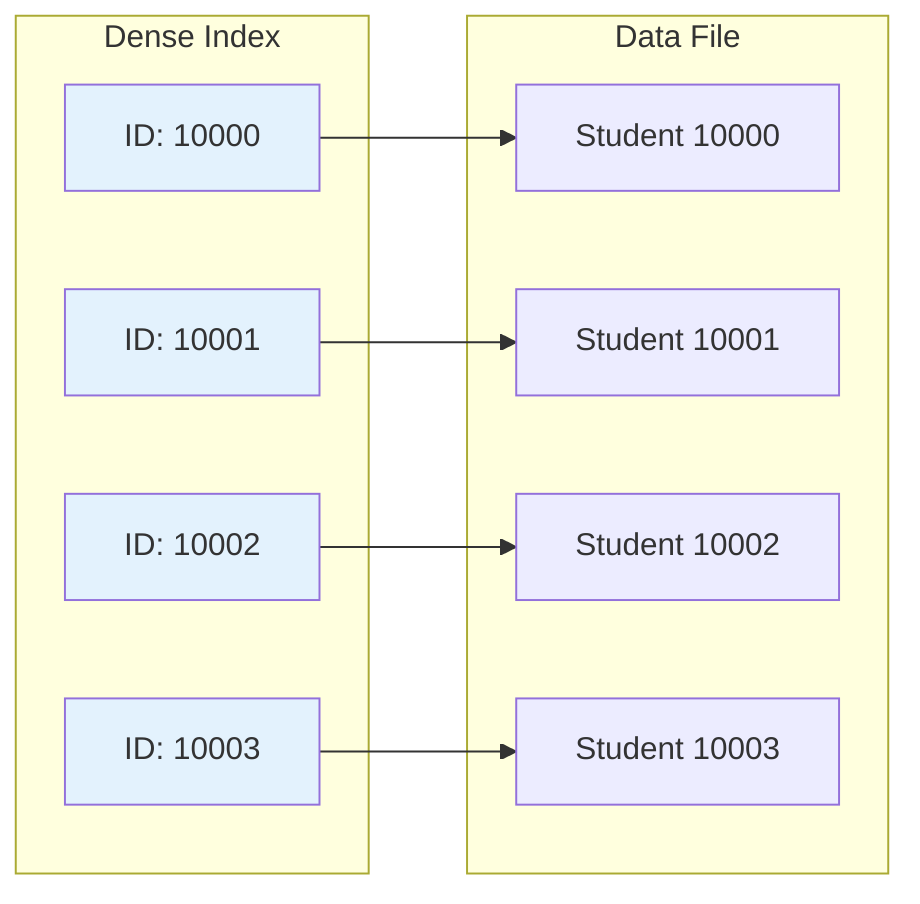

#### 📋 Dense Index 특성표

| 특성 | 설명 | 장점/단점 |
|------|------|-----------|
| **참조 방식** | 간접 참조 필수 | 🟡 데이터 이동 시 인덱스 갱신 최소화 |
| **인덱스 타입** | 주로 Secondary Index | 🟢 정렬되지 않은 파일에도 사용 가능 |
| **저장 공간** | 상대적으로 많음 | 🔴 모든 레코드에 엔트리 필요 |
| **검색 속도** | 매우 빠름 | 🟢 직접 접근 가능 |

#### 🔧 간접 참조를 사용하는 이유

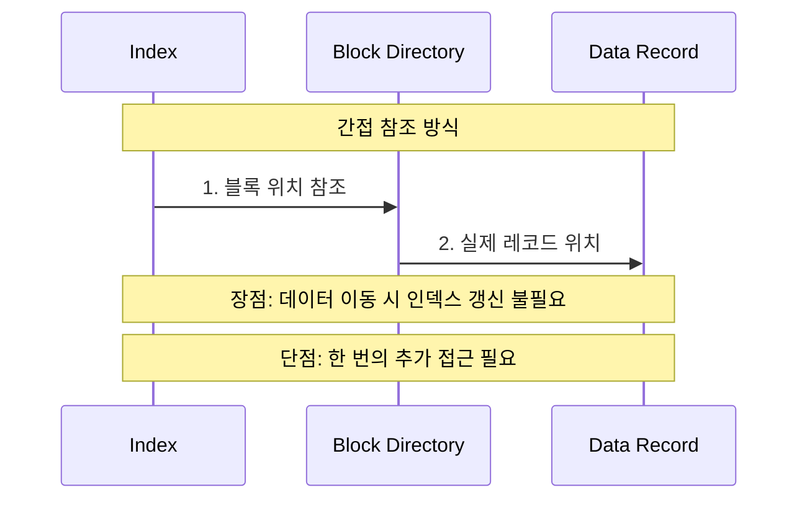

### 🎯 Sparse Index (희소 인덱스)

#### ✨ 개념 및 제약조건
- **정의**: 일부 검색 키 값에 대해서만 인덱스 엔트리 존재
- **필수 조건**: 데이터가 검색 키 순서로 **물리적 정렬**되어 있어야 함 (Clustering Index만 가능)

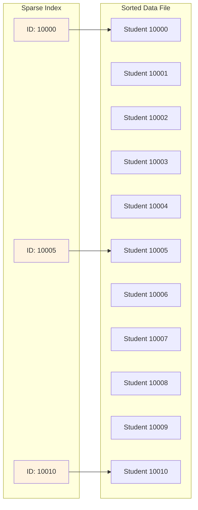

#### 🔍 희소 인덱스 검색 과정

**예시: ID = 10003인 학생 찾기**

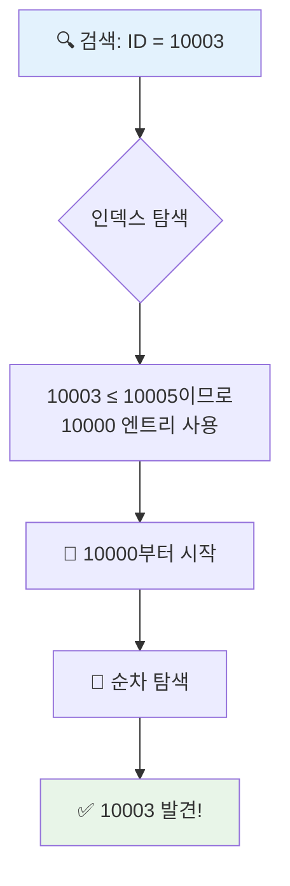

#### ⚖️ Dense vs Sparse Index 비교

| 비교 항목 | Dense Index | Sparse Index |
|----------|-------------|--------------|
| **저장 공간** | 🔴 많음 (모든 레코드) | 🟢 적음 (일부만) |
| **검색 속도** | 🟢 빠름 (직접 접근) | 🟡 보통 (순차 탐색 필요) |
| **삽입/삭제** | 🔴 높은 부하 | 🟢 낮은 부하 |
| **적용 조건** | 모든 파일 | 정렬된 파일만 |
| **메모리 효율** | 🔴 비효율적 | 🟢 효율적 |

#### 💡 최적 희소 인덱스 설계

> **💡 Best Practice**: 각 **블록**마다 하나의 인덱스 엔트리를 갖는 방식
> 
> **이유**: 메모리 I/O 비용을 고려할 때 가장 효율적
> - 블록 단위로 데이터를 읽어오므로
> - 인덱스 크기와 검색 성능의 최적 균형점
*   **Secondary Index (2차 인덱스):** 데이터 파일의 물리적인 저장 순서와는 별개로 구성되는 검색 키의 인덱스입니다. 'Non-clustered Index'라고도 부릅니다. Unique 옵션을 설정하면 2차 인덱스로 지정될 수 있습니다 (Primary Key가 아니어도 가능하며, null을 허용하기 때문). Not null이 포함되면 클러스터링 인덱스로 활용 가능합니다. 외래키(Foreign Key) 또한 인덱스로 지정될 수 있습니다.

**Dense Index (밀집 인덱스)**:
레코드들의 *모든* 검색 키 값에 대한 인덱스 엔트리가 존재합니다. 예시: ID 속성을 이용한 인덱스. Dept_name을 이용한 dense index 예시도 있습니다. 밀집 인덱스는 항상 2차 인덱스이며 (정렬되지 않음), 반드시 간접 참조(indirect reference)여야 합니다.
*   **간접 참조 이유:** 인덱스 파일은 검색 키와 레코드의 위치를 가리키는 포인터로 구성됩니다. 레코드의 물리적 위치가 변경될 수 있으므로, 인덱스가 직접 레코드를 가리키기보다는 해당 레코드가 저장된 블록이나 다른 중간 구조를 가리키는 간접 참조 방식이 효율적입니다. 소스에는 "반드시 간접참조여야 함 (why?)"라고만 되어 있고 직접적인 이유는 명시되지 않았으나, 일반적으로는 데이터 이동 시 인덱스 갱신 부하를 줄이기 위함입니다.
*   **밀집 인덱스 이유:** 소스에는 "반드시 밀집 인덱스여야 함 (why?)"라고만 되어 있고 직접적인 이유는 명시되지 않았습니다. 사실 밀집 인덱스는 1차 인덱스에도 사용될 수 있으며 (모든 검색 키 값에 대해 인덱스 엔트리를 가짐), 2차 인덱스에서는 항상 밀집 인덱스만 가능합니다. 이는 2차 인덱스는 파일의 물리적 순서와 무관하므로 특정 검색 키 값의 위치를 찾기 위해 해당 값의 모든 인덱스 엔트리가 필요하기 때문입니다.

**Sparse Index (희소 인덱스)**:
몇 개의 search-key 값에 대해서만 인덱스가 존재합니다. **Search key에 대해 순차적으로 저장된 경우에만 사용 가능합니다 (즉, 클러스터링 인덱스인 경우에만)**. Search-Key의 값이 K인 경우, K보다 작거나 같으며 그 중에서 가장 큰 search-key의 인덱스를 활용하여 해당 위치부터 순차 탐색합니다. 예시: ID 58583을 찾을 때, 32343 인덱스를 이용해 32343부터 순차 탐색.
*   밀집 인덱스와 비교: 희소 인덱스는 인덱스를 위한 공간이 더 적고, 삽입 및 삭제 시 부하가 적습니다. 하지만 검색 시에는 밀집 인덱스보다 느립니다. 좋은 절충안은 모든 블록에 대해 하나의 인덱스를 가지는 희소 인덱스를 만드는 것입니다 (메모리로 가져오는 비용 고려).

**인덱스의 갱신 (Insertion and Deletion)**:
데이터의 갱신(삽입, 삭제)은 인덱스의 수정을 발생시키며, 이로 인해 데이터베이스에 부하가 발생합니다. 데이터 삽입 혹은 삭제에 따라 모든 레벨의 인덱스는 갱신되어야 합니다.
*   **삭제 시:** 삭제되는 레코드가 특정 search-key 값이 가리키는 유일한 값이라면 search-key 또한 삭제되어야 합니다.
    *   **밀집 인덱스:** 유일한 값이라면 인덱스 엔트리 삭제. 유일하지 않다면 인덱스 엔트리가 다음 레코드를 가리키도록 갱신.
    *   **희소 인덱스:** 만약 인덱스가 search-key 값을 가지는 레코드를 포함하지 않는다면 추가 동작이 없습니다. 삭제된 레코드가 그 search-key에 대한 유일한 레코드라면 다음 키 검색을 위한 레코드로 교체합니다. 다음 키가 이미 인덱스 엔트리에 있는 경우에는 삭제됩니다. 삭제된 레코드가 search-key에 해당하는 유일한 레코드가 아니라면, 해당 key가 다음 레코드를 가리키도록 갱신됩니다. (58583, 15151, 22222 삭제 예시 언급)
*   **삽입 시:** 삽입되는 레코드의 search-key 값을 이용해서 먼저 찾기를 수행합니다.
    *   **밀집 인덱스:** 해당 값이 없다면 적절한 위치에 삽입합니다.
    *   **희소 인덱스:** 인덱스는 각 블록에 대한 첫 번째 키 값을 저장합니다. 새로운 블록을 만들게 되는 경우 엔트리가 갱신됩니다. (67523, Digital Media, Physics 삽입 예시 언급)

**B+ 트리 (B+ Tree)**:
기존의 순차적 저장 방식에 대한 대안으로 제시되며, 현재 광범위하게 사용되고 있습니다.
*   **순차적 인덱스의 단점:** 파일이 커질수록 검색 성능이 저하되며, 주기적으로 전체 파일을 재구성해야 합니다.
*   **B+ 트리 장점:** 삽입과 갱신 시 파일의 재구성이 매우 작고, 지엽적이며, 전체 파일 재구성이 필요 없습니다.
*   **B+ 트리 단점:** 삽입, 갱신 시 연산 성능과 저장 공간에 부담이 생깁니다.
*   **B+ 트리 특징:** Root에서 leaf까지의 경로는 같은 길이를 가집니다 (균형 트리 - Balanced tree). Root가 아닌 노드와 Root 노드 (자식이 있을 경우)는 n/2 에서 n개의 자식을 가집니다. Leaf node는 (n–1)/2 에서 n–1 개의 값을 가집니다 (여기서 n은 트리의 고정된 값입니다). (B+ 트리에서의 삭제, 삽입, 동일 값 탐색은 생략되었습니다).
*   인덱스가 커서 메모리에 한번에 적재하기 힘들다면 연산 비용이 증가하는데, 이를 해결하기 위해 주 인덱스를 순서대로 저장된 것으로 취급하고 이를 위한 희소 인덱스를 구성할 수 있습니다. 이것을 주 인덱스를 위한 외부 인덱스라고 합니다. 주 인덱스 파일 자체는 내부 인덱스라고 합니다.

**해싱 (Hashing)**:
해싱 기술은 인덱스 구조 없이 적절한 Hash 함수를 이용하여 데이터 위치에 직접 액세스 가능하도록 하는 방법입니다. 기존 순차 파일 구조에서 인덱스를 이용하려면 인덱스나 트리에 접근해야 하는데, 이는 입출력(I/O) 연산을 유발합니다. 해싱은 이러한 추가 접근 없이 빠른 탐색을 목표로 합니다.

*   **해시 함수 (Hash Function):** 임의 길이 데이터를 고정 길이 데이터로 매핑하는 함수입니다. 예시: MD5, SHA.
*   **버켓 (Bucket):** 한 개 또는 다수의 레코드를 저장하는 공간 단위입니다.
*   **해시 파일 구조:** 해시 함수를 이용하여 레코드의 search-key 값을 해당하는 bucket 주소 B로 대응시킵니다. 예시: Dept_name을 key로 사용하는 instructor 레코드 저장 시, 총 10개의 bucket 생성. 예시 해시 함수: 각 i번째 글자에 i값을 대응하고 modulo 10 적용. h(Music)=1, h(History)=2, h(Physics)=3, h(Elec. Eng.)=3.
*   **이상적인 해시 함수:** Uniform (균등 분포)의 결과를 보이는 함수입니다. Random (무작위)하게 각 bucket에 레코드를 할당하여 검색 키 값 분포와 관계없이 동일한 레코드 수를 유지합니다.
*   **최악의 해시 함수:** search-key 값을 하나의 bucket으로만 대응시키는 함수입니다. 이 경우 액세스 시간이 키 값 수에 비례하게 되어 해싱의 이점을 잃습니다.
*   **Bucket Overflow (버켓 오버플로우):** 버켓이 레코드를 저장할 공간이 부족한 경우입니다.
    *   **원인:** 해시 함수 결과의 Skew (치우침) 발생 (많은 레코드가 같은 search-key를 가지거나, 선택된 해시 함수가 검색 키를 균등하게 분배하지 못하는 경우). 최대한 이상적인 설계를 해도 오버플로우는 발생할 수 있습니다.
    *   **해결:** Overflow Chaining은 오버플로우 버켓을 링크드 리스트로 연결하여 사용합니다. 이러한 구조를 Closed-hashing이라고 합니다.

**해시 인덱스 (Hash Index)**:
해싱은 파일 구조뿐만 아니라 인덱스 구조 생성에도 사용됩니다. search-key와 포인터를 구성하는 방식입니다. 해시 인덱스는 항상 2차 인덱스입니다 (non-clustered index: 정렬되지 않음). 파일 자체가 해싱을 사용하여 구성된 경우에는 별도의 해시 인덱스가 필요하지 않습니다.

**정적 해싱 (Static Hashing)의 문제점**:
정적 해싱에서 함수 h는 search-key 값을 고정된 버켓 집합 B에 대응시킵니다. 문제는 데이터베이스가 시간이 지나면서 늘어나거나 줄어든다는 것입니다. 초기 버켓 수가 너무 적으면 파일이 커질 때 오버플로우 버켓이 많아져 성능이 저하됩니다. 증가를 예상하여 공간을 할당하면 초기 공간 낭비가 심하고, 데이터베이스가 축소되어도 공간이 낭비됩니다.
*   **해결 방법:** 주기적으로 새로운 해시 함수를 적용하는 방법이 있지만, 비용이 비싸고 일반 연산에 방해가 됩니다. 더 나은 방법은 버켓 수가 동적으로 수정되도록 하는 **동적 해싱 (Dynamic Hashing)**입니다. Extendable Hashing이 있지만 실제로는 잘 사용되지 않는다고 언급됩니다.

**인덱스 선택 고려사항 (제한된 저장공간, 적은 데이터 변화)**:
저장공간이 매우 부족하고 데이터 변화(삽입, 삭제)가 적은 상황에서는 **희소 인덱스**가 가급적 권장됩니다. B+ 트리 인덱스나 밀집 인덱스는 상대적으로 공간 낭비가 더 심할 수 있습니다.

**기타 개념**:
*   **NoSQL (Not Only SQL):** 관계형 데이터베이스와 SQL이 항상 답은 아니며, 최근의 비 관계형 DB를 칭하는 용어입니다 (정확한 정의는 아님, 시스템별 차이 큼). 대표 시스템: Cassandra, Hadoop, Hbase 등. 관계형 DB의 단점 (유연하지 못한 구조, 확장성 부족)을 극복하기 위해 등장했으며, Schema-less, 분산 처리에 특화되어 있습니다. 주요 모델: Key-value, Document, Column-family, Graph.
*   **Data Clustering (데이터 클러스터링):** 개체(주로 데이터)들을 유사한 것들끼리 그룹화하는 과정입니다. 알고리즘에 따라 결과가 다르며 정확한 정의는 어렵습니다.
*   **Information Retrieval (정보 검색):** 검색 엔진은 DB와는 완전히 다른 분야이며, 자연어 처리 및 단어 간 관계성 분석/처리가 핵심입니다.

# 🏗️ Ch8: RDB Design and Normalization (관계형 데이터베이스 설계와 정규화)

## 🎯 학습 목표
관계형 데이터베이스에서 **좋은 스키마 설계**의 원리를 이해하고, **정규화 (Normalization)**를 통해 데이터 이상 현상을 방지하는 체계적인 방법을 학습합니다.

## 🔍 핵심 개념 개요

### 📊 RDB 설계의 핵심 문제들

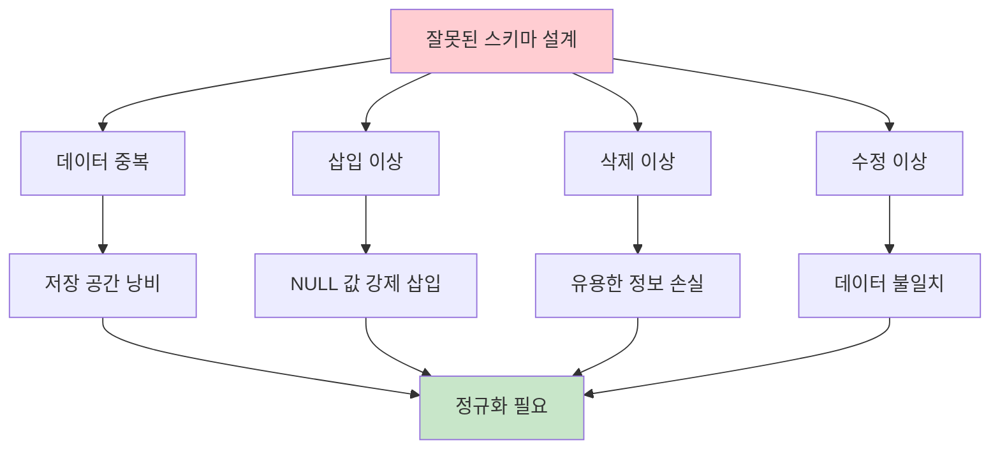

### 🎯 정규화의 목표

| 목표 | 설명 | 결과 |
|------|------|------|
| **데이터 중복 최소화** | 같은 정보의 반복 저장 방지 | 💾 저장 공간 효율성 |
| **이상 현상 방지** | 삽입/삭제/수정 시 문제 해결 | 🛡️ 데이터 무결성 |
| **함수 종속성 준수** | 논리적 관계 유지 | 📊 일관성 보장 |
| **비손실 분해** | 정보 손실 없는 테이블 분해 | ✅ 완전성 유지 |

## 🚨 이상 현상 (Anomaly) 상세 분석

### 🏗️ 좋은 스키마의 조건

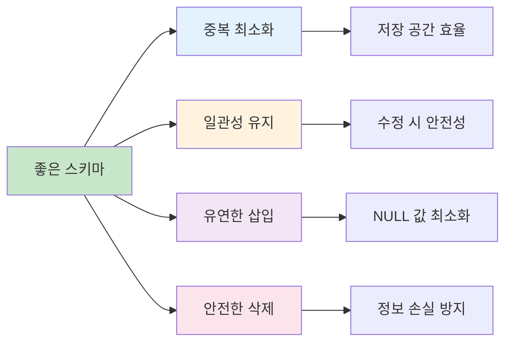

### ⚠️ 스키마 설계 문제점

| 문제점 | 설명 | 예시 |
|--------|------|------|
| **정보 중복 저장** | 같은 데이터가 여러 곳에 저장 | 학과 정보(건물, 예산)가 교수마다 반복 |
| **까다로운 정보 수정** | 일관성 유지를 위한 복잡한 수정 | 학과 예산 변경 시 모든 관련 레코드 수정 |
| **까다로운 정보 삽입** | 불완전한 정보로 인한 NULL 사용 | 교수가 없는 새 학과 등록 시 NULL 필요 |

### 🔄 스키마 분해 (Schema Decomposition)

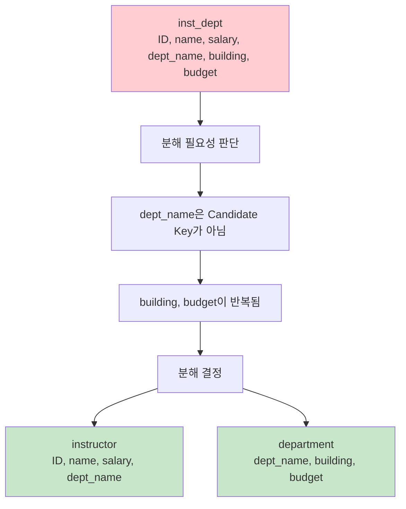

## ⚠️ 이상 현상 (Anomaly) 상세 분석

### 📊 이상 현상 종류별 비교

| 이상 현상 | 발생 상황 | 문제점 | 해결 방법 |
|-----------|-----------|--------|-----------|
| **🗑️ 삭제 이상** | 특정 데이터 삭제 시 | 연관된 유용한 정보까지 손실 | 테이블 분해로 독립성 확보 |
| **➕ 삽입 이상** | 새 데이터 삽입 시 | 불완전한 정보로 NULL 사용 강제 | 독립적인 엔티티별 테이블 구성 |
| **✏️ 수정 이상** | 중복 데이터 수정 시 | 일부만 수정되어 불일치 발생 | 중복 제거로 단일 지점 수정 |

### 🔍 이상 현상 시각화

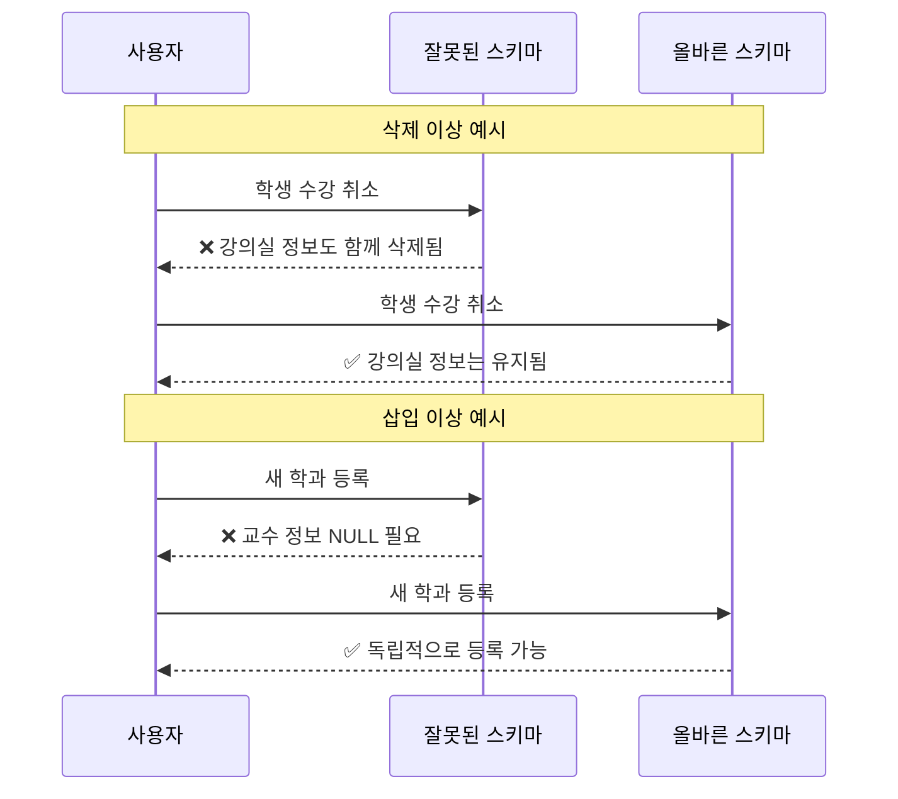

## 🔧 정규화 (Normalization) 개요

### 💡 정규화 정의 및 목적

> **정규화는 데이터베이스의 "건강 검진"과 같습니다!**
> 
> 🏥 **의료 비유**: 건강 검진을 통해 문제를 조기 발견하고 치료하듯
> - 🔍 **정규화 검사**: 스키마의 문제점 발견
> - 💊 **정규화 처리**: 이상 현상 해결을 위한 테이블 분해
> - 🌟 **건강한 DB**: 중복 없고 일관성 있는 데이터베이스

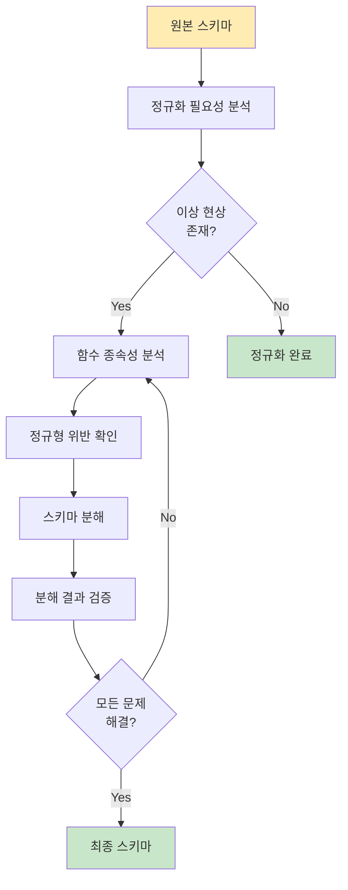

### 🎯 정규화의 핵심 원리

| 단계 | 목표 | 방법 | 결과 |
|------|------|------|------|
| **1️⃣ 문제 발견** | 이상 현상 식별 | 중복, 불일치 분석 | 문제점 목록화 |
| **2️⃣ 원인 분석** | 함수 종속성 파악 | FD 규칙 적용 | 종속 관계 명확화 |
| **3️⃣ 해결 실행** | 테이블 분해 | 정규형 기준 적용 | 정규화된 스키마 |
| **4️⃣ 결과 검증** | 무결성 확인 | 비손실 분해 확인 | 완전한 스키마 |

## 📐 제1정규형 (1NF) - 원자성의 기초

### 🔬 원자적 도메인 (Atomic Domain)

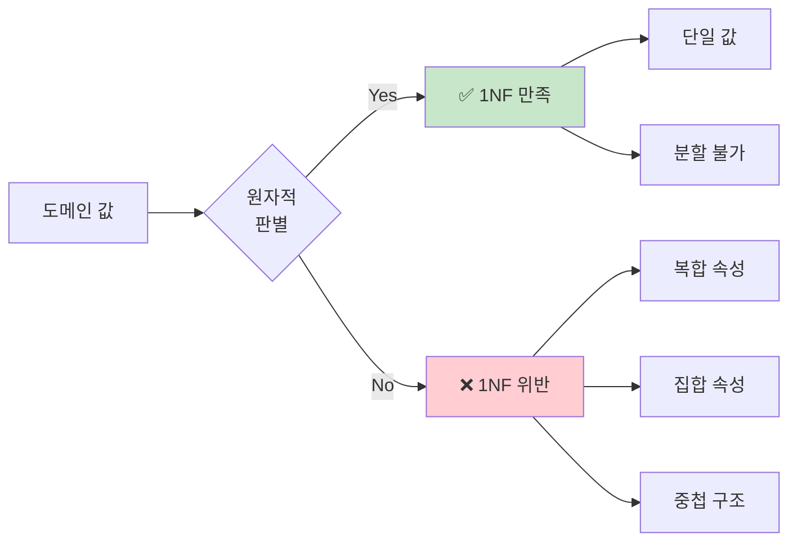

### 📊 1NF 위반 사례 및 수정

| 위반 유형 | 위반 예시 | 수정 방법 | 수정 결과 |
|-----------|-----------|-----------|-----------|
| **복합 속성** | `이름: "홍길동(학부)"` | 이름, 구분 분리 | `이름: "홍길동", 구분: "학부"` |
| **집합 속성** | `전화번호: "010-1234, 02-5678"` | 별도 테이블 생성 | `연락처` 테이블로 분리 |
| **중첩 구조** | `주소: {도시: "서울", 구: "강남"}` | 평면화 | `도시: "서울", 구: "강남"` |

### 🔄 1NF 정규화 과정

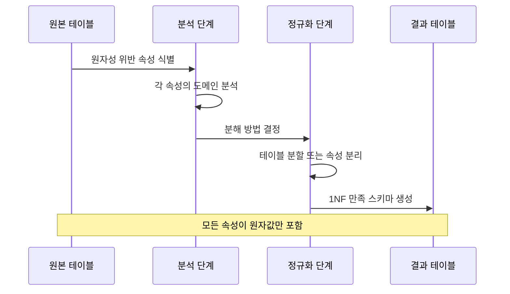

## 📊 함수적 종속성과 키 (Function Dependencies & Keys)

### 🎯 함수적 종속 (Functional Dependency - FD) 완전 정복

#### 💡 핵심 정의
**함수적 종속성**은 릴레이션에서 한 속성 집합의 값이 다른 속성 집합의 값을 유일하게 결정하는 제약조건입니다.

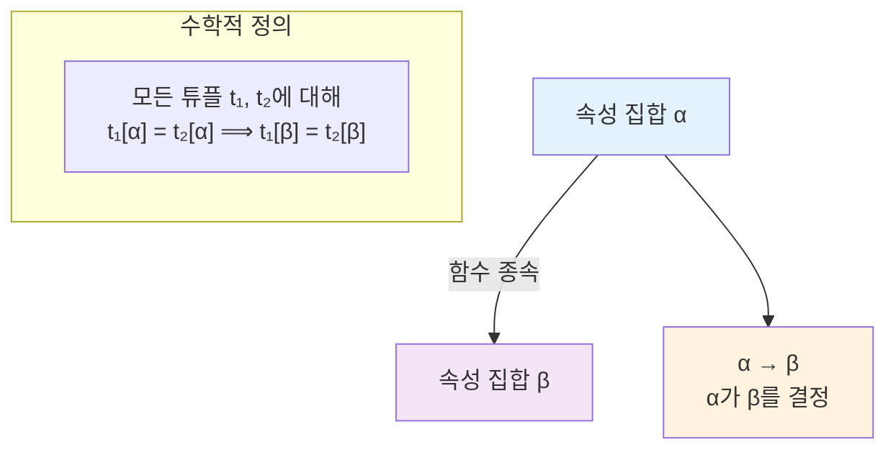

#### 🔍 FD 검증 프로세스

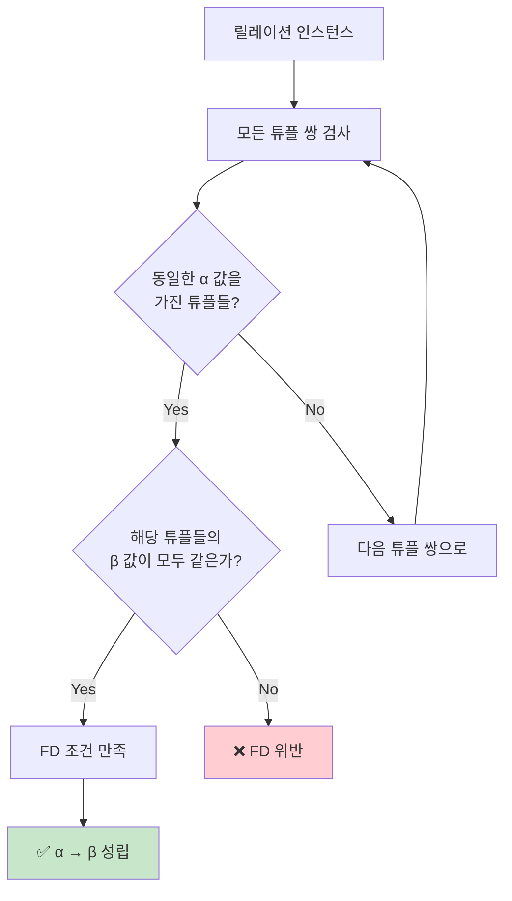

### 📋 실제 예시 분석

#### 데이터베이스: `inst_dept (ID, name, salary, dept_name, building, budget)`

| 함수 종속성 | 성립 여부 | 이유 |
|-------------|-----------|------|
| `주민번호 → 학과` | ✅ 성립 | 한 사람은 하나의 학과에만 소속 |
| `주민번호 → 이름` | ✅ 성립 | 주민번호로 개인을 유일하게 식별 |
| `dept_name → building` | ✅ 성립 | 각 학과는 특정 건물에 위치 |
| `ID → building` | ✅ 성립 | 교수의 ID로 소속 학과의 건물 결정 |
| `학과 → 이름` | ❌ 위반 | 같은 학과에 여러 교수 존재 |
| `dept_name → salary` | ❌ 위반 | 같은 학과에서도 급여는 다름 |

### 🔑 Key 계층 구조

```mermaid
graph TD
    A[속성 집합] --> B{모든 속성을<br/>결정하는가?}
    B -->|Yes| C[Superkey]
    B -->|No| D[일반 속성 집합]
    
    C --> E{최소 집합인가?<br/>부분집합도 슈퍼키?}
    E -->|최소| F[Candidate Key]
    E -->|아님| G[단순 Superkey]
    
    F --> H[Primary Key로<br/>선택 가능]
    
    style F fill:#c8e6c9
    style G fill:#fff3e0
    style D fill:#ffecb3
```

#### 🥇 Key 유형별 비교표

| Key 유형 | 정의 | 특징 | 예시 |
|----------|------|------|------|
| **Superkey** | K → R (모든 속성 결정) | 릴레이션 식별 가능 | {ID}, {ID, name}, {주민번호, 이름} |
| **Candidate Key** | 최소 Superkey | 부분집합은 슈퍼키 불가 | {ID}, {주민번호} |
| **Primary Key** | 선택된 Candidate Key | 테이블당 하나만 | {ID} |
| **Foreign Key** | 다른 테이블 참조 | 참조 무결성 보장 | {dept_name} → department(dept_name) |

### 🎯 FD 사용 목적과 주의사항

#### ✅ 주요 용도
1. **릴레이션 유효성 검사**: 주어진 FD 집합 F를 만족하는지 확인
2. **제약조건 명세**: 적합한 릴레이션들의 조건 구체화
3. **정규화 기반**: BCNF, 3NF 분해의 이론적 근거

#### ⚠️ 중요한 주의사항

```mermaid
graph LR
    A[특정 시점 인스턴스] --> B[우연한 종속성]
    C[모든 가능한 인스턴스] --> D[진정한 FD]
    
    B --> E[❌ 잘못된 FD 판단]
    D --> F[✅ 올바른 FD]
    
    style E fill:#ffcdd2
    style F fill:#c8e6c9
```

**예시**: 현재 시점에 동명이인이 없다고 해서 `name → ID`가 성립한다고 볼 수 없음!

### 🔄 자명한 함수 종속성 (Trivial FD)

#### 💭 개념
**자명한 FD**: 릴레이션의 모든 인스턴스에서 항상 성립하는 당연한 종속성

```mermaid
graph TD
    A["α → β"] --> B{"β ⊆ α?"}
    B -->|Yes| C[🟢 자명한 FD]
    B -->|No| D[🔵 비자명한 FD]
    
    C --> E["예시: {ID, name} → {ID}<br/>{ID, name} → {name}"]
    D --> F["예시: {ID} → {name}<br/>{dept_name} → {building}"]
    
    style C fill:#c8e6c9
    style D fill:#e3f2fd
```

#### 🔧 공리 적용 예시

```mermaid
flowchart LR
    subgraph "예시: F = {A → B, B → C}"
    A1[A → B] --> A2[B → C]
    A2 --> A3[A → C]
    end
    
    subgraph "Augmentation 적용"
    B1[A → B] --> B2[AD → BD]
    end
    
    subgraph "Reflexivity 적용"
    C1[AB → A]
    C2[AB → B]
    end
    
    style A3 fill:#c8e6c9
    style B2 fill:#fff3e0
    style C1 fill:#f3e5f5
    style C2 fill:#f3e5f5
```

#### 🎯 추가 유용한 규칙들

| 규칙 | 이름 | 공식 | 유도 과정 |
|------|------|------|----------|
| **R4** | **Union<br/>(합집합)** | `α → β, α → γ ⟹ α → βγ` | A2 + A3 조합 |
| **R5** | **Decomposition<br/>(분해)** | `α → βγ ⟹ α → β, α → γ` | A1 + A3 조합 |
| **R6** | **Pseudotransitivity<br/>(유사 이행)** | `α → β, βγ → δ ⟹ αγ → δ` | A2 + A3 조합 |

### 🎲 속성 집합의 Closure (α+)

#### 🎯 정의 및 목적
**속성 집합 α의 Closure (α+)**는 α에 의해 **함수적으로 결정되는 모든 속성들의 집합**입니다.

```mermaid
graph TD
    A[속성 집합 α] --> B[FD 집합 F 적용]
    B --> C[결정 가능한 모든 속성]
    C --> D[α+ = Closure]
    
    subgraph "핵심 용도"
    E[🔑 Superkey 판별]
    F[🎯 Candidate Key 찾기]
    G[✅ BCNF/3NF 검사]
    end
    
    style D fill:#c8e6c9
    style E fill:#e3f2fd
    style F fill:#fff3e0
    style G fill:#f3e5f5
```

#### 💻 단계별 계산 예시

**주어진 조건**:
- R = (A, B, C, D)  
- F = {A → B, B → C, A → D}
- 구하고자 하는 것: {A}+

| 단계 | 현재 result | 적용 FD | 새로 추가되는 속성 | 변경 후 result |
|------|-------------|---------|-------------------|----------------|
| 1 | {A} | A → B | B | {A, B} |
| 2 | {A, B} | B → C | C | {A, B, C} |
| 3 | {A, B, C} | A → D | D | {A, B, C, D} |
| 4 | {A, B, C, D} | - | - | 변화 없음 → 종료 |

**결과**: {A}+ = {A, B, C, D} ⟹ A는 R의 **Superkey**!

### 🛠️ 정규화를 위한 핵심 도구들

#### 🎯 정규화의 3대 필수 요소

```mermaid
mindmap
  root((정규화 성공의 열쇠))
    1. FD 분석
      실제 적용되는 FD 식별
      Closure 계산으로 확인
      숨겨진 종속성 발견
    2. 분해 알고리즘
      BCNF 분해
      3NF 분해
      비손실 분해 보장
    3. 검증 과정
      종속성 보존 확인
      정규형 만족도 검사
      성능 영향 평가
```

#### ✅ FD 검증 체크리스트

| 검증 항목 | 확인 방법 | 중요도 |
|-----------|-----------|--------|
| **실제 적용성** | 모든 가능한 인스턴스에서 성립? | ⭐⭐⭐⭐⭐ |
| **완전성** | 모든 필요한 FD가 포함됨? | ⭐⭐⭐⭐ |
| **최소성** | 불필요한 FD는 없는가? | ⭐⭐⭐ |
| **일관성** | 서로 모순되는 FD는 없는가? | ⭐⭐⭐⭐⭐ |

## 🏗️ 정규형 (Normal Forms) 완전 정복

### 🎯 BCNF (Boyce-Codd Normal Form)

#### 💡 핵심 정의
**BCNF**는 모든 비자명한 함수 종속성에서 **결정자가 슈퍼키**인 정규형입니다.

```mermaid
graph TD
    A[릴레이션 R] --> B[모든 FD α → β 검사]
    B --> C{α → β가<br/>자명한가?}
    C -->|Yes| D[✅ 조건 만족]
    C -->|No| E{α가 R의<br/>슈퍼키인가?}
    E -->|Yes| D
    E -->|No| F[❌ BCNF 위반]
    
    D --> G[🎉 BCNF 만족]
    F --> H[🔧 분해 필요]
    
    style G fill:#c8e6c9
    style F fill:#ffcdd2
```

#### 🔍 BCNF 위반 검사 알고리즘

```mermaid
flowchart TD
    A[📋 FD 집합 F에서 각 α → β] --> B{β ⊆ α?}
    B -->|Yes| C[자명한 FD → Skip]
    B -->|No| D[α+를 계산]
    D --> E{α+ = R?}
    E -->|Yes| F[α는 슈퍼키 → OK]
    E -->|No| G[❌ BCNF 위반 발견]
    
    C --> H[다음 FD 검사]
    F --> H
    G --> I[분해 실행]
    H --> J{모든 FD 검사 완료?}
    J -->|No| A
    J -->|Yes| K[✅ BCNF 만족]
    
    style G fill:#ffcdd2
    style K fill:#c8e6c9
```

#### 🛠️ BCNF 분해 알고리즘

**위반 FD α → β가 발견되면**:

| 단계 | 작업 | 공식 | 설명 |
|------|------|------|------|
| 1 | **R1 생성** | `R1 = α ∪ β` | 결정자와 종속자로 구성 |
| 2 | **R2 생성** | `R2 = R - (β - α)` | 원래 릴레이션에서 종속자만 제거 |
| 3 | **연결점 확인** | `R1 ∩ R2 = α` | 결정자가 두 릴레이션의 연결점 |

```mermaid
graph LR
    A["원본: (학번,강의명,교수,교수전화,학점,강의실)"] --> B["1차 분해: 교수 → 교수전화"]
    
    B --> C["R1: (교수, 교수전화)"]
    B --> D["R2: (학번,강의명,교수,학점,강의실)"]
    
    D --> E["2차 분해: 강의명 → 학점"]
    E --> F["R3: (강의명, 학점)"]
    E --> G["R4: (학번,강의명,교수,강의실)"]
    
    style A fill:#ffcdd2
    style C fill:#c8e6c9
    style F fill:#c8e6c9
    style G fill:#c8e6c9
```

### 🎯 3NF (Third Normal Form)

#### 💡 핵심 아이디어
**3NF**는 BCNF보다 **관대한 조건**으로, 종속성 보존을 우선시합니다.

```mermaid
graph TD
    A[모든 비자명한 FD α → β] --> B{α가 슈퍼키?}
    B -->|Yes| C[✅ 조건 1 만족]
    B -->|No| D{β - α의 모든 속성이<br/>Candidate Key에 포함?}
    D -->|Yes| E[✅ 조건 2 만족]
    D -->|No| F[❌ 3NF 위반]
    
    C --> G[🎉 3NF 만족]
    E --> G
    F --> H[🔧 분해 필요]
    
    style G fill:#c8e6c9
    style F fill:#ffcdd2
```

#### 📊 BCNF vs 3NF 비교

| 비교 항목 | BCNF | 3NF |
|-----------|------|-----|
| **엄격성** | 🔴 매우 엄격 | 🟡 상대적으로 관대 |
| **종속성 보존** | ❌ 보장 안됨 | ✅ 항상 보장 |
| **중복 허용** | ❌ 중복 최소화 | 🟡 약간의 중복 허용 |
| **분해 난이도** | 🔴 복잡할 수 있음 | 🟢 상대적으로 단순 |
| **성능** | 🟢 조인 비용 최소 | 🟡 일부 조인 필요할 수 있음 |

### 🔄 분해의 목표와 조건

#### 🎯 분해 시 반드시 지켜야 할 원칙

```mermaid
mindmap
  root((좋은 분해))
    필수 조건
      비손실 분해
        정보 손실 없음
        조인으로 원본 복구 가능
      무결성 유지
        모든 제약조건 유지
        일관성 보장
    권장 조건
      종속성 보존
        개별 릴레이션에서 FD 확인
        조인 없이 검증 가능
      성능 고려
        자주 사용되는 쿼리 최적화
        접근 패턴 분석
```

#### ✅ 비손실 분해 조건

**R을 R1, R2로 분해할 때**:
- R1 ∩ R2 → R1 또는
- R1 ∩ R2 → R2

이 조건 중 하나가 F+에서 성립해야 함

```mermaid
sequenceDiagram
    participant R as 원본 릴레이션 R
    participant R1 as 분해된 R1
    participant R2 as 분해된 R2
    participant J as R1 ⋈ R2
    
    Note over R,J: 비손실 분해 확인
    R->>R1: 프로젝션
    R->>R2: 프로젝션
    R1->>J: 자연 조인
    R2->>J: 자연 조인
    J->>R: 결과 = 원본?
    
    Note over R: ✅ 같으면 비손실 분해
    Note over R: ❌ 다르면 손실 분해
```

# 📖 실전 예제: 트랜잭션 처리

## 문제 상황

- 은행 A 계좌에서 B 계좌로 100만 원 이체
- 트랜잭션 T1: A 계좌에서 100만 원 차감
- 트랜잭션 T2: B 계좌에 100만 원 입금

## 잘못된 처리 예시

```sql
-- T1: A 계좌에서 100만 원 차감
UPDATE 계좌 SET 잔액 = 잔액 - 1000000 WHERE 계좌번호 = 'A';

-- T2: B 계좌에 100만 원 입금
UPDATE 계좌 SET 잔액 = 잔액 + 1000000 WHERE 계좌번호 = 'B';
```

## 문제점

- T1과 T2가 동시에 수행될 경우, A 계좌의 잔액이 일시적으로 음수가 될 수 있음
- 데이터베이스의 일관성이 깨짐

## 해결책: 트랜잭션 사용

```sql
-- 트랜잭션 시작
BEGIN;

-- T1: A 계좌에서 100만 원 차감
UPDATE 계좌 SET 잔액 = 잔액 - 1000000 WHERE 계좌번호 = 'A';

-- T2: B 계좌에 100만 원 입금
UPDATE 계좌 SET 잔액 = 잔액 + 1000000 WHERE 계좌번호 = 'B';

-- 트랜잭션 커밋
COMMIT;
```

## 트랜잭션 처리 이점

- ACID 속성 보장으로 데이터베이스의 일관성과 무결성 유지
- 트랜잭션 단위로 작업 처리로 오류 발생 시 롤백 가능

---

# 🎮 실전 정규화 예시

#### 📚 문제 상황: 수강신청 시스템

**원본 릴레이션**: `Course_Enrollment(학번, 강의명, 교수, 교수전화, 학점, 강의실)`

**함수 종속성**:
- `학번, 강의명 → 교수, 학점, 강의실`
- `교수 → 교수전화`
- `강의명 → 학점`

#### 🔍 Step 1: 문제점 분석

```mermaid
graph TD
    A[원본 테이블] --> B[데이터 중복]
    A --> C[삽입 이상]
    A --> D[삭제 이상]
    A --> E[수정 이상]
    
    B --> B1[교수전화 정보 중복]
    C --> C1[교수만 등록하려면<br/>수강생 정보 필요]
    D --> D1[학생이 수강 취소하면<br/>교수 정보도 삭제]
    E --> E1[교수 전화번호 변경 시<br/>모든 레코드 수정 필요]
    
    style A fill:#ffcdd2
    style B1 fill:#fff3e0
    style C1 fill:#fff3e0
    style D1 fill:#fff3e0
    style E1 fill:#fff3e0
```

#### 🔄 Step 2: 정규화 과정

```mermaid
graph TD
    A[Course_Enrollment] --> B{정규형 위반?<br/>BCNF, 3NF}
    B -->|Yes| C[스키마 분해]
    B -->|No| D[정규형 만족]
    
    C --> E[instructor, department 테이블 생성]
    C --> F[수정된 Course_Enrollment 테이블]
    
    D --> G[정상 작동 중]
    
    style A fill:#ffcdd2
    style D fill:#c8e6c9
```

#### 🔧 Step 2: BCNF 위반 검사

| FD | 결정자 | 슈퍼키 여부 | BCNF 위반 |
|----|--------|-------------|-----------|
| `교수 → 교수전화` | 교수 | ❌ | ✅ 위반 |
| `강의명 → 학점` | 강의명 | ❌ | ✅ 위반 |

#### 🛠️ Step 3: BCNF 분해 과정

```mermaid
flowchart TD
    A["원본: (학번,강의명,교수,교수전화,학점,강의실)"] --> B["1차 분해: 교수 → 교수전화"]
    
    B --> C["R1: (교수, 교수전화)"]
    B --> D["R2: (학번,강의명,교수,학점,강의실)"]
    
    D --> E["2차 분해: 강의명 → 학점"]
    E --> F["R3: (강의명, 학점)"]
    E --> G["R4: (학번,강의명,교수,강의실)"]
    
    style A fill:#ffcdd2
    style C fill:#c8e6c9
    style F fill:#c8e6c9
    style G fill:#c8e6c9
```

### 🎯 Step 4: 최종 결과

**분해된 테이블들**:

| 테이블 | 속성 | Primary Key | 역할 |
|--------|------|-------------|------|
| **교수정보** | (교수, 교수전화) | 교수 | 교수 기본 정보 |
| **강의정보** | (강의명, 학점) | 강의명 | 강의 기본 정보 |
| **수강신청** | (학번, 강의명, 교수, 강의실) | 학번, 강의명 | 수강 관계 |
````
