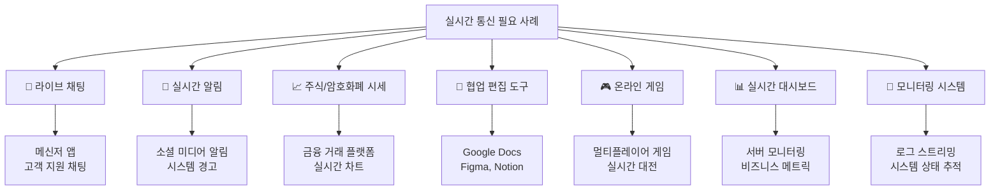
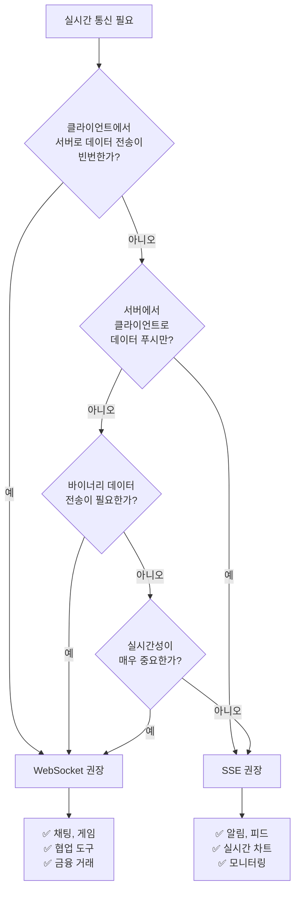
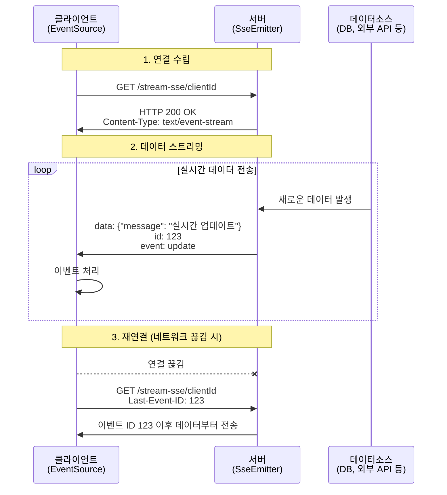
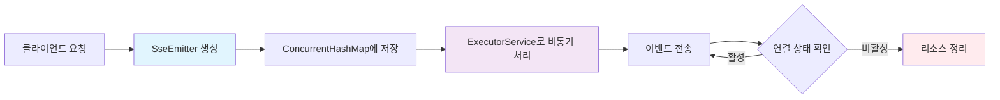
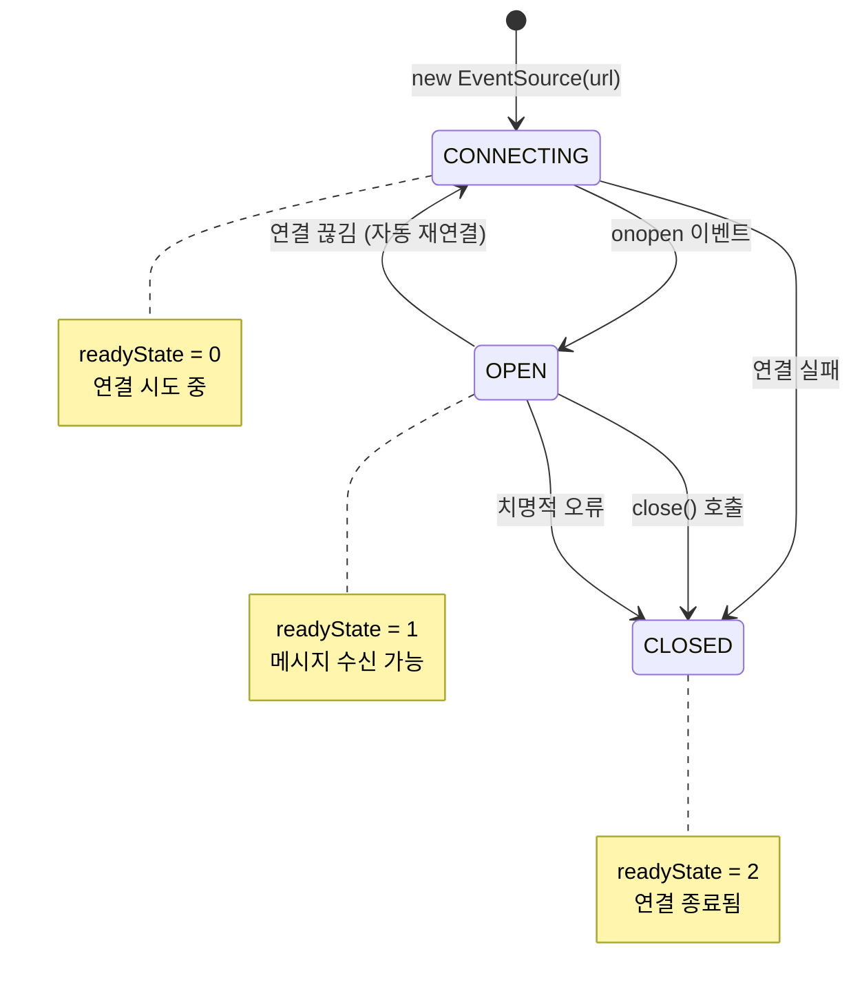

# 📡 Java Spring Boot 및 JavaScript 기반 실시간 통신: SSE와 WebSocket 완전 가이드

<!-- Table of Contents -->
## 📑 목차
- [📖 1. 서론: 실시간 웹 애플리케이션의 필요성](#-1-서론-실시간-웹-애플리케이션의-필요성)
- [⚡ 2. Server-Sent Events (SSE) 구현](#-2-server-sent-events-sse-구현)
- [🔗 3. WebSocket 구현](#-3-websocket-구현)
- [🔍 4. 기술 비교 및 선택 가이드](#-4-기술-비교-및-선택-가이드)
- [⚙️ 5. 고급 고려사항 및 모범 사례](#️-5-고급-고려사항-및-모범-사례)
- [🎯 6. 결론 및 권장사항](#-6-결론-및-권장사항)
- [📚 7. 참고자료 및 추가 학습](#-7-참고자료-및-추가-학습)

---

## 📖 1. 서론: 실시간 웹 애플리케이션의 필요성

### 🌟 실시간 통신의 중요성
현대 웹 애플리케이션 환경은 **즉각적인 정보 업데이트**와 **상호작용**을 제공하는 방향으로 빠르게 발전하고 있습니다. 

전통적인 요청-응답 모델의 한계:
- 🔄 클라이언트가 서버에 지속적으로 폴링(polling)해야 함
- ⏱️ 실시간성 부족으로 사용자 경험 저하
- 🔋 불필요한 네트워크 트래픽 및 서버 자원 낭비

### 🎯 실시간 통신이 필요한 대표적 사용 사례



### 🔧 주요 실시간 통신 기술 개요

이 가이드에서는 두 가지 핵심 기술을 다룹니다:

#### 🌊 Server-Sent Events (SSE)
- **방향**: 서버 → 클라이언트 (단방향)
- **기반**: HTTP/HTTPS 표준 프로토콜
- **특징**: 자동 재연결, 이벤트 ID 지원
- **용도**: 서버 주도형 데이터 푸시

#### 🔗 WebSocket
- **방향**: 양방향 (서버 ↔ 클라이언트)
- **기반**: HTTP에서 업그레이드된 프로토콜
- **특징**: 낮은 지연시간, 바이너리 데이터 지원
- **용도**: 상호작용이 빈번한 애플리케이션

### 📋 기술 선택 플로우차트



### 🎯 이 가이드의 목표

본 가이드는 다음과 같은 **실무 중심의 내용**을 제공합니다:

1. 📝 **상세한 코드 예제**: 주석이 풍부한 실제 구현 코드
2. 🏗️ **아키텍처 설계**: 확장 가능한 실시간 시스템 구조
3. 🔧 **최적화 기법**: 성능과 안정성 향상 방법
4. 🚨 **에러 처리**: 견고한 에러 핸들링 전략
5. 📊 **비교 분석**: 기술별 장단점 및 선택 기준
---

## ⚡ 2. Server-Sent Events (SSE) 구현

### 🔍 SSE 개요 및 특징

Server-Sent Events는 **HTTP 표준**을 기반으로 하는 서버→클라이언트 **단방향 데이터 스트리밍** 기술입니다.

#### 🎯 주요 특징
- ✅ **HTTP/HTTPS 호환**: 기존 웹 인프라와 완벽 호환
- ✅ **자동 재연결**: 연결 끊김 시 자동으로 재시도
- ✅ **이벤트 ID**: 메시지 유실 방지 및 재개 지원
- ✅ **간단한 구현**: WebSocket보다 상대적으로 단순
- ❌ **단방향 통신**: 클라이언트→서버 통신 불가

#### 🏗️ SSE 통신 아키텍처



### 🛠️ 2.1. Java Spring Boot 서버 측 구현

#### 📁 프로젝트 구조
```
src/main/java/
├── controller/
│   └── SseController.java          # SSE 엔드포인트
├── service/
│   └── SseNotificationService.java # SSE 알림 서비스
├── config/
│   └── AsyncConfig.java            # 비동기 설정
└── model/
    └── NotificationMessage.java    # 알림 메시지 모델
```

#### 🔧 주요 컴포넌트 설명

**SseEmitter**: Spring MVC의 핵심 SSE 지원 클래스
- `ResponseBodyEmitter`의 하위 클래스
- 서버에서 생성되는 이벤트를 클라이언트로 스트리밍
- 타임아웃 및 생명주기 관리 지원

#### ⚙️ 설정 및 관리 전략



#### 📋 생명주기 콜백 처리

| 콜백 | 호출 시점 | 용도 |
|------|-----------|------|
| `onCompletion` | 정상 완료 | 리소스 정리, 통계 수집 |
| `onTimeout` | 타임아웃 | 타임아웃 로깅, 정상 종료 처리 |
| `onError` | 오류 발생 | 오류 로깅, 예외 처리 |

#### 💻 완전한 Spring Boot SSE 구현 예제

**📝 SseController.java**
```java

package com.example.sseserver.controller;

import com.example.sseserver.model.NotificationMessage;
import com.example.sseserver.service.SseNotificationService;
import lombok.RequiredArgsConstructor;
import lombok.extern.slf4j.Slf4j;
import org.springframework.http.MediaType;
import org.springframework.http.ResponseEntity;
import org.springframework.web.bind.annotation.*;
import org.springframework.web.servlet.mvc.method.annotation.SseEmitter;

import java.io.IOException;
import java.time.LocalDateTime;
import java.util.Map;
import java.util.concurrent.ConcurrentHashMap;
import java.util.concurrent.ExecutorService;
import java.util.concurrent.Executors;

@Slf4j
@RestController
@RequiredArgsConstructor
@RequestMapping("/api/sse")
public class SseController {

    private final SseNotificationService notificationService;
    
    // 스레드 안전한 클라이언트 세션 관리
    private final Map<String, SseEmitter> emitters = new ConcurrentHashMap<>();
    
    // 비동기 이벤트 전송을 위한 ExecutorService
    private final ExecutorService sseExecutor = Executors.newCachedThreadPool();

    /**
     * 📡 SSE 연결 엔드포인트
     * @param clientId 클라이언트 식별자
     * @param lastEventId 마지막 수신 이벤트 ID (재연결 시 사용)
     * @return SseEmitter 객체
     */
    @GetMapping(path = "/stream/{clientId}", produces = MediaType.TEXT_EVENT_STREAM_VALUE)
    public SseEmitter streamEvents(
            @PathVariable String clientId,
            @RequestHeader(value = "Last-Event-ID", required = false) String lastEventId) {
        
        log.info("🔗 SSE 연결 요청 - 클라이언트: {}, 마지막 이벤트 ID: {}", clientId, lastEventId);
        
        // 1시간 타임아웃 설정
        SseEmitter emitter = new SseEmitter(3600_000L);
        
        // 클라이언트 세션 등록
        emitters.put(clientId, emitter);
        
        // 생명주기 콜백 설정
        setupEmitterCallbacks(clientId, emitter);
        
        // 초기 연결 메시지 전송
        sendInitialMessage(clientId, emitter);
        
        // 마지막 이벤트 ID가 있다면, 누락된 이벤트 재전송
        if (lastEventId != null) {
            resendMissedEvents(clientId, lastEventId, emitter);
        }
        
        return emitter;
    }

    /**
     * 🔔 특정 클라이언트에게 알림 전송
     */
    @PostMapping("/notify/{clientId}")
    public ResponseEntity<String> sendNotification(
            @PathVariable String clientId,
            @RequestBody NotificationMessage message) {
        
        SseEmitter emitter = emitters.get(clientId);
        if (emitter == null) {
            return ResponseEntity.notFound().build();
        }
        
        notificationService.sendNotification(clientId, message, emitter);
        return ResponseEntity.ok("알림이 전송되었습니다.");
    }

    /**
     * 📢 모든 연결된 클라이언트에게 브로드캐스트
     */
    @PostMapping("/broadcast")
    public ResponseEntity<String> broadcastMessage(@RequestBody NotificationMessage message) {
        int sentCount = notificationService.broadcastToAll(message, emitters);
        return ResponseEntity.ok(String.format("메시지가 %d개 클라이언트에게 전송되었습니다.", sentCount));
    }

    /**
     * 📊 현재 연결된 클라이언트 정보 조회
     */
    @GetMapping("/clients")
    public ResponseEntity<Map<String, Object>> getConnectedClients() {
        return ResponseEntity.ok(Map.of(
            "totalClients", emitters.size(),
            "clientIds", emitters.keySet(),
            "timestamp", LocalDateTime.now()
        ));
    }

    /**
     * ⚙️ SseEmitter 생명주기 콜백 설정
     */
    private void setupEmitterCallbacks(String clientId, SseEmitter emitter) {
        // 타임아웃 처리
        emitter.onTimeout(() -> {
            log.warn("⏰ SSE 타임아웃 - 클라이언트: {}", clientId);
            emitter.complete(); // 정상 완료 처리
            emitters.remove(clientId);
        });

        // 완료 처리
        emitter.onCompletion(() -> {
            log.info("✅ SSE 연결 완료 - 클라이언트: {}", clientId);
            emitters.remove(clientId);
        });

        // 오류 처리
        emitter.onError(ex -> {
            log.error("❌ SSE 오류 발생 - 클라이언트: {}, 오류: {}", clientId, ex.getMessage());
            emitters.remove(clientId);
        });
    }

    /**
     * 🚀 초기 연결 메시지 전송
     */
    private void sendInitialMessage(String clientId, SseEmitter emitter) {
        sseExecutor.execute(() -> {
            try {
                emitter.send(SseEmitter.event()
                    .id(String.valueOf(System.currentTimeMillis()))
                    .name("connection")
                    .data(Map.of(
                        "message", "SSE 연결이 성공적으로 수립되었습니다.",
                        "clientId", clientId,
                        "timestamp", LocalDateTime.now()
                    ))
                    .reconnectTime(10000L));
                
                log.info("📤 초기 메시지 전송 완료 - 클라이언트: {}", clientId);
            } catch (IOException e) {
                log.error("❌ 초기 메시지 전송 실패 - 클라이언트: {}", clientId, e);
            }
        });
    }

    /**
     * 🔄 누락된 이벤트 재전송 (재연결 시)
     */
    private void resendMissedEvents(String clientId, String lastEventId, SseEmitter emitter) {
        sseExecutor.execute(() -> {
            // 실제 구현에서는 데이터베이스나 캐시에서 누락된 이벤트를 조회
            log.info("🔄 누락된 이벤트 재전송 시작 - 클라이언트: {}, 마지막 ID: {}", clientId, lastEventId);
            // TODO: 실제 누락 이벤트 재전송 로직 구현
        });
    }
}
```

**📝 NotificationMessage.java (모델 클래스)**
```java
package com.example.sseserver.model;

import lombok.AllArgsConstructor;
import lombok.Builder;
import lombok.Data;
import lombok.NoArgsConstructor;

import java.time.LocalDateTime;

@Data
@Builder
@NoArgsConstructor
@AllArgsConstructor
public class NotificationMessage {
    private String id;
    private String type;        // "info", "warning", "error", "success"
    private String title;
    private String content;
    private String sender;
    private LocalDateTime timestamp;
    private Object metadata;    // 추가 메타데이터
}
```

**📝 SseNotificationService.java (서비스 클래스)**
```java
package com.example.sseserver.service;

import com.example.sseserver.model.NotificationMessage;
import lombok.extern.slf4j.Slf4j;
import org.springframework.stereotype.Service;
import org.springframework.web.servlet.mvc.method.annotation.SseEmitter;

import java.io.IOException;
import java.time.LocalDateTime;
import java.util.Map;
import java.util.concurrent.ExecutorService;
import java.util.concurrent.Executors;

@Slf4j
@Service
public class SseNotificationService {
    
    private final ExecutorService asyncExecutor = Executors.newCachedThreadPool();
    
    /**
     * 특정 클라이언트에게 알림 전송
     */
    public void sendNotification(String clientId, NotificationMessage message, SseEmitter emitter) {
        asyncExecutor.execute(() -> {
            try {
                // 메시지에 타임스탬프 추가
                message.setTimestamp(LocalDateTime.now());
                
                emitter.send(SseEmitter.event()
                    .id(message.getId())
                    .name(message.getType())
                    .data(message));
                
                log.info("📤 알림 전송 성공 - 클라이언트: {}, 타입: {}", clientId, message.getType());
                
            } catch (IOException e) {
                log.error("❌ 알림 전송 실패 - 클라이언트: {}", clientId, e);
            }
        });
    }
    
    /**
     * 모든 클라이언트에게 브로드캐스트
     */
    public int broadcastToAll(NotificationMessage message, Map<String, SseEmitter> emitters) {
        int successCount = 0;
        message.setTimestamp(LocalDateTime.now());
        
        for (Map.Entry<String, SseEmitter> entry : emitters.entrySet()) {
            String clientId = entry.getKey();
            SseEmitter emitter = entry.getValue();
            
            try {
                emitter.send(SseEmitter.event()
                    .id(message.getId())
                    .name(message.getType())
                    .data(message));
                
                successCount++;
                log.debug("📤 브로드캐스트 전송 - 클라이언트: {}", clientId);
                
            } catch (IOException e) {
                log.error("❌ 브로드캐스트 실패 - 클라이언트: {}", clientId, e);
                // 실패한 연결은 제거 (호출자에서 처리)
            }
        }
        
        log.info("📢 브로드캐스트 완료 - 성공: {}/{}", successCount, emitters.size());
        return successCount;
    }
}
```

#### 🎛️ 비동기 설정 (권장사항)

**📝 AsyncConfig.java**
```java
package com.example.sseserver.config;

import org.springframework.context.annotation.Bean;
import org.springframework.context.annotation.Configuration;
import org.springframework.scheduling.annotation.EnableAsync;
import org.springframework.scheduling.concurrent.ThreadPoolTaskExecutor;

import java.util.concurrent.Executor;

@Configuration
@EnableAsync
public class AsyncConfig {
    
    @Bean(name = "sseTaskExecutor")
    public Executor sseTaskExecutor() {
        ThreadPoolTaskExecutor executor = new ThreadPoolTaskExecutor();
        executor.setCorePoolSize(10);
        executor.setMaxPoolSize(50);
        executor.setQueueCapacity(200);
        executor.setThreadNamePrefix("SSE-");
        executor.setWaitForTasksToCompleteOnShutdown(true);
        executor.setAwaitTerminationSeconds(60);
        executor.initialize();
        return executor;
    }
}
```

### 🌐 2.2. JavaScript 클라이언트 측 구현

#### 🔧 EventSource API 개요

**EventSource**는 브라우저에서 SSE를 수신하기 위한 표준 API입니다.

#### 📊 EventSource 상태 관리



#### 💻 완전한 JavaScript SSE 클라이언트 구현

**📝 sse-client.html**
```html
<!DOCTYPE html>
<html lang="ko">
<head>
    <meta charset="UTF-8">
    <meta name="viewport" content="width=device-width, initial-scale=1.0">
    <title>🚀 고급 SSE 클라이언트</title>
    <style>
        /* 🎨 현대적인 UI 스타일 */
        * {
            margin: 0;
            padding: 0;
            box-sizing: border-box;
        }
        
        body {
            font-family: 'Segoe UI', Tahoma, Geneva, Verdana, sans-serif;
            background: linear-gradient(135deg, #667eea 0%, #764ba2 100%);
            min-height: 100vh;
            padding: 20px;
        }
        
        .container {
            max-width: 1200px;
            margin: 0 auto;
            background: white;
            border-radius: 15px;
            box-shadow: 0 20px 40px rgba(0,0,0,0.1);
            overflow: hidden;
        }
        
        .header {
            background: linear-gradient(135deg, #4facfe 0%, #00f2fe 100%);
            color: white;
            padding: 30px;
            text-align: center;
        }
        
        .status-bar {
            padding: 20px;
            background: #f8f9fa;
            border-bottom: 1px solid #dee2e6;
            display: flex;
            justify-content: space-between;
            align-items: center;
            flex-wrap: wrap;
            gap: 10px;
        }
        
        .status-badge {
            padding: 8px 16px;
            border-radius: 20px;
            font-size: 14px;
            font-weight: bold;
        }
        
        .status-connecting {
            background: #ffc107;
            color: #212529;
        }
        
        .status-connected {
            background: #28a745;
            color: white;
        }
        
        .status-disconnected {
            background: #dc3545;
            color: white;
        }
        
        .controls {
            padding: 20px;
            display: flex;
            gap: 10px;
            flex-wrap: wrap;
        }
        
        .btn {
            padding: 12px 24px;
            border: none;
            border-radius: 8px;
            cursor: pointer;
            font-size: 14px;
            font-weight: bold;
            transition: all 0.3s ease;
            text-decoration: none;
            display: inline-block;
        }
        
        .btn-primary {
            background: #007bff;
            color: white;
        }
        
        .btn-danger {
            background: #dc3545;
            color: white;
        }
        
        .btn-success {
            background: #28a745;
            color: white;
        }
        
        .btn:hover {
            transform: translateY(-2px);
            box-shadow: 0 5px 15px rgba(0,0,0,0.2);
        }
        
        .btn:disabled {
            opacity: 0.6;
            cursor: not-allowed;
            transform: none;
        }
        
        .events-container {
            height: 400px;
            overflow-y: auto;
            padding: 20px;
            background: #f8f9fa;
        }
        
        .event-item {
            background: white;
            margin-bottom: 15px;
            padding: 15px;
            border-radius: 10px;
            border-left: 4px solid #007bff;
            box-shadow: 0 2px 10px rgba(0,0,0,0.05);
            animation: slideIn 0.3s ease;
        }
        
        @keyframes slideIn {
            from {
                opacity: 0;
                transform: translateY(20px);
            }
            to {
                opacity: 1;
                transform: translateY(0);
            }
        }
        
        .event-type {
            font-size: 12px;
            font-weight: bold;
            color: #6c757d;
            margin-bottom: 5px;
        }
        
        .event-content {
            font-size: 14px;
            color: #495057;
            line-height: 1.5;
        }
        
        .event-time {
            font-size: 11px;
            color: #adb5bd;
            margin-top: 8px;
        }
        
        .event-error {
            border-left-color: #dc3545;
            background: #f8d7da;
        }
        
        .event-success {
            border-left-color: #28a745;
            background: #d4edda;
        }
        
        .event-warning {
            border-left-color: #ffc107;
            background: #fff3cd;
        }
        
        .input-group {
            display: flex;
            gap: 10px;
            margin-bottom: 10px;
        }
        
        .form-control {
            flex: 1;
            padding: 10px;
            border: 2px solid #dee2e6;
            border-radius: 6px;
            font-size: 14px;
        }
        
        .form-control:focus {
            outline: none;
            border-color: #007bff;
            box-shadow: 0 0 0 3px rgba(0,123,255,0.25);
        }
        
        .stats {
            display: flex;
            gap: 20px;
            font-size: 14px;
        }
        
        .stat-item {
            display: flex;
            flex-direction: column;
            align-items: center;
        }
        
        .stat-value {
            font-size: 24px;
            font-weight: bold;
            color: #007bff;
        }
        
        .stat-label {
            color: #6c757d;
            font-size: 12px;
        }
    </style>
</head>
<body>
    <div class="container">
        <div class="header">
            <h1>🚀 고급 Server-Sent Events 클라이언트</h1>
            <p>실시간 이벤트 스트리밍 데모</p>
        </div>
        
        <div class="status-bar">
            <div>
                <span id="connectionStatus" class="status-badge status-disconnected">
                    🔴 연결 끊김
                </span>
                <span id="clientIdDisplay"></span>
            </div>
            
            <div class="stats">
                <div class="stat-item">
                    <div id="receivedCount" class="stat-value">0</div>
                    <div class="stat-label">수신 메시지</div>
                </div>
                <div class="stat-item">
                    <div id="connectionTime" class="stat-value">--</div>
                    <div class="stat-label">연결 시간</div>
                </div>
                <div class="stat-item">
                    <div id="lastEventId" class="stat-value">--</div>
                    <div class="stat-label">마지막 이벤트 ID</div>
                </div>
            </div>
        </div>
        
        <div class="controls">
            <div class="input-group">
                <input type="text" id="clientIdInput" class="form-control" 
                       placeholder="클라이언트 ID (자동 생성됨)" readonly>
                <button id="connectBtn" class="btn btn-primary">🔗 연결</button>
                <button id="disconnectBtn" class="btn btn-danger" disabled>🔌 연결 해제</button>
            </div>
            
            <button id="clearBtn" class="btn btn-success">🧹 로그 지우기</button>
            <button id="testNotificationBtn" class="btn btn-primary" disabled>📬 테스트 알림</button>
        </div>
        
        <div class="events-container" id="eventsContainer">
            <div class="event-item">
                <div class="event-type">시스템</div>
                <div class="event-content">연결 버튼을 클릭하여 SSE 스트림을 시작하세요.</div>
                <div class="event-time">시작 준비 완료</div>
            </div>
        </div>
    </div>

    <script>
        // 🌍 전역 변수 및 상태 관리
        class SSEClient {
            constructor() {
                this.eventSource = null;
                this.clientId = this.generateClientId();
                this.isConnected = false;
                this.connectionStartTime = null;
                this.receivedCount = 0;
                this.lastEventId = null;
                this.reconnectAttempts = 0;
                this.maxReconnectAttempts = 5;
                this.reconnectDelay = 1000; // 1초부터 시작
                
                this.initializeUI();
                this.bindEvents();
            }
            
            // 🆔 고유한 클라이언트 ID 생성
            generateClientId() {
                return 'client-' + Math.random().toString(36).substr(2, 9) + '-' + Date.now();
            }
            
            // 🎛️ UI 초기화
            initializeUI() {
                document.getElementById('clientIdInput').value = this.clientId;
                document.getElementById('clientIdDisplay').textContent = `ID: ${this.clientId}`;
                this.updateConnectionStatus('disconnected');
            }
            
            // 🔗 이벤트 바인딩
            bindEvents() {
                document.getElementById('connectBtn').onclick = () => this.connect();
                document.getElementById('disconnectBtn').onclick = () => this.disconnect();
                document.getElementById('clearBtn').onclick = () => this.clearEvents();
                document.getElementById('testNotificationBtn').onclick = () => this.sendTestNotification();
                
                // 페이지 종료 시 정리
                window.addEventListener('beforeunload', () => this.disconnect());
            }
            
            // 📡 SSE 연결 시작
            connect() {
                if (this.isConnected) {
                    this.logEvent('warning', '이미 연결되어 있습니다.');
                    return;
                }
                
                this.logEvent('info', `SSE 연결을 시작합니다... (ID: ${this.clientId})`);
                this.updateConnectionStatus('connecting');
                
                // EventSource 생성
                const url = `/api/sse/stream/${this.clientId}`;
                this.eventSource = new EventSource(url);
                
                // 🟢 연결 성공
                this.eventSource.onopen = (event) => {
                    this.isConnected = true;
                    this.connectionStartTime = new Date();
                    this.reconnectAttempts = 0;
                    this.reconnectDelay = 1000;
                    
                    this.updateConnectionStatus('connected');
                    this.logEvent('success', '✅ SSE 연결이 성공적으로 수립되었습니다.');
                    this.updateConnectionTime();
                    
                    document.getElementById('connectBtn').disabled = true;
                    document.getElementById('disconnectBtn').disabled = false;
                    document.getElementById('testNotificationBtn').disabled = false;
                };
                
                // 📨 메시지 수신 (기본 메시지)
                this.eventSource.onmessage = (event) => {
                    this.handleMessage('message', event);
                };
                
                // 🔗 연결 이벤트 (명명된 이벤트)
                this.eventSource.addEventListener('connection', (event) => {
                    this.handleMessage('connection', event);
                });
                
                // 🔔 알림 이벤트
                this.eventSource.addEventListener('info', (event) => {
                    this.handleMessage('info', event);
                });
                
                this.eventSource.addEventListener('warning', (event) => {
                    this.handleMessage('warning', event);
                });
                
                this.eventSource.addEventListener('error', (event) => {
                    this.handleMessage('error', event);
                });
                
                this.eventSource.addEventListener('success', (event) => {
                    this.handleMessage('success', event);
                });
                
                // ❌ 오류 처리
                this.eventSource.onerror = (event) => {
                    console.error('SSE Error:', event);
                    
                    if (this.eventSource.readyState === EventSource.CLOSED) {
                        this.logEvent('error', '❌ SSE 연결이 서버에 의해 종료되었습니다.');
                        this.handleDisconnection();
                    } else if (this.eventSource.readyState === EventSource.CONNECTING) {
                        this.logEvent('warning', '🔄 연결이 끊어졌습니다. 재연결을 시도하는 중...');
                        this.updateConnectionStatus('connecting');
                        this.attemptReconnect();
                    }
                };
            }
            
            // 📥 메시지 처리
            handleMessage(eventType, event) {
                try {
                    const data = JSON.parse(event.data);
                    this.receivedCount++;
                    this.lastEventId = event.lastEventId || data.id || null;
                    
                    // UI 업데이트
                    this.updateStats();
                    
                    // 메시지 로깅
                    const content = data.message || data.content || data.title || JSON.stringify(data);
                    this.logEvent(eventType, content, data);
                    
                } catch (e) {
                    // JSON 파싱 실패 시 원본 데이터 표시
                    this.receivedCount++;
                    this.updateStats();
                    this.logEvent(eventType, event.data);
                }
            }
            
            // 🔄 재연결 시도
            attemptReconnect() {
                if (this.reconnectAttempts >= this.maxReconnectAttempts) {
                    this.logEvent('error', `❌ 최대 재연결 시도 횟수(${this.maxReconnectAttempts})에 도달했습니다.`);
                    this.handleDisconnection();
                    return;
                }
                
                this.reconnectAttempts++;
                const delay = Math.min(this.reconnectDelay * Math.pow(2, this.reconnectAttempts - 1), 30000);
                
                this.logEvent('warning', `🔄 ${delay/1000}초 후 재연결을 시도합니다... (${this.reconnectAttempts}/${this.maxReconnectAttempts})`);
                
                setTimeout(() => {
                    if (!this.isConnected) {
                        this.connect();
                    }
                }, delay);
            }
            
            // 🔌 연결 해제
            disconnect() {
                if (!this.isConnected) {
                    this.logEvent('warning', '이미 연결이 해제되어 있습니다.');
                    return;
                }
                
                if (this.eventSource) {
                    this.eventSource.close();
                    this.eventSource = null;
                }
                
                this.handleDisconnection();
                this.logEvent('info', '🔌 SSE 연결이 해제되었습니다.');
            }
            
            // 🔄 연결 해제 후 처리
            handleDisconnection() {
                this.isConnected = false;
                this.connectionStartTime = null;
                this.updateConnectionStatus('disconnected');
                this.updateConnectionTime();
                
                document.getElementById('connectBtn').disabled = false;
                document.getElementById('disconnectBtn').disabled = true;
                document.getElementById('testNotificationBtn').disabled = true;
            }
            
            // 📊 상태 업데이트
            updateConnectionStatus(status) {
                const statusElement = document.getElementById('connectionStatus');
                const statusTexts = {
                    'connecting': '🟡 연결 중...',
                    'connected': '🟢 연결됨',
                    'disconnected': '🔴 연결 끊김'
                };
                
                statusElement.textContent = statusTexts[status];
                statusElement.className = `status-badge status-${status}`;
            }
            
            // ⏰ 연결 시간 업데이트
            updateConnectionTime() {
                const timeElement = document.getElementById('connectionTime');
                if (this.connectionStartTime) {
                    const diff = Math.floor((new Date() - this.connectionStartTime) / 1000);
                    timeElement.textContent = `${diff}초`;
                } else {
                    timeElement.textContent = '--';
                }
            }
            
            // 📈 통계 업데이트
            updateStats() {
                document.getElementById('receivedCount').textContent = this.receivedCount;
                document.getElementById('lastEventId').textContent = this.lastEventId || '--';
            }
            
            // 📝 이벤트 로깅
            logEvent(type, message, data = null) {
                const container = document.getElementById('eventsContainer');
                const eventItem = document.createElement('div');
                eventItem.className = `event-item event-${type}`;
                
                const typeEmojis = {
                    'info': 'ℹ️',
                    'success': '✅',
                    'warning': '⚠️',
                    'error': '❌',
                    'connection': '🔗',
                    'message': '📨'
                };
                
                eventItem.innerHTML = `
                    <div class="event-type">${typeEmojis[type] || '📝'} ${type.toUpperCase()}</div>
                    <div class="event-content">${message}</div>
                    ${data ? `<div class="event-content"><pre style="margin-top: 10px; font-size: 12px; background: rgba(0,0,0,0.05); padding: 10px; border-radius: 5px; overflow-x: auto;">${JSON.stringify(data, null, 2)}</pre></div>` : ''}
                    <div class="event-time">${new Date().toLocaleString('ko-KR')}</div>
                `;
                
                container.appendChild(eventItem);
                container.scrollTop = container.scrollHeight;
                
                // 너무 많은 로그는 제거 (성능 최적화)
                const items = container.querySelectorAll('.event-item');
                if (items.length > 100) {
                    items[0].remove();
                }
            }
            
            // 🧹 이벤트 로그 지우기
            clearEvents() {
                const container = document.getElementById('eventsContainer');
                container.innerHTML = '';
                this.receivedCount = 0;
                this.updateStats();
                this.logEvent('info', '📝 이벤트 로그가 지워졌습니다.');
            }
            
            // 📬 테스트 알림 전송
            async sendTestNotification() {
                try {
                    const response = await fetch(`/api/sse/notify/${this.clientId}`, {
                        method: 'POST',
                        headers: {
                            'Content-Type': 'application/json'
                        },
                        body: JSON.stringify({
                            id: Date.now().toString(),
                            type: 'info',
                            title: '테스트 알림',
                            content: '이것은 테스트 알림 메시지입니다.',
                            sender: 'SSE 클라이언트'
                        })
                    });
                    
                    if (response.ok) {
                        this.logEvent('success', '📬 테스트 알림이 전송되었습니다.');
                    } else {
                        this.logEvent('error', '❌ 테스트 알림 전송에 실패했습니다.');
                    }
                } catch (error) {
                    this.logEvent('error', `❌ 네트워크 오류: ${error.message}`);
                }
            }
        }
        
        // 🚀 애플리케이션 시작
        document.addEventListener('DOMContentLoaded', () => {
            window.sseClient = new SSEClient();
            
            // 연결 시간 업데이트 (1초마다)
            setInterval(() => {
                if (window.sseClient.isConnected) {
                    window.sseClient.updateConnectionTime();
                }
            }, 1000);
        });
    </script>
</body>
</html>
```

#### 🔧 고급 클라이언트 기능

##### 🔄 자동 재연결 전략
```javascript
// 지수 백오프(Exponential Backoff) 알고리즘
function calculateReconnectDelay(attemptNumber) {
    const baseDelay = 1000; // 1초
    const maxDelay = 30000; // 30초
    const delay = baseDelay * Math.pow(2, attemptNumber - 1);
    return Math.min(delay, maxDelay);
}
```

##### 📊 연결 상태 모니터링
```javascript
// 연결 상태 실시간 추적
const ConnectionState = {
    DISCONNECTED: 0,
    CONNECTING: 1,
    CONNECTED: 2,
    ERROR: 3
};
```

### 📈 SSE 성능 최적화 팁

#### 🚀 서버 측 최적화
1. **비동기 처리**: ExecutorService 활용으로 스레드 풀 효율성 증대
2. **메모리 관리**: 적절한 타임아웃 설정으로 좀비 연결 방지
3. **압축**: Gzip 압축으로 대역폭 사용량 감소
4. **캐싱**: 자주 전송되는 데이터에 대한 캐싱 전략

#### 💻 클라이언트 측 최적화
1. **이벤트 처리**: 대량의 이벤트 수신 시 배치 처리
2. **메모리 정리**: 오래된 이벤트 로그 자동 삭제
3. **에러 핸들링**: 견고한 에러 복구 메커니즘
4. **사용자 경험**: 연결 상태 시각적 피드백


3. 웹소켓 (WebSocket) 구현
웹소켓은 클라이언트와 서버 간의 양방향 통신을 위한 프로토콜로, 한 번 연결이 수립되면 데이터를 실시간으로 주고받을 수 있습니다. SSE와 달리 클라이언트도 서버로 메시지를 보낼 수 있어 채팅, 온라인 게임 등 상호작용이 중요한 애플리케이션에 적합합니다.
3.1. Java Spring Boot 서버 측
Spring Boot는 웹소켓을 지원하는 두 가지 주요 방식을 제공합니다: 저수준의 WebSocketHandler를 직접 구현하는 방식과 STOMP (Simple Text Oriented Messaging Protocol) 메시징 프로토콜을 웹소켓 위에서 사용하는 방식입니다.
3.1.1. 기본 웹소켓 핸들링 (TextWebSocketHandler)
이 방식은 웹소켓의 기본적인 연결, 메시지 수신/송신, 연결 종료 등의 생명주기를 직접 관리합니다.
설정
웹소켓을 활성화하고 핸들러를 등록하기 위한 설정 클래스가 필요합니다.
@Configuration 어노테이션과 함께 WebSocketConfigurer 인터페이스를 구현하는 클래스를 작성합니다.
@EnableWebSocket 어노테이션을 클래스에 추가하여 스프링 애플리케이션 내에서 웹소켓 서버 기능을 활성화합니다.4
registerWebSocketHandlers(WebSocketHandlerRegistry registry) 메서드를 오버라이드하여 웹소켓 요청을 처리할 핸들러와 엔드포인트 경로를 등록합니다. 예를 들어, registry.addHandler(myHandler(), "/my-websocket-path").setAllowedOrigins("*");와 같이 설정할 수 있습니다.4 .setAllowedOrigins("*")는 모든 도메인에서의 접속을 허용하는 CORS(Cross-Origin Resource Sharing) 설정이며, 프로덕션 환경에서는 보안을 위해 특정 도메인만 허용하도록 제한하는 것이 좋습니다.4
TextWebSocketHandler 구현
텍스트 기반 메시지를 처리하기 위해 TextWebSocketHandler (바이너리 메시지는 BinaryWebSocketHandler)를 상속받는 클래스를 작성합니다.4 주요 메서드는 다음과 같습니다:
afterConnectionEstablished(WebSocketSession session): 새로운 웹소켓 연결이 수립되면 호출됩니다. 수신된 session 객체는 해당 클라이언트와의 통신 채널을 나타내며, 이후 메시지를 보내기 위해 이 세션을 저장해야 합니다. 여러 클라이언트 세션을 관리하기 위해서는 스레드 안전한 컬렉션(예: CopyOnWriteArrayList 13 또는 Collections.synchronizedList 4)을 사용하는 것이 중요합니다. 세션 관리는 전적으로 개발자의 책임이므로, 누락되거나 잘못 처리될 경우 메시지 전송 불가 또는 리소스 누수 문제가 발생할 수 있습니다.
handleTextMessage(WebSocketSession session, TextMessage message): 클라이언트로부터 텍스트 메시지를 수신하면 호출됩니다. message.getPayload()를 통해 실제 메시지 내용을 얻을 수 있습니다.4
afterConnectionClosed(WebSocketSession session, CloseStatus status): 웹소켓 연결이 종료되면 호출됩니다. 저장된 세션 목록에서 해당 session을 제거하여 더 이상 사용되지 않는 세션을 정리해야 합니다.4
handleTransportError(WebSocketSession session, Throwable exception): 웹소켓 통신 중 오류가 발생했을 때 호출됩니다. 오류 로깅 및 예외 처리를 수행할 수 있습니다.
메시지 브로드캐스팅
연결된 모든 클라이언트에게 메시지를 전송(브로드캐스팅)하려면, 저장된 세션 목록을 순회하면서 각 세션의 sendMessage(new TextMessage(...)) 메서드를 호출합니다.4
이러한 기본적인 TextWebSocketHandler 방식은 단일 서버 인스턴스 환경에서는 잘 동작하지만, 애플리케이션을 수평적으로 확장(여러 서버 인스턴스 운영)할 경우 문제가 발생할 수 있습니다. 각 서버 인스턴스는 자신이 관리하는 클라이언트 세션 목록만 가지고 있기 때문에, 특정 서버에 발생한 이벤트를 다른 서버에 연결된 클라이언트에게 브로드캐스팅하기 어렵습니다.14 이러한 확장성 문제를 해결하기 위해서는 STOMP와 외부 메시지 브로커를 사용하는 것이 일반적입니다.
Spring Boot TextWebSocketHandler 예제 코드
WebSocket 설정 클래스 (WebSocketConfig.java)

Java


package com.example.websocketbasic.config;

import com.example.websocketbasic.handler.MyBasicWebSocketHandler;
import org.springframework.context.annotation.Bean;
import org.springframework.context.annotation.Configuration;
import org.springframework.web.socket.config.annotation.EnableWebSocket;
import org.springframework.web.socket.config.annotation.WebSocketConfigurer;
import org.springframework.web.socket.config.annotation.WebSocketHandlerRegistry;

@Configuration
@EnableWebSocket // Spring에서 WebSocket을 활성화합니다.
public class WebSocketConfig implements WebSocketConfigurer {

    @Override
    public void registerWebSocketHandlers(WebSocketHandlerRegistry registry) {
        // "/basic-ws" 엔드포인트로 오는 WebSocket 요청을 MyBasicWebSocketHandler가 처리하도록 등록합니다.
        // setAllowedOrigins("*")는 모든 출처에서의 연결을 허용합니다. (CORS 설정)
        // 프로덕션 환경에서는 특정 출처만 허용하도록 구체적으로 명시하는 것이 좋습니다.
        registry.addHandler(myBasicWebSocketHandler(), "/basic-ws")
               .setAllowedOrigins("*");
    }

    @Bean
    public MyBasicWebSocketHandler myBasicWebSocketHandler() {
        return new MyBasicWebSocketHandler();
    }
}


WebSocket 핸들러 클래스 (MyBasicWebSocketHandler.java)

Java


package com.example.websocketbasic.handler;

import org.springframework.stereotype.Component;
import org.springframework.web.socket.CloseStatus;
import org.springframework.web.socket.TextMessage;
import org.springframework.web.socket.WebSocketSession;
import org.springframework.web.socket.handler.TextWebSocketHandler;

import java.io.IOException;
import java.util.List;
import java.util.concurrent.CopyOnWriteArrayList;

// @Component // WebSocketConfig에서 @Bean으로 등록했으므로 여기서는 주석 처리
public class MyBasicWebSocketHandler extends TextWebSocketHandler {

    // 연결된 WebSocket 세션들을 저장하기 위한 리스트입니다.
    // CopyOnWriteArrayList는 스레드 안전성을 제공하여 동시성 문제 없이 세션을 추가/제거할 수 있습니다.
    private final List<WebSocketSession> sessions = new CopyOnWriteArrayList<>();

    @Override
    public void afterConnectionEstablished(WebSocketSession session) throws Exception {
        // 클라이언트와 WebSocket 연결이 성공적으로 수립되었을 때 호출됩니다.
        sessions.add(session); // 새로운 세션을 리스트에 추가합니다.
        System.out.println("Connection established with session ID: " + session.getId() + ", URI: " + session.getUri());
        System.out.println("Current active sessions: " + sessions.size());

        // 연결된 클라이언트에게 환영 메시지를 보냅니다.
        session.sendMessage(new TextMessage("Welcome! You are connected to the WebSocket server. Session ID: " + session.getId()));
    }

    @Override
    protected void handleTextMessage(WebSocketSession session, TextMessage message) throws Exception {
        // 클라이언트로부터 텍스트 메시지를 수신했을 때 호출됩니다.
        String receivedMessage = message.getPayload();
        System.out.println("Message received from " + session.getId() + ": " + receivedMessage);

        // 메시지 브로드캐스팅: 수신한 메시지를 연결된 모든 클라이언트에게 전송합니다.
        // 실제 애플리케이션에서는 메시지 형식(JSON 등)을 정의하고,
        // 보낸 사람을 제외하거나 특정 그룹에게만 보내는 등의 로직이 추가될 수 있습니다.
        for (WebSocketSession webSocketSession : sessions) {
            try {
                // 현재 세션이 활성 상태인지 확인 (선택적이지만, 안정성을 높일 수 있음)
                if (webSocketSession.isOpen()) {
                    // 메시지를 보낸 클라이언트를 포함하여 모든 클라이언트에게 에코 메시지 전송
                    // webSocketSession.sendMessage(new TextMessage("Echo from server: " + receivedMessage));

                    // 메시지를 보낸 클라이언트를 제외하고 다른 모든 클라이언트에게 메시지 전송
                    if (!session.getId().equals(webSocketSession.getId())) {
                         webSocketSession.sendMessage(new TextMessage("User " + session.getId() + " says: " + receivedMessage));
                    } else {
                        // 메시지를 보낸 클라이언트에게는 확인 메시지 전송
                        webSocketSession.sendMessage(new TextMessage("You sent: " + receivedMessage));
                    }
                }
            } catch (IOException e) {
                System.err.println("Error sending message to session " + webSocketSession.getId() + ": " + e.getMessage());
                // 오류 발생 시 해당 세션 제거 등의 추가 처리 가능
                // sessions.remove(webSocketSession); // 주의: 반복 중 컬렉션 수정은 ConcurrentModificationException 유발 가능
                                                  // CopyOnWriteArrayList는 반복 중 제거에 안전함
            }
        }
    }

    @Override
    public void afterConnectionClosed(WebSocketSession session, CloseStatus status) throws Exception {
        // 클라이언트와의 WebSocket 연결이 닫혔을 때 호출됩니다.
        sessions.remove(session); // 세션 리스트에서 해당 세션을 제거합니다.
        System.out.println("Connection closed for session ID: " + session.getId() + " with status: " + status);
        System.out.println("Current active sessions: " + sessions.size());
    }

    @Override
    public void handleTransportError(WebSocketSession session, Throwable exception) throws Exception {
        // WebSocket 통신 중 오류가 발생했을 때 호출됩니다.
        System.err.println("Transport error for session ID: " + session.getId() + ", Error: " + exception.getMessage());
        if (session.isOpen()) {
            session.close(CloseStatus.SERVER_ERROR); // 오류 발생 시 연결 종료
        }
        sessions.remove(session); // 오류 발생 세션 제거
    }
}


3.1.2. STOMP over WebSocket을 활용한 고급 메시징
STOMP(Simple Text Oriented Messaging Protocol)는 웹소켓 위에서 동작하는 상위 레벨 프로토콜로, 메시지 브로커 기반의 발행-구독(publish-subscribe), 특정 사용자에게 메시지 전송(point-to-point) 등 더 정교한 메시징 패턴을 지원합니다.3 STOMP를 사용하면 메시지 헤더를 통해 추가 정보를 전달하거나, 메시지 브로커를 통해 메시지 라우팅 및 관리를 위임할 수 있습니다.
설정 (WebSocketMessageBrokerConfigurer)
STOMP를 사용하기 위해서는 WebSocketMessageBrokerConfigurer 인터페이스를 구현하는 설정 클래스가 필요합니다.
@Configuration 어노테이션과 함께 @EnableWebSocketMessageBroker 어노테이션을 클래스에 추가하여 STOMP 메시지 처리를 활성화합니다.3 이 어노테이션은 메시지 브로커를 사용하는 웹소켓 메시지 핸들링을 가능하게 합니다.
configureMessageBroker(MessageBrokerRegistry registry) 메서드를 오버라이드합니다.
registry.enableSimpleBroker("/topic", "/queue"): /topic (주로 발행-구독 모델) 및 /queue (주로 특정 사용자 대상 메시징) 접두사를 가진 목적지(destination)로 메시지를 라우팅하는 간단한 인메모리 메시지 브로커를 활성화합니다.3 프로덕션 환경에서는 확장성과 안정성을 위해 RabbitMQ, ActiveMQ와 같은 외부 메시지 브로커를 연동하는 것이 일반적입니다.15 외부 브로커를 사용하면 Spring 애플리케이션은 해당 브로커와의 TCP 연결을 유지하고, 메시지를 중계하는 역할을 합니다.
registry.setApplicationDestinationPrefixes("/app"): 클라이언트가 서버의 @MessageMapping 어노테이션이 붙은 메서드로 메시지를 보낼 때 사용할 접두사를 설정합니다.3 예를 들어, 클라이언트가 /app/chat으로 메시지를 보내면 @MessageMapping("/chat") 메서드가 이를 처리합니다.
registerStompEndpoints(StompEndpointRegistry registry) 메서드를 오버라이드합니다.
registry.addEndpoint("/stomp-chat").withSockJS(): 클라이언트가 웹소켓 연결을 시작할 STOMP 엔드포인트를 등록합니다.3 .withSockJS()는 웹소켓을 지원하지 않는 구형 브라우저나 특정 네트워크 환경에서 SockJS 폴백(fallback) 메커니즘을 사용하여 유사한 실시간 통신을 제공하도록 합니다. 이는 애플리케이션의 호환성과 접근성을 높이는 데 도움이 됩니다.
STOMP 메시지 처리 컨트롤러
STOMP 메시지를 처리하는 컨트롤러는 일반적인 Spring MVC의 @RestController가 아닌 @Controller 어노테이션을 사용합니다.
@MessageMapping("/chat.sendMessage"): 클라이언트가 /app/chat.sendMessage (애플리케이션 접두사 /app + 매핑 경로 /chat.sendMessage) 목적지로 보낸 메시지를 이 메서드가 처리하도록 매핑합니다.3
@SendTo("/topic/public"): 메서드의 반환 값을 /topic/public 목적지를 구독하는 모든 클라이언트에게 브로드캐스팅합니다.15
@SendToUser("/queue/reply"): 메서드의 반환 값을 메시지를 보낸 특정 사용자에게만 전송합니다.3 이를 위해서는 사용자가 인증되어 Principal 객체가 존재해야 하며, 메시지는 일반적으로 /user/{username}/queue/reply와 같은 형태로 변환되어 해당 사용자에게 전달됩니다.
SimpMessageHeaderAccessor: STOMP 메시지의 헤더에 접근하거나 세션 속성을 가져오는 데 사용됩니다.15 예를 들어, 연결된 사용자의 정보를 얻거나 세션에 특정 데이터를 저장할 수 있습니다.
SimpMessagingTemplate: 컨트롤러 메서드 외부(예: 서비스 계층)에서 프로그래밍 방식으로 STOMP 메시지를 특정 목적지로 전송해야 할 때 사용합니다.
STOMP를 사용하면 저수준의 웹소켓 세션 관리를 Spring 프레임워크와 메시지 브로커에 위임할 수 있어, 개발자는 비즈니스 로직에 더 집중할 수 있습니다. 특히 외부 메시지 브로커와 연동할 경우, 여러 서버 인스턴스 간의 메시지 브로드캐스팅이 자연스럽게 지원되어 애플리케이션의 수평적 확장이 용이해집니다.14
Spring Boot STOMP over WebSocket 예제 코드
WebSocket STOMP 설정 클래스 (WebSocketStompConfig.java)

Java


package com.example.websocketstomp.config;

import org.springframework.context.annotation.Configuration;
import org.springframework.messaging.simp.config.MessageBrokerRegistry;
import org.springframework.web.socket.config.annotation.EnableWebSocketMessageBroker;
import org.springframework.web.socket.config.annotation.StompEndpointRegistry;
import org.springframework.web.socket.config.annotation.WebSocketMessageBrokerConfigurer;

@Configuration
@EnableWebSocketMessageBroker // STOMP를 사용하는 WebSocket 메시지 처리를 활성화합니다.
public class WebSocketStompConfig implements WebSocketMessageBrokerConfigurer {

    @Override
    public void configureMessageBroker(MessageBrokerRegistry registry) {
        // 메시지 브로커 설정
        // "/topic", "/queue" prefix를 가진 목적지(destination)로 향하는 메시지를 처리할 간단한 인메모리 브로커를 활성화합니다.
        // "/topic"은 주로 1:N (pub-sub) 메시징에 사용됩니다.
        // "/queue"는 주로 1:1 (특정 사용자 대상) 메시징에 사용됩니다.
        // 실제 프로덕션 환경에서는 RabbitMQ, ActiveMQ, Redis 등 외부 메시지 브로커를 연동하는 것이 일반적입니다.
        // 예: registry.enableStompBrokerRelay("/topic", "/queue").setRelayHost("localhost").setRelayPort(61613).setClientLogin("guest").setClientPasscode("guest");
        registry.enableSimpleBroker("/topic", "/queue");

        // 클라이언트에서 서버로 메시지를 보낼 때 사용할 애플리케이션 목적지 prefix를 설정합니다.
        // 예를 들어, 클라이언트가 "/app/chat"으로 메시지를 보내면, @MessageMapping("/chat") 어노테이션이 붙은 메서드가 이를 처리합니다.
        registry.setApplicationDestinationPrefixes("/app");

        // 특정 사용자에게 메시지를 보낼 때 사용할 prefix를 설정합니다. (기본값은 "/user/")
        // registry.setUserDestinationPrefix("/user");
    }

    @Override
    public void registerStompEndpoints(StompEndpointRegistry registry) {
        // 클라이언트가 WebSocket 연결을 생성할 때 사용할 STOMP 엔드포인트를 등록합니다.
        // "/stomp-chat-endpoint"가 클라이언트가 연결할 경로가 됩니다.
        // withSockJS()는 WebSocket을 지원하지 않는 브라우저를 위해 SockJS 폴백 옵션을 활성화합니다.
        // 이는 더 넓은 범위의 클라이언트 호환성을 제공합니다.
        registry.addEndpoint("/stomp-chat-endpoint")
               .setAllowedOrigins("*") // 모든 출처에서의 연결을 허용합니다. (CORS)
               .withSockJS();
    }
}


STOMP 메시지 처리 컨트롤러 (ChatController.java)

Java


package com.example.websocketstomp.controller;

import com.example.websocketstomp.model.ChatMessage;
import org.springframework.messaging.handler.annotation.MessageMapping;
import org.springframework.messaging.handler.annotation.Payload;
import org.springframework.messaging.handler.annotation.SendTo;
import org.springframework.messaging.simp.SimpMessageHeaderAccessor;
import org.springframework.messaging.simp.SimpMessagingTemplate;
import org.springframework.stereotype.Controller;

import java.security.Principal;

@Controller // STOMP 메시지 처리를 위한 컨트롤러는 @Controller를 사용합니다.
public class ChatController {

    private final SimpMessagingTemplate messagingTemplate;

    // SimpMessagingTemplate을 주입받아 컨트롤러 외부에서도 메시지를 보낼 수 있도록 합니다.
    public ChatController(SimpMessagingTemplate messagingTemplate) {
        this.messagingTemplate = messagingTemplate;
    }

    // 클라이언트가 "/app/chat.sendMessage"로 메시지를 보내면 이 메서드가 호출됩니다.
    // @Payload 어노테이션은 메시지의 본문(payload)을 ChatMessage 객체로 변환합니다.
    // @SendTo("/topic/publicChat") 어노테이션은 메서드의 반환값을 "/topic/publicChat"을 구독하는 모든 클라이언트에게 전송합니다.
    @MessageMapping("/chat.sendMessage")
    @SendTo("/topic/publicChat")
    public ChatMessage sendMessage(@Payload ChatMessage chatMessage) {
        // 수신된 메시지를 그대로 반환하여 모든 구독자에게 브로드캐스트합니다.
        // 필요에 따라 메시지 내용을 가공하거나, DB에 저장하는 등의 로직을 추가할 수 있습니다.
        System.out.println("Received public message: " + chatMessage.getContent() + " from " + chatMessage.getSender());
        return chatMessage;
    }

    // 클라이언트가 "/app/chat.addUser"로 메시지를 보내면 이 메서드가 호출됩니다.
    // SimpMessageHeaderAccessor를 사용하여 WebSocket 세션 속성에 사용자 이름을 추가합니다.
    // 이 정보는 이후 연결 해제 등의 이벤트에서 사용될 수 있습니다.
    @MessageMapping("/chat.addUser")
    @SendTo("/topic/publicChat")
    public ChatMessage addUser(@Payload ChatMessage chatMessage, SimpMessageHeaderAccessor headerAccessor) {
        // 세션 속성에 사용자 이름 저장
        if (headerAccessor.getSessionAttributes()!= null) {
            headerAccessor.getSessionAttributes().put("username", chatMessage.getSender());
        }
        System.out.println("User added to chat: " + chatMessage.getSender());
        return chatMessage; // 사용자 추가 메시지를 모든 구독자에게 알립니다.
    }

    // 클라이언트가 "/app/chat.sendPrivateMessage"로 메시지를 보내면 이 메서드가 호출됩니다.
    // 이 예제에서는 Principal 객체를 통해 인증된 사용자 정보를 가져와 특정 사용자에게 메시지를 보냅니다.
    // 실제 사용을 위해서는 Spring Security 등 인증 설정이 필요합니다.
    @MessageMapping("/chat.sendPrivateMessage")
    public void sendPrivateMessage(@Payload ChatMessage chatMessage, Principal principal) {
        // principal.getName()은 현재 인증된 사용자의 이름을 반환합니다.
        // chatMessage.getReceiver()는 메시지를 받을 대상 사용자의 이름입니다.
        // SimpMessagingTemplate.convertAndSendToUser() 메서드는 특정 사용자에게 메시지를 보냅니다.
        // 목적지는 "/user/{username}/queue/privateMessages"와 같이 변환됩니다.
        // 클라이언트는 "/user/queue/privateMessages"를 구독해야 합니다.

        if (principal!= null) {
            System.out.println("Sending private message from " + principal.getName() + " to " + chatMessage.getReceiver() + ": " + chatMessage.getContent());
            // 메시지 보낸 사람 정보 설정 (인증된 사용자)
            chatMessage.setSender(principal.getName());
            messagingTemplate.convertAndSendToUser(
                    chatMessage.getReceiver(), // 메시지를 받을 사용자 이름
                    "/queue/privateMessages",   // 클라이언트가 구독할 큐 (실제 경로는 /user/{receiver}/queue/privateMessages)
                    chatMessage                 // 전송할 메시지 객체
            );
        } else {
            System.err.println("Cannot send private message: Principal is null. User authentication might be required.");
            // 인증되지 않은 경우, 에러 메시지를 보내거나 다른 처리를 할 수 있습니다.
            // 예: messagingTemplate.convertAndSendToUser(chatMessage.getSender(), "/queue/errors", "Authentication required to send private messages.");
        }
    }
}

// ChatMessage 모델 클래스 (간단한 예시)
// package com.example.websocketstomp.model;
// public class ChatMessage {
//     private String content;
//     private String sender;
//     private String receiver; // private 메시지를 위해 추가
//     private MessageType type;
//
//     public enum MessageType { CHAT, JOIN, LEAVE }
//
//     // Getters and Setters
//     public String getContent() { return content; }
//     public void setContent(String content) { this.content = content; }
//     public String getSender() { return sender; }
//     public void setSender(String sender) { this.sender = sender; }
//     public String getReceiver() { return receiver; }
//     public void setReceiver(String receiver) { this.receiver = receiver; }
//     public MessageType getType() { return type; }
//     public void setType(MessageType type) { this.type = type; }
// }


위 ChatController 예제에서 사용된 ChatMessage 모델 클래스는 다음과 같이 간단하게 정의할 수 있습니다.

Java


package com.example.websocketstomp.model;

public class ChatMessage {
    private String content;
    private String sender;
    private String receiver; // 비공개 메시지를 위해 추가된 필드
    private MessageType type;

    public enum MessageType {
        CHAT,   // 일반 채팅 메시지
        JOIN,   // 사용자가 채팅에 참여했음을 알리는 메시지
        LEAVE   // 사용자가 채팅을 떠났음을 알리는 메시지
    }

    // Getters and Setters
    public String getContent() {
        return content;
    }

    public void setContent(String content) {
        this.content = content;
    }

    public String getSender() {
        return sender;
    }

    public void setSender(String sender) {
        this.sender = sender;
    }

    public String getReceiver() {
        return receiver;
    }

    public void setReceiver(String receiver) {
        this.receiver = receiver;
    }

    public MessageType getType() {
        return type;
    }

    public void setType(MessageType type) {
        this.type = type;
    }
}


3.2. JavaScript 클라이언트 측 (WebSocket API & STOMP 클라이언트)
클라이언트 측에서도 기본 웹소켓 API를 사용하거나, STOMP 프로토콜을 지원하는 라이브러리를 사용할 수 있습니다.
3.2.1. 기본 웹소켓 클라이언트 (Native WebSocket API)
브라우저의 내장 WebSocket API를 사용하여 서버와 직접 통신합니다.
연결 생성: const socket = new WebSocket("ws://localhost:8080/basic-ws");와 같이 WebSocket 객체를 생성합니다. 보안 연결(TLS)을 위해서는 wss:// 스킴을 사용합니다.17
생명주기 이벤트 핸들러:
socket.onopen = (event) => {... }: 웹소켓 연결이 성공적으로 수립되었을 때 호출됩니다. 이 시점부터 서버로 메시지를 보내거나 받을 수 있습니다.17
socket.onmessage = (event) => {... }: 서버로부터 메시지를 수신했을 때 호출됩니다. event.data에 메시지 내용이 담겨 있습니다.17 서버에서 JSON 문자열을 보냈다면 JSON.parse(event.data)로 파싱합니다.
socket.onerror = (error) => {... }: 통신 중 오류가 발생했을 때 호출됩니다.12
socket.onclose = (event) => {... }: 연결이 종료되었을 때 호출됩니다. event.code와 event.reason을 통해 종료 코드와 사유를 알 수 있습니다.17 중요한 점은, SSE의 EventSource와 달리 네이티브 WebSocket 객체는 연결이 끊어졌을 때 자동으로 재연결을 시도하지 않습니다.2 따라서 지속적인 연결이 필요한 애플리케이션에서는 onclose나 onerror 핸들러 내에서 재연결 로직(예: 지수 백오프 알고리즘을 사용한 재시도)을 직접 구현해야 합니다.
데이터 전송: socket.send("메시지 내용") 또는 socket.send(JSON.stringify({ key: "value" }))와 같이 서버로 메시지를 보냅니다.18
연결 종료: socket.close() 메서드를 호출하여 클라이언트 측에서 연결을 종료합니다.
JavaScript 기본 WebSocket 클라이언트 예제 코드

HTML


<!DOCTYPE html>
<html lang="ko">
<head>
    <meta charset="UTF-8">
    <title>Basic WebSocket Client</title>
    <style>
        #chatLog { width: 100%; height: 300px; border: 1px solid #ccc; overflow-y: scroll; margin-bottom: 10px; padding: 5px; }
       .message { margin-bottom: 5px; }
       .sent { text-align: right; color: blue; }
       .received { text-align: left; color: green; }
    </style>
</head>
<body>
    <h1>Basic WebSocket Chat</h1>
    <div>
        <button id="connectButton">Connect</button>
        <button id="disconnectButton" disabled>Disconnect</button>
    </div>
    <div id="chatLog"></div>
    <div>
        <input type="text" id="messageInput" placeholder="Enter message..." disabled/>
        <button id="sendButton" disabled>Send</button>
    </div>

    <script>
        const connectButton = document.getElementById('connectButton');
        const disconnectButton = document.getElementById('disconnectButton');
        const messageInput = document.getElementById('messageInput');
        const sendButton = document.getElementById('sendButton');
        const chatLog = document.getElementById('chatLog');

        let socket; // WebSocket 객체를 저장할 변수
        let retryInterval = 1000; // 재연결 시도 간격 (초기값 1초)
        const maxRetryInterval = 30000; // 최대 재연결 시도 간격 (30초)

        function logMessage(message, type = 'received') {
            const p = document.createElement('p');
            p.textContent = message;
            p.className = 'message ' + type;
            chatLog.appendChild(p);
            chatLog.scrollTop = chatLog.scrollHeight; // 항상 최신 메시지가 보이도록 스크롤
        }

        function connectWebSocket() {
            // WebSocket 서버 주소 (Spring Boot에서 설정한 엔드포인트)
            // ws:// 또는 wss:// (보안 연결)
            socket = new WebSocket('ws://localhost:8080/basic-ws');

            // WebSocket 연결이 성공적으로 열렸을 때 호출됩니다.
            socket.onopen = function(event) {
                logMessage('Connected to WebSocket server.', 'system');
                connectButton.disabled = true;
                disconnectButton.disabled = false;
                messageInput.disabled = false;
                sendButton.disabled = false;
                retryInterval = 1000; // 연결 성공 시 재시도 간격 초기화
            };

            // 서버로부터 메시지를 수신했을 때 호출됩니다.
            socket.onmessage = function(event) {
                // event.data에 서버가 보낸 메시지가 담겨 있습니다.
                // 서버에서 JSON 문자열을 보냈다면 JSON.parse(event.data)로 파싱합니다.
                logMessage(`Server: ${event.data}`);
            };

            // WebSocket 연결 중 오류가 발생했을 때 호출됩니다.
            socket.onerror = function(error) {
                logMessage('WebSocket Error. See console for details.', 'error');
                console.error('WebSocket Error: ', error);
                // onerror 후에는 보통 onclose도 호출됩니다.
            };

            // WebSocket 연결이 닫혔을 때 호출됩니다.
            socket.onclose = function(event) {
                logMessage(`WebSocket connection closed. Code: ${event.code}, Reason: "${event.reason}". Attempting to reconnect...`, 'system');
                connectButton.disabled = false;
                disconnectButton.disabled = true;
                messageInput.disabled = true;
                sendButton.disabled = true;

                // 자동 재연결 로직 (지수 백오프)
                // event.wasClean이 false이면 비정상 종료로 간주하고 재연결 시도
                if (!event.wasClean) { // event.wasClean은 표준 속성이 아닐 수 있음, event.code로 판단하는 것이 더 일반적
                                     // 1000 (정상 종료), 1001 (떠남), 1005 (상태 코드 없음) 등
                    setTimeout(() => {
                        logMessage(`Retrying connection in ${retryInterval / 1000} seconds...`, 'system');
                        connectWebSocket();
                        retryInterval = Math.min(retryInterval * 2, maxRetryInterval); // 재시도 간격 증가
                    }, retryInterval);
                }
            };
        }

        connectButton.onclick = function() {
            connectWebSocket();
        };

        disconnectButton.onclick = function() {
            if (socket) {
                socket.close(1000, "Client initiated disconnect"); // 정상 종료 코드 1000
                logMessage('Disconnecting from WebSocket server...', 'system');
            }
        };

        sendButton.onclick = function() {
            const message = messageInput.value;
            if (socket && socket.readyState === WebSocket.OPEN && message.trim()!== "") {
                socket.send(message); // 서버로 메시지 전송
                logMessage(`You: ${message}`, 'sent');
                messageInput.value = ''; // 입력 필드 초기화
            } else {
                logMessage('Cannot send message. WebSocket is not open or message is empty.', 'error');
            }
        };
        
        messageInput.addEventListener('keypress', function(event) {
            if (event.key === 'Enter') {
                sendButton.click();
            }
        });

    </script>
</body>
</html>


3.2.2. STOMP 클라이언트 (라이브러리 사용: StompJS, SockJS-client)
STOMP 프로토콜을 사용하는 서버와 통신하기 위해서는 클라이언트 측에서도 STOMP를 이해하고 처리할 수 있는 라이브러리를 사용하는 것이 일반적입니다. 대표적으로 stompjs (또는 stomp-websocket)와 sockjs-client 라이브러리가 많이 사용됩니다.19 sockjs-client는 서버에서 SockJS 폴백을 활성화했을 경우 웹소켓을 사용할 수 없는 환경에서도 유사한 실시간 통신을 가능하게 해줍니다. 이러한 라이브러리들은 STOMP 프레임의 생성 및 파싱, 구독 관리, SockJS 연동 등의 복잡한 작업을 추상화하여 개발자가 더 쉽게 STOMP 기반 통신을 구현할 수 있도록 돕습니다.
연결: 먼저 SockJS (또는 순수 WebSocket) 연결을 설정한 후, Stomp.over(socket)를 통해 STOMP 클라이언트 객체를 생성합니다. 그 후 stompClient.connect(headers, connectCallback, errorCallback)를 호출하여 서버에 연결합니다. 연결 시 인증 토큰 등을 headers에 담아 보낼 수 있습니다.
구독: stompClient.subscribe("/topic/someTopic", messageCallback)를 사용하여 특정 목적지(토픽)를 구독합니다. 서버에서 해당 토픽으로 메시지를 발행하면 messageCallback이 호출되며, message.body를 통해 메시지 내용을 받을 수 있습니다 (보통 JSON 문자열이므로 파싱 필요).
메시지 전송: stompClient.send("/app/yourEndpoint", headers, JSON.stringify(payload))를 사용하여 서버의 @MessageMapping으로 정의된 엔드포인트로 메시지를 전송합니다.
JavaScript STOMP 클라이언트 예제 코드 (StompJS, SockJS 사용)

HTML


<!DOCTYPE html>
<html lang="ko">
<head>
    <meta charset="UTF-8">
    <title>STOMP WebSocket Client (Chat)</title>
    <script src="https://cdnjs.cloudflare.com/ajax/libs/sockjs-client/1.5.1/sockjs.min.js"></script>
    <script src="https://cdnjs.cloudflare.com/ajax/libs/stomp.js/2.3.3/stomp.min.js"></script>
    <style>
        body { font-family: Arial, sans-serif; }
        #chatArea { display: none; }
        #messages { list-style-type: none; padding: 0; margin: 0 0 10px 0; height: 300px; overflow-y: scroll; border: 1px solid #ccc; }
        #messages li { padding: 5px 10px; }
        #messages li:nth-child(odd) { background-color: #f9f9f9; }
       .controls input { margin-right: 5px; padding: 8px; }
       .controls button { padding: 8px 15px; }
    </style>
</head>
<body>
    <div id="loginArea">
        <h2>Enter your name to join chat</h2>
        <input type="text" id="username" placeholder="Your name"/>
        <button onclick="connect()">Connect</button>
    </div>

    <div id="chatArea">
        <h2>STOMP Chat - User: <span id="currentUser"></span></h2>
        <ul id="messages"></ul>
        <div class="controls">
            <input type="text" id="message" placeholder="Type your message..."/>
            <button onclick="sendMessage()">Send Public</button>
            <br><br>
            <input type="text" id="privateReceiver" placeholder="Receiver username"/>
            <input type="text" id="privateMessage" placeholder="Private message..."/>
            <button onclick="sendPrivateMessage()">Send Private</button>
            <br><br>
            <button onclick="disconnect()">Disconnect</button>
        </div>
    </div>

    <script>
        let stompClient = null;
        let currentUsername = null;

        const loginArea = document.getElementById('loginArea');
        const chatArea = document.getElementById('chatArea');
        const usernameInput = document.getElementById('username');
        const currentUserSpan = document.getElementById('currentUser');
        const messagesUl = document.getElementById('messages');
        const messageInput = document.getElementById('message');
        const privateReceiverInput = document.getElementById('privateReceiver');
        const privateMessageInput = document.getElementById('privateMessage');

        function displayMessage(messagePayload) {
            const item = document.createElement('li');
            let messageContent = '';
            try {
                // 메시지 페이로드가 JSON 문자열이라고 가정
                const chatMessage = JSON.parse(messagePayload);
                if (chatMessage.type === 'JOIN') {
                    messageContent = chatMessage.sender + ' joined!';
                } else if (chatMessage.type === 'LEAVE') {
                    messageContent = chatMessage.sender + ' left!';
                } else {
                    messageContent = chatMessage.sender + ': ' + chatMessage.content;
                }
            } catch (e) {
                // 단순 문자열 메시지일 경우
                messageContent = messagePayload;
            }
            item.textContent = messageContent;
            messagesUl.appendChild(item);
            messagesUl.scrollTop = messagesUl.scrollHeight;
        }

        function connect() {
            currentUsername = usernameInput.value.trim();
            if (currentUsername) {
                currentUserSpan.textContent = currentUsername;
                loginArea.style.display = 'none';
                chatArea.style.display = 'block';

                // SockJS를 통해 WebSocket 연결 생성
                // 서버의 STOMP 엔드포인트 경로 ('/stomp-chat-endpoint')
                const socket = new SockJS('/stomp-chat-endpoint');
                stompClient = Stomp.over(socket);

                // STOMP 연결 시도
                // 헤더에 사용자 이름 등을 추가할 수 있음 (인증 등에 활용)
                // 예: stompClient.connect({ 'Authorization': 'Bearer your_token' }, onConnected, onError);
                stompClient.connect({}, function (frame) {
                    console.log('Connected: ' + frame);

                    // 공개 채팅 메시지를 구독
                    // 서버의 @SendTo("/topic/publicChat")에 해당
                    stompClient.subscribe('/topic/publicChat', function (message) {
                        displayMessage(message.body);
                    });

                    // 비공개 메시지를 구독
                    // 서버의 SimpMessagingTemplate.convertAndSendToUser(username, "/queue/privateMessages", payload)에 해당
                    // 클라이언트는 '/user/queue/privateMessages'를 구독합니다. '/user'는 자동으로 현재 사용자 세션에 매핑됩니다.
                    stompClient.subscribe('/user/queue/privateMessages', function (message) {
                        displayMessage("Private from " + JSON.parse(message.body).sender + ": " + JSON.parse(message.body).content);
                    });
                    
                    // 서버에 사용자 합류 메시지 전송
                    stompClient.send("/app/chat.addUser",
                        {}, // 헤더 (필요시 추가)
                        JSON.stringify({ sender: currentUsername, type: 'JOIN' }) // 메시지 본문
                    );

                }, function (error) {
                    console.error('STOMP connection error: ' + error);
                    alert('Could not connect to WebSocket server. See console for details.');
                    loginArea.style.display = 'block';
                    chatArea.style.display = 'none';
                });
            } else {
                alert("Please enter your name.");
            }
        }

        function disconnect() {
            if (stompClient!== null) {
                // 서버에 사용자 퇴장 메시지 전송 (선택적)
                stompClient.send("/app/chat.sendMessage", // 혹은 별도의 퇴장 엔드포인트
                    {},
                    JSON.stringify({ sender: currentUsername, content: currentUsername + ' has left the chat.', type: 'LEAVE' })
                );

                stompClient.disconnect(function() {
                    console.log("Disconnected");
                    loginArea.style.display = 'block';
                    chatArea.style.display = 'none';
                    messagesUl.innerHTML = ''; // 채팅 로그 초기화
                });
                stompClient = null; // stompClient 객체 초기화
            }
        }

        function sendMessage() {
            const messageContent = messageInput.value.trim();
            if (messageContent && stompClient) {
                const chatMessage = {
                    sender: currentUsername,
                    content: messageContent,
                    type: 'CHAT'
                };
                // 서버의 @MessageMapping("/chat.sendMessage")로 메시지 전송
                stompClient.send("/app/chat.sendMessage", {}, JSON.stringify(chatMessage));
                messageInput.value = ''; // 입력 필드 초기화
            }
        }

        function sendPrivateMessage() {
            const receiver = privateReceiverInput.value.trim();
            const privateMsgContent = privateMessageInput.value.trim();
            if (receiver && privateMsgContent && stompClient) {
                const chatMessage = {
                    sender: currentUsername, // 서버에서 Principal로 대체될 수 있음
                    receiver: receiver,
                    content: privateMsgContent,
                    type: 'CHAT' // 혹은 'PRIVATE_CHAT'
                };
                // 서버의 @MessageMapping("/chat.sendPrivateMessage")로 메시지 전송
                stompClient.send("/app/chat.sendPrivateMessage", {}, JSON.stringify(chatMessage));
                privateMessageInput.value = '';
                displayMessage("You to " + receiver + ": " + privateMsgContent); // 자신의 화면에도 표시
            } else {
                alert("Please enter receiver and private message.");
            }
        }
        
        // 엔터 키로 메시지 전송
        messageInput.addEventListener('keypress', function(event) {
            if (event.key === 'Enter') {
                sendMessage();
            }
        });
        privateMessageInput.addEventListener('keypress', function(event) {
            if (event.key === 'Enter') {
                sendPrivateMessage();
            }
        });

        // 페이지 벗어날 때 연결 해제
        window.onbeforeunload = function() {
            if (stompClient) {
                disconnect();
            }
        };
    </script>
</body>
</html>


4. 올바른 프로토콜 선택: SSE vs. WebSocket
SSE와 WebSocket은 모두 실시간 웹 통신을 위한 강력한 도구이지만, 각각의 특성과 장단점이 있어 프로젝트의 요구사항에 따라 적합한 기술을 선택해야 합니다.
가장 근본적인 차이는 통신 방향입니다. SSE는 서버에서 클라이언트로의 단방향 통신에 특화되어 있는 반면 1, WebSocket은 양방향 통신을 지원합니다.2 이 차이점이 사용 사례를 결정짓는 주요 요인이 됩니다.
다음은 두 기술의 주요 특징을 비교한 표입니다.

특징
서버 전송 이벤트 (SSE)
웹소켓 (WebSocket)
통신 방향
단방향 (서버 → 클라이언트) 2
양방향 (서버 ↔ 클라이언트) 2
기반 프로토콜
표준 HTTP/HTTPS 8
HTTP에서 업그레이드된 ws:// 또는 wss:// 8
데이터 형식
텍스트 전용 (주로 UTF-8, JSON 등) 2
텍스트 및 바이너리 2
자동 재연결
내장 (EventSource API) 7
미지원 (수동 구현 필요) 2
이벤트 ID (스트림 재개)
지원 (Last-Event-ID 헤더) 7
미지원 (프로토콜 수준에서는 없음)
구현 복잡도
상대적으로 낮음 (특히 클라이언트) 2
상대적으로 높을 수 있음 (특히 STOMP, 브로커 사용 시)
HTTP/2 호환성
우수 (HTTP/2의 장점 활용 가능) 8
HTTP/2 환경과 통합 시 복잡성 증가 가능성 20
최대 연결 수 (HTTP/1.1)
브라우저별 도메인당 HTTP 연결 제한에 영향받을 수 있음 8
일단 연결되면 상대적으로 높은 한계
오류 처리
onerror 핸들러, HTTP 오류 코드
onerror, onclose 이벤트 (상세 코드 및 사유 제공 가능)
주요 사용 사례
알림, 뉴스 피드, 실시간 데이터 피드 (주식, 스포츠) 2
채팅, 협업 도구, 온라인 게임, 양방향 스트리밍 2

SSE의 일반적인 사용 사례:
소셜 미디어 알림, 뉴스 피드 업데이트 등 서버가 클라이언트에게 주기적으로 정보를 푸시하는 경우.2
주식 시세, 스포츠 경기 결과 등 실시간 데이터 스트리밍.11
서버 상태 모니터링 대시보드.
WebSocket의 일반적인 사용 사례:
실시간 채팅 애플리케이션.2
온라인 협업 편집 도구 (예: Google Docs).
다중 사용자 온라인 게임.2
양방향 데이터 교환이 필수적인 금융 거래 시스템.
어떤 기술이 절대적으로 우수하다고 말하기는 어렵습니다. 프로젝트의 특정 요구사항, 예를 들어 통신 방향, 데이터 형식, 구현 복잡성, 확장성 등을 종합적으로 고려하여 가장 적합한 기술을 선택하는 것이 중요합니다. SSE는 서버 주도형 업데이트에 간결하고 효율적인 해결책을 제공하며, WebSocket은 진정한 양방향 상호작용이 필요할 때 강력한 기능을 제공합니다.
특히 HTTP/2의 등장은 SSE에 긍정적인 영향을 미쳤습니다. HTTP/1.1 환경에서 SSE는 브라우저의 도메인당 최대 동시 HTTP 연결 수 제한으로 인해 성능 문제가 발생할 수 있었으나, HTTP/2는 단일 연결 상에서 다중 스트림을 지원하므로 이러한 제한을 완화하여 SSE의 활용도를 더욱 높였습니다.8
5. 고급 고려 사항 및 모범 사례 (간략히)
기본적인 SSE 및 WebSocket 구현을 넘어, 프로덕션 환경에서 안정적이고 확장 가능한 실시간 애플리케이션을 구축하기 위해서는 몇 가지 추가적인 요소를 고려해야 합니다.
보안 (Security):
SSE: 표준 HTTP/HTTPS 프로토콜을 사용하므로, HTTPS를 통한 암호화, CORS 정책, 인증 헤더(예: JWT) 등 기존 웹 보안 메커니즘을 그대로 활용할 수 있습니다.
WebSocket: 암호화된 통신을 위해서는 wss:// 스킴을 사용해야 합니다. 웹소켓 프로토콜 자체는 동일 출처 정책(Same-Origin Policy)의 제약을 받지 않으므로, 쿠키 기반 인증을 사용할 경우 CSRF(Cross-Site Request Forgery) 공격에 취약할 수 있습니다.8 이를 방지하기 위해 STOMP CONNECT 프레임이나 메시지 헤더에 인증 토큰을 전달하거나, 웹소켓 핸드셰이크 과정에서 토큰 기반 인증을 수행하는 것이 권장됩니다.
확장성 (Scalability):
SSE: 일반적인 HTTP 요청과 유사하게 취급될 수 있어, 기존 HTTP 로do드 밸런서를 사용하여 비교적 쉽게 확장할 수 있습니다.
WebSocket: 앞서 언급했듯이, 기본적인 TextWebSocketHandler 방식에서 서버 인스턴스 내 메모리에 세션을 저장하는 방식은 수평 확장에 적합하지 않습니다. 다수의 서버 인스턴스 환경에서 모든 클라이언트에게 메시지를 안정적으로 브로드캐스팅하고 특정 사용자를 타겟팅하기 위해서는 STOMP 프로토콜과 함께 외부 메시지 브로커(예: RabbitMQ, Apache Kafka, Redis Pub/Sub)를 사용하는 것이 강력히 권장됩니다.14 외부 브로커는 메시지 큐잉, 발행-구독, 라우팅 등을 담당하여 각 애플리케이션 서버 인스턴스가 상태를 공유하지 않고도 전체 클라이언트와 통신할 수 있도록 지원합니다. 로드 밸런서(예: NGINX) 설정 시 웹소켓 트래픽을 올바르게 처리(HTTP 업그레이드 헤더 전달 등)하도록 구성하는 것도 중요합니다.21 Spring Session과 Redis를 연동하여 웹소켓 세션 정보를 분산 관리하는 것도 한 가지 방법입니다.14
오류 처리 및 복원력 (Error Handling and Resilience):
서버와 클라이언트 양쪽 모두에서 기본적인 onerror 핸들링 외에 견고한 오류 처리 메커니즘을 구축해야 합니다.
특히 기본 웹소켓 클라이언트의 경우, 연결이 예기치 않게 종료되었을 때 재연결을 시도하는 로직(예: 지수 백오프(exponential backoff) 전략)을 구현하여 사용자 경험을 향상시켜야 합니다.
서버 측에서는 SseEmitter의 타임아웃, 완료, 오류 콜백을 철저히 관리하여 리소스 누수를 방지하고 안정적인 서비스를 제공해야 합니다.
모니터링 및 디버깅 (Monitoring and Debugging):
실시간 통신 트래픽을 관찰하고 문제를 진단하기 위한 도구나 기법을 고려해야 합니다. 브라우저 개발자 도구의 네트워크 탭, WebSocket 테스트 클라이언트, 서버 측 로깅 및 모니터링 시스템(예: Prometheus, Grafana) 등이 도움이 될 수 있습니다.
6. 결론
본 보고서는 Java Spring Boot와 JavaScript를 사용하여 실시간 웹 애플리케이션을 구축하기 위한 두 가지 핵심 프로토콜, 서버 전송 이벤트(SSE)와 웹소켓(WebSocket)의 상세한 구현 방법을 코드 예제와 함께 제시했습니다.
SSE는 서버에서 클라이언트로의 단방향 데이터 스트리밍에 적합하며, HTTP 표준을 기반으로 하여 구현이 비교적 간단하고 자동 재연결과 같은 편의 기능을 제공합니다. 알림, 실시간 데이터 피드 등 서버가 주도적으로 정보를 푸시하는 시나리오에 효과적입니다.
웹소켓은 클라이언트와 서버 간의 완전한 양방향 통신 채널을 제공하여, 채팅, 온라인 게임, 협업 도구와 같이 상호작용이 빈번한 애플리케이션에 필수적입니다. Spring Boot는 기본적인 WebSocketHandler를 통한 저수준 제어 방식과 STOMP 프로토콜을 활용한 고수준 메시징 아키텍처를 모두 지원하여 유연성을 제공합니다.
어떤 프로토콜을 선택할지는 애플리케이션의 구체적인 요구사항 – 통신 방향, 데이터의 성격, 구현 복잡성, 확장성 필요 여부 – 에 따라 결정되어야 합니다. Spring Boot는 두 프로토콜 모두에 대해 강력하고 유연한 지원을 제공하므로, 개발자는 이를 바탕으로 견고하고 효율적인 실시간 기능을 구현할 수 있습니다.
본 보고서에서 제공된 코드 예제와 설명이 개발자들이 각 기술의 특성을 이해하고, 실제 프로젝트에 성공적으로 적용하는 데 훌륭한 출발점이 되기를 바랍니다. 실시간 기술은 계속 발전하고 있으므로, 최신 동향과 모범 사례를 꾸준히 학습하는 자세 또한 중요합니다.
참고 자료
Server-Sent Events in Spring | Baeldung, 6월 11, 2025에 액세스, https://www.baeldung.com/spring-server-sent-events
Comprehensive Overview of Server Sent Events vs Websocket, 6월 11, 2025에 액세스, https://systemdesignschool.io/blog/server-sent-events-vs-websocket
Spring Boot Websocket Example | DevGlan, 6월 11, 2025에 액세스, https://www.devglan.com/spring-boot/spring-boot-websocket-example
Spring Boot – Web Socket | GeeksforGeeks, 6월 11, 2025에 액세스, https://www.geeksforgeeks.org/spring-boot-web-socket/
SseEmitter (Spring Framework 6.2.7 API), 6월 11, 2025에 액세스, https://docs.spring.io/spring-framework/docs/current/javadoc-api/org/springframework/web/servlet/mvc/method/annotation/SseEmitter.html
Lecture: Asynchronous requests - Module 5. Spring - CodeGym, 6월 11, 2025에 액세스, https://codegym.cc/quests/lectures/en.questspring.level04.lecture24
Using server-sent events - Web APIs | MDN, 6월 11, 2025에 액세스, https://developer.mozilla.org/en-US/docs/Web/API/Server-sent_events/Using_server-sent_events
SSE vs WebSockets: Comparing Real-Time Communication Protocols - SoftwareMill, 6월 11, 2025에 액세스, https://softwaremill.com/sse-vs-websockets-comparing-real-time-communication-protocols/
503 status code after completing SseEmitter in onTimeout · Issue #34426 - GitHub, 6월 11, 2025에 액세스, https://github.com/spring-projects/spring-framework/issues/34426
EventSource - Web APIs | MDN, 6월 11, 2025에 액세스, https://developer.mozilla.org/en-US/docs/Web/API/EventSource
WebSocket vs. Server-Sent Events - DZone, 6월 11, 2025에 액세스, https://dzone.com/articles/websocket-vs-server-sent-events
Getting Started with WebSocket in Springboot - PieHost, 6월 11, 2025에 액세스, https://piehost.com/websocket/getting-started-with-websocket-in-springboot
Spring Boot + WebSocket Basic Example | Dariawan, 6월 11, 2025에 액세스, https://www.dariawan.com/tutorials/spring/spring-boot-websocket-basic-example/
Spring Websocket in a tomcat cluster - Stack Overflow, 6월 11, 2025에 액세스, https://stackoverflow.com/questions/26853745/spring-websocket-in-a-tomcat-cluster
Build a Chat Application Using Spring Boot + WebSocket + RabbitMQ - DZone, 6월 11, 2025에 액세스, https://dzone.com/articles/build-a-chat-application-using-spring-boot-websock
tutorials/spring-websockets/src/main/java/com/baeldung/websockets/WebSocketConfig.java at master · eugenp/tutorials - GitHub, 6월 11, 2025에 액세스, https://github.com/eugenp/tutorials/blob/master/spring-websockets/src/main/java/com/baeldung/websockets/WebSocketConfig.java
How to use JavaScript WebSockets: 2025 Tutorial - Apidog, 6월 11, 2025에 액세스, https://apidog.com/blog/javascript-websockets/
Writing WebSocket client applications - Web APIs | MDN, 6월 11, 2025에 액세스, https://developer.mozilla.org/en-US/docs/Web/API/WebSockets_API/Writing_WebSocket_client_applications
RabbitMQ Web STOMP Plugin, 6월 11, 2025에 액세스, https://www.rabbitmq.com/docs/next/web-stomp
WebSockets vs. Server-Sent events/EventSource - Codemia, 6월 11, 2025에 액세스, https://codemia.io/knowledge-hub/path/websockets_vs_server-sent_eventseventsource
Scaling Pub/Sub with WebSockets and Redis - Ably Realtime, 6월 11, 2025에 액세스, https://ably.com/blog/scaling-pub-sub-with-websockets-and-redis
