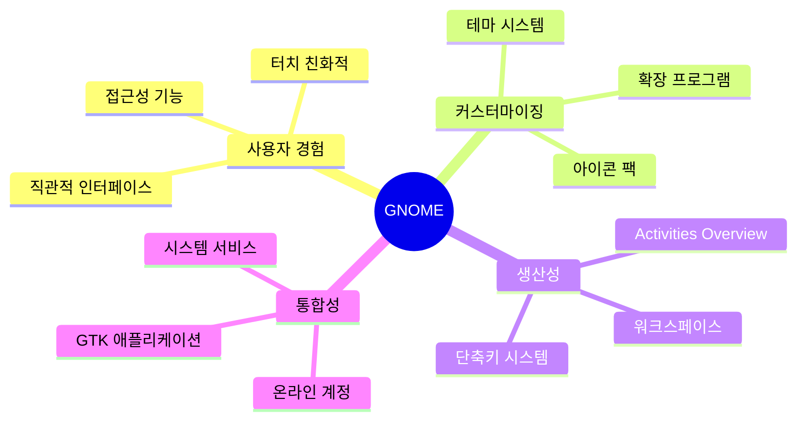
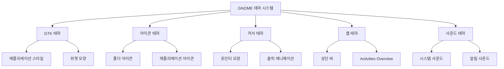

# 🎨 GNOME 데스크톱 환경 테마 및 커스터마이징 가이드

> **📋 사전 조건**: 이 가이드는 Arch Linux에 GNOME이 설치되어 있다고 가정합니다. GNOME 설치는 [설치 가이드](./installation.md)를 참조하세요.

## 📚 목차

- [🎯 GNOME 개요](#🎯-gnome-개요)
- [⚙️ GNOME 기본 설정](#⚙️-gnome-기본-설정)
- [🎨 테마 시스템 이해](#🎨-테마-시스템-이해)
- [📦 테마 설치 방법](#📦-테마-설치-방법)
- [🌟 인기 GNOME 테마](#🌟-인기-gnome-테마)
- [🔧 고급 커스터마이징](#🔧-고급-커스터마이징)
- [🖱️ 확장 프로그램](#🖱️-확장-프로그램)
- [🇰🇷 한국어 환경 설정](#🇰🇷-한국어-환경-설정)
- [🔍 문제 해결](#🔍-문제-해결)

---

## 🎯 GNOME 개요

GNOME은 Linux에서 가장 인기 있는 데스크톱 환경 중 하나로, 현대적이고 직관적인 사용자 인터페이스를 제공합니다.

### GNOME의 주요 특징



### GNOME 구성 요소

| 구성 요소 | 설명 | 커스터마이징 가능성 |
|-----------|------|---------------------|
| **Shell** | 상단 바, Activities Overview | 🔧 확장 프로그램으로 수정 |
| **Mutter** | 윈도우 매니저 | 🎨 테마로 스타일 변경 |
| **GTK** | 애플리케이션 프레임워크 | 🎨 GTK 테마 적용 |
| **GDM** | 로그인 매니저 | 🎨 로그인 화면 테마 |

---

## ⚙️ GNOME 기본 설정

### 설정 앱 (Settings) 접근

```bash
# GUI에서 접근
gnome-control-center

# 또는 Activities에서 "Settings" 검색
```

### 필수 초기 설정

#### 1. 디스플레이 설정
- **해상도 및 스케일링**: `Settings → Displays`
- **야간 모드**: `Settings → Displays → Night Light`

#### 2. 지역 및 언어
- **언어 설정**: `Settings → Region & Language`
- **입력 소스**: `Settings → Region & Language → Input Sources`

#### 3. 사용자 계정
- **계정 사진**: `Settings → Users`
- **자동 로그인**: `Settings → Users → Automatic Login`

---

## 🎨 테마 시스템 이해

GNOME의 테마 시스템은 여러 레벨로 구성되어 있습니다.

### 테마 구성도



### 테마 파일 위치

| 테마 유형 | 시스템 전체 | 사용자별 |
|-----------|-------------|----------|
| **GTK 테마** | `/usr/share/themes/` | `~/.themes/` |
| **아이콘 테마** | `/usr/share/icons/` | `~/.icons/` |
| **커서 테마** | `/usr/share/icons/` | `~/.icons/` |
| **셸 테마** | `/usr/share/themes/` | `~/.themes/` |

---

## 📦 테마 설치 방법

### 방법 1: 패키지 매니저 사용

```bash
# 인기 테마 패키지 설치
sudo pacman -S arc-gtk-theme
sudo pacman -S papirus-icon-theme
sudo pacman -S numix-gtk-theme

# AUR 헬퍼 사용 (yay)
yay -S orchis-theme-git
yay -S tela-icon-theme
```

### 방법 2: GNOME Tweaks 사용

```bash
# GNOME Tweaks 설치
sudo pacman -S gnome-tweaks

# 실행
gnome-tweaks
```

**Tweaks에서 테마 변경 경로**:
`Appearance → Themes`

### 방법 3: 수동 설치

```bash
# 테마 디렉터리 생성
mkdir -p ~/.themes ~/.icons

# 다운로드한 테마 압축 해제
unzip theme-name.zip -d ~/.themes/
unzip icon-theme.zip -d ~/.icons/

# 권한 설정
chmod -R 755 ~/.themes/theme-name
chmod -R 755 ~/.icons/icon-theme
```

### 방법 4: Extension Manager 사용

```bash
# Extension Manager 설치
sudo pacman -S extension-manager

# 또는 Flatpak으로
flatpak install flathub com.mattjakeman.ExtensionManager
```

---

## 🌟 인기 GNOME 테마

### 🌙 다크 테마

#### 1. **Orchis Theme**
- **특징**: 현대적이고 세련된 디자인
- **설치**: `yay -S orchis-theme-git`
- **추천 아이콘**: Papirus Dark

```bash
# Orchis 테마 설치 및 적용
yay -S orchis-theme-git papirus-icon-theme
gsettings set org.gnome.desktop.interface gtk-theme 'Orchis-Dark'
gsettings set org.gnome.desktop.interface icon-theme 'Papirus-Dark'
```

#### 2. **Dracula Theme**
- **특징**: 인기 있는 보라색 계열 다크 테마
- **설치**: `yay -S dracula-gtk-theme`
- **추천 아이콘**: Dracula

#### 3. **Nordic Theme**
- **특징**: 북유럽 스타일의 차분한 색상
- **설치**: `yay -S nordic-theme`
- **추천 아이콘**: Zafiro Icons

### ☀️ 라이트 테마

#### 1. **WhiteSur Theme**
- **특징**: macOS Big Sur와 유사한 디자인
- **설치**: `yay -S whitesur-gtk-theme`
- **추천 아이콘**: WhiteSur Icon

#### 2. **Materia Theme**
- **특징**: Material Design 기반
- **설치**: `sudo pacman -S materia-gtk-theme`
- **추천 아이콘**: Papirus

### 🎨 컬러풀 테마

#### 1. **Yaru Theme**
- **특징**: Ubuntu의 기본 테마, 오렌지 포인트
- **설치**: `yay -S yaru-gtk-theme`

#### 2. **Pop Theme**
- **특징**: System76의 Pop!_OS 테마
- **설치**: `yay -S pop-gtk-theme`

---

## 🔧 고급 커스터마이징

### dconf Editor 사용

```bash
# dconf Editor 설치
sudo pacman -S dconf-editor

# 실행
dconf-editor
```

#### 주요 설정 경로

| 설정 항목 | dconf 경로 |
|-----------|------------|
| **테마 설정** | `/org/gnome/desktop/interface/` |
| **폰트 설정** | `/org/gnome.desktop/interface/` |
| **윈도우 버튼** | `/org/gnome/desktop/wm/preferences/` |
| **핫코너** | `/org/gnome/desktop/interface/` |

### 커스텀 CSS 적용

```bash
# 사용자 CSS 디렉터리 생성
mkdir -p ~/.config/gtk-3.0
mkdir -p ~/.config/gtk-4.0

# GTK 3 커스텀 CSS
nano ~/.config/gtk-3.0/gtk.css

# GTK 4 커스텀 CSS
nano ~/.config/gtk-4.0/gtk.css
```

**예시 CSS (둥근 모서리 적용)**:
```css
/* ~/.config/gtk-3.0/gtk.css */
* {
    border-radius: 8px;
}

.window {
    border-radius: 12px;
}

button {
    border-radius: 6px;
}
```

### 폰트 설정

```bash
# 인기 폰트 설치
sudo pacman -S ttf-dejavu ttf-liberation noto-fonts noto-fonts-cjk
yay -S ttf-d2coding ttf-nanum

# 폰트 설정 (gsettings 사용)
gsettings set org.gnome.desktop.interface font-name 'Noto Sans 11'
gsettings set org.gnome.desktop.interface document-font-name 'Noto Sans 11'
gsettings set org.gnome.desktop.interface monospace-font-name 'D2Coding 10'
```

---

## 🖱️ 확장 프로그램

GNOME Shell Extensions를 통해 기능을 대폭 확장할 수 있습니다.

### 확장 프로그램 설치 방법

#### 1. 웹 브라우저 사용
1. [extensions.gnome.org](https://extensions.gnome.org) 방문
2. 브라우저 확장 프로그램 설치
3. 원하는 확장 프로그램 토글로 활성화

#### 2. Extension Manager 사용
```bash
sudo pacman -S extension-manager
```

### 필수 확장 프로그램

#### 🔧 시스템 관리

| 확장 프로그램 | 기능 | 추천도 |
|---------------|------|--------|
| **Dash to Dock** | 독 스타일 작업 표시줄 | ⭐⭐⭐⭐⭐ |
| **TopIcons Plus** | 시스템 트레이 아이콘 표시 | ⭐⭐⭐⭐ |
| **User Themes** | 사용자 정의 셸 테마 지원 | ⭐⭐⭐⭐⭐ |
| **Tweaks in System Menu** | 시스템 메뉴에서 Tweaks 접근 | ⭐⭐⭐ |

#### 📊 정보 표시

| 확장 프로그램 | 기능 | 추천도 |
|---------------|------|--------|
| **System Monitor** | CPU, 메모리 사용량 표시 | ⭐⭐⭐⭐ |
| **Weather** | 날씨 정보 표시 | ⭐⭐⭐ |
| **Bluetooth Quick Connect** | 블루투스 빠른 연결 | ⭐⭐⭐⭐ |

#### 🎨 시각적 효과

| 확장 프로그램 | 기능 | 추천도 |
|---------------|------|--------|
| **Blur my Shell** | 배경 블러 효과 | ⭐⭐⭐⭐ |
| **Compiz alike magic lamp effect** | 창 최소화 애니메이션 | ⭐⭐⭐ |
| **Desktop Icons NG** | 바탕화면 아이콘 표시 | ⭐⭐⭐ |

### 확장 프로그램 설정 예시

```bash
# 명령줄에서 확장 프로그램 관리
gnome-extensions list                    # 설치된 확장 프로그램 목록
gnome-extensions enable dash-to-dock@micheleg.gmail.com    # 확장 프로그램 활성화
gnome-extensions disable dash-to-dock@micheleg.gmail.com   # 확장 프로그램 비활성화
```

---

## 🇰🇷 한국어 환경 설정

### 한글 입력기 설치

#### IBus 설정 (권장)

```bash
# IBus 한글 입력기 설치
sudo pacman -S ibus ibus-hangul

# 환경 변수 설정
echo 'export GTK_IM_MODULE=ibus' >> ~/.bashrc
echo 'export XMODIFIERS=@im=ibus' >> ~/.bashrc
echo 'export QT_IM_MODULE=ibus' >> ~/.bashrc

# IBus 데몬 자동 시작
ibus-daemon -drx
```

#### 설정 방법

1. `Settings → Region & Language → Input Sources`
2. `+` 버튼 클릭 → `Korean (Hangul)` 추가
3. `Super + Space`로 입력기 전환

### 한글 폰트 최적화

```bash
# 한글 폰트 설치
sudo pacman -S noto-fonts-cjk ttf-nanum
yay -S ttf-d2coding ttf-nanum-square

# 폰트 설정
gsettings set org.gnome.desktop.interface font-name 'Noto Sans CJK KR 11'
```

### 한국 시간대 및 로케일

```bash
# 시간대 설정
sudo timedatectl set-timezone Asia/Seoul

# 로케일 설정 확인
localectl status

# 한국어 로케일 추가 (필요시)
sudo localectl set-locale LANG=ko_KR.UTF-8
```

---

## 🔍 문제 해결

### 일반적인 문제들

#### 1. 테마가 적용되지 않음

```bash
# 테마 캐시 새로고침
gsettings reset org.gnome.desktop.interface gtk-theme
gsettings set org.gnome.desktop.interface gtk-theme 'Your-Theme-Name'

# 또는 완전 로그아웃 후 재로그인
```

#### 2. 아이콘이 제대로 표시되지 않음

```bash
# 아이콘 캐시 재생성
sudo gtk-update-icon-cache -f -t /usr/share/icons/your-icon-theme
gtk-update-icon-cache -f -t ~/.icons/your-icon-theme
```

#### 3. 확장 프로그램이 작동하지 않음

```bash
# GNOME Shell 재시작 (X11에서만)
Alt + F2 → 'r' 입력 → Enter

# 또는 로그아웃 후 재로그인 (Wayland)
```

#### 4. 폰트 렌더링 문제

```bash
# 폰트 설정 파일 생성
mkdir -p ~/.config/fontconfig
cat > ~/.config/fontconfig/fonts.conf << 'EOF'
<?xml version="1.0"?>
<!DOCTYPE fontconfig SYSTEM "fonts.dtd">
<fontconfig>
  <alias>
    <family>sans-serif</family>
    <prefer>
      <family>Noto Sans CJK KR</family>
    </prefer>
  </alias>
  <alias>
    <family>serif</family>
    <prefer>
      <family>Noto Serif CJK KR</family>
    </prefer>
  </alias>
  <alias>
    <family>monospace</family>
    <prefer>
      <family>D2Coding</family>
    </prefer>
  </alias>
</fontconfig>
EOF

# 폰트 캐시 새로고침
fc-cache -f -v
```

### 성능 최적화

#### GNOME Shell 메모리 사용량 줄이기

```bash
# 애니메이션 효과 줄이기
gsettings set org.gnome.desktop.interface enable-animations false

# 또는 애니메이션 속도 조절
gsettings set org.gnome.desktop.interface enable-animations true
gsettings set org.gnome.desktop.interface gtk-enable-animations true
```

#### 백그라운드 앱 관리

```bash
# 자동 시작 앱 확인
gnome-session-properties

# 불필요한 서비스 비활성화
systemctl --user list-unit-files --state=enabled
systemctl --user disable unnecessary.service
```

---

## 🎯 추천 설정 조합

### 🌙 다크 모드 애호가용

```bash
# 테마 패키지 설치
yay -S orchis-theme-git papirus-icon-theme

# 다크 테마 적용
gsettings set org.gnome.desktop.interface gtk-theme 'Orchis-Dark'
gsettings set org.gnome.desktop.interface icon-theme 'Papirus-Dark'
gsettings set org.gnome.desktop.interface color-scheme 'prefer-dark'

# 폰트 설정
gsettings set org.gnome.desktop.interface font-name 'Noto Sans 11'
gsettings set org.gnome.desktop.interface monospace-font-name 'JetBrains Mono 10'
```

### ☀️ 깔끔한 라이트 테마용

```bash
# 테마 설치
sudo pacman -S materia-gtk-theme papirus-icon-theme

# 라이트 테마 적용
gsettings set org.gnome.desktop.interface gtk-theme 'Materia'
gsettings set org.gnome.desktop.interface icon-theme 'Papirus'
gsettings set org.gnome.desktop.interface color-scheme 'prefer-light'
```

### 🎨 맥OS 스타일용

```bash
# WhiteSur 테마 설치
yay -S whitesur-gtk-theme whitesur-icon-theme

# 테마 적용
gsettings set org.gnome.desktop.interface gtk-theme 'WhiteSur-Light'
gsettings set org.gnome.desktop.interface icon-theme 'WhiteSur'

# 독 스타일 확장 프로그램 설치 및 설정
# Dash to Dock 확장 프로그램 필요
```

---

## 📚 추가 리소스

### 유용한 웹사이트

- 🎨 [GNOME-Look.org](https://www.gnome-look.org/) - 테마 및 아이콘 다운로드
- 🔧 [extensions.gnome.org](https://extensions.gnome.org/) - 공식 확장 프로그램
- 📖 [GNOME Wiki](https://wiki.gnome.org/) - 공식 문서
- 💬 [r/gnome](https://reddit.com/r/gnome) - GNOME 커뮤니티

### 명령어 치트시트

```bash
# 테마 관련
gsettings get org.gnome.desktop.interface gtk-theme          # 현재 GTK 테마 확인
gsettings set org.gnome.desktop.interface gtk-theme 'Theme'  # GTK 테마 변경
gsettings get org.gnome.desktop.interface icon-theme         # 현재 아이콘 테마 확인
gsettings set org.gnome.desktop.interface icon-theme 'Icon'  # 아이콘 테마 변경

# 폰트 관련
gsettings get org.gnome.desktop.interface font-name          # 현재 폰트 확인
gsettings set org.gnome.desktop.interface font-name 'Font'   # 폰트 변경

# 확장 프로그램 관리
gnome-extensions list                                         # 확장 프로그램 목록
gnome-extensions enable extension-name                        # 확장 프로그램 활성화
gnome-extensions disable extension-name                       # 확장 프로그램 비활성화

# 시스템 정보
gnome-shell --version                                         # GNOME Shell 버전 확인
```

---

## 🎉 마무리

이제 여러분의 GNOME 데스크톱을 자신만의 스타일로 꾸밀 수 있게 되었습니다! 

### 핵심 요점

1. **단계적 접근**: 한 번에 모든 것을 바꾸지 말고 점진적으로 커스터마이징
2. **백업 습관**: 중요한 설정을 변경하기 전에는 현재 설정을 기록
3. **성능 고려**: 너무 많은 확장 프로그램은 성능에 영향을 줄 수 있음
4. **일관성 유지**: 테마, 아이콘, 폰트가 서로 조화롭게 어울리도록 선택

> 💡 **팁**: 정기적으로 GNOME 및 확장 프로그램을 업데이트하여 최신 기능과 보안 패치를 적용받으세요.

즐거운 GNOME 커스터마이징 되세요! 🚀
