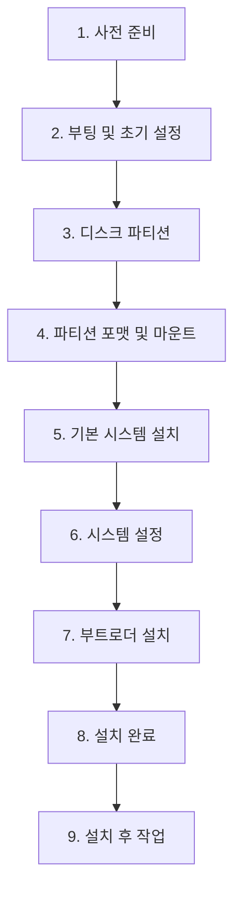
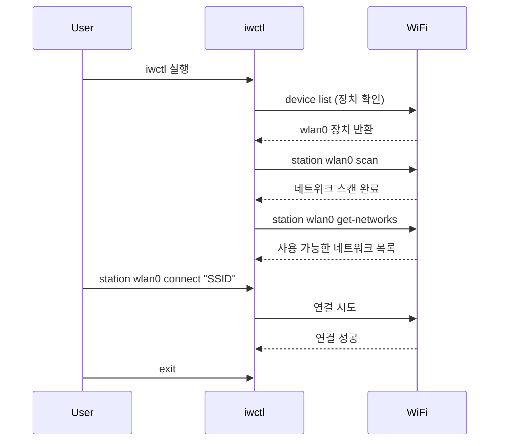
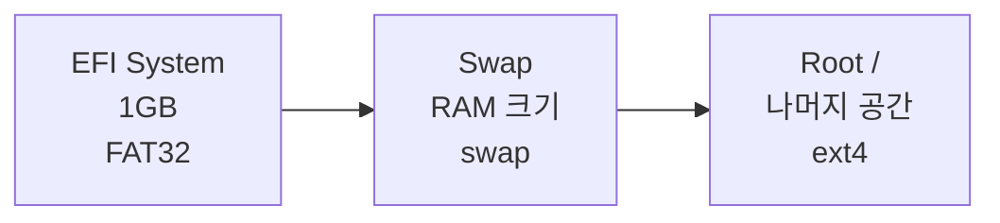
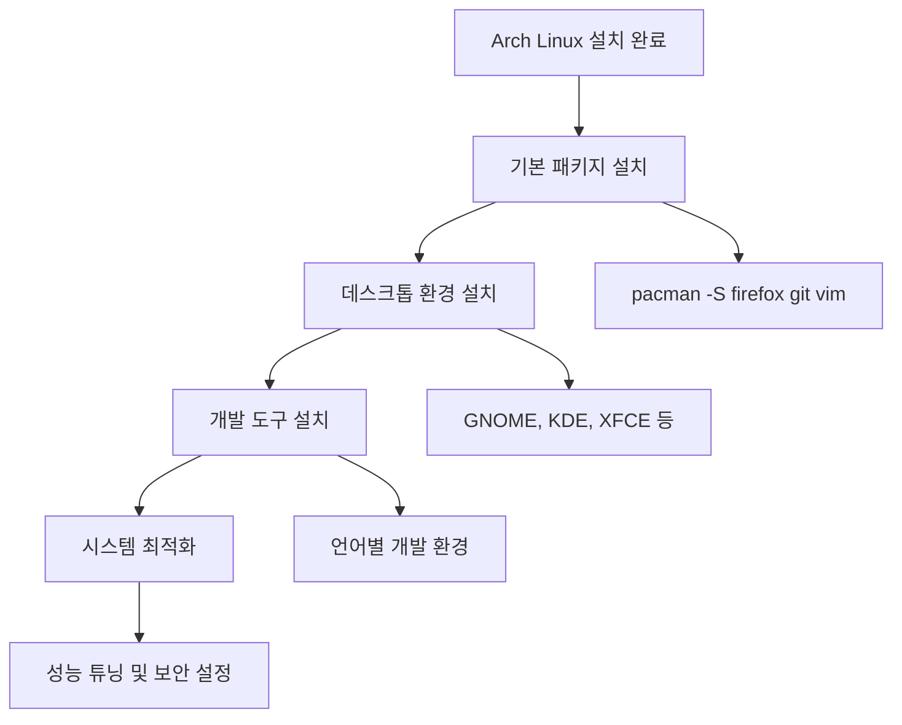

# 🐧 Arch Linux UEFI 설치 가이드

> **⚠️ 주의사항**: 이 가이드는 UEFI 모드에서의 Arch Linux 설치를 다룹니다. 기존 운영체제가 삭제될 수 있으므로 중요한 데이터는 사전에 백업하세요.

## 📋 설치 과정 개요



## 📚 목차

- [1️⃣ 사전 준비](#1️⃣-사전-준비)
- [2️⃣ 설치 환경 부팅 및 초기 설정](#2️⃣-설치-환경-부팅-및-초기-설정)
- [3️⃣ 디스크 파티션](#3️⃣-디스크-파티션)
- [4️⃣ 파티션 포맷 및 마운트](#4️⃣-파티션-포맷-및-마운트)
- [5️⃣ 기본 시스템 설치](#5️⃣-기본-시스템-설치)
- [6️⃣ 시스템 설정](#6️⃣-시스템-설정-arch-chroot)
- [7️⃣ 부트로더 설치](#7️⃣-부트로더-설치-grub)
- [8️⃣ 설치 완료 및 재부팅](#8️⃣-설치-완료-및-재부팅)
- [9️⃣ 설치 후 작업](#9️⃣-설치-후-작업)

---

## 1️⃣ 사전 준비

### 1.1 Arch Linux ISO 파일 다운로드

🔗 **공식 다운로드 페이지**: [https://archlinux.org/download/](https://archlinux.org/download/)

> 💡 **권장사항**: 항상 최신 ISO 이미지를 다운로드하여 최신 패키지와 보안 업데이트를 적용받으세요.

### 1.2 부팅 가능한 USB 드라이브 제작

#### Windows 사용자
- **권장 도구**: Rufus 또는 Ventoy
- **Rufus 설정**: `DD 이미지 모드` 사용 권장

#### Linux/macOS 사용자
```bash
# ⚠️ 경고: 잘못된 장치 지정 시 데이터 손실 위험!
# lsblk 명령어로 USB 장치 확인 필수
lsblk

# ISO 파일을 USB에 작성
sudo dd bs=4M if=/path/to/archlinux.iso of=/dev/sdX status=progress oflag=sync
```

### 1.3 UEFI/BIOS 설정

| 설정 항목 | 권장 값 | 설명 |
|----------|---------|------|
| **Secure Boot** | `Disabled` | 보안 부팅 비활성화 (필수) |
| **Boot Mode** | `UEFI` | UEFI 모드 활성화 |
| **Boot Order** | `USB First` | USB 드라이브 우선 부팅 |

---

## 2️⃣ 설치 환경 부팅 및 초기 설정

### 2.1 Arch Linux 라이브 환경으로 부팅

1. USB로 부팅하면 **Arch Linux 부팅 메뉴**가 나타납니다
2. 첫 번째 옵션 `Arch Linux install medium` 선택
3. `root@archiso ~ #` 프롬프트가 나타나면 성공 ✅

### 2.2 UEFI 모드 확인

```bash
ls /sys/firmware/efi/efivars
```

**기대 결과**: 여러 파일 목록이 표시되어야 함

> ❌ **오류 발생 시**: "No such file or directory" → 레거시(BIOS) 모드로 부팅됨. UEFI 설정 재확인 필요

### 2.3 네트워크 연결

#### 유선 연결 확인
```bash
ping -c 3 archlinux.org
```

#### Wi-Fi 연결 (무선)



```bash
# iwctl 유틸리티 실행
iwctl

# 무선 장치 확인 (보통 wlan0)
[iwd]# device list

# 네트워크 스캔
[iwd]# station wlan0 scan

# 스캔 결과 확인
[iwd]# station wlan0 get-networks

# 네트워크 연결 (비밀번호 입력 필요)
[iwd]# station wlan0 connect "YOUR_WIFI_NAME"

# iwctl 종료
[iwd]# exit

# 연결 확인
ping -c 3 archlinux.org
```

### 2.4 시스템 시간 동기화

```bash
timedatectl set-ntp true

# 동기화 상태 확인
timedatectl status
```

> 💡 **참고**: NTP(Network Time Protocol)를 사용하여 정확한 시간 동기화

---

## 3️⃣ 디스크 파티션

> ⚠️ **중요**: 이 단계는 디스크의 모든 데이터를 삭제할 수 있습니다. 신중하게 진행하세요!

### 3.1 파티션할 디스크 확인

```bash
lsblk
```

**일반적인 디스크 명명 규칙**:
- SATA/SSD: `/dev/sda`, `/dev/sdb`, ...
- NVMe SSD: `/dev/nvme0n1`, `/dev/nvme1n1`, ...

### 3.2 파티션 나누기 (cfdisk 사용)

```bash
cfdisk /dev/sdX  # sdX를 실제 디스크 이름으로 변경
```

#### 파티션 구성표



#### UEFI 시스템 권장 파티션 구성

| 파티션 | 크기 | 파일시스템 | 마운트 포인트 | 용도 |
|--------|------|------------|---------------|------|
| **EFI System** | 1GB | FAT32 | `/boot/efi` | UEFI 부트로더 |
| **Swap** | RAM 크기 | swap | - | 가상 메모리 |
| **Root** | 나머지 | ext4 | `/` | 시스템 파일 |

#### 단계별 파티션 생성

1. **EFI 시스템 파티션 (ESP)**
   - `[ New ]` → `Partition size`: `1G` → `Enter`
   - `[ Type ]` → `EFI System` → `Enter`

2. **Swap 파티션**
   - `[ New ]` → `Partition size`: `8G` (RAM 크기 기준) → `Enter`
   - `[ Type ]` → `Linux swap` → `Enter`

3. **루트(/) 파티션**
   - `[ New ]` → `Partition size`: (남은 공간 전체) → `Enter`
   - `[ Type ]`: `Linux filesystem` (기본값)

4. **변경사항 저장**
   - `[ Write ]` → `yes` 입력 → `[ Quit ]`

---

## 4️⃣ 파티션 포맷 및 마운트

### 4.1 파티션 포맷

> 💡 **참고**: `lsblk` 명령어로 파티션 번호를 다시 확인하세요

```bash
# EFI 파티션 (FAT32 포맷) - UEFI 부팅용
mkfs.fat -F32 /dev/sdX1

# Swap 파티션 활성화
mkswap /dev/sdX2
swapon /dev/sdX2

# 루트 파티션 (ext4 포맷) - 메인 시스템용
mkfs.ext4 /dev/sdX3
```

### 4.2 파티션 마운트

#### 마운트 구조

```mermaid
graph TD
    A[/mnt] --> B[/mnt/boot]
    B --> C[/mnt/boot/efi]
    
    A --> D["루트 파티션<br/>/dev/sdX3"]
    C --> E["EFI 파티션<br/>/dev/sdX1"]
```

#### 마운트 명령어

```bash
# 1. 루트 파티션을 /mnt에 마운트
mount /dev/sdX3 /mnt

# 2. EFI 파티션 마운트 디렉터리 생성 및 마운트
mkdir -p /mnt/boot/efi
mount /dev/sdX1 /mnt/boot/efi

# 3. 마운트 상태 확인
lsblk
```

> ⚠️ **중요**: EFI 파티션은 반드시 `/mnt/boot/efi`에 마운트해야 GRUB 부트로더가 정상 작동합니다.

---

## 5️⃣ 기본 시스템 설치

### 5.1 미러리스트 최적화 (선택 사항)

한국에서 빠른 다운로드를 위해 미러 서버를 최적화할 수 있습니다.

```bash
# 패키지 데이터베이스 갱신
pacman -Syy

# Reflector 설치
pacman -S reflector

# 한국 및 일본 미러로 최적화
reflector --country 'South Korea' --country 'Japan' \
          --age 12 --protocol https --sort rate \
          --save /etc/pacman.d/mirrorlist
```

### 5.2 필수 패키지 설치 (pacstrap)

```bash
pacstrap /mnt base linux linux-firmware nano networkmanager
```

#### 패키지 설명

| 패키지 | 용도 | 필수도 |
|--------|------|--------|
| `base` | 기본 시스템 | ✅ 필수 |
| `linux` | 리눅스 커널 | ✅ 필수 |
| `linux-firmware` | 하드웨어 펌웨어 | ✅ 필수 |
| `nano` | 텍스트 편집기 | 🔧 권장 |
| `networkmanager` | 네트워크 관리 도구 | 🔧 권장 |

### 5.3 Fstab 생성

부팅 시 파티션 자동 마운트를 위한 설정 파일을 생성합니다.

```bash
genfstab -U /mnt >> /mnt/etc/fstab

# 생성 결과 확인
cat /mnt/etc/fstab
```

---

## 6️⃣ 시스템 설정 (arch-chroot)

설치된 시스템 환경으로 진입하여 세부 설정을 진행합니다.

### 6.1 Chroot로 시스템 진입

```bash
arch-chroot /mnt
```

### 6.2 시간대 설정

```bash
# 한국 시간대 설정
ln -sf /usr/share/zoneinfo/Asia/Seoul /etc/localtime

# 하드웨어 시계 동기화
hwclock --systohc
```

### 6.3 지역화 (Localization)

#### 로케일 설정

```bash
# locale.gen 파일 편집
nano /etc/locale.gen
```

**편집 내용**: 다음 라인의 주석(`#`) 제거
```
ko_KR.UTF-8 UTF-8
en_US.UTF-8 UTF-8
```

```bash
# 로케일 생성
locale-gen

# 시스템 기본 언어 설정 (터미널 한글 깨짐 방지를 위해 영어 권장)
echo "LANG=en_US.UTF-8" > /etc/locale.conf
```

### 6.4 네트워크 설정

#### 호스트명 설정

```bash
echo "my-arch" > /etc/hostname  # 원하는 이름으로 변경
```

#### Hosts 파일 설정

```bash
nano /etc/hosts
```

**파일 내용**:
```
127.0.0.1   localhost
::1         localhost
127.0.1.1   my-arch.localdomain my-arch
```

#### NetworkManager 서비스 활성화

```bash
systemctl enable NetworkManager
```

### 6.5 Root 비밀번호 설정

```bash
passwd
```

### 6.6 마이크로코드 설치

CPU 제조사에 맞는 마이크로코드를 설치합니다.

```bash
# Intel CPU
pacman -S intel-ucode

# AMD CPU
pacman -S amd-ucode
```

---

## 7️⃣ 부트로더 설치 (GRUB)

### 7.1 GRUB 패키지 설치

```bash
pacman -S grub efibootmgr
```

### 7.2 GRUB 설치

```bash
grub-install --target=x86_64-efi --efi-directory=/boot/efi --bootloader-id=ARCH
```

**성공 메시지**: `Installation finished. No error reported.`

### 7.3 GRUB 설정 파일 생성

```bash
grub-mkconfig -o /boot/grub/grub.cfg
```

---

## 8️⃣ 설치 완료 및 재부팅

### 8.1 Chroot 환경에서 나가기

```bash
exit
```

### 8.2 마운트 해제 및 재부팅

```bash
umount -R /mnt
reboot
```

> ⚠️ **중요**: 재부팅 시 USB 드라이브를 반드시 제거해야 합니다.

---

## 9️⃣ 설치 후 작업

재부팅 후 Arch Linux 로그인 프롬프트가 나타납니다.

### 9.1 초기 로그인

- **로그인**: `root`
- **비밀번호**: 6.5단계에서 설정한 비밀번호

### 9.2 일반 사용자 계정 생성

보안을 위해 root가 아닌 일반 사용자 계정을 만들어 사용해야 합니다.

```bash
useradd -m -G wheel -s /bin/bash your_username
passwd your_username
```

#### 매개변수 설명

| 옵션 | 설명 |
|------|------|
| `-m` | 홈 디렉터리 생성 |
| `-G wheel` | wheel 그룹에 추가 (sudo 권한용) |
| `-s /bin/bash` | 기본 셸을 bash로 설정 |

### 9.3 Sudo 설정

일반 사용자가 sudo 명령어를 사용할 수 있도록 설정합니다.

```bash
# sudo 패키지 설치
pacman -S sudo

# visudo로 설정 파일 편집
EDITOR=nano visudo
```

**편집 내용**: 다음 라인의 주석(`#`) 제거
```bash
# 변경 전
# %wheel ALL=(ALL:ALL) ALL

# 변경 후
%wheel ALL=(ALL:ALL) ALL
```

**저장 방법**: `Ctrl+X` → `Y` → `Enter`

### 9.4 기본 GUI 설치 (선택 사항)

데스크톱 환경을 설치할 수 있습니다.

#### GNOME 설치 예시

```bash
# GNOME 패키지 설치
pacman -S gnome

# 디스플레이 매니저(GDM) 활성화
systemctl enable gdm

# 재부팅
reboot
```

> 📖 **참고**: GNOME 테마 및 커스터마이징에 대한 자세한 내용은 [GNOME 테마 가이드](./gnome-theme.md)를 참조하세요.

---

## 🎉 설치 완료!

축하합니다! Arch Linux 기본 설치가 완료되었습니다.

### 다음 단계 권장사항



1. **필수 패키지 설치**
   ```bash
   pacman -S firefox git vim htop
   ```

2. **AUR 헬퍼 설치** (yay 권장)
   ```bash
   git clone https://aur.archlinux.org/yay.git
   cd yay
   makepkg -si
   ```

3. **시스템 업데이트**
   ```bash
   pacman -Syu
   ```

### 유용한 리소스

- 📚 [Arch Wiki](https://wiki.archlinux.org/) - 가장 완전한 Linux 문서
- 🔧 [AUR (Arch User Repository)](https://aur.archlinux.org/) - 커뮤니티 패키지 저장소
- 💬 [Arch Linux 포럼](https://bbs.archlinux.org/) - 커뮤니티 지원

---

## 🔍 문제 해결

### 일반적인 문제들

#### 부팅 실패
- EFI 파티션이 올바르게 마운트되었는지 확인
- GRUB 설치 과정 재확인
- [부팅 문제 해결 가이드](./trouble-shooting.md) 참조

#### 네트워크 연결 안됨
```bash
systemctl start NetworkManager
systemctl enable NetworkManager
```

#### 한글 입력 설정
```bash
pacman -S ibus ibus-hangul
```

> 💡 **팁**: 문제가 발생하면 Arch Wiki를 먼저 참조하세요. 대부분의 문제에 대한 해결책이 있습니다.
