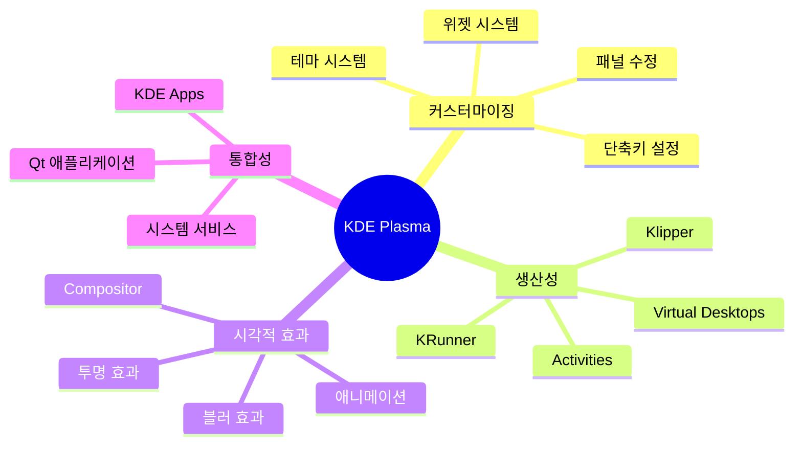
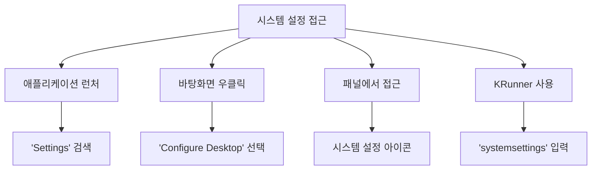
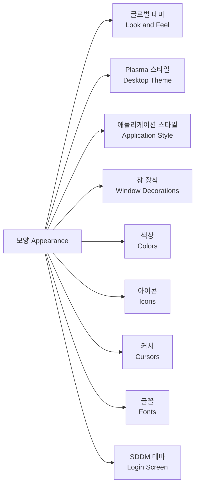

# 🎨 KDE Plasma 데스크톱 환경 테마 및 커스터마이징 가이드

> **✨ KDE Plasma의 매력**: KDE Plasma는 리눅스에서 가장 커스터마이징이 자유로운 데스크톱 환경입니다. 마치 자신만의 운영체제를 만드는 듯한 즐거움을 선사합니다!

## 📚 목차

- [🎯 KDE Plasma 개요](#🎯-kde-plasma-개요)
- [⚙️ 시스템 설정 기본](#⚙️-시스템-설정-기본)
- [🎨 테마 시스템 이해](#🎨-테마-시스템-이해)
- [📦 테마 설치 방법](#📦-테마-설치-방법)
- [🌟 인기 KDE 테마](#🌟-인기-kde-테마)
- [🔧 고급 커스터마이징](#🔧-고급-커스터마이징)
- [🖱️ 위젯 및 플라즈모이드](#🖱️-위젯-및-플라즈모이드)
- [🇰🇷 한국어 환경 설정](#🇰🇷-한국어-환경-설정)
- [🔍 문제 해결](#🔍-문제-해결)

---

## 🎯 KDE Plasma 개요

KDE Plasma는 강력한 커스터마이징 기능으로 유명한 데스크톱 환경으로, 사용자가 거의 모든 것을 원하는 대로 변경할 수 있습니다.

### KDE Plasma의 주요 특징



### KDE 구성 요소

| 구성 요소 | 설명 | 커스터마이징 수준 |
|-----------|------|------------------|
| **Plasma Desktop** | 데스크톱 셸 | 🔧🔧🔧🔧🔧 매우 높음 |
| **KWin** | 윈도우 매니저 | 🔧🔧🔧🔧 높음 |
| **Qt/KDE Frameworks** | 애플리케이션 프레임워크 | 🔧🔧🔧 보통 |
| **SDDM** | 로그인 매니저 | 🔧🔧🔧 보통 |

---

## ⚙️ 시스템 설정 기본

### 시스템 설정 접근 방법



```bash
# 명령줄에서 시스템 설정 실행
systemsettings5

# 또는 KRunner 사용 (Alt+Space 또는 Alt+F2)
# 'settings' 또는 'systemsettings' 입력
```

### 주요 설정 카테고리

#### 모양 (Appearance) 섹션 구성도



### 각 요소별 상세 설명

| 테마 요소 | 영향 범위 | 변경 효과 |
|-----------|-----------|-----------|
| **글로벌 테마** | 전체 시스템 | 모든 요소 일괄 변경 |
| **Plasma 스타일** | 패널, 위젯 | 바탕화면 UI 요소 |
| **애플리케이션 스타일** | 앱 내부 | 버튼, 메뉴, 스크롤바 |
| **창 장식** | 창 제목바 | 최소화/최대화/닫기 버튼 |
| **색상** | 텍스트, 배경 | 시스템 전체 색상 팔레트 |
| **아이콘** | 모든 아이콘 | 폴더, 앱, 파일 아이콘 |
| **커서** | 마우스 포인터 | 포인터 모양 및 애니메이션 |
| **글꼴** | 모든 텍스트 | 시스템 전체 폰트 |

---
*   **Catppuccin**: 부드러운 파스텔톤의 따뜻한 느낌을 주는 테마로, 여러 "맛(flavor)"이 있습니다.[12, 18, 19]
*   **Aritim (Dark & Light)**: 눈이 편안하고 차분한 스타일의 밝고 어두운 테마를 제공합니다.[11, 12]
*   **WhiteSur**: macOS Big Sur의 디자인에서 영감을 받은 테마입니다.[11]
*   **Breeze**: KDE Plasma의 기본 테마로, 매우 일관성 있고 다른 테마의 좋은 기반이 됩니다.[15]

### 2.4. Kvantum Manager를 사용한 고급 Qt 애플리케이션 테마 설정

일부 테마는 Qt 애플리케이션의 더욱 깊이 있는 시각적 맞춤 설정을 위해 Kvantum 엔진을 사용합니다.[8, 20]

1.  **Kvantum 설치**:
    ```bash
    sudo pacman -S kvantum
    ```
2.  **Kvantum Manager 실행**: 애플리케이션 실행기에서 'Kvantum Manager'를 찾아 실행합니다.
3.  **Kvantum 테마 설치 및 적용**:
    *   Kvantum Manager 내에서 "Install/Update theme" 섹션을 통해 다운로드한 Kvantum 테마 폴더를 선택하여 설치할 수 있습니다.[20]
    *   설치 후 "Change/Delete Theme" 섹션에서 원하는 테마를 선택하고 "Use this theme"을 클릭하여 적용합니다.[20]
4.  **시스템 설정 연동**:
    *   `시스템 설정 > 모양 > 애플리케이션 스타일`로 이동하여 "Kvantum" 또는 "Kvantum-dark"를 선택하고 적용합니다.[20]
    *   필요에 따라 `시스템 설정 > 모양 > 색상`에서 Kvantum 테마와 어울리는 색 구성표를 선택합니다.[20]

인기 있는 Kvantum 테마로는 Layan, WhiteSur, Nordic, Otto 등이 있습니다.[21, 20]

## 3. 세부 시각 요소 맞춤 설정

### 3.1. 아이콘

시스템 전체의 아이콘을 변경하여 데스크톱의 분위기를 크게 바꿀 수 있습니다.

*   **설치**: 시스템 설정을 통해 온라인으로 받거나, 수동으로 `~/.icons/` 또는 `~/.local/share/icons/`에 설치합니다.[8, 22]
*   **적용**: `시스템 설정 > 모양 > 아이콘`에서 원하는 아이콘 테마를 선택합니다.
*   **인기 아이콘 테마**:
    *   **Papirus**: 매우 포괄적이고 깔끔한 디자인으로 인기가 높으며, 다양한 변형(일반, 어두운 버전, 밝은 버전)과 폴더 색상 변경을 지원합니다.[22, 23]
    *   **Tela Icon Theme / Tela Circle Icon Theme**: 플랫하고 다채로운 아이콘 세트입니다.[24, 25]
    *   **WhiteSur Icon Theme**: macOS 스타일 아이콘입니다.[13, 26]

### 3.2. 글꼴

가독성과 미적 만족도를 위해 적절한 글꼴 선택이 중요합니다.

*   **설치**:
    *   원하는 글꼴 파일(TTF, OTF 등)을 `~/.fonts/` 또는 `~/.local/share/fonts/` 디렉터리에 복사합니다 (없으면 생성).
    *   터미널에서 `fc-cache -fv` 명령을 실행하여 시스템 글꼴 캐시를 업데이트합니다.[27]
    *   추천 글꼴 패키지: `sudo pacman -S noto-fonts noto-fonts-cjk noto-fonts-emoji ttf-dejavu ttf-liberation` [10] (Noto CJK는 한국어 표시에 유용합니다).
*   **적용**: `시스템 설정 > 모양 > 글꼴`에서 UI 요소별 글꼴을 선택하고, 안티앨리어싱 설정을 확인하여 부드러운 글꼴 렌더링을 활성화합니다.[10]

### 3.3. GTK 애플리케이션 테마 일관성 유지

KDE Plasma 환경에서도 GTK 기반 애플리케이션(예: Firefox, GIMP)의 모양을 Plasma 테마와 일치시키면 더욱 통일된 느낌을 줄 수 있습니다.

1.  `kde-gtk-config` 패키지를 설치합니다:
    ```bash
    sudo pacman -S kde-gtk-config
    ```
    [10]
2.  `시스템 설정 > 모양 > 애플리케이션 스타일`로 이동한 후, 하단의 "GTK 애플리케이션 스타일 설정..." 버튼을 클릭합니다.
3.  여기서 GTK2 및 GTK3 테마를 현재 Plasma 테마와 유사한 것으로 선택하거나, "Breeze"와 같이 일관성 있는 테마를 선택합니다.

## 4. 한국어 환경 설정

시스템 전반에 걸쳐 한국어를 원활하게 사용하기 위한 설정입니다.

### 4.1. 시스템 로케일 및 언어 설정

1.  **로케일 생성**:
    *   `/etc/locale.gen` 파일을 텍스트 편집기(예: `sudo nano /etc/locale.gen`)로 열어 `ko_KR.UTF-8 UTF-8` 라인의 주석(#)을 제거합니다. `en_US.UTF-8 UTF-8`도 함께 활성화하는 것이 좋습니다.
    *   터미널에서 `sudo locale-gen` 명령을 실행하여 로케일을 생성합니다.
2.  **KDE Plasma 언어 설정**:
    *   `시스템 설정 > 개인 설정 > 지역 설정 > 언어`로 이동합니다.
    *   "사용 가능한 언어" 목록에서 "한국어"를 찾아 "설치된 언어" 목록으로 추가합니다.
    *   "한국어"를 최상단으로 이동시켜 기본 언어로 설정하고 "적용" 버튼을 누릅니다.
    *   시스템을 재부팅하거나 로그아웃 후 다시 로그인하면 변경 사항이 적용됩니다.
3.  **형식(Formats)**:
    *   `시스템 설정 > 개인 설정 > 지역 설정 > 형식`에서 지역을 "대한민국 (ko_KR)"으로 설정하면 숫자, 날짜, 통화 등이 한국 형식으로 표시됩니다.

### 4.2. 한국어 입력기 (IME) 설치 및 설정

한글 입력을 위해 입력기 설치가 필요합니다. `fcitx5`를 추천합니다.

1.  **fcitx5 및 한글 엔진 설치**:
    ```bash
    sudo pacman -S fcitx5 fcitx5-configtool fcitx5-gtk fcitx5-qt fcitx5-hangul
    ```
2.  **입력기 환경 변수 설정**:
    *   `/etc/environment` 파일을 텍스트 편집기(예: `sudo nano /etc/environment`)로 열고 다음 내용을 추가합니다:
        ```
        GTK_IM_MODULE=fcitx
        QT_IM_MODULE=fcitx
        XMODIFIERS=@im=fcitx
        ```
    *   파일을 저장하고 시스템을 재부팅합니다.
3.  **fcitx5 설정**:
    *   재부팅 후, 애플리케이션 실행기에서 'Fcitx5 설정(Fcitx5 Configuration)'을 실행합니다.
    *   "입력기" 탭에서 왼쪽 하단의 "+" 버튼을 클릭합니다.
    *   "현재 언어만 보이기" 옵션의 체크를 해제하고 "Hangul"을 검색하여 추가합니다.
    *   기본 입력 방법으로 Hangul을 사용하도록 순서를 조정할 수 있습니다.
    *   한/영 전환 키는 보통 `Shift+Space` 또는 `Ctrl+Space`로 기본 설정되어 있으며, Fcitx5 설정의 "전역 옵션" 탭에서 변경할 수 있습니다.

### 4.3. 한국어 글꼴 확인

앞서 "3.2. 글꼴" 섹션에서 `noto-fonts-cjk`와 같은 한국어 지원 글꼴을 설치했다면 대부분의 환경에서 한글이 잘 표시됩니다. 만약 특정 애플리케이션에서 한글이 깨져 보인다면 해당 애플리케이션의 글꼴 설정을 확인해 보세요.

## 5. 추가적인 맞춤 설정

### 5.1. 위젯 및 패널

*   **위젯 추가**: 바탕화면이나 패널에서 마우스 오른쪽 버튼을 클릭하고 "위젯 추가(Add Widgets)"를 선택하여 다양한 위젯(시계, 날씨, 시스템 모니터 등)을 추가할 수 있습니다.[6, 7]
*   **패널 편집**: 기본 패널(작업 표시줄)에서 마우스 오른쪽 버튼을 클릭하고 "편집 모드 들어가기(Enter Edit Mode)"를 선택하여 패널의 위치, 크기, 위젯 등을 변경할 수 있습니다.[7] 새 패널을 추가할 수도 있습니다.

### 5.2. 유용한 시스템 설정

*   **야간 색상 (Night Color)**: `시스템 설정 > 하드웨어 > 디스플레이 및 모니터 > 야간 색상`에서 화면의 블루라이트를 줄여 눈의 피로를 덜 수 있습니다.[10]
*   **마우스 동작 (Mouse Actions)**: `시스템 설정 > 작업 공간 > 작업 공간 동작 > 화면 가장자리` 또는 바탕화면 설정에서 마우스 클릭이나 화면 가장자리 동작에 특정 기능을 할당할 수 있습니다.[6]

## 6. 마무리

KDE Plasma는 사용자에게 무한한 맞춤 설정의 자유를 제공합니다.[1, 3, 4] 이 가이드에서 소개된 내용 외에도 탐색하고 시도해볼 수 있는 수많은 옵션과 테마, 위젯들이 있습니다. KDE 스토어 [13]나 Gnome-Look.org [28, 26] (KDE 테마도 많이 올라옴)와 같은 커뮤니티 사이트를 방문하여 새로운 아이디어를 얻고, 자신만의 개성이 담긴 데스크톱 환경을 만들어 보세요.

가장 중요한 것은 직접 시도해보고 즐기는 것입니다!