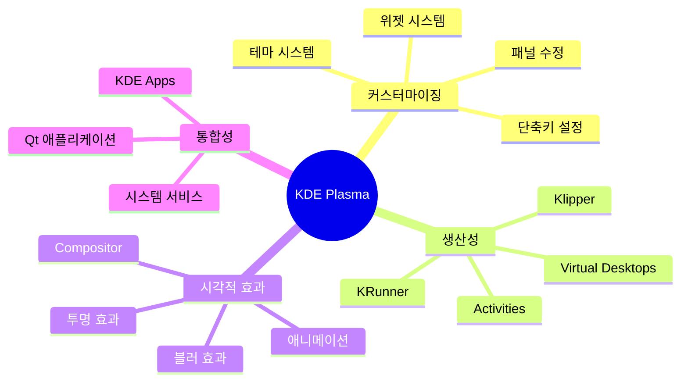
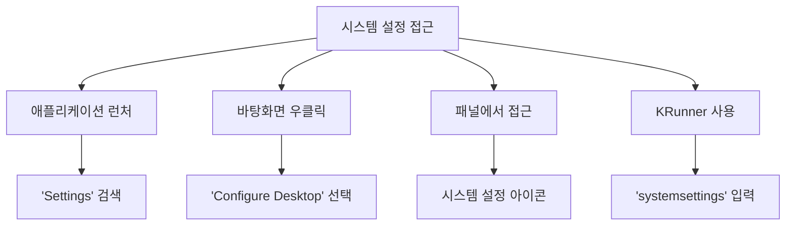
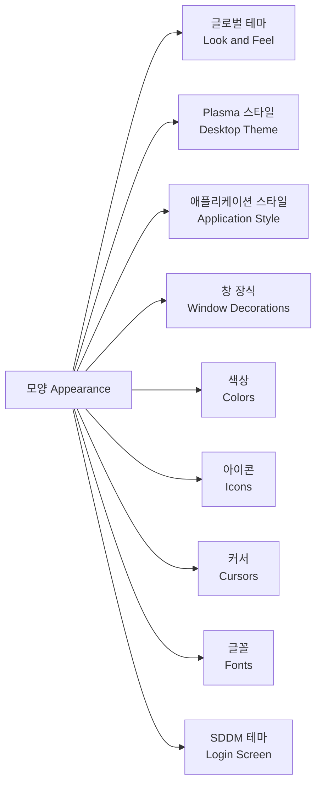
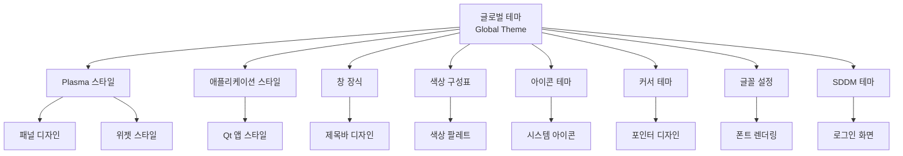
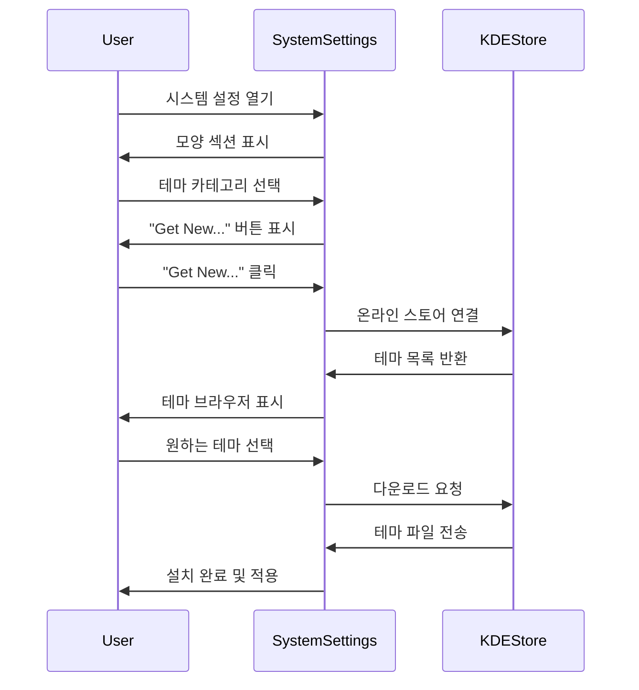
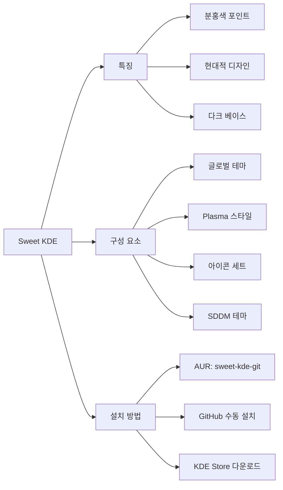
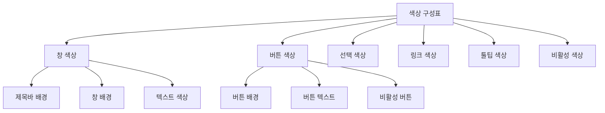
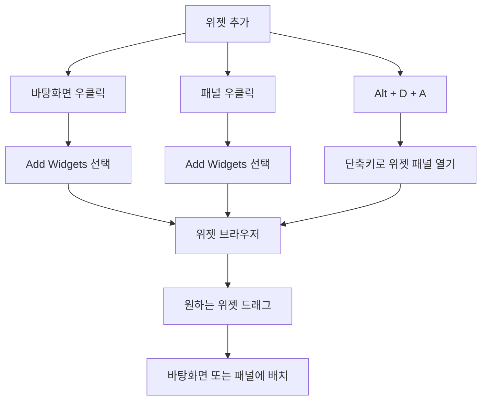
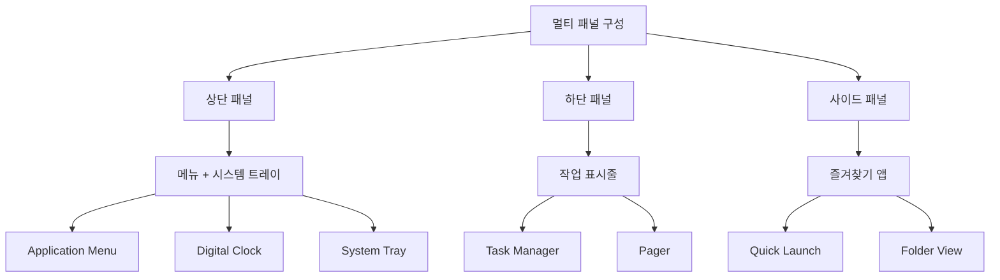
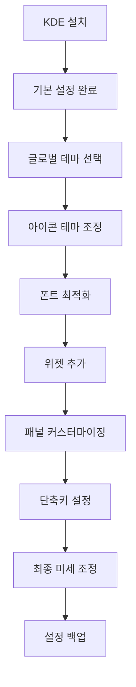

# 🎨 KDE Plasma 데스크톱 환경 테마 및 커스터마이징 가이드

> **✨ KDE Plasma의 매력**: KDE Plasma는 리눅스에서 가장 커스터마이징이 자유로운 데스크톱 환경입니다. 마치 자신만의 운영체제를 만드는 듯한 즐거움을 선사합니다!

## 📚 목차

- [🎯 KDE Plasma 개요](#🎯-kde-plasma-개요)
- [⚙️ 시스템 설정 기본](#⚙️-시스템-설정-기본)
- [🎨 테마 시스템 이해](#🎨-테마-시스템-이해)
- [📦 테마 설치 방법](#📦-테마-설치-방법)
- [🌟 인기 KDE 테마](#🌟-인기-kde-테마)
- [🔧 고급 커스터마이징](#🔧-고급-커스터마이징)
- [🖱️ 위젯 및 플라즈모이드](#🖱️-위젯-및-플라즈모이드)
- [🇰🇷 한국어 환경 설정](#🇰🇷-한국어-환경-설정)
- [🔍 문제 해결](#🔍-문제-해결)

---

## 🎯 KDE Plasma 개요

KDE Plasma는 강력한 커스터마이징 기능으로 유명한 데스크톱 환경으로, 사용자가 거의 모든 것을 원하는 대로 변경할 수 있습니다.

### KDE Plasma의 주요 특징



### KDE 구성 요소

| 구성 요소 | 설명 | 커스터마이징 수준 |
|-----------|------|------------------|
| **Plasma Desktop** | 데스크톱 셸 | 🔧🔧🔧🔧🔧 매우 높음 |
| **KWin** | 윈도우 매니저 | 🔧🔧🔧🔧 높음 |
| **Qt/KDE Frameworks** | 애플리케이션 프레임워크 | 🔧🔧🔧 보통 |
| **SDDM** | 로그인 매니저 | 🔧🔧🔧 보통 |

---

## ⚙️ 시스템 설정 기본

### 시스템 설정 접근 방법



```bash
# 명령줄에서 시스템 설정 실행
systemsettings5

# 또는 KRunner 사용 (Alt+Space 또는 Alt+F2)
# 'settings' 또는 'systemsettings' 입력
```

### 주요 설정 카테고리

#### 모양 (Appearance) 섹션 구성도



### 각 요소별 상세 설명

| 테마 요소 | 영향 범위 | 변경 효과 |
|-----------|-----------|-----------|
| **글로벌 테마** | 전체 시스템 | 모든 요소 일괄 변경 |
| **Plasma 스타일** | 패널, 위젯 | 바탕화면 UI 요소 |
| **애플리케이션 스타일** | 앱 내부 | 버튼, 메뉴, 스크롤바 |
| **창 장식** | 창 제목바 | 최소화/최대화/닫기 버튼 |
| **색상** | 텍스트, 배경 | 시스템 전체 색상 팔레트 |
| **아이콘** | 모든 아이콘 | 폴더, 앱, 파일 아이콘 |
| **커서** | 마우스 포인터 | 포인터 모양 및 애니메이션 |
| **글꼴** | 모든 텍스트 | 시스템 전체 폰트 |

---

## 🎨 테마 시스템 이해

KDE Plasma의 테마 시스템은 계층적으로 구성되어 있어 세밀한 커스터마이징이 가능합니다.

### 테마 계층 구조



### 테마 파일 구조

```bash
# KDE 테마 디렉토리 구조
~/.local/share/
├── plasma/
│   ├── look-and-feel/           # 글로벌 테마
│   ├── desktoptheme/           # Plasma 스타일
│   └── plasmoids/              # 위젯
├── icons/                      # 아이콘 테마
├── aurorae/                    # 창 장식
│   └── themes/
└── color-schemes/              # 색상 구성표

/usr/share/
├── plasma/
├── icons/
├── sddm/
│   └── themes/                 # SDDM 테마
└── color-schemes/
```

---

## 📦 테마 설치 방법

### 방법 1: 시스템 설정 통합 스토어 (권장)

KDE의 가장 큰 장점 중 하나는 시스템 설정에서 바로 테마를 다운로드할 수 있다는 것입니다.

#### 단계별 설치 과정



1. **시스템 설정 열기**
   ```bash
   systemsettings5
   ```

2. **원하는 테마 카테고리로 이동**
   - `Appearance → Global Theme` (글로벌 테마)
   - `Appearance → Plasma Style` (플라즈마 스타일)
   - `Appearance → Icons` (아이콘)
   - 등등...

3. **"Get New..." 버튼 클릭**

4. **테마 검색 및 설치**
   - 인기도, 평점, 카테고리로 필터링 가능
   - 미리보기 이미지 확인
   - "Install" 버튼으로 즉시 설치

### 방법 2: 패키지 매니저 사용

```bash
# 인기 KDE 테마 패키지 설치
sudo pacman -S breeze-kde4        # Breeze 테마 (기본)
sudo pacman -S oxygen-kde4        # Oxygen 테마

# AUR에서 추가 테마 설치
yay -S layan-kde-git              # Layan 테마
yay -S sweet-kde-git              # Sweet 테마
yay -S nordic-kde-git             # Nordic 테마
yay -S mcmojave-kde-git           # McMojave (macOS 스타일)

# 아이콘 테마
sudo pacman -S papirus-icon-theme
yay -S tela-icon-theme
yay -S we10x-icon-theme
```

### 방법 3: 수동 설치

GitHub이나 다른 소스에서 직접 다운로드한 테마를 설치하는 방법입니다.

```bash
# 테마 디렉토리 생성
mkdir -p ~/.local/share/plasma/look-and-feel
mkdir -p ~/.local/share/plasma/desktoptheme
mkdir -p ~/.local/share/icons
mkdir -p ~/.local/share/aurorae/themes

# 다운로드한 테마 압축 해제 및 설치
# 예: Sweet KDE 테마
cd ~/Downloads
unzip Sweet-kde.tar.xz

# 글로벌 테마 설치
cp -r Sweet-kde/look-and-feel/Sweet/ ~/.local/share/plasma/look-and-feel/

# Plasma 스타일 설치
cp -r Sweet-kde/plasma/Sweet/ ~/.local/share/plasma/desktoptheme/

# 아이콘 테마 설치
cp -r Sweet-kde/icons/Sweet/ ~/.local/share/icons/

# 권한 설정
chmod -R 755 ~/.local/share/plasma/
chmod -R 755 ~/.local/share/icons/
```

### 방법 4: 스크립트 자동 설치

많은 테마들이 자동 설치 스크립트를 제공합니다.

```bash
# 예: WhiteSur KDE 테마 자동 설치
git clone https://github.com/vinceliuice/WhiteSur-kde.git
cd WhiteSur-kde
./install.sh

# 설치 옵션
./install.sh --help                    # 도움말 보기
./install.sh -c dark                   # 다크 버전만 설치
./install.sh -i fedora                 # Fedora 스타일 아이콘
```

---

## 🌟 인기 KDE 테마

### 🌙 다크 테마 계열

#### 1. **Sweet KDE Theme**



- **특징**: 분홍색 포인트가 돋보이는 현대적 다크 테마
- **구성**: 완전한 테마 패키지 (글로벌 테마 + 아이콘 + SDDM)
- **설치**:
  ```bash
  yay -S sweet-kde-git sweet-folders-icons-git
  ```

#### 2. **Layan Theme**
- **특징**: macOS Big Sur에서 영감받은 블러 효과
- **색상**: 부드러운 그라데이션과 투명 효과
- **설치**:
  ```bash
  yay -S layan-kde-git
  ```

#### 3. **Nordic KDE**
- **특징**: Nord 색상 팔레트 기반의 미니멀 디자인
- **색상**: 차분한 블루/그레이 톤
- **설치**:
  ```bash
  yay -S nordic-kde-git nordic-darker-theme
  ```

#### 4. **Dracula KDE**
- **특징**: 개발자들에게 인기 있는 Dracula 테마의 KDE 버전
- **색상**: 보라색 기반 다크 테마
- **설치**:
  ```bash
  yay -S dracula-kde-theme-git
  ```

### ☀️ 라이트 테마 계열

#### 1. **WhiteSur KDE**
- **특징**: macOS Big Sur의 화이트 테마를 재현
- **디자인**: 깔끔하고 모던한 라이트 테마
- **설치**:
  ```bash
  git clone https://github.com/vinceliuice/WhiteSur-kde.git
  cd WhiteSur-kde && ./install.sh
  ```

#### 2. **McMojave KDE**
- **특징**: macOS Mojave 스타일
- **버전**: 라이트/다크 양쪽 지원
- **설치**:
  ```bash
  yay -S mcmojave-kde-git
  ```

### 🎨 유니크 테마

#### 1. **Materia KDE**
- **특징**: Material Design 언어 기반
- **색상**: 다양한 컬러 변형 제공
- **설치**:
  ```bash
  sudo pacman -S materia-kde
  ```

#### 2. **Arc KDE**
- **특징**: 플랫 디자인과 현대적 요소 조합
- **인기**: 오랫동안 사랑받은 클래식 테마
- **설치**:
  ```bash
  sudo pacman -S arc-kde
  ```

### 🎯 테마 조합 추천

#### 🌃 다크 모드 최강 조합
```bash
# Sweet 테마 + Tela 아이콘 + JetBrains Mono 폰트
yay -S sweet-kde-git tela-icon-theme ttf-jetbrains-mono

# 시스템 설정에서 적용:
# - Global Theme: Sweet
# - Icons: Tela Dark
# - Font: JetBrains Mono
```

#### ☁️ 클린 라이트 조합
```bash
# WhiteSur + Papirus 아이콘
# WhiteSur 설치 (위 참조)
sudo pacman -S papirus-icon-theme

# 시스템 설정에서 적용:
# - Global Theme: WhiteSur Light
# - Icons: Papirus
# - Font: Noto Sans
```

---

## 🔧 고급 커스터마이징

### 색상 구성표 커스터마이징

KDE는 매우 세밀한 색상 조정이 가능합니다.

#### 사용자 정의 색상 구성표 생성

1. **시스템 설정** → **모양** → **색상**
2. **편집** 또는 **새로 만들기** 클릭
3. 각 UI 요소별 색상 개별 조정 가능:



#### 터미널 색상 스킴

```bash
# Konsole 색상 스킴 디렉토리
ls ~/.local/share/konsole/
ls /usr/share/konsole/

# 인기 터미널 색상 스킴 설치
yay -S konsole-gruvbox
yay -S konsole-dracula
```

### 창 장식 커스터마이징

#### Aurorae 테마 (추천)
```bash
# Aurorae 창 장식 설치
yay -S aurorae-theme-sweet
yay -S sierra-breeze-enhanced

# 적용: 시스템 설정 → 모양 → 창 장식
```

#### 창 버튼 레이아웃 변경
```bash
# macOS 스타일 (왼쪽 버튼)
kwriteconfig5 --file kwinrc --group org.kde.kdecoration2 --key ButtonsOnLeft "XIA"
kwriteconfig5 --file kwinrc --group org.kde.kdecoration2 --key ButtonsOnRight ""

# Windows 스타일 (오른쪽 버튼) - 기본값
kwriteconfig5 --file kwinrc --group org.kde.kdecoration2 --key ButtonsOnLeft ""
kwriteconfig5 --file kwinrc --group org.kde.kdecoration2 --key ButtonsOnRight "IAX"

# 설정 적용
qdbus org.kde.KWin /KWin reconfigure
```

### 커서 테마 고급 설정

```bash
# 인기 커서 테마 설치
sudo pacman -S xcursor-breeze
yay -S bibata-cursor-theme
yay -S oreo-cursors-git

# 커서 크기 설정 (24, 32, 48 등)
# 시스템 설정 → 모양 → 커서
```

### 글꼴 고급 설정

#### 서브픽셀 렌더링 및 힌팅

```bash
# 글꼴 설정 파일 생성
mkdir -p ~/.config/fontconfig
cat > ~/.config/fontconfig/fonts.conf << 'EOF'
<?xml version="1.0"?>
<!DOCTYPE fontconfig SYSTEM "fonts.dtd">
<fontconfig>
  <match target="font">
    <edit name="hinting" mode="assign">
      <bool>true</bool>
    </edit>
    <edit name="hintstyle" mode="assign">
      <const>hintslight</const>
    </edit>
    <edit name="antialias" mode="assign">
      <bool>true</bool>
    </edit>
    <edit name="rgba" mode="assign">
      <const>rgb</const>
    </edit>
  </match>
</fontconfig>
EOF

# 글꼴 캐시 새로고침
fc-cache -f -v
```

#### 프로그래밍 폰트 설정

```bash
# 인기 코딩 폰트 설치
sudo pacman -S ttf-jetbrains-mono ttf-fira-code
yay -S ttf-cascadia-code ttf-victor-mono

# Konsole에서 설정:
# Settings → Edit Current Profile → Appearance → Font
```

---

## 🖱️ 위젯 및 플라즈모이드

KDE의 위젯 시스템은 데스크톱을 더욱 강력하게 만들어줍니다.

### 기본 위젯 활용

#### 위젯 추가 방법



#### 유용한 기본 위젯

| 위젯 이름 | 기능 | 추천 위치 |
|-----------|------|----------|
| **System Monitor** | CPU, 메모리, 네트워크 모니터링 | 패널 |
| **Weather Widget** | 날씨 정보 표시 | 바탕화면 |
| **Digital Clock** | 시계 및 달력 | 패널 |
| **Application Dashboard** | 앱 런처 | 패널 |
| **System Tray** | 시스템 알림 영역 | 패널 |
| **Folder View** | 폴더 내용 표시 | 바탕화면 |

### 고급 위젯 설치

#### KDE Store에서 위젯 다운로드

1. **바탕화면 우클릭** → **Add Widgets**
2. **Get New Widgets** → **Download New Plasma Widgets**
3. 원하는 위젯 검색 및 설치

#### 인기 서드파티 위젯

```bash
# 명령줄에서 위젯 설치 (일부 위젯)
yay -S plasma5-applets-weather-widget
yay -S plasma5-applets-system-monitor
yay -S plasma5-applets-netspeed-widget
```

#### 추천 위젯 목록

| 위젯 이름 | 기능 | 카테고리 |
|-----------|------|----------|
| **Latte Dock** | 맥OS 스타일 독 | 패널 대체 |
| **Simple System Monitor** | 간단한 시스템 모니터 | 시스템 정보 |
| **Weather Widget** | 상세 날씨 정보 | 생활 정보 |
| **Event Calendar** | 구글 캘린더 통합 | 생산성 |
| **Thermal Monitor** | CPU 온도 모니터링 | 시스템 정보 |
| **Network Speed** | 실시간 네트워크 속도 | 네트워크 |

### 패널 커스터마이징

#### 패널 설정 접근

```bash
# 패널 우클릭 → "Configure Panel" 또는
# 패널 우클릭 → "Edit Panel"
```

#### 패널 고급 설정

1. **패널 높이 조절**: 더 얇거나 두꺼운 패널
2. **패널 위치**: 상단, 하단, 좌측, 우측
3. **패널 정렬**: 왼쪽, 가운데, 오른쪽 정렬
4. **패널 가시성**: 항상 표시, 자동 숨김, 윈도우가 겹칠 때 숨김

#### 멀티 패널 구성



---

## 🇰🇷 한국어 환경 설정

### 한글 입력기 설정

#### Fcitx5 설치 (권장)

```bash
# Fcitx5 및 한글 입력기 설치
sudo pacman -S fcitx5-im fcitx5-hangul fcitx5-configtool

# 환경 변수 설정
echo 'export GTK_IM_MODULE=fcitx' >> ~/.xprofile
echo 'export QT_IM_MODULE=fcitx' >> ~/.xprofile
echo 'export XMODIFIERS=@im=fcitx' >> ~/.xprofile

# 또는 ~/.bashrc에 추가
echo 'export GTK_IM_MODULE=fcitx' >> ~/.bashrc
echo 'export QT_IM_MODULE=fcitx' >> ~/.bashrc
echo 'export XMODIFIERS=@im=fcitx' >> ~/.bashrc
```

#### Fcitx5 자동 시작 설정

```bash
# 시스템 설정 → 시작 및 종료 → 자동 시작
# 또는 명령줄로:
cp /usr/share/applications/org.fcitx.Fcitx5.desktop ~/.config/autostart/
```

#### IBus 설정 (대안)

```bash
# IBus 한글 입력기 설치
sudo pacman -S ibus ibus-hangul

# 환경 변수 설정
echo 'export GTK_IM_MODULE=ibus' >> ~/.bashrc
echo 'export XMODIFIERS=@im=ibus' >> ~/.bashrc
echo 'export QT_IM_MODULE=ibus' >> ~/.bashrc

# IBus 자동 시작
echo 'ibus-daemon -drx &' >> ~/.bashrc
```

### 한글 폰트 최적화

#### 기본 한글 폰트 설치

```bash
# 기본 한글 폰트
sudo pacman -S noto-fonts-cjk
sudo pacman -S ttf-nanum ttf-nanumgothic_coding

# 추가 한글 폰트
yay -S ttf-d2coding
yay -S ttf-nanum-square-neo
yay -S ttf-pretendard
```

#### 시스템 설정에서 폰트 변경

1. **시스템 설정** → **모양** → **글꼴**
2. 각 항목별 한글 폰트 설정:
   - **일반**: Noto Sans CJK KR
   - **고정폭**: D2Coding
   - **작은 글꼴**: Noto Sans CJK KR
   - **툴바**: Noto Sans CJK KR
   - **메뉴**: Noto Sans CJK KR

#### 한글 폰트 렌더링 최적화

```bash
# 한글 폰트 설정 파일
mkdir -p ~/.config/fontconfig
cat > ~/.config/fontconfig/fonts.conf << 'EOF'
<?xml version="1.0"?>
<!DOCTYPE fontconfig SYSTEM "fonts.dtd">
<fontconfig>
  <!-- 한글 폰트 우선순위 -->
  <alias>
    <family>sans-serif</family>
    <prefer>
      <family>Noto Sans CJK KR</family>
      <family>Nanum Gothic</family>
    </prefer>
  </alias>
  
  <alias>
    <family>serif</family>
    <prefer>
      <family>Noto Serif CJK KR</family>
      <family>Nanum Myeongjo</family>
    </prefer>
  </alias>
  
  <alias>
    <family>monospace</family>
    <prefer>
      <family>D2Coding</family>
      <family>Nanum Gothic Coding</family>
    </prefer>
  </alias>
  
  <!-- 한글 렌더링 최적화 -->
  <match target="font">
    <test name="lang">
      <string>ko</string>
    </test>
    <edit name="hinting" mode="assign">
      <bool>true</bool>
    </edit>
    <edit name="hintstyle" mode="assign">
      <const>hintslight</const>
    </edit>
  </match>
</fontconfig>
EOF

# 폰트 캐시 갱신
fc-cache -f -v
```

### KDE 한국어 최적화

#### Plasma 한국어 팩 설치

```bash
# KDE 한국어 언어팩
sudo pacman -S kde-l10n-ko
# 또는 최신 버전의 경우
sudo pacman -S plasma-l10n-ko
```

#### 지역 설정

```bash
# 시스템 설정 → 지역 설정 → 언어
# 또는 명령줄로:
sudo localectl set-locale LANG=ko_KR.UTF-8

# 시간대 설정
sudo timedatectl set-timezone Asia/Seoul
```

#### 한국어 키보드 레이아웃

1. **시스템 설정** → **입력 장치** → **키보드**
2. **레이아웃** 탭에서 **한국어** 추가
3. **전환 정책** 설정 (예: Alt+Shift)

---

## 🔍 문제 해결

### 일반적인 문제들

#### 1. 테마 적용 후 일부 요소가 변경되지 않음

```bash
# Plasma 캐시 삭제 및 재시작
rm -rf ~/.cache/plasma*
kquitapp5 plasmashell && plasmashell &

# 또는 로그아웃 후 재로그인
```

#### 2. 아이콘이 깨져서 보임

```bash
# 아이콘 캐시 재생성
sudo gtk-update-icon-cache -f -t /usr/share/icons/your-icon-theme
kbuildsycoca5 --noincremental

# 사용자 아이콘 캐시 재생성
gtk-update-icon-cache -f -t ~/.local/share/icons/your-icon-theme
```

#### 3. SDDM 테마가 적용되지 않음

```bash
# SDDM 설정 확인
sudo cat /etc/sddm.conf

# 테마 디렉토리 권한 확인
ls -la /usr/share/sddm/themes/

# SDDM 재시작
sudo systemctl restart sddm
```

#### 4. 글꼴이 제대로 렌더링되지 않음

```bash
# 글꼴 캐시 재생성
fc-cache -f -v

# 글꼴 설정 확인
fc-list | grep -i korean
fc-match "sans-serif"

# Plasma 글꼴 설정 재설정
kwriteconfig5 --file kdeglobals --group General --key font "Noto Sans,10,-1,5,50,0,0,0,0,0"
```

#### 5. 위젯이 사라지거나 오작동

```bash
# Plasma 설정 재설정
mv ~/.config/plasma-org.kde.plasma.desktop-appletsrc ~/.config/plasma-org.kde.plasma.desktop-appletsrc.backup
kquitapp5 plasmashell && plasmashell &

# 특정 위젯 재설치
# 시스템 설정 → Get New Widgets에서 재설치
```

### 성능 최적화

#### Plasma 성능 향상

```bash
# 애니메이션 효과 줄이기
kwriteconfig5 --file kwinrc --group Compositing --key AnimationSpeed 3
kwriteconfig5 --file kwinrc --group Compositing --key Enabled true

# 블러 효과 비활성화 (성능 향상)
kwriteconfig5 --file kwinrc --group Plugins --key blurEnabled false

# VSync 설정
kwriteconfig5 --file kwinrc --group Compositing --key GLPreferBufferSwap n

# 설정 적용
qdbus org.kde.KWin /KWin reconfigure
```

#### 메모리 사용량 최적화

```bash
# 백그라운드 서비스 최적화
systemctl --user list-unit-files --state=enabled

# 불필요한 KDE 서비스 비활성화 (선택적)
systemctl --user disable kde-connect
systemctl --user disable kdeconnectd
```

### 백업 및 복원

#### 설정 백업

```bash
# KDE 설정 백업 디렉토리
mkdir -p ~/kde-backup

# 주요 설정 파일 백업
cp -r ~/.config/plasma* ~/kde-backup/
cp -r ~/.config/kde* ~/kde-backup/
cp -r ~/.config/k* ~/kde-backup/
cp -r ~/.local/share/plasma ~/kde-backup/
cp -r ~/.local/share/icons ~/kde-backup/

# 백업 아카이브 생성
tar -czf ~/kde-settings-backup-$(date +%Y%m%d).tar.gz ~/kde-backup/
```

#### 설정 복원

```bash
# 백업에서 복원
tar -xzf ~/kde-settings-backup-YYYYMMDD.tar.gz -C ~/

# 또는 수동 복원
cp -r ~/kde-backup/plasma* ~/.config/
cp -r ~/kde-backup/kde* ~/.config/
cp -r ~/kde-backup/plasma ~/.local/share/
cp -r ~/kde-backup/icons ~/.local/share/

# Plasma 재시작
kquitapp5 plasmashell && plasmashell &
```

---

## 🎯 추천 테마 조합

### 🌙 프로페셔널 다크 셋업

```bash
# 테마 패키지 설치
yay -S sweet-kde-git sweet-folders-icons-git
sudo pacman -S ttf-jetbrains-mono

# 적용할 설정:
# - Global Theme: Sweet
# - Icons: Sweet Dark
# - Font: JetBrains Mono
# - Cursor: Sweet cursors
```

### ☀️ 클린 라이트 셋업

```bash
# WhiteSur 테마 설치
git clone https://github.com/vinceliuice/WhiteSur-kde.git
cd WhiteSur-kde && ./install.sh

# 아이콘 및 폰트
sudo pacman -S papirus-icon-theme noto-fonts-cjk

# 적용할 설정:
# - Global Theme: WhiteSur Light
# - Icons: Papirus
# - Font: Noto Sans CJK KR
```

### 🎨 개발자 친화적 셋업

```bash
# Nordic 테마 + 개발자 도구
yay -S nordic-kde-git nordic-darker-theme
sudo pacman -S ttf-fira-code konsole

# 적용할 설정:
# - Global Theme: Nordic Darker
# - Icons: Papirus Dark
# - Terminal Font: Fira Code
# - Color Scheme: Dracula (Konsole)
```

---

## 📚 추가 리소스

### 유용한 웹사이트

- 🎨 [KDE Store](https://store.kde.org/) - 공식 테마 및 위젯 스토어
- 🎨 [Pling.com](https://www.pling.com/browse/cat/104/) - KDE 테마 커뮤니티
- 📖 [KDE UserBase](https://userbase.kde.org/) - 공식 사용자 가이드
- 💬 [r/kde](https://reddit.com/r/kde) - KDE 커뮤니티
- 🐛 [KDE Bugzilla](https://bugs.kde.org/) - 버그 리포트

### 명령어 치트시트

```bash
# KDE 관련 명령어
systemsettings5                               # 시스템 설정 열기
kquitapp5 plasmashell && plasmashell &       # Plasma 셸 재시작
kbuildsycoca5 --noincremental                # KDE 서비스 캐시 재생성
qdbus org.kde.KWin /KWin reconfigure         # KWin 설정 새로고침

# 설정 파일 위치
~/.config/kdeglobals                          # 전역 KDE 설정
~/.config/kwinrc                              # KWin 설정
~/.config/plasma-org.kde.plasma.desktop-appletsrc  # Plasma 위젯 설정

# 테마 관련
kwriteconfig5 --file kdeglobals --group General --key ColorScheme "Theme Name"
kwriteconfig5 --file plasmarc --group Theme --key name "Plasma Theme"
```

---

## 🎉 마무리

KDE Plasma의 무한한 커스터마이징 가능성을 탐험해보세요! 

### 핵심 요점

1. **단계적 접근**: 한 번에 모든 것을 바꾸지 말고 하나씩 차근차근
2. **일관성 유지**: 테마, 아이콘, 색상이 조화롭게 어울리도록
3. **성능 고려**: 너무 많은 효과는 시스템 성능에 영향을 줄 수 있음
4. **백업 습관**: 만족스러운 설정은 백업해두기

### 추천 워크플로우



> 💡 **팁**: KDE는 업데이트가 자주 있으므로 정기적으로 시스템을 업데이트하고, 새로운 기능과 테마를 확인해보세요!

즐거운 KDE 커스터마이징 되세요! 🚀
