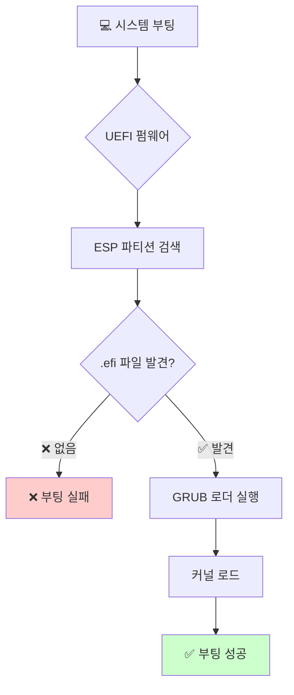

# 🛠️ Arch Linux 문제 해결 가이드

> 📚 **목차**
> - [🚀 부팅 문제](#-부팅-문제)
> - [🔧 설치 문제](#-설치-문제)
> - [🌐 네트워크 문제](#-네트워크-문제)
> - [📦 패키지 관리 문제](#-패키지-관리-문제)
> - [🎨 그래픽 문제](#-그래픽-문제)
> - [🔊 오디오 문제](#-오디오-문제)
> - [⌨️ 입력 문제](#️-입력-문제)
> - [🛡️ 보안 문제](#️-보안-문제)

---

## 🚀 부팅 문제

### ⚠️ UEFI 부팅 실패: GRUB 설치 경로 오류



#### 🔍 **문제 원인**

UEFI 환경에서 GRUB 부트로더를 `/boot/efi`가 아닌 `/boot`에 설치하면 시스템이 부팅되지 않습니다.

> ⚡ **핵심 원리**: UEFI 펌웨어는 오직 **EFI 시스템 파티션(ESP)**에서만 부팅 파일을 찾도록 설계됨

#### 📋 **부팅 과정 분석**

| 단계 | 담당자 | 역할 | 지원 파일시스템 |
|------|--------|------|----------------|
| **1단계** | 🔧 UEFI 펌웨어 | 하드웨어 초기화, .efi 파일 검색 | FAT32만 지원 |
| **2단계** | 📂 GRUB 부트로더 | 커널/initrd 로드, OS 실행 | ext4, Btrfs, XFS 등 |

#### 🚨 **잘못된 설치의 문제점**

```bash
# ❌ 잘못된 설치 (부팅 불가)
grub-install --target=x86_64-efi --bootloader-id=GRUB /boot

# ✅ 올바른 설치
grub-install --target=x86_64-efi --efi-directory=/boot/efi --bootloader-id=GRUB
```

#### 📁 **디렉토리 역할 구분**

| 항목 | `/boot/efi` (ESP 마운트) | `/boot` (리눅스 디렉토리) |
|------|-------------------------|--------------------------|
| **역할** | 🔧 펌웨어용 부트로더 저장소 | 📂 GRUB용 커널/설정 저장소 |
| **내용물** | `grubx64.efi`, `bootx64.efi` | `vmlinuz`, `initrd.img`, `grub.cfg` |
| **파일시스템** | FAT32 (필수) | ext4, Btrfs, XFS 등 |
| **접근자** | UEFI 펌웨어 | GRUB 부트로더 |

#### 🔧 **해결 방법**

1. **ESP 파티션 확인**
```bash
lsblk -f | grep -i fat
```

2. **올바른 GRUB 재설치**
```bash
# ESP 파티션 마운트
mount /dev/sda1 /boot/efi

# GRUB 올바르게 설치
grub-install --target=x86_64-efi --efi-directory=/boot/efi --bootloader-id=GRUB

# 설정 파일 생성
grub-mkconfig -o /boot/grub/grub.cfg
```

### 🆘 기타 부팅 문제

#### 🌑 **검은 화면 / 커서만 깜빡임**

**원인**: 그래픽 드라이버 문제

```bash
# 복구 모드로 부팅 후
sudo pacman -S xf86-video-vesa  # 범용 드라이버
sudo pacman -S nvidia           # NVIDIA 카드
sudo pacman -S xf86-video-amdgpu # AMD 카드
```

#### 🔄 **무한 부팅 루프**

**해결책**:
```bash
# systemd 서비스 상태 확인
systemctl --failed

# 문제 서비스 비활성화
systemctl disable [서비스명]
```

---

## 🔧 설치 문제

### 📡 **인터넷 연결 실패**

#### 🌐 **유선 연결**
```bash
# 네트워크 인터페이스 확인
ip link

# DHCP로 IP 획득
dhcpcd [인터페이스명]

# 연결 테스트
ping archlinux.org
```

#### 📶 **무선 연결 (iwctl)**
```bash
# iwctl 실행
iwctl

# 장치 확인
[iwd]# device list

# 네트워크 스캔
[iwd]# station wlan0 scan

# 네트워크 목록 보기
[iwd]# station wlan0 get-networks

# 연결
[iwd]# station wlan0 connect "WiFi_이름"
```

### 💾 **디스크 파티션 문제**

#### 🎯 **UEFI 시스템 파티션 생성**

```bash
# 파티션 도구 실행
fdisk /dev/sda

# 파티션 생성 순서
# 1. ESP: 512MB, type=EFI System (1)
# 2. SWAP: 4GB, type=Linux swap (19)
# 3. ROOT: 나머지, type=Linux filesystem (20)

# 포맷
mkfs.fat -F32 /dev/sda1    # ESP
mkswap /dev/sda2           # SWAP
mkfs.ext4 /dev/sda3        # ROOT
```

---

## 🌐 네트워크 문제

### 🔌 **NetworkManager 설정**

```bash
# NetworkManager 설치 및 활성화
sudo pacman -S networkmanager
sudo systemctl enable NetworkManager
sudo systemctl start NetworkManager

# 무선 연결 관리
nmcli device wifi list
nmcli device wifi connect "WiFi_이름" password "비밀번호"
```

### 🌍 **DNS 문제**

```bash
# DNS 서버 설정
echo 'nameserver 8.8.8.8' | sudo tee /etc/resolv.conf
echo 'nameserver 1.1.1.1' | sudo tee -a /etc/resolv.conf

# systemd-resolved 사용시
sudo systemctl enable systemd-resolved
```

---

## 📦 패키지 관리 문제

### 🔐 **PGP 키 오류**

```bash
# 키링 초기화
sudo pacman-key --init

# 키 업데이트
sudo pacman-key --populate archlinux

# 키 새로고침
sudo pacman-key --refresh-keys
```

### 🔄 **미러 최적화**

```bash
# Reflector 설치
sudo pacman -S reflector

# 빠른 미러 자동 설정
sudo reflector --country 'South Korea' --age 12 --protocol https --sort rate --save /etc/pacman.d/mirrorlist

# 패키지 데이터베이스 업데이트
sudo pacman -Syy
```

---

## 🎨 그래픽 문제

### 🖥️ **X11 시작 실패**

```bash
# X11 로그 확인
cat /var/log/Xorg.0.log | grep EE

# 기본 드라이버 설치
sudo pacman -S xorg-server xorg-xinit
```

### 🎮 **게임/3D 성능 문제**

```bash
# Vulkan 지원 (NVIDIA)
sudo pacman -S vulkan-icd-loader nvidia-utils

# Vulkan 지원 (AMD)
sudo pacman -S vulkan-icd-loader vulkan-radeon

# 32비트 지원 (Steam 등)
sudo pacman -S lib32-nvidia-utils  # NVIDIA
sudo pacman -S lib32-vulkan-radeon # AMD
```

---

## 🔊 오디오 문제

### 🎵 **PulseAudio 설정**

```bash
# PulseAudio 설치
sudo pacman -S pulseaudio pulseaudio-alsa pavucontrol

# 사용자 서비스 시작
systemctl --user enable pulseaudio
systemctl --user start pulseaudio

# 오디오 장치 확인
pactl list sinks short
```

### 🎧 **ALSA 문제**

```bash
# ALSA 유틸리티 설치
sudo pacman -S alsa-utils

# 음소거 해제
amixer sset Master unmute
amixer sset Master 70%

# 사운드 카드 확인
aplay -l
```

---

## ⌨️ 입력 문제

### 🇰🇷 **한글 입력기 문제**

#### **IBus 설정**
```bash
# IBus 설치
sudo pacman -S ibus ibus-hangul

# 환경 변수 설정 (~/.bashrc)
export GTK_IM_MODULE=ibus
export QT_IM_MODULE=ibus
export XMODIFIERS=@im=ibus

# IBus 시작
ibus-daemon -drx
```

#### **Fcitx5 설정**
```bash
# Fcitx5 설치
sudo pacman -S fcitx5 fcitx5-hangul fcitx5-configtool

# 환경 변수 설정
export GTK_IM_MODULE=fcitx
export QT_IM_MODULE=fcitx
export XMODIFIERS=@im=fcitx

# 자동 시작 설정
echo "fcitx5 &" >> ~/.xprofile
```

---

## 🛡️ 보안 문제

### 🔒 **방화벽 설정**

```bash
# UFW 설치 및 설정
sudo pacman -S ufw
sudo ufw enable
sudo ufw default deny incoming
sudo ufw default allow outgoing

# 특정 포트 허용
sudo ufw allow ssh
sudo ufw allow 80/tcp
```

### 🛡️ **업데이트 자동화**

```bash
# 자동 업데이트 스크립트 생성
sudo tee /etc/systemd/system/arch-update.service << EOF
[Unit]
Description=Arch Linux Update

[Service]
Type=oneshot
ExecStart=/usr/bin/pacman -Syu --noconfirm
EOF

# 타이머 설정
sudo tee /etc/systemd/system/arch-update.timer << EOF
[Unit]
Description=Run Arch Update Weekly

[Timer]
OnCalendar=weekly
Persistent=true

[Install]
WantedBy=timers.target
EOF

sudo systemctl enable arch-update.timer
```

---

## 📞 추가 도움 받기

### 🌍 **커뮤니티 리소스**

| 리소스 | 설명 | 링크 |
|--------|------|------|
| 📖 **Arch Wiki** | 공식 문서 | https://wiki.archlinux.org |
| 💬 **포럼** | 커뮤니티 지원 | https://bbs.archlinux.org |
| 🐛 **버그 트래커** | 버그 신고 | https://bugs.archlinux.org |
| 💬 **Reddit** | r/archlinux | https://reddit.com/r/archlinux |

### 🔍 **로그 확인 명령어**

```bash
# 시스템 로그
journalctl -xe

# 부팅 로그
dmesg | tail -20

# 패키지 로그
tail -f /var/log/pacman.log

# X11 로그
cat ~/.local/share/xorg/Xorg.0.log
```

---

> ⚡ **팁**: 문제 해결 시 항상 로그를 먼저 확인하고, 공식 Arch Wiki를 참조하세요!
> 🚨 **주의**: 중요한 변경사항은 반드시 백업 후 진행하세요!