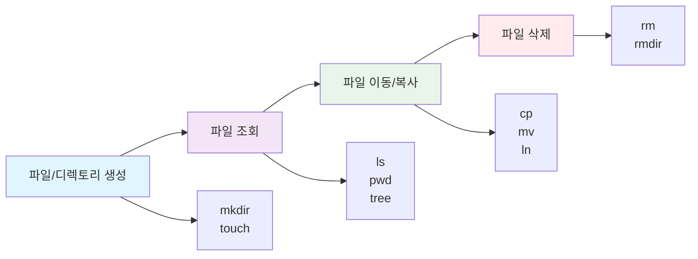
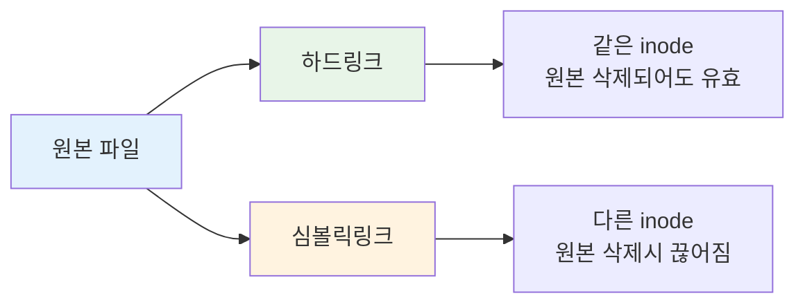

# 리눅스 명령어 완전 가이드

> 🐧 포괄적인 리눅스 명령어 레퍼런스 - 초보자부터 고급 사용자까지

## 📋 목차 개요

```mermaid
graph TD
    A[리눅스 명령어] --> B[파일 & 디렉토리]
    A --> C[시스템 정보 & 도움말]
    A --> D[프로세스 관리]
    A --> E[네트워킹]
    A --> F[텍스트 처리]
    A --> G[압축 & 아카이빙]
    A --> H[검색 & 찾기]
    A --> I[쉘 환경 & 스크립팅]
    A --> J[권한 & 사용자]
    A --> K[디스크 & 파일시스템]
    A --> L[패키지 관리]
    A --> M[모니터링 & 성능]
    
    B --> B1[기본 조작<br/>ls, cd, mkdir, cp, mv, rm]
    B --> B2[링크 & 권한<br/>ln, chmod, chown, chgrp]
    B --> B3[파일 정보<br/>file, stat, du, df]
    
    C --> C1[매뉴얼<br/>man, info, help, --help]
    C --> C2[명령어 타입<br/>type, which, whereis]
    C --> C3[시스템 정보<br/>uname, whoami, id, uptime]
    
    D --> D1[프로세스 조회<br/>ps, top, htop, pstree]
    D --> D2[작업 제어<br/>jobs, bg, fg, nohup]
    D --> D3[시그널 & 종료<br/>kill, killall, pkill]
    
    E --> E1[네트워크 도구<br/>ping, traceroute, wget, curl]
    E --> E2[SSH 관련<br/>ssh, scp, sftp, rsync]
    E --> E3[네트워크 정보<br/>netstat, ss, ifconfig, ip]
```



## 📁 파일 및 디렉토리 조작

### 기본 파일 조작 명령어 플로우



### 📂 디렉토리 및 탐색

#### `ls` - 디렉토리 내용 나열
```bash
# 기본 사용법
ls                    # 현재 디렉토리 내용
ls /path/to/dir      # 특정 디렉토리 내용

# 주요 옵션 조합
ls -la               # 숨김파일 포함, 자세한 정보 표시
ls -lah              # 사람이 읽기 쉬운 크기 형식으로 표시
ls -lt               # 수정 시간순 정렬
ls -ltr              # 수정 시간 역순 정렬 (오래된 것부터)
ls -lS               # 파일 크기순 정렬
ls -R                # 재귀적으로 하위 디렉토리까지 표시

# 고급 사용법
ls -d */             # 디렉토리만 표시
ls -1                # 한 줄에 하나씩 표시
ls --color=auto      # 컬러 출력
ls -i                # inode 번호 표시
ls -F                # 파일 타입 표시자 추가 (/, *, @, |)
```

#### `cd` - 디렉토리 변경
```bash
# 기본 이동
cd /path/to/dir      # 절대 경로로 이동
cd ../               # 상위 디렉토리로 이동
cd ../../            # 두 단계 위로 이동
cd ~                 # 홈 디렉토리로 이동
cd -                 # 이전 디렉토리로 돌아가기

# 특수 디렉토리
cd                   # 홈 디렉토리 (cd ~와 동일)
cd /                 # 루트 디렉토리
cd ..                # 부모 디렉토리
```

#### `pwd` - 현재 작업 디렉토리 출력
```bash
pwd                  # 현재 위치 출력
pwd -P               # 심볼릭 링크 해결된 실제 경로 출력
```

#### `mkdir` - 디렉토리 생성
```bash
mkdir dirname                    # 단일 디렉토리 생성
mkdir dir1 dir2 dir3            # 다중 디렉토리 생성
mkdir -p path/to/deep/dir       # 중간 디렉토리까지 모두 생성
mkdir -m 755 dirname            # 권한을 지정하여 생성
mkdir -v dirname                # 생성 과정 상세 출력
```

### 📄 파일 조작

#### `touch` - 파일 생성 및 시간 수정
```bash
# 파일 생성
touch filename                   # 빈 파일 생성
touch file1 file2 file3         # 다중 파일 생성

# 시간 수정
touch -t 202312251400.30 file   # 특정 시간으로 설정 (YYYYMMDDhhmm.ss)
touch -r reference_file file    # 참조 파일과 같은 시간으로 설정
touch -a file                   # 접근 시간만 현재 시간으로 수정
touch -m file                   # 수정 시간만 현재 시간으로 수정
```

#### `cp` - 파일/디렉토리 복사
```bash
# 기본 복사
cp source dest                  # 파일 복사
cp file1 file2 file3 dest_dir/  # 여러 파일을 디렉토리로 복사

# 디렉토리 복사
cp -r source_dir dest_dir       # 디렉토리 재귀 복사
cp -a source dest               # 아카이브 모드 (권한, 시간, 링크 보존)

# 안전한 복사
cp -i source dest               # 덮어쓰기 전 확인
cp -n source dest               # 덮어쓰기 하지 않음
cp -u source dest               # 더 새로운 파일만 복사

# 고급 옵션
cp -p source dest               # 권한, 시간 속성 보존
cp -v source dest               # 복사 과정 출력
cp -f source dest               # 강제 복사
cp --backup=numbered file dest  # 백업 생성
```

#### `mv` - 파일/디렉토리 이동 및 이름 변경
```bash
# 기본 이동
mv source dest                  # 파일/디렉토리 이동 또는 이름 변경
mv file1 file2 file3 dest_dir/  # 여러 파일을 디렉토리로 이동

# 안전한 이동
mv -i source dest               # 덮어쓰기 전 확인
mv -n source dest               # 덮어쓰기 하지 않음
mv -u source dest               # 더 새로운 파일만 이동

# 고급 옵션
mv -v source dest               # 이동 과정 출력
mv -f source dest               # 강제 이동
mv --backup=numbered file dest  # 백업 생성
```

#### `rm` - 파일/디렉토리 삭제
```bash
# 파일 삭제
rm filename                     # 파일 삭제
rm file1 file2 file3           # 여러 파일 삭제

# 안전한 삭제
rm -i filename                  # 삭제 전 확인
rm -I *.txt                     # 3개 이상 파일 삭제시 한 번만 확인

# 디렉토리 삭제
rm -r dirname                   # 디렉토리 재귀 삭제
rm -rf dirname                  # 강제 재귀 삭제 (매우 위험!)

# 고급 옵션
rm -v filename                  # 삭제 과정 출력
rm --preserve-root              # 루트 디렉토리 삭제 방지 (기본값)
```

⚠️ **주의사항**: `rm -rf`는 매우 위험한 명령어입니다. 특히 `rm -rf /`는 시스템 전체를 삭제할 수 있습니다.

### 🔗 링크 관리

#### `ln` - 하드링크 및 심볼릭링크 생성



```bash
# 하드링크 생성
ln source_file hard_link        # 하드링크 생성

# 심볼릭링크 생성
ln -s source_file symbolic_link # 심볼릭링크 생성
ln -s /full/path/file link      # 절대 경로로 심볼릭링크
ln -s ../relative/path link     # 상대 경로로 심볼릭링크

# 고급 옵션
ln -sf target link              # 기존 링크 강제 덮어쓰기
ln -v source link               # 링크 생성 과정 출력
ln -b source link               # 기존 파일 백업 후 링크 생성
```

### 📊 파일 정보 및 통계

#### `file` - 파일 타입 확인
```bash
file filename                   # 파일 타입 확인
file -b filename               # 간략한 출력
file -i filename               # MIME 타입 출력
file -z filename               # 압축 파일 내용도 확인
file *                         # 현재 디렉토리 모든 파일 확인
```

#### `stat` - 파일 상세 정보
```bash
stat filename                   # 파일 상세 정보
stat -c "%n %s %y" file        # 커스텀 형식으로 출력
stat -f filename               # 파일시스템 정보
```

#### `du` - 디스크 사용량
```bash
du                             # 현재 디렉토리 사용량
du -h                          # 사람이 읽기 쉬운 형식
du -s                          # 요약만 표시
du -sh *                       # 각 항목별 요약
du -ah                         # 모든 파일 포함
du --max-depth=1              # 깊이 제한
du -c                          # 총합 표시
```

#### `df` - 파일시스템 디스크 사용량
```bash
df                             # 마운트된 파일시스템 사용량
df -h                          # 사람이 읽기 쉬운 형식
df -T                          # 파일시스템 타입 포함
df -i                          # inode 사용량 표시
df /path                       # 특정 경로의 파일시스템 정보
```

### 📋 파일 분할 및 결합

#### `split` - 파일 분할
```bash
# 크기별 분할
split -b 1M largefile prefix   # 1MB 단위로 분할
split -b 1G largefile          # 1GB 단위로 분할

# 라인별 분할
split -l 1000 textfile         # 1000줄씩 분할
split -n 5 file                # 5개 파일로 균등 분할

# 고급 옵션
split -d largefile prefix      # 숫자 접미사 사용
split -a 3 file               # 접미사 길이 3자리
split --numeric-suffixes=1 file # 숫자 접미사 1부터 시작
split --verbose largefile      # 분할 과정 출력
```

#### `csplit` - 내용 기반 파일 분할
```bash
# 패턴 기반 분할
csplit file '/pattern/' '{*}'  # 패턴으로 반복 분할
csplit file 100 200 300       # 특정 라인에서 분할
csplit -f prefix file '/START/' '{*}' # 접두사 지정

# 고급 옵션
csplit -s file '/pattern/'     # 파일 크기 출력 억제
csplit -n 3 file '/pattern/'   # 접미사 자릿수 지정
```

**도움말 및 문서 접근:**

*   **`man`** - 프로그램의 매뉴얼 페이지(man page)를 표시. 대부분의 실행 프로그램은 man 페이지 형태의 공식 문서를 제공합니다.
    *   `man program` 형식으로 사용됩니다.
    *   기본적으로 `less` 프로그램을 사용하여 man 페이지를 표시하며, `less` 명령(페이지 위/아래, 검색 등)을 사용할 수 있습니다.
    *   `man section search_term` 형식으로 특정 섹션의 man 페이지를 볼 수 있습니다.
    *   man 페이지는 참고용이며 튜토리얼은 포함하지 않는 경우가 많습니다. bash man 페이지는 매우 길고 밀도가 높습니다.
*   **`info`** - 프로그램의 Info 항목을 표시.
    *   GNU 프로젝트 프로그램은 man 페이지 대신 Info 형식을 제공하기도 합니다.
    *   Info 페이지는 웹 페이지처럼 하이퍼링크되어 있으며, `info` 리더 프로그램을 사용하여 볼 수 있습니다.
    *   `info program` 형식으로 사용되며, `?`, `PgUp`/`PgDn`, `n`/`p`/`u`, `Enter`, `q` 등의 명령으로 페이지를 탐색할 수 있습니다.
*   **`--help`** - 사용법 정보를 표시. 많은 실행 프로그램이 이 옵션을 지원하며, 명령의 구문과 옵션 설명을 보여줍니다.
*   **`help`** - 쉘 내장 명령에 대한 도움말을 표시.
    *   `help builtin` 형식으로 사용됩니다. bash는 `cd`와 같은 다수의 내장 명령을 지원합니다.
    *   `help` 출력은 간결하고 정확하지만 튜토리얼 형식은 아닙니다.
*   **`apropos`** - 키워드에 해당하는 매뉴얼 페이지 목록을 표시. 검색어와 관련된 명령을 찾는 데 사용됩니다. `man -k` 옵션과 동일한 기능을 수행합니다.
*   **`whatis`** - 명령어에 대한 매우 간략한 설명(한 줄)을 표시. man 페이지에서 가져온 정보를 보여줍니다.
*   **`README` 파일 및 기타 문서** - 많은 소프트웨어 패키지 문서는 `/usr/share/doc` 디렉토리에 있으며, 일반 텍스트 형식인 경우 `less`로 볼 수 있습니다. `.gz` 확장자는 gzip 압축을 나타내며, `zless`로 볼 수 있습니다.

**명령어 유형 및 위치 확인:**

*   **`type`** - 명령어 이름이 어떻게 해석되는지 표시. 쉘이 특정 명령어 이름을 어떤 종류(실행 파일, 내장 명령, 쉘 함수, 별칭)로 인식하는지 보여줍니다.
*   **`which`** - 실행 파일의 위치를 표시. 시스템에 동일한 실행 파일이 여러 버전 설치된 경우 정확한 위치를 확인하는 데 사용됩니다. command substitution과 함께 사용하여 프로그램의 전체 경로명을 얻을 수 있습니다.

**프로세스 관리:**

*   **`ps`** - 현재 프로세스 상태를 스냅샷으로 보고. 기본적으로 현재 터미널 세션과 관련된 프로세스만 보여줍니다. BSD 스타일 옵션(예: `a` 모든 사용자 프로세스, `u` 사용자/CPU/메모리 정보, `x` 제어 터미널 없는 프로세스)을 사용하면 더 많은 정보를 볼 수 있습니다.
*   **`top`** - 작업(프로세스) 목록을 표시. 시스템에서 실행 중인 프로세스를 가장 활성 상태 순으로 실시간에 가깝게 보여줍니다.
*   **`kill`** - 프로세스에 시그널을 보냄. 프로세스 ID(PID)를 지정하여 사용합니다.
    *   기본적으로 `TERM` 시그널(15)을 보냅니다.
    *   `-s SIGNAL` 또는 `-SIGNAL` 옵션으로 특정 시그널을 보낼 수 있습니다.
    *   `SIGINT` (2, Ctrl+C), `SIGKILL` (9, 강제 종료), `SIGTSTP` (20, Ctrl+Z) 등이 자주 사용됩니다.
*   **`killall`** - 프로세스 이름으로 시그널을 보냄. 동일한 이름의 모든 프로세스에 시그널을 보낼 수 있습니다.
*   **`jobs`** - 활성 작업을 나열.
*   **`bg`** - 작업을 백그라운드로 보냄.
*   **`fg`** - 작업을 포그라운드로 보냄.
*   **`pstree`** - 프로세스 목록을 트리 형태로 출력하여 부모/자식 관계를 보여줌.
*   **`vmstat`** - 메모리, 스왑, 디스크 I/O 등 시스템 리소스 사용량 스냅샷을 출력.
*   **`watch`** - 명령의 출력을 주기적으로 실행/표시. 일정 시간 간격으로 명령 출력을 계속 관찰하는 데 유용합니다.

**네트워킹:**

*   **`ping`** - 네트워크 호스트에 ICMP ECHO_REQUEST를 전송. 호스트가 활성 상태인지 확인하는 데 사용됩니다.
*   **`traceroute`** - 네트워크 호스트까지 패킷이 추적하는 경로를 출력.
*   **`ip`** - 라우팅, 장치, 정책 라우팅 및 터널 표시/조작. (소스에 자세한 설명은 없음)
*   **`netstat`** - 네트워크 연결, 라우팅 테이블, 인터페이스 통계 등을 출력.
*   **`ifconfig`** - 네트워크 인터페이스 구성을 확인/조작. 네트워크 인터페이스의 IP 주소를 확인하는 데 사용됩니다.
*   **`ssh`** - OpenSSH SSH 클라이언트(원격 로그인 프로그램). 원격 호스트와의 보안 통신에 사용됩니다. 원격 호스트에서 명령을 실행하고 그 출력을 로컬 쉘에 표시할 수 있습니다.
*   **`scp`** - 원격 호스트 간에 파일을 보안적으로 복사.
*   **`sftp`** - SSH 파일 전송 프로그램. 원격 시스템과 파일 전송을 위해 사용됩니다.
*   **`wget`** - 비대화형 네트워크 다운로더. HTTP, HTTPS, FTP 프로토콜을 통해 웹 페이지나 파일을 다운로드하는 데 사용됩니다. 여러 URL을 지정하여 한 번에 다운로드할 수 있습니다.
*   **`curl`** - URL로 데이터를 전송하는 도구. HTTP, HTTPS, FTP 등 다양한 프로토콜을 지원하며, GET, POST 요청, HTTP 헤더 지정 등 다양한 작업을 수행할 수 있습니다.

**파일 검색:**

*   **`locate`** - 파일 이름으로 파일을 찾음. 업데이트된 데이터베이스에서 파일 위치를 빠르게 검색합니다. 정규 표현식 검색을 지원합니다.
*   **`find`** - 디렉토리 계층 구조에서 파일을 검색. 다양한 조건(유형, 이름, 크기, 시간, 권한 등)에 맞는 파일을 찾고, 찾은 파일에 대해 작업을 수행할 수 있습니다.
    *   `-type` 옵션으로 파일 유형(파일, 디렉토리 등)을 지정할 수 있습니다.
    *   `-name` 옵션으로 파일 이름을 와일드카드를 사용하여 지정할 수 있습니다.
    *   `-perm` 옵션으로 파일 권한을 지정할 수 있습니다.
    *   `-exec` 옵션으로 찾은 파일에 대해 명령을 실행할 수 있습니다. `{}`는 찾은 파일명으로 대체됩니다.
*   **`xargs`** - 표준 입력에서 명령줄을 구성하고 실행. 파이프라인에서 다른 명령의 출력을 인수로 받아 명령을 실행하는 데 유용합니다.
    *   `-n` 옵션으로 한 줄에 포함될 최대 인자 수를 지정할 수 있습니다.
    *   `-d` 옵션으로 인자 구분자를 지정할 수 있습니다.
    *   `find ... -print0 | xargs -0 ...`와 같이 사용하여 공백이나 특수 문자가 포함된 파일명을 안전하게 처리할 수 있습니다.

**텍스트 처리 및 포맷팅:**

*   **`cat`** - 파일을 연결하고 출력. 파일 내용을 화면에 표시하거나, 여러 파일을 연결하여 출력하는 데 사용됩니다.
    *   `-s` 옵션으로 연속된 빈 줄을 하나로 압축합니다.
    *   `-n` 옵션으로 줄 번호를 붙입니다.
    *   표준 입력을 파일명으로 지정할 때는 `-`를 사용할 수 있습니다.
*   **`grep`** - 패턴과 일치하는 줄을 출력. 파일이나 표준 입력에서 정규 표현식 패턴과 일치하는 줄을 찾습니다.
    *   `-i` 옵션은 대소문자를 무시합니다.
    *   `-v` 옵션은 패턴과 일치하지 않는 줄만 출력합니다.
    *   `-r` 옵션은 디렉토리를 재귀적으로 검색합니다.
    *   `-c` 옵션은 패턴과 일치하는 줄 수를 셉니다.
    *   `-A NUM`은 일치하는 줄 다음 `NUM` 줄을 출력합니다.
    *   `-B NUM`은 일치하는 줄 이전 `NUM` 줄을 출력합니다.
    *   `-C NUM`은 일치하는 줄 이전/이후 `NUM` 줄을 출력합니다.
*   **`sed`** - 스트림 에디터로 텍스트 필터링 및 변환에 사용. 파일을 읽으면서 편집 명령을 적용하고 결과를 표준 출력으로 내보냅니다. **텍스트 치환**에 주로 사용됩니다.
    *   `s/pattern/replacement/` 형식으로 치환을 수행합니다. `g` 플래그는 모든 일치 항목을 치환합니다.
    *   `sed '/^$/d' file`과 같이 정규 표현식을 사용하여 빈 줄을 제거할 수 있습니다.
    *   `sed -n 'addr1,addr2p'`와 같이 주소를 사용하여 특정 줄 범위만 출력할 수 있습니다.
*   **`awk`** - 텍스트를 찾고 바꾸고, 데이터베이스 정렬/검증/색인에 사용. 패턴 일치 및 텍스트 처리에 강력한 도구입니다. 특히 **테이블 형식 데이터** 처리에 강점이 있습니다.
    *   `awk '{ print $1, $3 }' file`과 같이 필드(열)를 기준으로 데이터를 처리하고 출력할 수 있습니다. `$1`은 첫 번째 필드, `$2`는 두 번째 필드, `$NF`는 마지막 필드를 나타냅니다.
    *   `awk '/pattern/' file`과 같이 패턴과 일치하는 줄을 찾을 수 있습니다.
    *   `awk 'NR==M, NR==N' file`과 같이 줄 번호 범위로 처리할 줄을 지정할 수 있습니다.
*   **`cut`** - 파일의 각 줄에서 섹션을 제거. 파일에서 특정 필드(열) 또는 문자 범위를 추출하여 표준 출력으로 내보냅니다.
    *   `-f FIELD_LIST` 옵션으로 필드 번호 목록을 지정하여 추출합니다.
    *   `-d DELIMITER` 옵션으로 필드 구분 문자를 지정할 수 있습니다.
    *   `-c RANGE` 옵션으로 문자 범위를 지정하여 추출합니다. `-b` 옵션은 바이트를 기준으로 동일하게 작동합니다.
*   **`sort`** - 텍스트 파일의 줄을 정렬. 파일 내용이나 표준 입력을 받아 정렬된 결과를 표준 출력으로 내보냅니다.
    *   `-n` 옵션은 숫자 값으로 정렬합니다.
    *   `-r` 옵션은 역순으로 정렬합니다.
    *   `-u` 옵션은 중복을 제거하고 고유한 줄만 출력합니다.
    *   `-c` 옵션은 파일이 이미 정렬되었는지 확인하고 상태 코드를 반환합니다.
    *   `-k KEY` 옵션으로 특정 필드(열)를 기준으로 정렬할 수 있습니다.
*   **`uniq`** - 중복된 줄을 보고하거나 생략. **정렬된 입력**에서 연속된 중복 줄을 찾거나 제거합니다.
    *   `-c` 옵션은 각 줄의 반복 횟수를 함께 출력합니다.
    *   `-d` 옵션은 중복된 줄만 출력합니다.
*   **`head`** - 파일의 처음 부분을 출력. 기본적으로 처음 10줄을 출력합니다. `-n NUM` 옵션으로 줄 수를 지정할 수 있습니다.
*   **`tail`** - 파일의 마지막 부분을 출력. 기본적으로 마지막 10줄을 출력합니다. `-n NUM` 옵션으로 줄 수를 지정할 수 있습니다.
*   **`tr`** - 문자를 변환하거나 삭제. 입력 스트림에서 문자를 다른 문자로 변환하거나 삭제하는 데 사용됩니다.
    *   `tr SET1 SET2` 형식으로 SET1의 문자를 SET2의 문자로 변환합니다.
    *   `-d SET1` 옵션으로 SET1의 문자를 삭제합니다. `tr -d '\r'`는 MS-DOS 형식 파일의 캐리지 리턴 문자를 제거하는 데 사용될 수 있습니다.
*   **`wc`** - 파일의 줄, 단어, 바이트 수를 출력. `wc file.txt`와 같이 사용하면 줄, 단어, 바이트 수를 순서대로 출력합니다.
    *   `-l` 옵션은 줄 수만 보고합니다.
    *   `-w` 옵션은 단어 수만 보고합니다.
    *   `-c` 옵션은 바이트 수만 보고합니다.
    *   `-L` 옵션은 가장 긴 줄의 길이를 출력합니다.

**아카이빙 및 압축:**

*   **`tar`** - 테이프 아카이버(Tape Archiver). 파일이나 디렉토리 집합을 하나의 아카이브 파일(.tar 또는 .tgz)로 묶는 데 사용되는 고전적인 도구입니다.
    *   `-c` 옵션은 아카이브를 생성합니다.
    *   `-x` 옵션은 아카이브에서 파일을 추출합니다.
    *   `-v` 옵션은 자세한 정보를 출력합니다.
    *   `-f file` 옵션은 아카이브 파일명을 지정합니다.
    *   `-z` 옵션은 gzip으로 압축/해제합니다 (.tar.gz 또는 .tgz).
    *   `-j` 옵션은 bzip2으로 압축/해제합니다 (.tar.bz2 또는 .tbz).
    *   `-a` 옵션은 확장자로부터 압축 형식을 자동 감지합니다.
    *   `tar -cvf archive.tar directory`는 directory를 압축하지 않고 묶습니다.
    *   `tar -xzvf archive.tar.gz`는 gzip 압축된 아카이브를 해제하고 추출합니다.
    *   `tar -czvf archive.tar.gz directory`는 directory를 묶고 gzip으로 압축합니다.
*   **`gzip`** - 파일을 압축 또는 해제. 파일을 압축하여 `.gz` 확장자를 가진 파일로 만들고 원본 파일을 대체합니다. `gunzip`으로 해제합니다.
    *   압축률을 1(가장 빠름)부터 9(가장 좋음)까지 지정할 수 있습니다.
*   **`bzip2`** - 파일을 압축 또는 해제. `gzip`과 유사하지만 다른 압축 알고리즘을 사용하여 더 높은 압축률을 제공합니다. 해제는 `bunzip2`로 합니다. `.bz2` 확장자를 사용합니다.
*   **`zip`** - 파일을 압축하고 아카이브. `.zip` 파일 형식을 사용하며 압축 및 아카이빙 기능을 모두 가집니다. `unzip`으로 해제합니다.
    *   `-r` 옵션은 재귀적으로 디렉토리를 포함합니다.
    *   표준 입력을 받을 수 있습니다 (`ls -l /etc/ | zip ls-etc.zip -`).
*   **`unzip`** - zip 파일을 해제.
*   **`rsync`** - 파일 및 디렉토리를 동기화. 효율적인 파일 복사 및 동기화에 매우 유용합니다.

**쉘 환경 및 스크립팅:**

*   **`echo`** - 텍스트 줄을 표시. 인자로 주어진 텍스트를 표준 출력으로 출력합니다.
*   **`history`** - 명령어 이력을 표시. 이전에 입력한 명령어 목록을 보여줍니다.
    *   `!` 문자를 사용하여 이력 목록의 항목을 재실행하거나 확장할 수 있습니다. `!!`는 마지막 명령을 반복합니다. `!number`는 해당 번호의 명령을 반복합니다. `!string`은 해당 문자열로 시작하는 마지막 명령을 반복합니다.
*   **`alias`** - 명령어에 대한 별칭을 생성. 다른 명령어로 구성된 자신만의 명령을 정의할 수 있습니다.
*   **`unalias`** - 별칭을 제거.
*   **`printenv`** - 환경 변수의 일부 또는 전부를 출력.
*   **`set`** - 쉘 옵션을 설정하거나 변수를 표시. 인자 없이 사용하면 쉘 변수, 환경 변수 및 정의된 쉘 함수를 모두 표시합니다.
*   **`export`** - 환경을 이후 실행될 프로그램으로 내보냄. 쉘 변수를 환경 변수로 만들고 자식 프로세스가 접근할 수 있도록 합니다.
*   **`if`** - 조건부로 명령을 실행. `if commands; then commands; [elif commands; then commands...]; [else commands]; fi` 구문을 사용합니다. `if` 뒤의 명령 목록 중 마지막 명령의 종료 상태를 평가하여 분기합니다.
*   **`test`** - 조건식을 평가. 표현식이 참이면 종료 상태 0, 거짓이면 1을 반환하며, `if` 명령과 함께 자주 사용됩니다. `[ expression ]` 형식도 동일합니다. 파일 상태, 문자열 비교, 숫자 비교 등 다양한 표현식을 지원합니다.
*   **`[[ expression ]]`** - 조건식을 평가. `test` 또는 `[]`보다 더 많은 기능을 제공하는 `if` 명령의 내장 명령입니다.
*   **`(( expression ))`** - 산술 표현식을 평가. 산술 연산 및 비교를 수행하는 내장 명령입니다.
*   **`while`** - 조건이 참인 동안 명령을 반복 실행. `while commands; do commands; done` 구문을 사용합니다.
*   **`until`** - 조건이 거짓인 동안 명령을 반복 실행. `until commands; do commands; done` 구문을 사용합니다. `while` 루프와 반대입니다.
*   **`for`** - 목록의 각 항목에 대해 명령을 반복 실행. `for var in list; do commands; done` 구문을 사용하며, list는 단어 목록, 브레이스 확장, 경로명 확장, 명령 치환 등으로 생성될 수 있습니다.
*   **`case`** - 여러 선택지 중 하나에 따라 분기. 여러 조건에 대한 다중 선택 분기 처리에 사용됩니다.
*   **`shift`** - 위치 매개변수를 이동. 스크립트에서 명령줄 인자를 순차적으로 처리할 때 유용합니다.
*   **`getopts`** - 명령줄 인자를 파싱. 스크립트에서 명령줄 옵션과 인자를 표준적으로 처리하는 데 사용됩니다.

**기타 유용한 명령어:**

*   **`file`** - 파일의 유형을 결정. 파일 내용을 검사하여 파일 형식을 간략하게 설명합니다.
*   **`less`** - 파일 내용을 페이지 단위로 확인. 긴 텍스트 파일을 페이지별로 탐색하는 데 사용됩니다.
    *   화면 위/아래 스크롤, 검색 (`/pattern`), 도움말 (`h`), 종료 (`q`) 등의 명령을 지원합니다. 이전 프로그램 `more`를 개선한 것으로 앞뒤 페이지 이동이 가능합니다.
*   **`dd`** - 파일을 변환 및 복사, 디스크 헤더/부트 레코드 기록. 블록 지향 데이터를 장치로 직접 기록하는 데 사용될 수 있습니다. 디스크 장치를 파일로 복사하거나, 임의 크기의 파일을 생성하는 데 사용됩니다. forensic acquisition 맥락에서 이미지 분할, 해싱 등 추가 기능을 제공하는 `dcfldd`, `dc3dd`와 같은 변형도 있습니다.
*   **`md5sum`** - 파일의 MD5 체크섬을 계산. 파일 내용의 무결성을 확인하는 데 사용됩니다. 파이프라인과 함께 사용하여 실시간으로 체크섬을 계산할 수 있습니다.
*   **`stat`** - 파일 또는 파일 시스템 상태를 표시. (소스에 자세한 설명은 없음)
*   **`touch`** - 파일 시간을 변경하거나 빈 파일을 생성. 파일이 없으면 새로 생성하고, 있으면 최종 수정 시간을 현재 시간으로 업데이트합니다.

이 외에도 패키지 관리(`apt-get`, `dpkg`, `yum`, `rpm`), 사용자 및 그룹 관리(`useradd`, `groupadd`, `usermod`, `chown`, `chgrp`, `passwd`, `chage`), 디스크 및 파일 시스템 관리(`mount`, `umount`, `fdisk`, `mkfs`, `fsck`) 등 다양한 작업에 사용되는 명령어들이 소스에 언급되어 있습니다.