# 제 6장: 동기화 도구 (Synchronization Tools) 🔄

## 📖 목차 (Table of Contents)

1. [개요](#개요)
2. [배경 및 기본 개념](#배경-및-기본-개념)
3. [임계 구역 문제](#임계-구역-문제)
4. [피터슨의 해결책](#피터슨의-해결책)
5. [하드웨어 지원](#하드웨어-지원)
6. [뮤텍스 락](#뮤텍스-락)
7. [세마포어](#세마포어)
8. [모니터](#모니터)
9. [활성 상태와 교착 상태](#활성-상태와-교착-상태)
10. [고전적인 동기화 문제](#고전적인-동기화-문제)
11. [핵심 개념 정리](#핵심-개념-정리)
12. [연습 문제](#연습-문제)

---

## 개요

**동기화 도구(Synchronization Tools)**는 다중 프로세스 환경에서 데이터 일관성을 보장하고 프로세스 간의 순서를 제어하는 중요한 메커니즘입니다.

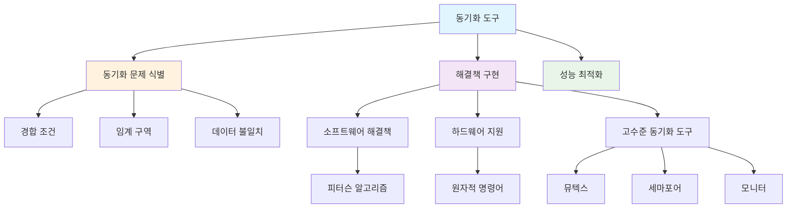

### 🎯 학습 목표

이 장을 통해 다음을 이해할 수 있습니다:
- 동시성에서 발생하는 문제점들
- 임계 구역 문제와 해결 요구사항
- 다양한 동기화 도구들의 원리와 활용
- 고전적인 동기화 문제들과 해결책

---

## 배경 및 기본 개념

### 💡 동시성과 데이터 일관성

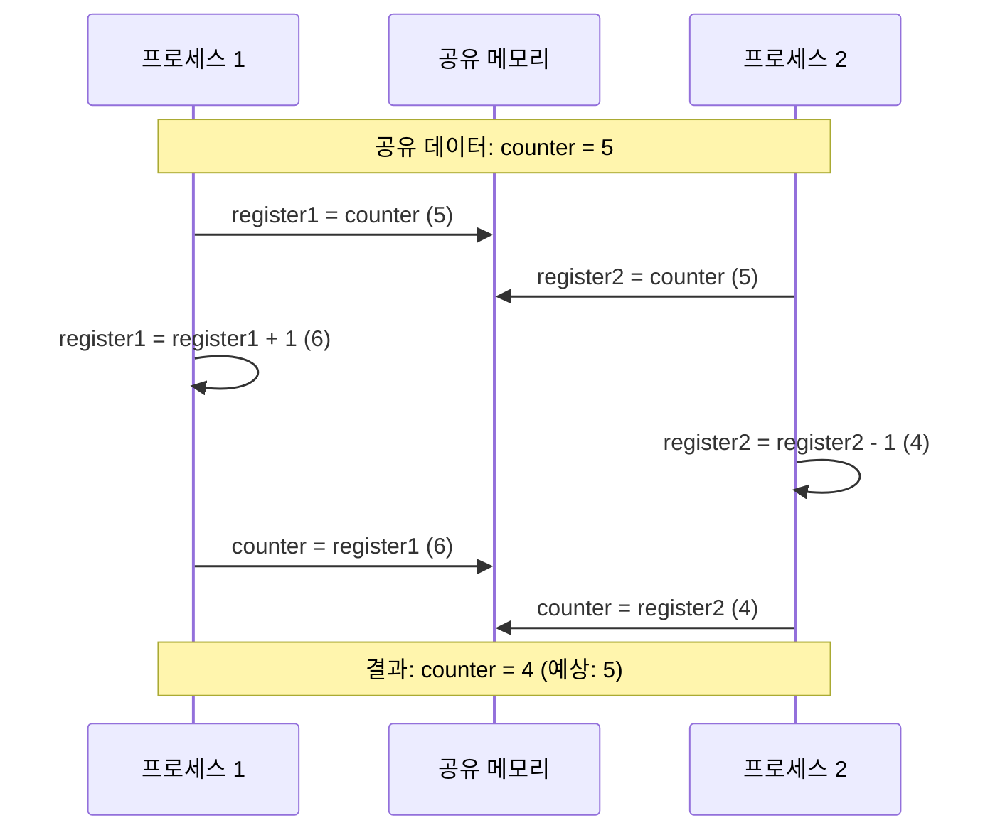

프로세스들은 **동시에 실행**될 수 있으며, 언제든지 실행이 부분적으로 완료된 상태로 중단될 수 있습니다. 이로 인해 **공유 데이터에 대한 동시 접근**은 데이터 불일치(data inconsistency)를 초래할 수 있습니다.

### 🔍 경합 조건 (Race Condition)

**경합 조건**은 여러 프로세스가 동시에 공유 데이터에 접근할 때, 실행 순서에 따라 결과가 달라지는 상황입니다.

#### 실제 예제: 카운터 증가/감소

```c
// 전역 변수
int counter = 5;

// 프로듀서 프로세스
void producer() {
    register1 = counter;      // T0
    register1 = register1 + 1; // T1
    counter = register1;       // T4
}

// 소비자 프로세스  
void consumer() {
    register2 = counter;       // T2
    register2 = register2 - 1; // T3
    counter = register2;       // T5
}
```

**실행 순서와 결과:**
- T0: 프로듀서 `register1 = counter` (register1 = 5)
- T1: 프로듀서 `register1 = register1 + 1` (register1 = 6)
- T2: 소비자 `register2 = counter` (register2 = 5)
- T3: 소비자 `register2 = register2 - 1` (register2 = 4)
- T4: 프로듀서 `counter = register1` (counter = 6)
- T5: 소비자 `counter = register2` (counter = 4)

**결과:** counter = 4 (예상값: 5)

### 🔐 해결책의 필요성

데이터 일관성을 유지하기 위해서는 **협력하는 프로세스의 순서 있는 실행을 보장하는 메커니즘**이 필요합니다.

---

## 임계 구역 문제

### 📝 임계 구역 (Critical Section) 정의

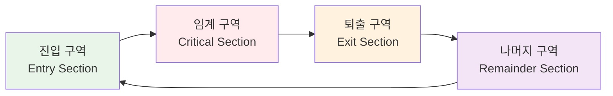

n개의 프로세스 {P₀, P₁, ..., Pₙ₋₁}로 구성된 시스템에서:

- **임계 구역**: 공통 변수를 변경하거나, 테이블을 업데이트하거나, 파일을 쓰는 등의 작업을 수행하는 코드 세그먼트
- **진입 구역**: 임계 구역에 들어가기 위한 허가를 요청하는 코드
- **퇴출 구역**: 임계 구역을 빠져나온 후 실행되는 코드
- **나머지 구역**: 그 외의 코드

### ⚖️ 임계 구역 해결책의 요구사항

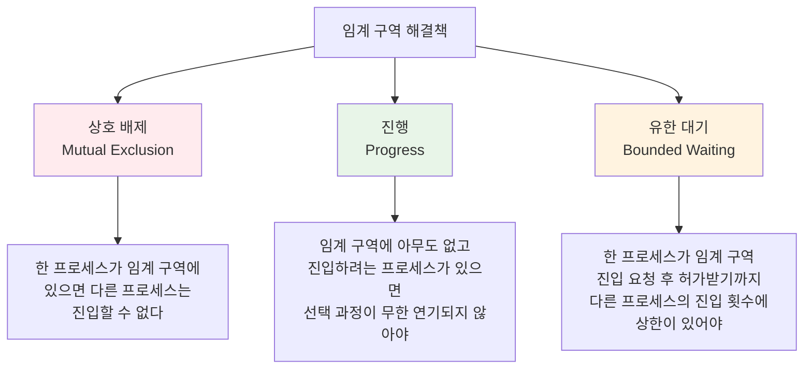

1. **상호 배제 (Mutual Exclusion)**: 프로세스 Pᵢ가 자신의 임계 구역에서 실행 중이면, 다른 어떤 프로세스도 자신의 임계 구역에서 실행될 수 없습니다.

2. **진행 (Progress)**: 임계 구역에서 실행 중인 프로세스가 없고, 자신의 임계 구역에 들어가고자 하는 일부 프로세스가 존재한다면, 다음에 임계 구역에 들어갈 프로세스를 선택하는 과정이 무기한 연기되어서는 안 됩니다.

3. **유한 대기 (Bounded Waiting)**: 프로세스가 임계 구역에 들어가기 위한 요청을 한 후 그 요청이 허가되기까지 다른 프로세스가 자신의 임계 구역에 들어갈 수 있는 횟수에 대한 상한(bound)이 존재해야 합니다.

---

## 피터슨의 해결책

### 🧠 피터슨 알고리즘 (Peterson's Algorithm)

피터슨의 해결책은 **두 프로세스**를 위한 소프트웨어 기반 해결책입니다.

```mermaid
graph TD
    subgraph "공유 변수"
        A[boolean flag[2]<br/>flag[0] = flag[1] = false]
        B[int turn<br/>초기값: 0 또는 1]
    end
    
    subgraph "프로세스 i"
        C[flag[i] = true<br/>다른 프로세스에게 준비됨을 알림]
        D[turn = j<br/>상대방에게 우선권 양보]
        E[while flag[j] && turn == j<br/>상대방이 준비되고 차례이면 대기]
        F[임계 구역 실행]
        G[flag[i] = false<br/>임계 구역 종료를 알림]
    end
    
    C --> D --> E --> F --> G
    
    style F fill:#ffebee
    style A fill:#e8f5e8
    style B fill:#e8f5e8
```

#### 구현 코드

```c
// 공유 변수
boolean flag[2] = {false, false};  // 프로세스 준비 상태
int turn = 0;                      // 누구의 차례인지

// 프로세스 i (i = 0 또는 1)
void process_i() {
    while (true) {
        // 진입 구역
        flag[i] = true;           // 나는 준비됨
        turn = j;                 // 상대방에게 우선권
        while (flag[j] && turn == j); // 상대방이 준비되고 차례이면 대기
        
        // 임계 구역
        critical_section();
        
        // 퇴출 구역
        flag[i] = false;          // 임계 구역 종료
        
        // 나머지 구역
        remainder_section();
    }
}
```

### ✅ 피터슨 해결책의 정확성

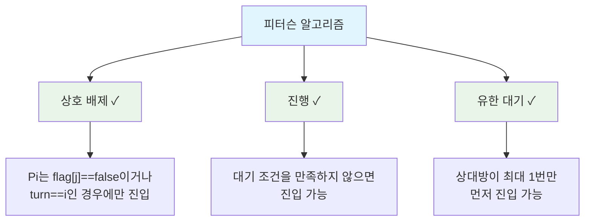

### ⚠️ 현대 아키텍처에서의 한계

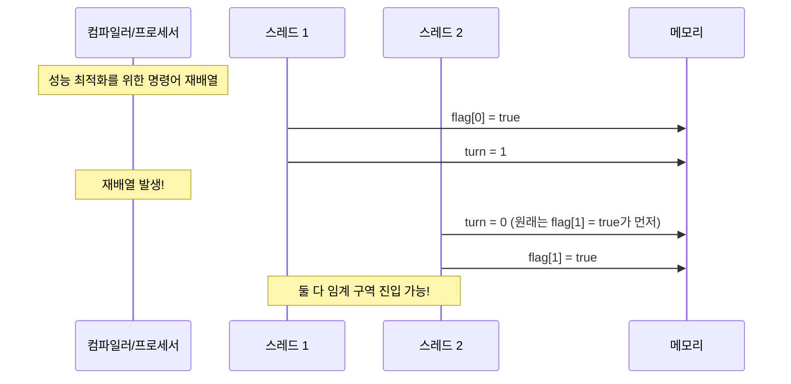

현대 아키텍처에서는 **명령어 재배열(instruction reordering)**로 인해 피터슨 알고리즘이 제대로 작동하지 않을 수 있습니다.

**예시:**
```c
// 원본 코드
x = 100;
flag = true;

// 재배열된 실행 순서 (가능)
flag = true;
x = 100;
```

---

## 하드웨어 지원

### 🔧 하드웨어 명령어

현대 시스템은 임계 구역 구현을 위한 하드웨어 지원을 제공합니다.

#### Test-and-Set 명령어

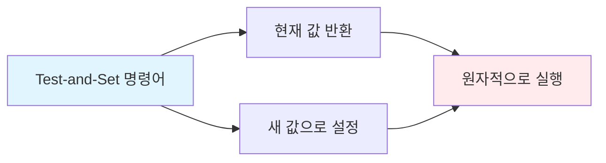

```c
// Test-and-Set 명령어 (하드웨어로 구현)
boolean test_and_set(boolean *target) {
    boolean rv = *target;  // 현재 값을 저장
    *target = true;        // 새 값으로 설정
    return rv;             // 이전 값 반환
}

// 상호 배제 구현
boolean lock = false;  // 공유 변수

void process() {
    while (true) {
        while (test_and_set(&lock)); // 락 획득까지 대기
        
        // 임계 구역
        critical_section();
        
        lock = false;  // 락 해제
        
        // 나머지 구역
        remainder_section();
    }
}
```

#### Compare-and-Swap 명령어

```c
// Compare-and-Swap 명령어
int compare_and_swap(int *value, int expected, int new_value) {
    int temp = *value;
    if (*value == expected)
        *value = new_value;
    return temp;
}
```

### 🔒 원자적 변수 (Atomic Variables)

```c
#include <stdatomic.h>

atomic_int counter = 0;

void increment() {
    atomic_fetch_add(&counter, 1);  // 원자적 증가
}
```

---

## 뮤텍스 락

### 🔐 뮤텍스 락 개념

**뮤텍스(Mutex, Mutual Exclusion)**는 가장 단순한 동기화 도구입니다.

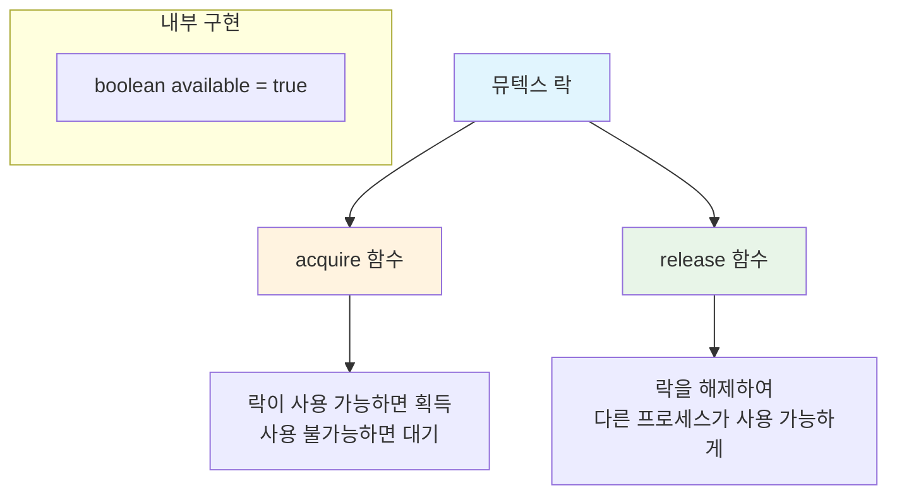

#### 구현

```c
// 뮤텍스 락 구조체
typedef struct {
    boolean available;
} mutex;

// 락 획득
void acquire(mutex *m) {
    while (!m->available); // 바쁜 대기 (busy waiting)
    m->available = false;
}

// 락 해제
void release(mutex *m) {
    m->available = true;
}

// 사용 예제
mutex m = {true};

void process() {
    while (true) {
        acquire(&m);
        
        // 임계 구역
        critical_section();
        
        release(&m);
        
        // 나머지 구역
        remainder_section();
    }
}
```

### 🔄 스핀락 (Spinlock)

뮤텍스 락은 **바쁜 대기(busy waiting)**를 사용하므로 **스핀락**이라고도 불립니다.

**장점:**
- 컨텍스트 스위치 오버헤드 없음
- 짧은 임계 구역에 적합

**단점:**
- CPU 사이클 낭비
- 우선순위 역전 문제 가능성

---

## 세마포어

### 📊 세마포어 개념

**세마포어(Semaphore)**는 정수 변수 S와 두 개의 원자적 연산 `wait()`와 `signal()`로 구성됩니다.

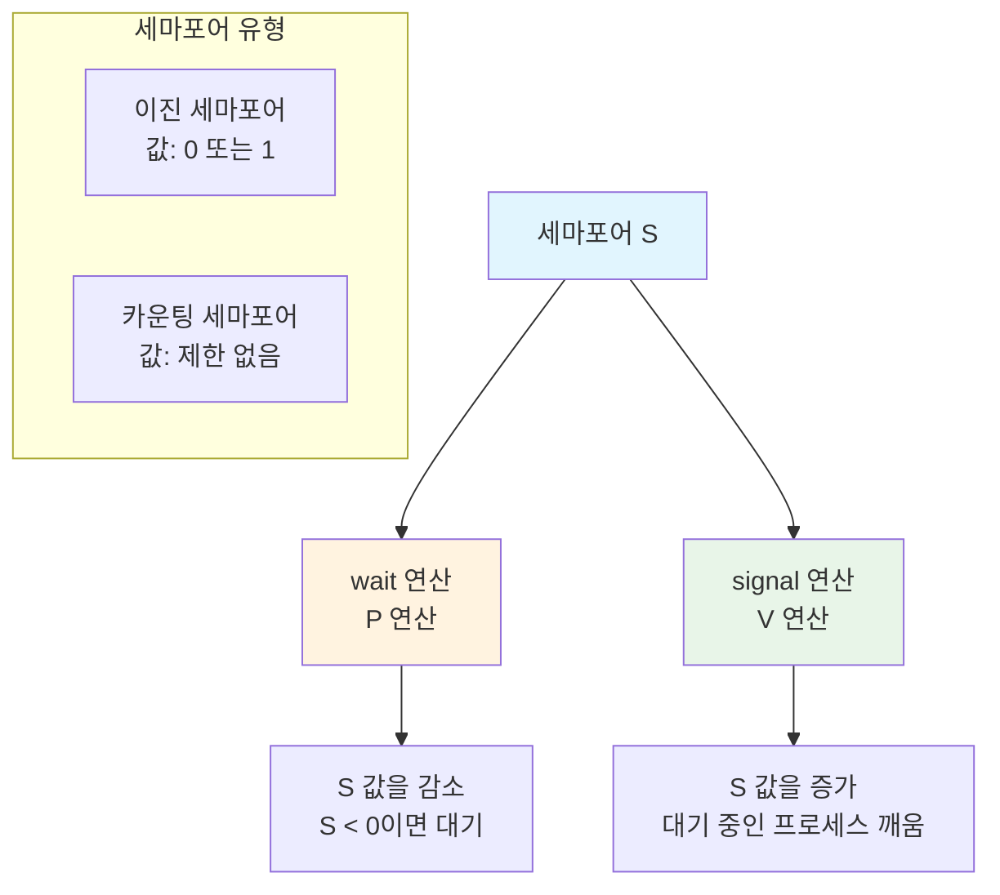

#### 기본 연산

```c
// wait 연산 (P 연산)
void wait(semaphore *S) {
    S->value--;
    if (S->value < 0) {
        // 프로세스를 대기 큐에 추가
        // 프로세스를 블록 상태로 전환
    }
}

// signal 연산 (V 연산)  
void signal(semaphore *S) {
    S->value++;
    if (S->value <= 0) {
        // 대기 큐에서 프로세스 하나 제거
        // 해당 프로세스를 준비 상태로 전환
    }
}
```

### 🔧 세마포어 사용 예시

#### 1. 임계 구역 문제 해결

```c
semaphore mutex = 1;  // 이진 세마포어

void process() {
    while (true) {
        wait(&mutex);      // 임계 구역 진입
        
        // 임계 구역
        critical_section();
        
        signal(&mutex);    // 임계 구역 퇴출
        
        // 나머지 구역
        remainder_section();
    }
}
```

#### 2. 실행 순서 동기화

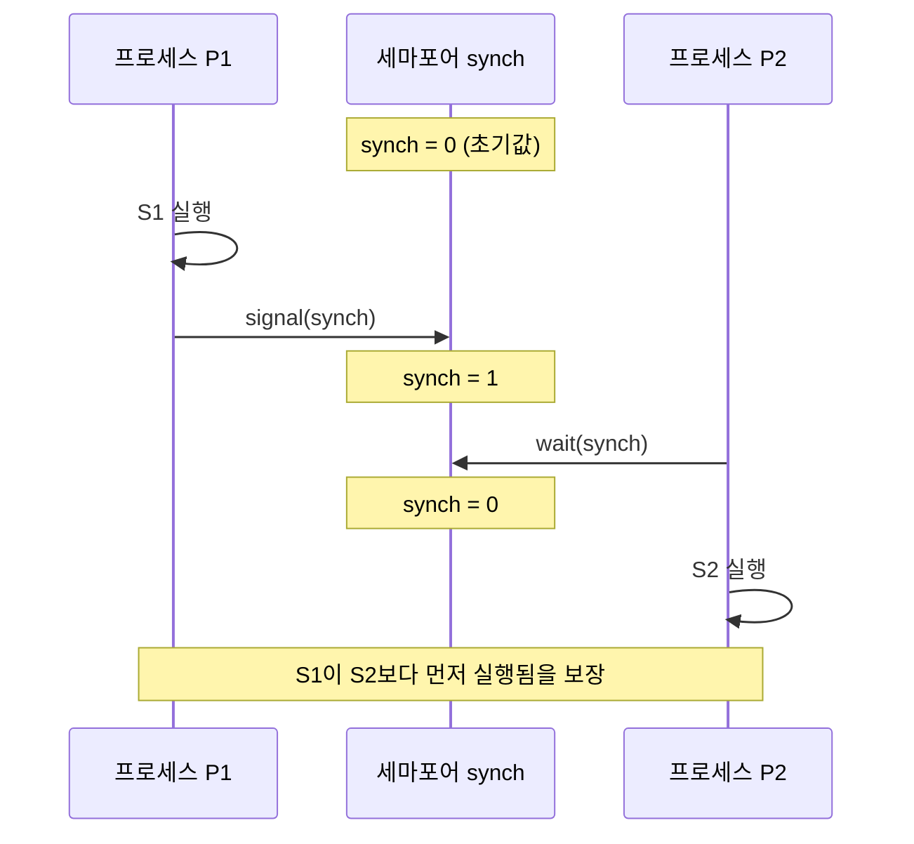

```c
semaphore synch = 0;  // 동기화 세마포어

// 프로세스 P1
void process1() {
    S1;              // 먼저 실행되어야 하는 구문
    signal(&synch);  // P2에게 신호 전송
}

// 프로세스 P2  
void process2() {
    wait(&synch);    // P1의 신호 대기
    S2;              // 나중에 실행되어야 하는 구문
}
```

### 🚫 세마포어 문제점

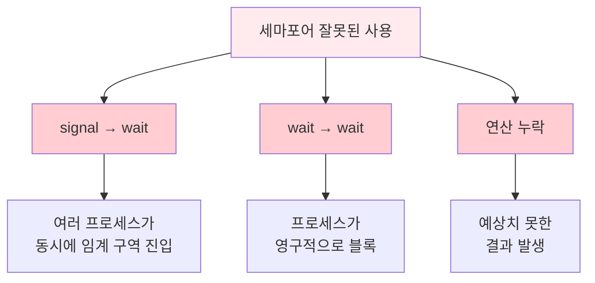

**잘못된 사용 예시:**

1. **signal → wait**: 상호 배제 실패
```c
signal(&mutex);  // 잘못된 순서!
// 임계 구역
wait(&mutex);
```

2. **wait → wait**: 영구 블록
```c
wait(&mutex);
wait(&mutex);  // 두 번째 wait에서 영구 대기
```

3. **연산 누락**: 예측 불가능한 동작

---

## 모니터

### 🏗️ 모니터 개념

**모니터(Monitor)**는 프로세스 동기화를 위한 고수준 추상화 메커니즘입니다.

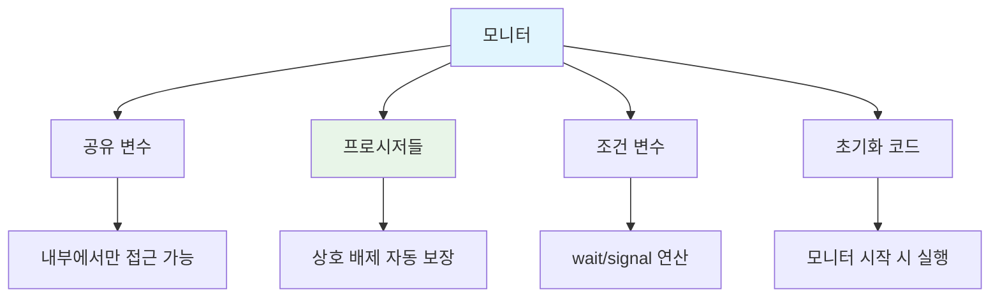

#### 모니터 구조

```c
monitor MonitorName {
    // 공유 변수 선언
    shared_variable_declarations;
    
    // 프로시저 정의
    procedure P1(...) { ... }
    procedure P2(...) { ... }
    ...
    procedure Pn(...) { ... }
    
    // 조건 변수
    condition x, y;
    
    // 초기화 코드
    initialization_code(...) { ... }
}
```

### 🔄 조건 변수 (Condition Variables)

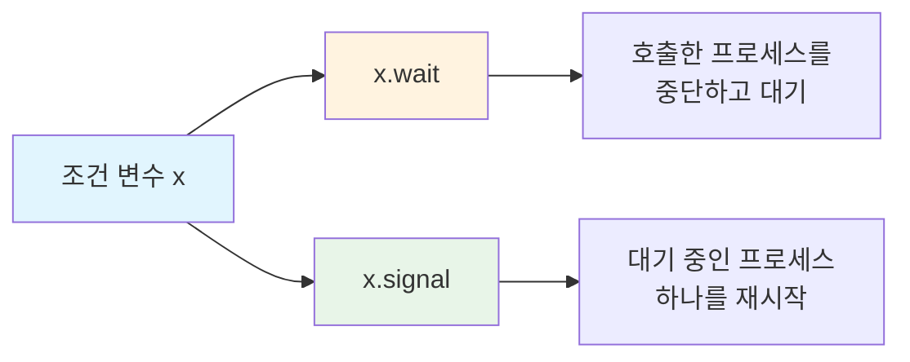

#### 조건 변수 연산

```c
// x.wait() 연산
void x_wait() {
    // 현재 프로세스를 조건 변수 x의 대기 큐에 추가
    // 프로세스를 중단하고 모니터 락 해제
    // 다른 프로세스가 x.signal()을 호출할 때까지 대기
}

// x.signal() 연산
void x_signal() {
    // 조건 변수 x의 대기 큐에서 프로세스 하나 제거
    // 해당 프로세스를 재시작
    // 대기 중인 프로세스가 없으면 아무 동작 안 함
}
```

### 🍽️ 예제: 식사하는 철학자 문제 (모니터 해결책)

```c
monitor DiningPhilosophers {
    enum {THINKING, HUNGRY, EATING} state[5];
    condition self[5];
    
    void pickup(int i) {
        state[i] = HUNGRY;
        test(i);
        if (state[i] != EATING)
            self[i].wait();
    }
    
    void putdown(int i) {
        state[i] = THINKING;
        test((i + 4) % 5);  // 왼쪽 이웃 확인
        test((i + 1) % 5);  // 오른쪽 이웃 확인
    }
    
    void test(int i) {
        if ((state[(i + 4) % 5] != EATING) &&
            (state[i] == HUNGRY) &&
            (state[(i + 1) % 5] != EATING)) {
            state[i] = EATING;
            self[i].signal();
        }
    }
    
    initialization_code() {
        for (int i = 0; i < 5; i++)
            state[i] = THINKING;
    }
}
```

---

## 활성 상태와 교착 상태

### 🔄 활성 상태 (Liveness)

**활성 상태**는 시스템이 프로세스의 진행을 보장하기 위해 충족해야 하는 속성 집합입니다.

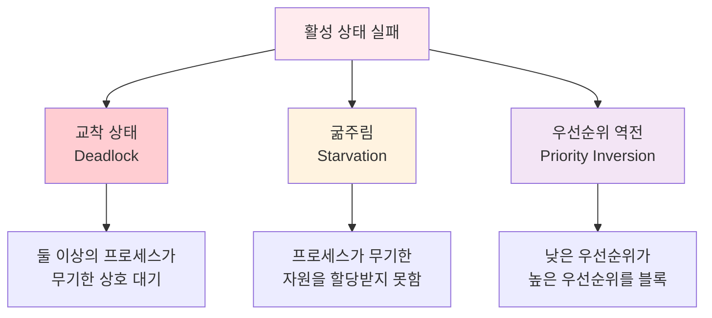

### ⚠️ 교착 상태 예시

```c
semaphore S = 1, Q = 1;

// 프로세스 P0
wait(S);
wait(Q);
// ...
signal(Q);
signal(S);

// 프로세스 P1  
wait(Q);
wait(S);
// ...
signal(S);
signal(Q);
```

**교착 상태 시나리오:**
1. P0가 `wait(S)` 실행 → S = 0
2. P1이 `wait(Q)` 실행 → Q = 0  
3. P0가 `wait(Q)` 실행 → 대기 (Q = 0)
4. P1이 `wait(S)` 실행 → 대기 (S = 0)
5. **교착 상태!** 둘 다 서로를 기다림

---

## 고전적인 동기화 문제

### 🏭 유한 버퍼 문제 (Producer-Consumer Problem)

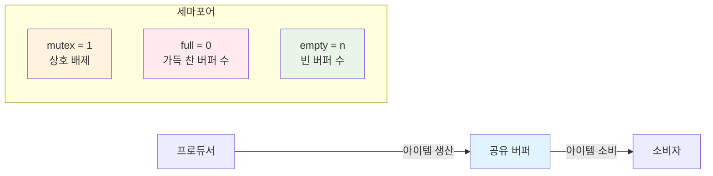

#### 해결책

```c
semaphore mutex = 1;    // 버퍼 접근 제어
semaphore full = 0;     // 가득 찬 버퍼 개수
semaphore empty = n;    // 빈 버퍼 개수

// 프로듀서
void producer() {
    while (true) {
        // 아이템 생산
        produce_item();
        
        wait(&empty);   // 빈 버퍼 대기
        wait(&mutex);   // 버퍼 접근 권한 획득
        
        // 버퍼에 아이템 추가
        add_to_buffer();
        
        signal(&mutex); // 버퍼 접근 권한 해제
        signal(&full);  // 가득 찬 버퍼 수 증가
    }
}

// 소비자
void consumer() {
    while (true) {
        wait(&full);    // 가득 찬 버퍼 대기
        wait(&mutex);   // 버퍼 접근 권한 획득
        
        // 버퍼에서 아이템 제거
        remove_from_buffer();
        
        signal(&mutex); // 버퍼 접근 권한 해제
        signal(&empty); // 빈 버퍼 수 증가
        
        // 아이템 소비
        consume_item();
    }
}
```

### 📚 읽기-쓰기 문제 (Readers-Writers Problem)

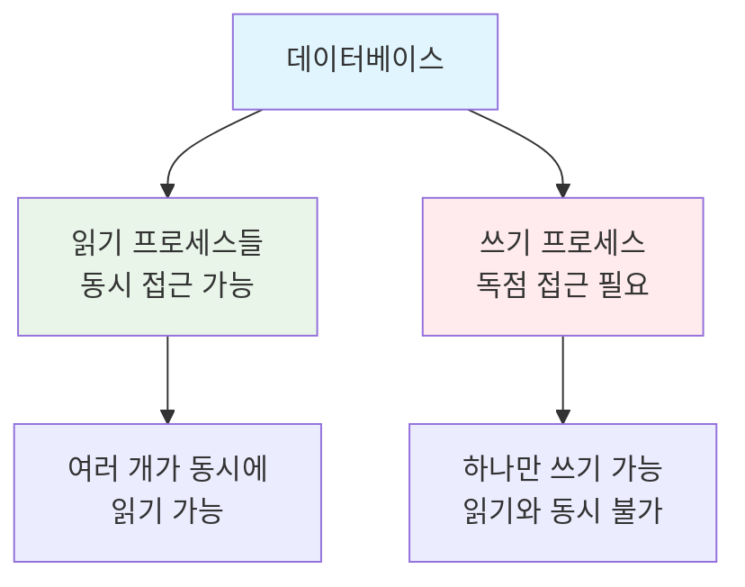

#### 해결책 (First Readers-Writers Problem)

```c
semaphore rw_mutex = 1;  // 읽기/쓰기 상호 배제
semaphore mutex = 1;     // read_count 보호
int read_count = 0;      // 현재 읽기 중인 프로세스 수

// 쓰기 프로세스
void writer() {
    while (true) {
        wait(&rw_mutex);
        
        // 쓰기 수행
        write_data();
        
        signal(&rw_mutex);
    }
}

// 읽기 프로세스
void reader() {
    while (true) {
        wait(&mutex);
        read_count++;
        if (read_count == 1)    // 첫 번째 읽기 프로세스
            wait(&rw_mutex);    // 쓰기 프로세스 차단
        signal(&mutex);
        
        // 읽기 수행
        read_data();
        
        wait(&mutex);
        read_count--;
        if (read_count == 0)    // 마지막 읽기 프로세스
            signal(&rw_mutex);  // 쓰기 프로세스 허용
        signal(&mutex);
    }
}
```

---

## 핵심 개념 정리

### 📝 동기화 도구 비교

| 동기화 도구 | 장점 | 단점 | 적용 분야 |
|------------|------|------|-----------|
| **뮤텍스 락** | • 단순함<br/>• 빠른 응답 | • 바쁜 대기<br/>• CPU 낭비 | 짧은 임계 구역 |
| **세마포어** | • 블로킹 대기<br/>• 카운팅 가능 | • 프로그래밍 오류 가능 | 자원 관리 |
| **모니터** | • 고수준 추상화<br/>• 오류 방지 | • 언어/OS 지원 필요 | 복잡한 동기화 |

### 🔍 선택 기준

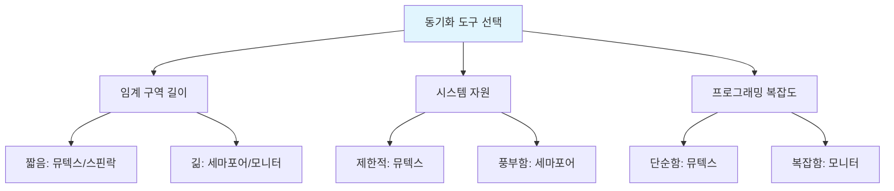

---

## 연습 문제

### 🧩 문제 1: 세마포어 사용

다음 요구사항을 만족하는 세마포어 기반 해결책을 작성하세요:
- 프로세스 A의 구문 X가 프로세스 B의 구문 Y보다 먼저 실행되어야 함
- 프로세스 B의 구문 Y가 프로세스 C의 구문 Z보다 먼저 실행되어야 함

**답안:**
```c
semaphore sync1 = 0;  // A → B 동기화
semaphore sync2 = 0;  // B → C 동기화

// 프로세스 A
void processA() {
    X;                // 구문 X 실행
    signal(&sync1);   // B에게 신호
}

// 프로세스 B  
void processB() {
    wait(&sync1);     // A의 신호 대기
    Y;                // 구문 Y 실행
    signal(&sync2);   // C에게 신호
}

// 프로세스 C
void processC() {
    wait(&sync2);     // B의 신호 대기
    Z;                // 구문 Z 실행
}
```

### 🧩 문제 2: 모니터 설계

최대 3명이 동시에 사용할 수 있는 컴퓨터실을 모니터로 설계하세요.

**답안:**
```c
monitor ComputerLab {
    int available_seats = 3;
    condition waiting;
    
    void enter() {
        if (available_seats == 0)
            waiting.wait();
        available_seats--;
    }
    
    void exit() {
        available_seats++;
        waiting.signal();
    }
}
```

### 🧩 문제 3: 오류 분석

다음 코드의 문제점을 찾고 수정하세요:

```c
semaphore mutex = 1;

void process1() {
    wait(&mutex);
    // 임계 구역
    signal(&mutex);
    signal(&mutex);  // 추가 signal
}

void process2() {
    wait(&mutex);
    // 임계 구역  
    signal(&mutex);
}
```

**문제점:** process1에서 signal을 두 번 호출하여 mutex 값이 2가 될 수 있음. 이로 인해 두 프로세스가 동시에 임계 구역에 진입할 수 있음.

**수정안:**
```c
void process1() {
    wait(&mutex);
    // 임계 구역
    signal(&mutex);  // 한 번만 호출
}
```

---

### 📚 참고 자료

- **운영체제 개념** - Abraham Silberschatz, Peter Baer Galvin, Greg Gagne
- **Modern Operating Systems** - Andrew S. Tanenbaum
- **Operating System Concepts with Java** - Abraham Silberschatz

### 🔗 관련 링크

- [POSIX Threads Programming](https://computing.llnl.gov/tutorials/pthreads/)
- [Java Concurrency Tutorial](https://docs.oracle.com/javase/tutorial/essential/concurrency/)
- [Linux Kernel Synchronization](https://www.kernel.org/doc/Documentation/locking/)

---

*© 2024 Operating Systems Study Guide. 모든 권리 보유.*
