# 제 8장: 교착 상태 (Deadlocks) 🔒

## 📖 목차 (Table of Contents)

1. [개요](#개요)
2. [시스템 모델](#시스템-모델)
3. [교착 상태 특성](#교착-상태-특성)
4. [자원 할당 그래프](#자원-할당-그래프)
5. [교착 상태 처리 방법](#교착-상태-처리-방법)
6. [교착 상태 예방](#교착-상태-예방)
7. [교착 상태 회피](#교착-상태-회피)
8. [교착 상태 탐지](#교착-상태-탐지)
9. [교착 상태로부터의 복구](#교착-상태로부터의-복구)
10. [핵심 개념 정리](#핵심-개념-정리)
11. [연습 문제](#연습-문제)

---

## 개요

**교착 상태(Deadlock)**는 둘 이상의 프로세스가 서로 다른 프로세스가 점유한 자원을 무한정 기다리는 상황입니다. 이는 시스템의 성능을 심각하게 저하시키고 전체 시스템을 마비시킬 수 있는 중요한 문제입니다.

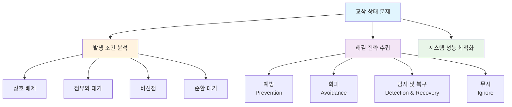

### 🎯 학습 목표

이 장을 통해 다음을 이해할 수 있습니다:
- 교착 상태의 발생 조건과 특성
- 교착 상태 예방, 회피, 탐지 기법
- 은행가 알고리즘의 원리와 적용
- 실제 시스템에서의 교착 상태 해결 방안

---

## 시스템 모델

### 🏗️ 시스템 구성 요소

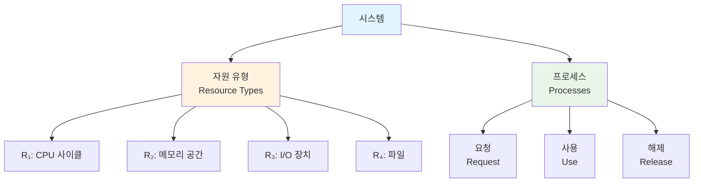

시스템은 다음과 같이 구성됩니다:
- **자원 유형**: R₁, R₂, ..., Rₘ (CPU 사이클, 메모리 공간, I/O 장치 등)
- **각 자원 유형 Rᵢ**: Wᵢ개의 인스턴스 보유
- **프로세스의 자원 사용 패턴**: 요청 → 사용 → 해제

### 🔄 다중 스레드에서의 교착 상태 예시

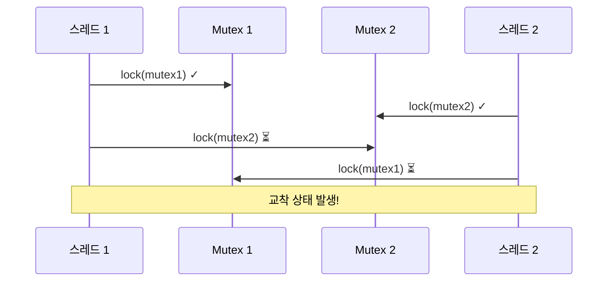

**실제 코드 예시:**
```c
pthread_mutex_t first_mutex = PTHREAD_MUTEX_INITIALIZER;
pthread_mutex_t second_mutex = PTHREAD_MUTEX_INITIALIZER;

// 스레드 1
void* thread1(void* arg) {
    pthread_mutex_lock(&first_mutex);
    sleep(1);  // 다른 스레드가 second_mutex를 잡을 시간 제공
    pthread_mutex_lock(&second_mutex);  // 교착 상태!
    
    // 작업 수행
    
    pthread_mutex_unlock(&second_mutex);
    pthread_mutex_unlock(&first_mutex);
    return NULL;
}

// 스레드 2
void* thread2(void* arg) {
    pthread_mutex_lock(&second_mutex);
    sleep(1);  // 다른 스레드가 first_mutex를 잡을 시간 제공
    pthread_mutex_lock(&first_mutex);   // 교착 상태!
    
    // 작업 수행
    
    pthread_mutex_unlock(&first_mutex);
    pthread_mutex_unlock(&second_mutex);
    return NULL;
}
```

---

## 교착 상태 특성

### 🔍 교착 상태의 네 가지 필수 조건

교착 상태가 발생하려면 다음 네 가지 조건이 **동시에** 만족되어야 합니다:

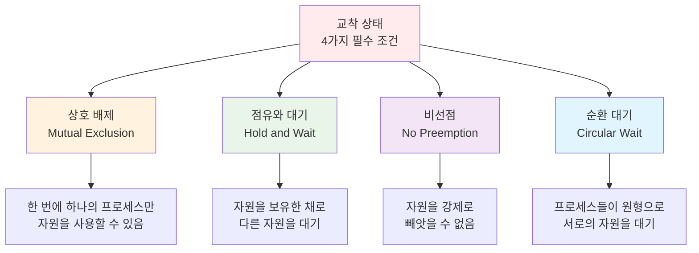

#### 1. 상호 배제 (Mutual Exclusion)
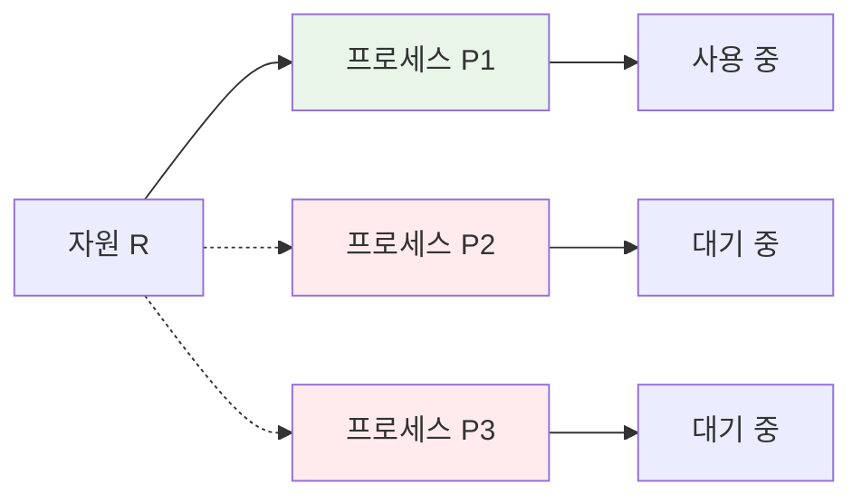

#### 2. 점유와 대기 (Hold and Wait)
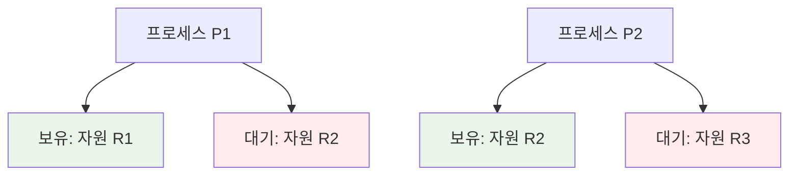

#### 3. 비선점 (No Preemption)
- 자원은 해당 프로세스가 자발적으로 해제할 때까지 강제로 회수할 수 없음
- 프로세스가 작업을 완료한 후에만 자원 해제

#### 4. 순환 대기 (Circular Wait)
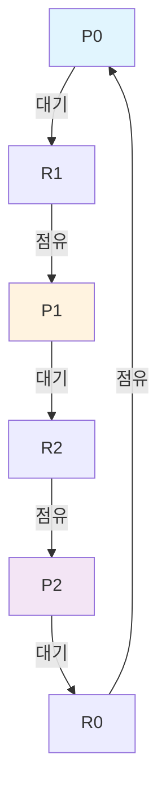

---

## 자원 할당 그래프

### 📊 자원 할당 그래프 구성 요소

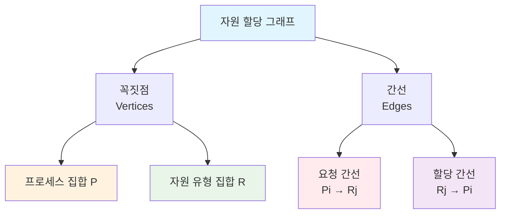

#### 그래프 표기법

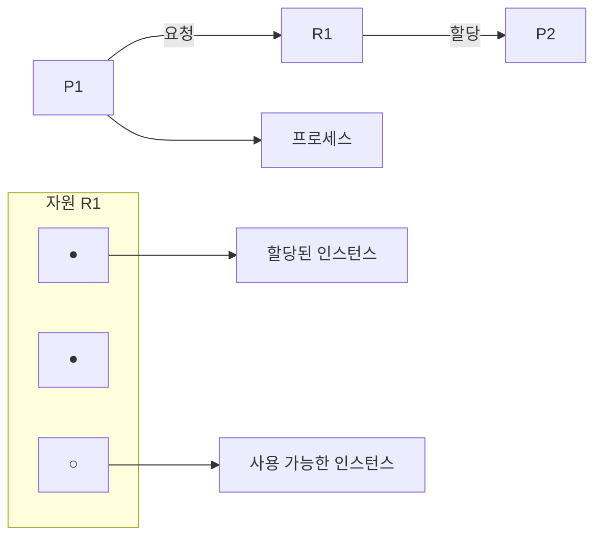

### 🔍 교착 상태 탐지 규칙

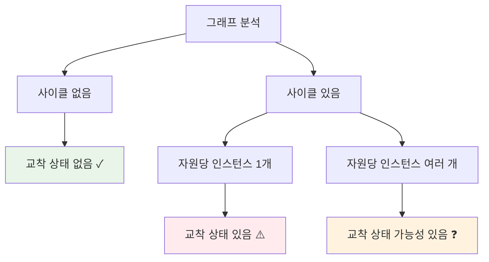

#### 예시 1: 교착 상태가 있는 경우

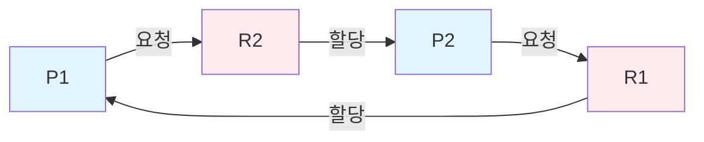

#### 예시 2: 사이클이 있지만 교착 상태가 없는 경우

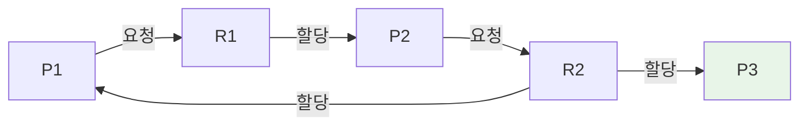

---

## 교착 상태 처리 방법

### 🛠️ 네 가지 접근 방식

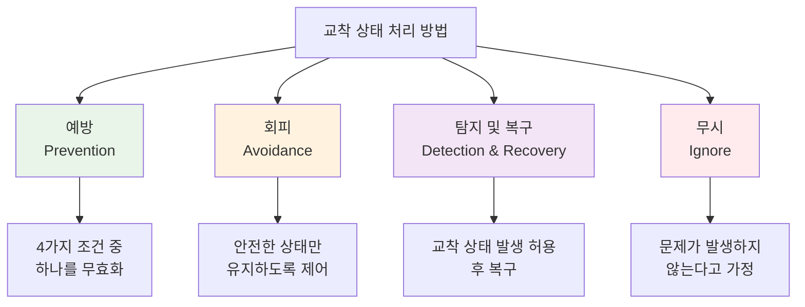

### 📊 방법별 비교

| 방법 | 장점 | 단점 | 적용 환경 |
|------|------|------|-----------|
| **예방** | • 교착 상태 원천 차단<br/>• 단순한 구현 | • 자원 활용률 저하<br/>• 성능 감소 | 제한적 자원 환경 |
| **회피** | • 높은 자원 활용률<br/>• 안전성 보장 | • 복잡한 알고리즘<br/>• 오버헤드 증가 | 자원 요구량 예측 가능 |
| **탐지/복구** | • 평상시 오버헤드 최소<br/>• 유연한 자원 관리 | • 복구 비용<br/>• 일시적 성능 저하 | 교착 상태 빈도 낮음 |
| **무시** | • 구현 비용 최소<br/>• 성능 최적화 | • 시스템 마비 위험<br/>• 예측 불가능 | 교착 상태 극히 드뭄 |

---

## 교착 상태 예방

### 🚫 네 가지 조건 무효화

#### 1. 상호 배제 무효화

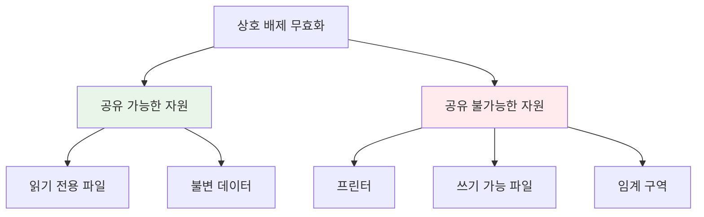

**한계**: 많은 자원이 본질적으로 공유 불가능하므로 현실적으로 어려움

#### 2. 점유와 대기 무효화

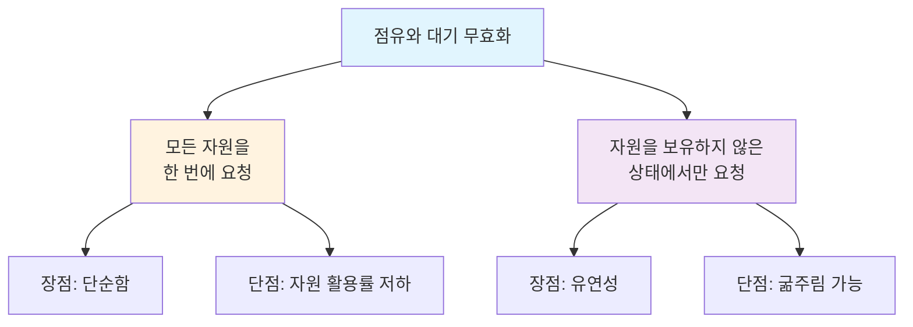

**방법 1**: 프로세스 시작 전 모든 필요 자원 요청
```c
// 의사 코드
request_all_resources();  // 모든 자원 요청
if (all_granted) {
    execute_process();
    release_all_resources();
}
```

**방법 2**: 추가 자원 필요 시 보유 자원 모두 해제 후 재요청
```c
// 의사 코드
if (need_additional_resource()) {
    release_all_current_resources();
    request_all_needed_resources();
}
```

#### 3. 비선점 무효화

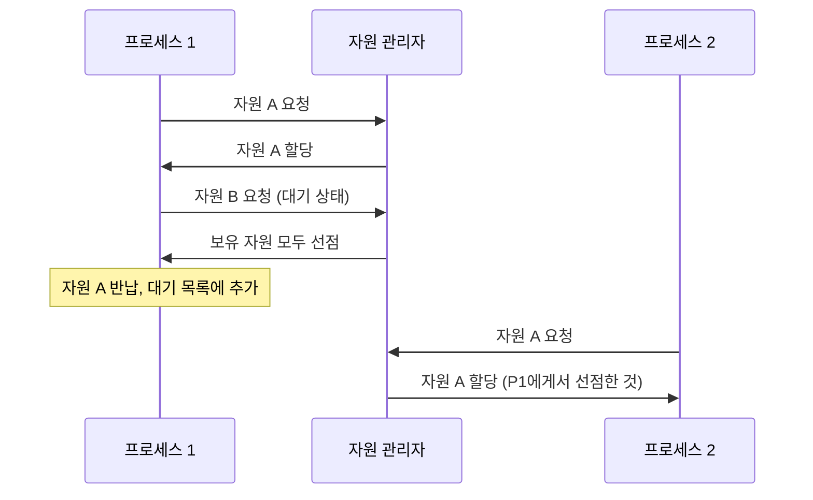

**적용 가능한 자원**:
- CPU (컨텍스트 스위치를 통해)
- 메모리 (스와핑을 통해)

**적용 어려운 자원**:
- 프린터, 테이프 드라이브 등

#### 4. 순환 대기 무효화

```mermaid
graph TD
    A[순환 대기 무효화] --> B[자원에 순서 부여]
    
    B --> C[총 순서 정의<br/>F: R → ℕ]
    C --> D[오름차순 요청 규칙]
    
    D --> E[예시: F(printer) = 1<br/>F(tape) = 2<br/>F(disk) = 3]
    
    style A fill:#e1f5fe
    style B fill:#fff3e0
    style C fill:#e8f5e8
    style D fill:#f3e5f5
```

**구현 예시**:
```c
// 자원 순서 정의
#define MUTEX_A 1
#define MUTEX_B 2
#define MUTEX_C 3

void correct_order() {
    acquire(MUTEX_A);  // 1번 먼저
    acquire(MUTEX_B);  // 2번 다음
    acquire(MUTEX_C);  // 3번 마지막
    
    // 작업 수행
    
    release(MUTEX_C);  // 역순으로 해제
    release(MUTEX_B);
    release(MUTEX_A);
}

void incorrect_order() {
    // 이런 순서는 금지!
    acquire(MUTEX_C);  // ❌ 높은 번호 먼저
    acquire(MUTEX_A);  // ❌ 낮은 번호 나중에
}
```

---

## 교착 상태 회피

### 🛡️ 안전 상태 개념

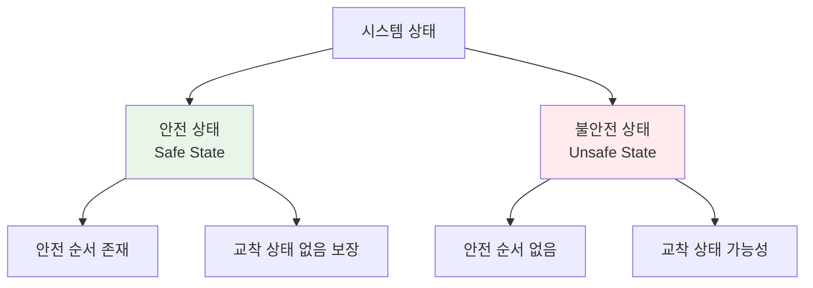

**안전 상태**: 모든 프로세스가 완료될 수 있는 실행 순서가 존재하는 상태

#### 안전 순서 (Safe Sequence)

프로세스 순서 <P₁, P₂, ..., Pₙ>이 안전하려면:
- 각 Pᵢ에 대해, Pᵢ가 여전히 요청할 수 있는 자원 ≤ 현재 사용 가능한 자원 + 모든 Pⱼ (j < i)가 보유한 자원

### 🏦 은행가 알고리즘 (Banker's Algorithm)

```mermaid
graph TD
    A[은행가 알고리즘] --> B[데이터 구조]
    A --> C[안전성 알고리즘]
    A --> D[자원 요청 알고리즘]
    
    B --> B1[Available[m]]
    B --> B2[Max[n×m]]
    B --> B3[Allocation[n×m]]
    B --> B4[Need[n×m]]
    
    style A fill:#e1f5fe
    style B fill:#fff3e0
    style C fill:#e8f5e8
    style D fill:#f3e5f5
```

#### 데이터 구조
- **n**: 프로세스 수
- **m**: 자원 유형 수
- **Available[j]**: 자원 유형 j의 사용 가능한 인스턴스 수
- **Max[i,j]**: 프로세스 i가 자원 유형 j를 최대 몇 개까지 요청할 수 있는지
- **Allocation[i,j]**: 프로세스 i에게 현재 할당된 자원 유형 j의 인스턴스 수  
- **Need[i,j]**: 프로세스 i가 완료를 위해 추가로 필요한 자원 유형 j의 인스턴스 수

**관계식**: Need[i,j] = Max[i,j] - Allocation[i,j]

#### 안전성 알고리즘

```python
def safety_algorithm():
    # 1. 초기화
    Work = Available.copy()
    Finish = [False] * n
    
    # 2. 안전 순서 찾기
    safe_sequence = []
    
    while len(safe_sequence) < n:
        found = False
        
        for i in range(n):
            if not Finish[i] and Need[i] <= Work:
                # 3. 프로세스 i 완료 시뮬레이션
                Work += Allocation[i]
                Finish[i] = True
                safe_sequence.append(i)
                found = True
                break
        
        if not found:
            return False, []  # 불안전 상태
    
    return True, safe_sequence  # 안전 상태
```

#### 실제 예시

**초기 상태**:
```
프로세스 | Max  | Allocation | Need | Available
        | A B C | A B C      | A B C | A B C
--------|------|------------|------|-------
   T0   | 7 5 3 | 0 1 0     | 7 4 3 | 3 3 2
   T1   | 3 2 2 | 2 0 0     | 1 2 2 |
   T2   | 9 0 2 | 3 0 2     | 6 0 0 |
   T3   | 2 2 2 | 2 1 1     | 0 1 1 |
   T4   | 4 3 3 | 0 0 2     | 4 3 1 |
```

**안전성 검사**:
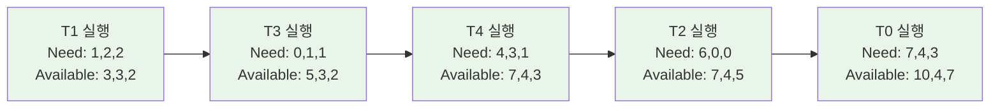

**안전 순서**: <T1, T3, T4, T2, T0>

---

## 교착 상태 탐지

### 🔍 단일 인스턴스 자원

#### 대기 그래프 (Wait-for Graph)

```mermaid
graph TD
    A[자원 할당 그래프] --> B[대기 그래프]
    
    subgraph "자원 할당 그래프"
        P1 --> R1
        R2 --> P1
        P2 --> R2
        R1 --> P2
    end
    
    subgraph "대기 그래프"
        P1_w --> P2_w
        P2_w --> P1_w
    end
    
    B --> C[사이클 탐지<br/>O(n²)]
    
    style C fill:#ffebee
```

- **노드**: 프로세스만 포함
- **간선**: Ti → Tj (Ti가 Tj를 대기)
- **교착 상태**: 사이클 존재 시

### 📊 다중 인스턴스 자원

#### 탐지 알고리즘

```python
def detection_algorithm():
    # 1. 초기화
    Work = Available.copy()
    Finish = [False] * n
    
    # 자원을 할당받지 않은 프로세스는 완료로 표시
    for i in range(n):
        if all(Allocation[i][j] == 0 for j in range(m)):
            Finish[i] = True
    
    # 2. 완료 가능한 프로세스 찾기
    while True:
        found = False
        
        for i in range(n):
            if not Finish[i] and Request[i] <= Work:
                # 프로세스 i 완료
                Work += Allocation[i]
                Finish[i] = True
                found = True
        
        if not found:
            break
    
    # 3. 교착 상태 검사
    deadlocked = [i for i in range(n) if not Finish[i]]
    return len(deadlocked) > 0, deadlocked
```

#### 탐지 빈도 결정

```mermaid
graph TD
    A[탐지 알고리즘 호출 시점] --> B[자원 요청 시마다]
    A --> C[주기적으로]
    A --> D[CPU 사용률 기반]
    
    B --> B1[장점: 즉시 탐지]
    B --> B2[단점: 높은 오버헤드]
    
    C --> C1[장점: 예측 가능한 오버헤드]
    C --> C2[단점: 탐지 지연]
    
    D --> D1[장점: 적응적]
    D --> D2[단점: 복잡한 구현]
    
    style B1 fill:#e8f5e8
    style C1 fill:#fff3e0
    style D1 fill:#f3e5f5
```

---

## 교착 상태로부터의 복구

### 🔧 복구 방법

```mermaid
graph TD
    A[복구 방법] --> B[프로세스 종료<br/>Process Termination]
    A --> C[자원 선점<br/>Resource Preemption]
    
    B --> B1[모든 교착 프로세스 종료]
    B --> B2[한 번에 하나씩 종료]
    
    C --> C1[희생자 선택<br/>Victim Selection]
    C --> C2[롤백<br/>Rollback]
    C --> C3[굶주림 방지<br/>Starvation Prevention]
    
    style A fill:#e1f5fe
    style B fill:#fff3e0
    style C fill:#f3e5f5
```

#### 프로세스 종료

##### 종료 우선순위 기준
1. **프로세스 우선순위**
2. **실행 시간 vs 남은 시간**
3. **사용한 자원 vs 필요한 자원**
4. **종료해야 할 프로세스 수**
5. **대화형 vs 배치 처리**

```python
def select_victim_process(deadlocked_processes):
    min_cost = float('inf')
    victim = None
    
    for process in deadlocked_processes:
        cost = calculate_termination_cost(process)
        if cost < min_cost:
            min_cost = cost
            victim = process
    
    return victim

def calculate_termination_cost(process):
    # 비용 계산 요소들
    priority_cost = (MAX_PRIORITY - process.priority) * 10
    time_cost = process.execution_time
    resource_cost = sum(process.allocated_resources)
    
    return priority_cost + time_cost + resource_cost
```

#### 자원 선점

```mermaid
sequenceDiagram
    participant OS as 운영체제
    participant V as 희생자 프로세스
    participant R as 자원
    participant W as 대기 프로세스
    
    OS->>V: 자원 선점 요청
    V->>R: 자원 해제 (강제)
    R->>W: 자원 할당
    OS->>V: 안전 상태로 롤백
    Note over V: 체크포인트에서 재시작
```

##### 롤백 전략
1. **전체 롤백**: 프로세스를 처음부터 재시작
2. **부분 롤백**: 교착 상태가 해결될 만큼만 롤백

##### 굶주림 방지
```c
typedef struct {
    int process_id;
    int preemption_count;
    time_t last_preemption;
} PreemptionHistory;

bool should_preempt(PreemptionHistory* history) {
    const int MAX_PREEMPTIONS = 3;
    const time_t MIN_INTERVAL = 60; // 초
    
    if (history->preemption_count >= MAX_PREEMPTIONS) {
        time_t current_time = time(NULL);
        if (current_time - history->last_preemption < MIN_INTERVAL) {
            return false; // 굶주림 방지
        }
        history->preemption_count = 0; // 카운터 리셋
    }
    
    return true;
}
```

---

## 핵심 개념 정리

### 📊 교착 상태 해결 방법 비교

```mermaid
graph TD
    A[교착 상태 해결 방법] --> B[예방<br/>Prevention]
    A --> C[회피<br/>Avoidance]  
    A --> D[탐지/복구<br/>Detection/Recovery]
    A --> E[무시<br/>Ignore]
    
    B --> B1["💰 비용: 높음<br/>🛡️ 안전성: 최고<br/>⚡ 성능: 낮음"]
    C --> C1["💰 비용: 중간<br/>🛡️ 안전성: 높음<br/>⚡ 성능: 중간"]
    D --> D1["💰 비용: 낮음-중간<br/>🛡️ 안전성: 중간<br/>⚡ 성능: 높음"]
    E --> E1["💰 비용: 최저<br/>🛡️ 안전성: 없음<br/>⚡ 성능: 최고"]
    
    style B1 fill:#ffebee
    style C1 fill:#fff3e0
    style D1 fill:#e8f5e8
    style E1 fill:#e1f5fe
```

### 🎯 실제 시스템에서의 선택

```mermaid
pie title 실제 시스템에서 사용되는 방법
    "무시" : 70
    "탐지/복구" : 20
    "회피" : 8
    "예방" : 2
```

**대부분의 현대 운영체제는 "무시" 방법을 사용**:
- Windows, Linux, macOS 등
- 교착 상태 발생 빈도가 매우 낮음
- 성능 오버헤드를 최소화하는 것이 우선

### 🔍 교착 상태 vs 기타 문제

| 문제 유형 | 특징 | 해결 방법 |
|-----------|------|-----------|
| **교착 상태** | 영구적 대기 | 예방/회피/탐지/복구 |
| **굶주림** | 무기한 연기 | 우선순위 조정, 에이징 |
| **라이브락** | 계속 시도하지만 실패 | 백오프 알고리즘 |
| **우선순위 역전** | 높은 우선순위가 블록됨 | 우선순위 상속 |

---

## 연습 문제

### 🧩 문제 1: 교착 상태 조건 분석

다음 상황에서 교착 상태의 네 가지 조건이 만족되는지 분석하세요:

**상황**: 두 개의 프린터 P1, P2와 두 개의 프로세스 A, B가 있습니다.
- 프로세스 A: P1을 사용 중이며 P2를 요청
- 프로세스 B: P2를 사용 중이며 P1을 요청

**답안**:
1. ✅ **상호 배제**: 프린터는 한 번에 하나의 프로세스만 사용 가능
2. ✅ **점유와 대기**: A는 P1을 보유하고 P2를 대기, B는 P2를 보유하고 P1을 대기
3. ✅ **비선점**: 프린터는 강제로 빼앗을 수 없음
4. ✅ **순환 대기**: A → P2 → B → P1 → A

**결론**: 네 조건이 모두 만족되므로 교착 상태 발생

### 🧩 문제 2: 은행가 알고리즘

다음 시스템에서 요청 Request[1] = (1,0,2)가 허용될 수 있는지 은행가 알고리즘으로 판단하세요:

```
프로세스 | Max  | Allocation | Need | Available
        | A B C | A B C      | A B C | A B C
--------|------|------------|------|-------
   T0   | 7 5 3 | 0 1 0     | 7 4 3 | 3 3 2
   T1   | 3 2 2 | 2 0 0     | 1 2 2 |
   T2   | 9 0 2 | 3 0 2     | 6 0 0 |
   T3   | 2 2 2 | 2 1 1     | 0 1 1 |
   T4   | 4 3 3 | 0 0 2     | 4 3 1 |
```

**답안**:

1. **요청 검증**:
   - Request[1] = (1,0,2) ≤ Need[1] = (1,2,2) ✅
   - Request[1] = (1,0,2) ≤ Available = (3,3,2) ✅

2. **가상 할당**:
   ```
   Available = (3,3,2) - (1,0,2) = (2,3,0)
   Allocation[1] = (2,0,0) + (1,0,2) = (3,0,2)
   Need[1] = (1,2,2) - (1,0,2) = (0,2,0)
   ```

3. **안전성 검사**:
   - T1: Need(0,2,0) ≤ Available(2,3,0) ✅ → Work = (5,3,2)
   - T3: Need(0,1,1) ≤ Available(5,3,2) ✅ → Work = (7,4,3)
   - T4: Need(4,3,1) ≤ Available(7,4,3) ✅ → Work = (7,4,5)
   - T2: Need(6,0,0) ≤ Available(7,4,5) ✅ → Work = (10,4,7)
   - T0: Need(7,4,3) ≤ Available(10,4,7) ✅

**안전 순서**: <T1, T3, T4, T2, T0>  
**결론**: 요청 허용 가능 ✅

### 🧩 문제 3: 교착 상태 예방

다음 코드에서 순환 대기 조건을 제거하여 교착 상태를 예방하세요:

```c
pthread_mutex_t mutex_A, mutex_B, mutex_C;

void thread1() {
    pthread_mutex_lock(&mutex_A);
    pthread_mutex_lock(&mutex_C);
    // 작업 수행
    pthread_mutex_unlock(&mutex_C);
    pthread_mutex_unlock(&mutex_A);
}

void thread2() {
    pthread_mutex_lock(&mutex_B);
    pthread_mutex_lock(&mutex_A);
    // 작업 수행
    pthread_mutex_unlock(&mutex_A);
    pthread_mutex_unlock(&mutex_B);
}

void thread3() {
    pthread_mutex_lock(&mutex_C);
    pthread_mutex_lock(&mutex_B);
    // 작업 수행
    pthread_mutex_unlock(&mutex_B);
    pthread_mutex_unlock(&mutex_C);
}
```

**답안**:
```c
// 뮤텍스에 순서 부여: A < B < C
pthread_mutex_t mutex_A, mutex_B, mutex_C;

void thread1() {
    pthread_mutex_lock(&mutex_A);  // 낮은 순서 먼저
    pthread_mutex_lock(&mutex_C);
    // 작업 수행
    pthread_mutex_unlock(&mutex_C);  // 높은 순서 먼저 해제
    pthread_mutex_unlock(&mutex_A);
}

void thread2() {
    pthread_mutex_lock(&mutex_A);  // 순서 준수
    pthread_mutex_lock(&mutex_B);
    // 작업 수행
    pthread_mutex_unlock(&mutex_B);
    pthread_mutex_unlock(&mutex_A);
}

void thread3() {
    pthread_mutex_lock(&mutex_B);  // 순서 준수
    pthread_mutex_lock(&mutex_C);
    // 작업 수행
    pthread_mutex_unlock(&mutex_C);
    pthread_mutex_unlock(&mutex_B);
}
```

---

### 📚 참고 자료

- **Operating System Concepts** - Silberschatz, Galvin, Gagne
- **Modern Operating Systems** - Andrew S. Tanenbaum
- **Operating Systems: Internals and Design Principles** - William Stallings

### 🔗 관련 링크

- [Linux Kernel Lock Dependencies](https://www.kernel.org/doc/Documentation/locking/lockdep-design.txt)
- [Java Deadlock Detection](https://docs.oracle.com/javase/tutorial/essential/concurrency/deadlock.html)
- [Database Deadlock Prevention](https://dev.mysql.com/doc/refman/8.0/en/innodb-deadlocks.html)

---

*© 2024 Operating Systems Study Guide. 모든 권리 보유.*
