# 제 9장: 주 메모리 (Main Memory) 💾

## 📖 목차 (Table of Contents)

1. [개요](#개요)
2. [배경](#배경)
3. [주소 바인딩](#주소-바인딩)
4. [논리 주소와 물리 주소](#논리-주소와-물리-주소)
5. [동적 로딩과 연결](#동적-로딩과-연결)
6. [연속 메모리 할당](#연속-메모리-할당)
7. [페이징](#페이징)
8. [페이지 테이블 구조](#페이지-테이블-구조)
9. [스와핑](#스와핑)
10. [핵심 개념 정리](#핵심-개념-정리)
11. [연습 문제](#연습-문제)

---

## 개요

**주 메모리 관리**는 운영체제의 핵심 기능 중 하나로, 한정된 메모리 자원을 효율적으로 관리하고 프로세스들 간의 메모리 보호를 제공합니다.

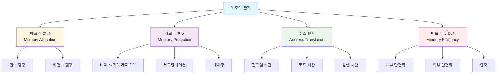

### 🎯 학습 목표

이 장을 통해 다음을 이해할 수 있습니다:
- 메모리 관리의 기본 개념과 필요성
- 주소 바인딩과 주소 변환 메커니즘
- 연속 할당과 페이징 기법
- 메모리 보호와 공유 메커니즘

---

## 배경

### 🏗️ 메모리 계층 구조

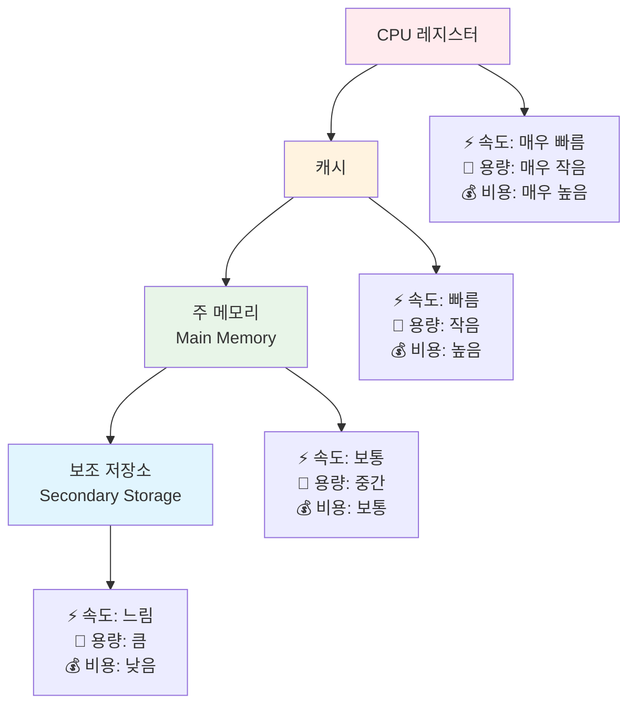

### 🔐 메모리 보호 (Memory Protection)

메모리 보호는 프로세스가 자신의 주소 공간 내에서만 접근할 수 있도록 보장합니다.

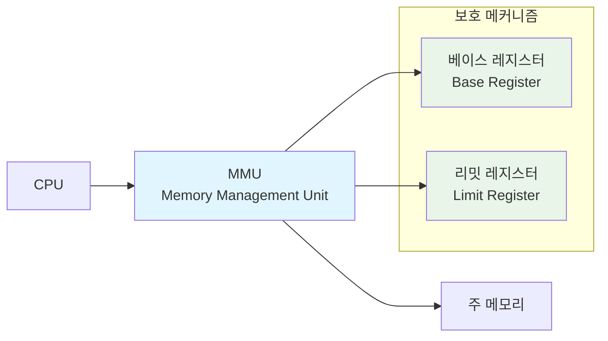

#### 하드웨어 주소 보호

```c
// 의사 코드: 하드웨어 주소 검사
void check_memory_access(int logical_address) {
    if (logical_address >= 0 && logical_address < limit_register) {
        int physical_address = base_register + logical_address;
        // 메모리 접근 허용
        access_memory(physical_address);
    } else {
        // 보호 위반 - 트랩 발생
        generate_protection_fault();
    }
}
```

**예시**:
- 베이스 레지스터: 300040
- 리밋 레지스터: 120900
- 유효한 논리 주소 범위: 0 ~ 120899
- 물리 주소 범위: 300040 ~ 420939

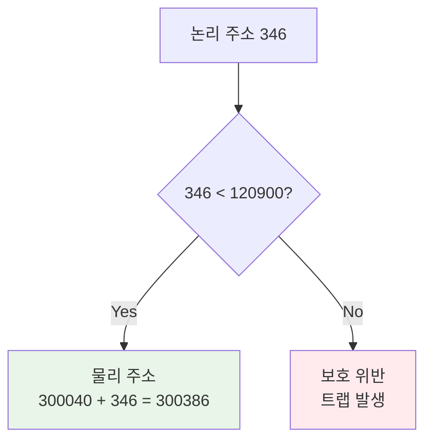

---

## 주소 바인딩

### 🔄 주소 바인딩 단계

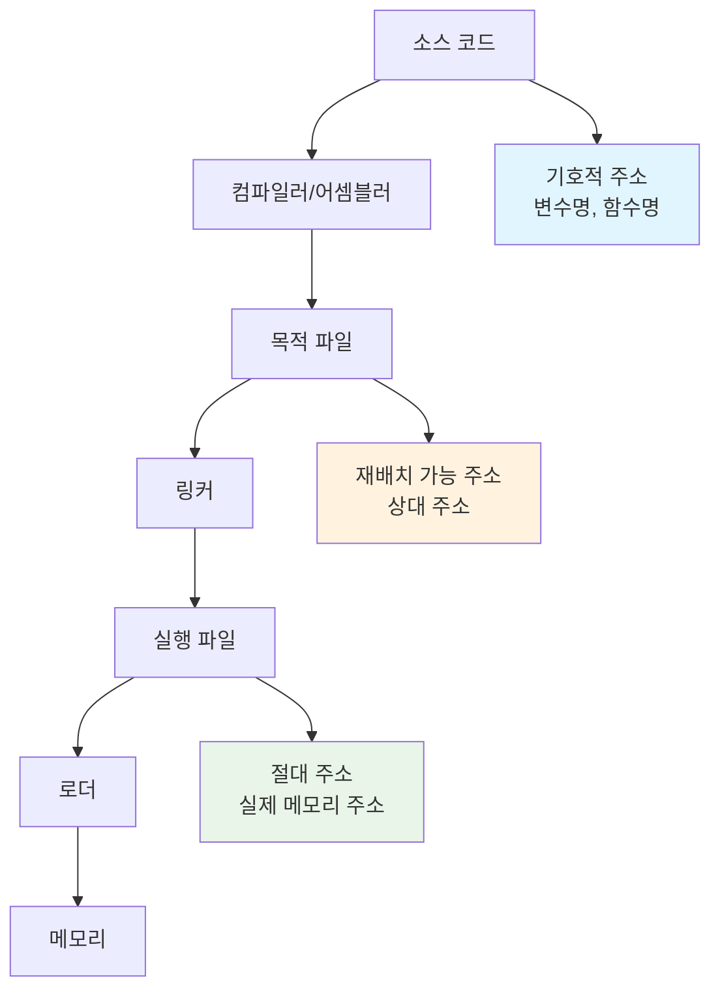

### ⏰ 바인딩 시점

#### 1. 컴파일 시간 바인딩 (Compile-time Binding)

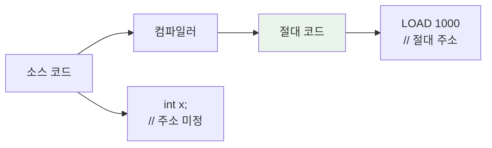

**특징**:
- 메모리 위치가 컴파일 시점에 확정
- 시작 위치 변경 시 재컴파일 필요
- 임베디드 시스템에서 주로 사용

#### 2. 로드 시간 바인딩 (Load-time Binding)

```c
// 재배치 가능 코드 예시
LOAD R1, [BASE + 100]  // BASE는 로드 시점에 결정
STORE [BASE + 200], R1
```

**특징**:
- 프로그램이 메모리에 로드될 때 주소 결정
- 실행 중 메모리 위치 이동 불가
- 대부분의 실행 파일 형태

#### 3. 실행 시간 바인딩 (Execution-time Binding)

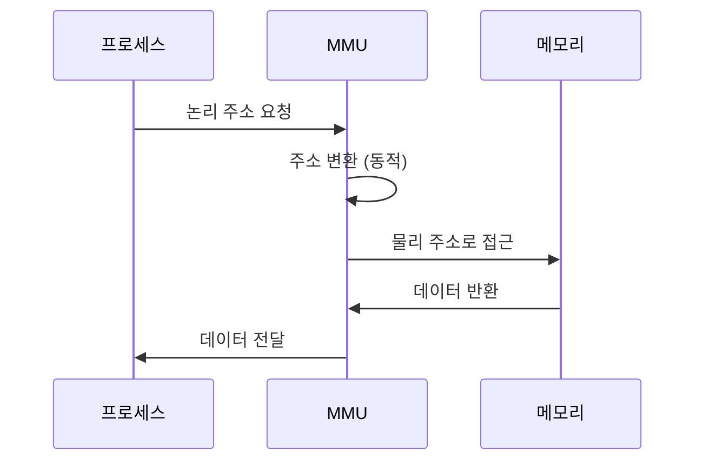

**특징**:
- 실행 중 동적 주소 변환
- 프로세스 재배치 가능
- MMU 하드웨어 지원 필요

---

## 논리 주소와 물리 주소

### 🔍 주소 공간의 개념

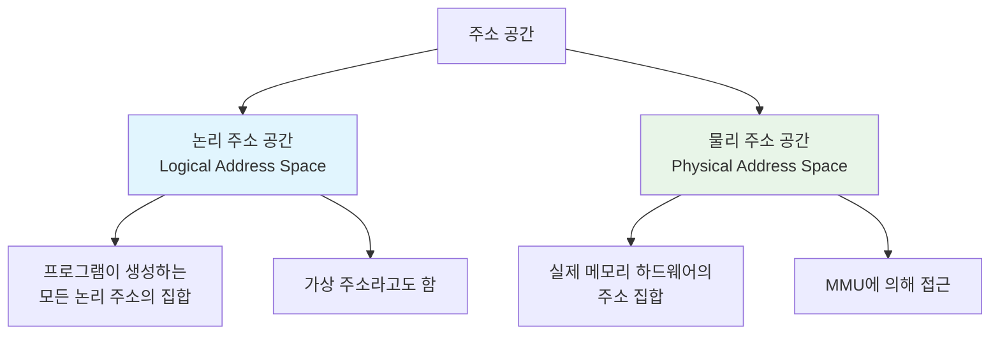

### 🔧 메모리 관리 장치 (MMU)

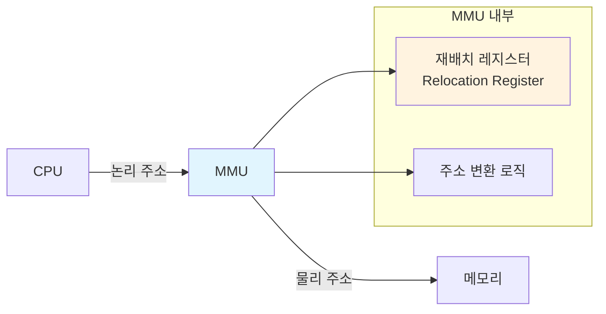

#### 단순 MMU 스키마

```c
// MMU의 주소 변환 과정
int translate_address(int logical_address) {
    // 경계 검사
    if (logical_address >= limit_register) {
        generate_segmentation_fault();
        return -1;
    }
    
    // 물리 주소 계산
    int physical_address = relocation_register + logical_address;
    return physical_address;
}
```

**예시**:
- 재배치 레지스터: 14000
- 논리 주소: 346
- 물리 주소: 14000 + 346 = 14346

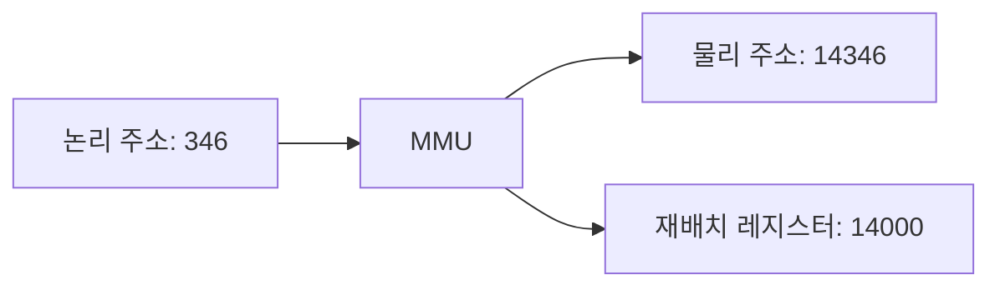

---

## 동적 로딩과 연결

### 📥 동적 로딩 (Dynamic Loading)

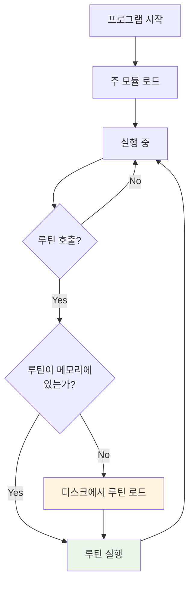

**장점**:
- 메모리 공간 효율적 활용
- 사용되지 않는 루틴은 로드되지 않음
- 큰 프로그램에 적합

**구현 예시**:
```c
// 동적 로딩 의사 코드
void call_routine(char* routine_name) {
    if (!is_loaded(routine_name)) {
        void* routine = load_from_disk(routine_name);
        register_routine(routine_name, routine);
    }
    execute_routine(routine_name);
}
```

### 🔗 동적 연결 (Dynamic Linking)

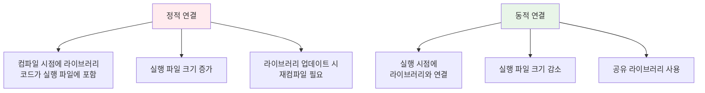

#### 스텁 (Stub) 메커니즘

```c
// 스텁 의사 코드
void printf_stub() {
    static bool loaded = false;
    static void (*real_printf)() = NULL;
    
    if (!loaded) {
        // 실제 printf 함수 위치 찾기
        real_printf = locate_library_routine("printf");
        loaded = true;
        
        // 스텁을 실제 함수 주소로 교체
        replace_stub_with_address(real_printf);
    }
    
    // 실제 함수 호출
    real_printf();
}
```

**공유 라이브러리 장점**:
- 메모리 절약 (여러 프로세스가 공유)
- 라이브러리 업데이트 용이
- 시스템 패치 적용 효율성

---

## 연속 메모리 할당

### 🏠 메모리 분할

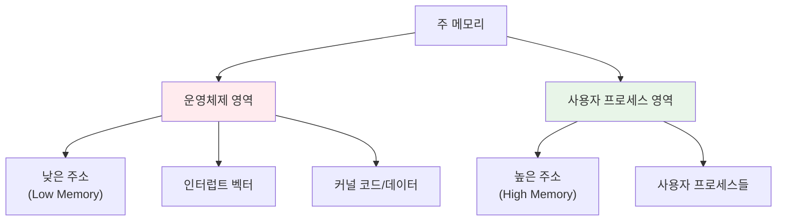

### 🔄 가변 분할 (Variable Partition)

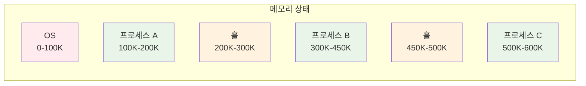

#### 동적 저장소 할당 알고리즘

##### 1. First Fit (최초 적합)

```c
void* first_fit(size_t size) {
    for (hole_t* hole = hole_list; hole != NULL; hole = hole->next) {
        if (hole->size >= size) {
            return allocate_from_hole(hole, size);
        }
    }
    return NULL; // 할당 실패
}
```

##### 2. Best Fit (최적 적합)

```c
void* best_fit(size_t size) {
    hole_t* best_hole = NULL;
    size_t min_waste = SIZE_MAX;
    
    for (hole_t* hole = hole_list; hole != NULL; hole = hole->next) {
        if (hole->size >= size) {
            size_t waste = hole->size - size;
            if (waste < min_waste) {
                min_waste = waste;
                best_hole = hole;
            }
        }
    }
    
    return best_hole ? allocate_from_hole(best_hole, size) : NULL;
}
```

##### 3. Worst Fit (최악 적합)

```c
void* worst_fit(size_t size) {
    hole_t* worst_hole = NULL;
    size_t max_size = 0;
    
    for (hole_t* hole = hole_list; hole != NULL; hole = hole->next) {
        if (hole->size >= size && hole->size > max_size) {
            max_size = hole->size;
            worst_hole = hole;
        }
    }
    
    return worst_hole ? allocate_from_hole(worst_hole, size) : NULL;
}
```

### 📊 알고리즘 비교

| 알고리즘 | 속도 | 메모리 활용도 | 외부 단편화 |
|----------|------|---------------|-------------|
| **First Fit** | 🟢 빠름 | 🟡 보통 | 🟡 보통 |
| **Best Fit** | 🟡 느림 | 🟢 좋음 | 🟢 적음 |
| **Worst Fit** | 🟡 느림 | 🔴 나쁨 | 🔴 많음 |

### 🧩 단편화 (Fragmentation)

#### 외부 단편화 (External Fragmentation)

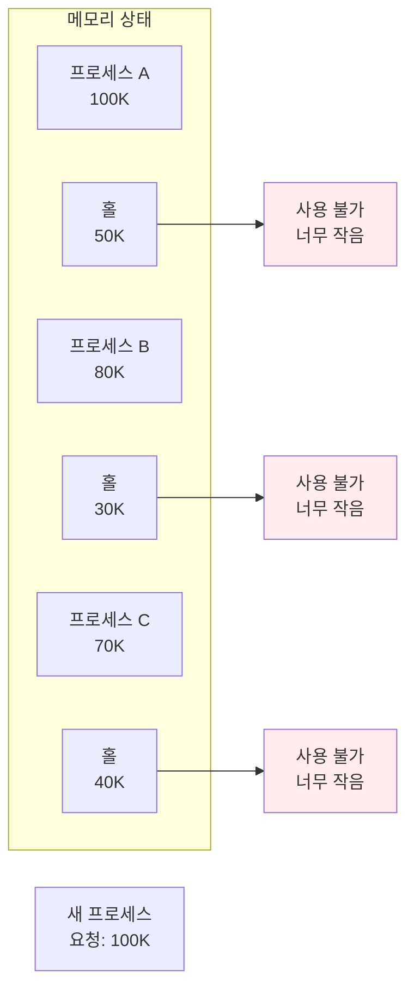

**50% 규칙**: First Fit을 사용할 때, N개의 블록이 할당되면 약 0.5N개의 블록이 단편화로 손실

#### 내부 단편화 (Internal Fragmentation)

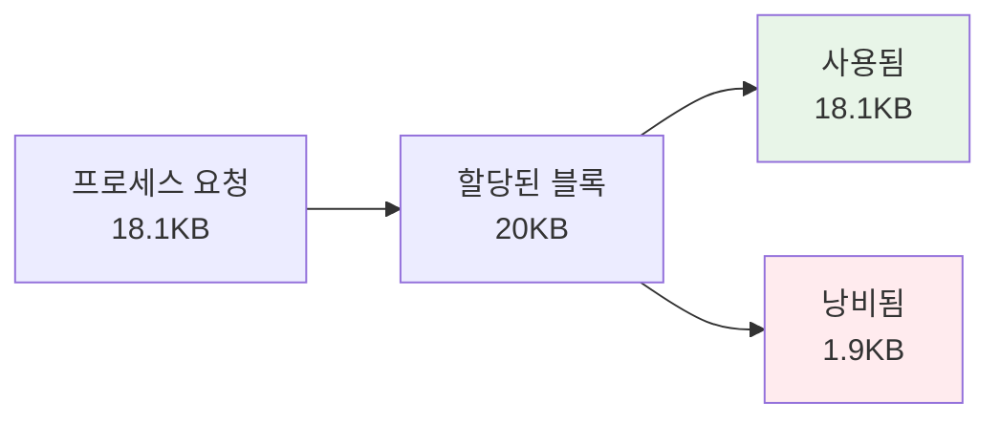

#### 압축 (Compaction)

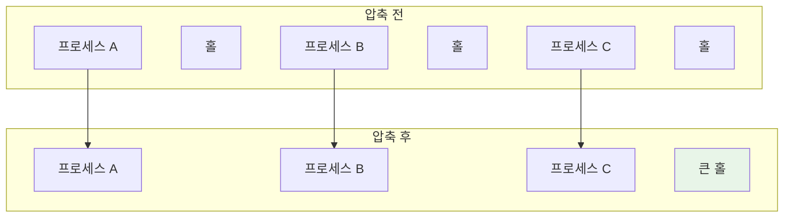

**압축의 문제점**:
- 높은 CPU 오버헤드
- I/O 작업 중인 프로세스 처리 복잡
- 실행 시간 바인딩에서만 가능

---

## 페이징

### 📄 페이징 개념

**페이징**은 외부 단편화 문제를 해결하기 위해 물리 메모리를 고정 크기 블록으로 나누는 기법입니다.

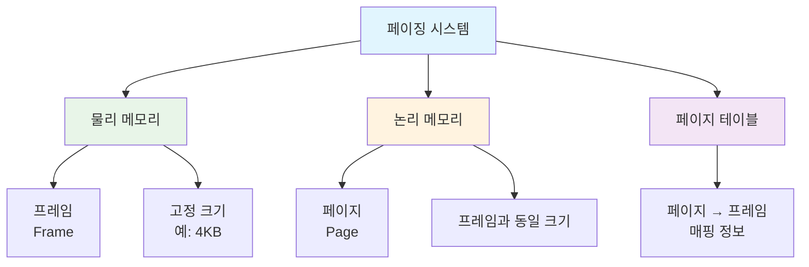

### 🔢 주소 변환 스키마

#### 논리 주소 구조

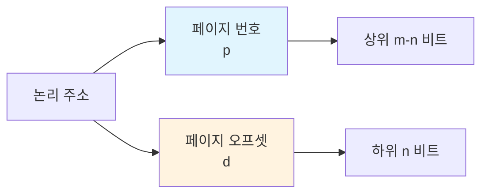

**주소 크기 관계**:
- 논리 주소 공간: 2^m
- 페이지 크기: 2^n
- 페이지 번호: m-n 비트
- 페이지 오프셋: n 비트

#### 주소 변환 과정

```c
// 페이징 주소 변환 알고리즘
struct page_table_entry {
    int frame_number;
    bool valid;
    bool dirty;
    bool referenced;
};

int translate_address(int logical_address, int page_size) {
    // 페이지 번호와 오프셋 추출
    int page_number = logical_address / page_size;
    int page_offset = logical_address % page_size;
    
    // 페이지 테이블 접근
    if (!page_table[page_number].valid) {
        generate_page_fault();
        return -1;
    }
    
    // 물리 주소 계산
    int frame_number = page_table[page_number].frame_number;
    int physical_address = frame_number * page_size + page_offset;
    
    return physical_address;
}
```

### 📊 페이징 예시

**시스템 설정**:
- 물리 메모리: 32 바이트 (8 프레임)
- 페이지 크기: 4 바이트
- 논리 주소: 4 비트 (16 가능한 주소)

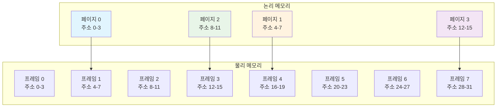

**페이지 테이블**:
| 페이지 | 프레임 |
|--------|---------|
| 0      | 1       |
| 1      | 4       |
| 2      | 3       |
| 3      | 7       |

**주소 변환 예시**:
- 논리 주소 5 → 페이지 1, 오프셋 1 → 프레임 4 → 물리 주소 17

### 🧮 내부 단편화 계산

```c
// 내부 단편화 계산
void calculate_internal_fragmentation() {
    int page_size = 2048;      // 2KB
    int process_size = 72766;  // 바이트
    
    int pages_needed = (process_size + page_size - 1) / page_size;  // 올림
    int allocated_memory = pages_needed * page_size;
    int internal_fragmentation = allocated_memory - process_size;
    
    printf("필요한 페이지 수: %d\n", pages_needed);           // 36
    printf("할당된 메모리: %d 바이트\n", allocated_memory);    // 73728
    printf("내부 단편화: %d 바이트\n", internal_fragmentation); // 962
}
```

**평균 내부 단편화**: 페이지 크기의 1/2

### 🚀 페이지 테이블 구현

#### TLB (Translation Lookaside Buffer)

```mermaid
graph TD
    A[CPU] --> B[TLB 검색]
    B --> C{TLB 히트?}
    C -->|Yes| D[물리 주소 바로 계산]
    C -->|No| E[페이지 테이블 접근]
    E --> F[TLB 업데이트]
    F --> D
    D --> G[메모리 접근]
    
    style C fill:#e1f5fe
    style D fill:#e8f5e8
    style E fill:#fff3e0
```

#### 유효 접근 시간 (EAT) 계산

```c
// 유효 접근 시간 계산
float calculate_effective_access_time(float hit_ratio, 
                                    float tlb_access_time,
                                    float memory_access_time) {
    float hit_time = tlb_access_time + memory_access_time;
    float miss_time = tlb_access_time + 2 * memory_access_time; // 페이지 테이블 + 데이터
    
    float eat = hit_ratio * hit_time + (1 - hit_ratio) * miss_time;
    return eat;
}

// 예시 계산
// 히트율 80%, TLB 접근 0ns, 메모리 접근 10ns
float eat_80 = calculate_effective_access_time(0.8, 0, 10);  // 12ns

// 히트율 99%, TLB 접근 0ns, 메모리 접근 10ns  
float eat_99 = calculate_effective_access_time(0.99, 0, 10); // 10.1ns
```

### 🛡️ 메모리 보호

```mermaid
graph TD
    A[페이지 테이블 항목] --> B[프레임 번호]
    A --> C[유효-무효 비트]
    A --> D[보호 비트]
    
    C --> C1[Valid: 유효한 페이지]
    C --> C2[Invalid: 무효한 페이지]
    
    D --> D1[Read-only]
    D --> D2[Read-write]
    D --> D3[Execute-only]
    
    style C1 fill:#e8f5e8
    style C2 fill:#ffebee
    style D fill:#fff3e0
```

#### 페이지 테이블 항목 구조

```c
typedef struct {
    unsigned int frame_number : 20;  // 프레임 번호 (20비트)
    unsigned int valid : 1;          // 유효 비트
    unsigned int readable : 1;       // 읽기 권한
    unsigned int writable : 1;       // 쓰기 권한
    unsigned int executable : 1;     // 실행 권한
    unsigned int user_access : 1;    // 사용자 접근 권한
    unsigned int dirty : 1;          // 수정 비트
    unsigned int accessed : 1;       // 참조 비트
    unsigned int reserved : 5;       // 예약 비트
} page_table_entry_t;
```

### 📚 공유 페이지

```mermaid
graph TD
    subgraph "프로세스 1"
        A1[페이지 테이블 1]
        B1[텍스트 에디터 코드]
        C1[프로세스 1 데이터]
    end
    
    subgraph "프로세스 2"
        A2[페이지 테이블 2]
        B2[텍스트 에디터 코드]
        C2[프로세스 2 데이터]
    end
    
    subgraph "물리 메모리"
        D[공유 텍스트 에디터<br/>프레임]
        E[프로세스 1<br/>데이터 프레임]
        F[프로세스 2<br/>데이터 프레임]
    end
    
    B1 --> D
    B2 --> D
    C1 --> E
    C2 --> F
    
    style D fill:#e8f5e8
    style E fill:#fff3e0
    style F fill:#f3e5f5
```

**공유 가능한 코드의 조건**:
- **재진입 가능 (Reentrant)**: 실행 중 수정되지 않음
- **읽기 전용**: 여러 프로세스가 동시 접근 가능
- **위치 독립적**: 모든 프로세스에서 동일한 논리 주소

---

## 페이지 테이블 구조

### 📈 페이지 테이블 크기 문제

**32비트 시스템에서의 문제**:
- 논리 주소: 32비트 (4GB)
- 페이지 크기: 4KB (2^12)
- 페이지 수: 2^20 = 1,048,576개
- 페이지 테이블 크기: 1M × 4바이트 = 4MB per 프로세스

```mermaid
graph TD
    A[페이지 테이블 크기 문제] --> B[계층적 페이징<br/>Hierarchical Paging]
    A --> C[해시 페이지 테이블<br/>Hashed Page Tables]
    A --> D[역 페이지 테이블<br/>Inverted Page Tables]
    
    style A fill:#ffebee
    style B fill:#e8f5e8
    style C fill:#fff3e0
    style D fill:#f3e5f5
```

### 🏗️ 계층적 페이지 테이블

#### 두 수준 페이지 테이블

```mermaid
graph TD
    A[논리 주소] --> B[p1<br/>외부 페이지 번호]
    A --> C[p2<br/>내부 페이지 번호]
    A --> D[d<br/>페이지 오프셋]
    
    B --> E[외부 페이지 테이블]
    E --> F[내부 페이지 테이블]
    C --> F
    F --> G[프레임 번호]
    G --> H[물리 주소]
    D --> H
    
    style E fill:#e1f5fe
    style F fill:#fff3e0
    style G fill:#e8f5e8
```

**주소 변환 과정**:
```c
int two_level_translation(int logical_address) {
    int page_size = 1024;  // 1KB 페이지
    
    // 주소 분할
    int p1 = (logical_address >> 20) & 0x3FF;  // 상위 10비트
    int p2 = (logical_address >> 10) & 0x3FF;  // 중간 10비트
    int d = logical_address & 0x3FF;           // 하위 10비트
    
    // 외부 페이지 테이블 접근
    int inner_table_base = outer_page_table[p1];
    
    // 내부 페이지 테이블 접근
    int frame_number = inner_page_table[inner_table_base + p2];
    
    // 물리 주소 계산
    return frame_number * page_size + d;
}
```

#### 64비트 시스템의 도전

**문제점**:
- 4KB 페이지 크기 가정
- 페이지 테이블 항목: 2^52개
- 외부 페이지 테이블만으로도 2^44 바이트 필요

**해결책**:
- 희소 주소 공간 활용
- 3단계 이상의 페이징
- 해시 페이지 테이블

### 🔍 해시 페이지 테이블

```mermaid
graph TD
    A[가상 페이지 번호] --> B[해시 함수]
    B --> C[해시 테이블 인덱스]
    C --> D[체인 탐색]
    D --> E[일치하는 항목 찾기]
    E --> F[물리 프레임 번호]
    
    subgraph "해시 테이블 항목"
        G[가상 페이지 번호]
        H[물리 프레임 번호]
        I[다음 항목 포인터]
    end
    
    D --> G
    D --> H
    D --> I
    
    style B fill:#e1f5fe
    style D fill:#fff3e0
    style F fill:#e8f5e8
```

**클러스터 페이지 테이블**:
- 각 항목이 여러 페이지 (예: 16개) 참조
- 희소 주소 공간에 효과적
- 연속된 페이지 접근 패턴 최적화

### 🔄 역 페이지 테이블

```mermaid
graph TD
    A[역 페이지 테이블] --> B[물리 메모리 기준]
    A --> C[프로세스별 테이블 불필요]
    A --> D[메모리 절약]
    
    subgraph "전통적 페이지 테이블"
        E[프로세스마다 테이블]
        F[논리 페이지 → 물리 프레임]
        G[크기: 논리 주소 공간에 비례]
    end
    
    subgraph "역 페이지 테이블"
        H[시스템에 하나]
        I[물리 프레임 → 프로세스/페이지]
        J[크기: 물리 메모리에 비례]
    end
    
    style H fill:#e8f5e8
    style I fill:#e8f5e8
    style J fill:#e8f5e8
```

**역 페이지 테이블 항목**:
```c
typedef struct {
    int process_id;        // 프로세스 식별자
    int virtual_page;      // 가상 페이지 번호
    bool valid;            // 유효 비트
} inverted_page_entry_t;

inverted_page_entry_t inverted_page_table[PHYSICAL_FRAMES];
```

**주소 변환 과정**:
```c
int inverted_table_lookup(int pid, int virtual_page) {
    // 해시 테이블 사용하여 검색 최적화
    int hash_index = hash(pid, virtual_page);
    
    for (int i = hash_index; i < PHYSICAL_FRAMES; i++) {
        if (inverted_page_table[i].process_id == pid &&
            inverted_page_table[i].virtual_page == virtual_page &&
            inverted_page_table[i].valid) {
            return i; // 물리 프레임 번호
        }
    }
    
    return -1; // 페이지 폴트
}
```

---

## 스와핑

### 💾 스와핑 개념

**스와핑**은 메모리 공간 부족 시 프로세스를 일시적으로 보조 저장소로 이동시키는 기법입니다.

```mermaid
sequenceDiagram
    participant P as 프로세스
    participant M as 주 메모리
    participant S as 스왑 공간
    participant OS as 운영체제
    
    OS->>M: 메모리 부족 감지
    OS->>P: 프로세스 선택 (스왑 아웃)
    P->>S: 프로세스 이미지 저장
    M->>M: 메모리 공간 확보
    
    Note over OS: 나중에 필요할 때
    
    OS->>S: 프로세스 복구 요청 (스왑 인)
    S->>M: 프로세스 이미지 로드
    M->>P: 실행 재개
```

### ⚡ 스와핑 성능

#### 스와핑 시간 계산

```c
// 스와핑 시간 계산
typedef struct {
    int transfer_rate;    // MB/s
    int latency;         // ms
    int process_size;    // MB
} swap_info_t;

int calculate_swap_time(swap_info_t info) {
    int transfer_time = (info.process_size * 1000) / info.transfer_rate; // ms
    int total_time = info.latency + transfer_time;
    return total_time;
}

// 예시: 100MB 프로세스, 50MB/s 전송률, 8ms 지연
swap_info_t example = {50, 8, 100};
int swap_out_time = calculate_swap_time(example);  // 2008ms
int swap_in_time = calculate_swap_time(example);   // 2008ms
int total_time = swap_out_time + swap_in_time;     // 4016ms
```

#### 스와핑 최적화

```mermaid
graph TD
    A[스와핑 최적화] --> B[압축된 스와핑<br/>Compressed Swapping]
    A --> C[부분 스와핑<br/>Partial Swapping]
    A --> D[지능형 선택<br/>Intelligent Selection]
    
    B --> B1[CPU 사용하여 압축]
    B --> B2[I/O 시간 단축]
    
    C --> C1[더티 페이지만 스왑]
    C --> C2[읽기 전용 페이지 제외]
    
    D --> D1[최근 사용 빈도 고려]
    D --> D2[프로세스 우선순위 고려]
    
    style B fill:#e8f5e8
    style C fill:#fff3e0
    style D fill:#f3e5f5
```

### 🔄 페이징과 스와핑

```mermaid
graph TD
    A[메모리 관리 기법] --> B[전체 프로세스 스와핑]
    A --> C[페이지 단위 스와핑]
    
    B --> B1[컨텍스트 스위치 시간 증가]
    B --> B2[큰 I/O 오버헤드]
    B --> B3[간단한 구현]
    
    C --> C1[세밀한 메모리 관리]
    C --> C2[요구 페이징 지원]
    C --> C3[복잡한 구현]
    
    style B fill:#ffebee
    style C fill:#e8f5e8
```

#### 현대 시스템의 스와핑

```c
// Linux 스타일 스와핑 제어
typedef struct {
    int vm_swappiness;      // 스와핑 적극성 (0-100)
    long free_memory;       // 여유 메모리
    long total_memory;      // 전체 메모리
    int memory_pressure;    // 메모리 압박 수준
} memory_state_t;

bool should_start_swapping(memory_state_t state) {
    float memory_usage = (float)(state.total_memory - state.free_memory) 
                        / state.total_memory;
    
    // 메모리 사용률이 90% 초과 시 스와핑 시작
    if (memory_usage > 0.9) {
        return true;
    }
    
    // 메모리 압박이 심할 때
    if (state.memory_pressure > PRESSURE_THRESHOLD) {
        return true;
    }
    
    return false;
}
```

---

## 핵심 개념 정리

### 📊 메모리 관리 기법 비교

```mermaid
graph TD
    A[메모리 관리 기법] --> B[연속 할당]
    A --> C[페이징]
    A --> D[세그멘테이션]
    A --> E[세그멘트 페이징]
    
    B --> B1["✅ 구현 단순<br/>❌ 외부 단편화<br/>❌ 메모리 활용률 낮음"]
    
    C --> C1["✅ 외부 단편화 없음<br/>✅ 메모리 보호<br/>❌ 내부 단편화"]
    
    D --> D1["✅ 논리적 단위<br/>✅ 공유/보호 용이<br/>❌ 외부 단편화"]
    
    E --> E1["✅ 두 방법의 장점<br/>❌ 복잡한 구현<br/>❌ 높은 오버헤드"]
    
    style B1 fill:#ffebee
    style C1 fill:#e8f5e8
    style D1 fill:#fff3e0
    style E1 fill:#f3e5f5
```

### 🎯 주소 변환 방법 비교

| 특성 | 베이스-리밋 | 페이징 | 세그멘테이션 |
|------|-------------|---------|--------------|
| **주소 공간** | 연속 | 비연속 | 논리적 단위 |
| **단편화** | 외부 | 내부 | 외부 |
| **하드웨어 지원** | 간단 | 페이지 테이블 | 세그먼트 테이블 |
| **메모리 보호** | 제한적 | 우수 | 매우 우수 |
| **공유 지원** | 어려움 | 가능 | 용이 |

### 💡 설계 고려사항

```mermaid
graph TD
    A[메모리 관리 설계] --> B[성능<br/>Performance]
    A --> C[보안<br/>Security]
    A --> D[효율성<br/>Efficiency]
    A --> E[확장성<br/>Scalability]
    
    B --> B1[TLB 히트율 최적화]
    B --> B2[페이지 크기 선택]
    B --> B3[캐시 친화적 설계]
    
    C --> C1[메모리 보호]
    C --> C2[접근 권한 제어]
    C --> C3[프로세스 격리]
    
    D --> D1[단편화 최소화]
    D --> D2[메모리 오버헤드 감소]
    D --> D3[스와핑 최적화]
    
    E --> E1[대용량 메모리 지원]
    E --> E2[다중 프로세서 확장]
    E --> E3[가상화 지원]
    
    style A fill:#e1f5fe
```

---

## 연습 문제

### 🧩 문제 1: 주소 변환 계산

32비트 시스템에서 페이지 크기가 4KB일 때, 논리 주소 0x12345678의 페이지 번호와 오프셋을 구하고, 페이지 테이블에서 해당 페이지가 프레임 0x9AB에 매핑되어 있다면 물리 주소를 계산하세요.

**답안**:
```c
// 주어진 값
int logical_address = 0x12345678;
int page_size = 4096;  // 4KB = 2^12
int frame_number = 0x9AB;

// 페이지 번호와 오프셋 계산
int page_number = logical_address >> 12;        // 상위 20비트
int page_offset = logical_address & 0xFFF;      // 하위 12비트

printf("논리 주소: 0x%08X\n", logical_address);     // 0x12345678
printf("페이지 번호: 0x%05X\n", page_number);       // 0x12345
printf("페이지 오프셋: 0x%03X\n", page_offset);     // 0x678

// 물리 주소 계산
int physical_address = (frame_number << 12) | page_offset;
printf("물리 주소: 0x%08X\n", physical_address);    // 0x9AB678
```

### 🧩 문제 2: 내부 단편화 계산

프로세스가 다음과 같은 메모리를 요청할 때, 페이지 크기가 4KB인 시스템에서 발생하는 내부 단편화를 계산하세요:
- 프로세스 A: 10,000 바이트
- 프로세스 B: 8,192 바이트  
- 프로세스 C: 15,500 바이트

**답안**:
```c
int page_size = 4096;  // 4KB

struct process {
    char name;
    int size;
};

struct process processes[] = {
    {'A', 10000},
    {'B', 8192},
    {'C', 15500}
};

int total_internal_fragmentation = 0;

for (int i = 0; i < 3; i++) {
    int pages_needed = (processes[i].size + page_size - 1) / page_size;
    int allocated_memory = pages_needed * page_size;
    int internal_fragmentation = allocated_memory - processes[i].size;
    
    printf("프로세스 %c:\n", processes[i].name);
    printf("  요청 크기: %d 바이트\n", processes[i].size);
    printf("  필요한 페이지: %d개\n", pages_needed);
    printf("  할당된 메모리: %d 바이트\n", allocated_memory);
    printf("  내부 단편화: %d 바이트\n\n", internal_fragmentation);
    
    total_internal_fragmentation += internal_fragmentation;
}

printf("총 내부 단편화: %d 바이트\n", total_internal_fragmentation);
```

**결과**:
- 프로세스 A: 3페이지 필요, 2,288 바이트 단편화
- 프로세스 B: 2페이지 필요, 0 바이트 단편화
- 프로세스 C: 4페이지 필요, 884 바이트 단편화
- **총 내부 단편화: 3,172 바이트**

### 🧩 문제 3: TLB 성능 분석

TLB 접근 시간이 2ns, 메모리 접근 시간이 100ns인 시스템에서 TLB 히트율에 따른 유효 접근 시간을 계산하고 그래프로 나타내세요.

**답안**:
```c
#include <stdio.h>

float calculate_eat(float hit_ratio) {
    float tlb_time = 2.0;      // ns
    float memory_time = 100.0; // ns
    
    float hit_time = tlb_time + memory_time;              // 102ns
    float miss_time = tlb_time + 2 * memory_time;         // 202ns
    
    return hit_ratio * hit_time + (1 - hit_ratio) * miss_time;
}

int main() {
    printf("TLB 히트율\t유효 접근 시간\t성능 향상\n");
    printf("----------------------------------------\n");
    
    float base_time = 200.0; // TLB 없을 때
    
    for (int hit_percent = 50; hit_percent <= 99; hit_percent += 10) {
        float hit_ratio = hit_percent / 100.0;
        float eat = calculate_eat(hit_ratio);
        float improvement = ((base_time - eat) / base_time) * 100;
        
        printf("%d%%\t\t%.1f ns\t\t%.1f%%\n", 
               hit_percent, eat, improvement);
    }
    
    return 0;
}
```

**결과**:
```
TLB 히트율    유효 접근 시간    성능 향상
----------------------------------------
50%          152.0 ns         24.0%
60%          142.0 ns         29.0%
70%          132.0 ns         34.0%
80%          122.0 ns         39.0%
90%          112.0 ns         44.0%
99%          103.0 ns         48.5%
```

**결론**: TLB 히트율이 높을수록 성능이 크게 향상되며, 99% 히트율에서 약 48.5%의 성능 향상을 얻을 수 있습니다.

---

### 📚 참고 자료

- **Operating System Concepts** - Silberschatz, Galvin, Gagne
- **Computer Systems: A Programmer's Perspective** - Bryant, O'Hallaron
- **Modern Operating Systems** - Andrew S. Tanenbaum

### 🔗 관련 링크

- [Intel Memory Management](https://software.intel.com/content/www/us/en/develop/articles/introduction-to-x64-assembly.html)
- [Linux Memory Management](https://www.kernel.org/doc/html/latest/admin-guide/mm/index.html)
- [Virtual Memory in Operating Systems](https://pages.cs.wisc.edu/~remzi/OSTEP/vm-intro.pdf)

---

*© 2024 Operating Systems Study Guide. 모든 권리 보유.*
