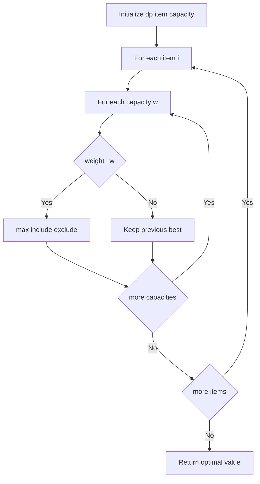
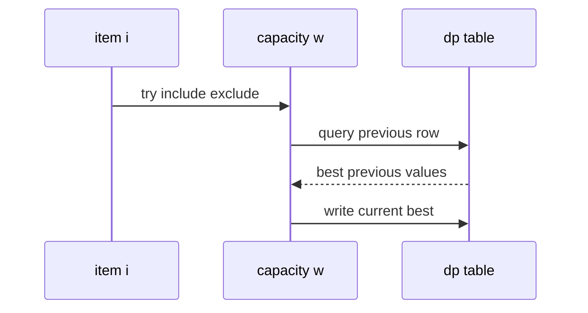

# 냅색 문제 (Knapsack) - GitHub Pages 해설

## 문서 목적
- 원본 템플릿 `03-dynamic-programming/03-knapsack.md` 의 내부 동작을 GitHub Markdown에서 바로 읽을 수 있게 설명합니다.
- 코드 레이어(초기화/루프/조건/갱신/종료)를 분해하고, Mermaid로 제어 흐름을 시각화합니다.
- 실전 문제에 붙일 때 반드시 수정해야 하는 지점을 체크리스트로 제공합니다.

## 원본 템플릿
- Source: [03-dynamic-programming/03-knapsack.md](../../03-dynamic-programming/03-knapsack.md)

## 내부 메커니즘 (Flow)


## 내부 상호작용 (Sequence)


## 핵심 코드
```python
# [0/1 Knapsack 템플릿: 아키텍트 버전]
# Use Case: 배낭에 물건 넣기 (각 물건 0개 또는 1개)
# Components: 2D DP (items x capacity)
# Constraint: 무게 제한 내 최대 가치

def knapsack_01(weights, values, capacity):
    # 1. 초기화 (Initialization Layer)
    n = len(weights)
    dp = [[0] * (capacity + 1) for _ in range(n + 1)]
    
    # 2. 2중 루프 (Double Loop)
    #    - i: 물건 인덱스
    #    - w: 현재 용량
    for i in range(1, n + 1):
        for w in range(1, capacity + 1):
            # 3. 선택 로직 (Choice Logic)
            #    - 물건을 넣을 수 있는가?
            if weights[i-1] <= w:
                # 넣는 경우 vs 안 넣는 경우
                include = values[i-1] + dp[i-1][w - weights[i-1]]
                exclude = dp[i-1][w]
                dp[i][w] = max(include, exclude)
            else:
                # 넣을 수 없으면 이전 값 유지
                dp[i][w] = dp[i-1][w]
    
    return dp[n][capacity]
```

## 코드 레이어 해설
- **Initialization**: 상태 테이블/포인터/큐/스택/부모 배열 등 탐색의 기준 상태를 만든다.
- **Process Loop / Recursion**: 입력 공간을 순회하며 상태 전이를 반복한다.
- **Decision Rule**: 분기 조건(완화 가능 여부, 유효 선택 여부, 종료 조건)을 적용한다.
- **State Update**: 거리/DP/집합/결과 배열을 갱신하고 다음 단계로 전달한다.
- **Termination**: 목표 도달, 범위 소진, 큐/스택 고갈, 사이클 검출 등으로 종료한다.

## 실전 적용 체크리스트
- 입력 자료구조 형식(인접 리스트, 간선 리스트, 정렬 여부, 1-index/0-index)을 먼저 고정한다.
- 시간 복잡도 한계에 맞게 자료구조를 교체한다 (`list.pop(0)` -> `deque.popleft` 등).
- 실패/예외 경로를 명시한다 (도달 불가, 음수 사이클, 빈 결과, 사이클 존재).
- 테스트는 최소 3개: 정상 케이스, 경계 케이스, 반례 케이스를 포함한다.
