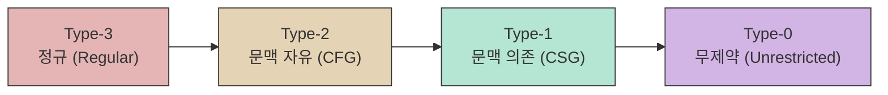

요청하신 이미지 파일들을 분석할 수 없었습니다. 하지만 이전 대화의 흐름과 파일 이름에서 언급된 "노암 촘스키(Noam Chomsky)"를 바탕으로, 형식 언어 이론의 가장 핵심적인 개념인 **촘스키 계층(Chomsky Hierarchy)**에 대해 모든 다이어그램과 테이블, 추가 예시를 포함하여 상세히 설명해 드리겠습니다.

---

### **촘스키 계층 (Chomsky Hierarchy) 개요**

- **제약 강도에 따른 분류:** 규칙 제약이 강할수록 언어 표현 범위는 좁아짐
- **포함 관계:** Type-3 ⊂ Type-2 ⊂ Type-1 ⊂ Type-0
- **실제 활용:**
  - Type-3 (정규) → 어휘 분석 (Lexing)
  - Type-2 (문맥 자유) → 구문 분석 (Parsing)

<details>
<summary>계층 구조 다이어그램 보기</summary>


</details>

---

### **Type-3: 정규 문법 (Regular Grammar)**

가장 제약이 강하고 단순한 문법입니다.

* **문법 규칙 (Production Rules):** `A → aB` 또는 `A → a` 형태 (오른쪽 선형 문법) / `A → Ba` 또는 `A → a` 형태 (왼쪽 선형 문법)만 허용됩니다.
    * `A`, `B`는 비단말 기호(하나의 변수)
    * `a`는 단말 기호(하나의 문자)
* **인식하는 언어:** **정규 언어 (Regular Languages)**
    * 예: `a`로 시작하고 `b`가 짝수 번 나오는 모든 문자열
* **대응하는 오토마타:** **유한 오토마타 (Finite Automata, NFA/DFA)**
    * 메모리가 없이, 오직 현재 상태만을 기억하여 언어를 인식합니다.

#### **예시: `a*b`**

* **정규 문법:**
    * S → aS | bA
    * A → ε
* **대응하는 DFA 다이어그램:**
    ```mermaid
    graph LR
        direction LR
        S0 -- a --> S0
        S0 -- b --> S1((S1))

        style S0 fill:#9f9,stroke:#333,stroke-width:2px
    ```

---

### **Type-2: 문맥 자유 문법 (Context-Free Grammar, CFG)**

프로그래밍 언어의 구문(Syntax)을 정의하는 데 널리 사용되는 문법입니다.

* **문법 규칙:** `A → γ` 형태만 허용됩니다.
    * `A`는 비단말 기호
    * `γ`는 단말 기호와 비단말 기호의 조합 (길이 제한 없음)
    * **핵심:** 왼쪽에는 오직 하나의 비단말 기호만 올 수 있어, **문맥에 상관없이** 치환이 가능합니다.
* **인식하는 언어:** **문맥 자유 언어 (Context-Free Languages)**
    * 예: 괄호 맞추기, `a^n b^n` (n≥1)
* **대응하는 오토마타:** **푸시다운 오토마타 (Pushdown Automata, PDA)**
    * 유한 오토마타에 **스택**이 추가된 형태입니다.

#### **예시: `a^n b^n` (n≥1)**

* **문맥 자유 문법:**
    * S → aSb | ab
* **PDA 개념 다이어그램:**
    ```mermaid
    graph TD
        direction LR
        q_start(start) --> q_loop
        q_loop -- "a, ε → A" --> q_loop
        q_loop -- "b, A → ε" --> q_final
        q_final --> q_accept((accept))
    ```
    *설명: `a`마다 스택에 `A`를 쌓고, `b`마다 꺼내 짝을 맞춥니다.*

---

### **Type-1: 문맥 의존 문법 (Context-Sensitive Grammar, CSG)**

문맥 자유보다 제약이 완화된 문법입니다.

* **문법 규칙:** `αAβ → αγβ` 형태만 허용됩니다. (`|γ| ≥ 1`)
    * `α`, `β`는 문맥(context)
    * **핵심:** `A`가 `α…β` 사이에 있을 때만 치환됩니다.
* **인식하는 언어:** **문맥 의존 언어 (Context-Sensitive Languages)**
    * 예: `a^n b^n c^n` (n≥1)
* **대응 오토마타:** **선형 유계 오토마타 (Linear Bounded Automata, LBA)**

#### **예시: `a^n b^n c^n` (n≥1)**

* **문법 예시:**
    * S → aSBC | aBC
    * CB → BC
    * aB → ab
    * bB → bb
    * bC → bc
    * cC → cc
* **LBA 개념:** 입력 길이만큼 테이프 제한, 좌우 이동하며 개수 검사

---

### **Type-0: 무제약 문법 (Unrestricted Grammar)**

가장 일반적이며 제약이 없습니다.

* **문법 규칙:** `α → β` (α에 비단말 최소 하나 포함)
* **인식 언어:** **재귀적으로 열거 가능한 언어 (Recursively Enumerable)**
* **대응 오토마타:** **튜링 머신 (Turing Machine)**

---

### **요약 테이블 및 주의사항**

| 타입  | 문법 명칭              | 규칙 형태       | 언어                   | 오토마타                             |
|:-----:|:----------------------:|:---------------:|:----------------------:|:-----------------------------------:|
| Type-3| 정규 문법 (Regular)    | A → a | A → aB | 정규 언어 (Regular)     | 유한 오토마타 (FA)                   |
| Type-2| 문맥 자유 문법 (CFG)   | A → γ            | 문맥 자유 언어 (CFL)    | 푸시다운 오토마타 (PDA)              |
| Type-1| 문맥 의존 문법 (CSG)   | αAβ → αγβ        | 문맥 의존 언어 (CSL)    | 선형 유계 오토마타 (LBA)             |
| Type-0| 무제약 문법 (Unrestricted)| α → β         | 재귀 열거 가능 언어      | 튜링 머신 (TM)                       |

#### ⚠️ 주의사항

1. **포함 관계:** 상위 타입은 하위 타입을 모두 포함합니다.
2. **실용성:** 실제 언어 처리에서는 Type-3, Type-2만 주로 사용됩니다.
3. **결정 가능성:** Type-0에서는 언어 인식이 결정 불가능할 수 있습니다.

---

### **1. 문맥 자유 문법 (Context-Free Grammar, CFG) 이란?**

**문맥 자유 문법(CFG)**은 촘스키 계층의 **Type-2**에 해당하는 문법으로, 프로그래밍 언어의 구문 구조(Syntax)를 정의하는 데 가장 널리 사용됩니다.

* **핵심 규칙:** 모든 생성 규칙이 `A → γ` 형태로 이루어집니다.
    * `A`: 단 하나의 비단말 기호(Non-terminal, 변수)
    * `γ`: 단말(terminal) 또는 비단말 기호들의 조합 (길이 제한 없음)

이름에 "문맥 자유"가 붙은 이유는, `A`의 주변에 어떤 기호가 오는지(즉, 문맥)에 상관없이 언제나 `A`를 `γ`로 치환할 수 있기 때문입니다.

#### **구성 요소**

CFG는 4가지 요소로 정의됩니다. `G = (V, T, P, S)`
* `V`: 비단말 기호의 유한 집합 (예: `E`, `T`, `F`)
* `T`: 단말 기호의 유한 집합 (예: `id`, `+`, `*`, `(`, `)`)
* `P`: 생성 규칙(Production rules)의 유한 집합
* `S`: 시작 기호(Start symbol)

#### **예제: 산술 표현식 문법**

* `V = {E, T, F}`
* `T = {id, +, *, (, )}`
* `P`:
    1.  `E → E + T`
    2.  `E → T`
    3.  `T → T * F`
    4.  `T → F`
    5.  `F → (E)`
    6.  `F → id`
* `S = E`

---

### **2. 유도 (Derivation) 와 파스 트리 (Parse Tree)**

**유도**는 시작 기호에서부터 생성 규칙을 순차적으로 적용하여 최종 문자열을 만들어내는 과정입니다. **파스 트리**는 이 유도 과정을 시각적인 트리 구조로 표현한 것입니다.

#### **예제: `id + id * id` 유도 과정과 파스 트리**

* **좌측 최단 유도 (Leftmost Derivation):** 매 단계에서 가장 왼쪽에 있는 비단말 기호를 먼저 치환합니다.

| 단계 | 적용 규칙 | 결과 문자열 |
| :--- | :--- | :--- |
| 1 | `E → E + T` | **E** + T |
| 2 | `E → T` | **T** + T |
| 3 | `T → F` | **F** + T |
| 4 | `F → id` | **id** + T |
| 5 | `T → T * F` | id + **T** * F |
| 6 | `T → F` | id + **F** * F |
| 7 | `F → id` | id + **id** * F |
| 8 | `F → id` | id + id * **id** |

* **파스 트리 (Mermaid 다이어그램):**
    ```mermaid
    graph TD
        E1(E) --> E2(E)
        E1 --> PLUS(+)
        E1 --> T2(T)
        
        E2 --> T1(T)
        T1 --> F1(F)
        F1 --> id1(id)
        
        T2 --> T3(T)
        T2 --> MUL(*)
        T2 --> F3(F)
        
        T3 --> F2(F)
        F2 --> id2(id)
        F3 --> id3(id)
        
        subgraph legend ["凡例"]
            direction LR
            E((E, T, F)): 비단말 기호
            T((id, +, *)): 단말 기호
        end

        style E fill:#e5d3b5,stroke:#333
        style T fill:#fff,stroke:#333
    ```

---

### **3. 모호성 (Ambiguity)**

**모호한 문법(Ambiguous Grammar)**이란, **하나의 문자열에 대해 두 개 이상의 파스 트리**를 생성할 수 있는 문법을 말합니다. 이는 컴파일러에게 심각한 문제를 야기합니다. 하나의 코드가 여러 의미로 해석될 수 있기 때문입니다.

#### **모호한 문법 예제: `E → E + E | E * E | (E) | id`**

위 문법으로 `id + id * id` 문자열을 파싱하면, 다음과 같이 두 가지 다른 파스 트리가 생성될 수 있습니다.

| `+`를 먼저 계산하는 경우 (틀린 해석) | `*`를 먼저 계산하는 경우 (옳은 해석) |
| :---: | :---: |
| `(id + id) * id` | `id + (id * id)` |

* **두 가지 파스 트리 (Mermaid 다이어그램):**
    ```mermaid
    graph TD
        subgraph "트리 1: + 먼저"
            direction TB
            E1(E) -- E --> E2(E)
            E1 -- * --> MUL(*)
            E1 -- id --> id3(id)
            E2 -- E --> E3(E)
            E2 -- + --> PLUS(+)
            E2 -- E --> E4(E)
            E3 -- id --> id1(id)
            E4 -- id --> id2(id)
        end

        subgraph "트리 2: * 먼저"
            direction TB
            E5(E) -- E --> E6(E)
            E5 -- + --> PLUS2(+)
            E5 -- E --> E7(E)
            E6 -- id --> id4(id)
            E7 -- E --> E8(E)
            E7 -- * --> MUL2(*)
            E7 -- E --> E9(E)
            E8 -- id --> id5(id)
            E9 -- id --> id6(id)
        end
    ```

---

### **4. 모호성 해결 (Disambiguation)**

모호성은 보통 문법 규칙을 재작성하여 해결합니다. 연산자 우선순위(precedence)와 결합성(associativity)을 문법 구조 자체에 명시하는 것입니다.

* **해결 방법:** 우선순위가 낮은 연산자(`+`)를 상위 레벨에, 높은 연산자(`*`)를 하위 레벨에 두도록 문법을 계층적으로 설계합니다.
* **해결된 문법 (Unambiguous Grammar):**
    * `E → E + T | T`  (덧셈은 가장 나중에)
    * `T → T * F | F`  (곱셈은 덧셈보다 먼저)
    * `F → (E) | id` (괄호와 피연산자가 가장 우선)

---

#### ⚠️ 추가적인 예시 및 주의사항

1. **댕글링 엘스 (Dangling Else) 문제:** `if C1 then if C2 then S1 else S2`에서 `else`가 가장 가까운 `if`에 연결되도록 처리
2. **파서 생성기의 역할:** Yacc, Bison 등 파서 생성기는 `%left`, `%right` 지시자를 통해 연산자 우선순위/결합성을 선언하여 모호성 해결
3. **고유 모호성 (Inherent Ambiguity):** 어떤 언어는 문법 재작성으로도 모호성을 제거할 수 없는 경우가 있음. 이를 “고유 모호한 언어”라 칭함
4. **핵심:** 모호하지 않은 문법은 컴파일러가 코드를 단 하나의 의미로 해석하도록 보장하는 필수 요소