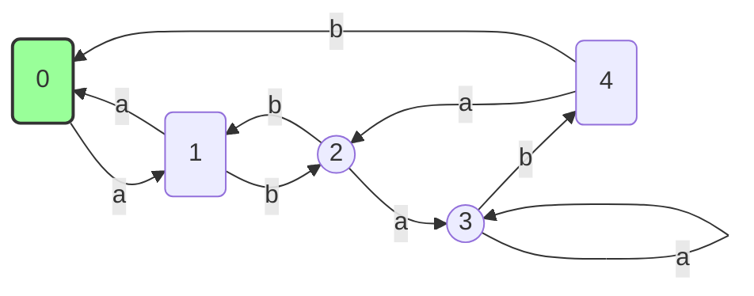
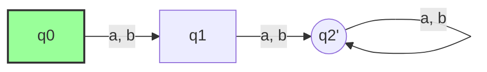
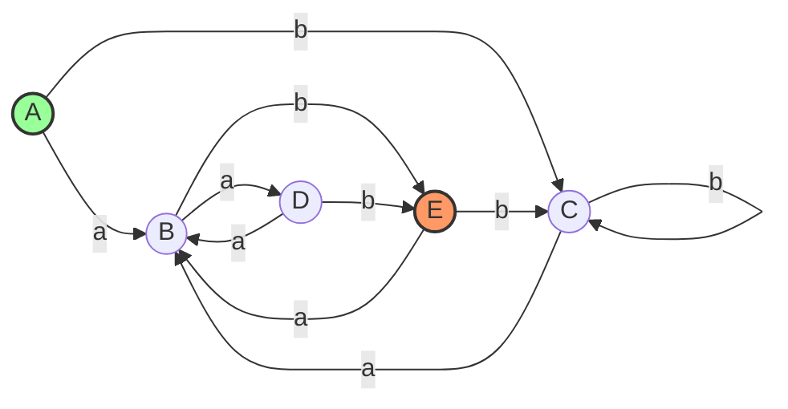

네, 그럼요. 제공해주신 슬라이드 자료를 바탕으로 **DFA를 최소 DFA(Minimal DFA)로 만드는 최적화 과정**을 모든 다이어그램을 Mermaid 코드로 표현하고, 각 단계를 상세히 설명해 드리겠습니다.

## DFA 최소화 개요
본 문서에서는 DFA를 최소 DFA(Minimal DFA)로 최적화하는 과정을 단계별로 안내합니다.

- **목적:** DFA의 상태 수를 줄여 효율성 향상
- **주요 절차:**
  1. 도달 불가능 상태 제거 (Unreachable States)
  2. 동등 상태 병합 (Equivalence & Merging)

---

### **DFA 최소화 (Optimization) 개요**

DFA를 최소화하는 것은 주어진 언어를 인식하는 DFA 중에서 **가장 적은 수의 상태**를 가진, 가장 효율적인 DFA를 만드는 과정입니다. 이 과정은 일반적으로 두 단계로 이루어집니다.

1.  **도달 불가능한 상태(Unreachable States) 제거:** 시작 상태에서 어떠한 경로로도 도달할 수 없는 상태를 삭제합니다.
2.  **동등한 상태(Equivalent States) 병합:** 기능적으로 똑같은 역할을 하는 상태들을 하나의 상태로 합칩니다.

---

### **1단계: 도달 불가능한 상태 제거 (Reachability)**

DFA에는 시작 상태에서부터 어떠한 입력을 통해서도 절대 도달할 수 없는 "쓸모없는" 상태가 존재할 수 있습니다. 최소화의 첫 단계는 이러한 상태들을 찾아 제거하는 것입니다.

#### **예제 다이어그램**

슬라이드에 나온 예제 DFA입니다.



#### **제거 과정 설명**

1.  **시작 상태에서 탐색 시작:** 시작 상태인 `0`에서 시작합니다.
2.  **도달 가능한 상태 확인:**
   
   | 단계 | 현재 상태 | 입력 | 도달 상태 | 누적 집합 |
   |:---:|:---------:|:------:|:-----------:|:-----------:|
   | 1   | 0         | a     | 1         | {0,1}      |
   | 2   | 1         | b     | 2         | {0,1,2}    |
   | 3   | 2         | a     | 3         | {0,1,2,3}  |
   | 4   | 3         | b     | 4         | {0,1,2,3,4}|
   
   ```mermaid
   flowchart TB
       A["시작 상태 0"] -->|a| B["상태 1, 집합 {0,1}"]
       B -->|b| C["상태 2, 집합 {0,1,2}"]
       C -->|a| D["상태 3, 집합 {0,1,2,3}"]
       D -->|b| E["상태 4, 집합 {0,1,2,3,4}"]
   ```
   
   *이 예제에서는 모든 상태가 도달 가능하지만, 만약 상태 `2, 3, 4`로 가는 경로가 전혀 없었다면 이들은 제거 대상이 됩니다.*

---

### **2단계: 동등한 상태 병합 (Merging Equivalent States)**

이 단계가 최소화의 핵심입니다. 기능적으로 구별할 수 없는 상태들을 찾아 하나의 상태로 합칩니다. "두 상태가 동등하다"는 것은 어떤 입력 문자열에 대해서든 두 상태가 항상 같은 결과(둘 다 최종 상태로 끝나거나, 둘 다 최종 상태가 아닌 상태로 끝남)를 내놓는다는 의미입니다.

#### **예제 다이어그램**

슬라이드 우측 상단에 나온 DFA와 그 최소화 예제를 사용해 설명하겠습니다.

* **원본 DFA**
    ```mermaid
    graph LR
        direction LR
        q0 -- "a, b" --> q1
        q1 -- b --> q2((q2))
        q1 -- a --> q3((q3))
        q2 -- a --> q3
        q2 -- b --> q2
        q3 -- "a, b" --> q3

        style q0 fill:#9f9,stroke:#333,stroke-width:2px
    ```

#### **병합 과정 설명 (상태 분할법)**

1.  **초기 분할 (Initial Partition):** 먼저 모든 상태를 **최종 상태(Final States) 그룹**과 **일반 상태(Non-Final States) 그룹**으로 나눕니다.
    * **그룹 1 (일반 상태):** `{q0, q1}`
    * **그룹 2 (최종 상태):** `{q2, q3}`

2.  **그룹 세분화 (Refining Partitions):** 이제 각 그룹 내의 상태들이 정말 동등한지 검사합니다.
    * **검사 규칙:** 같은 그룹에 속한 두 상태 `s`, `t`가 있을 때, 동일한 입력 `x`에 대해 `δ(s, x)`와 `δ(t, x)`가 서로 **다른 그룹**으로 이동한다면, 두 상태 `s`, `t`는 **구별 가능(distinguishable)**하므로 분리해야 합니다.

    * **그룹 2 `{q2, q3}` 검사:**
        * `q2`에서: `a` 입력 → `q3` (그룹 2), `b` 입력 → `q2` (그룹 2)
        * `q3`에서: `a` 입력 → `q3` (그룹 2), `b` 입력 → `q3` (그룹 2)
        * `q2`와 `q3`는 어떤 입력을 받든 항상 같은 그룹(그룹 2) 안에 머무릅니다. 따라서 두 상태는 **구별 불가능**, 즉 **동등(equivalent)**합니다. 이들은 합칠 수 있습니다.

    * **그룹 1 `{q0, q1}` 검사:**
        * `q0`에서: `a` 입력 → `q1` (그룹 1), `b` 입력 → `q1` (그룹 1)
        * `q1`에서: `a` 입력 → `q3` (그룹 2), `b` 입력 → `q2` (그룹 2)
        * `q0`과 `q1`을 비교해봅시다. 입력 `a`에 대해 `q0`은 그룹 1에 속한 `q1`로 가지만, `q1`은 그룹 2에 속한 `q3`로 갑니다. 두 상태가 서로 다른 그룹으로 이동했으므로, `q0`과 `q1`은 **구별 가능**합니다. 따라서 이 그룹은 더 이상 나눌 필요 없이 각자 독립적인 상태가 됩니다.

3.  **최종 분할 및 상태 병합:**
    * 최종적으로 구분된 상태 집합은 `{{q0}, {q1}, {q2, q3}}` 입니다.
    * 이제 동등한 상태인 `{q2, q3}`를 새로운 상태 하나, **`q2'`** 로 병합합니다.

4.  **최소 DFA 생성:**
    * **새로운 상태:** `{q0, q1, q2'}`
    * **시작 상태:** `q0`
    * **최종 상태:** `q2'` (병합된 상태 `{q2, q3}`가 최종 상태였으므로)
    * **전이 재구성:**
        * `q0`의 전이는 변함없이 `q1`로 갑니다.
        * `q1`에서 `a` 입력은 원래 `q3`로 갔지만, 이제 병합된 `q2'`로 갑니다.
        * `q1`에서 `b` 입력은 원래 `q2`로 갔지만, 이제 병합된 `q2'`로 갑니다.
        * 새로운 `q2'` 상태의 전이는 원래 `q2`와 `q3`의 전이를 따릅니다. `a`나 `b`를 입력받으면 항상 그룹 `{q2,q3}` 안으로 갔으므로, `q2'`는 자기 자신으로 루프를 돕니다.


**1. 초기 분할 (Initial Partition)**

| 그룹        | 상태 집합    |
|:-----------:|:------------:|
| 1 (비최종)  | `{q0, q1}`   |
| 2 (최종)    | `{q2, q3}`   |

**2. 그룹 세분화 (Refining Partitions)**  
- 검사 규칙: 동일한 입력에서 다른 그룹으로 이동하면 `구별 가능`

| 상태 | a 전이 (그룹) | b 전이 (그룹) | 전이 패턴 | 결과 그룹    |
|:----:|:-------------:|:-------------:|:---------:|:------------:|
| q0   | q1 (1)        | q1 (1)        | (1,1)     | `{q0}`       |
| q1   | q3 (2)        | q2 (2)        | (2,2)     | `{q1}`       |
| q2   | q3 (2)        | q2 (2)        | (2,2)     | `{q2, q3}`   |
| q3   | q3 (2)        | q3 (2)        | (2,2)     | `{q2, q3}`   |

**3. 최종 분할 및 상태 병합**  
최종 그룹: `{q0}`, `{q1}`, `{q2, q3}`  
동등 상태 `{q2, q3}` 병합 → **q2'**

**4. 최소 DFA 생성**  
- 새로운 상태: `{q0, q1, q2'}`  
- 시작 상태: `q0`  
- 최종 상태: `q2'`  
- 전이 재구성:  
  - `q0` → `q1`  
  - `q1` → `q2'` (a, b)  
  - `q2'` → `q2'` (a, b)

#### **최종 결과: Minimal DFA**

위 과정을 거쳐 슬라이드에 나온 것과 동일한 최소 DFA가 만들어집니다.


*(여기서 `q2'`는 원래의 `q2`와 `q3`가 합쳐진 상태입니다.)*

---

### **DFA 최소화 (Minimal DFA)**

# DFA 최소화 (Minimal DFA)
> **목표:** 주어진 DFA를 가능한 최소 상태 수로 줄여 효율성을 높임

## 최소화 절차 개요
| 단계 | 설명 |
|:---:|:---|
| **1. 도달 불가능 상태 제거**<br>Unreachable States | 시작 상태에서 BFS/DFS로 탐색해 도달 불가능한 상태 삭제 |
| **2. 동등 상태 병합**<br>Equivalence & Merging | 기능적으로 같은 상태를 그룹화해 하나로 병합 |

---

## 1. 도달 불가능 상태 제거
- **목적:** 쓸모없는 상태를 삭제하여 DFA 간소화
- **방법:**
  1. 시작 상태에서 BFS/DFS 수행
  2. 탐색된 상태만 유지, 나머지 상태 제거

**예제 DFA**


---