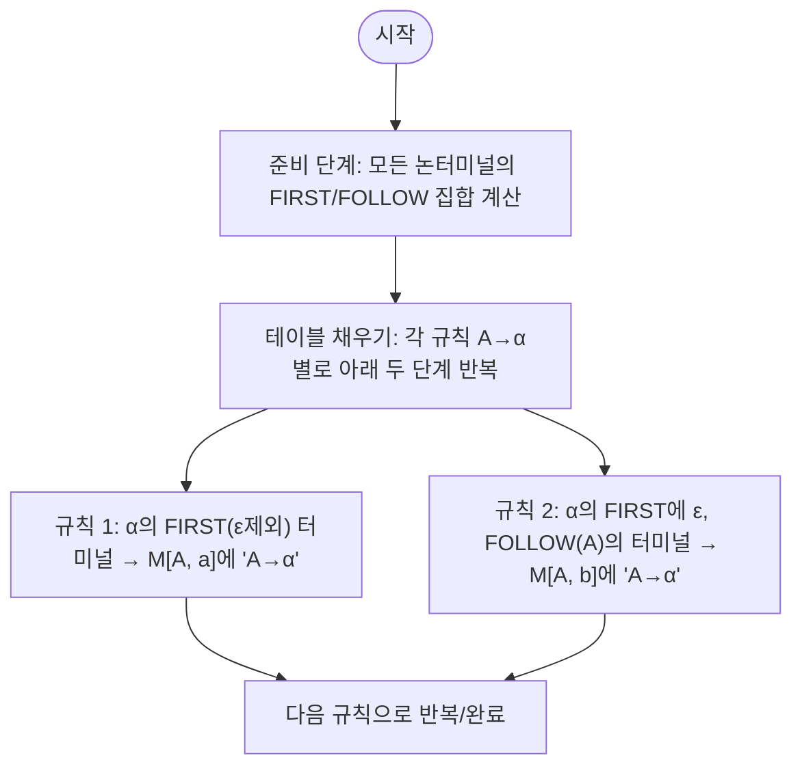

LL(1) 파싱 테이블을 만드는 과정을 **다이어그램(flowchart)** 과 함께 정리합니다. 

과정은 크게 **두 단계**로 이루어집니다.

1. **준비 단계:** 
    - 문법의 모든 논터미널에 대해 `FIRST`와 `FOLLOW` 집합을 계산합니다.     
    - 이는 테이블의 재료입니다.
2. **테이블 채우기:** 
    - 각 문법 규칙에 대해 두 가지 핵심 규칙을 적용, 테이블의 올바른 칸에 어떤  규칙을 넣을지 결정합니다.

---

## LL(1) 파싱 테이블 생성 알고리즘

아래 다이어그램은 **각 규칙 `A → α`에 대해** 파싱 테이블을 채워나가는 과정을 보여줍니다.

---

## 다이어그램 해설 및 예시

두 가지 규칙이 실제 문법에 어떻게 적용되는지 예로 살펴봅니다.

### 예시 문법

1. $S \rightarrow (S)S$
2. $S \rightarrow \epsilon$

#### 미리 계산된 집합

- $FIRST(S) = \{ '(',\ \epsilon \}$
    - $S \Rightarrow (S)S \implies\ $시작 기호가 `(`이므로 포함
    - $S \Rightarrow \epsilon\ $이므로 $\epsilon$도 포함
- $FOLLOW(S) = \{ ')',\ \$ \}$
    - $S$이 시작 기호이므로 \$ 포함
    - $S \rightarrow (S)S$에서 $S$ 뒤에 $S$가 오므로, $S$의 FOLLOW는 $S$의 FOLLOW에도 포함
    - $S \rightarrow (S)S$에서 $S$ 뒤에 아무것도 없으므로 FOLLOW(S) 그대로
    - $S \rightarrow (S)S$에서 $(S)$ 안의 $S$ 뒤에 `)`가 오므로 `)` 포함

---

### 1. 규칙 $S \rightarrow (S)S$ 적용

1. **시작:** $A = S$, $\alpha = (S)S$
2. **FIRST 계산:** `FIRST((S)S)` = `{ '(' }`
3. **ε 포함?:** 없음
4. **Rule 1 적용:** `FIRST`의 터미널은 `(`, 테이블 **M[S, (]** 칸에 $S \rightarrow (S)S$ 기록

---

### 2. 규칙 $S \rightarrow \epsilon$ 적용

1. **시작:** $A = S$, $\alpha = \epsilon$
2. **FIRST 계산:** `FIRST(ε)` = `{ ε }`
3. **ε 포함?:** 있음
4. **Rule 2 적용:** `FOLLOW(S)`의 터미널은 `)`와 `$`, 테이블 **M[S, )]**, **M[S, $]** 칸에 $S \rightarrow \epsilon$ 기록

---

## 최종 파싱 테이블

|     | `(`                | `)`                  | `$`                  |
|:---:|:------------------:|:--------------------:|:--------------------:|
| **S** | $S \rightarrow (S)S$ | $S \rightarrow \epsilon$ | $S \rightarrow \epsilon$ |

---

`FIRST`와 `FOLLOW` 집합만 있으면, 위 두 규칙에 따라 파싱 테이블을 기계적으로 작성할 수 있습니다.  
