## LR(0) 파싱과 아이템 기반 유한 오토마타 완벽 분석

제공된 이미지 자료들은 컴파일러의 구문 분석 단계에서 사용되는 **LR(0) 파싱**의 핵심 개념과, 파싱 테이블을 생성하기 위한 **유한 오토마타(Finite Automata)** 구축 과정을 상세히 설명하고 있습니다. 이 자료들의 모든 내용을 빠짐없이, 심도 있게 분석하여 설명하겠습니다.

---

### 1. LR(0) 아이템의 이해: 파싱 과정의 스냅샷

LR(0) 파싱의 첫걸음은 **LR(0) 아이템(Item)**의 개념을 이해하는 것입니다.

* **LR(0) 아이템이란?**: 문법 규칙의 오른쪽 부분(RHS, Right-Hand Side)에서 파서가 **어디까지 인식했는지를 나타내는 지표**입니다. 이는 프로덕션 규칙에 점(dot, `.`)을 추가하여 표현합니다. 즉, 파싱 과정의 특정 중간 단계를 기록하는 것입니다. (이미지 노트: "어떤 특정 지점을 표시하기 위해 사용")
* **점(Dot)의 의미**: 점은 "지금까지 RHS의 어느 부분까지 스택에 쌓였는가"를 보여줍니다.
    * 점의 왼쪽에 있는 심볼들은 이미 파싱되어 스택에 존재함을 의미합니다.
    * 점의 오른쪽에 있는 심볼들은 앞으로 입력 스트림에서 보게 될 것으로 기대되는 부분입니다.

#### 아이템의 종류

LR(0) 아이템은 점의 위치에 따라 세 가지로 분류할 수 있습니다. 각 아이템 유형은 파서가 문법 규칙의 어느 지점까지 인식했는지를 나타냅니다.

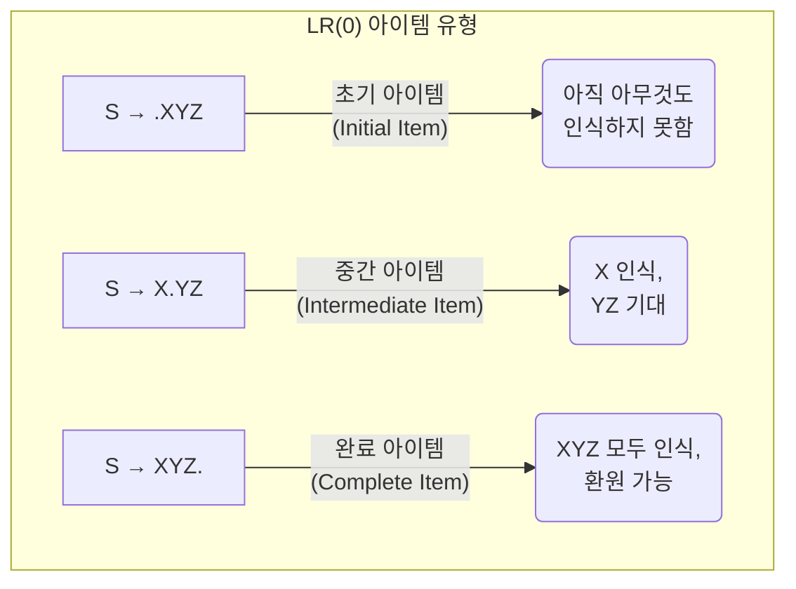

1.  **초기 아이템 (Initial Item)**: 점이 RHS의 가장 왼쪽에 있는 경우입니다.
    * **예시**: `S → .XYZ`
    * **의미**: XYZ라는 문자열을 파생시키기 위한 과정을 이제 막 시작하려는 상태입니다. 아직 아무것도 인식하지 못했습니다.

2.  **중간 아이템 (Intermediate Item)**: 점이 RHS의 중간에 있는 경우입니다.
    * **예시**: `S → X.YZ`
    * **의미**: X로부터 파생된 문자열을 성공적으로 인식하여 스택에 쌓았고, 이제 YZ로부터 파생될 문자열을 기대하고 있는 상태입니다.

3.  **완료 아이템 (Complete Item)**: 점이 RHS의 가장 오른쪽에 있는 경우입니다.
    * **예시**: `S → XYZ.`
    * **의미**: 프로덕션의 RHS인 XYZ 전체가 스택의 맨 위에 성공적으로 인식되었음을 의미합니다. 이 상태는 **환원(Reduce)이 가능한 상태**입니다. (이미지 노트: "다 봤으니 (스택에 모두 push된) 상태. Reduce 가능한 상태임을 의미")

---

### 2. LR(0) 아이템과 유한 오토마타

LR(0) 파서의 핵심은 **LR(0) 아이템들의 집합을 유한 오토마타(DFA)의 상태(State)로 사용**하여 파싱 과정을 자동화하는 것입니다. 각 상태는 파서가 현재까지 어떤 심볼들을 인식했는지, 그리고 앞으로 어떤 심볼들을 기대하는지에 대한 모든 정보를 담고 있습니다.

#### 동등한 LR(0) 아이템 (Equivalence of LR(0) items)

DFA의 한 상태는 하나의 LR(0) 아이템만으로 구성되지 않고, 관련된 모든 **동등한(equivalent) 아이템들의 집합**으로 구성됩니다. 이를 **클로저(Closure)**라고 합니다.

* **클로저(Closure) 규칙**:
    1.  어떤 상태에 `A → α . B β` 라는 아이템이 있고, `B`가 비단말 심볼(Non-terminal)이라면, `B`로 시작하는 모든 프로덕션 규칙의 초기 아이템(예: `B → .γ`)들도 해당 상태에 포함되어야 합니다.
    2.  이 과정은 새로운 아이템이 더 이상 추가되지 않을 때까지 반복됩니다.

* **의미**: 파서가 `B`를 기대하는 상태(`A → α . B β`)라면, `B`를 만들기 위한 모든 가능한 방법(`B → .γ`)들에 대해서도 준비해야 한다는 뜻입니다. 이는 마치 '만약 B가 필요하다면, B를 만들 수 있는 모든 레시피를 미리 준비해두자'와 같습니다.

다음은 클로저 연산의 예시입니다. 만약 상태 `I`에 아이템 `A → .X Y`가 있고, `X`에 대한 규칙 `X → .Z`와 `X → .d`가 있다고 가정해봅시다. 클로저 연산은 다음과 같이 진행됩니다.

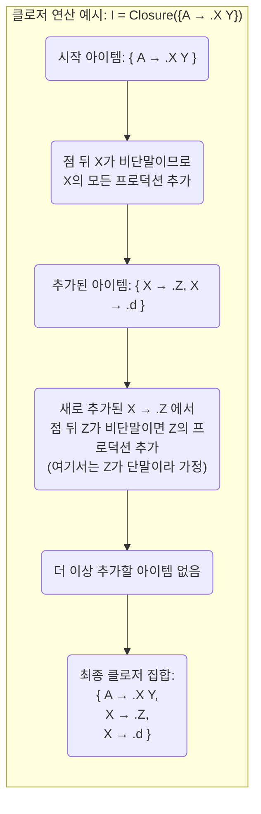

#### 유한 오토마타의 상태 (State of equivalent LR(0) items)

* **상태**: 동등한 LR(0) 아이템들의 집합(클로저)이 하나의 상태를 이룹니다.
* **시작 상태 (Start State)**: 증강 문법(Augmented Grammar)의 시작 프로덕션의 초기 아이템 `S' → .S`의 클로저가 DFA의 시작 상태가 됩니다.

* **GOTO(I, X) 연산**: 상태 `I`에서 문법 기호 `X`를 읽었을 때 다음 상태로 전이하는 것을 정의합니다. 상태 `I`에 있는 아이템 중 `A → α . X β` 형태의 모든 아이템에 대해, 점을 `X` 뒤로 옮긴 `A → α X . β` 형태의 아이템들을 모읍니다. 이 새로운 아이템들의 집합에 대한 클로저가 `GOTO(I, X)`의 결과 상태가 됩니다.

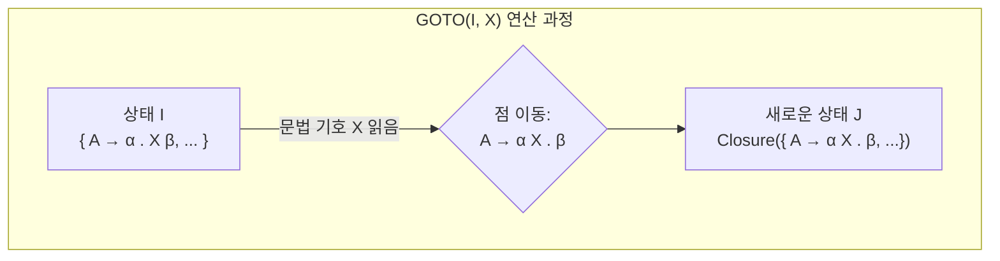

* **상태 전이 (Transition)**: 한 상태에서 특정 문법 심볼 `Y`를 읽었을 때의 다음 상태는, 현재 상태에서 `Y` 바로 앞에 점이 있는 모든 아이템(`A → X . Y Z`)들의 점을 `Y` 뒤로 이동시킨(`A → XY . Z`) 새로운 아이템들의 집합에 대해 클로저를 계산하여 결정됩니다. 이를 **GOTO 연산**이라고 합니다.
* **종료 상태 (Final State)**: 완료 아이템(`A → β .`)을 포함하는 상태입니다. 이 상태에 도달하면 `A → β` 규칙으로 환원(Reduce) 동작을 수행합니다.

---

### 3. 유한 오토마타(DFA) 구축 예시

제공된 예시 문법을 사용하여 실제로 DFA를 구축하는 과정을 단계별로 살펴보겠습니다.

* **사용 문법 G**:
    * `S → (S)S`
    * `S → ε` (ε은 빈 문자열)
* **증강 문법 G'**:
    * `S' → S`
    * `S → (S)S`
    * `S → ε`

#### DFA 구축 과정

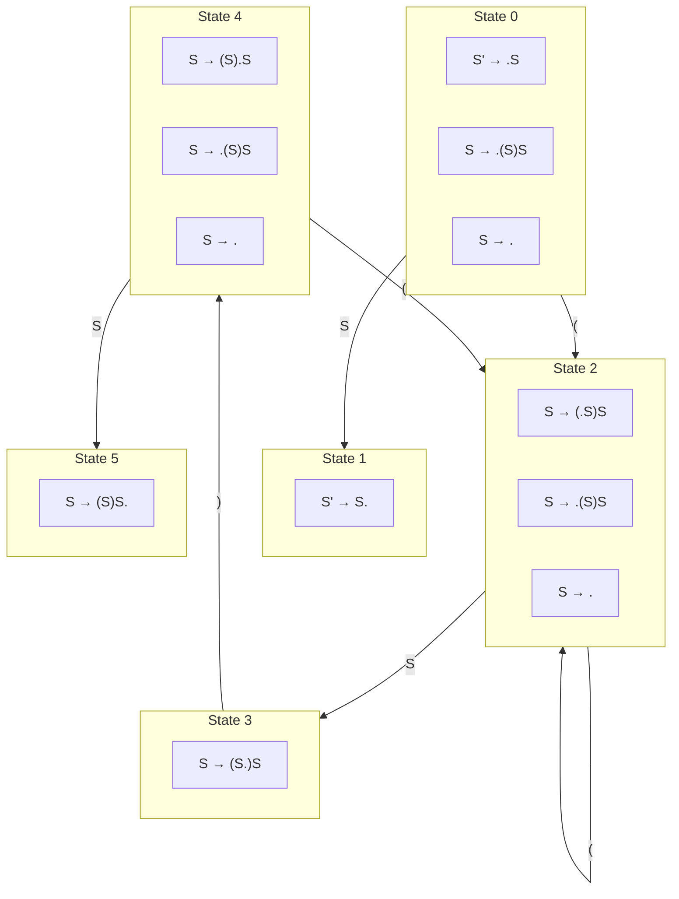

#### DFA 상태 및 전이 상세 정보

위 DFA 다이어그램의 각 상태와 전이에 대한 상세 정보는 다음과 같습니다.

| 상태 | 포함된 LR(0) 아이템                      | GOTO 연산         | 다음 상태 | 설명                                                                 |
| :--- | :--------------------------------------- | :---------------- | :-------- | :------------------------------------------------------------------- |
| I0   | S' → .S   S → .(S)S   S → .      | GOTO(I0, S)       | I1        | S를 읽으면 S' → S. 아이템을 포함하는 I1 상태로 전이 (Accept 상태)        |
|      |                                          | GOTO(I0, `(`)     | I2        | `(`를 읽으면 S → (.S)S 등의 아이템을 포함하는 I2 상태로 전이             |
| I1   | S' → S.                                  | -                 | -         | Accept 상태. 파싱 성공.                                                |
| I2   | S → (.S)S   S → .(S)S   S → .    | GOTO(I2, S)       | I3        | S를 읽으면 S → (S.)S 아이템을 포함하는 I3 상태로 전이                 |
|      |                                          | GOTO(I2, `(`)     | I2        | `(`를 읽으면 다시 I2 상태로 전이 (루프)                                |
| I3   | S → (S.)S                                | GOTO(I3, `)`)     | I4        | `)`를 읽으면 S → (S).S 등의 아이템을 포함하는 I4 상태로 전이             |
| I4   | S → (S).S   S → .(S)S   S → .   | GOTO(I4, S)       | I5        | S를 읽으면 S → (S)S. 아이템을 포함하는 I5 상태로 전이 (Reduce 상태)       |
|      |                                          | GOTO(I4, `(`)     | I2        | `(`를 읽으면 다시 I2 상태로 전이                                       |
| I5   | S → (S)S.                                | -                 | -         | Reduce 상태. `S → (S)S` 규칙으로 환원.                               |

**참고**: 위 표에서 S'는 증강된 시작 심볼, S는 원래 문법의 시작 심볼, `(`와 `)`는 단말 심볼, ε은 빈 문자열을 나타냅니다. `.`은 LR(0) 아이템에서 현재까지 인식된 위치를 나타냅니다.

#### 단계별 상세 설명

**1. 시작 상태 (State 0 / I0)**

* **시작**: 증강 문법의 시작 규칙 `S' → .S`에서 시작합니다. (이미지 노트: "State 0 임")
* **클로저 계산**:
    1.  `S' → .S` 에서 점 뒤에 비단말 `S`가 있으므로, `S`로 시작하는 모든 프로덕션의 초기 아이템을 추가합니다. (이미지 노트: "모든 Production-rule에 대해 정의")
        * `S → .(S)S`
        * `S → .` (ε 프로덕션은 점만 있는 것으로 표현)
    2.  새로 추가된 `S → .(S)S` 에서 점 뒤는 단말 `(` 이므로 더 이상 추가할 아이템이 없습니다.
* **최종 상태 0**: `I0 = { S' → .S, S → .(S)S, S → . }` (이미지 노트: "Initial State")
    * 이 상태는 **Reduce/Reduce Conflict**를 가지고 있습니다. 입력이 `)`일 때 `S → .` 규칙으로 환원할지, `(`을 읽고 Shift할지 모호합니다. 이는 이 문법이 LR(0)가 아님을 의미합니다. (실제로는 SLR 등 상위 파서에서 해결)

**2. State 0 에서의 전이**

* **GOTO(I0, S)**: `S`를 읽었을 때
    * I0에서 `S` 앞에 점이 있는 아이템: `S' → .S`
    * 점을 이동: `S' → S.`
    * 클로저 계산: 점 뒤에 아무것도 없으므로 추가 아이템 없음.
    * **결과**: `I1 = { S' → S. }`
    * `S' → S.`는 **Accept**를 의미하는 완료 아이템입니다. (이미지 노트: "LR(0) 아이템이 기대한 걸 다 봤다 -> Reduce 사용")

* **GOTO(I0, `(`)**: `(`를 읽었을 때
    * I0에서 `(` 앞에 점이 있는 아이템: `S → .(S)S`
    * 점을 이동: `S → (.S)S`
    * 클로저 계산:
        1.  `S → (.S)S`에서 점 뒤에 비단말 `S`가 있으므로 `S` 규칙 추가:
            * `S → .(S)S`
            * `S → .`
        2.  더 이상 추가할 아이템 없음.
    * **결과**: `I2 = { S → (.S)S, S → .(S)S, S → . }`

**3. State 2 에서의 전이**

* **GOTO(I2, S)**: `S`를 읽었을 때
    * `S → (.S)S` -> `S → (S.)S`
    * 클로저: `I3 = { S → (S.)S }`

* **GOTO(I2, `(`)**: `(`를 읽었을 때
    * `S → .(S)S` -> `S → (.S)S`
    * 클로저 계산 결과는 `I2` 자신과 동일합니다. 따라서 `(` 입력에 대해 `I2`로의 루프가 형성됩니다.

**4. 이후 과정 요약**

* **GOTO(I3, `)`)**: `S → (S.)S` -> `S → (S).S`
    * 클로저: `I4 = { S → (S).S, S → .(S)S, S → . }`

* **GOTO(I4, S)**: `S → (S).S` -> `S → (S)S.`
    * 클로저: `I5 = { S → (S)S. }` (환원 상태)

이와 같은 방식으로 더 이상 새로운 상태가 생성되지 않을 때까지 GOTO 연산을 반복하여 전체 DFA를 완성합니다. 이 DFA는 LR 파서의 **상태**와 **상태 전이**를 정의하며, 이를 기반으로 파싱 테이블을 만들 수 있습니다.

### 3.1. DFA 구축 단계별 상세 설명 (예시 이미지 포함)

제공된 이미지를 바탕으로 LR(0) 아이템을 사용하여 유한 오토마타(DFA)를 구축하는 과정을 단계별로 상세히 설명합니다.

**사용 문법:**
*   G = ({S}, {(, )}, P, S)
    *   P: S → (S)S | ε
*   증강된 문법 G' = ({S', S}, {(, )}, P', S')
    *   P':
        1.  S' → S
        2.  S → (S)S
        3.  S → ε (ε은 빈 문자열을 의미)

LR(0) 아이템들은 이 문법의 각 프로덕션 규칙에서 점(.)의 위치를 옮겨가며 만들 수 있는 모든 경우를 나타냅니다.

**(참고: 아래 설명의 이미지 경로는 예시입니다. 실제 이미지 파일명과 경로에 맞게 수정해주세요. 예를 들어, `images/lr0_dfa_step_1.png`와 같이 문서 기준 상대 경로로 지정할 수 있습니다.)**

#### 단계 1: 초기 설정 및 시작 아이템

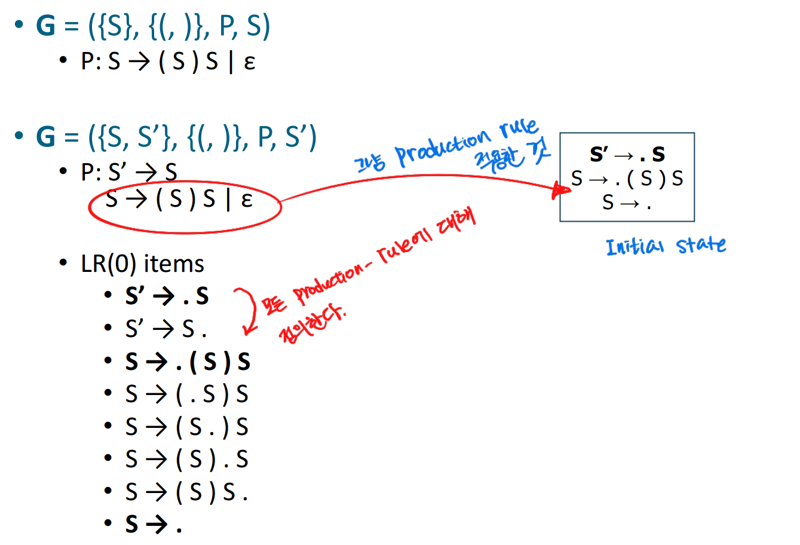

*   **설명**:
    *   원본 문법 G와 증강 문법 G'가 정의되어 있습니다.
    *   G'에 대한 모든 가능한 LR(0) 아이템 목록이 나열되어 있습니다.
    *   오른쪽에는 `S' → .S` 아이템을 포함하는 박스가 보입니다. 이것이 DFA 구축의 시작점, 즉 초기 상태의 핵심(kernel)이 됩니다.
    *   이미지의 주석 "State 모델이"는 여기서부터 상태 모델(DFA) 구축이 시작됨을 의미하는 것으로 해석됩니다.
*   **다음 단계로의 변화**: 이 `S' → .S` 아이템으로부터 클로저(Closure) 연산을 통해 완전한 초기 상태 I0를 구성하게 됩니다.

#### 단계 2: 초기 상태 I0 완성 및 GOTO(I0, S) → I1 전이

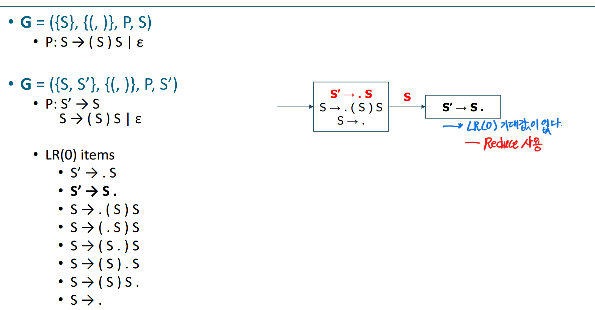

*   **설명**:
    *   **초기 상태 I0**:
        *   단계 1의 `S' → .S` 아이템에서 시작합니다.
        *   **클로저 연산**: 점(.) 뒤에 비단말 심볼 `S`가 있으므로, `S`로 시작하는 모든 프로덕션 규칙의 아이템들(`S → .(S)S`, `S → .`)을 I0에 추가합니다. (`S → .`는 `S → ε` 규칙에서 유도됩니다.)
        *   따라서 상태 I0는 `{ S' → .S, S → .(S)S, S → . }` 아이템들의 집합이 됩니다. 이것이 다이어그램에서 "Initial state"로 표시된 박스입니다.
    *   **GOTO(I0, S) 연산 → 상태 I1**:
        *   I0의 아이템 중 점 뒤에 `S`가 있는 아이템(`S' → .S`)을 선택합니다.
        *   점을 `S` 뒤로 옮기면 `S' → S.` 아이템이 됩니다. 이것이 새 상태 I1의 핵심입니다.
        *   **클로저 연산**: `S' → S.`는 점이 맨 뒤에 있으므로, 클로저 연산으로 추가될 아이템이 없습니다.
        *   따라서 상태 I1은 `{ S' → S. }` 입니다. 이 상태는 증강된 시작 심볼 `S'`에 대한 규칙이고 점이 맨 뒤에 있으므로, 입력 문자열 전체가 성공적으로 파싱되었음을 나타내는 **종료(accept) 상태**입니다.
*   **변화**:
    *   I0 박스가 완전한 아이템들로 채워졌습니다.
    *   새로운 상태 I1 박스가 생성되고, I0에서 I1로 가는 `S` 전이(transition)가 추가되었습니다.
    *   이미지의 주석 "모든 Production rule에 대해 Closure를 진행한다"는 I0가 어떻게 형성되었는지 설명합니다.

#### 단계 3: GOTO(I0, `(`) → I2 전이 추가

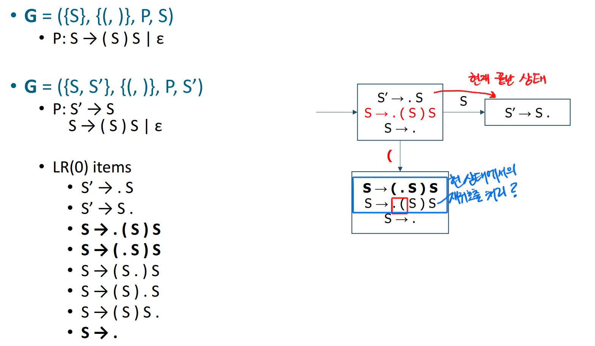

*   **설명**:
    *   **GOTO(I0, `(`) 연산 → 상태 I2**:
        *   상태 I0 (`{ S' → .S, S → .(S)S, S → . }`)에서 점 뒤에 단말 심볼 `(`가 있는 아이템 (`S → .(S)S`)을 선택합니다.
        *   점을 `(` 뒤로 옮기면 `S → (.S)S` 아이템이 됩니다. 이것이 새 상태 I2의 핵심입니다.
        *   **클로저 연산**: `S → (.S)S`에서 점 뒤에 비단말 심볼 `S`가 있으므로, `S`로 시작하는 프로덕션 규칙의 아이템들(`S → .(S)S`, `S → .`)을 I2에 추가합니다.
        *   따라서 상태 I2는 `{ S → (.S)S, S → .(S)S, S → . }` 입니다.
*   **변화**:
    *   새로운 상태 I2 박스가 생성되고, I0에서 I2로 가는 `(` 전이가 추가되었습니다.
    *   상태 I1 (`S' → S.`)에 대한 이미지 주석 "LR(0) 아이템이 없다. Reduce 사용"은 이 상태가 Reduce 액션을 취해야 함을 나타냅니다 (실제로는 Accept 액션).

#### 단계 4: GOTO(I2, S) → I3 전이 추가

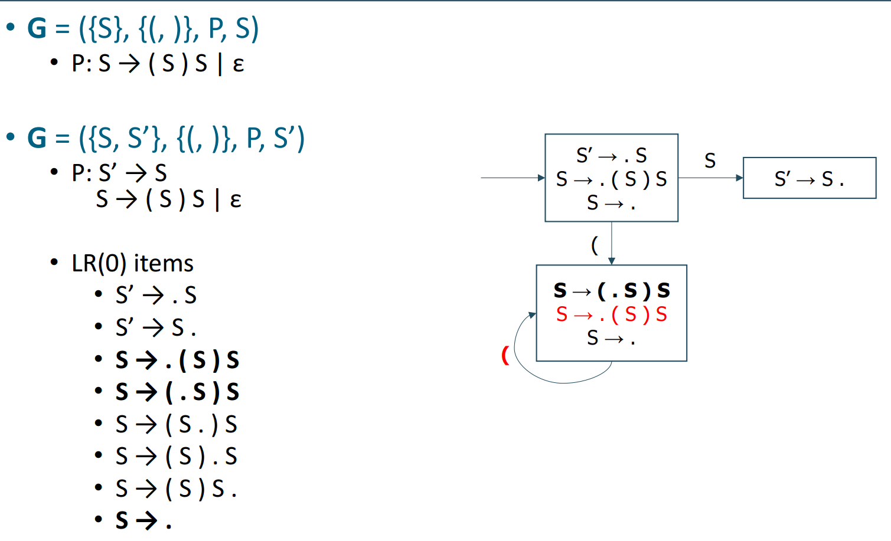

*   **설명**:
    *   **GOTO(I2, S) 연산 → 상태 I3**:
        *   상태 I2 (`{ S → (.S)S, S → .(S)S, S → . }`)에서 점 뒤에 `S`가 있는 아이템 (`S → (.S)S`)을 선택합니다. (주의: `S → .(S)S`는 점 앞에 `(`가 있어야 하므로 여기서는 해당 안 됨)
        *   점을 `S` 뒤로 옮기면 `S → (S.)S` 아이템이 됩니다. 이것이 새 상태 I3의 핵심입니다.
        *   **클로저 연산**: `S → (S.)S`에서 점 뒤는 단말 심볼 `)`이므로, 클로저 연산으로 추가될 아이템이 없습니다.
        *   따라서 상태 I3은 `{ S → (S.)S }` 입니다.
*   **변화**:
    *   새로운 상태 I3 박스가 생성되고, I2에서 I3로 가는 `S` 전이가 추가되었습니다.
    *   이미지의 주석 "현재 분석 상태"가 I2를 가리키고, "다음 상태로의 전이?"는 새로운 전이를 만드는 과정을 나타냅니다.

#### 단계 5: GOTO(I2, `(`) → I2 전이 (루프) 추가

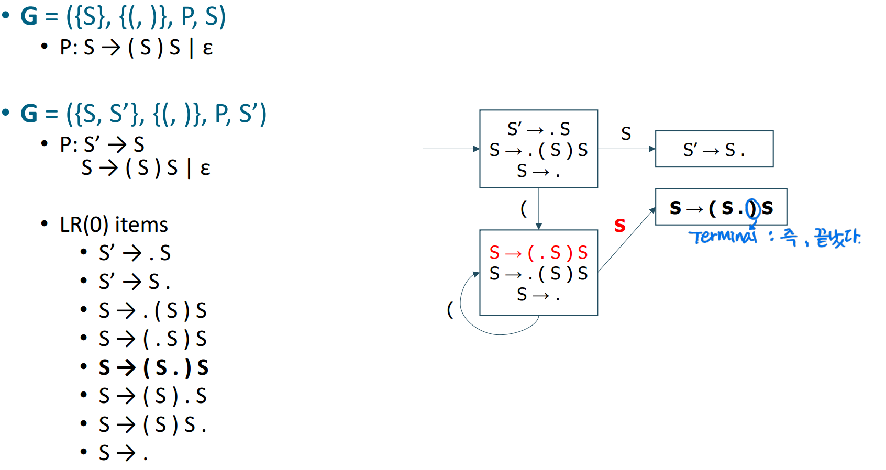

*   **설명**:
    *   **GOTO(I2, `(`) 연산 → 상태 I2 (자기 자신)**:
        *   상태 I2 (`{ S → (.S)S, S → .(S)S, S → . }`)에서 점 뒤에 `(`가 있는 아이템 (`S → .(S)S`)을 선택합니다.
        *   점을 `(` 뒤로 옮기면 `S → (.S)S` 아이템이 됩니다.
        *   이 아이템의 클로저를 계산하면 `{ S → (.S)S, S → .(S)S, S → . }`가 되는데, 이는 상태 I2 자신과 동일합니다.
        *   따라서 GOTO(I2, `(`)는 상태 I2로 돌아오는 루프(loop) 전이가 됩니다.
*   **변화**:
    *   상태 I2에서 자기 자신으로 돌아오는 `(` 레이블의 루프 전이가 추가되었습니다.

#### 단계 6: GOTO(I3, `)`) → I4 전이 추가

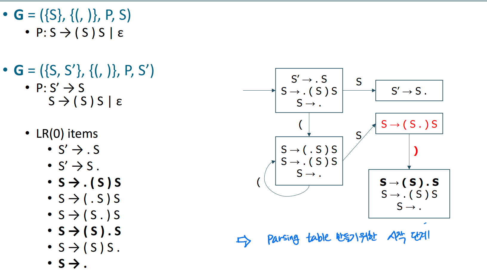

*   **설명**:
    *   **GOTO(I3, `)`) 연산 → 상태 I4**:
        *   상태 I3 (`{ S → (S.)S }`)에서 점 뒤에 `)`가 있는 아이템 (`S → (S.)S`)을 선택합니다.
        *   점을 `)` 뒤로 옮기면 `S → (S).S` 아이템이 됩니다. 이것이 새 상태 I4의 핵심입니다.
        *   **클로저 연산**: `S → (S).S`에서 점 뒤에 비단말 심볼 `S`가 있으므로, `S`로 시작하는 프로덕션 규칙의 아이템들(`S → .(S)S`, `S → .`)을 I4에 추가합니다.
        *   따라서 상태 I4는 `{ S → (S).S, S → .(S)S, S → . }` 입니다.
*   **변화**:
    *   새로운 상태 I4 박스가 생성되고, I3에서 I4로 가는 `)` 전이가 추가되었습니다.
    *   상태 I3의 아이템 `S → (S.)S`에 대한 이미지 주석 "Terminal: 즉, 끝났다"는 점 바로 뒤에 단말 심볼 `)`가 와서 Shift할 준비가 되었음을 의미합니다.

#### 단계 7: GOTO(I4, S) → I5 전이 추가

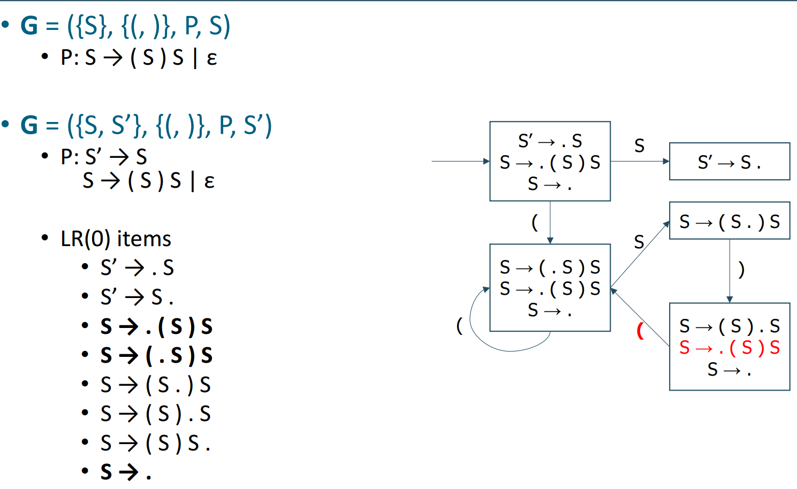

*   **설명**:
    *   **GOTO(I4, S) 연산 → 상태 I5**:
        *   상태 I4 (`{ S → (S).S, S → .(S)S, S → . }`)에서 점 뒤에 `S`가 있는 아이템 (`S → (S).S`)을 선택합니다.
        *   점을 `S` 뒤로 옮기면 `S → (S)S.` 아이템이 됩니다. 이것이 새 상태 I5의 핵심입니다.
        *   **클로저 연산**: `S → (S)S.`는 점이 맨 뒤에 있으므로, 클로저 연산으로 추가될 아이템이 없습니다.
        *   따라서 상태 I5는 `{ S → (S)S. }` 입니다. 이 상태는 `S → (S)S` 규칙으로 Reduce해야 함을 나타냅니다.
*   **변화**:
    *   새로운 상태 I5 박스가 생성되고, I4에서 I5로 가는 `S` 전이가 추가되었습니다.
    *   상태 I4에 대한 이미지 주석 "Parsing table 만들기의 시작 단계"는 이 DFA 상태들이 파싱 테이블을 만드는 데 사용됨을 암시합니다.

#### 단계 8: GOTO(I4, `(`) → I2 전이 추가

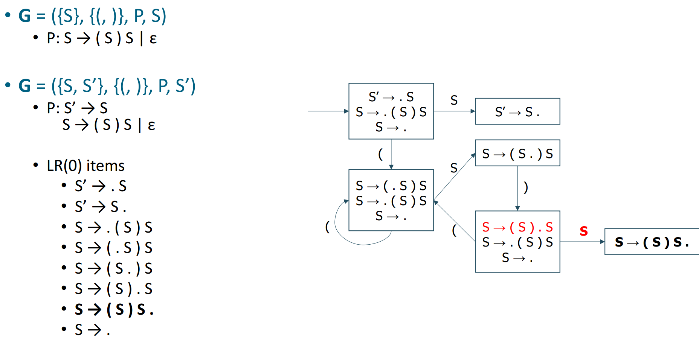

*   **설명**:
    *   **GOTO(I4, `(`) 연산 → 상태 I2**:
        *   상태 I4 (`{ S → (S).S, S → .(S)S, S → . }`)에서 점 뒤에 `(`가 있는 아이템 (`S → .(S)S`)을 선택합니다.
        *   점을 `(` 뒤로 옮기면 `S → (.S)S` 아이템이 됩니다.
        *   이 아이템의 클로저를 계산하면 `{ S → (.S)S, S → .(S)S, S → . }`가 되는데, 이는 상태 I2와 동일합니다.
        *   따라서 GOTO(I4, `(`)는 상태 I2로 가는 전이가 됩니다.
*   **변화**:
    *   상태 I4에서 상태 I2로 가는 `(` 레이블의 전이가 추가되었습니다.

#### 단계 9: 상태 I5 (Reduce 상태)

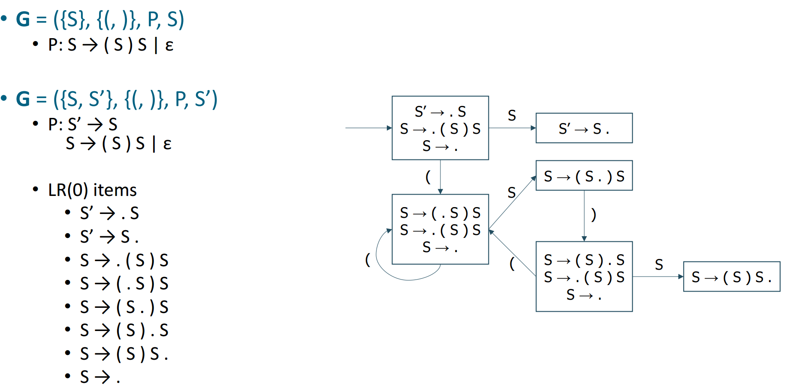

*   **설명**:
    *   이 이미지는 이전 단계에서 만들어진 상태 I5 (`{ S → (S)S. }`)를 보여줍니다.
    *   이 상태의 아이템은 점이 프로덕션 규칙의 맨 끝에 있으므로, 이는 `S → (S)S` 규칙으로 Reduce해야 하는 상태임을 나타냅니다.
    *   이 상태에서는 점 뒤에 더 이상 심볼이 없으므로, 이 상태에서 나가는 새로운 GOTO 전이는 없습니다 (점을 이동시키는 전이).
*   **변화**: 이 이미지는 이전 단계에서 완성된 DFA의 일부를 강조하며, 특별히 새로운 전이가 추가되지는 않았습니다. 다이어그램상으로는 단계 7에서 I5가 이미 그려졌습니다. 이 이미지는 I5가 최종적으로 어떤 모습인지, 그리고 그 다음 전이가 없음을 보여주는 것 같습니다.

#### 단계 10: 완성된 DFA

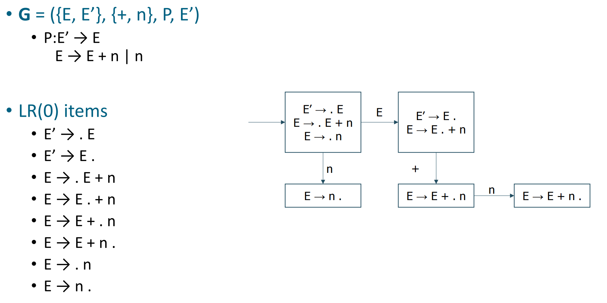

*   **설명**:
    *   이 이미지는 주어진 문법에 대한 LR(0) 아이템들의 유한 오토마타(DFA) 구축이 완료된 모습을 보여줍니다.
    *   모든 가능한 상태(I0부터 I5까지)와 그 상태들 간의 모든 GOTO 전이들이 그려져 있습니다.
    *   상태 I0에는 `S → .` 아이템이 포함되어 있어, `S → ε` 규칙으로 Reduce할 가능성이 있습니다. 동시에 `S → .(S)S` 아이템으로 인해 `(` 심볼에 대해 Shift할 수도 있습니다. 이 문법의 경우, `(`는 FOLLOW(S)에 포함되지 않으므로 Shift-Reduce 충돌이 발생하지 않는다고 단순하게 판단할 수 없습니다. (실제로 이 문법은 LR(0) 문법이 아닙니다. 상태 I0에서 `S → .` (reduce 액션)과 `S → .(S)S` (다음 입력 `(`에 대한 shift 액션)이 공존하여 Shift-Reduce 충돌이 발생합니다. LR(0) 파서는 이러한 충돌을 해결할 수 없습니다.)
*   **변화**: 이전 단계까지의 모든 전이와 상태를 종합하여 최종 DFA를 보여줍니다. 더 이상 새로운 상태나 전이를 추가할 수 없는 시점입니다.

이러한 단계별 DFA 구축 과정은 LR 파싱 테이블을 생성하는 기초가 됩니다. 각 상태는 파싱 테이블의 한 행에 해당하며, GOTO 전이는 테이블의 GOTO 부분을, 아이템의 형태(Shift, Reduce, Accept)는 ACTION 부분을 결정합니다.

### 4. LR(0) 파싱의 특징, 주의사항 및 핵심 요약

* **증강 문법의 중요성**: `S' → S`와 같은 증강 규칙은 파서에게 "언제 파싱을 성공적으로 종료해야 하는지"를 명확히 알려주는 역할을 합니다. 최종적으로 `S' → S.` 아이템에 도달했을 때 파싱은 성공적으로 완료됩니다.
* **상태는 '집합'이다**: DFA의 각 상태는 단일 아이템이 아닌, 문법적으로 의미가 연결된 **아이템들의 집합(클로저)**이라는 점을 명심해야 합니다.
* **충돌(Conflict)의 이해와 종류**:
    LR(0) 파서는 상태 내에 모호성이 발생할 경우 파싱을 진행할 수 없습니다. 이러한 모호성을 충돌(Conflict)이라고 하며, 주로 두 가지 유형이 있습니다. 충돌이 발생하면 해당 문법은 LR(0) 문법이 아니며, SLR, LALR, 또는 LR(1)과 같이 다음 입력 심볼(Lookahead)을 고려하는 더 강력한 파싱 기법이 필요합니다.

    1.  **Shift-Reduce 충돌 (Shift-Reduce Conflict)**:
        *   **정의**: LR(0) 파서의 한 상태(State)에 다음 입력 심볼에 대해 Shift 연산을 수행할 수 있는 아이템과, 동시에 Reduce 연산을 수행할 수 있는 완료 아이템(Complete Item, 예: `A → α.`)이 함께 존재하는 경우 발생합니다. 파서는 다음 토큰을 스택으로 옮겨야 할지(Shift), 아니면 현재 스택의 내용으로 문법 규칙을 적용하여 줄여야 할지(Reduce) 결정할 수 없습니다.
        *   **예시 상황**: 상태 `I`에 `X → α . a β` (다음 토큰 `a`에 대해 Shift 가능)와 `Y → γ .` (Reduce 가능) 아이템이 공존하고, 다음 입력 심볼이 `a`일 수 있는 경우.

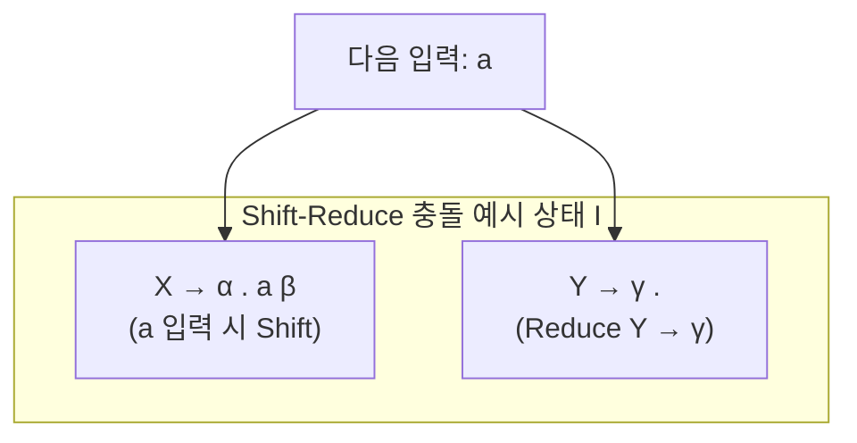

    2.  **Reduce-Reduce 충돌 (Reduce-Reduce Conflict)**:
        *   **정의**: LR(0) 파서의 한 상태에 두 개 이상의 서로 다른 완료 아이템이 존재하여, 어떤 문법 규칙으로 Reduce 연산을 수행해야 할지 결정할 수 없는 경우 발생합니다.
        *   **예시 상황**: 상태 `I`에 `A → α .` 와 `B → β .` 두 완료 아이템이 공존하는 경우. 파서는 `α`를 `A`로 환원해야 할지, `β`를 `B`로 환원해야 할지 선택할 수 없습니다.

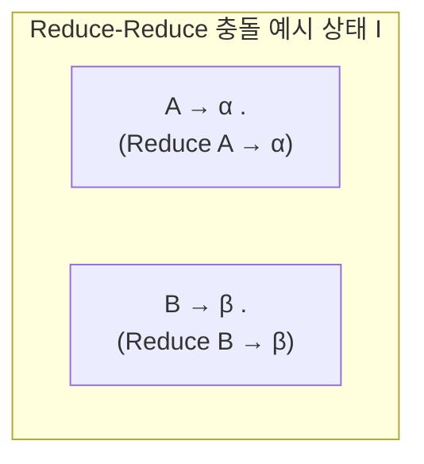

    이러한 충돌은 **LR(0) 파서의 한계점**을 명확히 보여주며, 문법이 더 복잡한 구조를 가질 때 발생하기 쉽습니다. LR(0) 파서는 문맥을 살피지 않고 오직 현재 상태의 아이템들만으로 다음 행동을 결정하기 때문에 이러한 모호성이 발생할 수 있습니다.