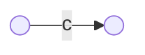
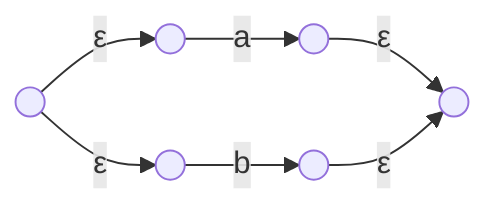
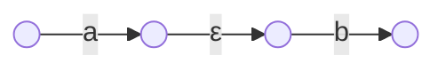
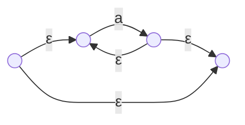
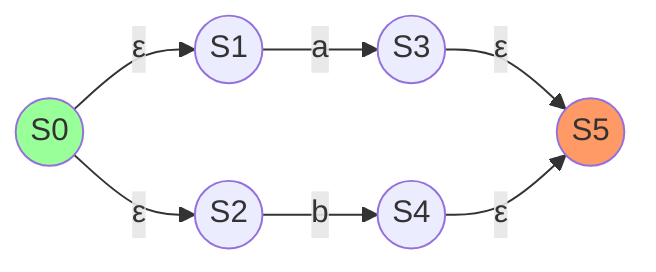
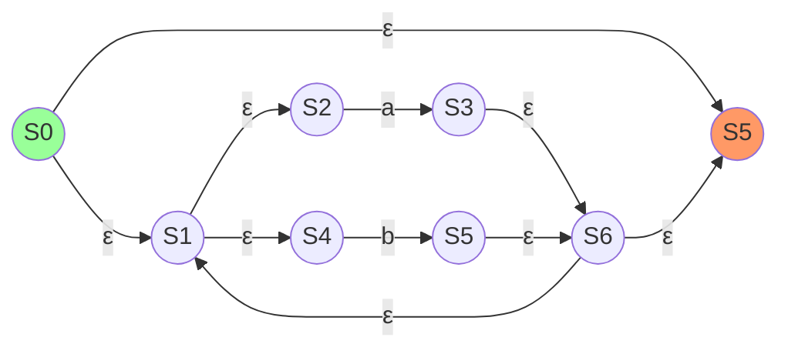
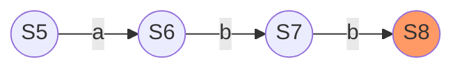
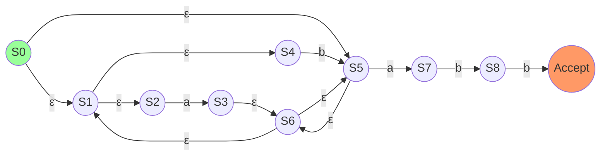

# 정규 표현식 → NFA: Thomson’s Construction

## 1. 개요
- Thomson’s Construction: 정규 표현식을 NFA로 기계적으로 변환
- ε-전이로 작은 NFA 부품을 조합하여 복잡한 표현식 처리

---

## 2. 구성 요소 (Building Blocks)

### 2.1. 문자 (c)
- **설명:** 단일 문자 NFA

### 2.2. 합집합 (Union, R|S)
- **설명:** R 또는 S 중 하나 선택

### 2.3. 연결 (Concatenation, RS)
- **설명:** R 다음에 S 순차 실행

### 2.4. 클레이니 스타 (Kleene Star, R*)
- **설명:** 0번 이상 반복

---

## 3. 예제: `(a|b)*abb`
### 3.1. `a|b` (Union)

| 상태 | a 이동 | b 이동 | ε 이동     |
|:----:|:-------|:-------|:-----------|
| S0   |        |        | {S1, S2}   |
| S1   | a→S3   |        |            |
| S2   |        | b→S4   |            |
| S3   |        |        | {S5}       |
| S4   |        |        | {S5}       |
| S5   |        |        |            |

---
### 3.2. `(a|b)*` (Kleene Star)

| 상태 | a 이동 | b 이동 | ε 이동           |
|:----:|:-------|:-------|:-----------------|
| S0   |        |        | {S1, S5}         |
| S1   |        |        | {S2, S4}         |
| S2   | a→S3   |        |                  |
| S3   |        |        | {S6}             |
| S4   |        | b→S5   |                  |
| S5   |        |        | {S6}             |
| S6   |        |        | {S1, S5}         |

---
### 3.3. `abb` (Concatenation)

| 상태 | a 이동 | b 이동 | ε 이동 |
|:----:|:-------|:-------|:-------|
| S5   | a→S6   |        |        |
| S6   |        | b→S7   |        |
| S7   |        | b→S8   |        |
| S8   |        |        |        |

---
### 3.4. 최종 NFA

| 상태 | a 이동 | b 이동 | ε 이동         |
|:----:|:-------|:-------|:---------------|
| S0   |        |        | {S1, S5}       |
| S1   |        |        | {S2, S4}       |
| S2   | a→S3   |        |                |
| S3   |        |        | {S6}           |
| S4   |        | b→S5   |                |
| S5   |        |        | {S6}           |
| S6   |        |        | {S1, S5}       |
| S7   | a→S7   |        |                |
| S7   |        | b→S8   |                |
| S8   |        | b→S9   |                |
| S9   |        |        |                |

---

> **결론:** Thomson’s Construction을 통해 `(a|b)*abb`를 단계별로 분해·조합하여 정확한 NFA를 만들었습니다.