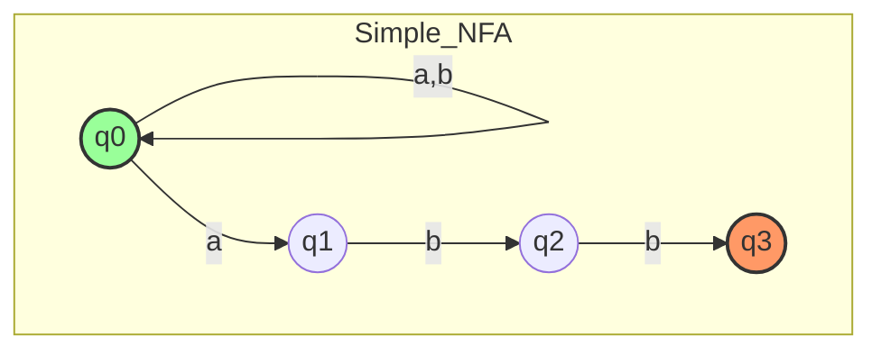
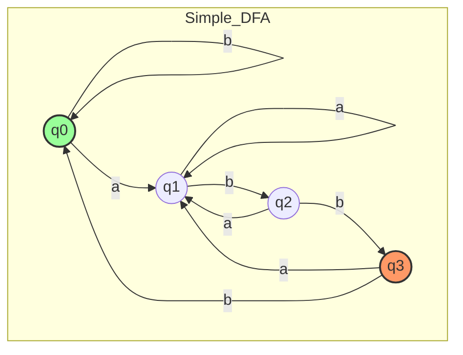
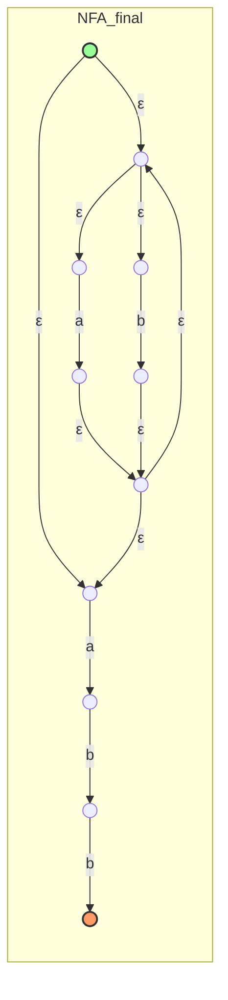
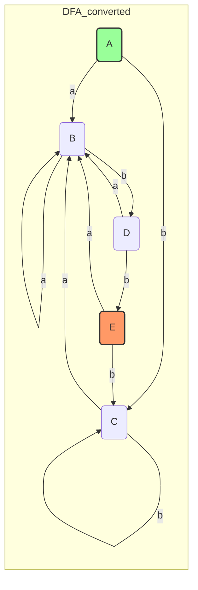

# NFA와 DFA: 정규 표현식부터 최소화까지의 전체 변환 과정

## 1. 개요
- DFA(Deterministic Finite Automaton)와 NFA(Nondeterministic Finite Automaton)는 모두 **정규 언어(Regular Language)**를 인식합니다.
- 컴파일러/렉서에서는 아래 흐름으로 처리합니다:
  1. 정규 표현식 → 2. NFA → 3. DFA → 4. 최소 DFA → 5. 코드 구현

---

## 2. DFA vs NFA 비교

| 구분         | NFA (비결정적)                          | DFA (결정적)                         |
|-------------|-----------------------------------------|--------------------------------------|
| 변환 편의성  | 쉬움 (Easy & Intuitive)                | 직관적이지 않음 (Not Intuitive)      |
| 구현 용이성  | 어려움 (Nondeterministic)<br>입력당 다수 상태 | 쉬움 (Easy)<br>항상 단일 상태        |
| 실행 속도    | 느림 (Slow)<br>모든 경로 추적           | 빠름 (Fast)<br>경로 하나 확정        |
| 상태 수      | 일반적으로 적음                         | 일반적으로 많음                     |
| ε-전이       | 가능                                    | 불가능                              |

> **Tip:** Subset Construction 과정에서 상태 수가 최대 2^n까지 늘어날 수 있습니다. (state explosion)

---

## 3. 변환 흐름도
1. 정규 표현식 → NFA (Thompson's Construction)
2. NFA → DFA (Subset Construction)
3. DFA → 최소 DFA (State Minimization)
4. DFA 구현 예시 (e.g., lex)

---

## 4. 예제: `(a|b)*abb`

### 4.0. 직접 설계 NFA & DFA
- NFA와 DFA를 직접 설계하여 비교해봅니다.





### 4.1. 정규 표현식 → NFA (Thompson's Construction)
- 기본 부품 조합:
  - 문자 NFA: `a`, `b`
  - 연산자: 합집합(`|`), 연결(concat), 클레이니 스타(`*`)
- 최종 NFA 다이어그램:



> **설명:** `ε`-전이를 활용해 각 연산자별 NFA를 조립합니다.

---

### 4.2. NFA → DFA (Subset Construction)
- **ε-closure(T):** T에서 ε 전이만으로 도달 가능한 상태 집합
- **move(T, x):** T의 모든 상태에서 입력 x 후 도달 가능한 상태 집합

1. 시작: A = ε-closure({S0}) = {S0, S1, S2, S4, S7}
2. A → `a`: move(A, a)={S3,S8} → ε-closure → **B={S1,S2,S3,S4,S6,S7,S8}**
3. A → `b`: move(A, b)={S5} → ε-closure → **C={S1,S2,S4,S5,S6,S7}**
4. B, C… 반복하여 새로운 상태 없을 때까지

| DFA 상태 | NFA 상태 집합                         | a 이동  | b 이동  | 최종? |
|---------|----------------------------------------|--------|--------|------|
| A       | {S0,S1,S2,S4,S7}                      | B      | C      |      |
| B       | {S1,S2,S3,S4,S6,S7,S8}                | B      | D      |      |
| C       | {S1,S2,S4,S5,S6,S7}                   | B      | C      |      |
| D       | {S1,S2,S4,S5,S6,S7,S9}                | B      | E      |      |
| E       | {S1,S2,S4,S5,S6,S7,S10}               | B      | C      | ✔    |



---

### 4.3. DFA → 최소 DFA (State Minimization)
1. 초기 분할: {E} (최종), {A,B,C,D} (비최종)
2. 같은 그룹 내에서 입력별 이동 대상 그룹이 다르면 분할
   - D: b→E로 이동 → {D}
   - {A,B,C}: 동일 패턴 → 하나의 그룹 유지 (시작 상태 A는 분리 유지 권장)
3. 반복하여 분할 완료

> **결과:** 예제 DFA는 이미 최소화되어 추가 병합 없음.

---

## 5. 추가 참고
- **시간 복잡도:** Subset Construction O(2^n)
- **ε-전이 제거:** NFA → ε-free NFA 변환
- **정규 문법:** Regular Grammar과 이론적 동등성

## 6. LEX 예제

아래는 `(a|b)*abb` 정규 표현식을 인식하는 간단한 `lex` 파일 예제입니다.

```lex
%{
#include <stdio.h>
%}
%%
(a|b)*abb {
    printf("Matched: %s\n", yytext);
}
. | \n   ;  /* 기타 입력 무시 */
%%
int main(void) {
    yylex();
    return 0;
}
```

### 빌드 및 실행
```bash
lex example.l
cc lex.yy.c -lfl -o example
./example