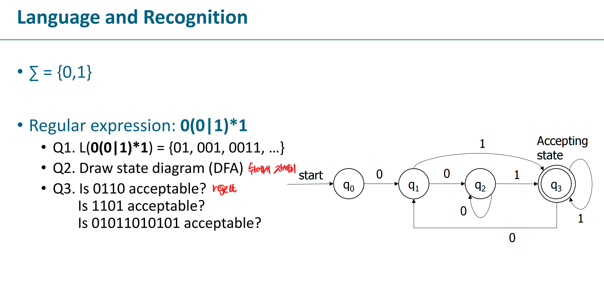
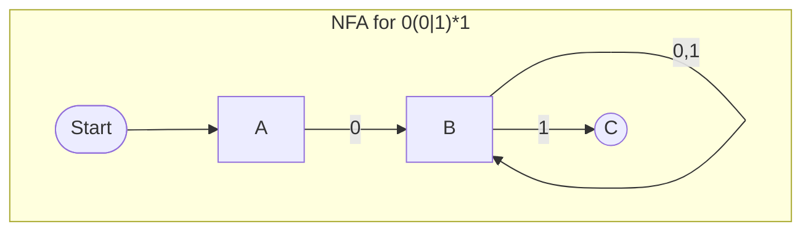
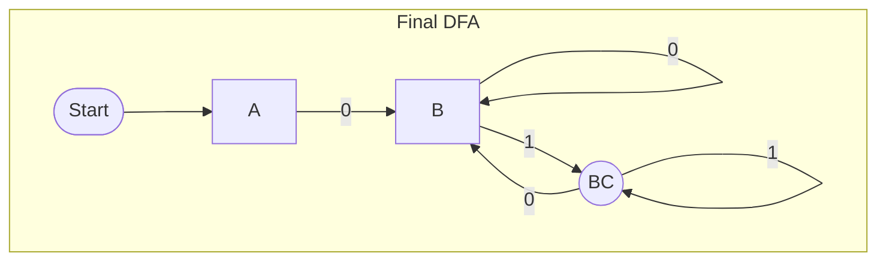

# NFA to DFA 변환: 0(0&#124;1)*1

---

## 1. 정규표현식 및 언어 설명

| 항목             | 내용                                |
|------------------|-------------------------------------|
| **알파벳(Σ)**    | {0, 1}                              |
| **정규표현식**   | 0(0&#124;1)*1                       |
| **L(0(0&#124;1)*1)** | {01, 001, 0011, ...}             |

---

## 2. NFA 상태도

> **NFA 설명**
>
> - **A**에서 0을 받으면 **B**로 갑니다. (0으로 시작)
> - **B**에서는 0이나 1을 받으면 계속 **B**에 머무릅니다. ((0&#124;1)* 부분)
> - **B**에서 1을 받으면 **C**(최종 상태)로 갈 수도 있습니다. (1로 끝남)
> - 즉, **B**에서 1을 받으면 **B**와 **C** 두 곳으로 갈 수 있으므로 NFA입니다.

---

## 3. Subset Construction (NFA → DFA)

### 단계별 DFA 상태 도출

#### 1) S₀ = {A}

| 입력 | 다음 상태      |
|------|---------------|
| 0    | {B} (S₁)      |
| 1    | 오류(∅, Trap) |

#### 2) S₁ = {B}

| 입력 | 다음 상태            |
|------|---------------------|
| 0    | {B} (자기 자신)     |
| 1    | {B, C} (S₂)         |

#### 3) S₂ = {B, C} (수락 상태)

| 입력 | 다음 상태            |
|------|---------------------|
| 0    | {B} (S₁)            |
| 1    | {B, C} (자기 자신)  |

---

## 4. DFA 상태 변환 표

| DFA 상태 | NFA 집합   | 수락 상태? | 0 입력 → | 1 입력 →  |
|:--------:|:----------:|:----------:|:--------:|:----------:|
| **A**    | {A}        | ❌         | **B**    | Trap(∅)    |
| **B**    | {B}        | ❌         | **B**    | **BC**     |
| **BC**   | {B, C}     | ✅         | **B**    | **BC**     |

---

## 5. DFA 상태도

---

## 6. 예제 문자열 판단

| 입력 문자열      | DFA 진행 경로          | Accept? |
|------------------|-----------------------|---------|
| 0110             | A → Trap(∅)           | ❌      |
| 1101             | A → Trap(∅)           | ❌      |
| 01011010101      | A→B→B→BC→B→B→BC→B→B→BC| ✅      |

---

