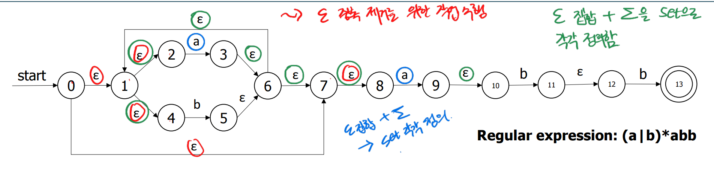
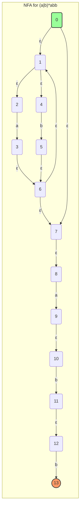
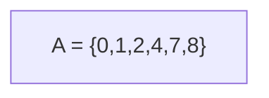
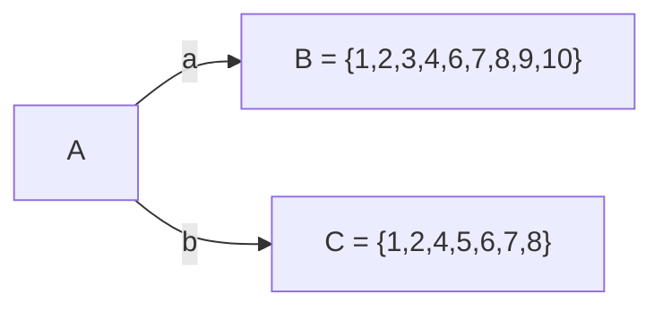
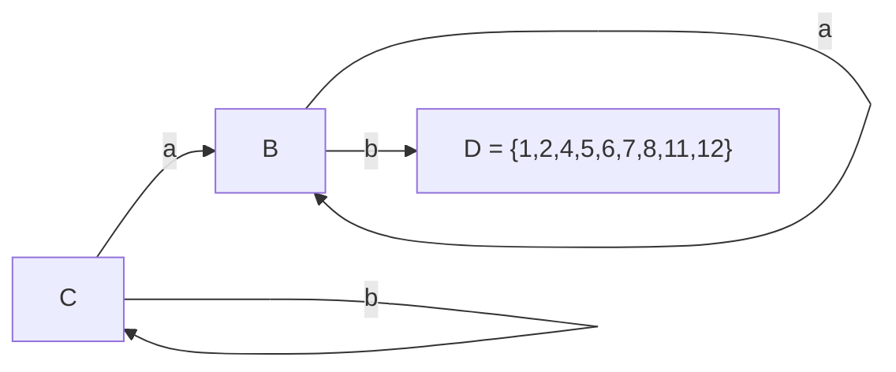
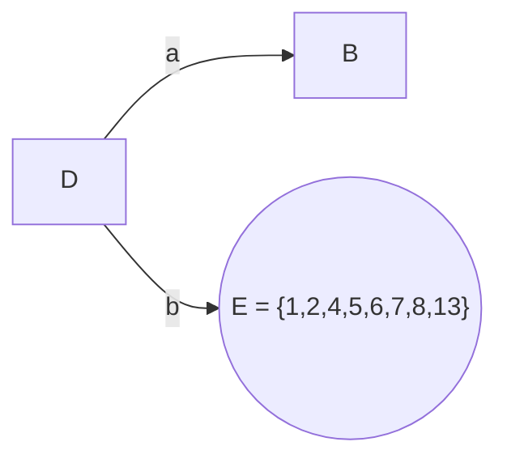
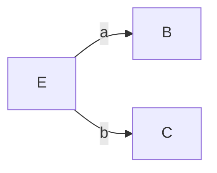
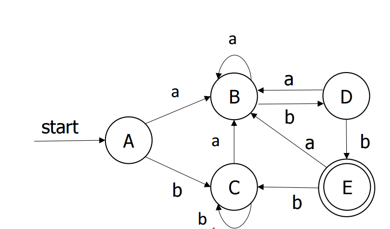
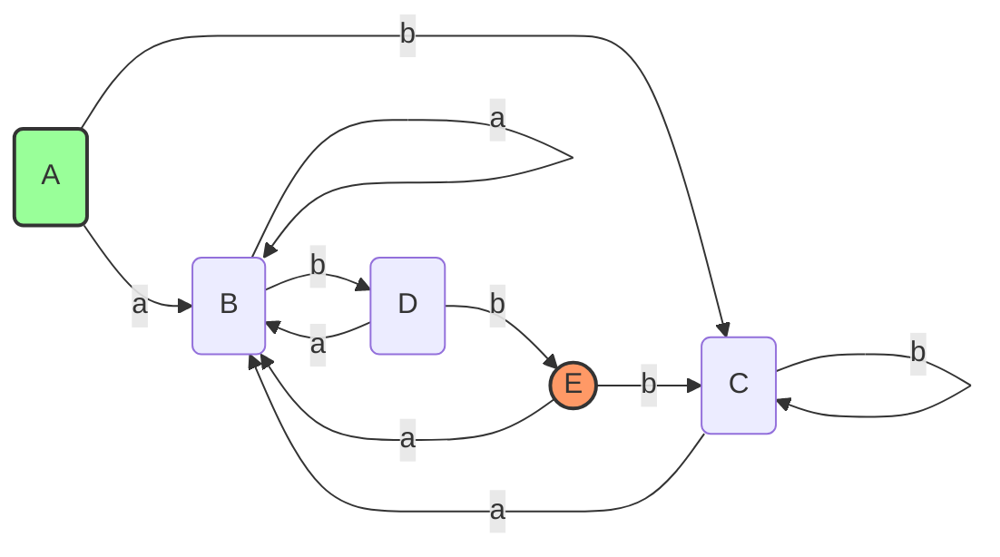

# ε-NFA → DFA 변환 (Subset Construction)

## 개요
- 정규 표현식 `(a|b)*abb`에 대한 ε-NFA를 DFA로 변환하는 **Subset Construction** 절차를 단계별로 설명
- 핵심: NFA의 상태 집합(부분집합)을 DFA의 단일 상태로 매핑하여 결정성 확보

## 핵심 개념
1. **ε-closure(T)**: 집합 T 내의 상태에서 ε 전이만을 따라 도달 가능한 모든 상태 집합 (자기 자신 포함)
2. **move(T, a)**: 집합 T 내의 상태에서 입력 a로 이동 가능한 상태들의 집합

---

## 1. 변환 대상 NFA

---

## 2. Subset Construction 단계

### 2.1. 시작 상태 A (= ε-closure({0}))
- ε-closure({0}) = {0,1,2,4,7,8}

### 2.2. A의 전이: B, C 생성
| 입력 | move       | ε-closure          | DFA 상태 |
|:----:|:-----------|:-------------------|:---------:|
| a    | {3,9}      | {1,2,3,4,6,7,8,9,10} | B         |
| b    | {5}        | {1,2,4,5,6,7,8}       | C         |

### 2.3. B, C의 전이: D 생성
| 상태 | 입력 | move         | ε-closure                | DFA 상태 |
|:----:|:-----|:-------------|:-------------------------|:---------:|
| B    | a    | {3,9}        | {1,2,3,4,6,7,8,9,10}=B    | B (self) |
| B    | b    | {5,11}       | {1,2,4,5,6,7,8,11,12}      | D         |
| C    | a    | {3,9}        | {1,2,3,4,6,7,8,9,10}=B    | B         |
| C    | b    | {5}          | {1,2,4,5,6,7,8}=C          | C (self) |

### 2.4. D의 전이: E 생성 (최종 상태)
| 입력 | move       | ε-closure                | DFA 상태     |
|:----:|:-----------|:-------------------------|:-------------:|
| a    | {3,9}      | {1,2,3,4,6,7,8,9,10}=B   | B            |
| b    | {5,13}     | {1,2,4,5,6,7,8,13}        | E (final)    |

### 2.5. E의 전이 (완료)
- a → B
- b → C

---

## 3. 최종 DFA 요약

### 3.1. 상태 매핑
- A = {0,1,2,4,7,8}
- B = {1,2,3,4,6,7,8,9,10}
- C = {1,2,4,5,6,7,8}
- D = {1,2,4,5,6,7,8,11,12}
- E = {1,2,4,5,6,7,8,13} (최종)

### 3.2. DFA 다이어그램

### 3.3. 전이 테이블
| 상태  | a 입력 | b 입력 |
|:----:|:-------|:-------|
| → A  | B      | C      |
| B    | B      | D      |
| C    | B      | C      |
| D    | B      | E      |
| * E  | B      | C      |

## 검증 및 추가 팁

### 내용 검증
- 테이블과 Mermaid 다이어그램 모두 제공하신 슬라이드 이미지의 계산(ε-closure, move 연산 결과)과 일치합니다.
  - A, B, C, D, E 집합 및 전이 경로가 이미지와 동일하게 표현됨

### 추가 팁
1. **무도달 상태 제거**: 변환 후 생성된 DFA에서 시작 상태로부터 도달할 수 없는 상태는 제거해 보세요.
2. **DFA 최소화**: Hopcroft 알고리즘 등을 이용해 상태를 병합하여 DFA 크기를 줄일 수 있습니다.
3. **상태 라벨링**: 상태 집합을 표기할 때 순서(중괄호 내 원소)는 중요하지 않으므로, 가독성을 위해 오름차순으로 정렬하세요.
4. **단계별 검산**: 각 단계마다 작은 표(또는 스프레드시트)로 ε-closure와 move 결과를 기록하면 오류를 방지할 수 있습니다.
5. **자동화 도구 활용**: JFLAP 같은 시각화 툴을 통해 NFA→DFA 과정을 시뮬레이션하며 학습하면 이해가 더 쉬워집니다.