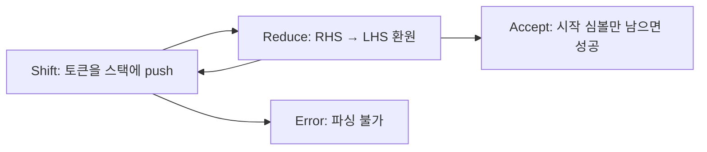
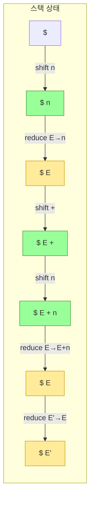
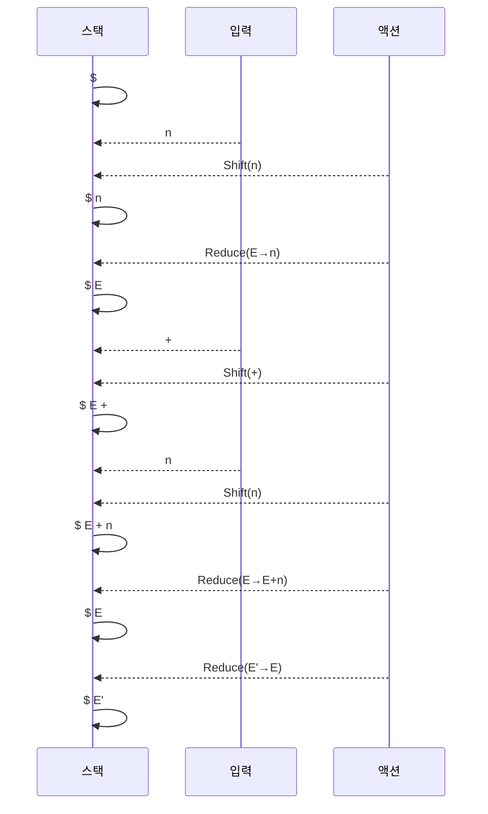
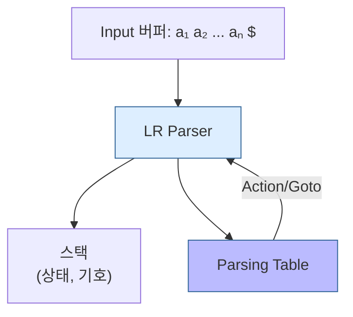
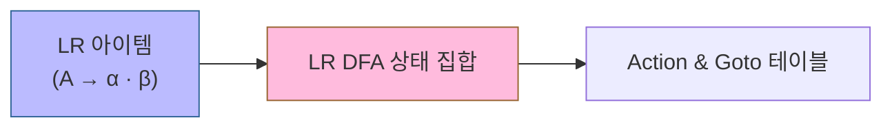
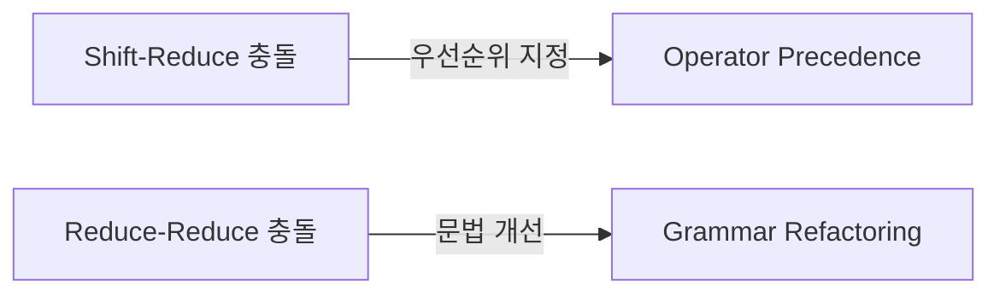
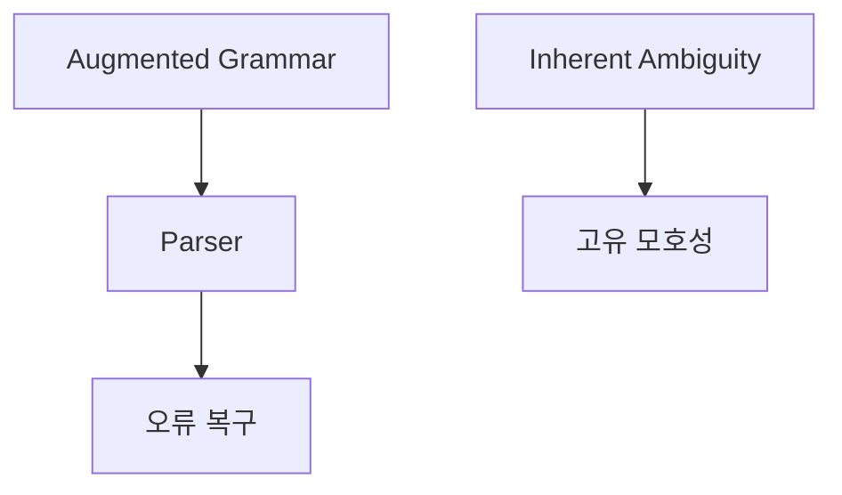
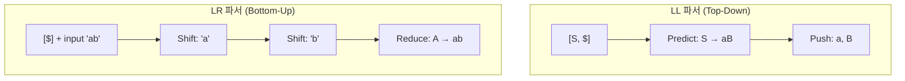

# Bottom-Up 파싱 완전 정복: 개념부터 LR 파싱까지

Bottom-Up 파싱은 입력 문자열을 잎(leaves, 단말 기호)에서부터 시작 심볼(root)으로 환원해 나가는 방식으로, 오른쪽 최단 유도(Rightmost Derivation)를 역추적합니다.

---

## 1. Bottom-Up 파싱 개요
```mermaid
flowchart LR
  A[Leaves (단말 기호)] --> B[Reduce: 프로덕션 역적용]
  B --> C[비단말 기호 환원]
  C --> D{시작 심볼인가?}
  D -- 아니면 --> A
  D -- 예 --> E[Accept]
  classDef accept fill:#cfc,stroke:#393
  class E accept
```

---

## 2. Shift-Reduce 파싱


---

## 3. Handle (핸들) 추적


---

## 4. 예시: `n + n` Shift-Reduce 파싱


---

## 5. LR 파싱 구조


---

## 6. 파싱 테이블 생성


---

## 7. 파싱 충돌 (Conflicts)


---

## 8. 추가 고려사항


## 9. 좌측/우측 최단 유도 및 파싱 방향 차이

### 9.1 유도(Derivation) 방향

| 구분 | 좌측 최단 유도 (Leftmost Derivation) | 우측 최단 유도 (Rightmost Derivation) |
|:----:|:-----------------------------------:|:------------------------------------:|
| 처리 순서 | 가장 왼쪽 비단말 먼저 | 가장 오른쪽 비단말 먼저 |
| 파스 트리 생성 | 위→아래, 왼쪽 자식 우선 | 위→아래, 오른쪽 자식 우선 |
| 핵심 질문 | "다음에 무엇을 만들까?" | "이것은 무엇으로 만들어졌을까?" |

### 9.2 파서 스택 방향 (LL vs LR)



- LL 파서: 스택 최상단에서 비단말을 예측(Predict) 및 확장(Expand).
- LR 파서: 스택 최상단에서 핸들(Handle)을 인식(Reduce).

---
