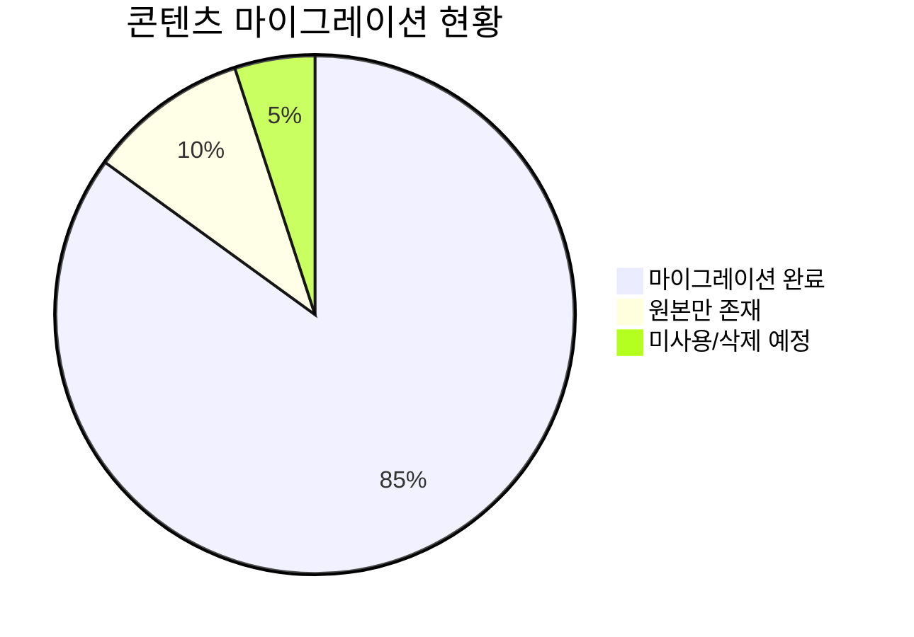

# Legacy Archive

이 디렉토리는 문서 저장소 재구성 과정에서 보관된 기존 문서들을 포함합니다.

> **참고**: 이 폴더의 내용은 대부분 `docs/` 디렉토리로 마이그레이션되었습니다.
> 원본 참조가 필요한 경우에만 이 폴더를 사용하세요.

이 README의 파일 수와 마이그레이션 비율은 **2026-01-11에 기록된 스냅샷**입니다. 현재 파일 시스템의 개수나 이동 완료 여부를 보장하지 않습니다. `완료`, `부분`, `제외` 상태는 원본-대상 파일 대응표, 링크 검사, 내용 비교 기록이 있을 때만 현재 상태로 갱신합니다.

---

## 📁 디렉토리 구조

| 디렉토리 | 파일 수 | 설명 | 마이그레이션 위치 |
|----------|---------|------|-------------------|
| `Algorithm/` | 9 | 알고리즘 및 포인터 사용법 | `docs/algorithms/` |
| `DATABASE/` | 14 | DB 정규화, 트랜잭션, JOIN | `docs/databases/` |
| `Dev/` | 4 | RTC 개념 등 개발 문서 | `docs/development/` |
| `Encryption/` | 1 | 대칭키 암호화 | `docs/security/` |
| `History/` | 1 | 히스토리 문서 | - |
| `Linux/` | 19 | FFmpeg, Proxmox, 시스템 설정 | `docs/linux/` |
| `OS/` | 20 | 스케줄링, 동기화, 데드락 | `docs/os/` |
| `ObjectDetectionApp/` | 2 | 객체 탐지 앱 구조 | `docs/projects/` |
| `QnA-MarkDown/` | 18 | 트러블슈팅, 감정 일기 QnA | `docs/projects/` |
| `compiler/` | 29 | NFA, DFA, 파싱 이론 | `docs/compiler/` |
| `default/` | 4 | 기본 설정 파일 | - |
| `docs-old/` | 99 | 이전 docs 폴더 백업 | `docs/` |
| `documentation-site/` | 0 | (빈 디렉토리) | - |
| `hardware/` | 2 | SSD 가이드 (EAGET) | `docs/infrastructure/hardware/` |
| `java/` | 1 | Java 메모리, 람다, GC | `docs/java/` |
| `middle-east/` | 3 | 중동 관련 문서 | - |
| `module-study/` | 1 | Raspberry Pi GPIO | `docs/infrastructure/` |
| `nginx/` | 6 | Nginx 설정 및 개념 | `docs/nginx/` |
| `nobels/` | 3 | 노벨상 관련 문서 | - |
| `react/` | 2 | React 상태관리, 빌드 | `docs/development/` |

---

## 📋 주요 원본 콘텐츠

### 알고리즘 (Algorithm/)
```
├── pointer_usage_with_wrong_examples.md  # 포인터 잘못된 사용 예시
├── function-ptr-comparison.md            # 함수 포인터 비교
├── 파이썬 OOP 심층 분석.md               # Python OOP vs Java/C++
├── pointer_delete.md                     # 포인터 삭제
└── README.md
```

### 데이터베이스 (DATABASE/)
```
├── DB-normalization_to_FD.md    # 정규화 및 함수 종속성
├── DB-transaction.md            # 트랜잭션
├── DB-total.md                  # DB 종합
├── mariadb_time_zone.md         # MariaDB 타임존
└── 개념/
    └── JOIN.md                  # JOIN 개념
```

### 컴파일러 (compiler/)
```
├── NFA/
│   ├── NFA.md                   # NFA 개념
│   └── Regex_to_NFA.md          # 정규식 → NFA 변환
├── DFA/
│   └── minimal-DFA.md           # 최소화 DFA
├── NFA_to_DFA/
│   └── NFA_and_DFA.md           # NFA-DFA 변환
└── bottom-up-parsing/
    └── conceptual.md            # 상향식 파싱 개념
```

### 운영체제 (OS/)
```
├── scheduling.md                        # CPU 스케줄링
├── chapter06-synchronization-tools.md   # 동기화 도구
├── chapter08-deadlocks.md               # 데드락
├── os_pro_purpose.md                    # OS 프로세스 목적
└── video/
    └── deadlock1.md                     # 데드락 영상 노트
```

### Linux 관련 (Linux/)
```
├── Video-FFmpeg.md              # FFmpeg 비디오 처리
├── start-cfg.md                 # 시작 설정
└── proxmox/
    ├── migration.md             # VM 마이그레이션
    ├── drivemount.md            # 드라이브 마운트
    └── wireguard-vpn.md         # WireGuard VPN
```

---

## 🔄 마이그레이션 상태



### ✅ 완전 마이그레이션된 항목
- 컴파일러 이론 문서 → `docs/compiler/`
- 운영체제 개념 → `docs/os/`
- 데이터베이스 가이드 → `docs/databases/`
- Linux 명령어 및 설정 → `docs/linux/`
- 보안 관련 문서 → `docs/security/`

### ⚠️ 부분 마이그레이션
- `QnA-MarkDown/`: 트러블슈팅 내용 일부 통합 필요
- `Algorithm/`: 고급 포인터 분석 문서 검토 필요

### ❌ 마이그레이션 제외
- `middle-east/`: 특수 프로젝트 문서
- `nobels/`: 비기술 문서
- `History/`: 히스토리 문서

---

## 🗑️ 정리 가이드

### 삭제 후보와 실행 전 조건

아래 명령은 되돌릴 수 있는 검증 절차가 아니라 실제 삭제 명령입니다. 실행 전 대상 파일 목록 보존, `docs/` 대응 경로와 내용 차이 확인, 내부 링크 검색, 복구 가능한 백업과 담당자 승인을 모두 확보해야 합니다. 특히 `docs-old`의 완전 마이그레이션 여부는 이 README의 문구만으로 입증되지 않습니다.
```bash
# 빈 디렉토리 삭제
rm -rf legacy/documentation-site/

# docs-old는 docs/로 완전히 마이그레이션됨
rm -rf legacy/docs-old/  # 확인 후 삭제
```

### 보존 권장 항목
- `Algorithm/`: 원본 분석 코드 포함
- `compiler/`: 상세 이론 문서
- `QnA-MarkDown/`: 프로젝트별 트러블슈팅 기록

삭제 완료는 디렉토리가 사라진 시점이 아니라 대상 문서의 대체 위치가 대응표에 남고, 링크 검사가 통과하며, 복원 시험 결과가 기록된 시점으로 정의합니다.

---

## 📝 참고사항

1. **원본 참조**: 새 문서 작성 시 이 폴더의 원본을 참조하여 누락된 내용 확인
2. **백업 용도**: 필요시 원본 복원을 위한 백업 보관
3. **점진적 정리**: 모든 내용 확인 후 단계적으로 삭제

---

*마지막 업데이트: 2026-01-11*
*마이그레이션 버전: 2.0*
