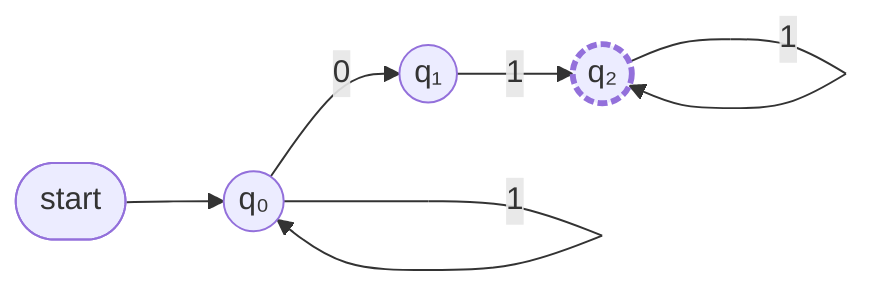

# NFA 예제와 수용 조건

이 문서의 NFA는 `M = (Q, Σ, δ, q₀, F)`로 정의되며, 전이 함수는 `δ: Q × Σ → 2^Q`입니다. 아래 예제에는 ε-전이가 없으므로 입력 기호를 소비하지 않는 이동은 고려하지 않습니다. 문자열을 모두 소비한 뒤 가능한 경로 중 하나라도 `F`의 상태에서 끝나면 문자열을 수용합니다.

## 1. NFA의 5가지 구성 요소

| 구성 요소 | 기호/집합 | 설명 |
|:---:|:---:|:---|
| 상태 | $Q = \{q₀, q₁, q₂\}$ | 오토마타가 가질 수 있는 모든 상태 |
| 입력 알파벳 | $\Sigma = \{0, 1\}$ | 입력에 사용할 수 있는 기호 집합 |
| 시작 상태 | $q₀$ | 입력 처리를 시작하는 상태 |
| 최종 상태 | $F = \{q₂\}$ | 입력을 ‘인정’하는 상태 집합 |
| 전이 함수 | $\delta$ | 상태/입력에 따라 이동할 상태 집합을 정하는 규칙 |

---

## 2. NFA 상태도 (mermaid)

---

## 3. 전이 테이블(Transition Table)

|   | **0** | **1** |
|:-:|:-----:|:-----:|
| **→ q₀** | {q₀, q₁} | {q₀} |
| **q₁**   | ∅        | {q₂} |
| **★ q₂** | {q₂}     | {q₂} |

- **→**: 시작 상태
- **★**: 최종 상태

---

## 4. 설명 및 테이블 해설

- **(q₀, 0)**: q₀에서 0을 입력받으면 **q₀**과 **q₁** 모두로 갈 수 있음 ⇒ {q₀, q₁}
- **(q₀, 1)**: q₀에서 1을 입력받으면 q₀로만 감 ⇒ {q₀}
- **(q₁, 0)**: q₁에서 0은 화살표가 없음 ⇒ ∅
- **(q₁, 1)**: q₁에서 1을 입력받으면 q₂로 이동 ⇒ {q₂}
- **(q₂, 0 or 1)**: q₂에서 0이든 1이든 자기 자신(q₂)으로 루프 ⇒ {q₂}

이 오토마타는 시작 상태 `q₀`에서 계속 입력을 읽다가 `0`에서 `q₁`로 분기하고, 바로 다음 `1`에서 `q₂`에 도달할 수 있습니다. 따라서 인식 언어는 알파벳 `{0, 1}` 위에서 부분 문자열 `01`을 포함하는 모든 문자열입니다. 다른 분기가 `q₀`에 남더라도 하나의 분기가 `q₂`에서 입력을 모두 소비하면 수용됩니다.

---
