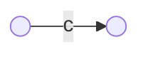
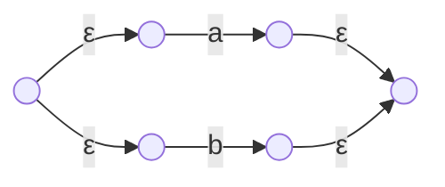
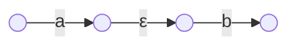
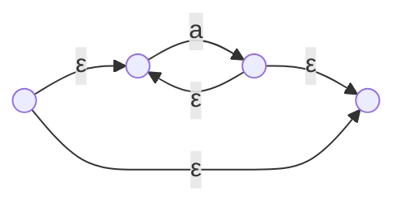
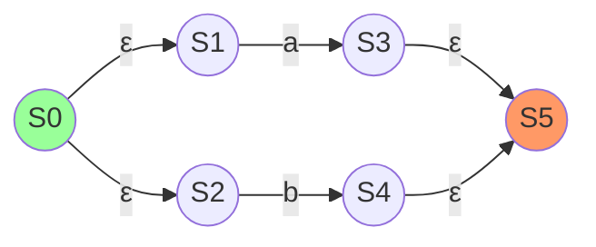
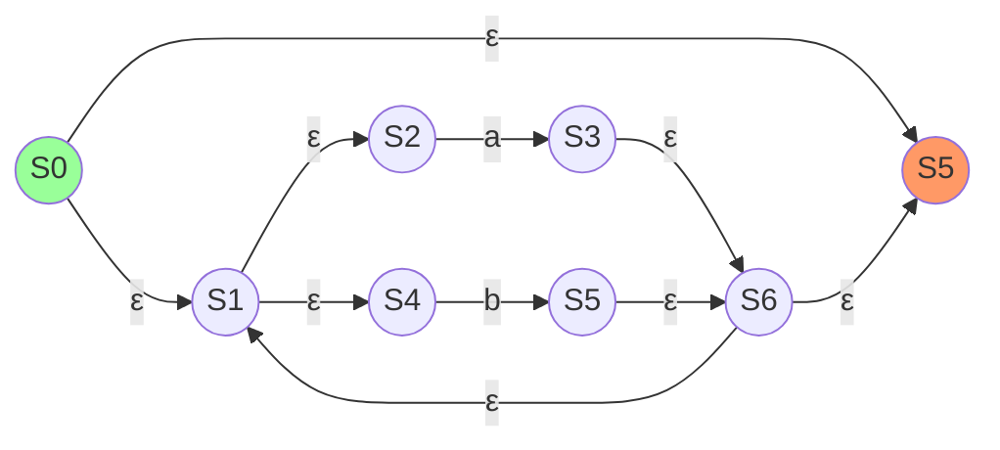
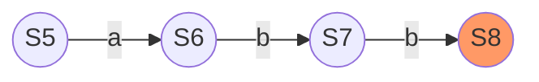
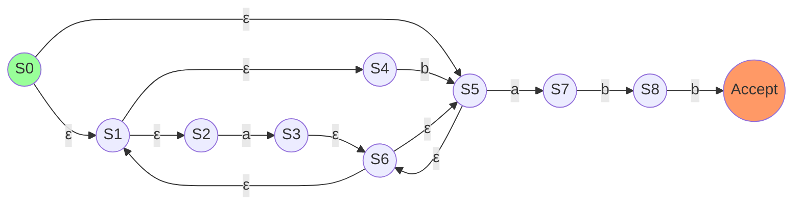

# 정규 표현식 → NFA: Thompson 구성법

## 1. 개요
- **Thompson 구성법(Thompson's construction)**: 정규 표현식의 구문 트리를 따라 ε-NFA 조각을 조합하는 변환 절차
- **이 문서의 입력 문법**: 문자, 합집합(`|`), 연결, 클레이니 스타(`*`), 괄호
- **구성 불변식**: 각 조각은 진입 상태 하나와 이탈 상태 하나를 가지며, 조합 뒤에도 인식 언어가 원래 정규 표현식과 같아야 함

예제의 상태 이름은 설명용 식별자입니다. 상태 번호 자체가 의미를 갖는다고 가정하지 말고, 시작 상태·수락 상태·기호 전이·ε-전이의 집합으로 결과를 판정합니다.

---

## 2. 구성 요소 (Building Blocks)

### 2.1. 문자 (c)
- **설명:** 단일 문자 NFA

### 2.2. 합집합 (Union, R|S)
- **설명:** R 또는 S 중 하나 선택

### 2.3. 연결 (Concatenation, RS)
- **설명:** R 다음에 S 순차 실행

### 2.4. 클레이니 스타 (Kleene Star, R*)
- **설명:** 0번 이상 반복

---

## 3. 예제: `(a|b)*abb`
### 3.1. `a|b` (Union)

| 상태 | a 이동 | b 이동 | ε 이동     |
|:----:|:-------|:-------|:-----------|
| S0   |        |        | {S1, S2}   |
| S1   | a→S3   |        |            |
| S2   |        | b→S4   |            |
| S3   |        |        | {S5}       |
| S4   |        |        | {S5}       |
| S5   |        |        |            |

---
### 3.2. `(a|b)*` (Kleene Star)

| 상태 | a 이동 | b 이동 | ε 이동           |
|:----:|:-------|:-------|:-----------------|
| S0   |        |        | {S1, S5}         |
| S1   |        |        | {S2, S4}         |
| S2   | a→S3   |        |                  |
| S3   |        |        | {S6}             |
| S4   |        | b→S5   |                  |
| S5   |        |        | {S6}             |
| S6   |        |        | {S1, S5}         |

---
### 3.3. `abb` (Concatenation)

| 상태 | a 이동 | b 이동 | ε 이동 |
|:----:|:-------|:-------|:-------|
| S5   | a→S6   |        |        |
| S6   |        | b→S7   |        |
| S7   |        | b→S8   |        |
| S8   |        |        |        |

---
### 3.4. 최종 NFA

| 상태 | a 이동 | b 이동 | ε 이동         |
|:----:|:-------|:-------|:---------------|
| S0   |        |        | {S1, S5}       |
| S1   |        |        | {S2, S4}       |
| S2   | a→S3   |        |                |
| S3   |        |        | {S6}           |
| S4   |        | b→S5   |                |
| S5   |        |        | {S6}           |
| S6   |        |        | {S1, S5}       |
| S7   | a→S7   |        |                |
| S7   |        | b→S8   |                |
| S8   |        | b→S9   |                |
| S9   |        |        |                |

---

> **검산 기준:** `(a|b)*abb`의 구성 결과는 알파벳 `{a,b}` 위에서 접미사가 `abb`인 문자열을 수락하고, `abb`로 끝나지 않는 문자열을 거부해야 합니다. 빈 문자열, `abb`, `aabb`, `babb`, `ab`, `abba`를 상태 집합 시뮬레이션으로 확인해야 변환을 완료했다고 판단할 수 있습니다.
