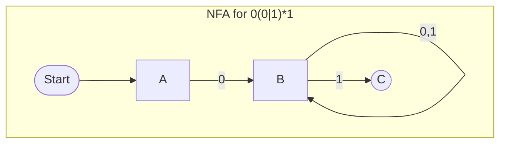
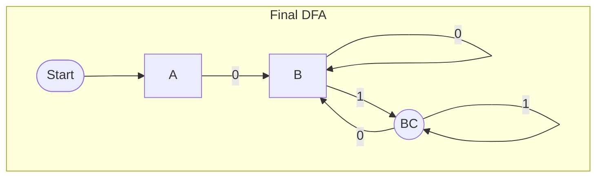

# NFA에서 DFA로 변환: `0(0|1)*1`

---

## 1. 정규표현식 및 언어 설명

| 항목             | 내용                                |
|------------------|-------------------------------------|
| **알파벳(Σ)**    | {0, 1}                              |
| **정규표현식**   | 0(0&#124;1)*1                       |
| **인식 언어** | `{ w ∈ {0,1}* | w의 길이는 2 이상이고 첫 기호와 마지막 기호가 0과 1 }` |

---

## 2. NFA 상태도

> **NFA 설명**
>
> - **A**에서 0을 받으면 **B**로 갑니다. (0으로 시작)
> - **B**에서는 0이나 1을 받으면 계속 **B**에 머무릅니다. ((0&#124;1)* 부분)
> - **B**에서 1을 받으면 **C**(최종 상태)로 갈 수도 있습니다. (1로 끝남)
> - 즉, **B**에서 1을 받으면 **B**와 **C** 두 곳으로 갈 수 있으므로 NFA입니다.

---

## 3. Subset Construction (NFA → DFA)

### 단계별 DFA 상태 도출

#### 1) S₀ = {A}

| 입력 | 다음 상태      |
|------|---------------|
| 0    | {B} (S₁)      |
| 1    | 오류(∅, Trap) |

#### 2) S₁ = {B}

| 입력 | 다음 상태            |
|------|---------------------|
| 0    | {B} (자기 자신)     |
| 1    | {B, C} (S₂)         |

#### 3) S₂ = {B, C} (수락 상태)

| 입력 | 다음 상태            |
|------|---------------------|
| 0    | {B} (S₁)            |
| 1    | {B, C} (자기 자신)  |

---

## 4. DFA 상태 변환 표

| DFA 상태 | NFA 집합   | 수락 상태? | 0 입력 → | 1 입력 →  |
|:--------:|:----------:|:----------:|:--------:|:----------:|
| **A**    | {A}        | ❌         | **B**    | Trap(∅)    |
| **B**    | {B}        | ❌         | **B**    | **BC**     |
| **BC**   | {B, C}     | ✅         | **B**    | **BC**     |

표를 완전한 DFA로 사용할 때는 `Trap(∅)` 행과 `0`, `1`에 대한 자기 전이도 포함해야 합니다. 아래 그림은 핵심 도달 상태를 강조한 축약도입니다.

---

## 5. DFA 상태도

---

## 6. 예제 문자열 판단

| 입력 문자열      | DFA 진행 경로          | Accept? |
|------------------|-----------------------|---------|
| 0110             | A → B → BC → BC → B   | ❌      |
| 1101             | A → Trap(∅)           | ❌      |
| 01011010101      | A→B→B→BC→B→B→BC→B→B→BC| ✅      |

수락 여부는 경로 중 수락 상태를 한 번 방문했는지가 아니라, 입력을 모두 소비한 뒤의 상태로 판정합니다. 따라서 `0110`은 중간에 `BC`를 지나지만 마지막 상태가 `B`이므로 거부됩니다.

---

