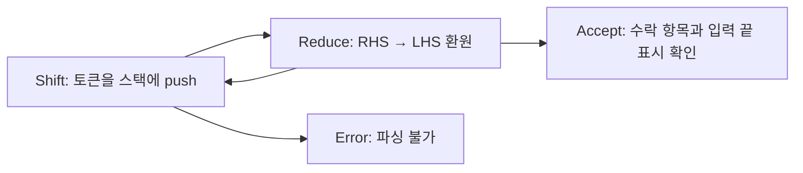
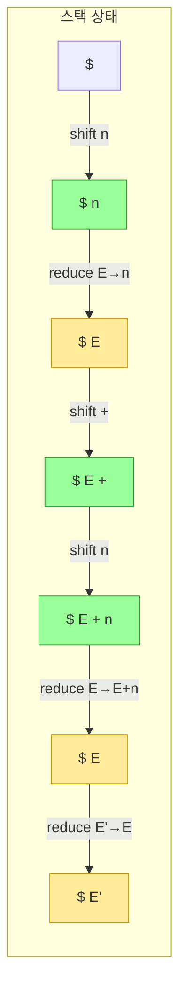
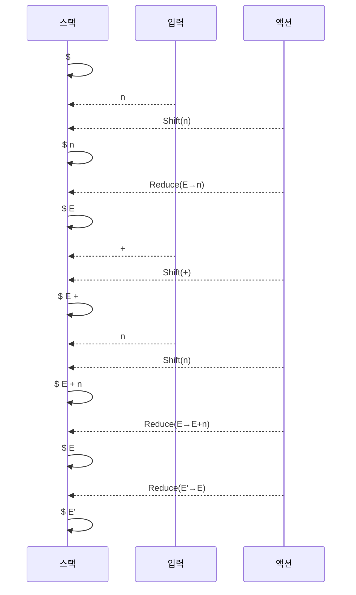
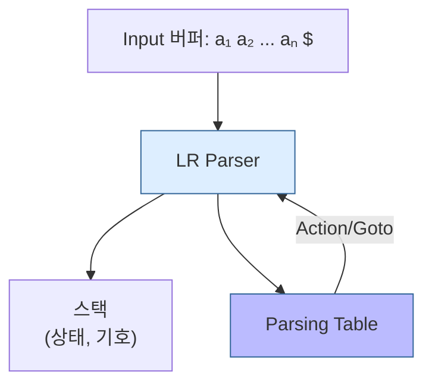
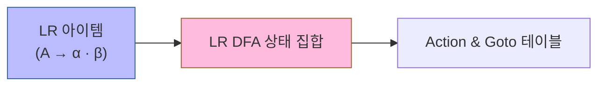
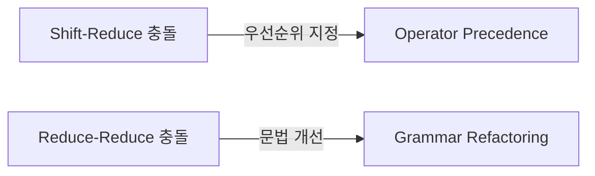
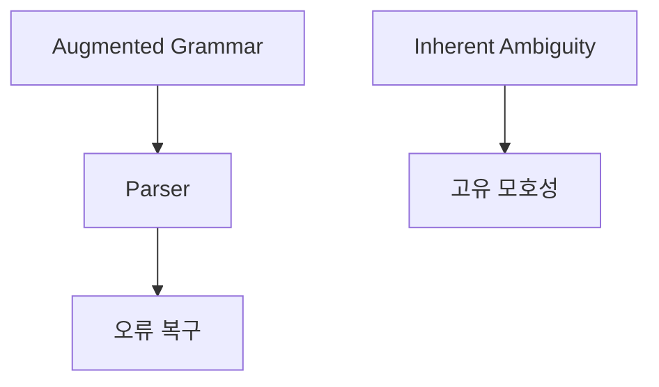
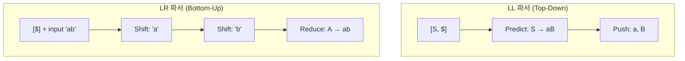

# Bottom-Up 파싱: 환원, 핸들, LR 판정

Bottom-Up 파싱은 입력 문자열을 문법의 시작 기호로 환원하며 **우측 유도(rightmost derivation)의 역순**을 구성합니다. 이 문서의 그림은 개념 흐름을 보여 주며, 실제 shift/reduce 결정은 현재 상태, lookahead 토큰, 파싱 테이블로 판정합니다.

학습 완료 기준은 주어진 문법과 입력에 대해 스택·남은 입력·파서 행동을 단계별로 기록하고, 각 reduce가 유효한 핸들을 선택했는지 설명하는 것입니다. 단순히 스택에 시작 기호가 나타나는 것만으로 수락하지 않으며, 증강 문법의 수락 항목과 입력 끝 표시가 함께 맞아야 합니다.

---

## 1. Bottom-Up 파싱 개요
```mermaid
flowchart LR
  A[Leaves (단말 기호)] --> B[Reduce: 프로덕션 역적용]
  B --> C[비단말 기호 환원]
  C --> D{시작 심볼인가?}
  D -- 아니면 --> A
  D -- 예 --> E[Accept]
  classDef accept fill:#cfc,stroke:#393
  class E accept
```

---

## 2. Shift-Reduce 파싱


---

## 3. Handle (핸들) 추적


---

## 4. 예시: `n + n` Shift-Reduce 파싱


---

## 5. LR 파싱 구조


---

## 6. 파싱 테이블 생성


---

## 7. 파싱 충돌 (Conflicts)


우선순위 선언이나 문법 재작성은 가능한 해결 수단이지 자동 정답이 아닙니다. 선택한 규칙이 의도한 결합법칙과 우선순위를 보존하는지 충돌 문자열과 파스 트리로 확인합니다.

---

## 8. 추가 고려사항


## 9. 좌측/우측 최단 유도 및 파싱 방향 차이

### 9.1 유도(Derivation) 방향

| 구분 | 좌측 최단 유도 (Leftmost Derivation) | 우측 최단 유도 (Rightmost Derivation) |
|:----:|:-----------------------------------:|:------------------------------------:|
| 처리 순서 | 가장 왼쪽 비단말 먼저 | 가장 오른쪽 비단말 먼저 |
| 파스 트리 생성 | 위→아래, 왼쪽 자식 우선 | 위→아래, 오른쪽 자식 우선 |
| 핵심 질문 | "다음에 무엇을 만들까?" | "이것은 무엇으로 만들어졌을까?" |

### 9.2 파서 스택 방향 (LL vs LR)



- LL 파서: 스택 최상단에서 비단말을 예측(Predict) 및 확장(Expand).
- LR 파서: 스택 최상단에서 핸들(Handle)을 인식(Reduce).

---
