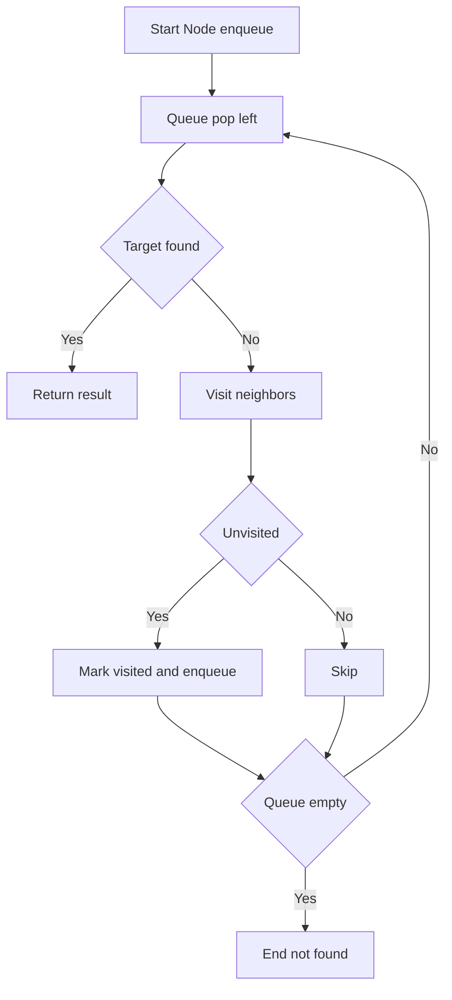
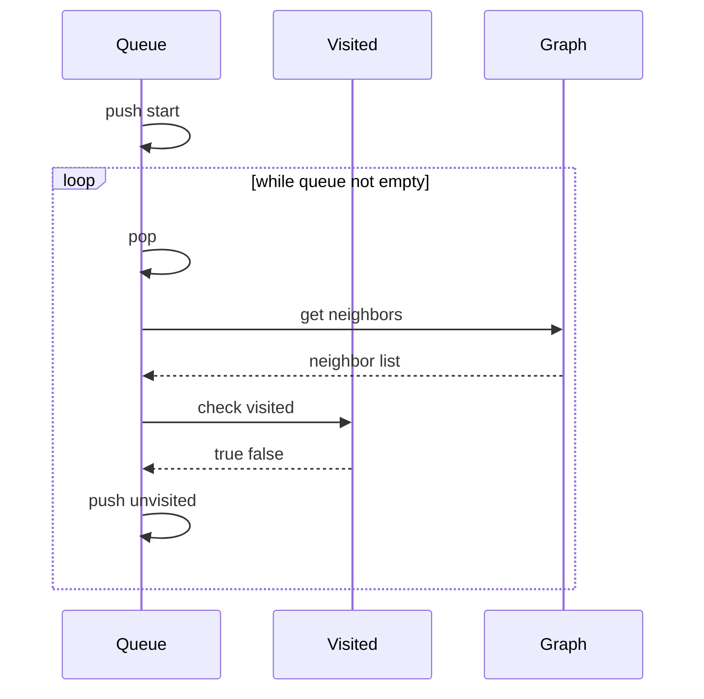

# BFS (너비 우선 탐색) - GitHub Pages 해설

## 문서 목적
- 원본 템플릿 `01-graph/01-bfs.md` 의 내부 동작을 GitHub Markdown에서 바로 읽을 수 있게 설명합니다.
- 코드 레이어(초기화/루프/조건/갱신/종료)를 분해하고, Mermaid로 제어 흐름을 시각화합니다.
- 실전 문제에 붙일 때 반드시 수정해야 하는 지점을 체크리스트로 제공합니다.

## 원본 템플릿
- Source: [01-graph/01-bfs.md](https://github.com/choisimo/document/blob/main/code/templates/algorithm-architect/01-graph/01-bfs.md)

## 내부 메커니즘 (Flow)


## 내부 상호작용 (Sequence)


## 핵심 코드
```python
# [BFS 템플릿: 아키텍트 버전]
# Use Case: 최단 거리, 최소 이동 횟수, 레벨별 탐색
# Components: Queue (FIFO), Visited Set
# Constraint: 큐에 넣을 때 방문 처리 필수 (중복 방지)

def bfs(start_node, graph, target=None):
    # 1. 초기화 (Initialization Layer)
    #    - 큐 생성, 시작점 삽입, 방문 처리
    queue = [start_node]
    visited = {start_node}
    
    # 2. 메인 루프 (Process Loop)
    #    - 큐가 빌 때까지 반복
    while queue:
        current = queue.pop(0)
        
        # 3. 비즈니스 로직 (Core Logic)
        #    - (필요하다면) 여기서 정답 체크 혹은 데이터 가공
        if target and current == target:
            return current
        
        # 4. 확장 로직 (Expansion Layer)
        #    - 연결된 노드 탐색 및 조건 필터링
        for neighbor in graph[current]:
            if neighbor not in visited:
                visited.add(neighbor)
                queue.append(neighbor)
    
    return None  # 탐색 실패
```

## 코드 레이어 해설
- **Initialization**: 상태 테이블/포인터/큐/스택/부모 배열 등 탐색의 기준 상태를 만든다.
- **Process Loop / Recursion**: 입력 공간을 순회하며 상태 전이를 반복한다.
- **Decision Rule**: 분기 조건(완화 가능 여부, 유효 선택 여부, 종료 조건)을 적용한다.
- **State Update**: 거리/DP/집합/결과 배열을 갱신하고 다음 단계로 전달한다.
- **Termination**: 목표 도달, 범위 소진, 큐/스택 고갈, 사이클 검출 등으로 종료한다.

## 실전 적용 체크리스트
- 입력 자료구조 형식(인접 리스트, 간선 리스트, 정렬 여부, 1-index/0-index)을 먼저 고정한다.
- 시간 복잡도 한계에 맞게 자료구조를 교체한다 (`list.pop(0)` -> `deque.popleft` 등).
- 실패/예외 경로를 명시한다 (도달 불가, 음수 사이클, 빈 결과, 사이클 존재).
- 테스트는 최소 3개: 정상 케이스, 경계 케이스, 반례 케이스를 포함한다.
