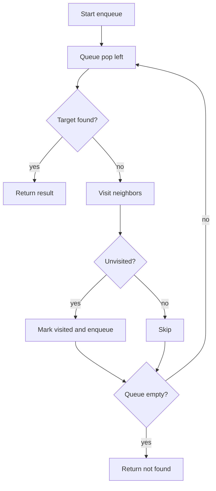

# BFS 너비 우선 탐색 학습 및 기록 노트

> 💡 **이 글을 쓰는 이유:** BFS는 "가까운 상태부터 차례대로 본다"는 단순한 규칙으로 최단 거리, 최소 이동 횟수, 레벨별 탐색 문제를 푼다. 하지만 방문 처리 시점과 큐 자료구조를 잘못 잡으면 중복 방문, 시간 초과, 잘못된 거리 계산이 바로 터진다.

---

## 1. 왜 필요한가? (Pain Point & Motivation)

* **이 개념이 구원해 줄 문제:** 그래프나 격자에서 시작점으로부터 가장 적은 간선 수로 도달하는 경로를 찾아야 할 때 필요하다.
* **대안들의 한계 (기존의 똥떵어리들):** DFS로도 모든 노드를 볼 수는 있지만, 먼저 찾은 경로가 최단 경로라는 보장이 없다. 방문 처리를 늦게 하면 같은 노드가 큐에 여러 번 들어가고, `list.pop(0)` 같은 구현은 입력이 커질수록 병목이 된다.

## 2. 현재 나의 상태 (Baseline)

* **여기까진 안다 (익숙한 땅):** BFS는 FIFO 큐와 방문 집합을 사용한다.
* **뇌정지 오는 부분 (안개 속):** 방문 처리를 "큐에 넣을 때" 해야 하는지, "큐에서 뺄 때" 해야 하는지 헷갈리기 쉽다.
* **아직은 무리 (워너비):** 거리 배열, 부모 추적, 여러 시작점, 격자 이동처럼 문제별 상태를 자연스럽게 확장해야 한다.

## 3. 도달하고 싶은 목표 (Target State)

* **이 글을 끝내고 할 수 있는 일:** 시작 노드, 그래프, 목표 조건이 주어졌을 때 BFS의 큐 상태와 방문 상태를 단계별로 추적할 수 있다.
* **이것만은 건지자 (최소 성공 기준):** 큐에 넣는 순간 방문 처리해야 중복 삽입을 막을 수 있다는 규칙을 설명하고 코드로 구현한다.

## 4. 시스템 번역 (Data Flow)

*이 개념을 하나의 살아있는 함수나 파이프라인으로 바라보고 해부해 봅니다.*

* **📥 인풋 (Input):** 시작 노드, 인접 리스트/격자, 목표 노드 또는 종료 조건
* **⚙️ 프로세스 (Processing):** 시작점을 큐에 넣고 방문 처리한 뒤, 큐가 빌 때까지 앞에서 꺼낸 노드의 미방문 이웃을 뒤에 넣는다.
* **📤 아웃풋 (Output):** 목표 노드, 최단 거리, 방문 순서, 부모 경로, 또는 도달 불가 판정
* **💾 상태 (State):** FIFO 큐, 방문 집합, 거리 배열, 부모 배열, 현재 노드
* **🚨 터지는 조건 (Exception):** 방문 처리가 늦거나, 큐 구현이 비효율적이거나, 그래프 키가 없거나, 도달 불가 케이스를 처리하지 않는 경우

## 5. 핵심 구성요소 (Building Blocks)

* **레고 블록 1 (Queue):** 다음에 처리할 노드를 FIFO 순서로 보관한다.
* **레고 블록 2 (Visited):** 이미 큐에 들어갔거나 처리된 노드를 기록해 중복 탐색을 막는다.
* **레고 블록 3 (Expansion Rule):** 현재 노드의 이웃 중 아직 방문하지 않은 노드만 큐에 추가한다.
* **서로 어떻게 맞물려 돌아가는가?:** 큐가 레벨 순서를 보장하고, 방문 집합이 중복 삽입을 막으며, 확장 규칙이 다음 레벨의 후보를 만든다.

## 6. 상태 전이 (State Transition)

*상태가 어떻게 변하는지 흐름을 한눈에 보여줍니다. (표 안의 문장은 짧고 직관적으로!)*

| 초기 상태 | 이벤트 (트리거) | 전이 조건 | 변경 후 상태 | "바뀐 걸 어떻게 알지?" (관찰 방법) |
| :--- | :--- | :--- | :--- | :--- |
| `INIT` | 시작 노드 입력 | 시작 노드가 유효함 | `QUEUED` | 큐와 방문 집합에 시작 노드 존재 |
| `QUEUED` | `popleft()` | 큐가 비어 있지 않음 | `VISITING` | 현재 노드가 큐 앞에서 제거됨 |
| `VISITING` | 이웃 순회 | 이웃이 미방문임 | `EXPANDED` | 이웃이 방문 처리되고 큐 뒤에 추가됨 |
| `VISITING` | 목표 확인 | 목표 노드와 일치함 | `FOUND` | 현재 거리 또는 노드 반환 |
| `QUEUED` | 큐가 비어 있음 | 더 볼 후보가 없음 | `NOT_FOUND` | 도달 불가 반환 |

## 7. 불변식 (Invariant: 절대 깨지면 안 되는 규칙)

* **하늘이 무너져도 지켜야 할 조건:** 어떤 노드도 큐에 두 번 이상 들어가면 안 된다.
* **이게 깨지면 생기는 대참사:** 같은 노드가 반복 삽입되어 시간 복잡도가 커지고, 거리 계산이나 부모 경로가 오염될 수 있다.
* **수수방관 금지 (검증법):** 이웃을 큐에 넣기 직전에 방문 처리하고, 테스트에서 사이클 그래프를 반드시 포함한다.

## 8. 가장 작은 예제 (Minimal Viable Example)

* **뇌컴파일이 가능한 수준의 인풋:** `A -> B, C`, `B -> D`, `C -> D`, 목표 `D`
* **한 스텝씩 뜯어보기:** `A`를 큐에 넣고 시작한다. `A`를 꺼내 `B`, `C`를 방문 처리하며 큐에 넣는다. `B`를 꺼내 `D`를 방문 처리한다. 이후 `D`를 꺼내 목표를 찾는다.
* **해피 엔딩 (결과):** `A -> B -> D` 또는 이웃 순서에 따라 같은 거리의 최단 경로를 얻는다.



```python
from collections import deque


def bfs(start_node, graph, target=None):
    queue = deque([start_node])
    visited = {start_node}

    while queue:
        current = queue.popleft()

        if target is not None and current == target:
            return current

        for neighbor in graph.get(current, []):
            if neighbor in visited:
                continue
            visited.add(neighbor)
            queue.append(neighbor)

    return None
```

## 9. 실패 사례 (What could go wrong?)

* **폭망 시나리오 1:** 큐에서 꺼낼 때 방문 처리해서 같은 노드가 여러 부모에게서 중복 삽입된다.
* **폭망 시나리오 2:** Python 리스트의 `pop(0)`을 사용해 매번 O(n) 이동 비용을 낸다.
* **폭망 시나리오 3:** 도달 불가일 때 `None`, `-1`, 빈 경로 중 무엇을 반환할지 정하지 않아 호출부가 깨진다.
* **범인 검거 (어떤 불변식이 깨졌나?):** 큐에 중복 노드를 넣지 않는다는 7번 불변식이 깨졌다.

## 10. 뇌 확장하기 (Evolution & Variants)

* **조건을 살짝 바꾸면?:** 간선 가중치가 모두 1이면 BFS가 최단 거리를 보장하지만, 가중치가 다르면 Dijkstra나 Bellman-Ford로 넘어가야 한다.
* **비슷한 놈들과 계급장 떼고 비교하기:** DFS는 깊게 파고들어 연결성/백트래킹에 좋고, BFS는 가까운 레벨부터 보므로 최소 이동 횟수에 좋다.
* **다른 데서 써먹기:** 미로 탐색, 소셜 그래프 거리, 웹 크롤링 depth 제한, 퍼즐 최소 이동 문제에 그대로 적용할 수 있다.

## 11. 최종 체크리스트 (Definition of Done)

*글 작성 후 아래 항목을 채웠는지 확인하는 셀프 검토용 목록이다.*

- [x] 1초 만에 이해하는 한 문장 요약이 있는가?
- [x] 일목요연한 상태 전이 표를 채웠는가?
- [x] 머릿속 그림을 표현한 구조도(다이어그램)가 포함되었는가?
- [x] 직접 굴려본 실습 결과(코드/로그)를 첨부했는가?
- [x] 에러를 마주하고 해결한 오답 노트가 있는가?
- [x] 주니어 동료에게 막힘없이 설명할 수 있는 수준인가?

## 12. 뇌에 새기는 복습 문장 (TL;DR Blank)

*복습 시 이 문장만 보고도 핵심을 떠올릴 수 있도록 빈칸을 채운다.*

> 이 개념은 결국 **가까운 상태부터 보며 최단 이동 횟수를 찾는 문제**를 해결하기 위해 태어났고,
> 우리가 계속 감시해야 할 핵심 상태는 **queue와 visited** 이며,
> **미방문 이웃을 발견하는** 조건이 발동할 때 상태가 바뀐다.
> 그리고 무슨 일이 있어도 **어떤 노드도 큐에 두 번 이상 들어가면 안 된다** 라는 불변식은 반드시 유지되어야만 한다!
