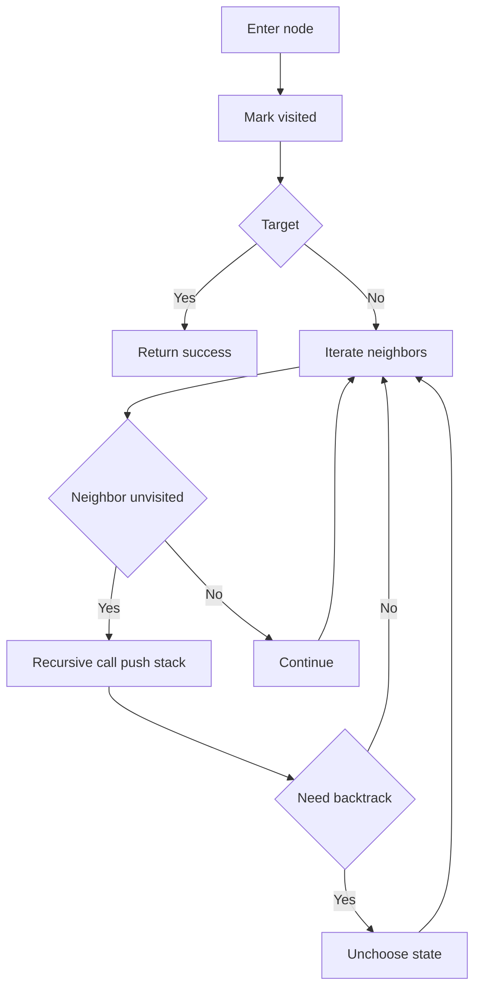
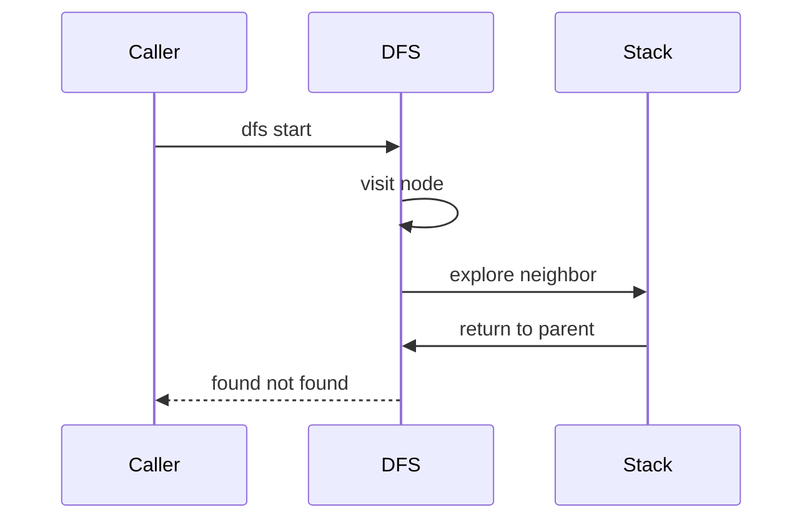

# DFS (깊이 우선 탐색) - GitHub Pages 해설

## 문서 목적
- 원본 템플릿 `01-graph/02-dfs.md` 의 내부 동작을 GitHub Markdown에서 바로 읽을 수 있게 설명합니다.
- 코드 레이어(초기화/루프/조건/갱신/종료)를 분해하고, Mermaid로 제어 흐름을 시각화합니다.
- 실전 문제에 붙일 때 반드시 수정해야 하는 지점을 체크리스트로 제공합니다.

## 입력 계약과 완료 판정

- 예제는 인접 리스트와 `1..n` 정점 번호를 가정합니다.
- 방향 그래프와 무방향 그래프는 간선 입력 방식이 다릅니다. 무방향 간선은 양쪽 인접 목록에 넣습니다.
- 순회 순서는 인접 목록 정렬과 재귀 호출 순서에 따라 달라집니다.
- 재귀 구현은 깊은 경로에서 언어의 재귀 한도를 넘을 수 있으므로 입력 상한에 따라 명시적 스택을 선택합니다.

완료 조건은 시작점에서 도달 가능한 각 정점을 한 번 방문하고, 사이클에서도 종료하며, 필요한 경우 모든 미방문 정점에서 다시 시작해 연결 성분 전체를 포함하는 것입니다.

## 원본 템플릿
- Source: [01-graph/02-dfs.md](https://github.com/choisimo/document/blob/main/code/templates/algorithm-architect/01-graph/02-dfs.md)

## 내부 메커니즘 (Flow)


## 내부 상호작용 (Sequence)


## 핵심 코드
```python
# [DFS 템플릿: 아키텍트 버전]
# Use Case: 경로 탐색, 사이클 검출, 연결 요소 찾기
# Components: Stack (LIFO) 또는 재귀
# Constraint: 백트래킹 시 방문 해제 필요한 경우 있음

# [DFS 재귀 버전]
def dfs_recursive(node, graph, visited=None, target=None):
    # 1. 초기화 (Initialization Layer)
    #    - 방문 집합 생성 (최초 호출 시)
    if visited is None:
        visited = set()
    
    # 2. 방문 처리 (Visit Layer)
    visited.add(node)
    
    # 3. 비즈니스 로직 (Core Logic)
    #    - 목표 발견 시 조기 종료
    if target and node == target:
        return True
    
    # 4. 재귀 확장 (Recursive Expansion)
    #    - 인접 노드로 깊이 우선 탐색
    for neighbor in graph[node]:
        if neighbor not in visited:
            if dfs_recursive(neighbor, graph, visited, target):
                return True
    
    return False
```

## 코드 레이어 해설
- **Initialization**: 상태 테이블/포인터/큐/스택/부모 배열 등 탐색의 기준 상태를 만든다.
- **Process Loop / Recursion**: 입력 공간을 순회하며 상태 전이를 반복한다.
- **Decision Rule**: 분기 조건(완화 가능 여부, 유효 선택 여부, 종료 조건)을 적용한다.
- **State Update**: 거리/DP/집합/결과 배열을 갱신하고 다음 단계로 전달한다.
- **Termination**: 목표 도달, 범위 소진, 큐/스택 고갈, 사이클 검출 등으로 종료한다.

## 실전 적용 체크리스트
- 입력 자료구조 형식(인접 리스트, 간선 리스트, 정렬 여부, 1-index/0-index)을 먼저 고정한다.
- 시간 복잡도 한계에 맞게 자료구조를 교체한다 (`list.pop(0)` -> `deque.popleft` 등).
- 실패/예외 경로를 명시한다 (도달 불가, 음수 사이클, 빈 결과, 사이클 존재).
- 테스트는 최소 3개: 정상 케이스, 경계 케이스, 반례 케이스를 포함한다.
