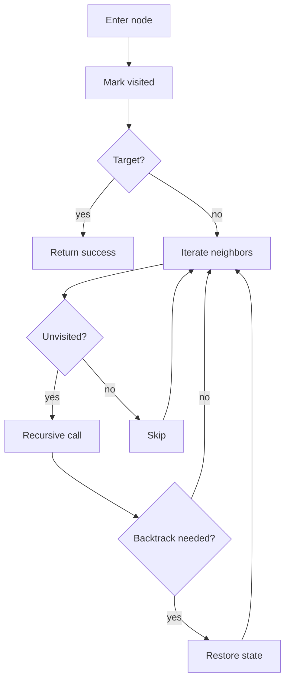

# DFS 깊이 우선 탐색 학습 및 기록 노트

> 💡 **이 글을 쓰는 이유:** DFS는 한 갈래를 끝까지 파고든 뒤 돌아오는 탐색 방식이다. 경로 존재 여부, 연결 요소, 사이클 검출, 백트래킹 문제에서 계속 등장하지만, 방문 상태와 재귀 스택을 구분하지 못하면 무한 재귀나 잘못된 경로 판정이 생긴다.

---

## 1. 왜 필요한가? (Pain Point & Motivation)

* **이 개념이 구원해 줄 문제:** 그래프나 상태 공간에서 가능한 경로를 깊게 따라가며 도달 가능성, 연결성, 사이클, 모든 조합을 탐색해야 할 때 필요하다.
* **대안들의 한계 (기존의 똥떵어리들):** BFS는 가까운 레벨부터 보는 데 강하지만, 한 경로를 따라 조건을 누적하거나 백트래킹으로 선택을 되돌리는 문제에는 DFS가 더 자연스럽다.

## 2. 현재 나의 상태 (Baseline)

* **여기까진 안다 (익숙한 땅):** DFS는 재귀 호출 또는 명시적 스택으로 구현할 수 있고, 방문 집합으로 중복 탐색을 막는다.
* **뇌정지 오는 부분 (안개 속):** 일반 그래프 탐색에서는 방문을 유지하지만, 백트래킹 문제에서는 선택을 되돌리며 방문을 해제해야 하는 경우가 있다.
* **아직은 무리 (워너비):** 재귀 종료 조건, 사이클 검출용 상태, 경로 복원용 부모/스택을 문제에 맞게 구분해야 한다.

## 3. 도달하고 싶은 목표 (Target State)

* **이 글을 끝내고 할 수 있는 일:** DFS의 진입, 방문 처리, 이웃 확장, 재귀 복귀, 백트래킹 단계를 손으로 추적할 수 있다.
* **이것만은 건지자 (최소 성공 기준):** 재귀 DFS에서 종료 조건과 방문 처리 위치를 정확히 잡고, 백트래킹 여부를 문제 성격에 따라 판단한다.

## 4. 시스템 번역 (Data Flow)

*이 개념을 하나의 살아있는 함수나 파이프라인으로 바라보고 해부해 봅니다.*

* **📥 인풋 (Input):** 시작 노드, 인접 리스트/격자, 목표 조건, 선택 가능 후보
* **⚙️ 프로세스 (Processing):** 현재 노드에 진입해 방문 처리하고, 아직 방문하지 않은 이웃으로 재귀 호출 또는 스택 push를 반복한다.
* **📤 아웃풋 (Output):** 도달 여부, 방문 순서, 연결 요소, 사이클 여부, 가능한 경로/조합
* **💾 상태 (State):** 방문 집합, 재귀 호출 스택, 현재 경로, 완료 여부, 백트래킹 선택 상태
* **🚨 터지는 조건 (Exception):** 종료 조건이 없거나, 사이클 그래프에서 방문 처리를 하지 않거나, 백트래킹 후 상태 복구를 빠뜨리는 경우

## 5. 핵심 구성요소 (Building Blocks)

* **레고 블록 1 (Visit):** 현재 노드를 처리하고 방문 집합에 기록한다.
* **레고 블록 2 (Recursive Expansion):** 아직 방문하지 않은 이웃으로 깊게 들어간다.
* **레고 블록 3 (Backtrack):** 문제에 따라 경로 선택이나 방문 상태를 되돌린다.
* **서로 어떻게 맞물려 돌아가는가?:** 방문 처리가 무한 순환을 막고, 재귀 확장이 깊이를 만들며, 복귀 단계가 다음 후보 탐색을 가능하게 한다.

## 6. 상태 전이 (State Transition)

*상태가 어떻게 변하는지 흐름을 한눈에 보여줍니다. (표 안의 문장은 짧고 직관적으로!)*

| 초기 상태 | 이벤트 (트리거) | 전이 조건 | 변경 후 상태 | "바뀐 걸 어떻게 알지?" (관찰 방법) |
| :--- | :--- | :--- | :--- | :--- |
| `READY` | `dfs(node)` 호출 | 노드가 유효함 | `VISITING` | 재귀 스택에 노드가 올라감 |
| `VISITING` | 방문 처리 | 아직 방문하지 않음 | `VISITED` | visited에 노드 추가 |
| `VISITED` | 이웃 선택 | 미방문 이웃 존재 | `DESCEND` | 자식 노드로 재귀 호출 |
| `DESCEND` | 자식 호출 종료 | 더 깊이 갈 곳 없음 | `RETURNING` | 부모 호출로 복귀 |
| `RETURNING` | 백트래킹 필요 | 선택 상태를 되돌려야 함 | `RESTORED` | path/visited가 이전 상태로 복구 |

## 7. 불변식 (Invariant: 절대 깨지면 안 되는 규칙)

* **하늘이 무너져도 지켜야 할 조건:** 순수 그래프 방문 DFS에서는 이미 방문한 노드로 다시 들어가면 안 된다.
* **이게 깨지면 생기는 대참사:** 사이클이 있는 그래프에서 무한 재귀가 발생하거나, 같은 연결 요소를 여러 번 세게 된다.
* **수수방관 금지 (검증법):** 사이클 그래프와 자기 자신을 가리키는 노드를 테스트에 넣고, 재귀 깊이와 visited 변화를 확인한다.

## 8. 가장 작은 예제 (Minimal Viable Example)

* **뇌컴파일이 가능한 수준의 인풋:** `A -> B, C`, `B -> D`, `C -> D`, 목표 `D`
* **한 스텝씩 뜯어보기:** `A`에 진입해 방문 처리한다. 이웃 `B`로 들어가고, 다시 `D`로 들어가 목표를 찾는다. 목표를 찾으면 `True`를 부모 호출로 전파한다.
* **해피 엔딩 (결과):** 한 경로를 깊게 따라가며 `A -> B -> D` 도달을 확인한다.



```python
def dfs_recursive(node, graph, visited=None, target=None):
    if visited is None:
        visited = set()

    visited.add(node)

    if target is not None and node == target:
        return True

    for neighbor in graph.get(node, []):
        if neighbor in visited:
            continue
        if dfs_recursive(neighbor, graph, visited, target):
            return True

    return False
```

## 9. 실패 사례 (What could go wrong?)

* **폭망 시나리오 1:** 방문 집합 없이 사이클 그래프를 탐색해 무한 재귀에 빠진다.
* **폭망 시나리오 2:** 백트래킹 문제에서 방문 해제를 하지 않아 다른 경로 후보가 막힌다.
* **폭망 시나리오 3:** 재귀 깊이가 입력 크기만큼 커지는 문제에서 스택 오버플로우가 발생한다.
* **범인 검거 (어떤 불변식이 깨졌나?):** 방문한 노드로 다시 들어가면 안 된다는 7번 불변식이 깨졌거나, 백트래킹 상태 복구 규칙을 잘못 적용했다.

## 10. 뇌 확장하기 (Evolution & Variants)

* **조건을 살짝 바꾸면?:** 재귀 제한이 걱정되면 명시적 스택으로 바꾸고, 방향 그래프 사이클 검출은 `visiting/visited`처럼 색상 상태를 나눈다.
* **비슷한 놈들과 계급장 떼고 비교하기:** BFS는 최단 레벨 탐색에 강하고, DFS는 깊은 경로 탐색과 백트래킹에 강하다.
* **다른 데서 써먹기:** 파일 시스템 순회, 의존성 그래프 분석, 퍼즐 백트래킹, 연결 요소 계산, 위상 정렬의 기반으로 쓸 수 있다.

## 11. 최종 체크리스트 (Definition of Done)

*글 작성 후 아래 항목을 채웠는지 확인하는 셀프 검토용 목록이다.*

- [x] 1초 만에 이해하는 한 문장 요약이 있는가?
- [x] 일목요연한 상태 전이 표를 채웠는가?
- [x] 머릿속 그림을 표현한 구조도(다이어그램)가 포함되었는가?
- [x] 직접 굴려본 실습 결과(코드/로그)를 첨부했는가?
- [x] 에러를 마주하고 해결한 오답 노트가 있는가?
- [x] 주니어 동료에게 막힘없이 설명할 수 있는 수준인가?

## 12. 뇌에 새기는 복습 문장 (TL;DR Blank)

*복습 시 이 문장만 보고도 핵심을 떠올릴 수 있도록 빈칸을 채운다.*

> 이 개념은 결국 **한 경로를 끝까지 파고들며 도달 가능성과 구조를 확인하는 문제**를 해결하기 위해 태어났고,
> 우리가 계속 감시해야 할 핵심 상태는 **visited와 recursion stack** 이며,
> **미방문 이웃으로 내려가거나 재귀 호출에서 복귀하는** 조건이 발동할 때 상태가 바뀐다.
> 그리고 무슨 일이 있어도 **순수 그래프 방문 DFS에서는 이미 방문한 노드로 다시 들어가면 안 된다** 라는 불변식은 반드시 유지되어야만 한다!
