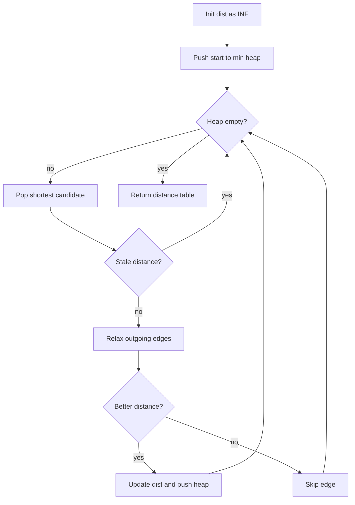

# 다익스트라 최단 경로 학습 및 기록 노트

> 💡 **이 글을 쓰는 이유:** 다익스트라는 "현재까지 가장 가까운 노드부터 확정한다"는 탐욕 규칙으로 양의 가중치 그래프의 최단 거리를 구한다. 하지만 음수 가중치가 있거나, 우선순위 큐에서 오래된 거리 값을 걸러내지 않으면 알고리즘의 전제가 무너진다.

---

## 1. 왜 필요한가? (Pain Point & Motivation)

* **이 개념이 구원해 줄 문제:** 간선마다 비용이 다른 그래프에서 시작점으로부터 각 노드까지의 최소 비용을 빠르게 계산해야 할 때 필요하다.
* **대안들의 한계 (기존의 똥떵어리들):** BFS는 간선 비용이 모두 같을 때만 최단 거리를 보장한다. 모든 간선을 무식하게 반복 완화하면 입력이 커질 때 비용이 커지고, 음수 간선이 없는 상황에서는 다익스트라가 더 직접적인 선택이다.

## 2. 현재 나의 상태 (Baseline)

* **여기까진 안다 (익숙한 땅):** 거리 배열을 무한대로 초기화하고 시작점 거리를 0으로 둔 뒤, min-heap에서 가장 짧은 후보를 꺼낸다.
* **뇌정지 오는 부분 (안개 속):** 같은 노드가 우선순위 큐에 여러 번 들어갈 수 있고, 나중에 꺼낸 값이 이미 최신 최단 거리보다 오래된 값일 수 있다.
* **아직은 무리 (워너비):** 음수 가중치가 있으면 왜 깨지는지, 그리고 도달 불가 노드를 어떻게 표현할지 문제 요구사항에 맞춰 처리해야 한다.

## 3. 도달하고 싶은 목표 (Target State)

* **이 글을 끝내고 할 수 있는 일:** 우선순위 큐와 거리 테이블이 어떻게 상호작용하면서 최단 거리를 확정하는지 단계별로 추적할 수 있다.
* **이것만은 건지자 (최소 성공 기준):** 모든 간선 가중치가 0 이상이어야 하고, `current_dist > distances[current_node]`인 stale entry는 반드시 건너뛴다는 규칙을 설명한다.

## 4. 시스템 번역 (Data Flow)

*이 개념을 하나의 살아있는 함수나 파이프라인으로 바라보고 해부해 봅니다.*

* **📥 인풋 (Input):** 시작 노드, 양의 가중치 그래프, 노드 수, 선택적으로 목표 노드
* **⚙️ 프로세스 (Processing):** 가장 짧은 후보를 우선순위 큐에서 꺼내고, 그 노드의 outgoing edge를 완화해 더 짧은 경로를 발견하면 거리 테이블과 큐를 갱신한다.
* **📤 아웃풋 (Output):** 시작점 기준 최단 거리 테이블, 필요하면 부모 배열을 통한 최단 경로
* **💾 상태 (State):** `distances`, min-heap priority queue, 현재 노드, 현재 후보 거리, 부모 배열
* **🚨 터지는 조건 (Exception):** 음수 가중치, stale entry 미처리, 무한대 초기화 누락, 도달 불가 처리 누락, 인접 리스트 형식 불일치

## 5. 핵심 구성요소 (Building Blocks)

* **레고 블록 1 (Distance Table):** 시작점에서 각 노드까지 지금까지 발견한 최단 거리를 저장한다.
* **레고 블록 2 (Min-Heap):** 아직 확장할 후보 중 가장 짧은 거리 후보를 먼저 꺼낸다.
* **레고 블록 3 (Relaxation):** `current_dist + weight`가 기존 거리보다 작으면 더 좋은 경로로 갱신한다.
* **서로 어떻게 맞물려 돌아가는가?:** 거리 테이블은 정답 후보를 보관하고, min-heap은 가장 유망한 후보를 고르며, relaxation은 더 짧은 경로를 발견할 때마다 두 상태를 함께 갱신한다.

## 6. 상태 전이 (State Transition)

*상태가 어떻게 변하는지 흐름을 한눈에 보여줍니다. (표 안의 문장은 짧고 직관적으로!)*

| 초기 상태 | 이벤트 (트리거) | 전이 조건 | 변경 후 상태 | "바뀐 걸 어떻게 알지?" (관찰 방법) |
| :--- | :--- | :--- | :--- | :--- |
| `INIT` | 시작점 설정 | 시작 노드가 유효함 | `READY` | `dist[start] = 0`, heap에 `(0, start)` |
| `READY` | heap pop | heap이 비어 있지 않음 | `CANDIDATE` | 가장 작은 후보 거리 추출 |
| `CANDIDATE` | stale 검사 | 후보 거리가 현재 dist보다 큼 | `SKIPPED` | 확장하지 않고 다음 pop으로 이동 |
| `CANDIDATE` | 간선 완화 | `new_dist < dist[neighbor]` | `RELAXED` | dist 갱신, heap에 새 후보 push |
| `READY` | heap empty | 더 이상 후보 없음 | `DONE` | 최종 거리 테이블 반환 |

## 7. 불변식 (Invariant: 절대 깨지면 안 되는 규칙)

* **하늘이 무너져도 지켜야 할 조건:** 우선순위 큐에서 확장하는 유효 후보는 현재 거리 테이블의 값과 일치해야 한다.
* **이게 깨지면 생기는 대참사:** 오래된 후보로 이웃을 확장해 불필요한 연산이 폭증하고, 구현에 따라 부모 경로나 종료 조건이 잘못될 수 있다.
* **수수방관 금지 (검증법):** heap에서 꺼낸 직후 `if current_dist > distances[current_node]: continue`를 확인하고, 같은 노드가 여러 번 갱신되는 테스트를 넣는다.

## 8. 가장 작은 예제 (Minimal Viable Example)

* **뇌컴파일이 가능한 수준의 인풋:** `1 -> 2 (2)`, `1 -> 3 (5)`, `2 -> 3 (1)`인 그래프에서 시작점은 `1`이다.
* **한 스텝씩 뜯어보기:** 처음에는 `dist[1]=0`만 확정 후보다. `1`을 꺼내 `2=2`, `3=5`로 갱신한다. 다음에 `2`를 꺼내 `3`을 `3`으로 더 짧게 갱신한다. 이후 `(5, 3)`은 stale entry라 건너뛴다.
* **해피 엔딩 (결과):** 최종 거리는 `dist[1]=0`, `dist[2]=2`, `dist[3]=3`이다.



```python
import heapq


def dijkstra(start, graph, n):
    inf = float("inf")
    distances = [inf] * (n + 1)
    distances[start] = 0
    heap = [(0, start)]

    while heap:
        current_dist, current_node = heapq.heappop(heap)

        if current_dist > distances[current_node]:
            continue

        for neighbor, weight in graph[current_node]:
            new_dist = current_dist + weight
            if new_dist < distances[neighbor]:
                distances[neighbor] = new_dist
                heapq.heappush(heap, (new_dist, neighbor))

    return distances
```

## 9. 실패 사례 (What could go wrong?)

* **폭망 시나리오 1:** 음수 간선이 있는데 다익스트라를 사용해 나중에 더 짧아질 수 있는 경로를 놓친다.
* **폭망 시나리오 2:** stale entry를 건너뛰지 않아 같은 노드를 불필요하게 계속 확장한다.
* **폭망 시나리오 3:** 0-index/1-index 입력을 잘못 맞춰 거리 배열 범위 오류나 잘못된 노드 갱신이 발생한다.
* **범인 검거 (어떤 불변식이 깨졌나?):** 유효 후보가 현재 거리 테이블 값과 일치해야 한다는 7번 불변식이 깨졌거나, 음수 가중치 금지 전제를 어겼다.

## 10. 뇌 확장하기 (Evolution & Variants)

* **조건을 살짝 바꾸면?:** 음수 가중치가 있으면 Bellman-Ford를 사용하고, 모든 쌍 최단 거리가 필요하면 Floyd-Warshall을 검토한다.
* **비슷한 놈들과 계급장 떼고 비교하기:** BFS는 모든 간선 비용이 같을 때의 최단 경로이고, 다익스트라는 0 이상 가중치에서 우선순위 큐로 후보를 정렬하는 최단 경로다.
* **다른 데서 써먹기:** 네트워크 라우팅, 지도 경로 탐색, 게임 AI 이동 비용, 작업 스케줄의 최소 비용 계산에 적용할 수 있다.

## 11. 최종 체크리스트 (Definition of Done)

*글 작성 후 아래 항목을 채웠는지 확인하는 셀프 검토용 목록이다.*

- [x] 1초 만에 이해하는 한 문장 요약이 있는가?
- [x] 일목요연한 상태 전이 표를 채웠는가?
- [x] 머릿속 그림을 표현한 구조도(다이어그램)가 포함되었는가?
- [x] 직접 굴려본 실습 결과(코드/로그)를 첨부했는가?
- [x] 에러를 마주하고 해결한 오답 노트가 있는가?
- [x] 주니어 동료에게 막힘없이 설명할 수 있는 수준인가?

## 12. 뇌에 새기는 복습 문장 (TL;DR Blank)

*복습 시 이 문장만 보고도 핵심을 떠올릴 수 있도록 빈칸을 채운다.*

> 이 개념은 결국 **양의 가중치 그래프에서 시작점 기준 최단 비용을 빠르게 찾는 문제**를 해결하기 위해 태어났고,
> 우리가 계속 감시해야 할 핵심 상태는 **distance table과 min-heap 후보** 이며,
> **더 짧은 경로를 발견하는 relaxation** 조건이 발동할 때 상태가 바뀐다.
> 그리고 무슨 일이 있어도 **우선순위 큐에서 확장하는 유효 후보는 현재 거리 테이블의 값과 일치해야 한다** 라는 불변식은 반드시 유지되어야만 한다!
