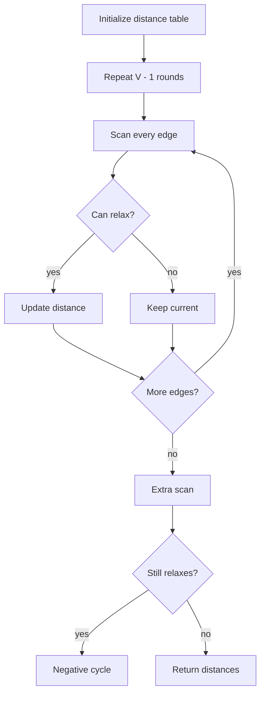

# Bellman-Ford 최단 경로 학습 및 기록 노트

> 💡 **이 글을 쓰는 이유:** Bellman-Ford는 다익스트라가 감당하지 못하는 음수 가중치 그래프에서 최단 거리를 계산하고, 음수 사이클까지 탐지한다. 대신 모든 간선을 반복해서 훑기 때문에 느리다. 이 느림이 왜 필요한지, 그리고 마지막 한 번의 추가 검사가 무엇을 증명하는지 기록한다.

---

## 1. 왜 필요한가? (Pain Point & Motivation)

* **이 개념이 구원해 줄 문제:** 음수 간선이 있는 그래프에서 시작점 기준 최단 거리를 구하거나, 최단 거리 자체가 정의되지 않는 음수 사이클을 찾아야 할 때 필요하다.
* **대안들의 한계 (기존의 똥떵어리들):** 다익스트라는 음수 가중치가 있으면 "먼저 꺼낸 후보가 최선"이라는 탐욕 전제가 깨진다. 모든 경로를 직접 나열하면 사이클 때문에 끝이 없고, 음수 사이클 여부도 명확히 판정하기 어렵다.

## 2. 현재 나의 상태 (Baseline)

* **여기까진 안다 (익숙한 땅):** 거리 테이블을 무한대로 초기화하고, 모든 간선을 반복해서 완화한다.
* **뇌정지 오는 부분 (안개 속):** 왜 정확히 `V - 1`번 반복하는지, 그리고 왜 한 번 더 완화되면 음수 사이클인지 직관이 흐려질 수 있다.
* **아직은 무리 (워너비):** 도달 가능한 음수 사이클만 문제인지, 그래프 어딘가의 음수 사이클을 모두 찾을 것인지 문제 조건에 맞춰 구분해야 한다.

## 3. 도달하고 싶은 목표 (Target State)

* **이 글을 끝내고 할 수 있는 일:** Bellman-Ford의 `V - 1`번 완화와 마지막 음수 사이클 검사를 상태 전이로 설명할 수 있다.
* **이것만은 건지자 (최소 성공 기준):** 최단 단순 경로는 최대 `V - 1`개의 간선을 사용하며, 그 이후에도 거리가 줄면 음수 사이클이 있다는 사실을 이해한다.

## 4. 시스템 번역 (Data Flow)

*이 개념을 하나의 살아있는 함수나 파이프라인으로 바라보고 해부해 봅니다.*

* **📥 인풋 (Input):** 시작 노드, 간선 리스트 `(u, v, weight)`, 노드 수
* **⚙️ 프로세스 (Processing):** 거리 배열을 초기화하고, 모든 간선을 `V - 1`라운드 동안 반복 완화한 뒤, 한 번 더 전체 간선을 훑어 추가 완화 가능성을 검사한다.
* **📤 아웃풋 (Output):** 최단 거리 테이블 또는 음수 사이클 존재 판정
* **💾 상태 (State):** 거리 테이블, 라운드 번호, 간선 리스트, 이번 라운드의 갱신 여부
* **🚨 터지는 조건 (Exception):** 시간 복잡도 `O(VE)`를 감당할 수 없거나, 도달 불가 노드를 완화하거나, 음수 사이클 반환 규약을 정하지 않은 경우

## 5. 핵심 구성요소 (Building Blocks)

* **레고 블록 1 (Distance Table):** 시작점에서 각 노드까지 현재까지 알려진 최단 거리를 저장한다.
* **레고 블록 2 (Edge List):** 완화 대상이 되는 모든 방향 간선을 한 줄씩 나열한다.
* **레고 블록 3 (Negative Cycle Check):** `V - 1`번 이후에도 줄어드는 거리가 있는지 확인한다.
* **서로 어떻게 맞물려 돌아가는가?:** 간선 리스트를 반복 스캔하면서 거리 테이블을 갱신하고, 마지막 추가 스캔으로 "더 줄어드는 경로가 있는가"를 검증한다.

## 6. 상태 전이 (State Transition)

*상태가 어떻게 변하는지 흐름을 한눈에 보여줍니다. (표 안의 문장은 짧고 직관적으로!)*

| 초기 상태 | 이벤트 (트리거) | 전이 조건 | 변경 후 상태 | "바뀐 걸 어떻게 알지?" (관찰 방법) |
| :--- | :--- | :--- | :--- | :--- |
| `INIT` | 시작점 설정 | 시작 노드가 유효함 | `ROUND_READY` | `dist[start] = 0` |
| `ROUND_READY` | 간선 스캔 | `dist[u] + w < dist[v]` | `RELAXED` | `dist[v]` 값 감소 |
| `RELAXED` | 다음 라운드 | 라운드 수가 `V - 1` 미만 | `ROUND_READY` | 모든 간선을 다시 스캔 |
| `ROUND_READY` | 추가 스캔 | 여전히 완화 가능 | `NEGATIVE_CYCLE` | 최단 거리 없음 판정 |
| `ROUND_READY` | 추가 스캔 | 완화 없음 | `DONE` | 거리 테이블 반환 |

## 7. 불변식 (Invariant: 절대 깨지면 안 되는 규칙)

* **하늘이 무너져도 지켜야 할 조건:** `k`번째 라운드가 끝나면 최대 `k`개 간선을 사용하는 최단 거리가 거리 테이블에 반영되어야 한다.
* **이게 깨지면 생기는 대참사:** 완화 순서나 도달 가능성 검사를 잘못 처리해 최단 거리를 놓치거나, 음수 사이클을 잘못 보고한다.
* **수수방관 금지 (검증법):** 작은 그래프에서 라운드별 거리 테이블을 직접 적어 보고, `V`번째 스캔에서 값이 줄어드는 케이스를 테스트한다.

## 8. 가장 작은 예제 (Minimal Viable Example)

* **뇌컴파일이 가능한 수준의 인풋:** `1 -> 2 (4)`, `1 -> 3 (5)`, `2 -> 3 (-2)`인 그래프에서 시작점은 `1`이다.
* **한 스텝씩 뜯어보기:** 첫 라운드에서 `dist[2]=4`, `dist[3]=5`가 되고, `2 -> 3 (-2)`를 통해 `dist[3]=2`로 줄어든다. 이후 추가 라운드에서 더 이상 줄지 않으면 최단 거리가 확정된다.
* **해피 엔딩 (결과):** `dist[1]=0`, `dist[2]=4`, `dist[3]=2`이고 음수 사이클은 없다.



```python
def bellman_ford(start, edges, n):
    inf = float("inf")
    distances = [inf] * (n + 1)
    distances[start] = 0

    for _ in range(n - 1):
        for u, v, weight in edges:
            if distances[u] == inf:
                continue
            if distances[u] + weight < distances[v]:
                distances[v] = distances[u] + weight

    for u, v, weight in edges:
        if distances[u] != inf and distances[u] + weight < distances[v]:
            return None

    return distances
```

## 9. 실패 사례 (What could go wrong?)

* **폭망 시나리오 1:** `dist[u] == INF`인 간선을 완화해 도달 불가 노드에서 거리가 퍼진다.
* **폭망 시나리오 2:** 마지막 추가 스캔을 빼먹어 음수 사이클을 정상 최단 거리처럼 반환한다.
* **폭망 시나리오 3:** 입력 크기가 큰데 Bellman-Ford를 사용해 `O(VE)` 시간 초과가 난다.
* **범인 검거 (어떤 불변식이 깨졌나?):** 라운드별로 최대 `k`개 간선을 사용하는 최단 거리가 반영되어야 한다는 7번 불변식 또는 도달 가능성 검사 조건이 깨졌다.

## 10. 뇌 확장하기 (Evolution & Variants)

* **조건을 살짝 바꾸면?:** 음수 간선이 없으면 Dijkstra가 더 효율적이고, 모든 쌍 최단 거리가 필요하면 Floyd-Warshall을 고려한다.
* **비슷한 놈들과 계급장 떼고 비교하기:** Dijkstra는 탐욕적으로 가장 가까운 후보를 확정하고, Bellman-Ford는 모든 간선을 반복 완화해 음수 간선까지 감당한다.
* **다른 데서 써먹기:** 환율 차익거래 탐지, 네트워크 라우팅 안정성 검사, 제약 조건 전파 문제에서 음수 사이클 판정 모델로 응용할 수 있다.

## 11. 최종 체크리스트 (Definition of Done)

*글 작성 후 아래 항목을 채웠는지 확인하는 셀프 검토용 목록이다.*

- [x] 1초 만에 이해하는 한 문장 요약이 있는가?
- [x] 일목요연한 상태 전이 표를 채웠는가?
- [x] 머릿속 그림을 표현한 구조도(다이어그램)가 포함되었는가?
- [x] 직접 굴려본 실습 결과(코드/로그)를 첨부했는가?
- [x] 에러를 마주하고 해결한 오답 노트가 있는가?
- [x] 주니어 동료에게 막힘없이 설명할 수 있는 수준인가?

## 12. 뇌에 새기는 복습 문장 (TL;DR Blank)

*복습 시 이 문장만 보고도 핵심을 떠올릴 수 있도록 빈칸을 채운다.*

> 이 개념은 결국 **음수 가중치가 있는 그래프에서 최단 거리와 음수 사이클을 판정하는 문제**를 해결하기 위해 태어났고,
> 우리가 계속 감시해야 할 핵심 상태는 **라운드별 distance table** 이며,
> **모든 간선을 완화하는 라운드와 마지막 추가 스캔** 조건이 발동할 때 상태가 바뀐다.
> 그리고 무슨 일이 있어도 **k번째 라운드가 끝나면 최대 k개 간선을 사용하는 최단 거리가 반영되어야 한다** 라는 불변식은 반드시 유지되어야만 한다!
