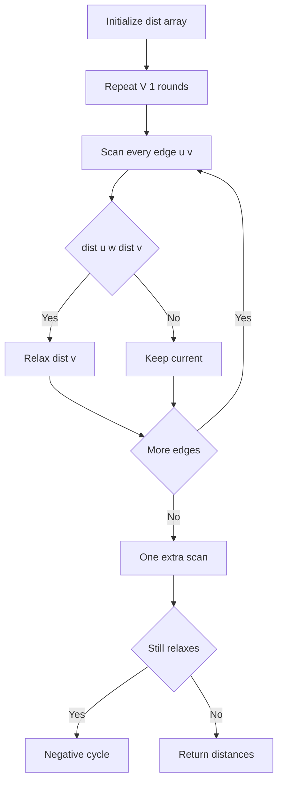
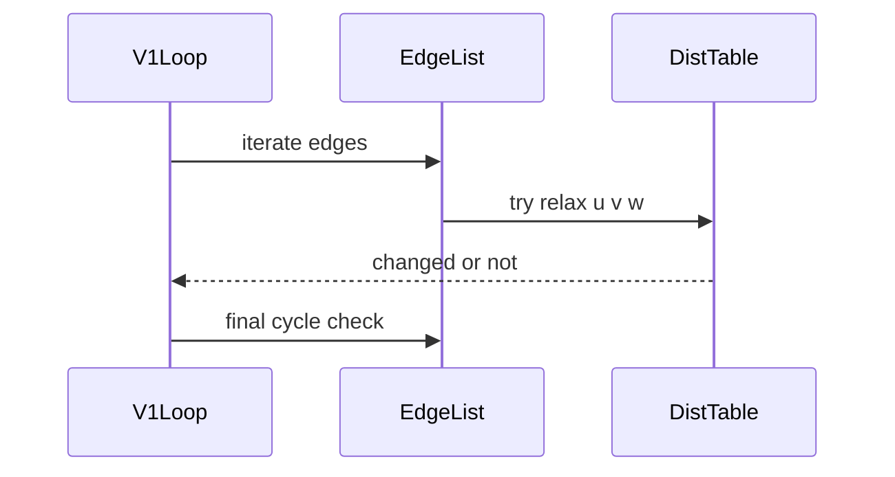

# 벨만-포드 (Bellman-Ford) - GitHub Pages 해설

## 문서 목적
- 원본 템플릿 `01-graph/04-bellman-ford.md` 의 내부 동작을 GitHub Markdown에서 바로 읽을 수 있게 설명합니다.
- 코드 레이어(초기화/루프/조건/갱신/종료)를 분해하고, Mermaid로 제어 흐름을 시각화합니다.
- 실전 문제에 붙일 때 반드시 수정해야 하는 지점을 체크리스트로 제공합니다.

## 입력 계약과 완료 판정

- 각 간선은 `(u, v, weight)`이며 예제는 방향 간선과 `1..n` 정점을 가정합니다.
- 음수 사이클 판정 범위를 **시작점에서 도달 가능한 사이클**로 한정합니다. 다른 연결 성분의 사이클까지 찾으려면 초기화가 달라집니다.
- `n-1`회 전에 갱신이 멈추면 조기 종료할 수 있지만, 이후 한 번의 전체 간선 검사로 사이클 여부를 분리합니다.
- 반환값이 거리표인지 음수 사이클 상태인지 호출자가 구분할 수 있는 계약이 필요합니다.

완료 조건은 사이클이 없을 때 모든 간선의 완화 부등식이 성립하고, 도달 가능한 음수 사이클을 추가 검사에서 탐지하며, 도달 불가능 정점은 무한대로 유지되는 것입니다.

## 원본 템플릿
- Source: [01-graph/04-bellman-ford.md](https://github.com/choisimo/document/blob/main/code/templates/algorithm-architect/01-graph/04-bellman-ford.md)

## 내부 메커니즘 (Flow)


## 내부 상호작용 (Sequence)


## 핵심 코드
```python
# [Bellman-Ford 템플릿: 아키텍트 버전]
# Use Case: 음수 가중치 허용, 음수 사이클 탐지
# Components: Distance Table, Edge List
# Constraint: O(VE) 시간 복잡도 (느림)

def bellman_ford(start, edges, n):
    # 1. 초기화 (Initialization Layer)
    INF = float('inf')
    distances = [INF] * (n + 1)
    distances[start] = 0
    
    # 2. 완화 반복 (Relaxation Loop)
    #    - (V-1)번 반복: 최단 경로는 최대 V-1개의 간선
    for i in range(n - 1):
        # 3. 간선 순회 (Edge Iteration)
        for u, v, weight in edges:
            if distances[u] != INF and distances[u] + weight < distances[v]:
                distances[v] = distances[u] + weight
    
    # 4. 음수 사이클 검출 (Negative Cycle Detection)
    #    - 한 번 더 완화가 일어나면 음수 사이클 존재
    for u, v, weight in edges:
        if distances[u] != INF and distances[u] + weight < distances[v]:
            return None  # 음수 사이클 존재
    
    return distances
```

## 코드 레이어 해설
- **Initialization**: 상태 테이블/포인터/큐/스택/부모 배열 등 탐색의 기준 상태를 만든다.
- **Process Loop / Recursion**: 입력 공간을 순회하며 상태 전이를 반복한다.
- **Decision Rule**: 분기 조건(완화 가능 여부, 유효 선택 여부, 종료 조건)을 적용한다.
- **State Update**: 거리/DP/집합/결과 배열을 갱신하고 다음 단계로 전달한다.
- **Termination**: 목표 도달, 범위 소진, 큐/스택 고갈, 사이클 검출 등으로 종료한다.

## 실전 적용 체크리스트
- 입력 자료구조 형식(인접 리스트, 간선 리스트, 정렬 여부, 1-index/0-index)을 먼저 고정한다.
- 시간 복잡도 한계에 맞게 자료구조를 교체한다 (`list.pop(0)` -> `deque.popleft` 등).
- 실패/예외 경로를 명시한다 (도달 불가, 음수 사이클, 빈 결과, 사이클 존재).
- 테스트는 최소 3개: 정상 케이스, 경계 케이스, 반례 케이스를 포함한다.
