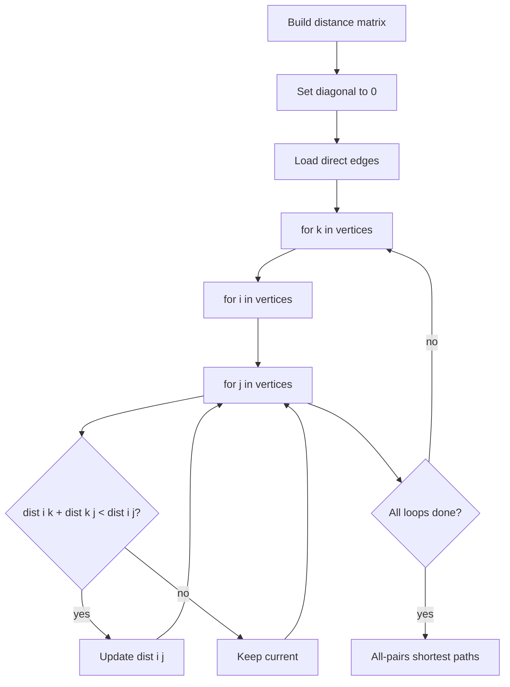

# Floyd-Warshall 모든 쌍 최단 경로 학습 및 기록 노트

> 💡 **이 글을 쓰는 이유:** Floyd-Warshall은 한 시작점이 아니라 모든 출발점과 도착점 사이의 최단 거리를 한 번에 구한다. 핵심은 "1번부터 k번까지의 정점만 경유지로 허용했을 때 최단 거리"를 점진적으로 갱신하는 DP 관점이다.

---

## 1. 왜 필요한가? (Pain Point & Motivation)

* **이 개념이 구원해 줄 문제:** 정점 수가 많지 않고, 모든 쌍 `i -> j` 최단 거리를 반복해서 물어보는 문제를 해결한다.
* **대안들의 한계 (기존의 똥떵어리들):** 모든 시작점에서 Dijkstra를 돌릴 수도 있지만 구현과 조건 관리가 복잡해질 수 있다. 정점 수가 작으면 2차원 행렬로 한 번에 끝내는 Floyd-Warshall이 더 단순하다.

## 2. 현재 나의 상태 (Baseline)

* **여기까진 안다 (익숙한 땅):** 거리 행렬을 만들고, 자기 자신으로 가는 거리는 0으로 둔다.
* **뇌정지 오는 부분 (안개 속):** 왜 루프 순서가 `k -> i -> j`여야 하는지, `k`가 단순 반복 인덱스가 아니라 "허용된 경유지 집합"이라는 점을 놓치기 쉽다.
* **아직은 무리 (워너비):** 음수 간선은 허용되지만 음수 사이클은 결과를 망가뜨린다는 조건까지 함께 처리해야 한다.

## 3. 도달하고 싶은 목표 (Target State)

* **이 글을 끝내고 할 수 있는 일:** 거리 행렬의 한 셀 `dist[i][j]`가 어떤 경유점 집합을 기준으로 갱신되는지 설명할 수 있다.
* **이것만은 건지자 (최소 성공 기준):** `dist[i][j] = min(dist[i][j], dist[i][k] + dist[k][j])`가 "k를 경유하는 길이 더 짧은가"를 묻는다는 사실을 정확히 이해한다.

## 4. 시스템 번역 (Data Flow)

*이 개념을 하나의 살아있는 함수나 파이프라인으로 바라보고 해부해 봅니다.*

* **📥 인풋 (Input):** 정점 수, 방향/무방향 간선 목록, 간선 가중치
* **⚙️ 프로세스 (Processing):** 거리 행렬을 초기화하고, 각 정점 `k`를 경유지로 허용하면서 모든 `i, j` 쌍의 거리를 갱신한다.
* **📤 아웃풋 (Output):** 모든 쌍 최단 거리 행렬, 필요하면 경로 복원용 next 행렬
* **💾 상태 (State):** 2차원 거리 행렬, 현재 경유 정점 `k`, 출발 정점 `i`, 도착 정점 `j`
* **🚨 터지는 조건 (Exception):** 정점 수가 커서 `O(V^3)`를 감당하지 못하거나, 행렬 초기화가 틀리거나, 음수 사이클을 확인하지 않는 경우

## 5. 핵심 구성요소 (Building Blocks)

* **레고 블록 1 (Distance Matrix):** `dist[i][j]`에 현재 허용된 경유지를 기준으로 한 최단 거리를 저장한다.
* **레고 블록 2 (Intermediary k):** 새롭게 허용할 경유 정점이다.
* **레고 블록 3 (Triple Loop):** `k`, `i`, `j` 순서로 모든 경유 가능성을 검사한다.
* **서로 어떻게 맞물려 돌아가는가?:** `k`가 하나씩 늘어날 때마다 모든 출발-도착 쌍이 `k`를 거치는 편이 더 짧은지 확인하고 거리 행렬을 갱신한다.

## 6. 상태 전이 (State Transition)

*상태가 어떻게 변하는지 흐름을 한눈에 보여줍니다. (표 안의 문장은 짧고 직관적으로!)*

| 초기 상태 | 이벤트 (트리거) | 전이 조건 | 변경 후 상태 | "바뀐 걸 어떻게 알지?" (관찰 방법) |
| :--- | :--- | :--- | :--- | :--- |
| `EMPTY_MATRIX` | 행렬 생성 | 정점 수가 주어짐 | `INF_FILLED` | 모든 셀이 INF |
| `INF_FILLED` | 대각선 초기화 | `i == j` | `SELF_ZERO` | `dist[i][i] = 0` |
| `SELF_ZERO` | 간선 입력 | 직접 간선 존재 | `DIRECT_LOADED` | `dist[u][v] = weight` |
| `DIRECT_LOADED` | 경유점 `k` 허용 | `dist[i][k] + dist[k][j] < dist[i][j]` | `RELAXED` | 특정 셀 값 감소 |
| `RELAXED` | 모든 `k` 완료 | 더 이상 경유점 없음 | `DONE` | 모든 쌍 최단 거리 행렬 반환 |

## 7. 불변식 (Invariant: 절대 깨지면 안 되는 규칙)

* **하늘이 무너져도 지켜야 할 조건:** `k`번째 외부 루프가 끝나면, `1..k` 정점만 경유지로 사용하는 모든 최단 거리가 행렬에 반영되어야 한다.
* **이게 깨지면 생기는 대참사:** 루프 순서가 틀리거나 초기화가 잘못되어 아직 허용하지 않은 경유지를 섞어 쓰거나, 직접 간선보다 긴 값을 남긴다.
* **수수방관 금지 (검증법):** 3개 정점 예제로 `k=1`, `k=2`, `k=3`이 끝날 때 행렬이 어떻게 바뀌는지 직접 비교한다.

## 8. 가장 작은 예제 (Minimal Viable Example)

* **뇌컴파일이 가능한 수준의 인풋:** `1 -> 2 (4)`, `2 -> 3 (1)`, `1 -> 3 (10)`
* **한 스텝씩 뜯어보기:** 직접 간선만 보면 `dist[1][3]=10`이다. `k=2`를 경유지로 허용하면 `dist[1][2] + dist[2][3] = 5`라서 `dist[1][3]`이 5로 줄어든다.
* **해피 엔딩 (결과):** 모든 경유지를 고려한 뒤 `1 -> 3`의 최단 거리는 직접 간선 10이 아니라 `1 -> 2 -> 3` 경로의 5가 된다.



```python
def floyd_warshall(edges, n):
    inf = float("inf")
    dist = [[inf] * (n + 1) for _ in range(n + 1)]

    for i in range(1, n + 1):
        dist[i][i] = 0

    for u, v, weight in edges:
        dist[u][v] = min(dist[u][v], weight)

    for k in range(1, n + 1):
        for i in range(1, n + 1):
            for j in range(1, n + 1):
                if dist[i][k] + dist[k][j] < dist[i][j]:
                    dist[i][j] = dist[i][k] + dist[k][j]

    return dist
```

## 9. 실패 사례 (What could go wrong?)

* **폭망 시나리오 1:** 자기 자신으로 가는 거리를 0으로 초기화하지 않아 모든 경로 갱신이 비정상적으로 시작된다.
* **폭망 시나리오 2:** 같은 방향의 중복 간선이 있는데 더 큰 가중치로 덮어써 최단 직접 간선을 잃는다.
* **폭망 시나리오 3:** 정점 수가 큰 입력에 Floyd-Warshall을 적용해 시간 또는 메모리 제한을 넘긴다.
* **범인 검거 (어떤 불변식이 깨졌나?):** `k`번째 루프 후 `1..k` 경유지만 사용한 최단 거리가 반영되어야 한다는 7번 불변식이 깨졌다.

## 10. 뇌 확장하기 (Evolution & Variants)

* **조건을 살짝 바꾸면?:** 실제 경로를 복원해야 하면 거리 행렬과 함께 `next[i][j]` 또는 predecessor 행렬을 유지한다.
* **비슷한 놈들과 계급장 떼고 비교하기:** Dijkstra는 한 시작점에서 여러 도착점, Floyd-Warshall은 모든 시작점에서 모든 도착점의 최단 거리를 한 번에 계산한다.
* **다른 데서 써먹기:** 도시 간 최단 거리표, 작은 그래프의 관계 추론, transitive closure, 모든 쌍 비용 비교에 활용할 수 있다.

## 11. 최종 체크리스트 (Definition of Done)

*글 작성 후 아래 항목을 채웠는지 확인하는 셀프 검토용 목록이다.*

- [x] 1초 만에 이해하는 한 문장 요약이 있는가?
- [x] 일목요연한 상태 전이 표를 채웠는가?
- [x] 머릿속 그림을 표현한 구조도(다이어그램)가 포함되었는가?
- [x] 직접 굴려본 실습 결과(코드/로그)를 첨부했는가?
- [x] 에러를 마주하고 해결한 오답 노트가 있는가?
- [x] 주니어 동료에게 막힘없이 설명할 수 있는 수준인가?

## 12. 뇌에 새기는 복습 문장 (TL;DR Blank)

*복습 시 이 문장만 보고도 핵심을 떠올릴 수 있도록 빈칸을 채운다.*

> 이 개념은 결국 **모든 출발점과 도착점 사이의 최단 거리를 한 번에 구하는 문제**를 해결하기 위해 태어났고,
> 우리가 계속 감시해야 할 핵심 상태는 **2차원 distance matrix** 이며,
> **새 경유점 k를 허용하는** 조건이 발동할 때 상태가 바뀐다.
> 그리고 무슨 일이 있어도 **k번째 외부 루프가 끝나면 1..k 정점만 경유지로 사용하는 모든 최단 거리가 행렬에 반영되어야 한다** 라는 불변식은 반드시 유지되어야만 한다!
